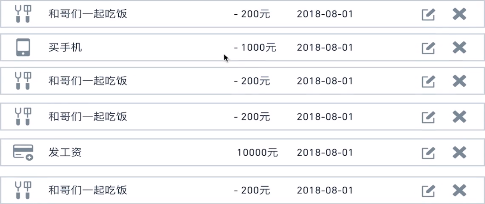
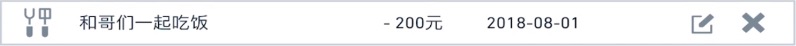
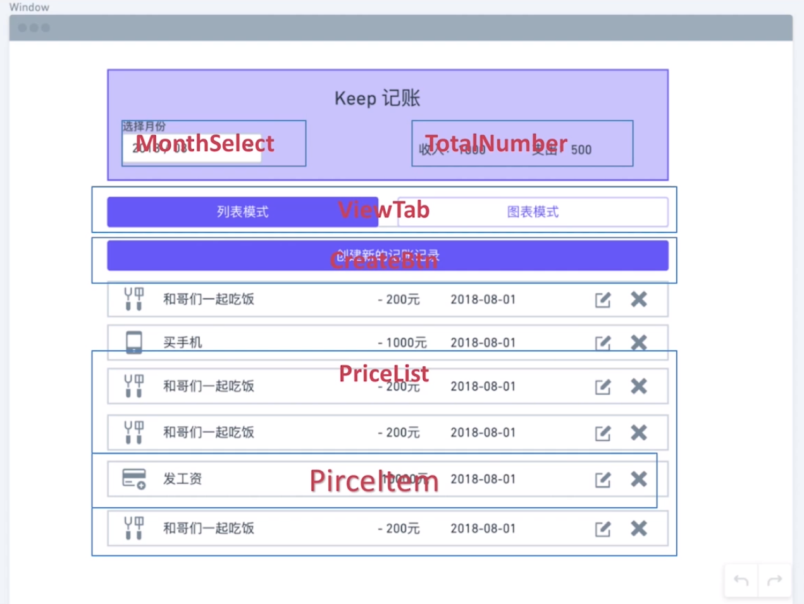
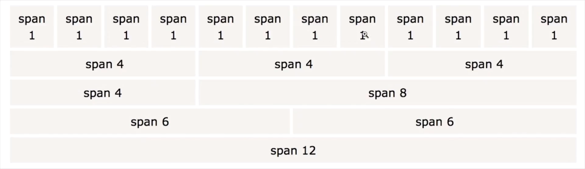
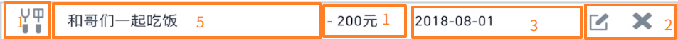
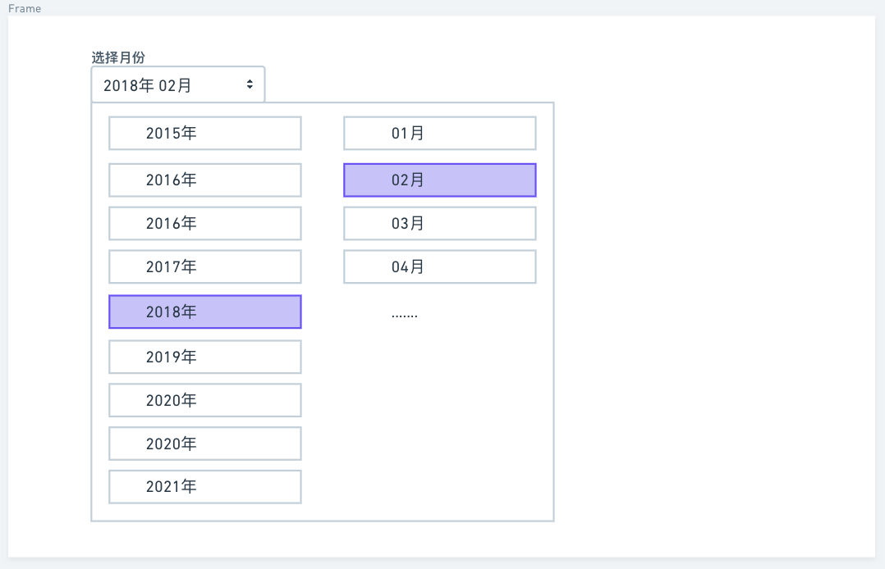

# 第 3 章 首页：庖丁解牛

[TOC]

## 3-1 拆分静态组件

### React 理念

> [中文官方文档文章](https://react.docschina.org/docs/thinking-in-react.html)

在拆分组件之前，我们先来了解一个新的概念，被称为 thinking in React，也就是 React 理念。它是 React 官方推荐的开发 React 应用的思考方式。

#### React 理念步骤初步理解

- 第一步，把 UI 划分出组件层级
  - 可以找 UX 设计聊一聊，查看一下他所划分的图层，也许他图层的命名就是我们最终想要的结果
  - 那么你如何知道哪一部分可以成为一个组件呢？想想在编写代码的时候，在什么时候需要新建一个函数，什么时候需要新建一个对象，那么思考的方式是相同的
  - 在理想的状况下，一个组件只做一件事情。如果一个组件的功能不断的丰富，那么它就应该被分成更小的组件，那这个过程就像此章的标题一样「庖丁解牛」，将一个大的项目拆成一块块的乐高积木，这个积木就是我们所说的静态组件。
- 第二步，创建应用的静态版本
  - 有了组件的层级划分之后，然后我们把每一个划分好的组件组合在一起来实现应用，那么最简单的方法是创建一个静态版本，传入一个静态模型，渲染对应的 UI，但是它们之间没有任何的交互，因为我们最好是将这些过程解耦，创建一个个的静态版本。
  - 而这个过程是写样式代码而不会牵扯到很多逻辑问题，而添加交互则需要我们更多的写逻辑。
  - 由于之间没有交互，所以这又像是积木堆叠的过程，没有大脑，没有逻辑。
- ......
  - 之后的步骤在这里不做讲解，随着项目的开发和一点点的深入，就会慢慢的知道 React 理念的其他概念和步骤。（当然你也可以自己通过查看文章来了解 React 理念）

### 拆分展示型组件

#### 首页组件划分

**Header**


- 左边的：MonthSelect 组件
- 右边的：TotalNumber 组件

**ViewTab**


**CreateBtn**


**EntryList**



**EntryItem**



**完整图示：**



## 3-2 第一个展示型组件 - 条目列表

### 简单分析

- 对于价格列表，我们应该是通过一个 Array 中的每一条数据来对应列表中每一项。
- 是否有交互？
  - 右边有两个按钮，一个编辑，一个删除，点击这两个按钮应该分别有两个回调，我们只需要将对应的信息传入这个回调就可以了。
- 所以，这个列表组件应该有三个 props，一个是传入的数组，用于渲染每一条数据，有两个函数，处理编辑和删除的交互。

### 分析组件属性

```jsx
<PriceList
  items={items}
  onDeleteItem={onDeleteItem}
  onEditItem={onEditItem}
/>
```

### 暂定确定数据结构

这里我们通过页面的展示来确定数据的格式，我们称之为 Mock 数据，这个数据也会跟着真实的后端数据做一些调整。


应该有：

- id
- title
- price
  - 注意价格是有负号和没有负号的，负号表示支出，而是否有负号的判断是根据数据中的`type`来确定 data（但这个处理的逻辑是放在具体的组件显示数据的位置，而不是放在数据状态中）
- category
  - 分类应该是一个复杂的数据类型，因为需要表示是支出还是收入并且还需要表示图标
  - id
  - name（用字符串来判断显示图标）
  - type
    - `"income"`
    - `"expense"`

代码如下：

```jsx
const items = [
  {
    id: 1,
    title: "去成都旅游",
    price: 1000,
    data: "2019-03-16",
    category: {
      id: 1,
      name: "旅行",
      type: "outcome"
    }
  }
]
```

- 注意，对于一个对象数据而言，我们都给了一个 id


### 使用 Bootstrap

> 非常有意思的事情出现了，在这节课的问答中有一个同学提出「既然都使用了 react，为什么不用 reactstrap」，老师很谦虚的回答「同学 你这个提议很好哈 你写代码的时候就可以使用 reactstrap ，我写的时候还不知道有这个组件库，谢谢你 让我学到了哈。」
>
> 这个组件库的地址：<https://reactstrap.github.io/>

使用 Bootstrap 和使用组件库有些许的不同，虽然所呈现的 UI 基本相似，但 Bootstrap 主要是使用 class，而组件库是直接引用组件。

使用 bootstrap 的好处在于只需要写 html 部分就可以，所以的 css 都是通过 class 来实现的。

#### list-group

由于我们要渲染的 UI 是列表，那么就可以使用 Bootstrap 的 [list-group](https://getbootstrap.com/docs/4.3/components/list-group/) 来帮助我们增加开发效率

使用方式很简单，如下：

```jsx
<ul class="list-group">
  <li class="list-group-item active">Cras justo odio</li>
  <li class="list-group-item">Dapibus ac facilisis in</li>
  <li class="list-group-item">Morbi leo risus</li>
  <li class="list-group-item">Porta ac consectetur ac</li>
  <li class="list-group-item">Vestibulum at eros</li>
</ul>
```

#### Grid system

并且，我们 UI 列表中的每一行（或者说每一项）是呈现一列一列的效果，那么我们就可以使用 BootStrap 为我们提供的 [Grid system](https://getbootstrap.com/docs/4.3/layout/grid/) 来帮助我们快速的分栏。

Grid 其实很简单，它将一行分为了 12 个格子，我们可以根据需求将这 12 个格子进行划分，如下图：



比如在我们要实现的这一行中，可以划分出五列，我们将 12 个格子分配给这五列，可以是 1-5-1-3-2 ：



使用 Grid 的好处是能够方便我们快速的排版。

#### 布局（layout）

现在我们的 PriceList 组件使用了如下的 DOM 结构：

```jsx
<ul className="list-group list-grop-flush">
  {items.map(item => (
    <li className="list-group-item d-flex justify-content-between align-items-center" />
  ))}
</ul>
```

在这里需要讲解一下这些 class 的作用。

我们知道，CSS 的重点就在于布局，而传统的布局是基于盒装模型，会依赖于 `display`、`position`、`float` 等来实现一些布局上的样式，而对于一些特殊的布局在实现上会很不方便，比如垂直居中，所以在很久之前 W3C 提出了一个解决方案—— flex 布局，并且 flex 是响应式的，目前也是很多布局时的首选方案。

回到代码中：

- `d-flex`就是指将元素设置为一个 flex 容器，其子元素则称为 flex-item，然后通过添加一些类来设置一些 flex 容器所独有的属性来完成一些布局。
- `justify-content-between`可以让 flex-item 在主轴方向上实现自动分开，并且靠近两边的元素则贴着盒子的边缘。
- `align-items-center`使元素在侧轴上实现居中的效果。


### 完成的部分

- 使用了 bootstrap 的 grid system 和 flex，**从而使布局更加的简单，比如分列、居中等**
- 暂时使用文字来代替图标
- 注意使用 functional component 的格式


## 3-3 为项目选择图标库

图标的演化正好是 web 开发的缩影，从最早的**雪碧图**，实际就是把很多小图片（图标）拼接到一张大图片之上，根据每个图片的位置，使用`background-position`进行定位，但是这样的图标有很多限制，不能缩放和使用 css 控制。

接着，出现了 iconfont，解决了这些限制，加载字体文件，通过字符编码来代替图标，然后通过特定的 class 加上伪元素添加到浏览器中。

现在比较流行是的 inline-svg，svg 和 iconfont 有什么优势呢？

- svg 可以完全的控制，你可以使用任何的 css 属性来控制它，而 iconfont 本身是字符，所以只能控制字符相关的属性。
- iconfont 需要下载字体文件
- iconfont 的语义和可访问性不好，比如一个`<span>`标签就代表了一张图标，读屏幕软件在读取屏幕时会将其中的编码字符也会读出来。
- iconfont 在不同的浏览器中可能会渲染成各种奇怪的字符

那么我们如何获取这些 svg 的图标呢？难道需要自己使用 Sketch（矢量设计工具） 或者 PS 来制作呢？其实完全没有这个必要，因为网上有很多免费的 svg 可以直接使用，比如 icomoon、Ionicons 等

这里我们使用 Ionicons，Ionicons 时一个用于开发跨平台应用的框架。

> [官网地址](https://ionicons.com/)

并且，对于 React，我们可以直接使用 [react-ionicons](https://zamarrowski.github.io/react-ionicons/) 库，本课程使用的是 2.1.6 的办法，因为最新的是 3.x 有破坏性更新，因此如下安装：

```shell
npm install react-ionicons@2.1.6
```

使用：

```jsx
import Ionicon from "react-ionicons"

<Ionicon
  className="rounded-circle"
  fontSize="30px"
  style={{ backgroundColor: "#28a745", padding: "5px" }}
  color={"#fff"}
  icon="ios-create-outline"
/>
```

注意最新版本 3.x 已经和现在的使用方法不同了，需要引入不同的组件和使用不同的属性。


## 3-4 PropTypes 属性检查

JavaScript 是弱类型语言，在创建变量时不用考虑变量的类型，虽然这样可以省略很多事情，但当应用程序越来越复杂的时候就会存在一些潜在的 bug，比如变量的类型应用错误。对于这个问题，有些工程师发明了一些工具，比如 TypeScript，它是 JavaScript 的一个超集，提出了很多新的概念，比如有 interface 等等，但使用存在着学习成本。对于 React 来说，也许不需要使用这么一个复杂的工具，因为它的内部已经提供了用于属性检查的工具——PropTypes。

### 使用 PropTypes

比如在我们的 Price

```jsx
import PropTypes from 'prop-types'

PriceList.propTypes = {
  items: PropTypes.array.isRequired,
  handleModifyItem: PropTypes.func.isRequired,
  handleDeleteItem: PropTypes.func.isRequired
}
```

### 使用 defaultProps 属性

有时当容器组件或者父组件没有向展示组件或子组件传相应的属性时，在这种情况下，我们又想要使用一些默认的值，就可以使用 defaultProps 属性。 比如：

```jsx
PriceList.defaultProps = {
  handleModifyItem: () => { alert('我正在使用默认属性')}
}
```


> 查看更多关于 PropTypes 的内容：[使用 PropTypes 进行类型检查](https://zh-hans.reactjs.org/docs/typechecking-with-proptypes.html)


## 3-5 切换 Tab 组件

### 组件分析

如图：


我们接下来要实现的是 TotalPrice 组件和 ViewTap 组件。先来进行分析：

- TotalPrice 组件很简单，只需要显示本月的收入和支出是多少就可以了，因此我们给这个组件传入两个属性，一个是收入的数量，一个是支出的数量。
- ViewTap 组件是当我们点击某一个 Tap 时，会使相应的 Tap 高亮并且显示对应的视图，那么我们就想要传入一个回调用于改变其高亮，并且需要传入一个参数来告诉组件默认情况下应该显示的模式。

组件属性大概如下：

```jsx
<ViewTap
  activeTab='list'
  onTabChange={onTabChange}
/>

<TotalPrice
  income={10000}
  expense={10000}
/>
```

### 完成 Tab 组件 :star:

#### 利用函数来返回对应类名

```jsx
const generateLinkClass = (current, view) => {
  return current === view ? 'nav-link active' : 'nav-link'
}

function ViewTap({ activeTab, handleTabChange }) {
  return (
    <ul className="nav nav-tabs nav-fill my-4">
      <li className="nav-item">
        <a href="#1" className={generateLinkClass(activeTab,'list')}>
          列表模式
        </a>
      </li>
      <li className="nav-item">
        <a href='#1' className={generateLinkClass(activeTab,'chart')}>
          图标模式
        </a>
      </li>
    </ul>
  )
}
```

先看上面这一部分，除了这些 bootstrap 提供的类`nav`来帮助我们快速实现 Tab 的 UI 以外，最值得我们学习的是`generateLinkClass`函数，这个函数作用是传入当前所显示的视图名称——`activeTab`属性，返回对应的带有`active`的类，而最有意思的是通过对比传入的值，和利用在不同视图下的名称作为一个比较，来返回对应类，这样无论是有多少个 Tab，我们都可以对第二个参数传入不同的类型来实现返回对应类的功能。

（但以上方法是针对于没有通过循环的方式生成的 Tab，如果是通过数组的方式来形成的 Tab，那么就可能不需要使用这个函数，而是直接通过在内部的一个三元操作符来做处理） 

#### 创建常量

```jsx
<ViewTab 
  activeTab='list'
/>

<ViewTab
  activeTab='chart'
/>
```

如上代码，我们向 ViewTab 组件传入`'list'`或者`'chart'`来值来实现某些功能，在这里的`'list'`或者`'chart'`字符串会在整个项目中经常使用到，所以我们可以将这两个字符串存储在常量中，这样的好处是使用常量来传值时，如果发生拼写错误会在控制台提示我们，而如果只是通过传入字符串，当出现拼写错误时可能会花费我们大量的时间去寻找 bug。

我们将常量存放在`src/utility.js`中，代码如下：（这里 utility 可以翻译为"实用工具" 或者 "实用程序"）

```jsx
export const LIST_VIEW = 'list'
export const CHART_VIEW = 'chart'
```

然后再在组件中引入使用即可：

```jsx
// src/components/ViewTab.js
import { LIST_VIEW, CHART_VIEW } from "../utility"

<li className="nav-item">
  <a
    href="#1"
    className={generateLinkClass(activeTab, CHART_VIEW)}
    onClick={e => {
      e.preventDefault()
      handleTabChange(CHART_VIEW)
    }}
    >
    <Ionicon
      className="rounded-circle"
      fontSize="30px"
      color="#007bff"
      icon="ios-pie"
      />
    图标模式
  </a>
  </li>
```


### 3-6 动手实战 - 实现 TotalPrice 组件

完成一个价格总和组件，根据传入的收入和支出价格 显示这两种价格

组件原型图截图：


组件设计：

```jsx
<TotalPrice
  income={1000}
  expense={1000}
/>
```

提示：
1 使用 Bootstrap 的 grid system 完成分成两列的布局 <https://getbootstrap.com/docs/4.1/layout/grid/>
2 注意使用 PropTypes 进行属性的检查

最终组件代码：
请见源代码： src/components/TotalPrice


##  3-7 月份选择组件 - 需求分析

在之前的课程中，我们一直在完成比较简单的**静态组件**，而且都是**函数组件**，根据所传入的属性来进行对应的展示，这节课会完成项目中相对较为复杂一点的组件——月份选择。

对于一个较为复杂的组件，我们也可以通过分解任务来一步一步完成。首先我们需要对这个组件进行分析，确定要完成的阶段和步骤。

### 原型图分析

如图：



- 选择年月的按钮：
  - 显示当前传入的年月
  - 点击选择月份按钮可以打开下拉框，再次点击会关闭
- 下拉框：
  - 下拉框中的内容分为两列，左边是传入的年份，当前年份与前后四年加起来的所有 9 个选项；右边是月份的选项，从 1 月到 12 月，一共 12 个选项。
  - 在下拉框中会根据当前传入的年份与月份高亮对应的选项。
  - 当点击其他的年或者月份的选项时，应该切换高亮（当前高亮消失，所选选项高亮）
  - 当点击月份的选项时，触发回调来改变当前年月，同时下拉菜单关闭。

### 需求分析

- 按钮显示传入的年月，点击按钮可以打开和关闭下拉菜单。
- 显示前后四年一共 9 个选项的年份，和 1 月到 12 月一共 12 个选项的月份。
- 打开菜单以后，传入的年和月高亮。
- 点击不同的年可以切换；点击月份出触发回调。

### 组件属性

```jsx
<MonthPicker
  year={2019}
  month={3}
  handleChangeDate={handleChangeDate}
/>
```

### 分段开发

通过分段开发，让原本相对复杂的开发简化，使功能逐步完善。

1. 创建一个按钮，显示传入的年和月份
2. 创建下拉菜单，点击按钮可以显示，再点击隐藏
3. 在下拉菜单中，显示两列，分别为年份和月份的信息
4. 给这两列添加对应的选项高亮
5. 添加点击年份和月份后的交互


## 3-8 & 3-9 —— 月份选择组件开发

### 创建一个按钮，显示传入的年和月份

由于 MonthPicker 组件内部有一个下拉选择框，而这个下拉选择框需要通过某一个状态来表示显示和隐藏，所以 MonthPicker 组件应该是一个 Class Component 而非 Function Component

组件的代码如下：

```jsx
class MonthPicker extends Component {
  render() {
    const { year, month } = this.props
    return (
      <div className="dropdown month-picker-component">
        <h4>选择月份</h4>
        <button className="btn btn-lg btn-secondary dropdown-toggle">
          {`${year}年 ${month}月`}
        </button>
      </div>
    );
  }
}
```

- 使用 bootstrap 的`.dropdown`类来方便实现下拉菜单
- 给每一个特别的组件取一个特殊的类名`.month-picker-component`
- 给`<button>`按钮设置一些样式：
  - `.btn`设置为一个按钮——会有一些特别的样式和交互动画
  - `.btn-lg`设置按钮的大小
  - `.btn-secondary`设置按钮的颜色
  - `.dropdown-toggle`为按钮添加一个下拉小图标

#### 利用一个工具函数对显示数据进行转换

上面代码存在一个问题，显示的月份当小于 10 时，比如 3，没有以 03 的形式显示出来，所以需要利用函数对传入的数据进行转换，如下：

```jsx
// src/utility.js
export const padMonthLeft = month => month < 10 ? '0'+ month : month
```

调用：

```jsx
<button className="btn btn-lg btn-secondary dropdown-toggle">
  {`${selectYear} 年 ${padMonthLeft(selectMonth)} 月`}
</button>
```

### 创建下拉菜单，点击按钮可以显示，再点击隐藏

代码：

```jsx
toggleDropdown = () => {
  this.setState({ isOpen: !this.state.isOpen })
}

<button
  className="btn btn-lg btn-secondary dropdown-toggle"
  onClick={this.toggleDropdown}
  >
  {`${year}年 ${padMonthLeft(month)}月`}
</button>
{isOpen && (
  <div className="dropdown-menu" style={{ display: "block" }}>
    <h2>Hello Wrold</h2>
  </div>
)}
```

- 先说第 1 到 3 行的代码，这是`create-react-app`脚手架提供给我们的所谓「属性初始化器」的东西，可以帮助我们正确的绑定回调函数，这个语法是默认开启的。
- `.dropdown-menu`提供了一个下拉菜单，但是默认是`display:none`所以需要手动更改一下，之所以是`display:none`是因为默认是让我们通过点击`button.btn`来改变`dispaly`属性，但由于我们是通过 React 的 state 来判断是否显示这个组件，所以可以直接更改为`display:block`

### 在下拉菜单中，显示两列，分别为年份和月份的信息

现在我们再来看一下这个组件：


下拉框中的月份和年份实际上都是由一些连续的数字所组成的，我们需要的是有两个数组分别对应年份和月份，并且这两个数组中的数字是连续的，那么现在需要处理的问题是如何获得这样的两个数组。

对于年份的数组，我们只需要有一个 [-4,4] 的 9 个数字，这样让其加上如前的年份，也就是 2019 就可以得到上下 4 个年份的数组了。

而对于月份只需要一个连续的 [1,12] 就可以了。

那么可以再 utility.js 中创建一个工具函数帮助我们实现这两个数组：

```jsx
export const createRangeArr = (size, startAt = 0) => {
  const arr = []
  for(let i = 0; i < size; i++){
    arr[i] = startAt + i
  }
  return arr
}
```

应用：

```jsx
const { year, month } = this.props
const { isOpen } = this.state
const monthRange = createRangeArr(12, 1)
const yearRange = createRangeArr(9, -4).map(number => year + number)

<div className="col border-right">
  {yearRange.map((yearNumber, index) => (
    <a key={index} className="dropdown-item" href="#1">
      {yearNumber + " 年"}
    </a>
  ))}
</div>
<div className="col">
    {monthRange.map((monthNumber, index) => (
      <a key={index} className="dropdown-item" href="#1">
        {padMonthLeft(monthNumber) + " 月"}
      </a>
    ))}
</div>
```

- 第 4 行代码中，将生成的 [-4,4] 数组与传入的年份分别相加返回一个上下 4 年的数组。
- 第 16 行记得利用`padMonthLeft`工具函数转换显示的数字。

### 给这两列添加对应的选项高亮

实现这个功能，就是利用所传入的年份和月份进行一个判断从而添加或者不添加高亮的类。

代码如下：

```jsx
{yearRange.map((yearNumber, index) => (
  <a
    key={index}
    className={
      yearNumber === year
        ? "dropdown-item active"
      : "dropdown-item"
    }
    href="#1"
    >
    {yearNumber + " 年"}
  </a>
))}

{monthRange.map((monthNumber, index) => (
  <a
    key={index}
    className={
      monthNumber === month
        ? "dropdown-item active"
      : "dropdown-item"
    }
    href="#1"
    >
    {padMonthLeft(monthNumber) + " 月"}
  </a>
))}
```

第 5 ~ 7 和第 19 ~ 21 所实现的逻辑是相同的，那么我们可以将其抽象为一个函数：

```jsx
addActiveClass = (propValue, arrValue) => {
  return propValue === arrValue ? "dropdown-item active" : "dropdown-item"
}

// 以显示年份的 UI 为例
{yearRange.map((yearNumber, index) => (
  <a
    key={index}
    className={this.addActiveClass(year, yearNumber)}
    href="#1"
    >
    {yearNumber + " 年"}
  </a>
))}
```

分析一下关于何时封装、抽象函数，在这个例子中，都是通过对比两个参数值，一个是数组中每一项的值，一个是从父组件传过来的值，从而返回相应的类名，这里两个地方所返回的类名是相同的，而且判断的方式也相同，只需要通过函数获取不同的比较值就可以了，所以可以抽象为一个函数，简便写法，让代码看起来更简洁一些。

（函数的特点是将内部的相同逻辑抽象到一块，通过传入不同的参数来实现返回不同的值。）

### 添加点击年份和月份后的交互

所谓的交互，就是当你点击年份或月份选项中的某一项后，会使所选项高亮，特别是年份，因为当点击月份时会直接关闭下拉菜单。

那这里要实现这个效果，就有两种思路，一种是利用现成的来源于于父组件的数据，这里是`props.year`和`props.month`，并且父组件的数据应该是来自于其 state 的，那么当点击某一个年份或者月份时，需要将所点击的按钮的值通过回调传递给父组件，让父组件中的 state 发生改变从而改变子组件的视图。这样的方式有点繁琐。

另一种方式是，MonthPicker 自己管理自己的组件状态，不过初始化的状态来源于父组件，那点击事件触发后直接改变组件状态即可，只是当点击月份时，我们通过回调将状态返回出去即可。

这里我们使用第二种方式，代码如下：

```jsx
constructor(props) {
  super(props)
  const { year, month } = this.props
  this.state = {
    isOpen: false,
    selectYear: year ? year : new Date().getFullYear(),
    selectMonth: month ? month : new Date().getDate() + 1
  }
}

handleSelectYear = (e, year) => {
  e.preventDefault();
  this.setState({
    selectYear: year
  })
}

handleSelectMonth = (e, month) => {
  e.preventDefault()
  this.setState({
    isOpen: false,
    selectMonth: month
  })
  // 把当前所选择的年月传递出去
  this.props.handleChangeDate(this.state.selectYear,month)
}

// 以月份为例
{monthRange.map((monthNumber, index) => (
  <a
    key={index}
    className={this.addActiveClass(selectMonth, monthNumber)}
    href="#1"
    onClick={e => this.handleSelectMonth(e, monthNumber)}
    >
    {padMonthLeft(monthNumber) + " 月"}
  </a>
))}
```

- 我们刚开始初始化了组件状态，如果父组件有值则使用，没有就直接使用现在的月份和年份

- `handleSelectYear`与`handleSelectMonth`分别是年份每一项的 Click 事件监听方法和月份每一项 Click  事件监听方法。
  - 这里可以抽象为一个函数，然后通过给回调传入第三个参数，比如一个是`month`一个是`year`来作为判断，从而执行不同的逻辑，但又很没有必要，因为两个函数的相似点还是太少了。

#### 添加需求 - 点击页面其他位置也能关闭下拉菜单

实现这个需求，需要在`componentDidMount`生命周期中对`document`绑定`click`事件，如下：

```jsx
componentDidMount() {
  document.addEventListener("click", e => {
    this.setState({
      isOpen: false
    })
  })
}

componentWillUnmount() {
  document.removeEventListener("click")
}
```

但这之后会有问题，当我们点击日期选择按钮时，并不会显示下拉框，原因在于**事件冒泡**，最终 click 事件会触发绑定在`document`上的 click，从而使`isOpen:false`，那么解决的办法当然是阻止冒泡行为。如下：

```jsx
toggleDropdown = e => {
  e.preventDefault()
  e.nativeEvent.stopImmediatePropagation()
  this.setState({ isOpen: !this.state.isOpen })
}

handleSelectYear = (e, year) => {
  e.preventDefault()
  e.nativeEvent.stopImmediatePropagation()
  //...
}

handleSelectMonth = (e, month) => {
  e.preventDefault()
  e.nativeEvent.stopImmediatePropagation()
  //...
}
```

在上面三个监听事件方法中都执行了`e.nativeEvent.stopImmediatePropagation()`这一行代码，但这个 API 实际上只阻止`document`上绑定的事件，而并不会真正的阻止所有冒泡行为。具体原因可以查看如下如下文档，了解关于 React 中阻止事件冒泡，并且了解**合成事件**与**原声事件**。

> [React-阻止事件冒泡](https://www.jianshu.com/p/d51574db5e32)

