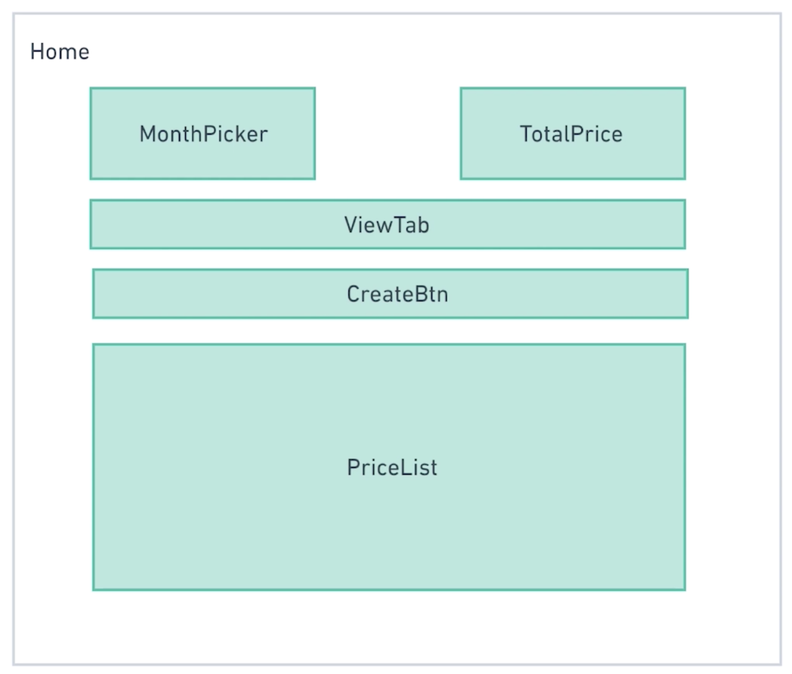
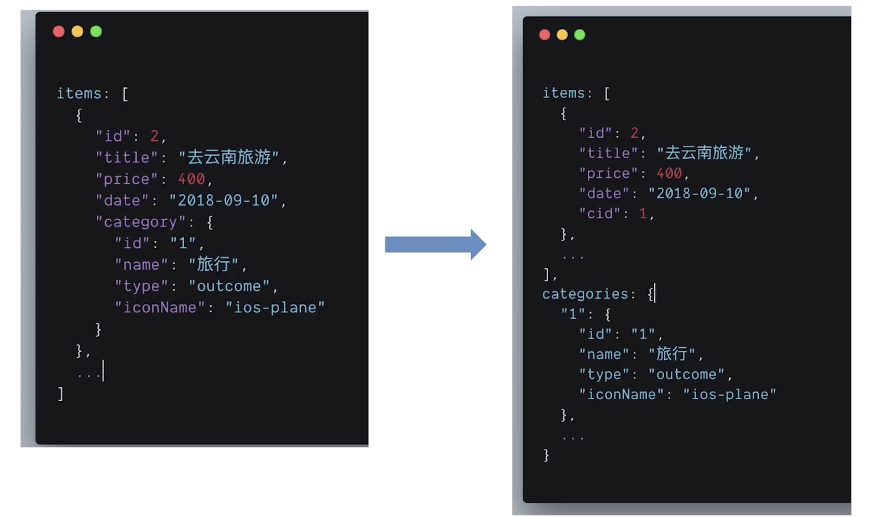
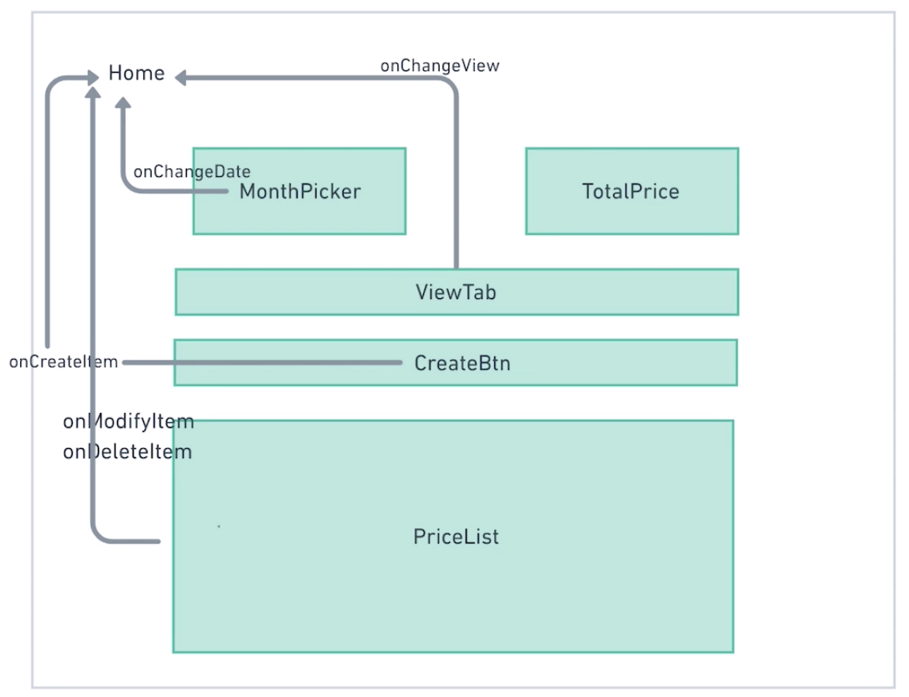
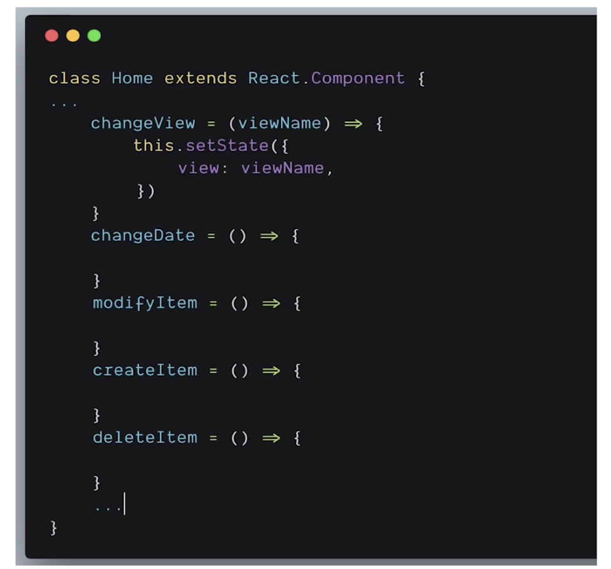
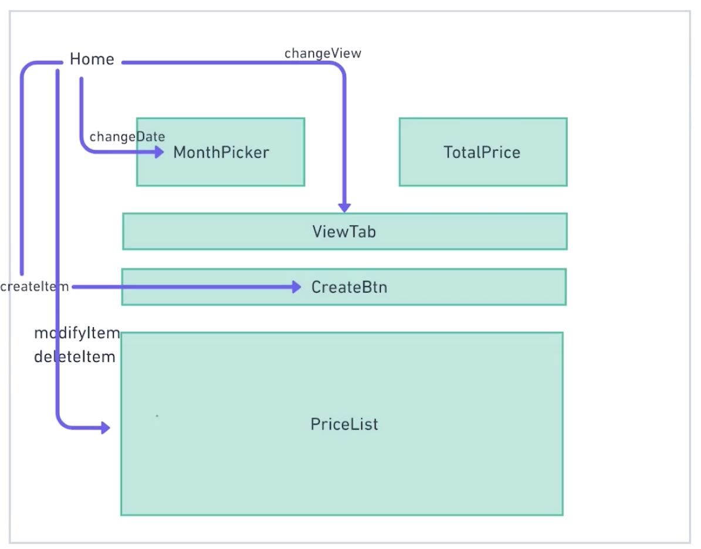

# 第 4 章 首页：乐高积木

[TOC]

## 4-1 组合所有静态型组件

如图：



接下来我们将之前拆分实现的静态组件或称展示型组件进行组合，而容纳这些组件的容器组件为 Home.js（虽然这里这个组件也表示是整个页面）

Home 组件关心数据的流动方式，并且为展示型组件提供数据和操作数据的方法（回调函数）

### 代码部分：

#### 关于 flex 布局的问题

- flex 元素本身并不会使宽度减少，比如之前是 block 元素，宽度是父元素的 100%，将其改变为 flex 元素，其宽度并不会变化。
- flex 元素的子项宽度会发生变化，那些成为 flex 的子元素的 block 元素，其宽度并不再是其父元素的 100%，而是其内容所撑开的宽度，如果想要设置其宽度，可以使用 flex 属性。
- 如果想让 flex 子元素在其 cross 轴上占据整个宽度，可是使用`align-items: stretch`属性，对应的 bootstrap 类为`align-items-stretch`

#### 使用现有状态中的数据来计算值

在 `<TotalPrice>`组件中，我们需要容器组件传入两个属性`income`和`expense`，用于显示本月的总体支出与收入，那么对于这两个属性值或者称为展示型组件的状态值，我们可以直接利用容器组件现有状态`items`中的每一项中的`price`来计算得出，而不需要单独将这两个状态值存储在容器组件中，并且也不需要将这两个状态值存储在远端的数据库中。

状态 items：

```jsx
const items = [
  {
    id: 1,
    title: "去成都旅游",
    price: 1000,
    date: "2019-03-16",
    category: {
      id: 1,
      name: "旅行",
      type: "expense",
      iconName: "ios-plane"
    }
  },
  //...
  ]
```

在`render()`中计算值：

```jsx
let totalIncome = 0,
    totalExpense = 0
items.forEach(item => {
  if (item.category.type === TYPE_INCOME) {
    totalIncome += totalIncome + item.price
  } else {
    totalExpense += totalExpense + item.price
  }
})
```


## 4-2 分析设计 State 结构

到目前为止，我们拥有了页面的首页，但这个首页只是一个静态版本，它并不能实现一些交互，比如当我们选择不同的月份时，列表内容会发生一些改变。那么接下来就是为我们的应用添加一些交互，使其更像是一个 App，而不是一个用于展示内容的页面。

那么，交互所要改变的大部分内容实际上在代码层面是改变数据，并且 React 应用实际上也是通过数据（state）的改变来实现页面的改变的，在 React 应用中 state 的改变是调用`this.setState`方法来实现的。那对于 state（状态）的设计也就非常重要了，这节课我们就先了解如何设计 State。

展示型组件的数据来源很大部分是容器组件的 state，也有部分可能来源于 ajax 请求，或者计算，所以数据的传递是在容器组件中完成的，而且容器组件也承担了大部分数据的改变过程。

### State 设计原则

- 最小化 State 原则 —— 应用所需要的最小可变状态集
- DRY（Don't Repeat Yourself）—— 可以指逻辑也就是指数据
- 有些数据可以根据 State 计算得出，而不需要单独存储

### 首页 State 分析

- 账本条目列表中的数据
  - 注意账本条目的分类信息和月份信息，这两个信息会作为显示内容的筛选条件
- 当前年月
- 钱数支出收入总和（这个可以通过列表数据计算得出，并不需要写入 state 中）
- 当前视图信息（列表模式还是图标模式）

#### State 初步分析结果

```jsx
const state = {
  items: [
    ...
  ],
  view: 'LIST_VIEW',
  currentDate: { year: '2018', month: '09'}
}
```

#### 创建一个返回年月对象的工具函数

```jsx
export const parseToYearAndMonth = str => {
  const date = str ? new Date(str) : new Date()
  return {
    year: date.getFullYear(),
    month: date.getMonth() + 1
  }
}
```

- 函数名很长，但这样的名称很清楚的能知道这个函数在做什么
- `str`函参可以用来初始化年月，如果不传入，则使用当前的年月

#### Home 组件的 State

```jsx
const items = [
  {
    id: 1,
    title: "去成都旅游",
    price: 1000,
    date: "2019-03-16",
    category: {
      id: 1,
      name: "旅行",
      type: "expense",
      iconName: "ios-plane"
    }
  },
  {
    id: 2,
    title: "去北京旅行",
    price: 2000,
    date: "2019-03-16",
    category: {
      id: 1,
      name: "旅行",
      type: "expense",
      iconName: "ios-plane"
    }
  },
  {
    id: 3,
    title: "理财收入",
    price: 200,
    date: "2019-03-26",
    category: {
      id: 2,
      name: "理财",
      type: "income",
      iconName: "logo-yen"
    }
  }
]

class Home extends Component {
  constructor(props) {
    super(props)
  
    this.state = {
       items,
       currentDate: parseToYearAndMonth(),
       tabView: VIEW_LIST,
    }
  }
//...
}
```

- 这里的`this.state.items`直接使用了在 Home.js 文件中的`items`常量的值。

#### items 的最小化

在 items 对象数组中，可以看到前面两项中`category`的对象值是相同的，那么对于这样的相同的对象值而言，其实可以用另一个对象来代替，以避免数据重复减少数据量，其实这也是将数据抽象的一种方式，对于有重复的对象数据而言，可以直接通过一个对象来作为引用。

在数据库设计当中，有「外件」这个概念，我们可以单独添加一个 category 的「外件」对象，将这些对象值放到其中，再利用在 items 中的 cid 来引用这个 category 中的值。

##### items 条目数据前后变化对比



#### 重新组合新的 items —— itemsWithCategory

上面更改了 `items` 之后，程序肯定会报错，因为我们的 `item` 中缺少 `category`，所以我肯定会想到去引用 `category` 的地方进行修改，利用 `cid` 这个新的属性引用 `categories` 中的值，但其实更为简便的方式是在`render()`中就直接通过`map`方法往现有的`items`中添加`category`属性即可，代码如下：

```jsx
const itemsWithCategory = items.map(item => {
  item.category = categories[item.cid]
  return item
})
```

- 需要知道的一点是，`item.cid`是一个数字类型，而`categories`中的键名是字符串类型，但通过`categories[item.cid]`的方式引用值时，依然是可以引用的，这里面应该是自动做了类型转换。

## 4-3 分析数据流

方法作用后数据方向图示：



如图我们可以看到，由 Home 容器型组件传递给每个展示型组件的回调函数在被调用时，实际上是将展示型组件中的数据传回传给 Home 组件，从而改变 Home 的 state 来改变其自身的状态，因为 Home 组件的 state 才是这些展示型组件所要展示的内容的来源。

### Home 组件方法分析



这些就是我们应该实现的一些传递给各个展示型组件的方法，我们可以先把这些方法添加到 Home 组件中，然后再一一通过代码来实现其中的逻辑处理。

### 事件监听与处理事件的监听方法的命名问题

> 在 React 中，有一个命名规范，通常会将代表**事件的监听** prop 命名为 `on[Event]`，将**处理事件的监听方法**命名为 `handle[Event]` 这样的格式。

如上引言，React 对于事件的监听和处理事件的监听方法的命名是由规范的，所以我们将项目中关于这部分的命名更改一下。

代码：

```jsx
handleChangeView = () => {

  }

handleChangeDate = () => {

}

handleModifyItem = () => {

}

handleCreateItem = () => {

}

handleDeleteItem = () => {

}
```

- 可以看到，我在所有需要传入给展示型组件的方法名称前都添加了"handle"，原因是我认为在组件中要传递给事件监听的处理事件的监听方法（回调），应该添加"handle"来与一些用于处理其他逻辑的函数予以区分，当然这也是规范化的一部分。

代码：

```jsx
// 以 MonthPicker 组件为例
<MonthPicker
  year={currentDate.year}
  month={currentDate.month}
  onChangeDate={this.handleChangeDate}
/>
```

- 虽然在 MonthPicker 组件内部，onChangeDate 会传递给另外一个 DOM 元素的事件监听来执行它，但单独作为一个组件来看待时或者说组件层面，我们应该将其和 DOM 元素看作一样的，可以拥有自身的事件监听，只是在代码层面上，这个事件监听的触发是由其内部的 DOM 的事件监听所触发的，所以`on[Event]`这样的方式所命名的 props 是合理且也符合规范。

最后，我们来看一张，回调方法传入的流向图：



- 注意⚠️，以上回调方法在我的代码中都统一添加了"handle"


## 4-4 添加逻辑交互代码及总结

### handleChangeView

```jsx
handleChangeView = view => {
  this.setState({
    tabView: view
  })
}
```

当点击某一个 tab 时，会向 handleChangeView 这个回调的第一个参数中传入所被点击视图的实参数，所以在这里通过获取这个实参来改变 Home 中`state.tabView`的值，从而又改变视图。

这里我发现一个有趣的事情，**对于容器组件中传递给展示型组件的回调函数，其实是用于获取在其内部的数据**，而这个数据是通过传入给函数的参数来实现的，那么我们都可以这样来写这些回调，先写一个函数传入一些参数，然后再来写回调用这些参数所做的逻辑，我想这样的方式其实在很多地方都这么用，而且大部分程序员也是这么去写的。先考虑有什么数据，再写逻辑。而不是先写逻辑，再传值。当然，两种方式实际上都是可取的。

（总之，**将函数的实参位置看作是获取数据的接口**）

```jsx
{tabView === VIEW_LIST && (
  <PriceList
    items={itemsWithCategory}
    onModifyItem={this.handleModifyItem}
    onDeleteItem={this.handleDeleteItem}
    />
)}
{tabView === VIEW_CHART && (
  <h1>图标模式</h1>
)}
```

那么`tabView`这个状态数据改变了，我们就可以通过以上的逻辑来改变视图，利用短路语法。

### handleCreateItem

其实这个按钮点击之后是会跳转到添加页面的，但由于目前我们没有添加页面，所以用一个模拟数据来代替。

讲师的代码：

```jsx
const newItem = {
  id: 4,
  title: "新添加的项目",
  price: 300,
  date: "2019-03-31",
  cid: 1
}

handleCreateItem = {
  this.setState({
  	items: [newState, ...this.state.items]
	})
}
```

这样会有一个问题，新添加的项的 id 永远都是 4，所以肯定会报错，我的修改如下：

```jsx
handleCreateItem = () => {
  const { items } = this.state
  const id = items.length + 1
  const item = {...newItem}
  item.id = id
  item.price = item.price + id
  const newItems = items.concat(item)
  this.setState({
    items: newItems
  })
}
```

利用`this.state.items.length`的值来添加不同的 id，当然可以更简便的使用展开运算符而不使用`concat`：

```jsx
this.setState({
  items: [item, ...items]
})
```

### handleDeleteItem

这个回调会接收到被需要被删除的那一项条目，那么我们可以使用`splice`方法，但在这里我们使用`filter`方法来完成这个工作（函数式编程的方法）：

```jsx
handleDeleteItem = (deletedItem) => {
  const newItems = this.state.items.filter(item => item.id !== deletedItem.id)
  this.setState({
    items: newItems
  })
}
```

### handleModifyItem

这个交互也是跳转到一个新的页面，但也是因为目前没有这个页面，所以就简单的实现一个点击之后修改标题的功能。代码如下：

```jsx
handleModifyItem = (modifiedItem) => {
  const newItems = this.state.items.map(item => {
    if (item.id === modifiedItem.id){
      return {...modifiedItem, title: '修改后的标题'}
    }else{
      return item
    }
  })
  this.setState({
    items: newItems
  })
}
```

这是讲师的代码，如果我来实现的话，我会直接通过现有的`items`和`item.id`来进行更改，这样写：

```jsx
items[item.id -1].title = '修改后的标题'
```

不过正常情况下，`item.id`的值应该和`items`的`index`不会有`-1`这样的逻辑联系，但也可以通过给`handleModifyItem`再传入一个`index`值来获取`index`

### handleChangeDate

代码：

```jsx
handleChangeDate = (year, month) => {
  this.setState({
    currentDate: {
      month,
      year
    }
  })
}
```

这个方法本身很简单，只需要将组件中传入给这个方法的值用于改变 HOME 的 state 就好，不过我们除了更改 state 之外，还应该更改所要显示的条目，那就需要对渲染的条目进行一个过滤，如下：

```jsx
// 为 items 中添加 category 值，并且过滤出当前年月的条目
    const itemsWithCategory = items.map(item => {
      item.category = categories[item.cid]
      return item
    }).filter(item => item.date.includes(`${selectedDate.year}-${padMonthLeft(selectedDate.month)}`))
```

- `String.prototype.includes`方法在这里就非常好用了，直接将年月进行格式上的拼接，然后传入`includes`方法中判断是否带有这个字符串即可判断出条目是否属于所选择的年月。
- 注意月份需要通过`padMonthLeft`方法进行转换。

### 总结

我们遵循 React-Thinking 的思路，做了以下步骤：

1. 创建一个一个的展示型组件
2. 将这些展示型组件放到容器组件之下进行拼接组合形成一个静态版本
3. 根据 State 原则和应用状态设计和创建 State
4. 分析容器性组件的状态，基于 State 来向展示型组件传入数据（涉及对 state 中数据的更改），并实现单向数据流，同时传入了在 Home 组件下获取子组件数据的回调
5. 实现所有代码和逻辑