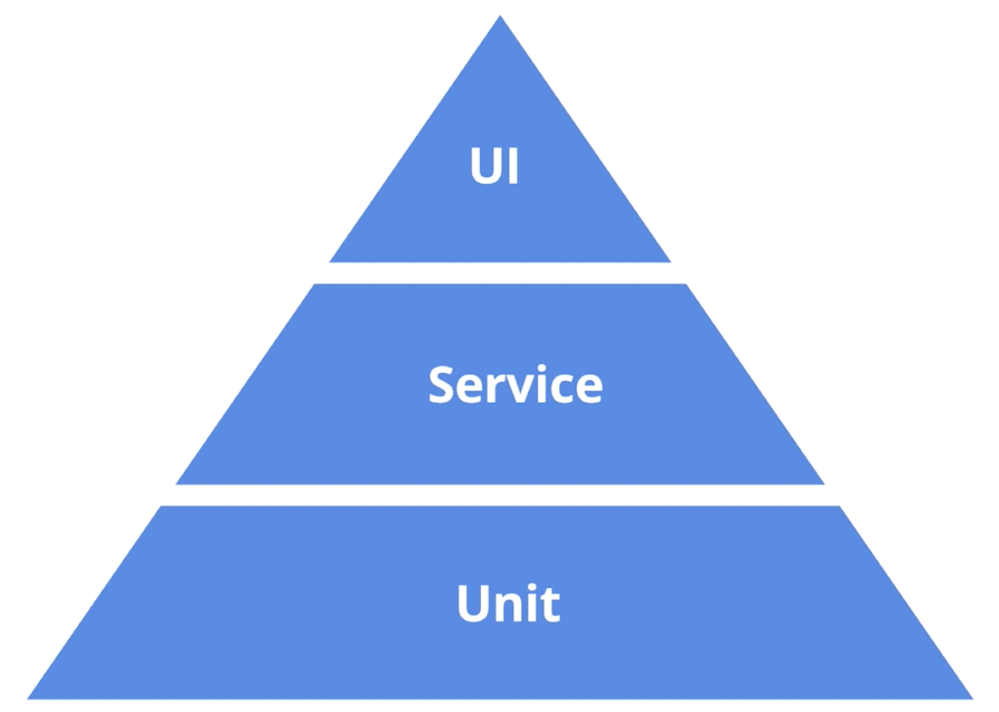
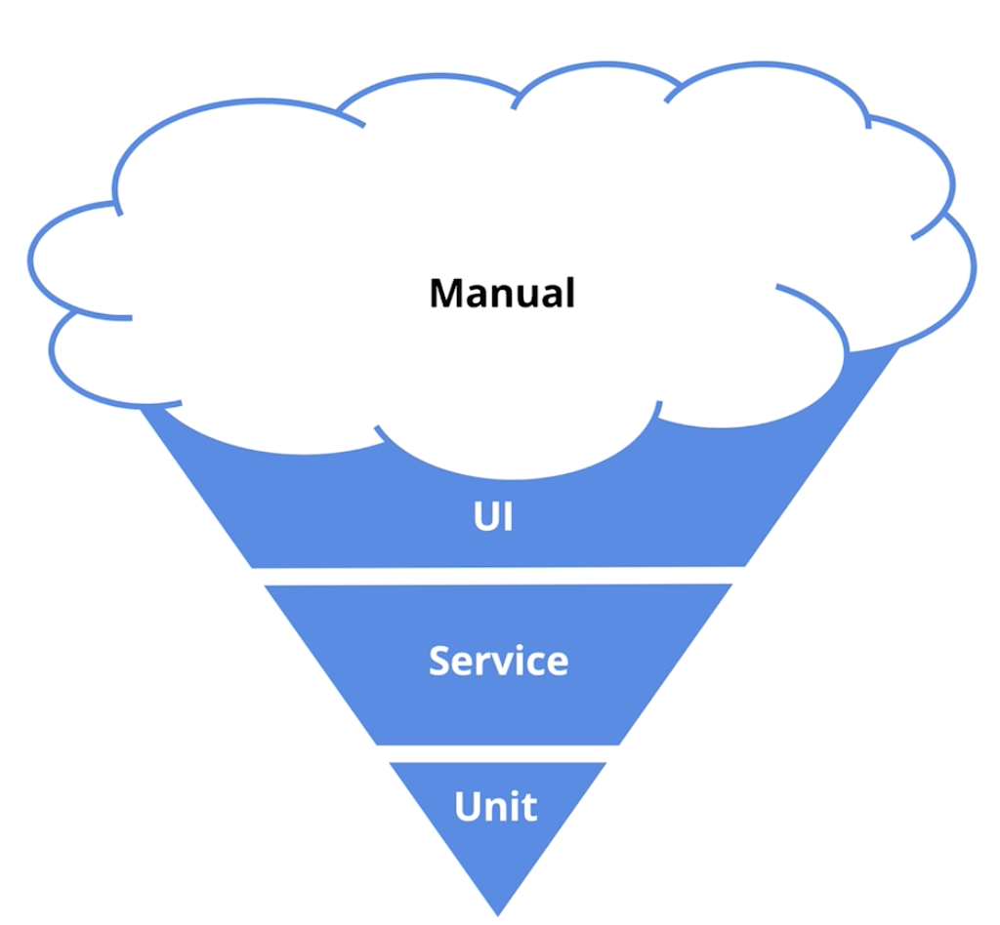
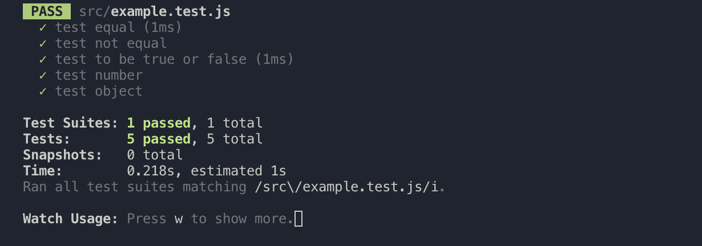
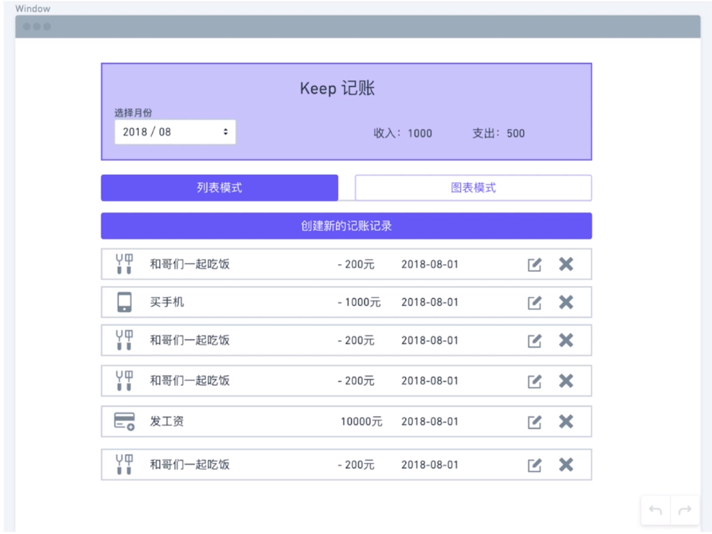

# 第 5 章 组件测试

> 测试做的事：传入一个输入，测试是否返回预期输出
>
> 测试一个组件，实际上就是测试根据你所传入的数据所渲染的 DOM 与你预期返回的结果是否相同。因为对于代码所最终呈现的效果而言就是一个 DOM 结构，只不过在代码层面上我们无法看到其真实的效果，而大部分公司的所谓测试只是通过查看页面或应用在浏览器或者手机中所呈现的 UI 来检查是否与预期相同，或者通过点点点拉拉拉的实际操作来查看是否有错误，但这样的测试一是并不完全能够覆盖所有应该测试的点，二是人工的测试对于人的要求太高，不能要求人和机器一样能完全不发生错误，比如忽视了某个地方数据的错误，或者缺少某个交互的测试等。
>
> 注意：测试环境和生产环境还有开发环境是有区别的，而且与后两者有比较大的区别，因为测试环境是没有在浏览器环境下进行的，而是通过使用`enzyme`这个库来帮助我们模拟另外两个环境中的情况。

[TOC]

## 5-1 为什么要有测试

### 国内对于测试的现状

- 重视程度不够
  - 项目周期短
  - 需求不断变更
- 没有时间
- 不会写测试
  - 大部分工程师就是在页面上直接通过使用来测试
  - 上线后祈祷不会有 bug

### 测试是什么和重要性

人类面对重复的流程时会感到厌倦，面对复杂的流程时又容易犯错，但计算机非常喜欢处理重复性的复杂的流程，它们不会疲倦劳累，也很少犯错。所以，聪明的程序员就会写一些任务让计算机来自动化完成一些流程，比如可以每提交一次代码就让流程跑一遍，不需要让自己在界面上点来点去。

- 测试可以减少代码的 bug，使代码拥有更高的质量
- 更早的发现 bug，减少公司成本
  - 因为上线后的 bug 对于用户使用产品会产生不好的印象，减少用户量
- 让重构和升级更加容易和可靠
- 让开发流程更加的敏捷

### 测试金字塔

「测试金字塔」是由马丁福勒在 2012 年提出的，这个标准现在很多大公司设计自动化测试和持续化集成的最佳实践。如图：



- 最下面一层是单元测试，所占比重也是最大的。
  - 单元测试指将代码分成单独、互相独立的部分，相互之间没有依赖关系，在测试每一个部分时都可以良好的工作，比如 React 中的每一个组件。
- Service Test 是指将最下层的 Unit Test 组成而成的可工作单位
- UI Test 也称为 EtoE Test，就是模拟真实的用户场景对整个应用进行测试，比如模式用户的真实点击、填写表单等等一系列的操作

### 现在很多公司的错误现状

如图：



这个图被称为「冰淇凌」图示

- 最上面所占比例最大的是「Manual」就是「用手的、手工的」，也就是点点点点。 
- UI 测试现在也占有一大部分，这部分的测试主要是由 toA 写的，由于开发没有介入这些 UI 测试，所以这些 UI 测试经常会出现问题。
- Service 和 Unit 测试则非常的少，因为开发没有时间去写

在这门课程中，我么尽量避免这种情况，而是去为每一个组件都写 Unit tests

### 为什么 React 特别适合单元测试

- 组件化
  - 那么组件就是一个个单元，相互不会有影响
- Functional Component
  - 在测试中，纯函数是最好写测试的，因为它是固定输入——固定输出的模式
- 单向数据流
  - 单向数据流让自己不能随便的直接的改变外面传进来的数据，我们只需测试是否触发相应的回调即可


## 5-2 通用框架 Jest 简介

那么对于测试，我们可以使用通用的测试框架来帮助我们使用特定的语法来写测试用例，并且可以运行这些测试。

mocha jamine 这两个框架是用的比较多的两个框架，但这节课我们要介绍的是测试框架的后起之秀 Jest，是由 Facebook 出品的一款通用测试框架，拥有之前所说两个框架的特点，并且内置了许多新的特性。

### Jest 特点

- 通用测试测试框架
- 支持多平台，比如浏览器、node
- 运行速度极快
- 内置代码覆盖率测试
- 为 React 提供了一些特殊的测试方法

> 官网地址：<https://jestjs.io/>
>
> Jest is a delightful JavaScript Testing Framework with a focus on simplicity.
>
> It works with projects using: Babel, TypeScript, Node, React, Angular, Vue and more!

### 断言库

> 断言：极其肯定地说。
>
> 例句：我敢断言，他准赢。

断言是指判断一个值是否有对应相应的结果，这也是测试的精髓。

而断言就需要通用框架来提供对应的语法来帮助我们完成相应的工作。

文档位置：<https://jestjs.io/docs/en/using-matchers>

其他的断言库：chai 等等

### 书写一个测试用例

在 src 下创建一个 example.test.js 的文件：

```jsx
test('test equal', () => {
  expect(2 + 2).toBe(4)
})

test('test not equal', () => {
  expect(2 + 2).not.toBe(5)
})

test('test to be true or false', () => {
  expect(1).toBeTruthy()
  expect(0).toBeFalsy()
})

test('test number', () => {
  expect(4).toBeGreaterThan(3)
  expect(4).toBeLessThan(5)
})

test('test object', () => {
  expect({ name: 'viking', age: 30}).toEqual({ name: 'viking', age: 30})
})
```

然后在项目的终端中运行如下命令：

```shell
npm test src/example.test.js
```

之后，就会自动运行开始进行测试，如果一切顺利就在终端中如下显示：



可以看到，语法实际上很简单，传入一个表达式，然后通过执行一些方法并传入预期会返回的值，最后断言就 ok 了。整个表达式很像是一句简短的英文语句。


## 5-3 React 测试工具简介

上节课我们介绍了项目通用测试工具 jest，并且了解了这个工具最重要的 API，被我们称之为断言库。这节课我们将学习 React 的测试工具。

我们对使用 React 的项目进行测试时，光使用通用测试工具是不够的，**还需要特殊的工具可以把 React Component 渲染或者说是挂载到测试用例中**。

Facebook 推出了一套专门的测试工具 —— [ReactTestUtils](https://zh-hans.reactjs.org/docs/test-utils.html) 

不过这套工具的方法、API 复杂难记，在使用时不太方便，所以有开发者将这套工具做了封装，其中 AirBnB 推出的 —— [Enzyme](https://airbnb.io/enzyme/) 就是一个非常好的工具

### Enzyme 特点

- 语法简单、易懂易学习

  - 这是选择一个框架的前提，这也是 jQuery 当时火起来的原因

- 类似 jQuery 的链式写法来实现 DOM 节点的搜索、遍历、取值等操作

  ```jsx
  // jQuery DOM traversal
  $('#test').find('p').text()
  
  // enzyme DOM traversal
  const wrapper = mount(<Foo bar="baz" />)
  wrapper.find('#test .sample').text()
  ```

### Enzyme 的两种测试方法

- Shallow Rendering —— `shallow()`
  - React 中实际返回的是一些 Virtual DOM 的对象，那么这个方法就会帮助你生成 Virtual DOM 的实例，然后测试其属性，但是它并不会渲染组件中的子组件，所以渲染速度很快。
  - 这个方法是专为单元测试所准备，因为不需要考虑子组件（不渲染）。所以，这个方法也很适合测试无状态组件。
  - 因为是 Virtual DOM 所以是缺少事件对象`event`的，比如当你使用`simulate('click')`时，如果所绑定的点击事件方法有和事件对象有关的代码，比如`e.preventDefault()`，那么就会报错。
- DOM Rendering —— `mount()`
  - 其引入了一个渲染真实 DOM 的工具以生成一个**真实 DOM 环境**，所以它可以渲染组件和组件中的子组件，同时可以调用生命周期函数。
  - 缺点就是速度相对较慢。

所以，我们需要根据组件的内容来自行选择比较适合的渲染方式。

如果想要了解详情可以去官网文档上看看。

### 代码部分——使用 Enzyme 写一个简单测试

#### 安装依赖

```shell
npm i enzyme enzyme-adapter-react-16 --save-dev
```

- 使用`—-save-dev`命令可以使包的名称与版本添加到`devDependencies`字段中。

#### 创建 enzyme 与 jest 的连接 configure

在 src 下创建 setupTests.js 文件，create-react-app 会自动寻找这个文件，并且把这个文件与 jest 进行关联。

```jsx
import { configure } from 'enzyme'
import Adapter from 'enzyme-adapter-react-16'

configure({ adapter: new Adapter() })
```

- 我们需要使用这个文件来做连接，至于它们到底做了什么，可以去了解一下。

#### 对 TotalPrice 组件进行测试

思路很简单，只需要测试当传入的 income 和 expense 是否会正确的显示出来。

```jsx
import React from "react"
import { shallow } from "enzyme"
import TotalPrice from "../TotalPrice"

const props = {
  income: 1000,
  expense: 2000
}

// 描述一系列测试用例的集合
describe("test TotalPrice component", () => {
  it("component should render correct income&expense number", () => {
    const wrapper = shallow(<TotalPrice {...props} />)
    expect(wrapper.find(".income span").text() * 1).toEqual(1000)
    expect(wrapper.find(".expense span").text() * 1).toEqual(2000)
  })
})
```

1. 创建一些输入的数据源 props
2. 使用`describe`和`it`来进行包裹
3. 使用`shallow`对组件实例化返回给`wrapper`
4. 在`wrapper`中找到需要测试的文本内容返回给`jest`的 API 进行测试


## 5-4 「价格条目列表」测试分析和编写代码

### 测试用例分析



PM（project manager）需求：

- 传入特定数组，是否渲染对应长度的条目
- 每个条目是否渲染特定组件和内容
- 点击两个按钮是否会触发对应的方法（回调），并且触发方法时是否会带特定的参数、

那么根据 PM 的需求，我们可以一项一项的进行功能测试。

### TDD 

> **TDD**是测试驱动开发（Test-Driven Development）的英文简称，是敏捷开发中的一项核心实践和技术，也是一种设计方法论。 **TDD**的原理是在开发功能代码之前，先编写单元测试用例代码，测试代码确定需要编写什么产品代码。

一种写测试用例的方式，因为一开始应用的需求都是由 PM 所提出的，所以可以根据这些需求来将这些测试用例写出来，不过这时候的测试用例都是 fail 的状态，然后在我们用代码将这些需求逐步完成的过程中，这些测试用例也被逐步的 fix

不过从我在知乎的「[TDD（测试驱动开发）是否已死](https://www.zhihu.com/question/37623307)」 这个问题下看到，似乎 TDD 是一个非常耗费时间的过程，并且对于互联网开发这样短时间就要出产品的开发模式似乎不太适用，当然也有好处，如果感兴趣可以去仔细的了解一下这方面的内容。

### Jest 为 React 测试提供的特性 - Snapshot Testing

来试着想象一个场景，测试开发一个移动端的应用，在开发某个新的功能之前给这个应用截一张图，然后开发完成之后再截一张图，然后比较这两张图的异同，如果发现有差异，我们就会很快的发现后来的开发破坏了原有的功能，从而造成了 bug，或者是我们功能就是要更新这个应用，从而我们将这个截图更新即可。

Jest 提供了 Snapshot 功能和上面所描述的功能类似，不过它应用于 Component，而且「快照」并不是生成一张图，而是生成一棵 React 结构树，然后对比先后两棵树的结构是否完全相同。

这种测试方法可以避免出现组件在修改之后出现不可预见的 bug，比如你不小心在代码中添加了一些字符，通过 snapshot 就能直接观察到具体是哪个位置上，而不是发现在浏览器的页面结果或者控制台中发现异常，然后到代码中去寻找问题。

代码部分：

```jsx
import React from "react"
import { shallow } from "enzyme"
import PriceList from "../PriceList"
import { items, categories } from "../../containers/Home"

const itemsWithCategory = items.map(item => {
  item.category = categories[item.cid]
  return item
})

const props = {
  items: itemsWithCategory,
  onModifyItem: () => {},
  onDeleteItem: () => {}
}

let wrapper
describe('test PriceList component', () => {
  /**
   * 因为每个 case 都要渲染一个 wrapper（shallow 所生成的 实例）
   * 所以添加 beforeEach 这个钩子来实现每次运行单个测试用例时，都会执行这一步
   *  */
  beforeEach(() => {
      wrapper = shallow(<PriceList {...props} />)
  })
  it('should render the component to match snapshot', ()=> {
    expect(wrapper).toMatchSnapshot()
  })
})
```

- `describe()`是对一组测试的总体描述集合，在测试结果中，如果发现错误能够更详细的告诉我们是在哪个集合下的哪个测试发生了错误。
- `beforEach()`可以在每一个单独测试用例之前执行一段代码，这里每一次都会重新获取组件的实例，原因是怕之前的测试用例更改了实例从而影响其他的测试结果。
- 27 行的`expect(wrapper).toMatchSnapshot()`能够生成一组「快照」并且保存在当前测试代码文件目录中的`__snapshots__`文件夹中，这是用于对修改之后代码做一个比较从而了解前后差异。
  - 如果你在之后做文件做的修改是你确定要这样修改的，比如添加一个类名，那么在提示错误的终端中按`u`来更新快照以消除提示信息。

### PriceList 测试用例

#### 传入特定数组，是否渲染对应长度的条目

```jsx
it("should render correct price items length", () => {
  expect(wrapper.find('.list-group-item').length).toEqual(itemsWithCategory.length)
})
```

#### 每个条目是否渲染特定组件和内容

```jsx
// 每个条目是否渲染特定组件和内容
it("should render correct icon and price for each item", () => {
  const iconList = wrapper.find('.list-group-item').first().find(Ionicon)
  expect(iconList.length).toEqual(3)
  expect(iconList.first().props().icon).toEqual(itemsWithCategory[0].category.iconName)
})
```

- 实际这里只测试了是否有 3 个`Ionicon`组件和是否第一个`Ionicon`组件的`icon`属性值与我们预期传入的数据的第一个条目的`category.iconName`相同。
- 可以直接传入组件来获取组件——`find(Ionicon)`
- 通过`.props()`可以获取组件所有属性

#### 点击按钮是否触发特定的回调

```jsx
const props = {
  items: itemsWithCategory,
  onModifyItem: jest.fn(),
  onDeleteItem: jest.fn()
}

//点击两个按钮是否会触发对应的回调
it("shoul trigger the correct function callbacks", () => {
  // 由于测试 callback 所以需要模拟一个事件的触发
  const firstItem = wrapper.find(".list-group-item").first()
  firstItem
    .find("a")
    .first()
    .simulate("click")
  //测试 props.onModifyItem 是否被调用
  expect(props.onModifyItem).toHaveBeenCalled()
  //测试 props.onModifyItem 是否被调用并且是否使用了某个参数
  expect(props.onModifyItem).toHaveBeenCalledWith(itemsWithCategory[0])
  firstItem
    .find("a")
    .last()
    .simulate("click")
  expect(props.onDeleteItem).toHaveBeenCalledWith(itemsWithCategory[0])
})
```

- 模拟事件的触发是使用`simulate()`这个 API
- 事件触发后的测试是否执行的回调是`jest.fn()`所 Mock 的，而不是我们在实际代码中所传入的回调
- `toHaveBeenCalled()`可以测试是否调用了回调
- `toHaveBeenCalledWith()`可以测试是否调用了回调并且传入了某个参数

### 课后练习：为 ViewTab 组件添加测试

流程：

- 分析单元测试用例
  - 可以从 PM 的角度来看待问题
- 编写单元测试
- 添加 snapshot

### 分析单元测试用例

- 初始状态下是否是以父组件传入的`activeTab`值为当前选项（有`actice`类）

- 点击按钮后是否执行了回调并且传入了对应的参数


## 5-5 月份选择器添加测试

首先我们要知道，编程与其他技术性的工作相同，**需要大量的写代码从而积累经验**，这节课我们温故知新加强练习。

### 月份选择单元测试用例分析

- 测试默认状态 - 按钮上渲染年和月是否正确，下拉框是否显示 等
- 测试点击以后状态 - 下拉框是否显示，年和月的列表是否正确 等
- 点击年和月份以后是否触发正确的回调
- 对于传的一些特殊的值是否有特殊处理
- 特殊 DOM 事件的一些触发和处理方法

### 在 MonthPicker.test.js 中写测试

之前我们的组件都是用`shallow`方法进行挂载的，但是月份选择器组件中有一些只有 DOM 环境才存在的变量，比如传给事件监听的回调中的第一个参数`event`对象，就是只有在 DOM 环境中才会有的东西，再比如我们在`document`上添加`click`事件，这也需要 DOM 环境，所以这里我们会采用`mount`方法进行挂载。

#### 测试默认状态 - 按钮上渲染年和月是否正确，下拉框是否显示 等

```jsx
// 测试默认状态 - 按钮上渲染年和月是否正确，下拉框是否显示，组件状态中的值是否和预期相同
it('render the correct year and month, show correct dropdown status', () => {
  let text = wrapper.find('.dropdown-toggle').first().text()
  expect(text).toEqual('2019 年 04 月')
  expect(wrapper.find('.dropdown-menu').length).toEqual(0) 
  expect(wrapper.state('isOpen')).toEqual(false)
  expect(wrapper.state('selectYear')).toEqual(props.year)
})
```

- 注意使用`find()`方法所获得的是一个数组，无论你获取的是一个元素还是多个元素还是没有元素，都会返回一个数组，所以需要使用`first()`来获取其中第一个元素。
- 测试一个元素是否显示可以使用`find()`方法来获取这个元素，查看返回数组中的长度是否为 0
- 获取一个组件的状态是通过`state()`API，并且传入对应状态的字符串来获得值

### 测试点击以后状态 - 下拉框是否显示，年和月的列表是否正确 等

```jsx
//测试点击以后状态 - 下拉框是否显示，年和月的列表是否正确 等
it('after click the button, dropdown should show, year list & month list should have the correct items', () => {
  wrapper.find('.dropdown-toggle').simulate('click')
  expect(wrapper.state('isOpen')).toEqual(true)
  expect(wrapper.find('.dropdown-menu').length).toEqual(1)
  expect(wrapper.find('.year-ranges .dropdown-item').length).toEqual(9)
  expect(wrapper.find('.month-ranges .dropdown-item').length).toEqual(12)
  expect(wrapper.find('.year-ranges .dropdown-item.active').text()).toEqual('2019 年')
  expect(wrapper.find('.month-ranges .dropdown-item.active').text()).toEqual('04 月')
  // the first year should be the current year minus 4（测试年份列表中第一项应该是当前年份减去 4）
  expect(wrapper.find('.year-ranges .dropdown-item').first().text()).toEqual(`${props.year - 4} 年`)
  // 月份列项中的第一个元素的内容是否符合预期
  expect(wrapper.find('.month-ranges .dropdown-item').first().text()).toEqual('01 月')
})
```

### 点击年和月份以后是否触发正确的回调

```jsx
// 点击年和月份以后是否触发正确的回调
it('click the year & month item, should trigger the right status change', () => {
  // 首先我们应该点击选择月份按钮将其打开
  wrapper.find('.dropdown-toggle').simulate('click')
  wrapper.find('.year-ranges .dropdown-item').first().simulate('click')
  expect(wrapper.find('.year-ranges .dropdown-item').first().hasClass('active')).toEqual(true)
  expect(wrapper.state('selectYear')).toEqual(2015)
  wrapper.find('.month-ranges .dropdown-item').first().simulate('click')
  expect(wrapper.state('isOpen')).toEqual(false)
  //查看回调是否调用，并且参数是否传递正确
  expect(props.onChangeDate).toHaveBeenCalledWith(2015, 1)
})
```

- 第 6 行第二排，使用`hasClass()`判断是否带有`active`这个类


（可以将这每一个测试用例都添加注释说明在测试什么 ✅）

## 5-6 月份选择器进阶测试

### 添加点击页面其余空间关闭下拉菜单功能

> 这个功能我自己已经实现过了，不过可以看一下讲师是如何来实现的。

讲师的代码：

```jsx
componentDidMount() {
  document.addEventListener("click", this.handleDocumentClick)
}

componentWillUnmount() {
  document.removeEventListener("click", this.handleDocumentClick)
}

handleDocumentClick = e => {
  if (this.node.contains(e.target)) {
    return
  }
  this.setState({
    isOpen: false
  })
}
```

- 第 10 行中的`this.node`是`MonthPicker`组件最外层`div`的引用，然后这个判断逻辑也好，如果`MonthPciker`节点中包含了所点击的事件对象，则直接返回不做任何处理，因为正好说明我们所点击的事件对象就是月份选择组件中的某一个元素节点，而我们也不想当点击月份选择按钮中的任意部分而让下拉菜单消失。反过来说，正好是当我们点击其他部分时下拉选择框会消失。

  经过这样的处理之后，就不用再去取消事件冒泡的行为了。

- `Node.contains`是一个好用的 API，判断一个节点是否包含传入的节点。

  

### 测试

为什么需要使用 Mock 的方式来模拟 document 上的点击事件？因为无法通过`document.simulate('click')`的方式来模拟在文档的任意位置的点击事件。

测试的精髓在于 Mock 一些方法的返回，让它们的结果可以被我们的测试程序所监视。在这里，我们需要 Mock 的方法是`document.addEventListener`，然后让传给`document.addEventListener`可以经过程序进行触发。（这个方法是讲师在网上找了很久得到的解决方案）

```shell
npm test -t MonthPicker
```

通过添加`-t`命令来表示只测试这一个文件。

#### 代码：

我们要测试的内容是：*当下拉框出现之后，点击页面的其他地方会关闭下拉框*

通过 mock `document.addEventListener`，拿到`this.handleDocumentClick`回调，就能够测试这个回调中的逻辑。

```jsx
// 测试 当下拉框出现之后，点击页面的其他地方会关闭下拉框
it("after the dropdown is shown, click the document should clost the dropdown", () => {
  let eventMap = {}
  // mock document.addEventListener 方法,通过 jest.fn() 来监控 addEventListener 函数，传入的回调就是 addEventListener 本身
  document.addEventListener = jest.fn((event, cb) => {
    //当事件监听函数触发时（也就是 addEventListener 执行），将回调(在组件中是 this.handleDocumentClick )存储在 eventMap 对象中，以方便我们在整个 case 中的其他地方调用
    eventMap[event] = cb
  })
  // 如果我们使用 beforeEach() 钩子中所创建的 wrapper，那么这个 case 中之前的逻辑就不会执行，原因是 componentDidMount 已经执行完毕了，而我们的逻辑需要让其在之后执行才行
  const wrapper = mount(<MonthPicker {...props} />)
  // 打开下来菜单
  wrapper.find(".dropdown-toggle").simulate("click")
  //测试 组件状态 isOpen 是否为 true 
  expect(wrapper.state("isOpen")).toEqual(true)
  //测试 下拉框是否显示
  expect(wrapper.find(".dropdown-menu").length).toEqual(1)
  // 触发点击事件，并且 target 为组件本身
  eventMap.click({
    target: ReactDOM.findDOMNode(wrapper.instance())
  })
  //测试 组件状态 isOpen 是否为 true 
  expect(wrapper.state("isOpen")).toEqual(true)
  // 触发点击事件，并且 target 为组件本身
  eventMap.click({
    target: document
  })
  //测试 组件状态 isOpen 是否为 false 
  expect(wrapper.state("isOpen")).toEqual(false)
})
```

- 方法是通过使用`jest.fn()`对`document.addEventListenser`进行拦截，当其执行时让我们可以获取一个特殊的`eventMap`对象，这个对象中拥有以事件名称为属性和触发回调为属性值的数据，所以我们可以直接通过`eventMap.click()`来调用传入的回调，等于调用了`this.handleDocumentClick`这个方法，并且我们可以给这个回调传入不同的`target`来模仿我们所真实点击的元素对象，从而测试状态是否正常。（实际上就是，我们只是模拟的执行了点击时应该执行的回调，但这个回调并没有真正的作用于 DOM 之上，因为本身就不是 DOM 所执行的，我们触发了 DOM 上的 click 事件（在第 12 行），但真正的目的是获取触发事件时的回调函数，然后通过传入虚拟的`e.target`的值来模仿我们所点击的元素对象，从而实现真实点击的效果）
- `ReactDOM.findDOMNode(component)`API 可以用于通过传入组件来获取 DOM，这里传入`wrapper.instance()`而不是组件，是因为如果直接传入组件，这个组件没有渲染，`findDOMNode` 只在已挂载的组件上可用（即，已经放置在 DOM 中的组件），而`wrapper.instance()`返回的组件是通过`mount`挂载过后的组件。


## 5-7 首页单元测试分析和编写

UT（unit test）的过程实际上就是一个**整理需求的过程**，而分析测试用例实际就是分析需求，或者说操作整个组件的过程。

这节课要写的是 intergradation test，也就是金字塔中间的测试，但也可以称之为 UT，因为可以看作是结合了几个组件而组成一个比较大的组件的 UT，但和之前的 UT 有点不同，因为是结合了多个组件的组合测试。

### 首页单元测试用例分析

首先还是来分析需求（页面如何操作，用例就如何写）：

- 测试默认状态 - 是否正确渲染特定组件和数据 等
  - 这里我们只需要确保子组件是否渲染和数据传入是否正确就行了，而每一个组件的测试都是由特定的 UT 来完成的。
- 测试交互 - 点击交互该组件的 state 是否有相应的修改
- 测试交互 - 对应操作触发以后展示型组件的属性是否修改
  - 为什么测试了 state 还要测试传入每一个子组件的 props 呢？因为传入的 props 并一定等于 state，有些 props 是直接使用 state 中的数据，而有些是利用 state 进行修改，还有些可能完全和 state 没有关系。

### 代码部分

> 整块的测试代码可以去看项目文件，这里只提出一些问题和新的 API

```jsx
wrapper
  .find(".month-ranges .dropdown-item")
  .at(3)
  .simulate("click")
```

- 如果要找一组元素中的第几个可以使用`at()`并且传入`index`

#### 修改一个问题

在 Home 组件中`state.currentDate`的值是由`parseToYearAndMonth()`这个工具函数生成的，但这里我们没有向这个传值，那么其返回的日期就是当前程序运行的日期，那对于我们写测试而言就会造成一定的麻烦，因为我们的数据是固定日期，就有可能出现今天测试正确，明天测试不正确的情况（今天 3 月份，明天 4 月份），所以这里我们需要将日期固定，比如和现有 mock 数据中的日期相同`2019-03-16`，更改如下：

```jsx
class Home extends Component {
  constructor(props) {
    super(props)
    this.state = {
      items,
      selectedDate: parseToYearAndMonth('2019-03-16'),
      tabView: VIEW_LIST
    }
  }
 //...
```

#### 深浅拷贝的问题

在测试当点击`CreateBtn`按钮会在`state.items[0]`中添加新的一项时，出现了一点问题。我预期的值应该是如下这个对象：

```jsx
{
  id: 4 + 1,
  title: "新添加的项目",
  price: 300,
  date: "2019-03-31",
  cid: 1
}
```

而实际返回的值是这样的：

```jsx
{
  category:{
    id: 1,
    name: "旅行",
    type: "expense",
    iconName: "ios-plane"
  },
  id: 4 + 1,
  title: "新添加的项目",
  price: 300,
  date: "2019-03-31",
  cid: 1
}
```

也就是增加了`category`属性，但很奇怪的是在`this.handleCreateItem`这个回调中我并没有为新的一项添加`category`属性，所有添加`category`属性的操作都是在`render()`中完成的，那么问题应该是发生在了这里，先来看一下未修改之前的代码：

```jsx
const itemsWithCategory = items
.map(item => {
  item.category = categories[item.cid]
  return item
})
```

这里很简单的对`items`做了`map`处理，返回一个新的数组，但问题就是在这里，在传给`map`的回调中`item`实际上是`items`中每一项的引用，那我们改变`item`就会改变`items`中每一个对象的值，所以，最终就会在`state.items`中的每一项中出现新添加的`category`属性。

为了解决这个问题，我一开始想通过展开运算符将`items`进行拷贝，但是却依然出现问题，因为通过`[…items]`所获得的新数组的方式是浅拷贝，对于数组中如果都是基本数据类型——比如 String、Number、Boolean 等是没有问题的，但是如果存在着像是 Object 或者 Array 这样的引用数据类型，那么只是复制其引用（指针）并不会将其完全复制。

所以，一是可以通过深拷贝的方式来解决，比如使用`JSON.parse(JSON.stringify(items))`来获得一个深拷贝（完整复制）的数组，二是我所使用的方式，就是在回调中，对`item`进行浅拷贝，最终返回这个浅拷贝对象即可：

```jsx
const itemsWithCategory = items
.map(item => {
  // 注意这里的 item 是 items 中的对象，所以需要先进行拷贝，否则会更改掉 items 中每个对象的值
  const copyItem = {...item}
  copyItem.category = categories[copyItem.cid]
  return copyItem
})
```

> 更多内容也可以百度了解，或者查看这篇文章：[什么是js深拷贝和浅拷贝及其实现方式](https://www.haorooms.com/post/js_copy_sq)

### 测试用例的好处

当你的测试用例足够的详尽（因为可以写的很细，也可以写的相对粗糙一些），那么你就不必打开页面进行人工测试了，但对于前端来说，你可能需要打开页面来查看实际的 UI。

在实际工作中，在时间允许的情况下测试其实可以帮你节约时间和提升代码质量。（我是觉得越是大型的项目越能体会到测试的好处）

### 第 5 章 —— 总结

- 测试的重要性和测试的分类（测试金字塔）
- 通用测试框架和 React 测试工具
- 单元测试用例分析和编写