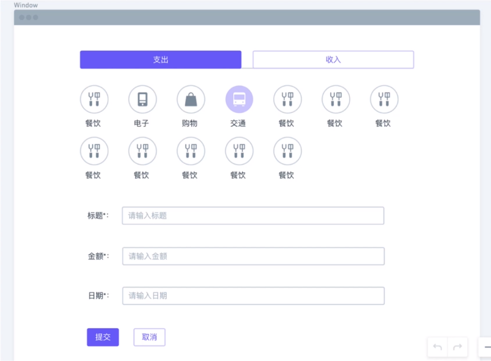
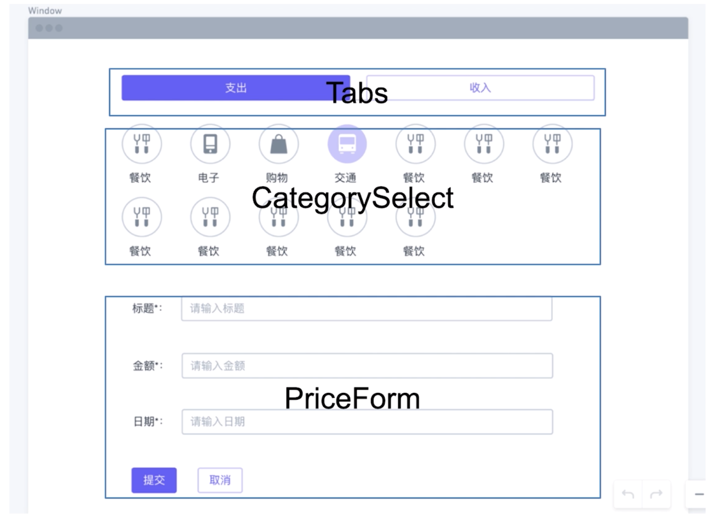
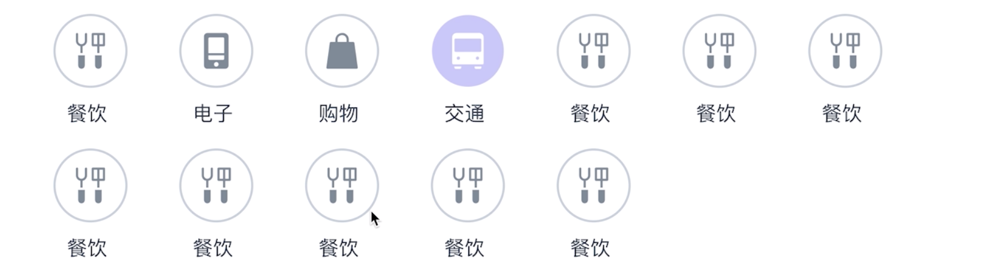
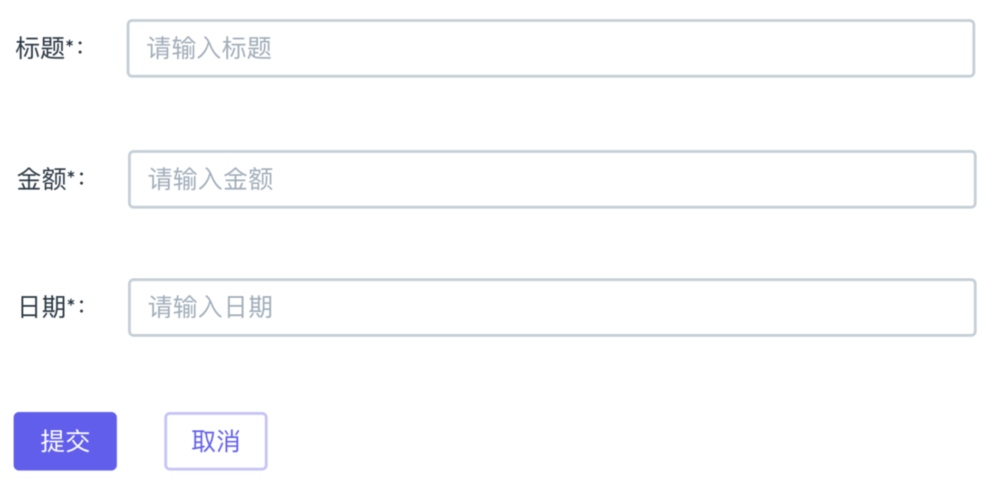
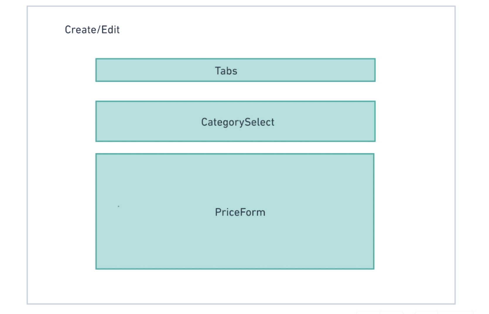

# 第6章 创建记账条目页面

> 通过`const wrapper = mount(<Component />)`返回的`wrapper`实际上是由`enzyme`提供的 API `mount`所返回的一个类似 DOM 的对象，你可以通过`enzymy`提供的其他 API 来获取想要获取的值，而如果想要使用原生的一些 API，则需要使用`wrapper.instance()`来获取真实的 DOM

[TOC]

## 6-1 创建页面需求分析和组件拆分

### 需求分析

原型图：



- 第一部分是支出与收入的分类标签，点击不同的标签就会切换到不同的分类上面，高亮显示
- 第二部分是显示支出或者收入的分类图标，并且每一个分类图标可以通过点击高亮显示
- 第三部分是表单，有三个输入框并且会做表单验证
- 第四部分是提交与取消按钮
  - 当点击提交之后如果输入框有问题则会提示用户哪里出了问题
  - 如果通过了就会保存整个记录，并跳转到首页
  - 点击取消按钮会直接跳转到首页

### 拆分展示型组件

如图：



- 这里最后的提交与取消按钮实际上可以和表单拆分出来
- Tabs 可以直接复用

### 思考现在 ViewTab 组件的不足

因为这里的支出与收入 Tab 和 ViewTab 很像，所以可以考虑直接复用，但目前我们的 ViewTab 由于很多地方是写死的，所以有很多不足：

- 针对完全局限的场景（只能使用在切换 View）
- 内容无法定制（图标和名称都是固定的）
- 难以扩展（只能有两项 Tab，无法增加新的 Tab）

因此，我们需要对 ViewTab 进行重构，将其适用于更多场景和可以扩展。

也可以看到，**项目的重构一般是发生在*项目进行中*的**，当发现项目出现一些问题时，我们就可以通过重构来解决这些问题。

## 6-2 React-Router 简介

### SPA

#### 什么是 SPA

SPA（single page Application）是**一种 Web 应用程序或者称为网站**。

与 SPA 对应的多页面应用或者网站，多页面应用是当你点击一个链接过来会跳转到一个新的页面，从而会加载页面的资源——HTME、CSS、JS、图片等，所以在实际操作过程中页面会有一个跳转过程中所产生的空白。

那 SPA 和多页面应用在实际操作过程中的不同是，虽然也有加载一些资源的过程，但不会有空白的过程，并且你也可以通过一些提醒的进程 UI（Loading 效果） 来缓解对用户等待的压力，比如 github 最上方的横条。而之所以能够产生这样的效果，是由 HTML5 提供的新的 history 路由工作方式来实现的，这个课程并不会讲解这方面的内容，同样，如果对这方面感兴趣也可以去查看相关的内容和 API。

SPA 除了刚才所说的路由的跳转方式以外，还有数据是由 Ajax 请求来获得的，再由 JS 操作 DOM 来动态渲染到页面中。总的来说，就是**由 JS 实现 URL 变换和动态变换 HTML 的内容**。

#### SPA 应用的优点

- 速度快。
  - 第一次访问网站时就下载完所有静态文件，跳转到网站中的其他页面时不需要再次下载。（但所谓的速度快，是指下载完成后之后，因为相比于多页面应用而言 ，SPA 在第一个访问时需要下载相对更多的资源）
- 体验好。
  - 整个交互趋于无缝，更倾向于原声应用。

- 为前后端分离提供了实践场所。
  - 后端只需要提供给前端数据，剩下的内容都可以由前端来完成处理。

#### SPA 框架

ember 和 Angular 都是一套大而全的解决方案所以会更重一些，而 React 实际上只是一个视图层的 Library，所以在使用 React 来实现 SPA 的功能时就需要 [react-router](https://reacttraining.com/react-router/)

React Router 特点：

- Components Based（基于组件）
- 声明式和可组合
  - 从而我们的整个软件系统高度可自定义
- 支持多种应用 - web 应用或者是 React Native

## 6-3 React-Router 代码部分

（虽然对于 React-Router 我已经比较熟悉了，但还是可以复习一遍）

先来说一下关于跳转使用`<Link>`组件而不使用`<a>`标签的问题，虽然从 DOM 结构上来看`<Link>`最终其实也是`<a>`标签，但 react-router 对于这个`<a>`标签的行为使用了 HTML5 的新 API 进行了处理而不是原来那样点击以后进行跳转页面的默认行为。

代码部分：

```jsx
// App.js
import { BrowserRouter as Router, Link, Route } from "react-router-dom"

class App extends Component {
  render() {
    return (
      <Router>
        <div className="App container">
          <ul>
            <li>
              <Link to="/">Home</Link>
            </li>
            <li>
              <Link to="/create">Create</Link>
            </li>
            <li>
              <Link to="/edit/32/zhaoenxiao">Edit</Link>
            </li>
          </ul>
          <Route path="/" exact component={Home} />
        <Route path="/create" component={Create} />
          <Route path="/edit/:id/:name" component={Create} />
        </div>
      </Router>
    )
  }
}
```

- 记得使用`<Router>`进行包裹，注意这里的`<Router>`其实是`<BrowserRouter>`
- `<Link>`组件可以通过路径来传值，比如上面的`32`和`zhaoenxiao`，但是你需要在`<Route>`的`path`属性中添加`:id`和`:name`这样的参数，否则无法在组件内部获取这些值。在组件内容获取值的方式是`this.props.match.params.id`和`this.props.match.params.name`


## 6-4 TDD 的方式开发分类选择组件

> TDD 的开发过程中，我们并不是查看 UI 来了解我们的代码是否正确，而是通过看测试报告。

我们参照编程思路中的「Don't repeat yourself」思想，这节课不会再按部就班的重复之前所学习过的内容，比如之前的开发模式，这样对于技术水平不会有太大的提高，那么这节课将尝试使用 TDD 的开发流程。

之前我们写代码的流程是，先写组件，然后到页面中做一些简单的手动测试，再来写单元测试，而使用 TDD 的方式正好相反。

### TDD 的开发流程

#### 需求分析

如图：



- 根据传入的数据显示对应数量的分类图标（条目）
- 对于传入的默认类型进行高亮显示（当然也可以不传入）
- 点击某个分类时，某个分类高亮，之前的高亮取消，并且触发对应的回调函数和接受对应的参数。

#### 组件的代码形式

```jsx
<CategorySelect 
  categories={}
  onSelectCategory={}
  selectedCategory={}
/>
```

#### 编写测试用例

数据：

```jsx
export const categories = [
  {
   "id": "1",
   "name": "旅行",
   "type": "outcome",
   "iconName": "ios-plane",    
 },
  {
   "id": "2",
   "name": "理财",
   "type": "income",
   "iconName": "logo-yen", 
 },
 {
   "id": "3",
   "name": "理财",
   "type": "income",
   "iconName": "logo-yen", 
 }
]

let props = {
  categories,
  onSelectCategory: jest.fn(),
}

let props_with_category = {
  categories,
  onSelectCategory: jest.fn(),
  selectedCategory: categories[0]
}
```

第一部分的测试用例：

```jsx
describe('test CategorySelect component', () => {
  it('renders with categories should render the correct items', () => {
    const wrapper = mount(<CategorySelect {...props} />)
    //测试 渲染出的分类数量和传入的数量是否相同
    expect(wrapper.find('.category-item').length).toEqual(categories.length)
    //测试 在没有传入被选择项的情况下，是否存在高亮当前选项
    expect(wrapper.find('.category-item.active').length).toEqual(0)
    const firstIcon = wrapper.find('.category-item').first().find(Ionicons)
    //测试 是否渲染了 Ionicons
    expect(firstIcon.length).toEqual(1)
    //测试 Ionicons 的类型是否为我们所传入的数据项的类型
    expect(firstIcon.props().icon).toEqual(categories[0].iconName)
  })
```

第二部分的测试用例：

```jsx
it('render selectedCategory with category item with highlight', () => {
  //这里使用了新的 props，所以我们可以对不同的 props 进行测试从而满足我们不同的需求
  const wrapper = mount(<CategorySelect {...props_with_category}/>)
  //测试 我们所传入的第一个选项是否添加 active 类
  expect(wrapper.find('.category-item').first().hasClass('active')).toEqual(true)
})
```

- 第 3 行，可以传入不同的`props`进行测试。

第三部分的测试用例：

```jsx
//点击测试
it('click the item should add active class and trigger the callback', () => {
  const wrapper = mount(<CategorySelect {...props_with_category}/>)
  wrapper.find('.category-item').at(1).simulate('click')
  //测试 当点击第二个图标项之后，第二个图标是否添加 active 类
  expect(wrapper.find('.category-item').at(1).hasClass('active')).toEqual(true)
  //测试 是否删除之前所选项的 active 类
  expect(wrapper.find('.category-item').first().hasClass('active')).toEqual(false)
  //测试 是否调用了传入的回调，并且传入所点击按钮的数据项
  expect(wrapper.props().onSelectCategory).toHaveBeenCalledWith(categories[1])
})
```

#### 编写组件代码

```jsx
class CategorySelect extends React.Component {
  constructor(props) {
    super(props)
    this.state = {
      selectedCategoryId: props.selectedCategory && props.selectedCategory.id
    }
  }
  selectCategory = (event, category) => {
    event.preventDefault()
    this.setState({
      selectedCategoryId: category.id
    })
    this.props.onSelectCategory(category)
  }
  render() {
    const { selectedCategoryId } = this.state
    const { categories } = this.props
    return (
      <div className="category-select-component">
        {categories.map((category, index) => {
          const isActive =
            // 注意，第一个测试用例没有传入 selectedCategory，因此需要先验证
            selectedCategoryId === category.id
              ? " active"
              : ""
          return (
            <div
              className={`category-item col-3${isActive}`}
              key={category.id}
              onClick={event => {
                this.selectCategory(event, category)
              }}
            >
              <Ionicon
                className="rounded-circle"
                fontSize="50px"
                color="#555"
                icon={category.iconName}
              />
            </div>
          )
        })}
      </div>
    )
  }
}
```

- 这一部分的代码大部分没有什么好说的，只是需要知道是根据上面测试用例逐步搭建起来的，而且是写一部分测试用例则返回来写代码，实际上我觉得最好是先将测试用例基本上写完，再回过去写组件代码，这样的好处是不必因为测试用例之间的差异而修改组件代码，因为是**从整体上**来把握代码，但这需要对你的需求有一个清晰全面的认识，否则会把自己搞晕，因为这样的方式相对复杂一些。所以，如果对于不太熟悉的项目，最好还是一个测试用例写一部分代码会比较好一些，然后再根据问题进行修改。
- 第 21 ～ 25 行代码，这里用了之前没有用过的一种方法来添加`.active`类，我们直接判断当前项的`id`是否和组件`state`中的`id`相同，从而返回不同的字符串用`isActice`来接受，然后在 28 行中通过模板字面量将`isActive`与字符串字面量拼接起来。这样的好处是，如果我需要给 div 添加或者修改类名，则不需要在三元表达式的地方返回的字符串中添加两次，而只需要在 div 的`className`中添加和修改一次即可。

  但不好的地方在于，这样的代码有点不够美观，因为在`className`中的值是既有变量又有字符串，我们是否应该把一个属性的值就在之前处理好以后直接传入呢？

### TDD 的好处

- 运行测试之后，我们可以在终端中看到错误提示。
- 不需要手动进行操作去查看组件是否完美工作，并且通过手动操作在没有列任务列表的情况下很有可能会忘记一些测试。

## 6-5 PriceForm 组件编写的指导思想

### 提示事项

- 使用`input:number`和`input:date`来帮助我们对表单的输入做一些优化，比如输入的文本的固定格式与类型。
- 在「价格」这一输入框中，需要验证是否小于零，如果是，则给予提示。
- 所有输入框都需要使用`trim`以后对是否为空进行验证，如果是，给予提示。
- 对于样式，我们可以直接使用「Bootstrap」提供的「form」

### 组件形式

```jsx
<PriceForm 
	onFormSubmit={}
  onCancelSubmit={}
  item={}
/>
```

### 测试代码

```jsx
import React from 'react'
import { mount } from 'enzyme'
import PriceForm from '../PriceForm'
import { testItems } from '../../testData'
let props = {
  onFormSubmit: jest.fn(),
  onCancelSubmit: jest.fn(), 
}
let props_with_item = {
  item: testItems[0],
  onFormSubmit: jest.fn(),
  onCancelSubmit: jest.fn(),
}
let wrapper, formInstance, wrapper2
export const getInputValue = (selector, wrapper) => (
  wrapper.find(selector).instance().value
)
export const setInputValue = (selector, newValue, wrapper) => {
  wrapper.find(selector).instance().value = newValue
}
describe('test PriceForm component', () => {
  beforeEach(() => {
    wrapper = mount(<PriceForm {...props} />)
    wrapper2 = mount(<PriceForm {...props_with_item} />)
    formInstance = wrapper.find(PriceForm).instance()
  })
//...
```

- 我们需要根据这个测试代码来编写组件代码
- 其余代码部分，可以查看源文件，并且每一个测试用例都写了注释
- 第 15 ~ 20 中，创建了两个用来快速获取与存储`input`值的函数，其中通过`instance()`来获取实际的`DOM`从而使用原生的 API 来获取和存储值。

## 6-6 PriceForm 实战

### 功能点

- 创建模式显示 3 个 空的 input 框， 第二个只能输入数字类型，第三个只能输入日期类型
- 如果传入初始的 editItem 参数，在三个 input 框中显示对应的数据
- 点击提交，先验证输入内容，如果不符合特定类型，显示提示
- 点击提交，如果通过验证，this.props.onFormSubmit 被触发，它被触发的参数有两个，第一个是有这三个输入值的对象，第二个为当前模式（创建模式 为 false，编辑模式为 true），详见测试用例。
- 点击取消 this.props.onCancelSubmit 被触发

### 组件原型图



### 提示和要求：

- 1 请认真听本课程中的所有内容
- 2 使用 HTML5 默认的 input type=number 和 typer=date 实现下面两个 input
- 3 使用 Bootstrap 的默认表单格式来美化表单 [Bootstrap - Form](https://getbootstrap.com/docs/4.3/components/forms/)
- 4 请尝试使用 TDD 的方式完成本组件的开发
- 5 注意表单的验证过程

### 代码部分

首先需要说明的是，这个组件的表单输入 input，我是将其转换为了受控组件，而讲师是不受控组件，区别在于 input 的 value 值是否取决于组件状态。从我和讲师的代码对比而言，我更喜欢受控组件，因为所有的 value 值都在 state 上，我不需要另外去通过 refs 来获取，并且也可以少做一些判断，所以代码上有一些差异，讲师所提供的测试用例我也做了部分修改。

#### 测试部分代码

```jsx
export const setInputValue = (stateName, newValue, wrapper) => {
  wrapper.setState({
    [stateName]: newValue
  })
}
```

- 我修改了`setInputValue`这个工具函数，是因为如果直接改变 dom 上的 value 值并不会改变 state，所以需要使用到`setState`

#### 组件部分代码

```jsx
state = {
  isAlert: false,
  isEdit: !!this.props.item,
  alertText: "",
  titleValue: this.props.item ? this.props.item.title : "",
  priceValue: this.props.item ? this.props.item.price : "",
  dateValue: this.props.item ? this.props.item.date : ""
}
```

- 第 3 行，通过`!!`将`this.props.item`转换为 Boolean，这样就不需要使用三元操作符了

```jsx
handleChangeInputValue = event => {
  const inputName = event.target.id + "Value"
  this.setState({
    [inputName]: event.target.value
  })
}
```

- 这个函数可以作为所有`input`的`onChange`的监听方法
- 需要知道其`input`的`id`或者`name`属性是和`state`中的属性名有相关性的

#### 在测试中如何单独查看 console.log() 信息

> 在测试用例前面把 it 变成 fit，这样就会单跑这一个用例，就等于把这一个用例隔离开来，其他的信息就不会干扰。
>
> ```jsx
> `fit(``'submit with changed value, should trigger callback with right object'``, () => {``    ``...``})`
> ```


## 6-7 使用 children 重构 Tabs 组件

首先，我们要知道，重构并不是项目交付代码之后，review 时才开始，而是在构建项目的过程中根据不同需求自己发现问题之后就应该开始。

对于 ViewTab 组件我们应该让其具备**可扩展**和**可定制**，而不是像现在这样把内容和项目数都写死。

### 重构之后的 ViewTab 组件的形式

```jsx
<Tabs onSelectTab={} activeTabIndex={0}>
	<Tab>这是第一个 Tab</Tab>
  <Tab>这是第二个 Tab</Tab>
</Tabs>
```

- 这里使用了内嵌而不是通过`props`传值给组件，所以要获取这些内嵌中的「插槽」值，就需要使用`this.props.children`这个默认属性。
- `children`可以是`String`、`ReactComponent`、`Function`等等数据类型

###  Tab 组件

```jsx
export const Tab = ({ children }) => <React.Fragment>{children}</React.Fragment>
```

- `<Tab/>`组件实际上可以理解为一个用于接受其他任何内容的盒子，无论是简单的字符串还是 DOM 元素还是组件或者是一些 dom 元素的组合都可以。
- 不过，`<Tab/>`组件中的内容显示在 UI 中的哪个位置是又`<Tabs/>`来决定的。

### Tabs 组件

```jsx
class Tabs extends PureComponent {
  state = {
    activeIndex: this.props.activeIndex
  }
  tabChange = (event, index) => {
    event.preventDefault()
    this.setState({
      activeIndex: index
    })
    this.props.onTabChange(index)
  }
  render() {
    const { children } = this.props
    const { activeIndex } = this.state
    return (
      <ul className="nav nav-tabs nav-fill my-4">
        {React.Children.map(children, (child, index) => {
          const active = activeIndex === index ? " active" : ""
          return (
            <li className="nav-item">
              <a
                href="#1"
                className={`nav-link${active}`}
                onClick={event => {
                  this.tabChange(event, index)
                }}
              >
                {child}
              </a>
            </li>
          )
        })}
      </ul>
    )
  }
}
```

- `<Tabs/>`组件中能够允许通过在`<Tab/>`组件中传入值来改变的内容是位于第 218行的`{child}`，也就是每一项中的这部分内容（在 UI 中为一个标签中的部分）可以通过在`<Tab/>`组件中的「插值」来实现不同的内容。
- `React.Children.map`可以帮我们做一些工作，因为如果子节点为 `null` 或是 `undefined`，则此方法将返回 `null` 或是 `undefined`，而不会返回数组，如果 `children` 是一个 `Fragment` 对象，它将被视为单一子节点的情况处理，而不会被遍历。所以这比使用数组方法`map`要更安全有效。
- 刚开始我没有给这个组件任何的状态，因为目前只用于在主页面的「ViewTab」作为切换，所以觉得其 UI 状态可以由容器组件`Home`中的状态`tabView`来决定。但后面还是添加上了，因为如果容器组件不存储这个状态，那么`<Tabs/>`组件的 UI 就不会更改。

### Home 组件中的 Tabs

```jsx
<Tabs activeIndex={tabsText.indexOf(tabView)} onTabChange={this.handleChangeView}>
  <Tab>
    <Ionicon
      className="rounded-circle"
      fontSize="30px"
      color="#007bff"
      icon="ios-paper"
      />
    列表模式
  </Tab>
  <Tab>
    <Ionicon
      className="rounded-circle"
      fontSize="30px"
      color="#007bff"
      icon="ios-pie"
      />
    图标模式
  </Tab>
</Tabs>
```

- `<Tab/>`中的「插值」决定了每一项中显示的内容，这里是一个图标和一段文字。
- `this.handleChangeView`可以理解为获取组件内部


## 6-8 扩展作业 - 轮播图组件设计

设计一个组件的跑马灯或者说叫轮播图：有一组内容，点击左右箭头会来回切换，前端开发者应该都写过类似的东西。请注意你是否可以考虑一下它的可扩展性？比如说轮播的内容可以高度自定义，可以自定义为任何内容，比如说文字，图片，也可以是混排的复杂结构。

**说明：大家可以将自己的答案发布到右侧的问答区，老师会针对大家回答的情况给予点评。**

提示：
考虑使用 this.props.children 来实现高度自定义的内容

> 这一节的作业我基本上算是完成了，不过还有很多可以做的扩展性没有做，比如设置宽度、高度、自动滚动等等。


## 6-9 创建页面组合展示型组件

在组合展示型组件之前，可以简单的画一些辅助图示，如下图这样，可以将组件通过「块」的形式放在一个平面中对应的地方。



注意一点，根据「React Thinking」在刚开始进行组合的时候并不需要 state，只需要一个静态版本就可以，这样的好处是，可以将整块工作切分成一步一步的，以免出现遗漏和错误。 

### 代码部分

```jsx
class Create extends Component {
  handleSelectCategory(category) {}

  render() {
    const filterCategories = categories.filter((item,index) => item.type === TYPE_INCOME)
    return (
      <div>
        <Tabs activeIndex={0} onTabChange={() => {}}>
          <Tab>支出</Tab>
          <Tab>收入</Tab>
        </Tabs>
        <CategorySelect
          categories={filterCategories}
          selectedCategory={categories[1]}
          onSelectCategory={this.handleSelectCategory}
        />
        <PriceForm 
          onFormSubmit={() => {}}
          onCancelSubmit={() => {}}
        />
      </div>
    )
  }
}
```

- 很简单的将之前所创建了三个展示型组件放在这个容器组件之中
- 第 7 行对数据进行了筛选，以让所在某标签下（这里的 Tab 是 「收入」和「支出」）的图标能够显示。