# 第7章 多页面结合

[TOC]

## 7-1 分析和优化整个应用的state 结构

### 再次分析整个项目的状态结构

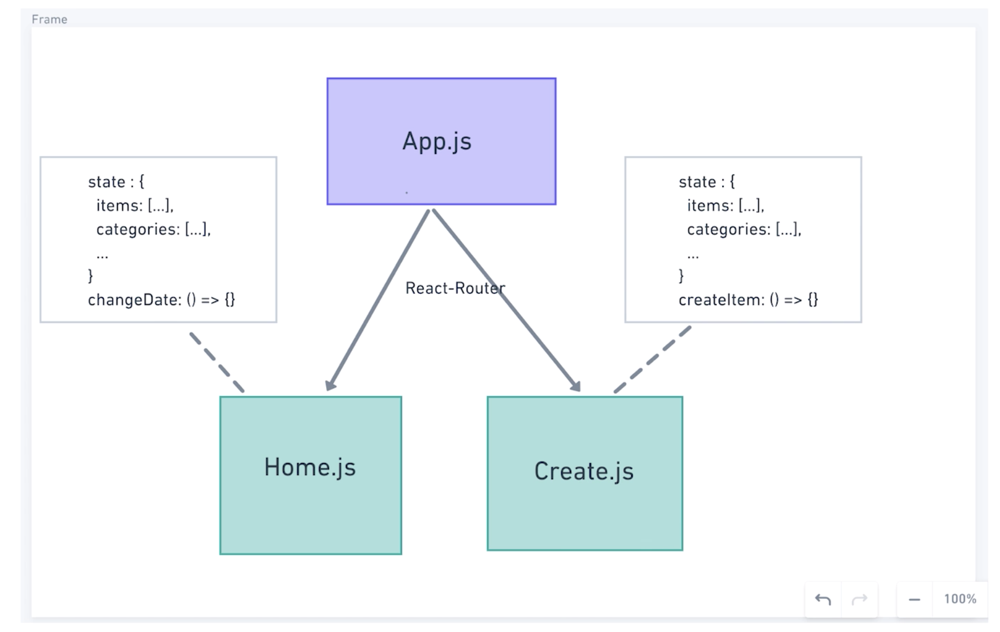

- 可以看到，现在的两个页面 Home.js 和 Create.js 是放在 App.js 这个父组件中由 React-Router 来进行路由的管理，并且两个页面是相互分离的，并没有任何的数据或者逻辑的关联。
- 不过，Home 组件和 Create 组件在某些数据上其实是相同的，因此我们需要将这部分数据进行共享，而目前最好的方式是将这些数据提升到父组件中进行管理——状态提升。

因此，状态发生一些变化，如图：

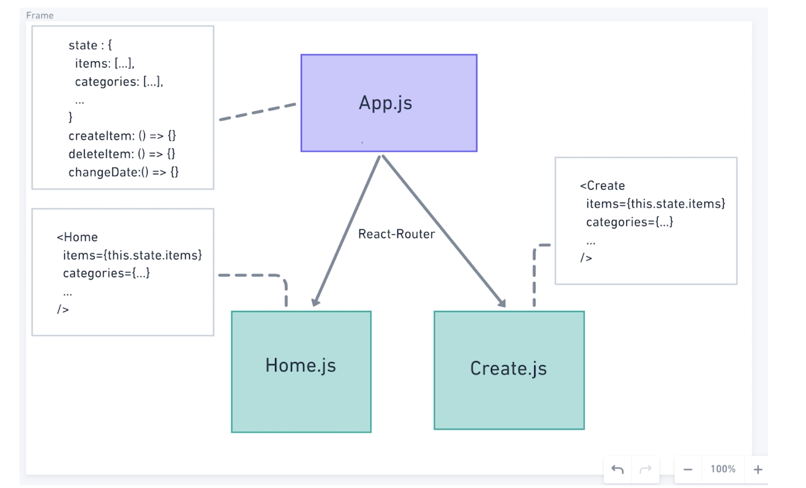

- 这里启发了我一个想法，当你在编写代码之前对项目进行分析时就应该去寻找很多共同逻辑与数据，比如不同的页面或者不同的容器组件中显示的内容是否相同，是否存在相同的删除相同内容的逻辑在不同的容器之中？这些都是可以在编写代码之前做一个规划的，以方便我们更好的进行开发。
- 虽然将状态提升到统一的地方进行管理是减轻整个项目重量的好办法，但是如果组件过多，就会造成传递数据的麻烦，所以之后肯定会将数据放在统一的地方进行管理，而不是单纯的将组件状态进行提升，比如使用 Redux
- 目前还是要考虑应用最小可变状态集，依然是那句老话 DRY（Don't Repeat Yourself），**找出应用程序的最小表示并计算所需要的任何请求**。比如我们之前在 Home 组件中所做的，将`category`数据抽象到一个新的对象`categories`中，然后将之前的`category`属性变为`cid`，通过这个 id 来获取`categories`中的对象。

### 目前 state 结构的数据操作方法

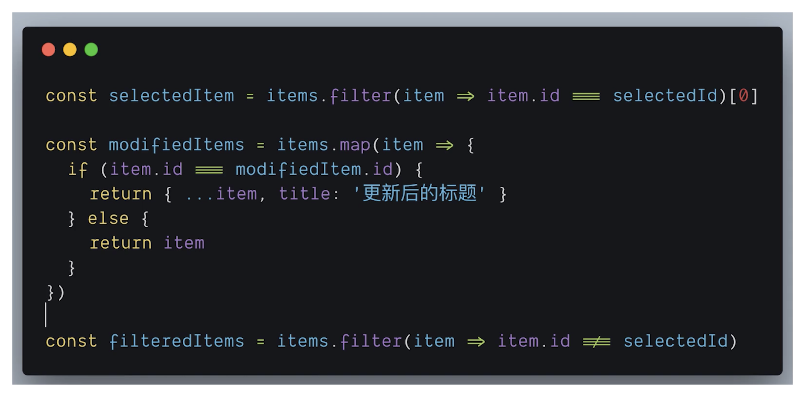

- 目前`items`是一个数组，所以如上代码所示，我们在做相关的处理时，基本都是使用数据方法对数组进行遍历，通过与当前所选项进行对比从而筛选出所需要的项，总的来说，稍微有点点麻烦。
- 所以，如果我们将`items`数组更改为像是之前所更改过的`categories`对象一样，使用`id`作为键名，然后每一项作为键值，这样的话，我们就不需要遍历，而是直接通过键名来获取想要的项即可。

### 数据结构更改之后的数据和操作数据的方法

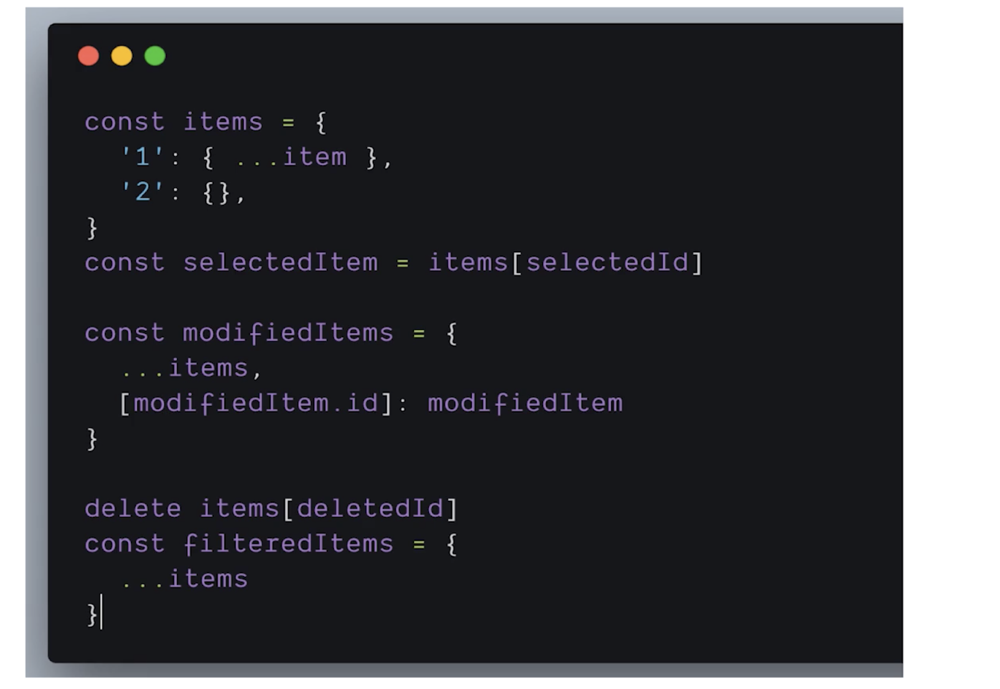

- 可以看到，`items`从 Array 变为了一个 Object
- 从而，查找数据变得很简单，直接通过`id`就返回想要的项
- 这里使用了`delete`这个关键字用来删除对象中的值

### Flatten State

这样的数据方式被称为「Flatten State」，可以从字面意思上看出是将数据变的平面化，也可以是将复杂的数据嵌套结构转换为扁平的结构（一层），然后使用将高层的数据存放到一个新的对象中，再添加一个外键来从这个对象中获取相关数据，从而与其他数据有一个扁平的依赖关系，而不是像之前那样一层一层去调用和获取数据。

#### 优点

- 解决数据冗余（因为很有可能会有重复数据，除非很特殊）
- 数据处理更容易（从对数组的遍历到使用键名来获取对象中的值）

### State 的进一步进化

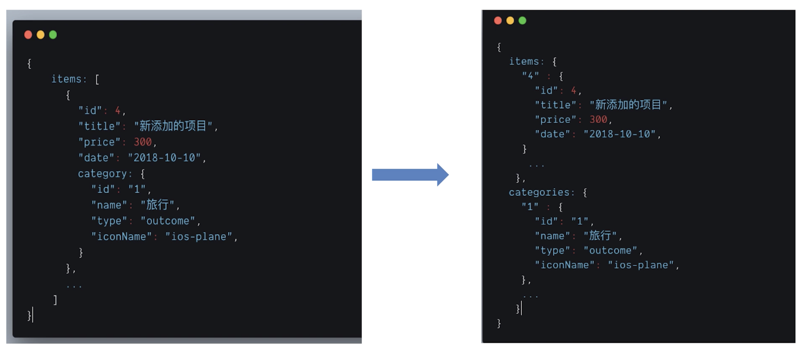

- 上面就是新的 state 的形式，一是将`category`抽象到`categries`中，二是将`items`从数组转变为对象。


## 7-2 Redux 和  Context 的解决方案

### 思考问题

有什么方法可以把一个组件的状态不通过 Props 传递给子组件？

- 全局 State，比如 Redux、Context

### 简单谈谈 Redux

官网 Slogan：Redux is a predictable state container for JavaScript apps.（为 JS apps 提供一个可预测状态的容器）

#### 什么是状态

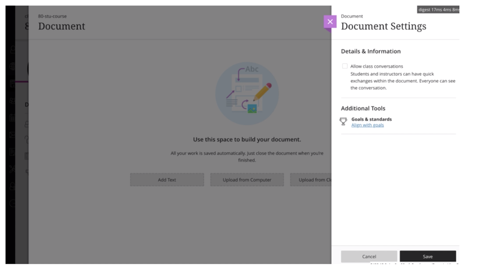

这个网页应用中存在着好几个页面，不同的页面都有各自的数据，但是这些数据相互之间有可能是有关系的，那么当前这些数据所展示出来的形式就可以称为状态。比如最外层的 Document Settings 有自己的状态，灰色页面的 Document 也有自己的状态。当状态复杂到一定程度之后，页面状态之间又有很复杂的相互关系时那就会有很多问题，比如状态同步，可能你改变了这个页面的状态之后也需要改变另一个页面的状态。

所以，我们需要把这些状态这些数据放到一个地方来统一管理，对于这些相同数据而言，在一个地方修改过后的数据，在另一个地方通过一些方法来告诉它们数据发生了改变，从而改变它们的状态，也就不需要我们再想办法去更改另一个地方的数据。

#### 解决方法

所以可能会存在这样的数据：

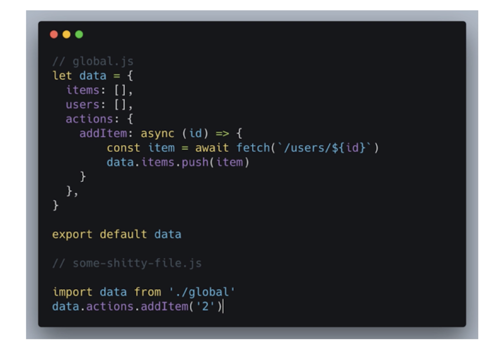

Redux 和上面这个的数据结构其实很像，大概也是这样的一个数据结构，不过其改变数据的方式不同，你不能直接进行更改。

直接修改数据的麻烦在于如果出现的 bug，你很难发现数据是有由谁修改的。

#### Redux 解决方案

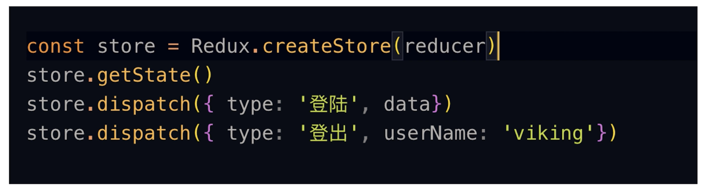

- store 的更改和获取需要使用特殊的方法。

#### Redux 简单总结

- 一种特殊的数据结构，类似于 Object
- 使用一些特殊的方法来实现数据的更改

- 不是 React 特有的，其他的框架或者使用原生 JS 进行开发都是可以的

#### Redux 和 React

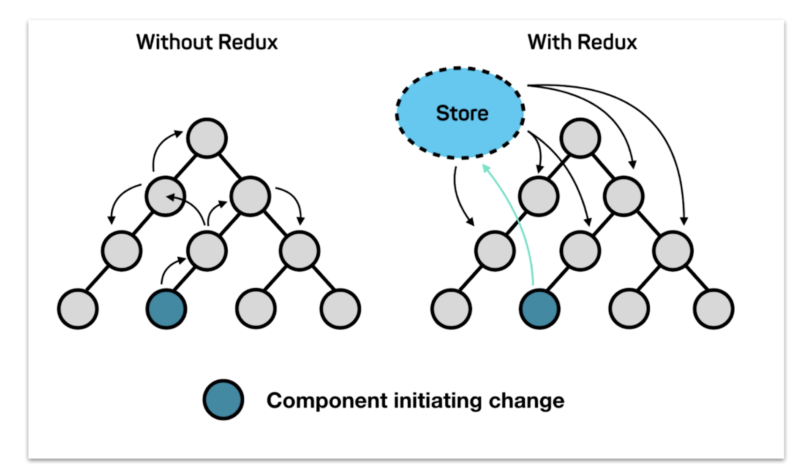

- 不使用 Redux 的情况下，我们需要一层一层的传递数据
- 使用 Redux 的情况下，我们就可以直接从 Store 中获取数据和对 Store 改变数据

#### 为什么不使用 Redux

- 学习成本（确实存在学习成本的问题，不过对于目前的我而言已经基本上会使用了）
- 增加数据流复杂度
- 需要增加太多的模版（Boilerplate）代码（Actions，Actions 常量，Reducer），从而使项目变得稍微有一点复杂

### 使用 Context 后的数据流

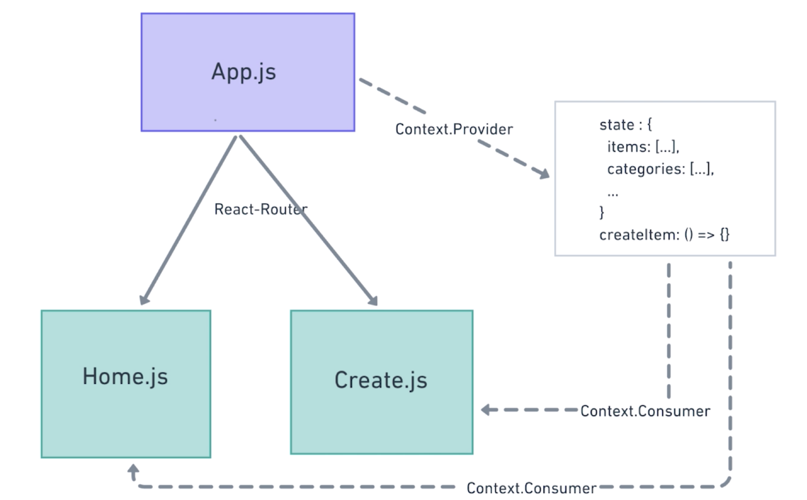

- 使用`Context.Provider`对`App.js`中的数据和数据方法进行包裹
- 使用`Context.Consumer`对`Home.js`和`Create.js`进行包裹
- 这样之后，就能够轻松的获取到父组件中的数据和方法了

对于小的项目又需要将数据统一管理并且组件层级较多传递数据麻烦而言，使用 Context 比使用 Redux 更加轻量级而且简单、方便。


## 7-3 添加 Context

> [Context](https://zh-hans.reactjs.org/docs/context.html) 提供了一个无需为每层组件手动添加 props，就能在组件树间进行数据传递的方法。

Context 分为两部分——Provider（数据提供者）和 Consumer（数据的使用者）

### 代码部分

#### 使用 Context 把状态和数据操作方法抽象到顶层

我将讲师的 testData.js 拷贝到了我的项目中，不过我们需要对这个这个数据进行更改，因为现在是对象数据的形式，我们要将其更改为对象形式，所以需要创建一个工具函数。如下：

```jsx
export const flattenArr = (arr) => {
  arr.reduce((map, item) => {
    map[item.id] = {...item}
    return map
  }, {})
}
```

- 使用了`reducer()`方法，可以创建一个初始值，然后将这个初始值放入回调中进行处理，返回后的新值会传入下次回调之中。这里我们是创建一个空对象，然后对这个对象添加属性，然后返回它。

然后为 App 组件添加状态和 Context：

```jsx
import { flattenArr } from "./utility"
import { testItems, testCategories} from './testData'

export const AppContext = React.createContext()
class App extends Component {
  state = {
    items: flattenArr(testItems),
    categories: flattenArr(testCategories)
  }
  render() {
    return (
      <AppContext.Provider value={{ state: this.state }}>
        <Router>
          <div className="App container">
            <ul>
              <li>
                <Link to="/">Home</Link>
              </li>
              <li>
                <Link to="/create">Create</Link>
              </li>
              <li>
                <Link to="/edit/32/zhaoenxiao">Edit</Link>
              </li>
            </ul>
            <Route path="/" exact component={Home} />
            <Route path="/create" component={Create} />
            <Route path="/edit/:id/:name" component={Create} />
          </div>
        </Router>
      </AppContext.Provider>
    )
  }
}
```

- 使用`Context`
  - 我们通过`React.createContext()`创建一个`AppContext`
  - 然后使用`AppContext.Provider`将组件包裹起来，并通过`value`属性传入想要传入的数据
  - 这样之后就可以在其内部组件中获取数据

- App 组件状态中的`items`数据和`categories`数据现在都是经过「flatten」之后的对象

### 为两个容器型组件添加 Context

#### 为 Create.js 添加 Contents

```jsx
import { AppContext } from "../App"

class Create extends Component {
  render() {
    const filterCategories = categories.filter(
      (item, index) => item.type === TYPE_INCOME
    )
    return (
      <AppContext.Consumer>
        {({ state }) => {
          console.log("AppContext", state)
          return (
            <div>
              <Tabs activeIndex={0} onTabChange={() => {}}>
                <Tab>支出</Tab>
                <Tab>收入</Tab>
              </Tabs>
              <CategorySelect
                categories={filterCategories}
                selectedCategory={categories[1]}
                onSelectCategory={this.handleSelectCategory}
              />
              <PriceForm onFormSubmit={() => {}} onCancelSubmit={() => {}} />
            </div>
          )
        }}
      </AppContext.Consumer>
    )
  }
}
```

- 先从 App 组件中会引入`AppContext`，然后使用`AppContext.Consumer`对组件进行包裹，最后使用一个回调用来接受从`AppContext.Provider`中传递过来的`value`，最后在这个回调中返回`Create`组件需要渲染的内容即可
- 注意这里使用了`{ state }`对`value`进行了结构，从而直接获取传入进来的 state

### 为 Home.js 添加 Contents

操作和在 Creact.js 中一样

### 问题

经过上面使用 Context 的操作，会发现有一个很麻烦的地方，每一次我们都需要引入`AppContext`然后使用`AppContext.Consumer`进行包裹，然后又要传入一个回调，回调中来返回组件应该渲染的内容。

这样的一系列操作所写的代码实际上是可以抽象出来的，下节课我们就会做这个工作。


## 7-4 使用高阶组件实现 Context 重用

上节课最后的为两个页面组件添加使用 Context 的代码其实很大一部分都是重复的，对于一个程序员而言如果有 DRY 出现，我们就应该想办法解决这个问题。

### HOC - 高阶组件

- 为解决组件逻辑重用的一种技术
- HOC 并不是 API，而是由 React 自身的这种组件组合模式而产生
- 是一个函数，且该函数接受一个组件作为参数，并返回一个新的组件
  - 对比于一个组件是将 props 和 state 转化为一个 UI，HOC 是将一个组件转换为一个自带内部逻辑的新组件

图示：

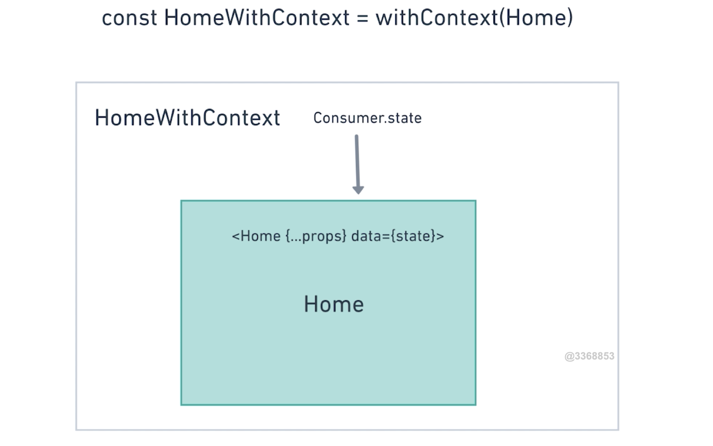

- 这里，`withContext`就是 HOC，传入旧组件`Home`，返回新的组件`HomeWithContext`
- 新的组件`HomeWithCOntext`中拥有 Consumer.state，然后将它传递给 `Home` 组件中，从而可以在 `Home` 组件中通过 data 来处理数据和渲染内容了。
- 高阶组件并**不关心数据如何被使用**，只负责数据的传递，而传入的被包裹组件也并**不关心数据来自何处**，只负责数据的处理，让两个行为在不同的组件中分离开来，互不影响。

#### 一个关于 React-Router 的例子

代码：

```jsx
import React from "react";
import PropTypes from "prop-types";
import { withRouter } from "react-router";

// A simple component that shows the pathname of the current location
class ShowTheLocation extends React.Component {
  static propTypes = {
    match: PropTypes.object.isRequired,
    location: PropTypes.object.isRequired,
    history: PropTypes.object.isRequired
  };

  render() {
    const { match, location, history } = this.props;

    return <div>You are now at {location.pathname}</div>;
  }
}

// Create a new component that is "connected" (to borrow redux
// terminology) to the router.
const ShowTheLocationWithRouter = withRouter(ShowTheLocation);
```

如果想在一个组件之中使用 Router 提供的方法，比如现在的路由本身、改变路由的方法、location 的信息，这个时候就可以使用`withRouter`这个高阶组件将组件进行包裹，比如这里被包裹的组件`ShowTheLocation`，那么`ShowTheLocation`的 props 中就会多出一些由`withRouter`所传传递来的数据，比如这里的`math` `loation` 还有 `history`。

所以，这里的 HOC 就是一个提供数据和方法的提供者，当然 HOC 除了提供数据之外也可以让组件中一些共同的操作。

### 编写高阶组件

> 在编写高阶组件之前，我想谈论一些我关于组件的一些想法。
>
> react 通过将组件进行组合，最终传递给`ReactDOM.render`之后，这个 API 就会将我们在组件内容的元素与 props、state 进行渲染成 DOM 放置到所传入的节点之下，比如我们应用中是这样的：`ReactDOM.render(<App />, document.getElementById('root'));`，我们放置在了一个 id 为 root 的节点之下。
>
> 那么，最终我们在页面中所看到的内容不过都是 DOM 元素所组成的而已，HOC 所返回的组件，组件返回的所有内容都是 DOM，这就是我想说的，我们要`render()`这些 DOM，无论是使传入 HOC 后的新组件，还是没有传入 HOC 的旧组件，都是为了返回这些 DOM

代码：

```jsx
import React from "react"
import { AppContext } from "./App"

export default function withContext(Component) {
  return props => {
    return (
      <AppContext.Consumer>
        {({ state }) => {
          return <Component {...props} data={state} />
        }}
      </AppContext.Consumer>
    )
  }
}
```

- 注意这里的`return`关键字有点多，我们从最里面的`return`开始说
  - 第 9 行的`return`，是返回传入 props data 后的组件，这是使用`Context`的特殊写法
  - 第 6 行的`return`，实际上是函数组件的`render`所返回的组件中需要渲染的 DOM 或者组件
  - 第 5 行的`return`，是返回一个新的函数组件
- 还需要注意，对于 HOC，一定要将本来传递给旧组件而现在传递给新组件的 props，在旧组件的属性中用展开运算符进行展开，保证旧组件依然能够使用这些 props，代码在第 9 行

#### 在 HOME 组件中使用 HOC

```jsx
import WithContext from "../WithContext"

//...

export default WithContext(Home)
```

- 很简单，引入`WithContex` HOC，然后传入 HOME 组件，接着返回这个经过 HOC 处理而获得 data 的新组件即可

（这里讲师又将 Create.js 传入了 HOC，但由于我想能够更直观的看到不使用 HOC 的情况，所以并没有进行更改）


## 7-5 扩展作业

现在要完成这么两个组件，一个是新闻列表组件，一个是用户列表组件，他们的逻辑很相似，从某个 URL 发送异步请求获取数据，在读取的时候显示 Loading 图标，数据获取完毕后显示不同的界面结构，如下面的图所示。你应该怎样设计这两个组件？有没有什么方法把他们重复的逻辑整合？假如我再有一个读取评论列表也可以很快的把逻辑应用进去？

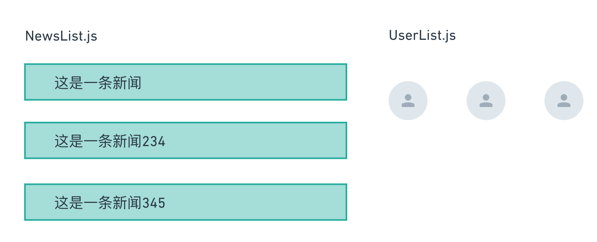

考虑创建一个 HOC 来完成这样的类似的功能。


