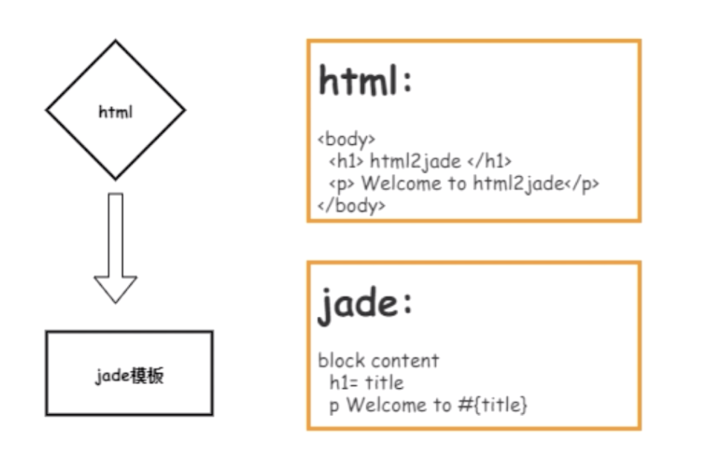
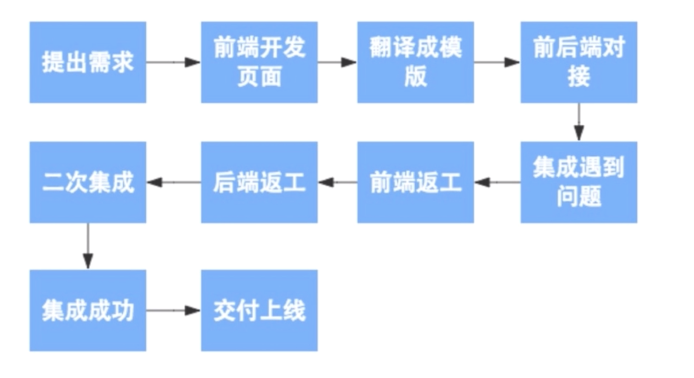
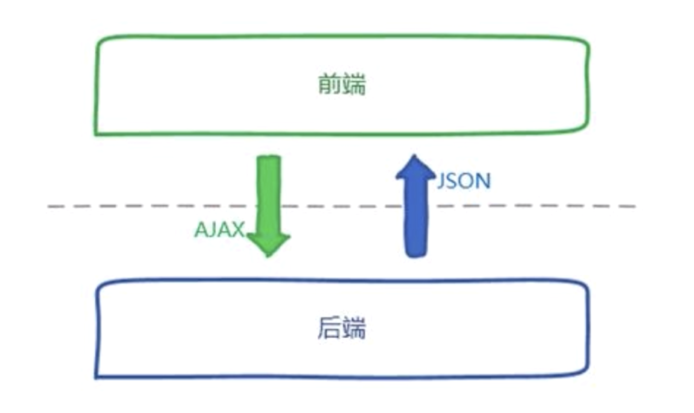
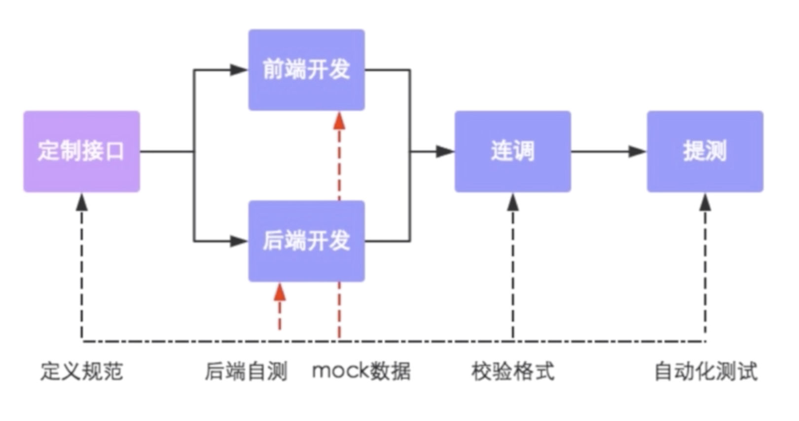
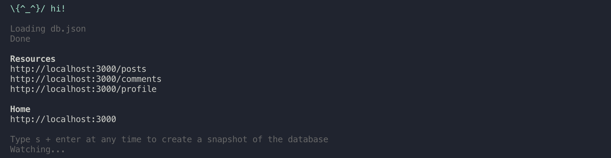
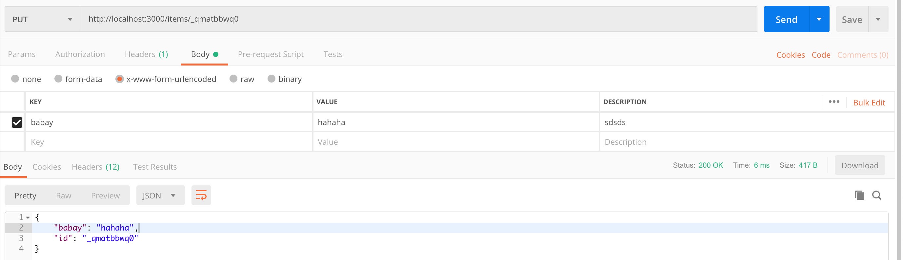
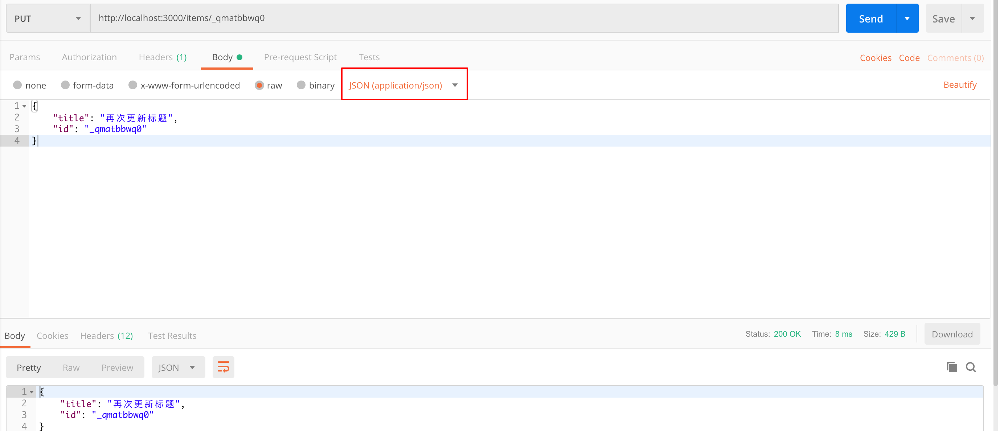

# 第8章 后端 Mock 环境

> 通过学习 restful 你会发现很多数据其实可以通过接口来进行处理，无论是查询和排序等，前端只需要处理好交互以后发送所要获取的数据请求然后可能需要做一些数据上的处理和拼接就能够完成很多数据显示的工作。

[TOC]

## 8-1 前后端分离开发概念

### 前端开发的发展历史

#### 上古时代



如图，当时的前端只需要写 HTML、CSS 和一些简单的 JS，然后把这些交给后端，后端拿到这些以后转换为所使用的语言的模版再添加一些数据交互，浏览器端就可以请求这些页面、数据了。

#### Node 的诞生

- 前端工程化 - 这个时期出现了像 Grunt、Glup、Webpack 这些可以使前端工程化的工具
- HTML 5 和 JS 的升级让前端独立开发应用和一些特别的应用场景成为可能
- React Native，微信小程序，PWA 等等**跨平台开发**

### 前后端分离之前的开发模式



- 这种开发模式效率很低，因为是**串行开发**，前端需要等后端的数据，后端需要等前端的模版，处于一个相互依赖的状态。

### 前后端分离后的数据交互方式



前端有一个自己的开发服务器，不需要依赖后端服务器来支持项目的运行，从而摆脱了对后端接口的依赖。

前后端分离特别适合于 SPA 的开发，因为数据都是异步获取的，后端只需要专注数据接口逻辑的开发，而前端开发注重于页面业务逻辑的实现，至于数据的参数和返回方法等等双方可以使用 restful 的接口规范。

### 前后端分离后的开发模式



- 定制接口 —— 可以在文档中记录接口的各种信息
- 前端开发与后端开发是并行进行的
  - 前端借助 node 写好的工具提供给自己的 mock server，mock server 虽然是假的服务器，但是和后端服务器的接口规范完全一致，无论是请求方法还是数据格式。
- 等双方的开发完成之后，就可以开始进行连调，检验格式是否正确，接口是否有问题。
- 提测 —— 自动化测试

### 前后端分离开发的优点

- 为优质产品打造精益团队
- 提升开发效率
- 完美应对复杂多变的前端需求
- 增强代码可维护性


## 8-2 使用 json-server 打造 mock server

### server 选型

node 比较流行的 server 有 express、koa、an.js 等等，但是这些都是成熟的解决方案，它为解决的是一个真正的生产环境而服务，实施需要大量的逻辑代码，不太符合我们的需求。

#### 优秀的 mock server 应该有的特性

- 快速搭建
- 支持标准的 Restful 操作
  - 比如 PUT、DELETE、POST 等
- 支持标准的 Restful 路由规则
  - 比如查询 customers 这个集合需要访问`/customers`，查询单个的 customer 需要访问`/customers/{customerId}`
  - 也可以使用一些查询的操作`?`、排序、分页等等
- 一些进阶扩展，比如说自定义路由、中间件支持等等

最后，隆重推出 [json-server](https://github.com/typicode/json-server) 

### 使用

安装：

```shell
npm install json-server --save-dev
```

在项目根目录下，使用一些数据来创建一个`db.json`的文件

```json
{
  "posts": [
    { "id": 1, "title": "json-server", "author": "typicode" }
  ],
  "comments": [
    { "id": 1, "body": "some comment", "postId": 1 }
  ],
  "profile": { "name": "typicode" }
}
```

在`package.json`的`scripts`字段中添加一条快捷命令：

```json
{
  "scripts": {
		//...
    "mock":"json-server --watch db.json"
  },
}
```

运行这个脚本：

```shell
npm run mock
```

然后会在终端中显示如下信息：



- 可以看到以 restful 为表中的接口已经显示出来了，直接访问就可以获得这个接口的数据
- 如果想要获取单一的数据，按照 restful 的规则添加 id 即可

## 8-3 分析和创建 Restful 接口

### 分析应用的接口

> 在分析接口时应看着**原型图**来进行思考和分析

- `/items` - GET，POST
  - 在 Home 页面中我们需要获取整个列表项，并且我们需要能够在 Create 中添加新的项
- `/items/{id}` - GET，PUT，DELETE（singleton 方法）
  - 当我们点击修改按钮进入修改页面时，我们需要通过 id 来请求单一数据（GET），并且当我们修改之后也需要对这一条数据进行修改（PUT）
  - 当我们点击删除按钮时，也需要删除这一条数据（DELETE）
- `/items?monthCategory=2018-8&_sort=timestamp` - GET
  - 在 Home 页面中，我们需要通过选择不同的年月来筛选出所需要显示的条目，那么就需要一个查询接口并且也需要支持能够以某种方式排列返回接口
- `/categories` - GET，POST
  - 在 Create/Edit 页面中我们也需要分类图标的数据
  - （这里的 POST 我不知道有什么用）
- `/categories/{id}` - GET，PUT，DELETE
  - （这三个操作似乎都没有用到，我觉得应该是 json-server 这个 server 帮我们自动生成了这些操作）

分析过后，我们就可以用我们现在的 mock data 去替换掉之前官方提供给我们的示例代码了。

现在我们有接口，那么对于测试接口，是否有一款好用的工具可以让我们测试 API 的接口，是否可用和返回正确的值，下节课将介绍一款老少皆宜、简单好用的 API 测试工具。

## 8-4 使用 Postman 测试 API

上节课我们分析了账本应用中有可能需要使用到的接口，并且使用 json-server 快速搭建了一个 mock server，但是在我们浏览器中，我们似乎只能通过直接访问 API url 来测试 GET，而其他的一些 methods 似乎就无法直接测试到。那么对于 json-server 是否如官方文档所说会自动生成那么路由和方法呢，这就没有办法直接通过浏览器访问地址而检测了。

所以，我们需要一款好的工具来测试接口的返回数据，这个工具不仅可以针对于 mock server 的测试，对你工作中任何后端开发工程师开发提供的接口都可以进行非常迅速与方便的测试。

如果大家对 terminal 非常了解，可能会听说过 cul，如果你是一个 termial 重度爱好者，那么这个工具非常的适合你，但是对于一般普通开发者而言，那么复杂的参数会使不常用的人感到麻烦，而且对于前端工程师而言不是应该更喜欢有 UI 的工具吗？

### 隆重推出：[POSTMAN](https://www.getpostman.com/)

之前它只是一个 chrome 的插件，而如今已经有独立的客户端了。

优点：

- 支持各种操作系统
- 有非常简洁易用的界面
- 可以支持 API 测试的导出，很容易分享给其他开发
  - 其他的开发也就不用手动的去建立这些 API 的测试，而是直接使用这些已经写好的测试

操作的方式都很简单，基本上一看就明白做什么的。

### PUT 和 PATCH 方法

PUT 和 PATCH 方法都是用于修改数据，但它们却有所不同。

#### PUT

PUT 方法会将之前所有的字段都替换为新的字段，只保留`id`

这里需要注意

如果使用「x-www-form-urlencoded」的方式，也就是表单的方式进行更改，则很简单的填写 key 和 value 就可以了，如下：



如果使用「raw」也就是空白的内容进行更改，最好选择 JSON 数据的格式：



#### PATCH

PATCH 方法只更新你所传入的`key`的那一个字段，而不会将其余字段删除掉。


### Postman - Collection 

我们可以在左侧点击 Collections 标签进入 Collections 下的视图创建一个 collection，然后创建一些 API 的测试，然后就可以自动化的完成测试，并且也支持把这些测试分享给其他的开发者。

