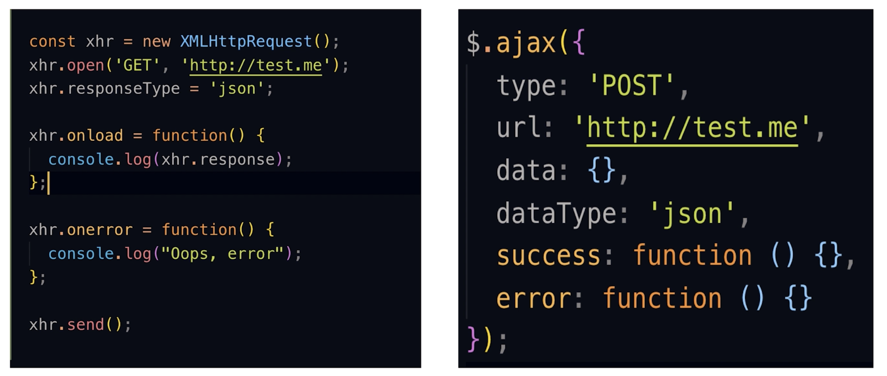
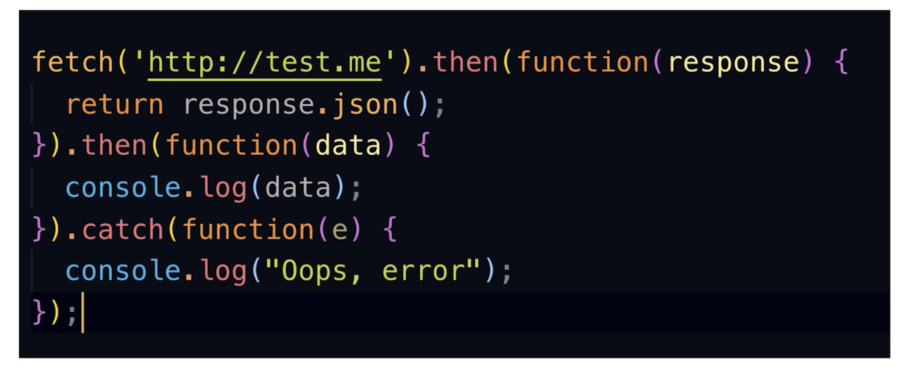
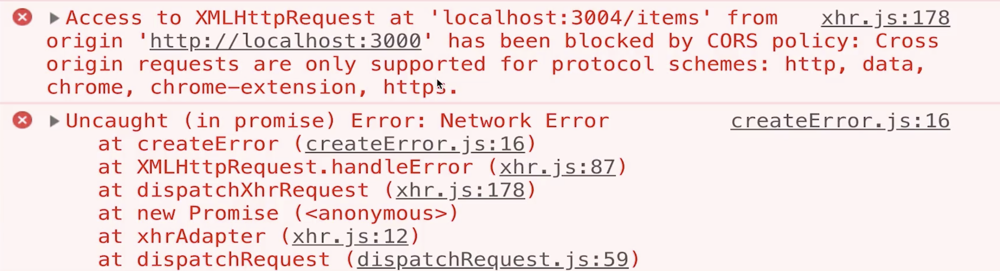
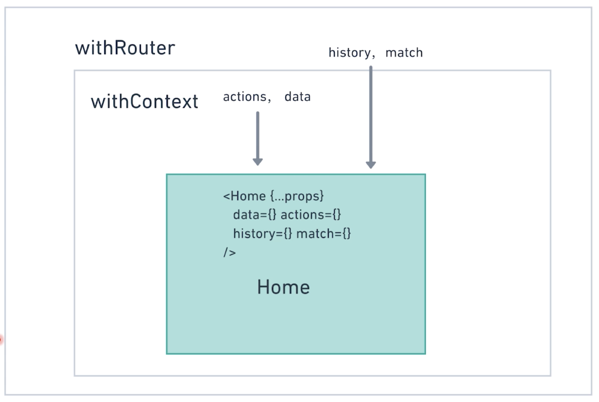

# 第9章 动静结合

> 一个使用术语的问题，之前写的是「App 组件状态」，更改为了「App 组件 state」，原因是组件状态其实包含组件所要渲染的一切，包括元素、子组件、从父组件中所获取的 props，这些 HTML 与 数据。所以，我会觉得使用 state 比使用状态这个词要好准确的多。当然更准确的是 App 实例的属性 state，但很少接触到实例所以可以不用说的这么麻烦。

[TOC]

### 9-1 下一代的 HTTP 库：Axios_x264

对接后端，我们需要一款趁手的可以发送异步请求的库。

### 原生 XHR 和 $.ajax 



整个 XHR 是一个设计很粗糙的 API，调用和配置相对也很混乱，所以 jQuery 对其进行了一些封装，使开发人员能够方便的使用 ajax 请求。不过随着时代的发展，如今像使用 jQuery 这样直接通过操作 DOM 来进行开发的模式逐渐被一些框架所替代，我们不可能为了使用`$.ajax()`而在项目中引入 jQuery。还好，如今 W3C 组织提出一个新的 API——基于`promise`的`fetch`

### Fetch



但是这个 API 还是比较偏向底层，而且有些代码和操作有点冗余，比如一个`then`中回调所做的事情，就是简单的返回一个 json 数据，而且还有一些缺点，如下：

- ##### 只对网络请求报错，对 400、500 都当作成功的请求，从而对于这些请求我们就需要进行封装去判断
- 默认不会带 cookie
- 不支持 abort，不支持超时控制

  - 意思是，当我发起一个 fetch 请求之后没有办法取消或者暂停这个 fetch，比如一个场景，我发送一个请求，在 5 秒之后如果没有反应，则把这个请求 abort 掉，但 fetch 没有这个操作
- 没有办法原生检测请求的进度
  - 但这个在 xhr 中可以做到，添加一个 onprogress 的事件
  - 而且这个需求会很重要，比如说用户上传时查看上传了多久

所以，fetch 目前还不是一个功能很完善的版本，不太适合现在在大量生产中使用

### 今天的主角 - [Axios](https://github.com/axios/axios)

#### 优点

- 浏览器和 node 环境都可以使用
- 完全支持标准的 Promise API
- 简单易用的 API
- 取消请求，JSON 数据自动转换 等等功能


## 9-2 学习 axios 的简单用法

### 更改 mock server 端口号

在开始使用 axios 之前，我们先来更改一下使用 json-server 所创建的服务器的默认端口，在`package.json`的`"scripts"`字段下：

```jsx
"scripts": {
		//...
    "mock": "json-server --watch db.json --port 3008"
  },
```

- 添加一个命令`--port 3008`

### 使用 concurrently 同时运行多个脚本

然后，我们现在需要在终端中通过两个不同的命令启动两个服务器，是否有一种方式可以通过一个命令来完成呢？

[concurrently](https://github.com/kimmobrunfeldt/concurrently) 就是这样的一个工具，安装：

```shell
npm i concurrently --save-dev
```

这个工具就是作者认为在不同的终端窗口中去运行不同的命令是很烦躁的一件事情。

使用，我们在`package.sjon`文件中的`"scripts"`字段中添加一个新的命令：

```jsx
"scripts": {
  //...
	"sm": "concurrently \"npm run start\" \"npm run mock\""
}
```

- 讲师是将`"start"`进行了更改，而我觉得有些时候我并不需要运行 mock server 所以就自己添加了一个新的脚本`"sm"`

### 解决跨域问题

当我们使用`axios`请求数据之后，在控制台中会显示如下的错误提示：



也就是因为同源策略，我们不能进行跨域请求。

可能我们需要使用 JSONP 等方法来解决这个问题，不过在这里我们可以直接使用 create-react-app 提供给我们的一个功能就可以解决。

在`package.json`中添加一个字段（参数）`"proxy"`，然后传入一段字符串，就可以解决：

```json
"proxy":"http://localhost:3008"
```

- 意思是 create-react-app 可以自动把我们的异步请求代理到上面那个参数中的地址从而解决异步问题。

- [相关文档](https://github.com/facebook/create-react-app/blob/7ec36479b303939f320c6c5c353dceb00ae0e2e9/docusaurus/docs/proxying-api-requests-in-development.md)

### axios 的 GET 和 POST

```jsx
import axios from 'axios'

axios.get('/items').then((response) => {
  console.log(response)
})

const newItem = {
  "title": "请别人喝茶"
  //...
}

axios.post('/items',newItem).then(response => console.log(response))
```

- 大概就是这样，更多内容可以去查看官方文档。


## 9-3 改造首页支持异步流程

在更改之前，首先分析首页需要的异步请求有什么？

- 根据年月来选择所需要显示的内容
- 删除条目

### 根据月份来显示列表

#### 初始化数据

首先，应该将之前使用`testData.js`中数据的`App`的`state`更改为由异步从 mock server 获取的数据。

App 组件 state：

> 一个使用术语的问题，之前写的是「App 组件状态」，更改为了「App 组件 state」，原因是组件状态其实包含组件所要渲染的一切，包括元素、子组件、从父组件中所获取的 props，这些 HTML 与 数据。所以，我会觉得使用 state 比使用状态这个词要好准确的多。当然更准确的是 App 实例的属性 state，但很少接触到实例所以可以不用说的这么麻烦。

```jsx
state = {
  items: {},
  categories: {}
}
```

然后需要在 App 的`actions`中添加一个 action 用于当页面渲染时请求`items`和`categories`，代码如下：

```jsx
actions = {
  getInitalData: () => {
    const currentDate = parseToYearAndMonth('2018-12-03')
    const itemsURL = `/items?monthCategory=${currentDate.year}-${currentDate.month}&_sort=timestamp&_order=desc`
    const promiseArr = [axios.get(itemsURL),axios.get('/categories')]
    Promise.all(promiseArr).then( arr => {
      const [items, categories] = arr
      this.setState({
        items: flattenArr(items.data),
        categories: flattenArr(categories.data)
      })
    })
  },
```

- 第 3 行，为了测试数据是否请求成功，我使用的是`2018-12`月份，因为`db.json`中这部分的数据最多
- 第 4 行，items 接口的拼接，使用了查询和排序，`_sort`是排序，可以使用任何在你数据结构中的字段，`_order`是设置是升序（asc）还是降序（desc），因为我们需要最新的一项靠近最上面，所以使用降序（desc）
- 第 5 ～ 12 行，由于使用了`Promise.all`，所以我们需要传入一个由`Promise`组成的数组，当两项数据请求成功之后，就会接受到一个 response 数组，最后获取数据，再将其「打平」就行了。
  - 这里当然是可以不使用`Promise.all`，而使用的好处是可以把`setState`放在一个地方调用。

由于我们需要`items`和`categories`数据的组件是`Home`，所以获取这两个数据的操作应该放在`Home`组件中进行，如下：

```jsx
// Home.js
componentDidMount(){
  this.props.actions.getInitalData()
}
```

这样做之后，我们就可以获取到 2018-12 月份的数据了。

接着，既然后端接口帮我们进行了数据的筛选，我们就不必自己再筛选一次，可以山删除以下代码：

```jsx
.filter(item =>
        //过滤出所选择月份的条目
        item.date.includes(
  `${selectedDate.year}-${padMonthLeft(selectedDate.month)}`
)
       )
```

#### 添加选择月份后的数据请求逻辑

首先还是在 App.js 中添加一个 action：

```jsx
selectNewDate: (year, month) => {
  const itemsURL = `/items?monthCategory=${year}-${month}&_sort=timestamp&_order=desc`
  axios.get(itemsURL).then(res =>  {
    this.setState({
      items: flattenArr(res.data)
    })
  })
},
```

- 这个 action 就相对简单很多，因为只需要请求 items

然后在 Home 组件选择月份的交互中添加请求数据的逻辑：

```jsx
handleChangeDate = (year, month) => {
  this.setState({
    selectedDate: {
      month,
      year
    }
  })
  this.props.actions.selectNewDate(year, month)
}
```


### 删除条目的数据处理

这个很简单，只需要对接口`DELETE`之后，如果处理成功则更新 state 即可：

```jsx
deleteItem: item => {
  axios.delete(`/items/${item.id}`).then(res => {
    const clone = { ...this.state.items }
    delete clone[item.id]
    this.setState({
      items: clone
    })
  })
}
```

> 需要注意的是`json-server`所搭建的 mock server 会真实的改变我们位于`db.json`中的数据，比如删除，比如修改，所以如果在测试过程中不会因为删除而删掉`db.json`中的数据，可以在 commit 之前，恢复位于`db.json`中的数据。


目前项目还是存在一些问题，比如如果当请求失败或者请求缓慢时应该给予提示。


## 9-4 使用 async 改造异步流程

### 添加 Loader

添加一个 loader，让数据读取时给使用者一个提示，可以是一个简单的 functional component，然后在 App 的 state 中添加一个`isloading`的变量来作为状态变化的依据。

Loader 组件：

```jsx
export default function Loader() {
  return (
    <div className="loading-component text-center">
      <Ionicon icon="ios-refresh" fontSize="40px" color="#347eff" rotate={true} />
      <h5>加载中...</h5>
    </div>
  )
}
```

- `rotate`属性可以让这个图标旋转

然后在 App 的 state 中添加一个 isLoading 的状态，并且更改一些请求数据的方法，使刚开始执行这些方法的时候显示加载，当请求完成时不显示：

```jsx
getInitalData: () => {
  this.setState({
    isLoading: true
  })
	//...
  axios.get(itemsURL).then(res => {
    console.log(res)
    this.setState({
      items: flattenArr(res.data),
      isLoading: false
    })
  })
},
```

最后，在 Home 组件中添加`<Loader>`组件，并且根据`isLoading`来判断是否渲染：

```jsx
{isLoading && <Loader />}
```

###  使用 ES7 的新特性  async 函数

> [ES6 入门 - async 函数](<http://es6.ruanyifeng.com/?search=await&x=0&y=0#docs/async>)
>
> async 函数是什么？一句话，它就是 Generator 函数的语法糖。
>
> `async`函数就是将 Generator 函数的星号（`*`）替换成`async`，将`yield`替换成`await`，仅此而已。
>
> `async`函数返回一个 Promise 对象，可以使用`then`方法添加回调函数。当函数执行的时候，一旦遇到`await`就会先返回，等到异步操作完成，再接着执行函数体内后面的语句。
>
> `async`函数内部`return`语句返回的值，**会成为`then`方法回调函数的参数**。
>
> `async`函数返回的 Promise 对象，必须等到内部所有`await`命令后面的 Promise 对象执行完，才会发生状态改变，除非遇到`return`语句或者抛出错误。也就是说，只有`async`函数内部的异步操作执行完，才会执行`then`方法指定的回调函数。

目前项目中请求数据的方式是使用`Promise.all().then()`或者`axios.get().then()`这样基本的`promise`的用法，而接下来我们会 async 函数来进行替换。

async 函数是目前异步操作最好的解决方案，是对 generate 函数的一种语法糖，async 函数会返回一个 promise 对象，然后可以使用 then 方法利用回调函数来获取 async 函数的返回值，当函数执行时遇到 await 会等着这个异步操作完成时再执行函数体内后面的语句。

现在，我们来将我们的 actions.getInitalDate 更改为使用 async 函数：

```jsx
getInitalData: async () => {
  this.setState({
    isLoading: true
  })
  const currentDate = parseToYearAndMonth("2018-12-03")
  const itemsURL = `/items?monthCategory=${currentDate.year}-${
  currentDate.month
  }&_sort=timestamp&_order=desc`
  const promiseArr = [axios.get(itemsURL), axios.get("/categories")]
  const response = await Promise.all(promiseArr)
  const [items, categories] = response
  this.setState({
    items: flattenArr(items.data),
    categories: flattenArr(categories.data),
    isLoading: false
  })
  return response
},
```

- R1 - 首先使用`async`关键字来表示这个函数是一个`async`函数
- R10 - 然后我们就可以在里面使用`await`关键字来直接获取由`Promise`返回给调用`then()`时传入的回调函数中的参数，这样我们不需要再使用`then(callback(response))`来获取`response`

- 整个 async 函数会返回一个 promise 对象，所以当我们调用`getInitalData`之后，可以通过`then()`来进一步获取返回值并做一些操作，比如重新更新**当前组件**的 state

接下来我们把需要执行异步操作的`selectNewDate`与`deleteItem`都改变为 async 函数：

```jsx
selectNewDate: async (year, month) => {
  this.setState({
    isLoading: true
  })
  const itemsURL = `/items?monthCategory=${year}-${month}&_sort=timestamp&_order=desc`
  const res = await axios.get(itemsURL)
  this.setState({
    items: flattenArr(res.data),
    isLoading: false
  })
  return res
},
  deleteItem: async item => {
    this.setState({
      isLoading: true
    })
    const res = await axios.delete(`/items/${item.id}`)
    const clone = { ...this.state.items }
    delete clone[item.id]
    this.setState({
      items: clone,
      isLoading: false
    })
    return res
  }
```

- R17 - 在`deleteItem`中，似乎存在一个问题，因为感觉删除操作如果发生错误也会执行之后的逻辑，但其实并不会，因为一点在 async 函数中发生错误就会停止后面代码的执行，并向外返回错误信息，可以通过`catch()`或者`then()`的第二个参数位置传入回调来获取错误信息。

好了，我们将这些异步操作都换成了 async 函数来执行，但还存在一个麻烦，因为每一次的异步请求，似乎都需要在最前面先把`isLoading`更改为`true`，等操作完成时再将其更改为`false`，如果我们有很多这样的异步操作都这样做就会使代码变得很冗余，所以下节课我们会使用高阶函数来解决这个问题。

## 9-5 改造创建条目页和编辑页

### 使用高阶函数减少重复代码

先来分析上节课留下的问题，每一个异步操作在之前都需要先`this.setState({isLoading: true})`，这样是一件很繁琐的事情，那么对于组件可以使用高阶组件来帮助我们做一些重复性的事情，对于函数一样也应该有高阶函数来处理一些重复的事情，只是一个返回的是组件，一个返回的是函数。代码如下：

```jsx
const withLoading = (cb) => {
  return (...args) => {
    this.setState({
      isLoading: true
    })
    return cb(...args)
  }
}
```

- R2 与 R6 - 使用展开运算符将获取到的参数传递给 cb 进行调用，这样就不会让一些需要参数的 async 函数发生错误。
  - R2 使用了剩余参数，可以将传入函数中的参数都放入 args 这个数组中
  - R6 使用了展开运算符，将 args 数组中的参数解构出来，一一放入函参的不同位置上

使用：

```jsx
getInitalData: withLoading(async () => {
  const currentDate = parseToYearAndMonth("2018-12-03")
  const itemsURL = `/items?monthCategory=${currentDate.year}-${
  currentDate.month
  }&_sort=timestamp&_order=desc`
  const promiseArr = [axios.get(itemsURL), axios.get("/categories")]
  const response = await Promise.all(promiseArr)
  const [items, categories] = response
  this.setState({
    items: flattenArr(items.data),
    categories: flattenArr(categories.data),
    isLoading: false
  })
})
```

- 很简单，只需要将这些需要使用`this.setState`的函数传入`withLoading`这个高阶函数即可。

> 高阶函数与高阶组件有共同的一些特点：
>
> - 首先都是函数
> - 返回函数或组件
> - 执行一些需要重复的操作
> - 被返回的函数或者组件需要接收外面传进来的参数或者值，然后传入回调或者传递给组件内部的子组件。

### 改造创建条目页和编辑页

首先有一个问题，当我们在创建条目页和编辑页面时，如果刷新页面，分类的图标和预先填入表单中的信息会消失，原因是刷新页面之后，react app 要重启构建，之前存在于 App 组件中的状态则会初始化，而我们获取初始化数据 items 和 categories 的操作是放在了 Home 组件之中，而在编辑页面中刷新页面并不会加载 Home 组件从而无法获取初始化数据。

那么我们就需要给编辑、创建页添加获取数据的方法，对于 Create 组件需要获取哪些数据呢？

- categories 用于显示分类图标，可供用户选择
- 如果是编辑页面，也需要获取收支数据列表中 id 对应的条目以使能够填充到表单之中用于编辑

#### 添加获取数据的逻辑：

```jsx
getCreateData: withLoading(async id => {
  const { items } = this.state
  const promiseArr = [axios.get("/categories")]
  if (id) {
    const ulrWithId = `/items/${id}`
    promiseArr.push(axios.get(ulrWithId))
  }
  const [categories, editItem] = await Promise.all(promiseArr)
  if (id) {
    this.setState({
      categories: flattenArr(categories.data),
      // 展开之前的 items，因为有可能是从主页面到编辑页面
      items: {...items, [id]: editItem.data},
      isLoading: false
    })
  } else {
    this.setState({
      categories: flattenArr(categories.data),
      isLoading: false
    })
  }
  return {
    categories: flattenArr(categories.data),
    editItem
  }
})
```

然后在 Create 组件中调用：

```jsx
componentDidMount(){
  const { id } = this.props.match.params
  this.props.actions.getCreateData(id)
}
```

接着，我们依然无法看到填充的数据和已经有被选样式的图标，只是可以看到图标😢

原因先看代码：

```jsx
// PriceForm.js
state = {
  isEdit: !!this.props.item,
  title: this.props.item ? this.props.item.title : "",
  price: this.props.item ? this.props.item.price : "",
  date: this.props.item ? this.props.item.date : ""
}

//CategorySelect.js
state = {
  selectedCategory: this.props.selectedCategory
}
```

- 无论是`PriceForm`组件中的表单 value 还是`CategorySelect`组件中的图标项，其数据来源都是组件本身的 state，虽然 state 会根据 props 的来源进行判断更改，但是一个组件的 state 的初始化是在`constructor`中完成的，而`constructor`只在组件第一次挂载在页面时才会运行，对于 props 改变的更新，组件并不会再次执行`constructor`，所以我们需要使用`componentDidUpdate`钩子来更改 state

- 虽然有一个办法是组件只使用 props 的数据而不使用自身 state 的数据，但这样组件自身没有状态之后，就不能单独进行一些动态的变化了，因为在缺少 props 和 state 的情况下，组件并不会刷新。

- 结果发生了错误：

  > Maximum update depth exceeded. This can happen when a component repeatedly calls setState inside componentWillUpdate or componentDidUpdate. React limits the number of nested updates to prevent infinite loops.

  因为如果你在`componentDidUpdate`中进行更新`state`，那么就会无限的循环更新。

- 好吧，还是使用 props 吧，不过对于 state，我也有一些想法，组件内部依然可以有自己的一些状态来管理一些动画效果，因为这些 state 并不会真正的与其他组件之间有什么交互。

先来解决`CategorySelect`组件，其实我都不需要添加任何代码，只需要把 state 删掉，然后使用 props 中的`selectedCategory`值即可。

问题是这样更改之后依然会有问题，因为我们在使用`actions.getCreateData`获取数据之后，组件`Create`的 state 并没有更新，而`CategorySelect`的 props 来源于`state`，所以需要更新，很简单：

```jsx
componentDidMount() {
  const { id } = this.props.match.params
  this.props.actions.getCreateData(id).then(({ categories, editItem }) => {
    this.setState({
      selectedType: editItem ? categories[editItem.cid].type : TYPE_EXPENSE,
      selectedCategory: editItem && categories[editItem.cid]
    })
  })
}
```

我们的 async 函数`getCreateData`所返回的是 promise，而且将会把返回的数据传入回调的第一个参数之中，所以可以在执行了`getCreateData`之后通过`then`获取数据之后更新 state 即可。

（在这里我想提示一个编程习惯 —— 数据检测，比如当你想要获取`items.id`中的值之前，最好先检测`items`是否存在，如果是要获取`items.id.cid`的值，则除了检测`items`之外还需要检测`items.id`，应该养成这样的习惯，一旦调用某个对象或者数组中的值之前，先判断这个对象或者数组是否存在，以免发生错误。）

好了，解决了`CategorySelect`的问题之后，就需要解决`PriceForm`了，这个组件的麻烦之处在于其 input 的 value 是由组件状态来控制的，如果想要填充这些 input，只能改变 state，而改变 state 最好的地方就是`componentDidMount`，也就是我们在`PriceForm`的`componentDidMount`中再获取一次需要填充的值，然后再更新一次 state 即可，可是如果是同步代码，如下：

```jsx
componentDidMount(){
  this.setState({
    isEdit: !!this.props.item,
    title: this.props.item ? this.props.item.title : "",
    price: this.props.item ? this.props.item.price : "",
    date: this.props.item ? this.props.item.date : ""
  })
}
```

父组件 Create 异步获取 items 比较慢，那么在这里我们依然无法获取到想要获取的值。

所以还是异步获取比较合适，当确定完成了异步请求以后我们再更新`state`，所以，如果要使用`componentDidMount`，那我们就在`PriceForm`组件中再获取一次数据即可：

```jsx
componentDidMount() {
  const { id } = this.props.match.params
  this.props.actions.getCreateData(id).then(({ categories, editItem }) => {
    const { title, price, date } = editItem
    this.setState({
      title,
      price,
      date
    })
  })
}

export default withContext(withRouter(PriceForm))
```

- R13 - 由于要使用 `actions` 还要使用`match`，所以使用两个 HOC 来传递着两个参数给组件

这样是完成了，但是却非常的麻烦，因为异步获取这个数据的操作本来已经做过了，在容器组件`Create`中就存在这些值，但我们又在`PriceForm`组件中重复了请求，这并不是一个好的解决办法。

这里，我思考了一种方式，对于受控组件，input 的状态是由组件来管理，但并不一定是由当前所在组件，可以由当前所在组件的父组件，或者其他的组件，或者`Context`或者`Redux`来统一管理，所以，我们可以将状态提升到父组件中，这样父组件`Create`在获取异步数据之后就能够改变自身状态从而改变 input，步骤：

1. 将传入 input 元素中的 value 值，从 state 中获取更改为从 props 中获取
2. 将 onChange 需要的事件方法，由`PriceFrom`组件提升到`Create`组件

这样更改之后就能够看到填充的数据了，接下来是将更改的数据后的用于更改服务器端数据。

#### 创建页面 create 逻辑更改

App 中的 actions：

```jsx
createItem: withLoading(async (data, cid) => {
  const newID = generateID()
  const parsedDate = parseToYearAndMonth(data.date)
  data.monthCategory = `${parsedDate.year}-${parsedDate.month}`
  data.timestamp = new Date(data.date).getTime()
  const newItem = { ...data, id: newID, cid }
  await axios.post('/items', newItem)
  this.setState({
    items: { ...this.state.items, [newID]: newItem }
  })
  return newItem
})
```

- 依然使用`withLoading`和`async`
- R7 - 没有使用一个变量来接受 await 语句所返回的值，原因是后面的代码中不需要

- 依然是当数据更改完成后，更改组件状态

调用部分的修改：

```jsx
// Create.js
this.props.actions.createItem(data, selectedCategory.id).then(item => {
  this.props.history.push("/")
})
```

- 既然有了异步代码，那么就可以把改变路由放在异步执行成功之后处理。

#### 更新页面 edit 逻辑更改

App 中的 actions：

```jsx
updateItem: withLoading(async (data, cid, id) => {
  const parsedDate = parseToYearAndMonth(data.date)
  const item = {
    ...data,
    id,
    cid,
    timestamp: new Date(data.date).getTime(),
    monthCategory: `${parsedDate.year}-${parsedDate.month}`
  }
  await axios.put(`/items/${item.id}`,item)
  this.setState({
    items: { ...this.state.items, [item.id]: item },
    isLoading: false
  })
  return item
})
```

- 比起之前，增加了 id 的函数参数以获取 id

调用：

```jsx
handleFormSubmit = (data) => {
  const { id } = this.props.match.params
  // id 定义与否表示是否为编辑模式
  const isEditMode = !!id
  const { selectedCategory } = this.state
  if (isEditMode) {
    // Edit
    this.props.actions.updateItem(data, selectedCategory.id, id).then(item => {
      this.props.history.push("/")
    })
  } else {
    // Create
    if (!selectedCategory) {
      this.setState({
        alterText: "请选择一个图标"
      })
      return
    }
    this.props.actions.createItem(data, selectedCategory.id).then(item => {
      this.props.history.push("/")
    })
  }
}
```

- 这里我把整个 form 提交时的处理逻辑都放在这里了
- R4 - 利用是否有 id 判断是否为编辑模式
- 其余代码都差不太多


### 新的问题 - 优化

现在应用中无论是否已经请求过数据，当我们在 create 页面与 home 页面之间进行切换的时候都会重复的请求数据，那么是否有一种更优雅的方式让数据在不需要请求的时候不请求呢？


## 9-6 优化异步请求

对于上节课遗留的问题，请求过多的发送一是**减慢应用的速度**，二是**浪费网络资源**。

所以，在这节课我们将添加一些逻辑来优化这个问题。

解决这个问题，其实有很多种方式，而我们要**尽可能的发散自己的思维不要被所谓业界标准所束缚，去努力找到那个相对更好的解决方式。**

### 讲师的思考过程

首先，在是否需要异步请求数据之前，肯定需要做一个判断，那么我们的判断依据是什么呢？是否可以在组件中添加一个 state 叫做`isLoaded`用于说明是否已经加载过？

但这样会存在一个问题，当我们去编辑页面，如果当前 id 所在项目没有请求到，也就是不存在于 items 之中，就会出现错误（不过出现这个操作只可能存在于通过地址栏输入 url 来进入编辑页面，因为通过点击 Home 页面中的修改按钮去编辑页面的数据都是已经存在于 state 之中了，否则就不会有这一条目）

那么，是否可以在 state 中创建一个用于表示存在有哪些 id 的数组`loadedItems`呢？这样我们就只需要先 indexOf 一下这个数组，查看一下是否存在这个 id 的数据，即可判断是否执行异步请求。

这种方法是 twitter 在使用 React 进行重构时所采用的方案，但 twitter 的 `loadedItems` 应该不是我们这里所表示的内容，因为 `loadedItems` 很容易通过`Object.keys(items)`来获取到，不必专门添加一个 state，twitter 的 `loadedItems`很有可能是用于表示是否加载了详细的数据。

### 代码部分

> 先说明一下，这里只优化了从 Home 页面通过编辑或者创建按钮加载 Create 组件，因为对于 Create 组件来说，如果加载了 Home 组件，那么相关的 categories 数据与 items 中所需要编辑也应该存放在了 Context 之中，所以没有必要在这个过程中重新加载数据。
>
> 而对于从 Create 组件通过「提交」或者「取消」按钮回到 Home 组件时是否需要优化这个问题，我觉得也是可以做的，因为组件的状态整体上还是由 Context 在进行管理，只要更改数据的过程中不发生错误，我们可以同时更改服务器端数据与本地 state 中的数据。

```jsx
// App.js 中 actions
getCreateData: withLoading(async id => {
  const { items, categories } = this.state
  const promiseArr = []
  if (!Object.keys(categories).length) {
    promiseArr.push(axios.get("/categories"))
  }
  const isItemFetched = !!items[id]
  if (id && !isItemFetched) {
    const ulrWithId = `/items/${id}`
    promiseArr.push(axios.get(ulrWithId))
  }
  const [fetchCategories, editItem] = await Promise.all(promiseArr)
  // 判断是否有请求数据，从而选择使用正确的值
  const finalCategories = fetchCategories
  ? flattenArr(fetchCategories.data)
  : categories
  const finalItem = editItem ? editItem.data : items[id]
  if (id) {
    this.setState({
      categories: finalCategories,
      // 展开之前的 items，因为有可能是从主页面到编辑页面
      items: { ...items, [id]: finalItem },
      isLoading: false
    })
  } else {
    this.setState({
      categories: finalCategories,
      isLoading: false
    })
  }
  return {
    categories: finalCategories,
    editItem: finalItem
  }
})
```

- R5 - 判断 state 中是否已经存在 categories，如果没有数据则执行异步获取
- R8 - 当有 id 时（表示为编辑模式）并且 items 中没有相关 id 的数据，那么请求这个数据
- R14 ～ 18 - 因为`promiseArr`可能是一个空数组，或者缺少某一个异步请求的返回，所以需要判断返回的`fetchCategories`和`editItem`是否有值，然后传入正确的值。

做了修改之后就需要在调用的部分进行更改，如下：

```jsx
// Create.js
componentDidMount() {
  const { id } = this.props.match.params
  this.props.actions.getCreateData(id).then(({ categories, editItem }) => {
    // 依据 editItem 来判断是否为编辑模式
    if (editItem) {
      const { title, price, date } = editItem
      this.setState({
        title,
        price,
        date,
        selectedType: categories && categories[editItem.cid].type,
        selectedCategory: categories && categories[editItem.cid]
      })
    }
  })
}
```

- 在获取数据之后，我们只需要根据`editItem`是否有值便可知道是否为编辑模式，从而决定是否更改 Create 组件的状态。

在这整个编码过程中发生一些问题：

- 首先是在处理 Create 组件时，判断是否为编辑模式这一点就写出了很多错误的代码，因为我们可以直接从数据的源头就能够去做判断，这里是`editItem`，也就是在`getCreateData`中就可以根据是否有`id`来做一系列的判断流程从而决定返回的数据`editItem`是否有值，再根据这一点就可以简单的判断是否为编辑模式。
- 然后是对于初始状态的忽视，从而使我竟然在`componentDidMount`中进行了是否为编辑模式之后，在非编辑模式下想对现有状态使用`setState`进行更新，但其实这是多此一举，因为在创建模式下，组件的初始状态就是创建模式下应该有的状态。

之所以会发生上面出现的两个问题，最重要的是对于数据的流向不清晰，没有搞清楚元素或是组件的显示状态来源数据到底位于哪里，怎么改变。所以，对于一个应用的状态要非常清楚，在初始状态下状态的数据来源于哪里？在其他一些特殊情况下状态的数据又应该如何更改？


## 9-7 容器型组件测试策略和介绍

> 写测试的过程中，实际上也是对你应用数据流动的过程与组件状态的梳理，帮助你更好的理解你的应用。

在我们编写了测试之后，又添加了很多功能和代码，对于展示型组件而言并没有多大的影响，测试也不需要更改，所以说展示型组件是一种非常稳定的组件。一些通用的展示型组件其实都可以跨越不同的项目使用，这就是我们平时所说的组件库，比如 ant-design office fibric。而对于容器型组件，之前我们编写了 Home 组件的测试用例，由于更改了很多处理逻辑，比如点击创建按钮并不是添加一条新的数据，而是跳转到新的页面，所以需要我们更改它，对于 Create 组件则需要从无到有的写一个测试用例。

### 关于测试的问题

在写测试用例之前，我们先要了解一下目前组件所使用到的 props

如图：



这里使用的是 Home 组件作为例子，但实际都是一样。和这里不同的是我没有使用`withRouter`这个 HOC，但无论使用与否，关键的问题是在组件的 props 中是否存在`history` `match` `data` `actions` ，因为在这里使用的两个高阶组件的作用就是为了传入这些`props`，并且在组件内部调用这些`props`来完成一些操作。

那么对于测试而言，我们只需要测试这些被包裹的容器组件即可，然后依然传入这些需要使用到的`props`，而不是去测试经过处理后的容器组件，这样就很好的让容器组件与这些 HOC 进行了解耦，让组件单独独立出来进行测试。（我认为耦合，是指相互之间有某种关联，会因为某些情况而受到影响）

> **耦合**性(Coupling)，也叫**耦合**度，是对模块间关联程度的度量。 **耦合**的强弱取决于模块间接口的复杂性、调用模块的方式以及通过界面传送数据的多少。 模块间的**耦合**度是指模块之间的依赖关系，包括控制关系、调用关系、数据传递关系。 模块间联系越多，其**耦合**性越强，同时表明其独立性越差( 降低**耦合**性，可以提高其独立性)。 - [百度百科](https://baike.baidu.com/item/%E8%80%A6%E5%90%88%E6%80%A7)
>
> 耦合性是一种软件度量，是指一程序中，模块及模块之间信息或参数依赖的程度。 内聚性是一个和耦合性相对的概念，一般而言低耦合性代表高内聚性，反之亦然。耦合性和内聚性都是由提出结构化设计概念的赖瑞·康斯坦丁所提出。低耦合性是结构良好程序的特性，低耦合性程序的可读性及可维护性会比较好。 - [维基百科](https://zh.wikipedia.org/wiki/%E8%80%A6%E5%90%88%E6%80%A7_(%E8%A8%88%E7%AE%97%E6%A9%9F%E7%A7%91%E5%AD%B8))

测试实际上只是在测试内部逻辑是否顺畅，比如我传入一个数据，看它是否正常的显示在页面中，或者点击某个按钮执行某个方法是否执行了，并且是否传入了预期的参数，至于函数执行之后的结果，有些时候并不是这个组件所能决定的，而且也并不应该是这个组件的测试任务。

### 创建页面的测试用例分离

- 测试页面的初始行为
  - 组件 mount 之后，`getCreateData`是否正确的被调用
  - 如果是`isLoading`的状态，`<Loader>`是否出现
  - ….
- 测试新建模式下的行为
  - CategorySelect 中是否有被选中的图标
  - PriceForm 中的表单是否有值
  - 点击提交按钮之后，在有错误表单状态下，是否显示错误信息
  - 点击提交按钮后，是否传入正确的参数
- 测试编辑模式下的行为
  - 基本和新建模式相似


## 9-8 创建、编辑页面测试编写

应该会使用到的数据：

```jsx
import React from "react"
import { mount } from "enzyme"
import { Create } from "../Create"
import {
  TYPE_EXPENSE,
  typeArr,
  parseToYearAndMonth,
  flattenArr
} from "../../utility"
import Loader from "../../components/Loader"
import CategorySelect from "../../components/CategorySelect"
import PriceForm from "../../components/PriceForm"
import { testCategories, testItems } from "../../testData"

const testItem = testItems[0]
const match = { params: { id: testItem.id } }
const history = { push: () => {} }
const createMatch = { params: { id: "" } }

const initData = {
  categories: {},
  items: {},
  isLoading: false,
  currentDate: parseToYearAndMonth()
}

const withLoadedDate = {
  categories: flattenArr(testCategories),
  items: flattenArr(testItems),
  isLoading: false,
  currentDate: parseToYearAndMonth()
}

const loadingData = {
  ...initData,
  isLoading: true
}

const actions = {
  getCreateData: jest.fn().mockReturnValue(Promise.resolve({ editItem: testItem, categories: flattenArr(testCategories)}))
}
```

- R40 - 可能之前的测试中测试一个函数是否调用，是传入`jset.fn()`即可，这样就可以在测试实例中使用`toHaveBennCalledWith()`来预测是否会执行和是否传入了某个参数。但这里我们不能直接传入`jest.fn()`，原因如下错误提示：

  > TypeError: Cannot read property 'then' of undefined
  >
  > ```jsx
  > this.props.actions.getCreateData(id).then(({ categories, editItem }) => {
  > ```

  由于执行了`getCreateData`之后要调用`then`方法，而`jest.fn()`所返回的值并没有，所以我们需要使用`mockReturnValue`来传入一个返回值，这里可以直接使用`Promise.resolve()`并且传入需要需要返回给 then 方法中回调函数的参数。

### 测试用例

#### 初始化状态下的测试

```jsx
describe("test component init behavior", () => {
  //测试 create 页面的初始渲染，并且 getCreateData 应该被正确的参数所调用
  it("test Create page for the first render, getCreateData should be called with the right params", () => {
    const wrapper = mount(
      <Create data={initData} actions={actions} match={match} />
    )
    expect(actions.getCreateData).toHaveBeenCalledWith(testItem.id)
  })
  it('should show loading component when isLoading is true', () => {
    const wrapper = mount(
      <Create data={loadingData} actions={actions} match={match} />
    )
    expect(wrapper.find(Loader).length).toEqual(1)
  })
})
```

- 注意 R4 和 R10 所加载的`<Create>`传入的 data 是不同的，`loadingData`带有`isLoading: true`，可以用于测试是否显示`<Loader>`

#### 创建模式下的测试

```jsx
//测试 - 当在创建模式下时，组件的行为与数据
describe("test component when in create mode", () => {
  const wrapper = mount(
    <Create data={withLoadedDate} actions={createActions} match={createMatch} history={history} />
  )
  //应该为 CategorySelect 组件传递 null 到其 props.seletedCategory 
  it('should pass null to props seletedCategory for CategorySelect', () => {
    expect(wrapper.find(CategorySelect).props().selectedCategory).toEqual(null)
  })
  //应该为 PriceForm 传入表单值为空
  it('should pass form empty value for PriceForm', () => {
    expect(wrapper.find(PriceForm).props().title).toEqual('')
    expect(wrapper.find(PriceForm).props().price).toEqual('')
    expect(wrapper.find(PriceForm).props().date).toEqual('')
  })
  //提交表单，创建 item 的行为应该不会触发
  it('submit the form, the createItem action should not be triggered', () => {
    wrapper.find('form').simulate('submit')
    expect(createActions.createItem).not.toHaveBeenCalled()
  })
  //填满 inputs 中的值，并且选择某一个分类，提交表单，createItem 应该被调用
  it("fill all inputs, and select the category, submit the form, createItem should be called", () => {
    const testItem = { title: "newTitle", date: "2019-04-17", price: 1000 }
    wrapper.setState(testItem)
    wrapper
      .find(".category-item")
      .first()
      .simulate("click")
    wrapper.find("form").simulate("submit")
    expect(wrapper.find(PriceForm).props().title).toEqual("newTitle")
    expect(wrapper.find(PriceForm).props().price).toEqual(1000)
    expect(wrapper.find(PriceForm).props().date).toEqual("2019-04-17")
    expect(createActions.createItem).toHaveBeenCalledWith(testItem, testCategories[0].id)
  })
})
```

- R8 - 对于在 CategorySelect 组件中到底如何显示，是否有高亮的项，哪一项高亮，这一点不是由 Create 组件来进行测试的，而是由 CategorySelect 自身来测试

- R16 ～ 20，在测试提交表单时出现了错误，`createItem`被执行了，而原因是我们在`getCreateData`的返回值中传入了 editItem，那么在`componentDidMount`之后便会因为`setState`从而向表单中传入确定的值，而有了这些值`createItem`就会被执行，而传入这些值的行为应该是在编辑模式而非创建模式中完成的。所以，我们需要更改一下 actions，如下更改：

  ```jsx
  const initialActions = {
    getCreateData: jest
    .fn()
    .mockReturnValue(
      Promise.resolve({
        editItem: testItem,
        categories: flattenArr(testCategories)
      })
    )
  }
  
  const createActions = {
    getCreateData: jest
    .fn()
    .mockReturnValue(
      Promise.resolve({
        editItem: undefined,
        categories: flattenArr(testCategories)
      })
    ),
    createItem: jest.fn().mockReturnValue(
      Promise.resolve({
        item:testItem
      })
    ),
  }
  ```

  - 我把初始化和创建模式下测试所使用的 actions 分开，然后传入不同的属性，对于不同的 `getCreateData` 传入不同的返回值。
  - 这里提醒了我要明确对于测试用例不同状态下应该传入什么样的参数有一个明确的认识，否则就会编写出错误的测试用例。

- R12 ～ 14 - 这里需要提一个很奇怪的事情，这一段测试用例在传入了`editItem`的情况下也能通过，我觉得这些应该是在`componentDidMount`之前的渲染的值，因为之后的`render()`会给`PriceFrom`传入表单数据的。

- R22 ~ 33 - 讲师给`PriceForm`中的表单 input 传入 value 是通过 DOM，而我是改变`Create`组件的状态，因为我的这些表单是受控组件。


#### 编辑模式下的测试

```jsx
// 测试 - 编辑模式下，组件的行为与数据
describe("test component when in edit mode", () => {
  const wrapper = mount(
    <Create
      data={withLoadedDate}
      actions={editActions}
      match={match}
      history={history}
      />
  )
  // 对 CategorySelete 组件传入正确的 props.selectedCategory
  it("should pass the right category to props selectedCategory for CategorySelect", () => {
    wrapper.update()
    const selectedCategory = testCategories.find(
      category => testItem.cid === category.id
    )
    expect(wrapper.find(CategorySelect).props().selectedCategory).toEqual(
      selectedCategory
    )
  })
  //更新输入框中的一些值，提交表单，updateItem 应该会被调用
  it("modimy some inputs, submit the form, updateItem should be called", () => {
    wrapper.setState({ title: "newTitle" })
    wrapper.find("form").simulate("submit")
    const data = {
      title: "newTitle",
      price: testItem.price,
      date: testItem.date
    }
    expect(editActions.updateItem).toHaveBeenCalledWith(
      data,
      testItem.cid,
      testItem.id
    )
  })
})
```

- R13 - 使用`wrapper.update()`之后就能够更新为最新的`State`了，而这个最新的`State`是在`componentDidMount`中调用`getCreateData`之后异步执行了`setState`而更新的，从而可以测试是否向`CategorySelect`组件传入了正确的`props.selectedCategory`数据

- 其他测试基本上都是很类似的东西，就是多看多想，知道能够测试哪些东西，然后运用所学的东西去测试就行了。


## 9-9 动手实践

认真看上两节课程的关于 Create 页面容器型组件测试的介绍和编码过程，然后更新 Home.js 的容器型组件的单元测试，适应现在容器型组件的测试规范。

测试用例分析：

- 测试组件初始化逻辑 是否调用 getInitalData 方法，是否显示 Loader 组件
- 测试组件当数据有正确返回时候的逻辑，可以包括以下这些用例： PriceList 是否显示正确的长度，Tabs 是否对应的 Tab 被高亮。Loader 是否会出现。
- 测试组件的行为，可以包括以下用例，当选择新的月份的时候，selectNewMonth 是否被触发，点击删除按钮时候，deleteItem 是否被触发，点击编辑按钮，updateItem 是否被触发，点击 Tab 的另外一个选项，是否会隐藏 PriceList 并且显示图表区域。


