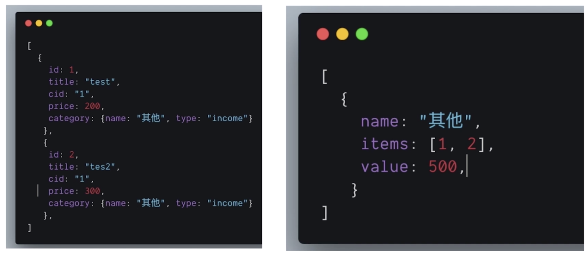
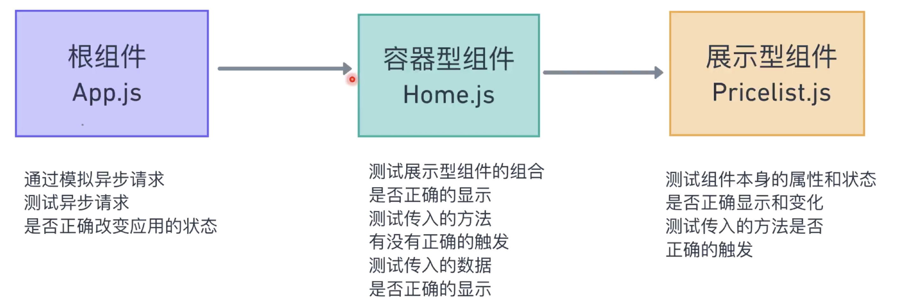

# 第10章 锦上添花：图表分析页面

> 测试实际上可以让颗粒度变得更细腻，从而能测试出不同的问题，但要有这么细的颗粒度去要思考函数、方法中执行的步骤或者说输入与输出的变化，执行过程中所影响的数据变化等等，所谓颗粒度实际上是指从应用的显示效果到实现这些效果的代码的区别，越是贴近与代码越是具有更细的颗粒度。

[TOC]

## 10-1 Recharts 简介

我们接下来要完成的需求——将现有数据可视化。

可视化图表是一个比较复杂的功能，一般来说我们不会自己去实现它，而是去寻找一个完美适配的开源库来完成这个功能。

### 如何寻找一个好的开源库来完成工作

- 可以使用谷歌直接搜索相关的关键词，比如这里可以搜索「react charts library」，可能会获取到很多关于对比不同开源库的文章，当然我们可以去阅读这些文章来获取想要的信息，但这里我们也可以看到一个叫做 Recharts 库的链接，那说明这个库应该是非常受欢迎的。

- 打开主页，来查看一下 API 和这些示例是否符合你所想要的需求。

- Github 项目页了解更多信息 —— issues、start 等等。

- 使用 [npm-stat](https://npm-stat.com/) 查看这个 package download 数量

- 使用 npm view 查看发布频率 - 发布频率代表着 fix bug 和新功能更快

  ```shell
  npm view recharts
  ```

  但似乎没有查看到，但可以直接去 [npmjs](https://www.npmjs.com/package/recharts) 搜索查看相关信息

最后安装 recharts 吧：

```shell
npm i recharts
```


## 10-2 使用 Recharts 完成简单示例

### 学习使用开源库

1. 如果官网有教程，先查看教程
2. 教程中会有安装，可以查看如何安装
3. 然后开始学习入门 —— 起步
4. 将实例代码放到应用中尝试，对于属性值可以去查看 API 文档

### 学习使用 Recharts

> [起步](http://recharts.org/zh-CN/guide/getting-started)

#### 1. 选择图表类型

> 借助于[babel-plugin-recharts](https://github.com/recharts/babel-plugin-recharts)，我们可以只引入需要的组件，以达到减小项目体积的目的。
>
> 传入简单的js对象（通常是一个数组）生成简单的图表。

引入组件和数据：

```jsx
import { LineChart, Line } from 'recharts';
const data = [{name: 'Page A', uv: 400, pv: 2400, amt: 2400}, ...];

const renderLineChart = (
  <LineChart width={400} height={400} data={data}>
    <Line type="monotone" dataKey="uv" stroke="#8884d8" />
  </LineChart>
);
```

- 传给`<Line>`组件的 props.DataKey 的值是数据对象数组中每一个对象所对应的键 uv，从而让每一个`<Line>`可以获取对应的值

#### 2. 添加需要的组件

> 例如， LineChart 可以添加组件 XAxis, YAxis, Legend, CartesianGrid, 等等。

```jsx
import { LineChart, Line, CartesianGrid, XAxis, YAxis } from 'recharts';
const data = [{name: 'Page A', uv: 400, pv: 2400, amt: 2400}, ...];

const renderLineChart = (
  <LineChart width={600} height={300} data={data}>
    <Line type="monotone" dataKey="uv" stroke="#8884d8" />
    <CartesianGrid stroke="#ccc" />
    <XAxis dataKey="name" />
    <YAxis />
  </LineChart>
);
```

- 传给`<XAxis>`的`dataKey`是指用对象数组中的哪一个键作为 X 轴上的对应数据名称。

- `<CartesianGrid>`是生成一个笛卡尔网格
- `<YAxis>`是生成 Y 轴

#### 3. 调整部分组件的配置

> 例如，可以调整 margin-right 的值来保证有足够的空间展示 x 轴最右侧的刻度，也可以调整网格的线型。

```jsx
import { LineChart, Line, CartesianGrid, XAxis, YAxis } from 'recharts';
const data = [{name: 'Page A', uv: 400, pv: 2400, amt: 2400}, ...];

const renderLineChart = (
  <LineChart width={600} height={300} data={data} margin={{ top: 5, right: 20, bottom: 5, left: 0 }}>
    <Line type="monotone" dataKey="uv" stroke="#8884d8" />
    <CartesianGrid stroke="#ccc" strokeDasharray="5 5" />
    <XAxis dataKey="name" />
    <YAxis />
  </LineChart>
);
```

- 所以，你可以通过传入不同的 props 来展示出不同的视图

#### 4. 丰富交互

> 添加 Tooltip 组件就能很简单的实现浮窗展示提示信息的功能。

```jsx
import { LineChart, Line, CartesianGrid, XAxis, YAxis, Tooltip } from 'recharts';
const data = [{name: 'Page A', uv: 400, pv: 2400, amt: 2400}, ...];

const renderLineChart = (
  <LineChart width={600} height={300} data={data} margin={{ top: 5, right: 20, bottom: 5, left: 0 }}>
    <Line type="monotone" dataKey="uv" stroke="#8884d8" />
    <CartesianGrid stroke="#ccc" strokeDasharray="5 5" />
    <XAxis dataKey="name" />
    <YAxis />
    <Tooltip />
  </LineChart>
);
```

#### 5. 实现自定义功能

> 例如，你可以通过传入自定义的刻度函数来实现定制化的功能，当然其他的组件也支持类似的功能，比如 Bar 组件也能接收自定义的 shape 组件或者 shape 函数。

去看官网文档吧～:smile_cat:

### Rechart 的特点 - 组合式组件

当我们想要添加一个新的视图配置时（X 轴、Y轴、网格等等）或者功能时，不是通过向组件添加很多 props，而是通过向这个组件中添加子组件来完成。

### 为项目添加 Chart

我们需要使用到的是圆形图标并且每一块带有不同的颜色，在官方的示例中我们找到 [PieChartWithCustomizedLabel](http://recharts.org/zh-CN/examples/PieChartWithCustomizedLabel) 示例比较符合我们所要使用的图表样式，查看示例代码：

```jsx
const { PieChart, Pie, Sector, Cell } = Recharts;
const data = [{name: 'Group A', value: 400}, {name: 'Group B', value: 300},
                  {name: 'Group C', value: 300}, {name: 'Group D', value: 200}];
const COLORS = ['#0088FE', '#00C49F', '#FFBB28', '#FF8042'];

const RADIAN = Math.PI / 180;                    
const renderCustomizedLabel = ({ cx, cy, midAngle, innerRadius, outerRadius, percent, index }) => {
 	const radius = innerRadius + (outerRadius - innerRadius) * 0.5;
  const x  = cx + radius * Math.cos(-midAngle * RADIAN);
  const y = cy  + radius * Math.sin(-midAngle * RADIAN);
 
  return (
    <text x={x} y={y} fill="white" textAnchor={x > cx ? 'start' : 'end'} 	dominantBaseline="central">
    	{`${(percent * 100).toFixed(0)}%`}
    </text>
  );
};

const SimplePieChart = React.createClass({
	render () {
  	return (
    	<PieChart width={800} height={400} onMouseEnter={this.onPieEnter}>
        <Pie
          data={data} 
          cx={300} 
          cy={200} 
          labelLine={false}
          label={renderCustomizedLabel}
          outerRadius={80} 
          fill="#8884d8"
        >
        	{
          	data.map((entry, index) => <Cell fill={COLORS[index % COLORS.length]}/>)
          }
        </Pie>
      </PieChart>
    );
  }
})

ReactDOM.render(
  <SimplePieChart />,
  document.getElementById('container')
);
```

- 对于不同的颜色是在 R33，对 data 进行 map，然后返回 `<Cell>`，每一个`<Cell>`根据其 fill 属性值来显示不同的颜色，而如何给予不同的属性值，是用 data 数组的 index 除以 COLORS 数组的长度，然后获取余数，余数作为 index 来获取 COLORS 中值，这样的方式是当数据足够多的时候可以依次循环使用 COLORS 中的值来作为背景颜色。

所以在我们的项目中，需要添加一个 colors 来作为颜色的获取源：

```jsx
// utility.js
export const colors = {
  blue: '#347eff',
  deepBlue: '#61dafb',
  green: '#28a745',
  red: '#dc3545',
  gray: '#555',
  lightGray: '#efefef',
  white: '#fff',
}
```

- 这些颜色也可以是作为我们整个项目常用的颜色源

接着，引入到 Home 组件中，由于官方示例中使用的 COLORS 是一个 Array，所以需要先转换为数组：

```jsx
const colorsArr = Object.keys(colors).map(item => colors[item])

const renderChart = (
  <PieChart width={800} height={400} onMouseEnter={this.onPieEnter}>
    <Pie
      dataKey="value"
      data={chartData}
      cx={300}
      cy={200}
      labelLine={true}
      label
      outerRadius={80}
      fill="#8884d8"
      >
      {chartData.map((entry, index) => (
        <Cell key={index} fill={colorsArr[index % colorsArr.length]} />
      ))}
    </Pie>
  </PieChart>
)
```


## 10-3 算法问题：计算必要的数据结构

上节课我们学习了折线图与饼图的基本用法，并且实现了一个带有不同颜色区块的饼图。（尝试着去回顾每节课或者每天所学习的东西，有利于对所学内容有一个概括）

这节课我们将为饼图添加正确的数据，所以这节课的问题是如何计算出正确的数据。

### 根据需求分解代码要点

- 将 items 里面的信息按收入、支出分为两大类型。
- 再按每个分类算出不同分类的价格总和
- 注意不同分类采用不同颜色展示

### 算法的需求



- 左边为 items 的数据结构，右边是我们想要获得的数据结构。
- 对于右边的数据结构，我们需要一个`name`来表示这是什么分类，需要一个`items`来表达哪些项属于这一分类，需要`value`来合计金额。
- 这样一道题就是传说中的数组去重，然后归类，所以第一个撞到我们脑子里的想法应该就是字典类型，在 JS 中就是 Object 来完成这项任务。

### 代码部分

```jsx
const generateChartDataByCategory = (items, type = TYPE_INCOME) => {
  let categoryMap = {}
  items
    .filter(item => item.category.type === type)
    .forEach(item => {
      if (categoryMap[item.cid]) {
        categoryMap[item.cid].value += item.price * 1
        categoryMap[item.cid].items.push(item.id)
      } else {
        categoryMap[item.cid] = {
          name: item.category.name,
          value: item.price * 1,
          items: [item.id]
        }
      }
    })
  return Object.keys(categoryMap).map(key => ({ ...categoryMap[key] }))
}
```

- 首先我们要明白为什么最后要返回的是一个数组，但在中间过程中用一个对象来存放这些数据？
  - 因为使用对象能更快的找到需要更改项的位置，在循环的过程中，如果发现了已经存在使用相同分类类型的项，那么就能够直接通过`obj[key]`的方法快速找到这个对象，从而将其 id 添加到`items`中，并将其`price`添加到`value`之中，组合成我们所要使用的数据形式，最终只需要简单的通过`Object.keys()`和`map`就能够转换成所需要的数组类型。


## 10-4 集成 Recharts 到项目中

上节课我们完成了一道算法题，将 items 形式的数据结构转化成了我们需要的归类过后可以用于图表使用的数据结构。

这节课我们就将使用这个数据结合 Recharts，添加我们需要的图表到项目中去。

首先，还是单独创建一个组件用于渲染图表：

```jsx
// CustomPieChart.js

import React from "react"
import PropTypes from "prop-types"
import { PieChart, Pie, Cell, ResponsiveContainer } from "recharts"
import { colors } from "../utility"

const colorsArr = Object.keys(colors).map(key => colors[key])

function CustomPieChart({ categoryData, title }) {
  if (categoryData.length === 0) {
    return <h3 className="text-center mx-3">{title} 还没有任何数据</h3>
  }
  return (
    <div className="pie-chart-component">
      <h3 className="text-center mt-3">{title}</h3>
      <ResponsiveContainer width='100%' height={300}>
        <PieChart>
          <Pie
            dataKey="value"
            data={categoryData}
            cx={'50%'}
            cy={'50%'}
            labelLine={true}
            label
            outerRadius={100}
            fill={colors.blue}
          >
            {categoryData.map((entry, index) => (
              <Cell key={index} fill={colorsArr[index % colorsArr.length]} />
            ))}
          </Pie>
        </PieChart>
      </ResponsiveContainer>
    </div>
  )
}

CustomPieChart.propTypes = {
  title: PropTypes.string,
  categoryData: PropTypes.array
}

export default CustomPieChart
```

- R11 - 对于可能存在没有收支项的情况也要考虑进去。

- 这里使用`<ResponsiveContainer>`组件是为了能够使用百分比来设置宽高。

  > ResponsiveContainer 是一个容器型的组件，用来处理图表的宽高需要**适配父节点宽高**的问题。建议宽度、高度至少有一个属性是百分比，当然也可以直接指定图表的宽度、高度。


在 Home 组件中引入：

```jsx
{tabView === VIEW_CHART && (
  <div className="chart-container d-flex">
    <div className="flex-fill">
      <CustomPieChart
        title="本月支出"
        categoryData={chartExpenseDataByCategory}
        />
    </div>
    <div className="flex-fill">
      <CustomPieChart
        title="本月收入"
        categoryData={chartIncomeDataByCategory}
        />
    </div>
  </div>
)}
```

- 为了使两个 chart 能够在一行中显示，使用了 flex 布局。


到目前为止，我们为应用添加了图表来形象的展示数据，通过这几节课的我们逐步学习了怎样选择一个开源库，开源库应该怎样学习使用，并且解决了一个算法问题，最后将开源库集成到应用当中。（总结）


## 10-5 测试的三层模型

之前我们为展示型组件和展示型组件所组成的两个容器型组件页面进行了测试，而现在对于项目组件的入口`<App>`还没有添加任何的测试，而这个组件包含了整个应用的数据和操作这些数据的各种方法，我们需要在测试中检验这些数据操作的正确性。

对于像 Redux、Mobx 等等状态管理工具中操作数据的方法也可以用单独的测试用例去覆盖。

### 我们应用测试的三层模型

- 展示型组件的测试
- 容器型组件的测试
- 项目根组件的测试

这是讲师自己所定义的测试三层模型，通过这三个维度来完成项目组件的测试。



### 为 App 组件添加测试

App 组件和其他的组件有一些不同，它使用了`axios`发出了很多异步请求（但实际上并不是这个组件所产生的行为，而是这个组件所定义的行为），但是对于测试而言，我们不能去对应的发送网络请求，因为这个行为的结果是非常不稳定的，无法确定是否返回和返回的内容，对于测试来说，这被称为「不确定因素」，所以需要将整个库都 mock 出来，用 mock 程序来控制它返回我们想要确定的值，而 jest 提供了一个非常方便的方法来完成这个任务。

这里，我们可以使用自己的代码来模拟用于异步请求的第三方库`axios`的返回和实现。

### 具体步骤

在 src 中创建`__mocks__`目录，然后创建一个`axios.js`来 mock 这个库。

比如，当使用`axios.get`来发送请求时会返回一个特定的数据，如下：

```jsx
// __mocks__/axios.js
import { testCategories, testItems } from "../testData"

export default {
  get: jest.fn(url => {
    if (url.indexOf("categories") > -1) {
      return Promise.resolve({ data: testCategories })
    } else if (url.indexOf("items?") > -1) {
      return Promise.resolve({ data: testItems })
    } else if (url.indexOf("items/") > -1) {
      return Promise.resolve({ data: { ...testItems[0], id: "testID" } })
    }
  })
}
```

- 传入`jest.fn()`中的 cb 是 mock 函数实现会运行的函数
- 根据 url 的不同返回不同的 mock 数据，注意这里需要根据实际代码中请求的 url 来编写
- 注意：一定得是`__mocks__`目录，这个目录是为了模拟所有从外部引进的库，比如这里模拟了`axios`，当测试开始时，程序中调用了`axios`则会去`__mocks__`寻找是否有这个文件，如果有就直接使用这个文件夹中的`axios`，而不是在开发环境中所引入的`axios`
- 使用`indexOf`判断字符串中是否带有某段字符，记得要`> -1`


## 10-6 App.js 主入口文件测试编码

### 测试初始化时的行为

```jsx
// 利用`setImmediate`API 来使 this.setState() 传入的数据生效之后再来执行测试之后的步骤
const waitForAsync = () => new Promise(resolve => setImmediate(resolve))

//测试根组件 App 初始化时的行为
describe('test app component init behavior', () => {
  afterEach(() => {
    //清除所有的模拟调用
    jest.clearAllMocks()
  })
  it('check App home state with inital action', async () => {
    const wrapper = mount(<App />)
    // mockAxios 会自动调用
    expect(mockAxios.get).toHaveBeenCalledTimes(2)
    await waitForAsync()
    const currentState = wrapper.instance().state
    //预期 state 中 items 的长度与测试模拟数据 testItems 的长度相同，注意在 state 中的 items 已经被“对象化”
    expect(Object.keys(currentState.items).length).toEqual(testItems.length)
    expect(Object.keys(currentState.categories).length).toEqual(testCategories.length)
  })
})
```

- R13 - `await waitForAsync`的作用是将后面的代码都放到下一个宏任务中进行，这样能够保证`this.setState`的异步执行能够生效，从而在接下来的测试中能够获取到更新之后的 state
- R12 - `mockAxios`模拟 axios 的方法会被 jest 自动调用
- R16 ～ 17 - 一定要考虑清楚最终存放于 state 中的数据到底是什么样的结构，这样能够更准确的进行测试
- R14 - 这里是为了获得整个 state，所以需要实例化之后获取其 state，如果只是为了获取某个 state，可以直接调用 wrapper 的 state 方法，如`wrapper.state('items')`
- R8 - 调用`jest.clearAllMocks()`来清除每一个测试用例调用过的 mocks，如果不清理会出现一个问题，mockAxios.get 的调用次数会一直累积。


### 测试编辑/创建页面时的行为

对于`getCreatedata`方法，整个内部逻辑相对比较复杂，所以也是容易出现 bug 的重灾区，因此测试就很重要了。

在编写测试之前，我们先来分析一下这个方法：

这个方法接受一个参数`id`，假如有 id 就是编辑模式，没有 id 就是创建模式，假如是创建模式并且数据已经请求过了（从主页面进入）就不请求 categories 的数据，如果没有请求过（比如从 url 进入）那么就请求数据，所以分为两种请求，那么也需要我们分不同的情况进行测试。

```jsx
//测试创建模式下使用初始数据时 getCreateData 的调用
it("test getCreateData with inital data in create mode", async () => {
  const wrapper = mount(<App />)
  await waitForAsync()
  await wrapper.instance().actions.getCreateData()
  expect(mockAxios.get).toHaveBeenCalledTimes(2)
})
```

- 等待初始化数据更新之后并且调用了`getCreateData`之后，再测试`getCreateData`被调用的次数。

```jsx
//测试创建模式下不使用初始数据时 getCreateData 的调用
it("test getCreateData without inital data in create mode", async () => {
  const wrapper = mount(<App />)
  await waitForAsync()
  wrapper.setState({
    categories: {},
    items: {}
  })
  await waitForAsync()
  await wrapper.instance().actions.getCreateData()
  expect(mockAxios.get).toHaveBeenCalledTimes(3)
  expect(mockAxios.get).toHaveBeenLastCalledWith('/categories')
})
```

- R5 ～ 8 - 手动将 App 中的数据清空，以便不实用初始化数据
- R10 - 手动调用`getCreateData`，当然我们也可以去获取按钮模拟点击，但我们这里只是为了测试方法是否调用正确，所以直接调用是一种更好的方式。

```jsx
//测试在编辑模式下使编辑模式下使用初始数据时调用getCreateData 的情况
it("test getCreateData with inital data in edit mode", async () => {
  const wrapper = mount(<App />)
  await waitForAsync()
  await wrapper.instance().actions.getCreateData('_kly1klf4g')
  expect(mockAxios.get).toHaveBeenCalledTimes(2)
})
```

- 和创建模式不同的是编辑模式需要传入一个 id 参数


```jsx
//测试在编辑模式下使用一个新的id时 getCreateData 的情况
it('test getCreateData with inital data and newId in edit mode', async () => {
  const wrapper = mount(<App />)
  await waitForAsync()
  await wrapper.instance().actions.getCreateData('new_id')
  expect(mockAxios.get).toHaveBeenCalledTimes(3)
  const currentState = wrapper.instance().state
  expect(currentState.items).toHaveProperty('new_id')
})
```

- 首先我想说，这个测试其实很没有意义，因为要传入一个新的 id，在目前的应用情况下，似乎只能通过 url 的形式来传入，而点击编辑按钮只会传入在 items 中已经存在的项，而且对于 url 这种情况而言，我们肯定会做一些处理，比如先判断是否为登陆状态，然后再判断这个 id 是否在数据库中存在，然后才会返回正确的值

- 但这个测试有其意义的一点是，因为传入了一个 items 中没有的 id，从而异步发送了请求，发现了代码中的一个问题，如下：

  ```jsx
  const promiseArr = []
  if (Object.keys(categories).length === 0) {
    promiseArr.push(axios.get("/categories"))
  }
  const isItemFetched = !!items[id]
  if (id && isItemFetched === false) {
    const ulrWithId = `/items/${id}`
    promiseArr.push(axios.get(ulrWithId))
  }
  const [fetchCategories, editItem] = await Promise.all(promiseArr)
  ```

  - 我们使用的是`push`来向`promiseArr`中添加 promise，但如果 R3 不执行 R8 执行，则位于 index 为 0 的 promise 返回的是 editItem 而不是 fetchCategories，从而造成后面所存入的数据发生问题。所以，我们需要将其返回的位置固定化，如下代码：


  ```jsx
  const promiseArr = []
  if (Object.keys(categories).length === 0) {
    promiseArr[0] = axios.get("/categories")
  }
  const isItemFetched = !!items[id]
  if (id && isItemFetched === false) {
    const ulrWithId = `/items/${id}`
    promiseArr[1] = axios.get(ulrWithId)
  }
  const [fetchCategories, editItem] = await Promise.all(promiseArr)
  ```

```jsx
//测试 - createItem 方法在使用初始数据的情况
  it('test createItem with inital data', async () => {
    const wrapper = mount(<App />)
    await waitForAsync()
    await wrapper.instance().actions.createItem(testItems[0], '2')
    expect(mockAxios.post).toHaveBeenCalledTimes(1)
    const currentState = wrapper.instance().state
    expect(Object.keys(currentState.items).length).toEqual(testItems.length + 1)    
  })
```


