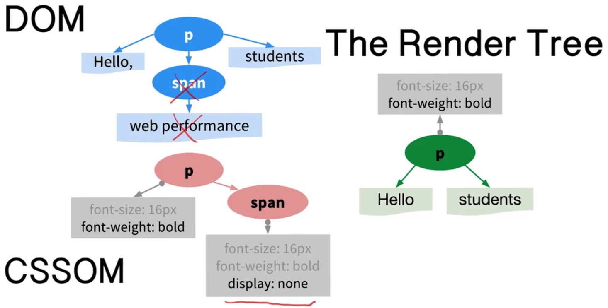

# 2.2 网站优化 - 关键渲染路径

---

[TOC]

---

## 1. 关键渲染路径

关键呈现路径是指**浏览器所经历的一系列<u>步骤</u>**，从而将 HTML CSS 和 JavaScript 转换为在**屏幕上呈现的<u>像素内容</u>**。如果我们能够优化关键呈现路径，那么就能提高网页呈现速度，从而使用户满意。

涉及哪些内容呢？

这个图表涵盖了所有要素：

1. 首先我们获取 HTML 并开始构建文档对象模型（DOM = Doument Object Model）。
2. 然后获取 CSS 并构建 CSS 对象模型（CSSOM）。
3. 我们将两者结合构建渲染树（Render Tree）。
4. 然后弄明白所有内容都位于网页的哪个位置，也就是布局（Layout）这一步。
5. 最后我们就可以将像素呈现（Paint）到屏幕上。

上面只提到了 HTML 和 CSS，那 JavaScript 呢？

JavaScript 是性能问题的一大重要部分，但是我们先讲解下如何构建文档对象模型和 CSS 对象模型，然后我们再讨论 JavaScript 会如何影响到呈现效果。

---

使用 Google 的 [Web Fundamentals](https://developers.google.com/web/fundamentals/) 手册详细了解[关键渲染路径](https://developers.google.com/web/fundamentals/performance/critical-rendering-path/)。

---

## 2. 将 HTML 转换为 DOM

**当你请求某个 url 并按下 Enter，浏览器就会向服务器发送一个请求**。例如，我们可以在命令行里模拟下浏览器收到响应后，即我们在这里看到的 HTML。

浏览器必须将所有的标记转换为我们在屏幕上看到的这些内容，比如这里：

有没有想过这一切都是怎么发生的？

这一切似乎很像魔术，但并不是魔术。浏览器会遵守定义完善的步骤并从处理 HTML 和构建 DOM 开始。

**HTML 规范包含了<u>一组规则</u>规定了我们应该如何处理接收的数据**。例如，在 HTML 中，**尖括号里包含的文本具有特殊含义**，表示的是标记。因此，每当我们遇到标记（Tag），浏览器都会发出一个令牌（Token）。比如这里是个 StartTag:HTML 令牌，然后是 StartTag:head 令牌等等。

> 令牌（Token）也可以翻译为记号、标志、象征，但是令牌更像是一个命令，有了这个东西就可以去执行下一步。但我觉得记号也很好，记号表示我们在这里划下了一些指示下一步操作的信息，下一步根据这个信息执行相应的操作。

这整个流程都由**令牌生成器（tokenizer）**来完成。当令牌生成器在执行这些工作时，另一个流程正在消耗这些令牌并将它们转换为节点对象。

例如，我们转换了第一个 HTML 令牌并创建了 HTML 节点，然后消耗下一个令牌并创建 head 节点。

节点之间有关系吗？

有，**令牌生成器发出了起始和结束令牌，表明了节点之间的关系**。

例如，StartTag head 令牌位于 EngTag HTML 令牌之前，表明 head 令牌是 HTML 的子节点，类似地 meta 和 link 节点是 head 节点的子节点等等。最终，当我们消耗了所有这些令牌后就想成了文档对象模型，表示了 HTML 的内容和属性以及节点之间的所有关系。

这样也很容易看出为什么叫 DOM 树。

注意，**这些对象包含了所有的属性**。例如，图片节点包含来源属性，DOM 树中的相同节点也包含了相同的属性，DOM 代表了完整的 HTML 标记。

这就是我们下载了 HTML 并构建 DOM 的过程。我们可以利用这个构建过程来提高网页的呈现速度。

---

查看本示例中的[演示页面](http://udacity-crp.herokuapp.com/cssom.html)。要详细了解 DOM：

- [什么是 Document Object Model（DOM）？](https://developer.mozilla.org/zh-CN/docs/Web/API/Document_Object_Model/Introduction)
- [构建对象模型](https://developers.google.com/web/fundamentals/performance/critical-rendering-path/constructing-the-object-model#document-object-model-dom)
- [HTML5 标准](https://developer.mozilla.org/zh-CN/docs/Web/Guide/HTML/HTML5)

我们使用 `curl` 通过 Mac 上的终端来下载 HTML。如果你是 Windows 用户，并且想要尝试 `curl`，请查看此 [StackOverflow 讨论](http://superuser.com/questions/344927/powershell-equivalent-of-curl)。

---

## 3. 快速 Google 搜索响应

每当你向 Google 发送一个搜索请求，服务器都会做出非常巧妙的响应，甚至在服务器知道搜索结果前就会立即返回网页标题。

这一标题对所有用户来说都是相同的，这样使浏览器可以开始处理响应并逐步构建 DOM，甚至有可能呈现该标题。

搜索结果准备好后，剩余的 HTML 就好了，浏览器会解析并展示相关内容。

可以看出浏览器不用等待所有的 HTML 都好了以后再处理，你的服务器也不应该这样。实际上，**返回部分 HTML 是很好的性能优化策略**。

逐步交付 HTML 的方法太机智了，比较好奇 Google 的工程师是怎么衡量和优化网页性能的？

其实他们和你使用一样的工具，也就是 Chrome 开发者工具和移动调式功能。

---

**Ilya 说**：我知道你在想什么...“请稍等，但每位用户的标题都不相同，因为你一旦注册，右上角就会出现自定义图标和导航！”...对吗？

此优化仍然有效！Google 搜索团队已经构建了一项优化服务，能够检索和构建自定义标题，其中包括在请求首次到达服务器后几微秒内的自定义用户信息 - 因此，即使在解析搜索查询前，它们也可以将标题反冲到客户端中。或者，许多站点使用静态标题，然后使用 JavaScript 来填充自定义位 - 这使它们能够为相同的标题提供服务，而无论用户状态如何。

**在任何一种情况下，重要的部分都在于<u>服务器不需要等待渲染完整响应，然后再将其返回至客户端</u>。你刷新某些数据的速度越快，浏览器可以开始构建 DOM 并发现和分配其他关键资源的请求的速度也越快。**

请参阅[提早清洗文档](http://www.stevesouders.com/blog/2009/05/18/flushing-the-document-early/)以了解更多信息。

此外，请查看 [Chunk Scatter](http://blog.cowchimp.com/chunk-scatter-http-chunked-response-analysis-tool/)，一款用于可视化成块 HTTP 响应的出色工具。

---

##  4. 练习：探索时间线踪迹

在手机上打开搜索页面，转到 Timline 标签页并录制一个记录，看看都有哪些内容。

1. 首先，我们看到一个 HTML 请求事件；
2. 然后服务器做出响应，我们获得了响应；
3. 然后 HTML 流式传输进来，解析功能开始处理各个部分，经历的步骤和我们之前描述的一样，即生成令牌并将令牌转换为节点再构建出 DOM 树

如上所示，Timeline 向我们详细地展示了**浏览器加载页面时执行的操作**。一开始看起来会比较复杂，里面有好多事件，不过这些会在接下来的课程中进行讲解。

接下来，你可以找一些你喜欢的网站录制一些浏览器的加载记录，看看是否能发现一些有趣的规律。

---

详细了解 Chrome 开发者工具中的时间线面板：[如何使用 Timeline 工具](https://developers.google.com/web/tools/chrome-devtools/evaluate-performance/timeline-tool)

如果 DevTools 中的“时间线”选项卡与视频中显示的不一样，请注意，Chrome Canary 和 Chrome 是不断变化的平台，会不断推出新版本。遇到自己努力尝试过后也无法解决的问题，请在[论坛](http://discussions.youdaxue.com/c/nd001-website-optimization)提问。

Cameron 将在回答视频中分析 [cnn.com](http://www.cnn.com/)。

- 在 Windows 上使用 **Ctrl+Shift+I** 或者在 Mac 上使用 **Cmd+Opt+I** 以打开开发者工具。
- 在 Windows 上使用 **Ctrl+Shift+R** 或者在 Mac 上使用 **Cmd+Shift+R** 来重新加载页面并捕捉时间线。

高级技巧：要使用硬重新加载技巧来捕捉完整踪迹，你需要先加载页面，在开发者工具中打开时间线，开始和停止录制，然后使用上述快捷方式重新加载页面。基本上，打开开发者工具并点击录制按钮两次，然后再执行硬重新加载。

请查看 [开发者工具模拟文档](https://developer.chrome.com/devtools/docs/mobile-emulation)，详细了解如何模拟移动设备。

- 中文: [如何使用时间轴工具](http://www.jianshu.com/p/4da0f0bda768)
- 中文: [开发者工具模拟文档](http://www.css88.com/doc/chrome-devtools/device-mode/)

---

##  5. 练习：构建 DOM

我们刚刚学习了将 HTML 转换成文档对象模型的过程。下面哪些是构建 DOM 的步骤？

依次说明：

- HTML 响应 > 令牌 >  <u>节点</u> > DOM 树 —— 正确

- startTag 和 endTag 等令牌转换成一个 DOM 节点 —— 实际上不正确，一个 DOM 节点会以 startTag 令牌开始并以 endTag 令牌结束。startTag 与 endTag 令牌之间还有其他令牌，它们定义的是一个 DOM 节点。

  - > 想了半天，要全部看一遍才能明白，题目的意思是每一个 startTag 或者 endTag 会转换为一个 DOM 节点，但其实是需要一组，也就是 startTag 与 endTag 一起才能转化为一个 DOM 节点。但其他有些节点是可以由一个令牌而组成的，比如本文节点和空元素标签，如 ` <link> <meta>` 等。

- 节点包含了 HTML 元素的所有相关信息。—— 正确。这些信息将由令牌来描述的。

- 节点根据令牌层级关系连接成 DOM 树。—— 正确。如果 startTag 和 endTag 令牌之间还有另一组 starTag 和 endTag 那么表示一个节点中还有一个节点，我们就是通过这种方式来定义 DOM 树的层级结构的。

最后提醒一下，**DOM 构建过程是逐步发生的**。

## 6. 将 CSS 转换为 CSSOM

DOM 会捕获页面内容，但是**我们还需要知道<u>如何展示页面本身</u>**。为此，我们需要构建 CSS 对象模型。说一下，这个过程和构建 DOM 非常的相似。

浏览器首先要做的是识别出正确的令牌，由于不像 HTML 可以根据尖括号来构建令牌，所以 CSS 有自己的一套规则。具体细节不重要，如果你感兴趣的话可以参阅讲师注释中的 CSS 规范链接，**重要的是解析器会将令牌转换成节点**。这里，第一个是 body，其中包含了字号属性，然后是 paragraph 节点，这部分很重要，它是 body 子节点，因为**所有可见内容都是 body 的一部分**。同时注意，body 节点的子节点继承了父节点的样式规则，即 16px 的字号，这就是层叠规则和层叠样式表。

所以这里和 DOM 构建过程类似，但是并不完全相同，因为 CSS 规则会向下层叠。表示好奇的是，假设我有个样式表，其中具有很多规则，我们可以像 HTML 一样，应用相同的逐步处理方式使页面显示更快吗？

这个问题很好，但遗憾的不能，我们无法使用部分 CSS 树，我来说明一下原因。

假设我们收到了前几个字节的 CSS，其实包含两个规则，如这里所示，我们开始构建 CSS 模型。使用这个树来呈现页面是很不错，但是存在个问题。假设我们获得了后续部分的 CSS 内容，其中包含更多的规则，比如这里我们获得了段落 `font-weight: normal`，CSS 使我们能够重新定义和优化样式属性，这是完全有效的，但是注意，这个规则使我们能够更改 CSS 树，使段落节点中的文本显示的字体粗细为正常。

也就是我们不能使用部分 CSS 树，因为可能导致我们在呈现网页时使用了错误的样式。**浏览器会阻止页面呈现，直到收到并处理了所有的 CSS 内容。CSS 会阻止呈现**。

---

- 详细了解[构建对象模型](https://developers.google.com/web/fundamentals/performance/critical-rendering-path/constructing-the-object-model#css-object-model-cssom)
- 详细了解 [阻塞渲染的 CSS](https://developers.google.com/web/fundamentals/performance/critical-rendering-path/render-blocking-css)

---

## 7. 练习：哪种样式渲染得更快？

假设我们有一个简单的页面片段，这是 HTML，左侧是两个需要满足的 CSS 规则，在右侧根据这两个规则画出了 CSS 对象模型，你认为浏览器在根据这两个规则处理 CSS 内容时要完成的工作与 DOM 相比有差别吗？同时在方框中用一句话描述其中的原因。

你的直觉可能告诉你第二个规则更加具体应该实现起来更快，因为它更精确。但实际上恰恰相反，第一条规则告诉我们一旦遇到 h1 标记我们就应该将字号设为 16px，非常简单。第二条规则更加复杂，首先，它规定我们应该满足任何段落标记，例如这里的这个标记（p），但是我们找到段落标记后则应该向上遍历 DOM 树，仅在父节点是 div 元素时才应用这个规则，因此，**更加具体的标签实际上要求浏览器处理更多工作**。

> 这里的更加具体是指在选择器中使用更多的规则，而不是指更准确更少。比如我只写一个类选择器，并不能说更具体，而应该称为更准确。这种更准确是来源于你的直觉，也就是你知道在文档中，类选择器总比元素选择器所选择出的元素更少。

所以更加**具体的规则成本更高，因为它需要遍历 DOM 树中的更多节点**。在重写所有规则前先衡量下有些时候选择器匹配并不是性能瓶颈，但也不是说就不用担心这个问题，而是**先衡量，再优化**。

---

**拼写错误**：第二个响应的 CSS 应该为 `div p { font-size: 12px }`。感谢 Alexander-892 指出此问题！

**浏览器为什么要从右向左匹配 CSS 选择器**？请查看[StackOverflow 上的热烈讨论](http://stackoverflow.com/questions/5797014/why-do-browsers-match-css-selectors-from-right-to-left)。

---

## 8. 在 DevTools 中重新计算 CSS 样式

我加载了在之前的会话中保存的时间轴记录，对了，**时间轴保存是一个非常好用的功能**。你可以右键时间轴选择保存记录，你也可以按照相同的方式加载之前会话中的记录。	

当你在调试网站时，可以保存下来对其作出进一步的分析，或者与他人分享。

我们来查看一下这个记录中的几个 CSS 事件：

首先可以看到发送出去的 CSS 请求，它发生在收到第一部分 HTML 之后，这里解析器发现了链接标记并发起 CSS 请求。

然后我们等待获得 CSS 字节内容，接着我们看到 Recalculate Style 事件，这里我们将 CSS 响应转换为 CSS 对象模型。我们的 CSS 非常小，所以只用了几毫秒就完成了转换。但是对于更大型的样式表来说，肯定时间更长。

**所以我们在重写所有 CSS 规则之前应该录下时间轴看看花费了多少时间。**先衡量，然后根据需要优化。

---

详细了解[如何使用时间轴工具](https://developer.chrome.com/devtools/docs/timeline#saving-and-loading-recordings)

---

## 9. 渲染树

DOM 包含了页面的所有内容，CSSOM 包含了页面的所有样式。我们如何将内容和样式转换成像素显示到屏幕上呢？

现在我们需要将 DOM 与 CSSOM 树组成渲染树并捕获你刚刚提到的内容。

**渲染树的最重要特性是<u>仅捕获可见内容</u>**，要了解具体的操作流程，我们来看看屏幕上的这个简单示例：

顶部是 DOM 树，底部是 CSS 对象模型。要构建渲染树，我们从 DOM 树的根部开始（这里是段落节点）看看有没有任何相符的 CSS 规则。这里的确有一个相符的规则，即让所有的字体大小都设为 16px 并且为粗体，我们将段落节点复制到渲染树里，旁边是其 CSS 属性。处理完段落节点后，我们向下浏览该树，然后我们看到“Hello”是个文本节点（text node）将其复制到渲染树上，然后是 span 节点，有一个符合的 CSS 规则，我们有一个 span，它是段落节点的子节点，但是注意，这个规则的某个属性标记为 `display: none`，表示这个 span 的内容不应该呈现，因为我们提高渲染树只捕获可见内容，所以我们可以跳过它和它的子项。我们跳过子项是因为`display:none`向下层叠（这里因为还有一个文本子节点）。接下来是另一个文本节点，我们将其复制到渲染树里。

所以，渲染树会同时捕获内容和样式。

我们来看一下 Hello World 页面：

这是 Hello World 页面的 DOM 和 CSSOM 树。要构建渲染树，我们从 DOM 树的 html 节点开始，**html 和 head 部分不包含任何可见信息，所以可以快速地从渲染树里修剪掉它们。**接着是 body 节点，我们将其复制过来，树的左侧看起来比较熟悉，这是我们刚刚构建的部分，我们也将其复制过来。最终到达了 div 和 img 节点，这两个都包含可见内容，所以也复制到渲染树里，包括它们的样式完成后，将这个渲染树与屏幕上的内容对比下：

渲染树是个很好的展示效果，没有了不必要的文本，我看到屏幕上应该有个图片并且应该显示在右侧，现在完成了吗？

没有，我们**还需要处理布局**，但是先来快速看个测试题。

---

查看我们在此示例中使用的[演示页面](http://udacity-crp.herokuapp.com/cssom.html)：将 HTML 与生成的渲染树以及你在屏幕上看到的内容进行比较。清楚明了，对吗？

你可以在 Google 的 Web Fundamentals 手册中详细了解[渲染树构建、布局及绘制](https://developers.google.com/web/fundamentals/performance/critical-rendering-path/render-tree-construction)

---

## 10. 练习：哪些屏幕元素可见

假设有个简单的 DOM 树和几个 CSS 规则，如果我们解析了这些 CSS 规则并结合 DOM 构建了渲染树，你认为哪些文本是可见的？同时思考下这些文本的展示颜色是什么？

我们将 CSS 规则应用到我们的 DOM 树上，第一个 div 规则会将文本颜色设为红色，该属性会向下层叠到“Hello”文本。下一条规则是段落内容显示为黑色，有趣的是，该规则适用于所有段落节点，无论其父元素是怎样的规则。因此，我们将 Hello 和 world 的文本颜色更改为黑色。最后这条规则告诉我们任何父节点是 div 节点的段落节点，都应该在渲染树中隐藏起来，因此，我们可以从渲染树中修剪掉这个分支，只剩下 world，所以最终答案是 world，文本颜色是黑色。

> 这里有个问题，不应该将 div 也 X 掉。如果 div 设置有相应的

## 11.布局

我们已经有了渲染树，现在可以将像素显示到屏幕上了吗？

已经快到终点了，但是还有一步。我们还需要弄明白**所有元素应该<u>放在页面的哪个位置，该如何放置</u>，这就是布局步骤**。

为了展示布局过程，我想出了一个简单的渲染树，最终结果将是这样：

如何我们旋转手机的话，方框的尺寸将会更改，但是比例保持不变。

我们来看看浏览器这个时候执行了哪些操作。我们从顶部开始，我们将 body 元素的背景设为灰色，是合理的。

到底是什么的 100%？

它是 100% 的布局视口尺寸，如果你有所注意的话，会发现我们的 hello world 示例包含一个元标记`<meta name="viewport" content="width=device-width">`。在关于自适应设计的网络基础知识指南中提到了我们应该添加这一标记，**它的作用是告诉浏览器布局视口的宽度应该等于设备宽度**，假设设备宽度是 320px。那么如果存在这个元视口标记的话，浏览器就会将布局视口设为 320px，也就是我们说到的 100%。

如果我们不提供该标记的话，会出现什么情况？

不提供该标记的话，浏览器就会使用默认的视口宽度，通常是 980px，它是针对大型屏幕优化的。有时候网站呈现后内容就缩写了，你需要放大内容才能浏览和阅读文本，因为他们没有设置元布局视口。

> 上面讲到的这种情况可以在大脑状态好的时候试一下并去了解为什么需要放大内容。
>
> 我刚刚想到了一些小点，当手机浏览器是默认的视口宽度时，字体大小也会根据与这个视口之间的关系而呈现，因此就会很小。

上面这种情况的浏览体验是非常差的。**要打造良好的移动设备体验，你应该始终记得设置元视口**，现在回到我们的示例中。

如果设备宽度是 320px，那么 body 宽度将为 320px 接着是 div 节点宽度是 50%，它是 body 的子节点，所以宽度是相对于父节点而言的 320px 的 50% 等于 160px，对于段落来说，宽度是它的父节点的 50%，所以宽度是 80px。这就是布局。

---

- 详细了解[渲染树的结构、布局和绘制](https://developers.google.com/web/fundamentals/performance/critical-rendering-path/render-tree-construction)
- 详细了解[响应式 Web 设计的布局窗口和基础知识](https://developers.google.com/web/fundamentals/layouts/rwd-fundamentals/)

---

## 12. 练习：计算布局

这是一个渲染树，假设布局视口宽 320px，意味着 body 为 320px，你能计算出**剩余节点**的宽度吗？

---

**Cameron：** 优达学城的学生 Aliaksei 和 everdimension 已经提醒我注意，`<em>` 和 `` 实际上是 `inline`元素。除非它们转换为 `display: block` 或 `display: inline-block`，**否则它们的宽度将<u>由其包含的文本确定</u>**。

---

## 13. 在 DevTools 中分析布局

布局取决于浏览器大小，如果我旋转手机会怎么样呢？

**如果布局视口的尺寸更改了，浏览器就需要重新运行布局步骤**，每次旋转手机时或者调整浏览器大小时都会出现这种情况。

我们的示例都很简单，但是这种情况会成为性能瓶颈吗？

会的，我们来看看开发者工具，我捕获了著名新闻网站 gizmodo.co 的记录，如果你表示好奇的话可以根据讲师注释中的说明获取这段图标并跟着操作。我们来看看：

首先这里有大量的事件，因为我只对布局感兴趣，所以滤除掉 Loading Scripting 和 Painting 事件，这里是第一个事件，打开详情发现需要 145ms，这时间很长，可以看出树中有 1400 多个节点。

还有其他布局时间是什么情况？

**任何时候我们通过修改样式或内容来更新渲染树时都很有可能就需要重新调整布局**，这里似乎就是发生了这种情况，页面添加了新内容并修改了样式，因此我们需要多次运行布局。

如何优化这一过程呢？

这完全取决于网站，但是**黄金法则是批量更新，避免出现多个布局事件**。

---

如果你对查看其布局感兴趣，这里是 Ilya 和 Cameron 使用的[示例页面](http://udacity-crp.herokuapp.com/cssom.html)。

*注意：**布局可能会被以下操作触发：手机上的设备方向更改、窗口大小调节或会修改 DOM 内容的任何其他操作** - 例如，向 DOM 树添加内容或从中移除内容、在节点上切换 CSSOM 属性等等！*

---

## 14. 练习：查找昂贵布局的示例

布置一项练习，请检测下你喜爱的某些网站，找出布局成本高的网站，然后在论坛上分享你的发现结果。我想知道哪些网站的布局运行速度最慢，并写出导致速度慢的原因。

> 只需要你去找一个网站，打开录制，对浏览器的宽度进行改变，然后只看 Rendering 部分的计算。

---

如果你想按照说明操作，Cameron 将会在解决方案视频中分析 [NBC 新闻](http://www.nbcnews.com/)。他将在调整浏览器窗口大小时分析布局事件的性能。

注意：布局可能会被以下操作触发：手机上的设备方向更改、窗口大小调节或会修改 DOM 内容的任何其他操作 - 例如，向 DOM 树添加内容或从中移除内容、在节点上切换 CSSOM 属性等等！

*此外，NBC 新闻很有可能在本视频拍摄后发生更改。你看到的某些内容可能会与 Cameron 看到的不同。*

- 在 Windows 上使用 Ctrl+Shift+I 或者在 Mac 上使用Cmd+Opt+I 以打开 DevTools。
- 在 Windows 上使用 **Ctrl+Shift+R** 或者在 Mac 上使用 **Cmd+Shift+R** 来重新加载页面并捕捉时间线。

要使用硬重新加载技巧来捕捉完整踪迹，你需要先加载页面，在 DevTools 中打开时间线，开始和停止录制，然后使用上述快捷方式重新加载页面。基本上，打开 DevTools 并点击录制按钮两次，然后再执行硬重新加载。

请查看 [DevTools 模拟文档](https://developer.chrome.com/devtools/docs/mobile-emulation)，详细了解如何模拟移动设备。

---

## 15. 练习：是时候绘制页面了！

知道了所有将在网页上出现的内容，那么只剩下绘制像素了。

但是绘制像素并不是听起来的那么简单，我们可以先做个测试。

假设我们向浏览器提供了渲染树里的这两个节点，你认为我们在绘制它们的内容时速度会有差别吗？

>  这里的 box-shadow 属性值的顺序我很喜欢，先写 inset 是一个非常好的办法，因为这样就不容易忽略是内阴影。

首先我们需要对比要**绘制区域的大小**，这里，两个 div 都是 100px X 100px。现在来看看我们**要绘制什么内容**，第二个 div 就是个方框，里面填充了白色像素，与第一个 div 对比下，这里是透明背景同时还需要呈现阴影，因此第二个 div 肯定成本更低，绘制速度更快。

---

详细了解[渲染树的结构、布局和绘制](https://developers.google.com/web/fundamentals/performance/critical-rendering-path/render-tree-construction)

---

## 16. 在 DevTools 中分析绘制

并非所有像素绘制到网页的成本都一样，应该注意运用的效果以及所有其他操作。但要记得网页性能的基本原则——先衡量，再优化。

我们查看的是《纽约时报》首页的记录，我们看看绘制事件。

先滤除其他事件，可以看出有很多的绘制事件。这里可以使用比较好用的诀窍，选择要在时间轴上显示的时间范围，底部的饼图也会随之更新总时间。同时我们在这里找找时间成本高的事件。例如，这个事件花了 8ms：

我们之前提到，**任何时候我们想要更新渲染树时，很有可能需要运行下布局，这个过程也是适用于绘制过程的**。**浏览器采用了各种智能功能尝试重新绘制最低请求区域，但都<u>取决于向渲染树应用了哪些类型的更新</u>**。

---

跟着 Ilya 一起，尝试记录你自己的踪迹！这里是[纽约时报移动站点](http://mobile.nytimes.com/)的链接。

Cameron 说：纽约时报移动站点很有可能在本课程发布后发生更改。你看到的某些内容可能会与 Ilya 在本视频中看到的不同。

---

## 17. 练习：绘制页面的步骤

我们来花一点时间理出呈现屏幕上的网页需要经历的步骤，使用 1 到 6 标出浏览器呈现网页需要采取的步骤顺序。

1. 首先，当我们开始接收这个 HTML 时，我们就开始解析它；
2. DOM 逐步构建，并非一次性出现所有响应，所以我们可能不会立即构建完毕，在 head 中我们将发现 CSS 和 JavaScript 的链接，然后我们就发出这些请求；
3. 但有一个陷阱，脚步是同步的，在获得 CSSOM 之前，我们无法执行它，所以我们需要尽快创建 CSSOM，完成 CSSOM 将取消屏蔽 JavaScript 引擎。
4. 所以将在收到 JavaScript 后立即执行它；
5. JavaScript 完成后，我就可以继续并完成 DOM 的构建，获得 DOM 和 CSSOM 之后，我们将合并二者并构建渲染树；
6. 然后运行布局并渲染网页。

---

## 18. 在 DevTools 中分析整个 CRP

我们研究了关键呈现路径的各个部分，我们来从头到尾地看看时间轴是怎么汇总这些部分的。

为便于讲解，我们将使用 Hello World 页面，其中内嵌了几个 CSS 样式、一些文本和图片：

1. 首先看到发出了 HTML 文档请求，然后获得一个事件表示服务器返回了一些响应头部，后面跟着一些数据，这就是我们的 HTML。
2. 然后浏览器开始解析 HTML，这里浏览器将收到的内容转换为 DOM 树。实际上，如果展开这个节点可以看到文档解析器找到了嵌入的图片资料并发起请求。完成后，继续解析 HTML。
3. 结束后就会构建 CSS 对象模型。在此示例中，我们的 CSS 是直接嵌入网页中的，所有没有 CSS 请求。
4. 接着是浏览器构建渲染树并计算出应该在屏幕上可见的所有内容样式，就是这个 Recalculate Style 事件所表示的。
5. 完成后，我们继续转到布局步骤，就是计算渲染树中元素的位置和尺寸。
6. 最终完成后，我们就发出绘制事件，我们的页面就呈现在屏幕上了。

---

这里是 Ilya 使用的[示例页面](http://udacity-crp.herokuapp.com/cssom-inline.html)的链接。要获得奖励，请查看 Google Web Fundamentals 手册中的[关键渲染路径内容](https://developers.google.com/web/fundamentals/performance/critical-rendering-path/)。

---

## 19. 练习：练习优化 CRP

分析给出的页面，寻找一些常见的性能问题。比如：

- 减小 CSS，即删除所有的空白处。文件里的空白处只能帮助我们阅读代码，但是并不能帮助浏览器解析文件。所以，如果我们删除所有的空白，则可以从我们的数据中移除大量的内容
- 嵌入关键的 CSS，这样就不用对此 CSS 文件发出另一个请求来设定该网页的样式。

---

Cameron 将在回答视频中分析 [Netflix](http://www.netflix.com/)。

Cameron 说：Netflix 很有可能会在本视频录制后发生更改。你查看后可能会发现某些操作与我的操作不同。

- 详细了解 [CSS 压缩](https://developers.google.com/speed/pagespeed/service/MinifyCSS)
- 详细了解 [内联和优化“关键 CSS”](https://developers.google.com/speed/pagespeed/service/PrioritizeCriticalCss)

---

## 20. 总结

接下来会谈到优化的部分。那么：

- 什么是关键呈现路径？它的原理又是什么呢？

了解这些会对优化有一个更加全面的了解。