# 2. HTTP/1

> 你将深入研究 HTTP 动词，还将深入挖掘 HTTP 中使用的重要标头，并了解如何使用 REST 高效地构建应用程序。

[TOC]

---

## 2.1 HTTP 简介

作为开发者，我们每天都会使用 HTTP，我们在使用 Firebase 的 JavaScript SDK 时，或在平板电脑或手机上使用浏览器查看网站时，都会发出 GET 和 POST 请求。

要成为优秀的前端工程师并创建网络应用仅仅使用 HTTP 并不足够，你需要深入了解**为何使用某些技巧，为何其他技巧不可行或不推荐使用**。

在这节课，我们将先了解下第一版 HTTP，我们将研究 GET 和 POST 方法，以及其他你可能会熟悉的使用方法。接着，我们将了解各种报头以及如何设计适用于 web 的 API。

学完这节课后，你将**能够调试网络上的 HTTP 请求响应**并且将**了解什么是 RESTful API**。


---


## 2.2 Netcat 命令

### Netcat

在本课中，我们将使用[Netcat](https://en.wikipedia.org/wiki/Netcat)命令。 Netcat 是用于通过网络连接发送和接收消息的实用程序。 Netcat 被称为网络工具的瑞士军刀，我们将使用它来与服务器直接通信。

### Netcat 命令

Netcat 有许多变体，我将使用的是使用`nc`命令访问的变体。 在这里，我使用 Netcat 在端口 80（HTTP 连接的默认端口）上连接到 Google。

[Netcat 示例](https://classroom.udacity.com/nanodegrees/nd019-cn/parts/8f508d0f-3ede-4438-a76a-1388a0fc3082/modules/2ade007c-9ac6-4dad-995d-6dec0deb7c8f/lessons/8080328065/concepts/81948027770923#)

提示等待我们输入 HTTP 请求的详细信息。 要发送 GET 请求，请输入：

```
GET / HTTP/1.1
```

... 然后确保你按下输入按钮两次（一次到达一个新行，还有一次表明你已经完成输入请求的标题）。 你会得到类似如下图所示的界面：

[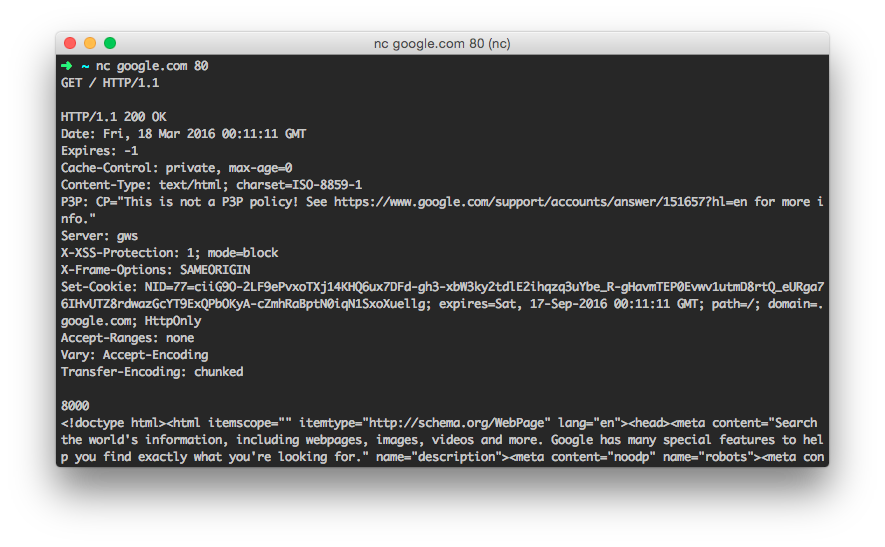netcat GET 示例](https://classroom.udacity.com/nanodegrees/nd019-cn/parts/8f508d0f-3ede-4438-a76a-1388a0fc3082/modules/2ade007c-9ac6-4dad-995d-6dec0deb7c8f/lessons/8080328065/concepts/81948027770923#)

### 延伸阅读

- <https://en.wikipedia.org/wiki/Netcat>
- <http://nc110.sourceforge.net/>
- [百度百科 - Netcat](https://baike.baidu.com/item/Netcat/9952751?fr=aladdin)


---

## 2.3 HTTP Verbs

看看这两张纸：

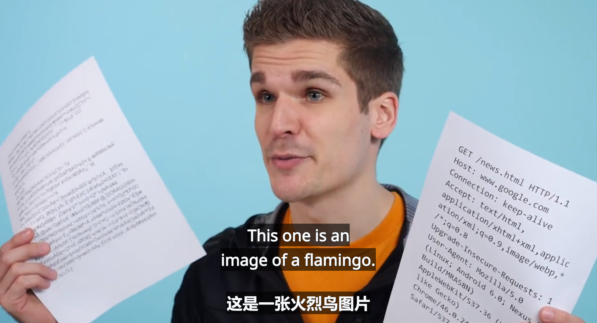

左边这张是火烈鸟图片，右边是获取该图片的请求。你发现二者之间的差别了吗？

HTTP 已经存在很长时间了，以至于该协议依然会执行一些你很少在现代协议中会发现的操作。

在网络上来回发送的字节是普通的旧文本，任何人都能够读懂。HTTP 的这种简单性意味着我们可以直接与协议交互，不需要调用第三方库执行任何额外的操作。

每个 HTTP 请求都以一个独特的动词开头，我们称之为方法，并起到特殊的作用。

我们已经知道 GET 和 POST 请求，虽然二者是最常见的方法，但是你也会经常遇到一些其他方法。常见的方法包括：GET、POST、PUT、DELETE、HEAD 和 OPTIONS。

当我们讨论 REST API 时，将详细介绍这些方法。


---

## 2.4 HTTP verbs 2

记住，请求以 HTTP 方法开头，随后是路径和要使用的 HTTP 协议版本：

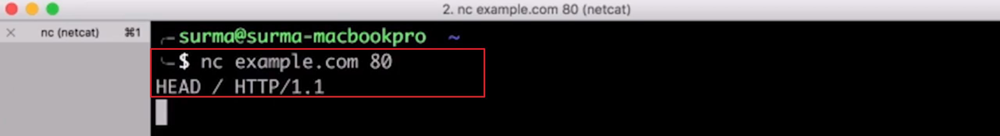

该请求使用了 HEAD 方法，HEAD 方法是一个有趣的方法，因为**通过它可以获取文件的所有报头，而不需要接受整个文件本身**。

这样可以检查存储响应的空间是否充足，或者该网页的缓存版本是否依然是最新版本，这样的话，如果浏览器在缓存中依然有该文件的最新版本，就不需要重新下载该文件：


> 因为返回的头信息中有文档的大小与最后的修改时间，所以可以根据这个信息来做一些处理。比如上面说的，检查本地是否有足够的空间存储，或是检查本地缓存的版本是否是最新的。

看一下开发者工具的 Network 标签页，当你访问网站时，可能不会看到任何 HEAD 请求，使用 HEAD 验证缓存存在的问题是工作量翻了一番。你发送了 HEAD 请求，然后可能立即发送了 GET 请求。

每个**请求响应对**都被称为一次往返，需要很长时间才能完成。现在的网站有大量资源在潜在的 GET 请求之前发送 HEAD 请求将大幅降低网站的加载速度，因此，我们可以采取一些方法来降低这些往返操作的成本。这些我们稍后将详细讲解。暂时只需记住**我们要尽量减少网站的往返操作，也就是尽量减少请求数量**。

最后一个常见方法是 OPTIONS，OPTIONS 应该能够**列出当前 URL 可以使用的方法**，但是**只有部分服务器支持该方法**。

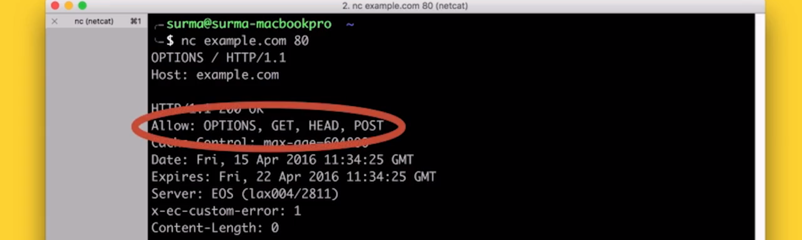

OPTIONS 方法一开始可能看起来很奇怪，但是当我们讨论它的时候，就会发现它很重要。

---

## 2.5 练习：HTTP Verbs Quiz

请求中使用的 HTTP 动词可以告诉服务器客户端想要完成什么操作。例如，使用 GET 请求来获取资源，或者使用 HEAD 请求来获取资源报头，等等。

这是一个操作列表（右侧），这是一些 HTTP 动词（左侧）：

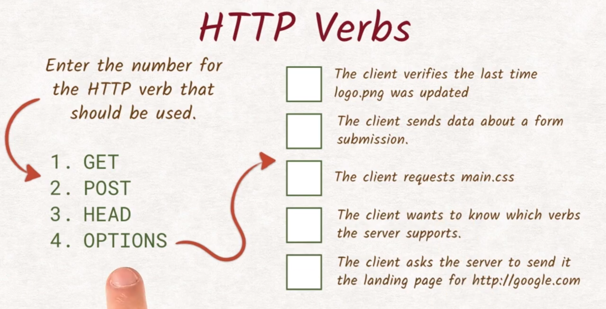

请输入最适合每个任务的动词编号，右侧信息：

- 客户端请求查看 logo.png 上次更新的。
  - 客户端想要查看 logo.png 上次修改的时间，我们知道 last modified 报头具有该信息，因为客户端**对文件实际内容不感兴趣**，因此这里适合使用 `HEAD` 请求。

- 客户端发送了关于表单提交的数据。
  - **表单只能使用两种方法**，GET 和 POST，因为我们是要发送数据，因此需要使用 `POST` 方法。（但这个原因其实并不一定，因为 GET 也可以发送数据。）
- 客户端请求主 CSS 文件。
  - 每当你需要获取文件内容时，就需要使用 `GET`。所有动词都使用响应主体来执行某个操作，或者什么也不执行。
- 客户端想要知道哪些动词受支持。
  - 了解服务器支持哪些动词，正是 `OPTIONS`的目的。
- 客户端请求服务器向其发送 google.com 的登录页。
  - 同样，这里我们要取回内容，因此唯一合理的方法是 `GET`。

可以看出，有多种多样发送请求的方式。要使服务器正确地做出响应，务必为**相应的任务使用正确的动词**。

---

## 2.6 常见的响应标头

请求和响应都有一个报头部分。注意，报头包含了关于请求或响应的其他数据，我们已经了解了一些常见的请求报头。请看看下面列出的响应可能具有的重要报头。

### Response Headers

Headers contain additional data about requests or responses. These are some of the important ones:

`Content-Length` is a header that must be contained in every response and tells the browser the size of the body in the response. This way the browser knows how many bytes it can expect to receive after the header section and can show you a meaningful progress bar when downloading a file.

`Content-Type` is also a non-optional header and tells you what type the document has. This way the browser knows which parsing engine to spin up. If it's an image/jpeg, show the image. It’s text/html? Let’s parse it and fire off the necessary, additional HTTP requests. And so on.

`Last-Modified` is a header that contains the date when the document was last changed. It turned out that the Last-Modified date is not very reliable when trying to figure out if a document has been changed. Sometimes developers will uploaded all files to the server after fixing something, resetting the Last-Modified date on all files even though the contents only changed on a subset. To accommodate this, most servers also send out an ETag. ETag stands for entity tag, and is a unique identifier that changes solely depending on the content of the file. Most servers actually use a hash function like SHA256 to calculate the ETag.

`Cache-Control` is exactly what it sounds like. It allows the server to control how and for how long the client will cache the response it received. Cache-Control is a complex beast and has a lot of built-in features. 99% of the time, you only need the “cacheability“ and the “max-age”.

`If-Modified-Since` permits the server to skip sending the actual content of the document if it hasn’t been changed since the date provided in that header. Is there something similar for ETags? Yes there is! The header is called If-None-Match and does exactly that. If the ETag for the document is still matching the ETag sent in the If-None-Match header, the server won’t send the actual document. Both If-None-Match and If-Modified-Since can be present in the same request, but the ETag takes precedence over the If-Modified-Since, as it is considered more accurate.

There are a lot more headers and a lot to explore. If you want to know more, check out the following information on HTTP headers:

> Google Translate:
>
> 响应报头
>
> 标头包含有关请求或响应的其他数据。这里是一些重要的：
>
> `Content-Length`是**必须包含在每个响应中的标头**，并告诉浏览器响应中文档的大小。这样浏览器就知道在标题部分之后可以接收多少字节，并且**在下载文件时可以显示有意义的进度条**。
>
> `Content-Type`也是一个非可选标题，**它告诉您文档的类型。这样浏览器就知道要启动哪个解析引擎。如果是 image/ jpeg，则显示图像。这是 text / html？让我们解析它并发出必要的额外 HTTP 请求。**等等。
>
> `Last-Modified` 是一个标题，其中包含上次更改文档的日期。事实证明，在尝试确定文档是否已更改时，`Last-Modified`日期**不是很可靠**。有时开发人员会在修复某些内容后将所有文件上传到服务器，**即使内容仅在子集上更改，也会重置所有文件的 Last-Modified 日期**。为了适应这种情况，大多数服务器也会发送一个 ETag。 ETag代表实体标记，并且是唯一的标识符，其仅根据文件的内容而改变。**大多数服务器实际上使用像 SHA256 这样的散列函数来计算 ETag。**
>
> - 这一条的意思是，我们应使用 ETag 来判断文件是否更改，而不是日期。
>
> `Cache-Control`正是它听起来的样子。**它允许服务器控制客户端缓存收到的响应的方式和时长**。 `Cache-Control`是一个复杂的野兽，具有许多内置功能。 99％的情况下，您只需要“cacheability（可缓存性）”和“max-age（最大年限）”。
>
> `If-Modified-Since`允许服务器跳过发送文档的实际内容（如果自该报头中提供的日期以来尚未更改）。 ETags 有类似的东西吗？就在这里！报头称为 If-None-Match 并且完全相同。**如果文档的 ETag 仍然与 If-None-Match 标头中发送的 ETag 匹配，则服务器将不发送实际文档**。 If-None-Match 和 If-Modified-Since 都可以出现在同一个请求中，但 ETag 优先于 If-Modified-Since，因为它被认为更准确。

还有更多的标题和很多东西要探索。如果您想了解更多信息，请查看有关HTTP标头的以下信息：

- [list of HTTP headers](https://www.google.com/url?q=https://en.wikipedia.org/wiki/List_of_HTTP_header_fields&sa=D&ust=1460140076629000&usg=AFQjCNHMTe05Wkomeyd8bB9GvVrUyuC1Dg)

 

---

## 2.7 练习：响应标头

我们一直在学习 HTTP 动词和报头，现在该你来向服务器发送 HTTP 请求了。

在这道练习中，你需要使用 Netcat 或 Telnet，来手动编写一个 HTTP 请求。你需要为你的平台启动正确的服务器，然后，终端将显示你需要连接到的 URL 和端口。在另一个终端中使用 Netcat 连接到你刚刚启动的服务器，连接好后，你需要发送一个 HTTP 请求并包含以下信息：

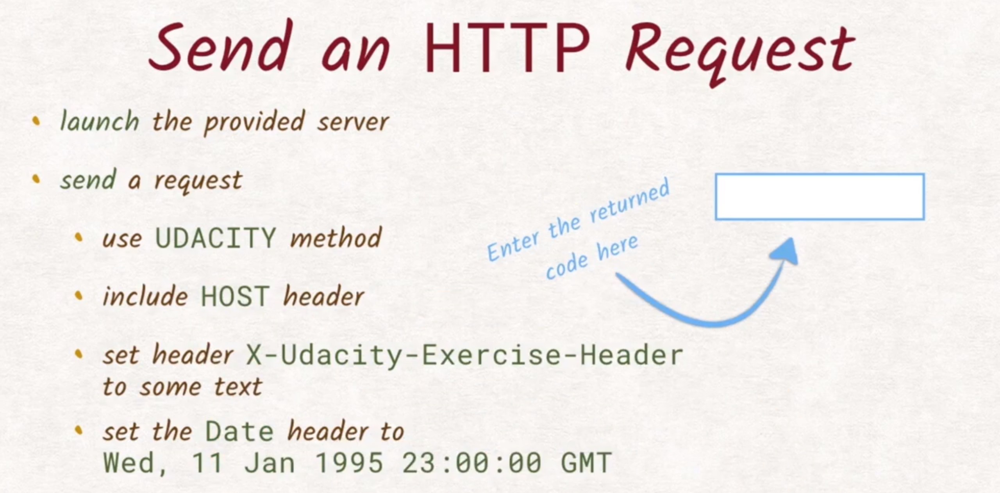

- 发送 UDACITY 请求
  - 不是 HEAD GET 或 POST 请求，你可能已经发现了，这不是一个真正的 HTTP 动词，但是因为我们是这个服务器的创建者，因此将其设为能够处理这个特殊动词。
- 确保在请求中包含 HOST 报头。
  - 因为在 HTTP1 中必需这么做。
- 包含报头 X-Udacity-Exercise-Header 并在其中加入一些非空值。
- 最后添加 Data 报头，并确保里面的值与这里完全一样。

### 下面快速复习一下 Netcat

使用的 Netcat 命令是 nc，随后是我要连接的服务器，接着是端口：

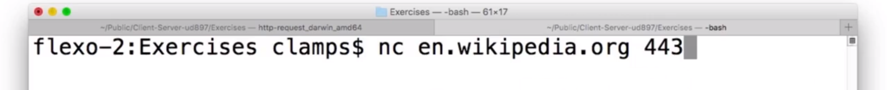

这行命令通过端口 443 连接到了维基百科。

因此，你需要使用 Netcat 连接到提供的服务器，并发送此请求。如果操作正确，你将获得一个代码。


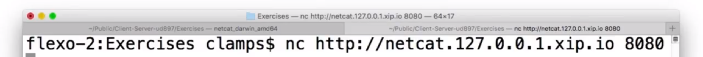

这是我连接服务器时用到的 Netcat 命令，运行它没有产生任何错误，因此我连接成功了。（可是我出错了，不能用 http://  开头）

我们要发送的请求需要包含几项内容，它需要 UDACITY 动词，必须包含 Host 报头，因为它在 HTTP1 中是必要项。我们需要这个报头，并且不能为空。最后一个报头是 Data：

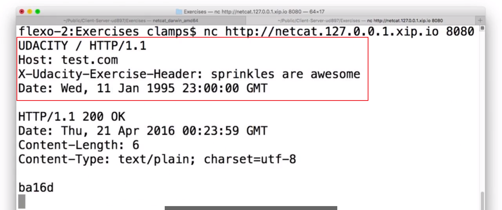

最后的 ba16d 是正确代码。

**作为网络开发者，我们通常并不直接发送 HTTP 请求，但是有必要知道它们的工作原理以及对应用有何影响**。


辅助材料：

[ Ud897-L2-Request-Headers-Binary](http://video.udacity-data.com.s3.amazonaws.com/topher/2016/June/575716a0_ud897-l2-request-headers-binary/ud897-l2-request-headers-binary.zip)

---

## 2.8 REST

在编写网络应用时，你将遇到很多需要与其通信的 API。某些可能是 JavaScript API，这些 API 只需调用 JavaScript 中的函数。其他 API 是第三方提供的，需要你自己发出 HTTP 请求。

RESTful API 遵循一种叫做 REST 的设计模式，专门用于 HTTP。REST 是表现层状态转化的简称（**Re**presentational **S**tate **T**ransfer），但说实话，光听名称并不明白是什么意思：


并非所有的 API 都遵循 REST 模式，但是有很多都遵守。我们来看看这一概念。

基本实体是集合以及位于这些集合中的对象，从集合中获取项目的一般模式是使用 GET 请求加上集合名称和集合中的单个条目的名称：


例如，如果我想查询 Richard，我将发送此请求：


服务器将获取包含 Richard 的数据的记录。

如果我想更新该记录中的数据，我将使用 PUT 请求并将更新的信息添加到该请求中，每个后续的 GET 请求现在应该生成更新后的记录：


POST 请求与 PUT 请求非常相似，但是你使用它创建新的记录而不是更新现有的记录：


注意，你通常不会提供新记录的名称，而是由服务器来设定，该 POST 请求的响应通常会重定向到新创建的记录。（所以这里的 POST 后并没有一个具体的项的名称）

> 一开始我以为我在后面括号中的补充是错误的，我以为所谓**新记录的名称**指的是 persons 这个目录集合名称，但我去看了 readable 项目中的 api 说明，发现 POST 以后服务器会以你所发送的数据中 id 作为项目集合中的对象名。因此，这里**新记录的名称**指的是**项目集合中的对象名**。

最后，DELETE 和你想象的一样，它会从集合中删除条目：


---

## 2.9 练习：REST

动物园打算向其他网站上的动物列表中添加一头新的鲸鱼，这些是可用的报头和路径（左边），请输入相应的字幕，从而构成创建新的鲸鱼所需的正确 REST 请求：

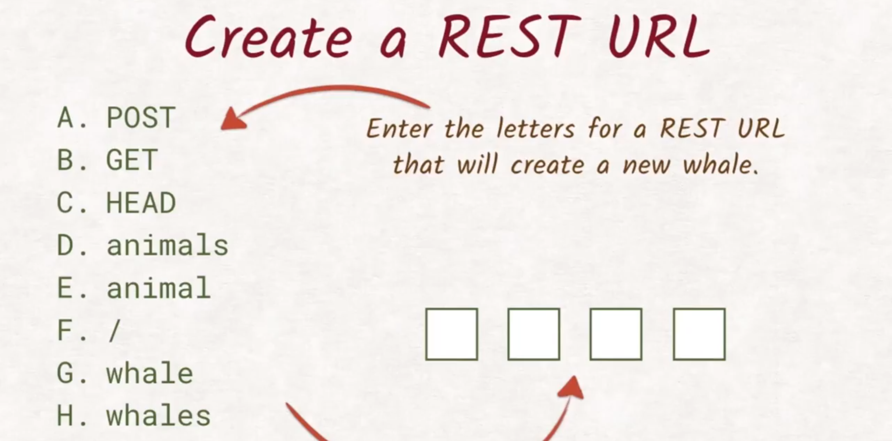

- 我们想要创建一头新的鲸鱼，就是说我们想要向集合中添加条目。所以我们需要使用 POST 方法，在第一个方框中输入 A；
- 网站有一个 animals 列表，表示我们要处理的集合叫做 animals，因此第在第二个方框中输入 D；
- 该集合中的新条目应该是鲸鱼，因此向路径中添加斜杠和 whale 就可以了。在最后的两个方框中填入 F 和 G

最终答案：`POST animals/whale`


---

## 2.10 性能基础

我们手动编写了直接与互联网互动的请求，并在服务器发出响应时就收到了它。感觉很酷，对不对。

就好像我们和发送的字节之间几乎没有软件，但**其中依然发生了很多我们无法直接看到的操作，实际上这对整个请求响应流程的速度有很大的影响**。

如果你对网络基础架构有点熟悉，就可能知道 HTTP 并不是整个组成部分，它只是协议。为了了解整个架构，我们将 HTTP 放在 TCP 上方，放在 IP 上方，放在以太网上方：

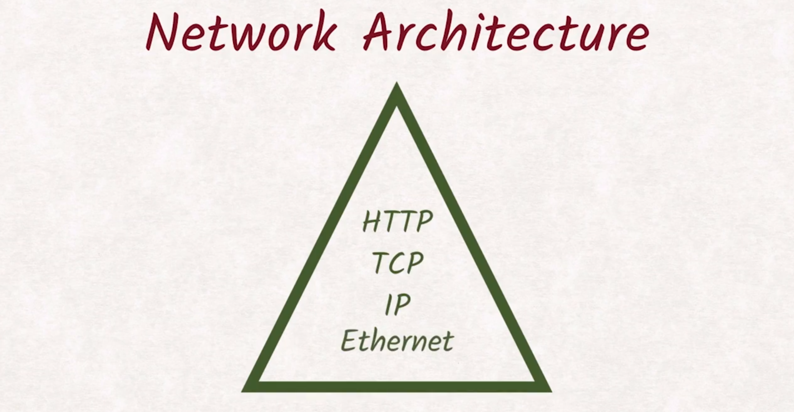

大部分情况就是这样。

我们不需要理解每个层级，但 **TCP 对如何构建性能高效的请求有着尤为重要的影响**，这值得仔细研究。

**互联网协议使我们能够与互联网上的其他机器通信**，而 **TCP 使我们能够在这两台机器之间建立多个独立的数据流**，**这些数据流通过<u>端口号</u>加以区分**。TCP 协议**还确保所有文件包都不会丢失，并且按照正确的顺序抵达，所有这些都需要耗费时间和资源成本的防范措施**：


**开启新连接的代价尤其高昂，因为 TCP 握手要确保两台机器都发现新创建的通信渠道，这需要两次往返通信**：

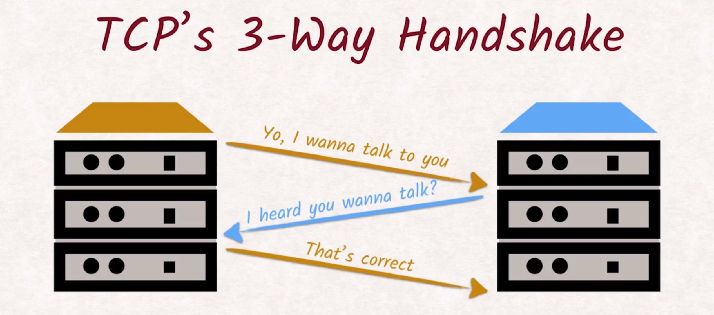

**如果使用的是 HTTPS，还需要执行额外的 TLS 握手**。如果你不熟悉 HTTPS 和 TLS 不用担心，我们将在下节课讲解这两个概念。

完成所有这些操作后，真正的 HTTP 协议才最终接受任务。

**队头阻塞（Head-of-line blocking）是一个严重的网站性能瓶颈问题**，浏览器建立六个并行连接会有所帮助，但是并不理想。稍后我们将了解 HTTP2 如何解决队头阻塞问题。


---

## 2.11  性能详情

但即使这样，我们还是需要考虑网络基础架构的特性。

在此示例中，从在地址栏中按下 Enter 键到显示之间超过 50% 的时间都花在等待回答上。这段等待时间称为传送首字节的时间，简称 TTFB（Time To First Byte）：


**如果此网站需要获取其他资源，我们必须等到第一个请求被响应，然后才能发送第二个请求，意味着又要等待一段时间。这段时间没有获得有效利用，这种问题成为队头阻塞**。

我们通过一个示例来看看什么是队头阻塞，以及对用户体验有何不良影响。

**对于 HTTP 来说，连接就像一个队列，当第一个请求正在被处理时，所有其他请求都需要等待**：


这样会浪费很多时间。

当店员正在准备 Richard 的咖啡时，其他顾客需要等待，即便他们点的咖啡制作起来简单多了：


队首阻塞了剩余的客户，为了稍微避免这种限制，浏览器开了六个并行连接。就像在我们的咖啡比喻中，他们又雇了一名咖啡师：


当第一个连接正在等待第一个字节时，第二个请求已经可以发送给第二个连接，以此类推。

当然，雇佣新的咖啡师需要大量时间和培训：


**在浏览器中，打开所有这些连接代价也很高，因为需要进行 TCP 握手，浏览器建立六个并行连接只是暂时解决了队头阻塞问题**。如果你的网页上有大量资源，你将花费大量时间去等待或瞪着收银员：


**队头阻塞是一个严重的网站性能瓶颈，浏览器打开六个并行连接有所帮助，但是效果不明显**。稍后我们将了解 HTTP/2 如果解决队头阻塞问题。


---

## 2.12 性能详情 2

**每次浏览器连接到服务器以发送请求时都需要完成 TCP 握手流程。这种三次握手非常消耗时间，为了抵消这些握手带来的代价，HTTP/1.1 推出了持续作用（keep-alive）这一概念**：


**如果客户端将 connection 报头设为 keep-alive，服务器在成功发出响应后将不会关闭连接。而是允许客户端重复利用已经建立的连接来进行其他请求**：


> 这里的 without 是指没有使用 Connection: keep-alive 的话，当请求并响应结束后，图中的黑色传送带将消失。而使用是 with，则不会消失，也就是连接并不会关闭，这样便不需要再重新握手，从而节约了时间。

注意，在上个请求的响应完全传输之前，你依然可以发送请求。总之，这么做使得网络开发者尽量减少其他资源的数量，充分利用他们的六个连接。

**因此 JavaScript 和 CSS 文件，通常都捆绑到一起，图片也会被加工为精灵图（sprites），仅用一个请求就能获得捆绑包**（bundle.js）：

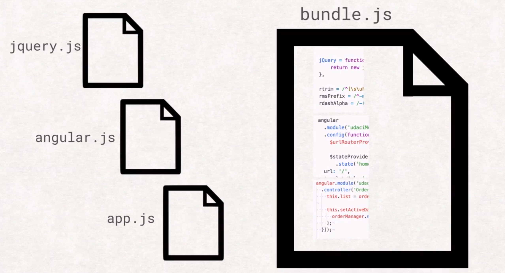


----

## 2.13 小结

有何感受，HTTP 很奇特，对吧？但我们知道它是网络的基础，你刚刚学到的知识非常宝贵，将帮助你理解网络的行为原理。

在深入学习 HTTP/2 之前，我们应该讨论下 **HTTPS 加密**，它是一个非常容易被误解的概念，**很多人认为它只是针对企业和电子商务网站，这绝对是个错误的认识**。


