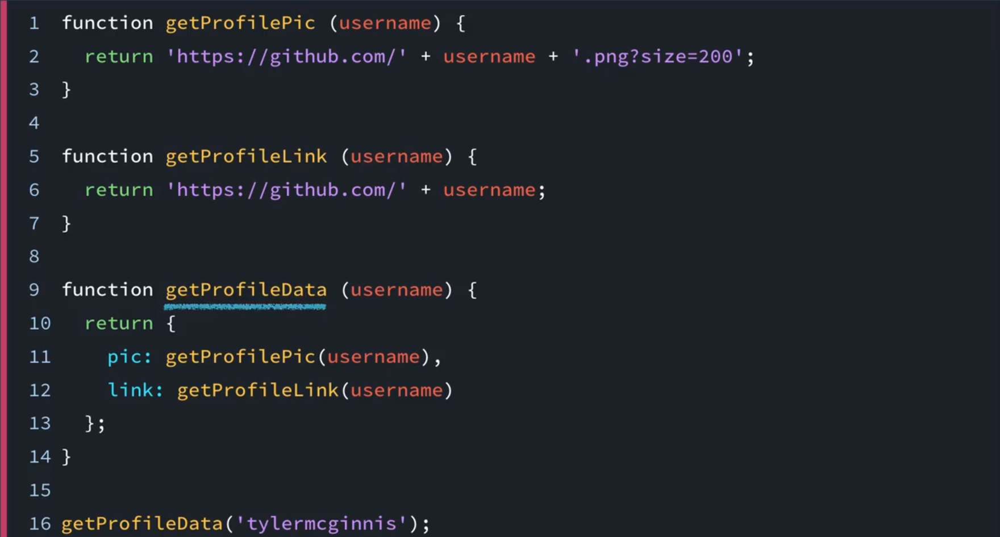
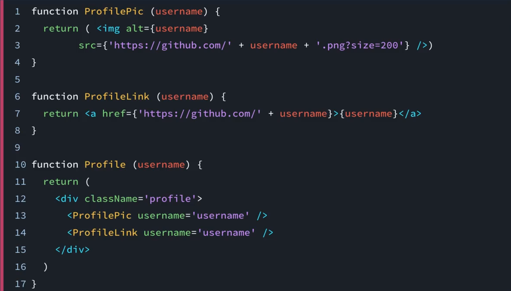
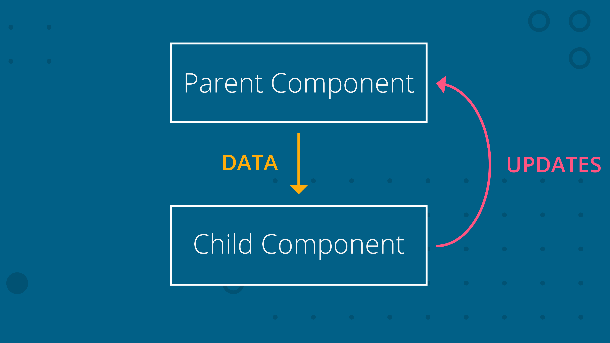
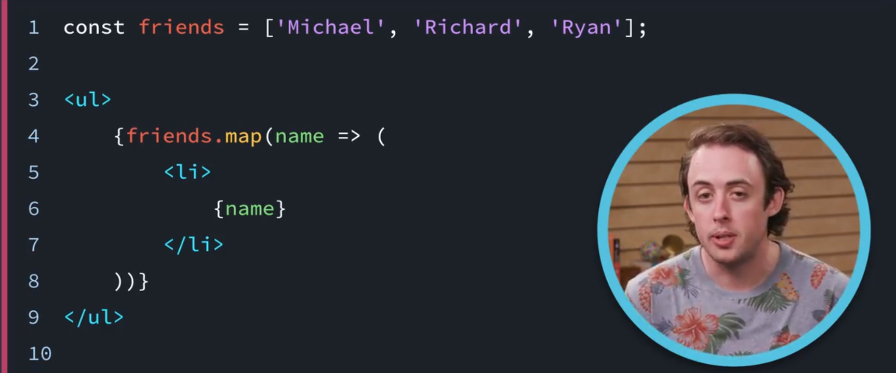

# 1. 为何要学习 React？

> 你将发现 React 的强大之处。你将创建简单的功能，并组合成复杂的功能，编写声明式代码，发现单项数据流并且发现 React 就是 JavaScript。

[TOC]

---

## 1.1简介

在我们深入学习 React 之前，先来看看 React 的重要特征。

- **组合式模型**
- **声明式特征**
- **数据流经过组件的方式**
- React 其实**只是由 JavaScript 构成的**

---

## 1.2 什么是函数组合？

根据[维基百科](https://en.wikipedia.org/wiki/Function_composition_(computer_science))的定义，函数组合是:

> **将简单的函数组合到一起并形成复杂的函数**

我们看看如何将简单的函数组合到一起，构建复杂的函数。

---

你可能很熟悉**函数的概念、何时使用函数、何时不使用函数**。

React 最棒的地方之一就在于你完全可以**依靠你对函数的直觉来创建 React 组件**。

唯一不同的是，你的函数**不再是传入参数—返回值，而是传入参数—返回用户界面**。



这里有三个函数和一个函数调用，可以看到我们的代码非常简洁明了，因为每个函数都有特定的用途。 我们将这些函数组合起来得到函数 getProfileData，用它来操作另外两个函数 getProfilePic 和 getProfileLink。

这样，当我们调用函数 getProfileData 时，我们就能得到一个代表用户的对象。现在**让我们使这些函数不再返回数据对象，而是稍作修改，使之返回一些用户界面（UI）。**



不要被这些语法吓到了，我们会在以后的课程中深入讲解这些代码，现在你只要知道，**我们创建的函数不再返回某些值，我们创建函数是为了得到某些用户界面**。

---

### 函数组合的优势

因为函数组合是让 React 非常强大的重要原因之一，因此我们将深入了解这一概念。注意，函数组合就是将简单的函数组合到一起，并形成复杂的函数。有几个重要概念值得注意，包括：

- 简单的函数
- 组合到一起形成另一个函数

函数组合由*简单*的函数构成。我们看一个示例：

```JavaScript
function getProfileLink (username) {
  return 'https://github.com/' + username
}
```

这个函数*极为*简单，对吧？只有一行！类似地，`getProfilePic` 函数*也*只有一行：

```javascript
function getProfilePic (username) {
  return 'https://github.com/' + username + '.png?size=200'
}
```

这些函数绝对是*简单的*函数，要组合它们，我们将它们放进另一个函数中：

```javascript
function getProfileData (username) {
  return {
    pic: getProfilePic(username),
    link: getProfileLink(username)
  }
}
```

我们可以不用组合形成 `getProfileData`，而是直接向其提供数据：

```javascript
function getProfileData (username) {
  return {
    pic: 'https://github.com/' + username + '.png?size=200',
    link: 'https://github.com/' + username
  }
}
```

理论上来说，根本没有问题；这完全是正确的 JavaScript 代码。**但*不是*函数组合**。这个不使用组合的版本还可能存在几个问题。如果要在其他地方需要用户的 GitHub 链接，那么可能需要重复的代码。**好的函数应该遵守"DOT”规则：**

> **只做一件事**

这个函数做了好几件事（无论有多小）；创建两个不同的 URL，将它们存储为对象上的某个属性，然后返回该属性。**在组合版本中，每个函数只做一件事：**

- `getProfileLink` – 只构建用户的 GitHub 个人资料链接字符串
- `getProfilePic` – 只构建用户的 GitHub 个人资料照片字符串
- `getProfileData` – 返回新的对象

### React 与函数组合

React 频繁利用函数组合！React 使用**组件**构建 UI 的各个部分。我们看看一些伪代码示例。以下是三个不同的组件：

```react
<Page />
<Article />
<Sidebar />
```

现在我们将这些*简单*的组件组合到一起，并创建更复杂的组件（又叫做 组合action！）：

```react
<Page>
  <Article />
  <Sidebar />
</Page>
```

现在，`Page` 组件*里面*具有 `Article` 和 `Sidebar` 组件。就像之前的示例那样，`getProfileData` 里具有 `getProfileLink` 和 `getProfilePic`。

稍后我们将讲解组件，暂时先记住**组合在构建 React 组件的过程中发挥了很大的作用**。

### 函数组合总结

函数组合是指**将*简单*的函数*组合*到一起并形成*更复杂*的函数。可以将每个函数看做一个*只做一件事* (DOT)的构建模块**。当你将这些简单的函数组合到一起并形成更复杂的函数时，这就叫做**函数组合**。

### 课外资料

- [Compose me That：JavaScript 中的函数组合](https://www.linkedin.com/pulse/compose-me-function-composition-javascript-kevin-greene)
- [函数式 JavaScript：日常用途的函数组合](https://hackernoon.com/javascript-functional-composition-for-every-day-use-22421ef65a10)

---

## 1.3 什么是声明式代码？

接触 React 后，你会经常听到**命令式代码（imperative）**和**声明式代码（declarative）**，让我们通过**类比**来说明二者的不同。

假设我坐在车中，我想让温度保持在舒适的范围，比如 22 度左右。汽车有两个旋钮用来调节至这个温度，一个旋钮控制温度，另一个控制气流。当温度太高或太低时，我需要做**命令式工作**，我要在整个开车过程中**控制**这两个旋钮以使车内温度达到 22 度， 但我**并不说出我想要的温度**。

现在假设我得到一辆新车，它没有进行温度控制的旋钮，而是让我**声明**一个温度，这次我不用在整个驾驶过程中摆弄旋钮以达到 22 度，而是**直接告诉汽车我想要的温度**。我将温度设为 22 度，由它为我处理命令式工作。

React 本质上也是这样工作的。你**只需声明状态和标记，React 会执行命令式工作使 DOM 与你的应用同步**。所以说 **React 是声明式**的。

---

### 命令式代码

很多 JavaScript 都是**命令式代码**。如果你不知道这里的“命令式”是什么意思，那么可能会比较头疼。[根据字典的定义](http://www.dictionary.com/browse/imperative)，“命令式”是指：

> 表示一项命令；**下达命令**

如果将 JavaScript 代码写成*命令式*，则我们是在明确地告诉 JavaScript **做什么**，**如何执行**。可以看做我们命令 JavaScript 明确执行哪些步骤。例如，下方的一个简单 `for` 循环：

```javascript
const people = ['Amanda', 'Geoff', 'Michael', 'Richard', 'Ryan', 'Tyler']
const excitedPeople = []

for (let i = 0; i < people.length; i++) {
  excitedPeople[i] = people[i] + '!'
}
```

如果你以前接触过 JavaScript（无论多久），那么这段代码应该好理解。我们循环访问 `people` 数组中的每项，向他们的名称中添加一个感叹号，并将新字符串存储到 `excitedPeople` 数组中。很简单吧？

但**这是*命令式*代码。我们命令 JavaScript 在每一步执行什么操作**。我们需要给它下达命令：

- 为**迭代器设定初始值** - (`let i = 0`)
- 告诉 `for` **循环何时停止** - (`i < people.length`)
- 获得当前位置的用户并添加一个感叹号 - (`people[i] + '!'`)
- 将 `i`th 位置的数据**存储**到另一个数组中 - (`excitedPeople[i]`)
- 使 `i` 变量加一 - (`i++`)

> 学习一下这里逐步读代码的方式，注意赋值语句先读右边，并且 for 循环最后一个表达式最后执行。

还记得使气温保持 22º 的示例吗？我会转动旋钮以吹出冷气。但是如果太冷的话，我就将旋钮拧的更高。最终，会变得太热，我需要再次将旋钮拧低些。我需要一点点地改变，自己管理温度。听起来像命令式情形吗？我需要手动执行多个步骤。不理想，因此改善下吧！

### 声明式代码

与命令式代码相反的是**声明式代码**。对于声明式代码，**我们<u>不编写所有步骤</u>来获得最终结果**。相反，我们***声明*要完成的操作**，JavaScript 将帮助我们执行它。这种解释有点抽象，我们来看个示例。我们将刚刚查看的命令式 `for`循环代码变得更加声明式。

对于命令式代码，我们执行所有步骤来获得最终结果。但是，我们实际上希望达到什么样的最终结果？起始点是名称数组：

```javascript
const people = ['Amanda', 'Geoff', 'Michael', 'Richard', 'Ryan', 'Tyler']
```

最终目标是名称保持不变，但是每个名称结尾处都有一个感叹号：

```javascript
["Amanda!", "Geoff!", "Michael!", "Richard!", "Ryan!", "Tyler!"]
```

要从起点抵达终点，我们将使用 JavaScript 的 [`.map()`](https://developer.mozilla.org/en-US/docs/Web/JavaScript/Reference/Global_Objects/Array/map?v=example) 函数声明我们想要的结果。

```javascript
const excitedPeople = people.map(name => name + '!')
```

就是这样！注意，对于这段代码，我们没有：

- 创建**迭代器对象**
- 告诉代码何时应该停止运行
- 使用迭代器访问 `people` 数组中的特定项
- 将每个新字符串存储在 `excitedPeople` 数组中

...所有这些步骤都由 JavaScript 的 `.map()` 数组方法来完成。


#### 练习题

下面的代码是命令式还是声明式？

```javascript
const people = ['Amanda', 'Geoff', 'Michael', 'Richard', 'Ryan', 'Tyler']
const longNames = people.filter(name => name.length > 6)
```


> #### 💡 `.map()` 和 `.filter()` 💡
>
> 已经快忘记 JavaScript 的 `.map()` 和 `.filter()` 数组方法了？或者你就从未接触过这两个方法。无论何种情况，我们都将在 **React “就是 JavaScript”** 部分深入讲解这两个方法。继续学习吧！

### React 是声明式

我们很快就会编写 React 代码，先再看一段示例，了解它为何是声明式。

```react
<button onClick={activateTeleporter}>Activate Teleporter</button>
```

你可能觉得奇怪，但这段代码是有效的 React 代码，应该很容易理解。注意，按钮只有一个 `onClick` 属性... 我们没有使用 `.addEventListener()` 并利用所有涉及的步骤来设置事件处理过程。我们只是声明我们希望在按钮被点击时，运行 `activateTeleporter` 函数。

### 声明式代码总结

*命令式*代码告诉 JavaScript *如何*执行每个步骤。对于*声明式*代码，我们告诉 JavaScript 我们希望实现什么*结果*，让 JavaScript 处理每个步骤。

React 是声明式代码，因为我们编写代码来声明我们想要什么，React 负责处理声明的代码，并执行所有的 JavaScript/DOM 步骤来实现我们期望的结果。

### 课外资料

- Tyler 的 [命令式与声明式编程](https://tylermcginnis.com/imperative-vs-declarative-programming/) 帖子
- [在 React.js 中声明式与命令式的区别？](https://stackoverflow.com/questions/33655534/difference-between-declarative-and-imperative-in-react-js)（来自 StackOverflow）

---

## 1.4 单向数据流

在 React 之前，常**用于管理应用状态变化**的技术是使用**数据绑定**。**当应用某处的数据发生变化时，这些变化也会自动反应在应用中的其他方面**。但是，**应用中拥有该数据的任何部分，都可以更改该数据。随着应用规模的增长，这种技术让人很难确定某个位置的数据变更是如何自动而隐式地影响着应用的其他部分。**

相比之下，React 使用一种更明确的数据管理方式，**在组件间向下传递数据，这使跟踪状态变更以及理解它对应用中其他部分造成的影响变得十分容易。这称为单向数据流，因为数据是单向从父组件向子组件的**。

---

### 其他框架中的数据绑定

[Angular](https://angular.io/) 和 [Ember](https://emberjs.com/) 等前端框架使用**双向数据绑定**。在双向数据绑定中，数据在整个应用中保持同步，无论是在何处更新的。如果模型更改了数据，数据会在视图中更新。如果用户在视图中更改了数据，数据会在模型中更新。**双向数据绑定听起来非常强大，但是会让应用很难判断数据实际上是否更新了，以及是在何处更新的。**

### 课外资料

- [Angular 的双向数据绑定](https://angular.io/docs/ts/latest/guide/template-syntax.html#!#two-way)
- [Ember 的双向数据绑定](https://guides.emberjs.com/v2.13.0/object-model/bindings/)

### React 的数据流

对于 React 的单向数据流，数据移动方向不一样。在 React 中，数据从父组件流向子组件。

[*数据从父组件流向子组件。数据更新发送到父组件，父组件会进行实际的更改。*](https://classroom.udacity.com/nanodegrees/nd001-cn-advanced/parts/e94d4b47-7ef4-4f56-9fcd-641258d72696/modules/82766b2b-1870-4904-aa90-8ccbe63928c5/lessons/9a065aa0-91d4-44a3-ad96-8d9b44be4d11/concepts/03b53d7e-ae83-4846-bff3-bc4015cd8d76#)

在上图中有两个组件：

- 一个父组件
- 一个子组件

**数据位于父组件中，并向下传递给子组件。虽然数据位于父组件中，但是父组件和子组件都可以使用数据。然而，如果必须更新数据的话，则只有父组件应该进行更新。如果子组件需要更改数据，它会将更新的数据发送给父组件，由父组件完成更改。父组件执行更改后，会将更新的数据传递给子组件。**

听起来可能觉得带来了额外的工作量，但是**让数据朝着一个方向流动并在一个位置修改使我们更容易理解应用的工作原理。**

#### 习题 1/2

`FlightPlanner` 组件存储航班预订信息。它还包含子组件 `DatePicker` 和 `DestinationPicker`。代码如下所示：

```react
<FlightPlanner>
  <DatePicker />
  <DestinationPicker />
</FlightPlanner>
```

如果这是 React 应用，哪些组件应该负责对数据做出更新？请选中所有适用项。

- `FlightPlanner`  √
- `DatePicker`
- `DestinationPicker`


现在假设 `FlightPlanner` 组件有两个子组件：`LocationPicker` 和 `DatePicker`。`LocationPicker` 本身是父组件，并且具有两个子组件：`OriginPicker` 和 `DestinationPicker`。

#### 习题 2/2

如果下面的示例代码是 React 应用，下面的哪些组件应该负责更新数据？请选中所有适用项。

```react
<FlightPlanner>

  <LocationPicker>
    <OriginPicker />
    <DestinationPicker />
  </LocationPicker>

  <DatePicker />

</FlightPlanner>
```

- `FlightPlanner`
- `LocationPicker`

存储数据的组件应该负责更新数据。 


### React 中的数据流总结

**在 React 中，数据仅朝一个方向流动，即从父组件流向子组件**。如果数据在兄弟子组件之间共享，那么数据应该存储在父组件中，并同时传递给需要数据的两个子组件。

---

## 1.5 React “就是 JavaScript”

你会注意到，随着课程的深入，需要学习的 React API 实际上很少。React 并不会重新创建这些你可以使用 JavaScript 实现的功能。

例如，如果你要创建一堆列表并在视图中展示，在 React 中，你只需使用 JavaScript 内置的 map 方法就可以了。

你会在课程中看到更多的例子，但是如果你已经比较熟悉 JavaScript 了，那么就能轻松上手 React。如果你不熟悉 JavaScript，React 会使你成为一名更好的 JavaScript 开发者。




---

### 就是 JavaScript

React 的优势之一是你要用到的很多功能都使用的是普通的 JavaScript。在过去几年内，**函数式编程**对 JavaScript 生态系统和社区产生了很大的影响。函数式编程是 JavaScript 中一个高级课题，涉及的内容用数百本书才能讲完。它太复杂了，以至于无法专研函数式编程的优势（我们还是要讲解 React 内容吧？）。**React 基于的是大量的函数式编程的技巧**…你将在这门课程中学习这些技巧。但是，有几个 JavaScript 函数对函数式编程来说非常重要，我们应该了解这些函数。这些函数包括 `.map()` 和 `.filter()` 方法。

### 我们详细了解下 `.map()` 和 `.filter()` 数组方法。

#### Array 的 `.map()` 方法

如果你不熟悉 JavaScript 的 [Array `.map()` 方法](https://developer.mozilla.org/zh-CN/docs/Web/JavaScript/Reference/Global_Objects/Array/map) 的话，其实它是在现有的数组上被调用，然后根据当做参数传入的函数返回的内容返回新的数组。我们看看：

```javascript
const names = ['Michael', 'Ryan', 'Tyler'];

const nameLengths = names.map( name => name.length );
```

看看发生了什么情况。`.map()` 方法适用于数组，因此首先要有数组：

```javascript
const names = ['Michael', 'Ryan', 'Tyler'];
```

我们针对 `names` 数组调用 `.map()` 并传入一个函数作为参数：

```javascript
names.map( name => name.length );
```

`names` 数组中的每一项都会调用传递给 .map() 的箭头函数！箭头函数接收数组中的第一个名称，将其存储在变量 `name` 中，并返回其长度。然后对剩下的两个名称执行相同的操作。

`.map()` 返回新的数组，该新数组的每一项都是箭头函数所返回的值：

```javascript
const nameLengths = names.map( name => name.length );
```

因此 `nameLengths` 将为*新的*数组 `[7, 4, 5]`。一定要理解这一点；**.map() 方法返回新的数组，它没有修改原始数组**。

上面只是简单地介绍了 `.map()` 方法的运行原理。要深入了解该方法，请访问 [MDN 上的 `.map()`](https://developer.mozilla.org/zh-CN/docs/Web/JavaScript/Reference/Global_Objects/Array/map)。

#### `.map()` 测验

使用提供的音乐数据数组和 `.map()` 方法创建一个新的数组，并包含以下格式的元素：

```react
<album> by <name> sold <sales> copies
```

将新数组存储在 `albumSalesStrings` 数组中。因此 `albumSalesStrings` 数组中的第一项应该是 `"25 by Adele sold 1731000 copies"`

```javascript
/* Using .map()
 *
 * Using the musicData array and .map():
 *   - return a string for each item in the array in the following format
 *     <album-name> by <artist> sold <sales> copies
 *   - store the returned data in a new albumSalesStrings variable
 *
 * Note:
 *   - do not delete the musicData variable
 *   - do not alter any of the musicData content
 *   - do not format the sales number, leave it as a long string of digits
 */

const musicData = [
    { artist: 'Adele', name: '25', sales: 1731000 },
    { artist: 'Drake', name: 'Views', sales: 1608000 },
    { artist: 'Beyonce', name: 'Lemonade', sales: 1554000 },
    { artist: 'Chris Stapleton', name: 'Traveller', sales: 1085000 },
    { artist: 'Pentatonix', name: 'A Pentatonix Christmas', sales: 904000 },
    { artist: 'Original Broadway Cast Recording', 
      name: 'Hamilton: An American Musical', sales: 820000 },
    { artist: 'Twenty One Pilots', name: 'Blurryface', sales: 738000 },
    { artist: 'Prince', name: 'The Very Best of Prince', sales: 668000 },
    { artist: 'Rihanna', name: 'Anti', sales: 603000 },
    { artist: 'Justin Bieber', name: 'Purpose', sales: 554000 }
];

const albumSalesStrings = musicData.map( music => `${music.name} by ${music.artist} sold ${music.sales} copies`)

console.log(albumSalesStrings);
```

#### Map 方法测验解决方案代码

自己尝试解答这道测验后，请将光标悬停在此处以查看可行的解决方案。

```javascript
const albumSalesStrings = musicData.map(album => `${album.name} by ${album.artist} sold ${album.sales} copies`);
```


### Array 的 `.filter()` 方法

JavaScript 的 [Array `.filter()` 方法](https://developer.mozilla.org/zh-CN/docs/Web/JavaScript/Reference/Global_Objects/Array/filter) 和 `.map()` 方法相似：

- 在数组上被调用
- 传入函数作为参数
- 返回新的数组

区别在于传递给 `.filter()` 的函数用作检验条件，数组中只有通过检验的项目才会包含在新数组中。我们看一个示例：

```javascript
const names = ['Michael', 'Ryan', 'Tyler'];

const shortNames = names.filter( name => name.length < 5 );
```

和之前一样，起始数组如下：

```javascript
const names = ['Michael', 'Ryan', 'Tyler'];
```

我们对 `names` 数组调用 `.filter()` 并向其传递一个函数作为参数：

```javascript
names.filter( name => name.length < 5 );
```

和 `.map()` 一样，`names` 数组中的每一项都会调用传递给 .filter() 的箭头函数。第一项（即 `'Michael'`）存储在 `name` 变量中。然后进行检验，也就是进行实际的过滤操作。它会检查名称的长度，如果大于等于 `5`，那么就跳过该名称（并且不包含在新数组中！）。但是，如果名称的长度小于 `5`，那么 `name.length < 5` **返回 `true` 并且该名称包含在新数组中！**

最后，和 `.map()` 一样，`.filter()` 方法返回新的数组，而不是修改原始数组：

```javascript
const shortNames = names.filter( name => name.length < 5 );
```

因此 `shortNames` 将为新数组 `['Ryan']`。注意，现在它里面只有一个名称，因为 `'Michael'` 和 `'Tyler'` 都是 `5`个字符或更长，被滤除了。

上面只是简单地介绍了 `.filter()` 方法的运行原理。要深入了解该方法，请访问 [MDN 上的 `.filter()`](https://developer.mozilla.org/zh-CN/docs/Web/JavaScript/Reference/Global_Objects/Array/filter)。

#### `.filter()` 测验

使用提供的音乐数据数组和 `.filter()` 方法创建一个新的数组，其中仅包含名称在 `10` 和 `25` 个字符之间的专辑。将新数组存储在变量 `results` 中。

```javascript
/* Using .filter()
 *
 * Using the musicData array and .filter():
 *   - return only album objects where the album's name is
 *     10 characters long, 25 characters long, or anywhere in between
 *   - store the returned data in a new `results` variable
 *
 * Note:
 *   - do not delete the musicData variable
 *   - do not alter any of the musicData content
 */

const musicData = [
    { artist: 'Adele', name: '25', sales: 1731000 },
    { artist: 'Drake', name: 'Views', sales: 1608000 },
    { artist: 'Beyonce', name: 'Lemonade', sales: 1554000 },
    { artist: 'Chris Stapleton', name: 'Traveller', sales: 1085000 },
    { artist: 'Pentatonix', name: 'A Pentatonix Christmas', sales: 904000 },
    { artist: 'Original Broadway Cast Recording', 
      name: 'Hamilton: An American Musical', sales: 820000 },
    { artist: 'Twenty One Pilots', name: 'Blurryface', sales: 738000 },
    { artist: 'Prince', name: 'The Very Best of Prince', sales: 668000 },
    { artist: 'Rihanna', name: 'Anti', sales: 603000 },
    { artist: 'Justin Bieber', name: 'Purpose', sales: 554000 }
];

const results = musicData.filter(album => album.name.length >=10 && album.name.length <= 25);

console.log(results);
```

#### Filter 测验解决方案代码

自己尝试解答这道测验后，请将光标悬停在此处以查看可行的解决方案。

```javascript
  const results = musicData.filter(album => album.name.length <= 25 && album.name.length >= 10);
```


### 将 `.map()` 和 `.filter()` 组合到一起

`.map()` 和 `.filter()` 的如此强大之处在于它们可以组合到一起。因为**两个方法都返回数组，因此我们可以将它们的方法调用链到一起，一个方法返回的数据可以是另一个方法的新数组。**

```javascript
const names = ['Michael', 'Ryan', 'Tyler'];

const shortNamesLengths = names.filter( name => name.length < 5 ).map( name => name.length );
```

详细讲解下，`names` 数组被过滤，并返回新的数组，然后对该新数组调用 `.map()`，并再次返回新的数组！`.map()` 返回的新数组存储在 `shortNamesLengths` 中。

#### 首先是 `.filter()`！

提醒下，**你需要按照一定的顺序组合二者（先是 `.filter()`，然后是 `.map()`）**。因为 `.map()` 针对数组中的每项都调用一次函数，因此**如果数组已经过滤过的话，运行速度会更快**。

#### `.filter()` 和 `.map()` 测验

使用同一音乐数据和 `.filter()` 及 `.map()` 来过滤并映射列表，将结果存储在变量 `popular` 中。使用 `.filter()` 从列表中过滤出销量超过 1,000,000 张的专辑。然后对返回的数组调用 `.map()`，并创建一个项目格式如下的新数组：

```react
<artist> is a great performer
```

`popular` 数组中的第一项将为 `'Adele is a great performer'`。

```javascript
/* Combining .filter() and .map()
 *
 * Using the musicData array, .filter, and .map():
 *   - filter the musicData array down to just the albums that have 
 *     sold over 1,000,000 copies
 *   - on the array returned from .filter(), call .map()
 *   - use .map() to return a string for each item in the array in the
 *     following format: "<artist> is a great performer"
 *   - store the array returned form .map() in a new "popular" variable
 *
 * Note:
 *   - do not delete the musicData variable
 *   - do not alter any of the musicData content
 */

const musicData = [
    { artist: 'Adele', name: '25', sales: 1731000 },
    { artist: 'Drake', name: 'Views', sales: 1608000 },
    { artist: 'Beyonce', name: 'Lemonade', sales: 1554000 },
    { artist: 'Chris Stapleton', name: 'Traveller', sales: 1085000 },
    { artist: 'Pentatonix', name: 'A Pentatonix Christmas', sales: 904000 },
    { artist: 'Original Broadway Cast Recording', 
      name: 'Hamilton: An American Musical', sales: 820000 },
    { artist: 'Twenty One Pilots', name: 'Blurryface', sales: 738000 },
    { artist: 'Prince', name: 'The Very Best of Prince', sales: 668000 },
    { artist: 'Rihanna', name: 'Anti', sales: 603000 },
    { artist: 'Justin Bieber', name: 'Purpose', sales: 554000 }
];

const popular = musicData.filter(album => album.sales > 1000000).map(album => album.artist + ' is a great performer')

console.log(popular);

```

#### Filter & Map 测验解决方案代码

自己尝试解答这道测验后，请将光标悬停在此处以查看可行的解决方案。

```javascript
const popular = musicData
  .filter(album => album.sales > 1000000)
  .map(album => `${album.artist} is a great performer`);
```

> \`${album.artist} is a great performer` 为 es6 新的语法功能——模板对象

### React 就是 JavaScript 总结

React 是在你已经了解的 JavaScript 基础上构建而成的！你不需要学习特殊的模板库或新的执行方式。

你将经常用的两个主要方法是：

- [`.map()`](https://developer.mozilla.org/en-US/docs/Web/JavaScript/Reference/Global_Objects/Array/map)
- [`.filter()`](https://developer.mozilla.org/en-US/docs/Web/JavaScript/Reference/Global_Objects/Array/filter)

请务必熟练使用这两个方法，请花些时间练习使用它们。**不妨查看你的一些现有代码并尝试将你的 `for` 循环转换为 `.map()` 调用，或者看看是否能够使用 `.filter()` 删除任何 `if` 语句。**

---

## 1.6 课程总结

我们总结下我们在这节课介绍的关于为何 React 很强大的知识：

- 它的函数组合模型
- 它的声明式特性
- 数据从父组件流向子组件的方式
- 以及 React 本质上就是 JavaScript

请阅读以下课外资料：

- [虚拟 DOM](https://facebook.github.io/react/docs/optimizing-performance.html#avoid-reconciliation)|([翻译链接](https://doc.react-china.org/docs/optimizing-performance.html#%E9%81%BF%E5%85%8D%E9%87%8D%E5%A4%8D%E6%B8%B2%E6%9F%93)) React 文档。虚拟 DOM 代表的是**树结构**，**每个节点都是一个 HTML 元素**。**React 能够遍历该虚拟 DOM 并在上面执行操作，避免应用在实际 DOM 上出现“代价高的”Activity。**
- [Diff 算法](https://facebook.github.io/react/docs/reconciliation.html#the-diffing-algorithm)|([翻译链接](https://doc.react-china.org/docs/reconciliation.html#%E5%AF%B9%E6%AF%94%E7%AE%97%E6%B3%95)) React 文档。Diffing 可以判断如何对 DOM 做出有效的更改，通过 diffing，旧的 DOM 节点仅在必要时被替换掉。这样，应用不需要执行任何不必要的操作来判断何时渲染内容。