# 2.使用 React 渲染 UI

> 你将了解 React 如何创建和渲染元素。你还会将手动元素转换为 JSX，使用 create-react-app 搭建项目，并且了解组件的简单介绍。

[TOC]

---

## 2.1 渲染 UI 简介

**React 没有使用字符串模板，而是使用 JavaScript 对象来构建用户界面**。这是 React 和其他常用 JavaScript 框架的根本区别。

**React 元素是轻量级 JavaScript 对象，而非实际的 DOM 节点。**我们要充分发挥 JavaScript 的功能，将他们整合起来，我们使用这些元素来描述页面是什么样的，然后**交给 React 来实际操作 DOM**。**我们甚至可以创建自定义元素，也就是“组件（Components）”，利用它们来整齐地封装元素和行为，这些组件是 React 的基本单位。**

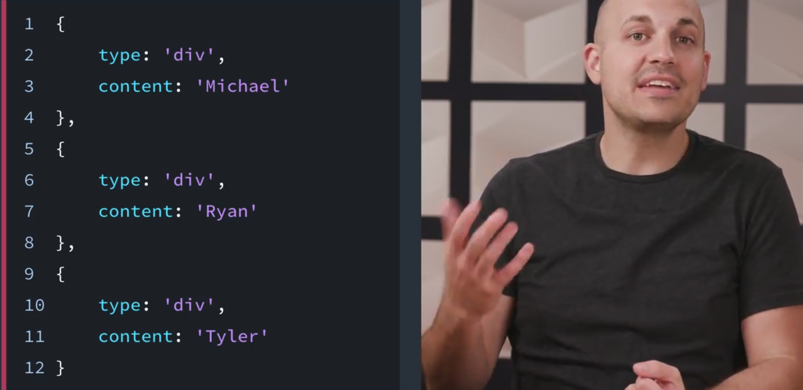

---

React 使用 JavaScript 对象来创建 React 元素。我们将使**用这些 React 元素来描述我们希望页面看起来如何**，**React 将负责生成 DOM 节点来达到效果**。

还记得在上节课提到的命令式与声明式代码之间的区别吗？**我们编写的 React 代码是声明式，因为我们没有告诉 React *执行什么操作*；我们编写 React 元素来描述页面应该看起来怎么样，React 会执行所有的实现工作。**

说了很多理论内容了，我们开始创建一些元素吧！

---

## 2.2 创建元素和 JSX

### 首先观看

在下面的几个视频中，我们将使用 React 的 `.createElement()` 方法。首先，下面是它的用法：

```react
React.createElement( /* type */, /* props */, /* content */ );
```

稍后我们将详细分析！我们将用一个已经设置好的项目开始。暂时不用担心创建项目或跟上进度。很快就会有很多实践内容！我们将在下个部分构建我们的课程内项目 Contacts App。

虽然你将在下面的几个视频中看到，但是确保能了解 React 的 `.createElement()` 方法有多酷！

> #### 💡 Trying Out React Code 💡
>
> React 是 JavaScript 的扩展（即 JavaScript 库），但是没有内置在浏览器中。如果你像学习 JavaScript 一样在浏览器控制台中测试 React 代码示例，则无法测试。稍后，我们将了解如何安装和使用 React 环境。然后，你将能够尝试示例代码！

---

我们说过 react 不是使用模板来描述用户界面而是使用元素，我们这样说是什么意思呢？

这里有两个非常基本的文件，一个是 react，一个是 react-dom。

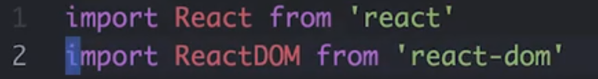

现在先不要担心这些文件来自哪里，也不要自己操作，在讲解实际操作之前，我们先来讨论一些核心概念。

重要的是要知道左边的浏览器会反映我在右边编辑器上输入的内容。

我们使用 React.createElement 创建一个新的 react 元素

```javascript
const element = React.createElement('div',null,'hellow world');
```

这是 react 用于创建这些元素的顶级 API 调用，它看起来有点像 Document.createElement 方法，但还是有点差别的。

- 第一个参数是我们**要使用的元素的标签名称**，我们直接创建一个 div。
- 第二参数我们稍后在谈。
- 第三个参数**将是我们放在 div 中的一些文本**。

那么我们怎么才能将这个元素放到页面中呢？

这就是 ReactDom 派上用场的地方了。ReactDom 只是使用 react 库的一种方式，在 react 中，**决定要渲染什么的过程与实际渲染完全脱钩，这种脱钩使我们可以在本地设备的服务器甚至是在 VR 环境中渲染事物**。

这节课我们使用 react-dom 因为我们在浏览器中工作。（在其他环境下使用其他的方式渲染）

```react
ReactDom.reader(
  element,
  document.getElementById('root')
)
```

那么我们说 ReactDom 将我的元素渲染到一个 DOM 节点，在这种情况下，我们将使用页面中已经存在的根元素，我们保存它，然后在浏览器中可以看到 div 中显示了 hello world 消息。

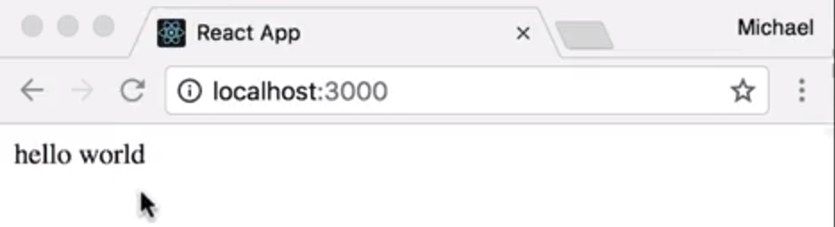

不过你看着这行可能在想这个元素是什么，我们来看看控制台。

```javascript
console.log(element)
```

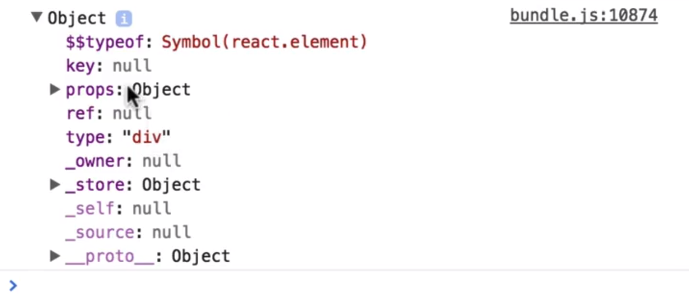

我们打开 Chorme 的检查器，可以看到这只是一个简单的 JavaScript 对象，它有一堆不同的属性。它具有键、props、类型（type——'div'，这个 div 是我们给它的作为元素类型的字符串）、下面还有一些私有属性。

---

### 在 DOM 上渲染元素

在上个视频中，**我们使用 ReactDOM 的 `render()` 方法将我们的元素渲染到页面的特定区域**。具体而言，我们在叫做 `root` 的 DOM 节点上渲染了 `element`。这个 `root` 来自哪里？

**使用 React 构建的应用通常有一个 `root` DOM 节点。例如，一个 HTML 文件可能包含以下 `<div>`：**

```html
<div id='root'></div>
```

通过将该 DOM 节点传入 `getElementById()`，React 将最终**能够控制**它的所有内容。**另一种思考方法是这个 `<div>` 将充当我们 React 应用的“钩子”；React 将控制该区域并渲染我们的 UI！**

#### 习题 1/3

运行以下代码时，`myBio` 将存储什么？

```react
import React from 'react';

const myBio = React.createElement(
    'div',
    null,
    'My name is Michael, and I love porcupines.'
);
```

- DOM 节点的引用？
- DOM 节点本身？
- JavaScript 对象？√
  - React 的 `.createElement()` 方法获得元素的说明并返回简单的 JavaScript 对象。 
- JavaScript 类？

---

现在我们要给元素添加一个类名。

第二个参数是**要为 DOM 节点添加的属性**，那么为它添加一个类名 welcome-message。

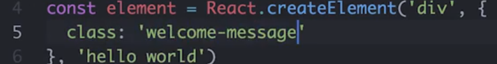

保存，我们收到了一条警告。

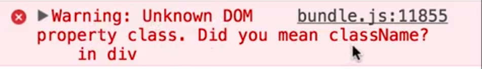

未知的 DOM 属性 class，你是说在 div 中的 className 吗？

这是 React 给我们的一条警告，它说 class 一词不是一个有效的 DOM 属性，并建议我们使用 className。我们来试试。

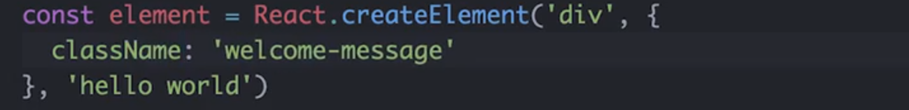

现在可以看到警告消失了，并且元素被赋予了我们想要的类名。不过这有点让人困惑，你还记得吗，**这些元素实际上描述的是 DOM 节点，而不是 HTML**。

**Class 是 HTML 属性的名称，一旦浏览器解析完毕并将其转换为真正的 DOM，节点 DOM 属性名称就是 className。**

让我们在控制台中审查这个 div。

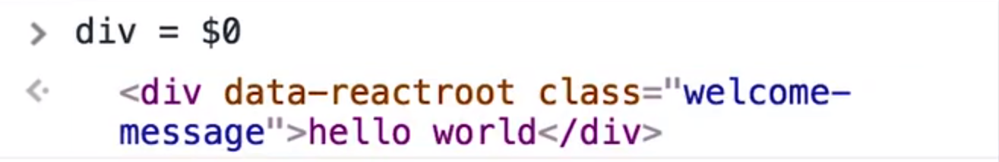

可以看到，虽然它的 HTML 声明中有 class 一词，如果我打 div.class，这里我们使用的是对象，即实际 DOM 节点，它说 div.class 未定义，而 div.className 返回的才是正确的字符串。

所以当我们创建这些 React 元素时，**记住，我们在描述 DOM 节点，而非 HTML 字符串。**

我们在学习 React 时，你可能会遇到 VirtualDOM 一词。这个术语本质上的意思是**我们在这里创建的不是真正 DOM 元素，而只是描述真正 DOM 节点的对象**。所以，**调用 React.createElement 时并没有在 DOM 中创建任何东西，只有执行 render 后，浏览器才会创建真正的 DOM 元素。**

---

### 习题 2/3

React 允许将各种 HTML 属性传递给 React 元素。请查看 [React文档中的 `All Supported HTML Attributes`](https://reactjs.org/docs/dom-elements.html#all-supported-html-attributes)|([翻译链接](https://doc.react-china.org/docs/dom-elements.html#%E6%89%80%E6%9C%89%E5%8F%97%E6%94%AF%E6%8C%81%E7%9A%84html%E5%B1%9E%E6%80%A7))，并指出下面的哪些属性是允许传递的：

- poset
- id
- marginWidth
- for
  - 值得注意的一点是，你无法使用默认的 `for` 属性。就像你需要使用 `className`而不是 `class`，你需要使用 `htmlFor` 而不是 `for`。这是因为 'for' 是 JavaScript 的保留词。 
- accessKey

我刚刚使用 React 的 `.createElement()` 方法构建了一个 “React 元素”。`.createElement()` 方法具有以下方法：

```react
React.createElement( /* type */, /* props */, /* content */ );
```

我们详细分析每一项参数可以为：

- `type` – **字符串或 React 组件**

  可以是任何现有 HTML 元素字符串（例如 `‘p’`、`‘span’` 或 `‘header’`），或者你可以传递 React *组件*（稍后我们将使用 JSX 创建组件）。

- `props` – 为 `null` 或一个对象

  这是 HTML 属性的对象以及关于该元素的自定义数据。

- `content` – `null`、字符串、React 元素或 React 组件

  你在此处传递的任何内容都将为所渲染元素的内容。**包括纯文本、JavaScript 代码、其他 React 元素等。**

---

现在我们来聊聊**嵌套**。

**大多数用户界面都表示为其他视图中的视图。**由于 React 是用于创建用户界面的库，它实际上非常擅长这一点。

我们来看看这个 div 在这里我们不说 hello world。而是放入其他一些元素。或者我们可以在这里放一个 span 来保存我们的消息，或者一个 strong 元素以使它显示为粗体。

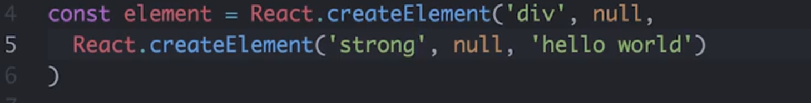

所以我们可以通过将元素作为第三个参数传递给 createElement 来将其嵌套在其他元素内。

我们来做一些更有趣的事情。

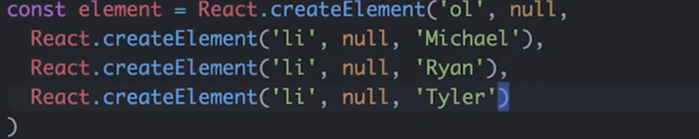

我们创建一个列表，这将是一个列表项，然后这将是一列人员，我们有 Michael、Ryan 和 Tyler

这没问题，但大多数时候你需要一个列表，你可能将项放在某处的数组中。相比于逐个写出子元素，**React 可以让我们提供元素数组作为 children**，这使我们可以方便地使用现有的数据数组。

假设我们这里有一个人员数组，并且我们想从该数组动态地生成这些列表项，我们可以映射（map）人员数组，然后对于每位人员生成一个列表项，而不是硬编码名称。我们直接使用 person.name 就会获得相同的结果。

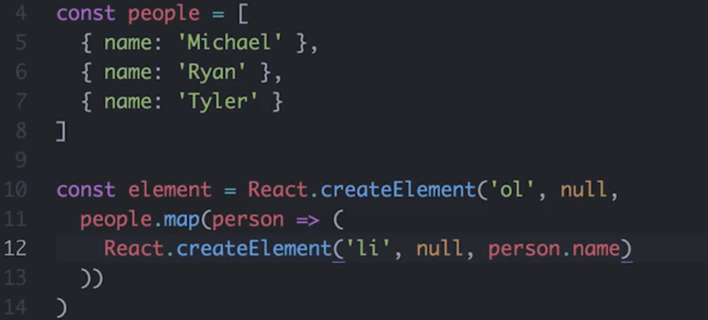

我之所以喜欢使用 JavaScript 来生成这些元素，是因为我不需要任何特殊语法来映射数组，只要用数组映射就可以了。所以我不需要用模板语言来重复或映射（mapping）每个语法去遍历数组。我使用已经熟悉的 JavaScript 就可以。

这里有趣的另一点是这个 person 对象已处于作用域内，所以我不需要模板语言来给我这个作用域概念。相反，我只是在 JavaScript 函数作用域中使用了 person 对象，这里没什么新东西要学。

**使用数组作为 children 需要注意的一点是，如果你未给它设置键，则会收到 react 的警告。我们在这里弹出控制台就会看到一条警告。**

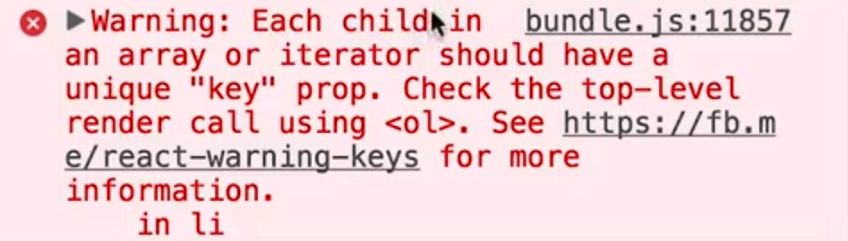

它说**数组或迭代器中的每个子元素都应有一个唯一个键(key) prop**，请检查顶层使用 ol 的调用。这是什么意思呢？

记得当我们将类名添加到 div 时，这里的第二个参数，这些组件的 prop，我们来给这个项一个唯一的键 prop 给每个对象一个唯一的键，在这里使用 name 就可以了，这对每个对象都是唯一的，保存它就会看到警告消失了。

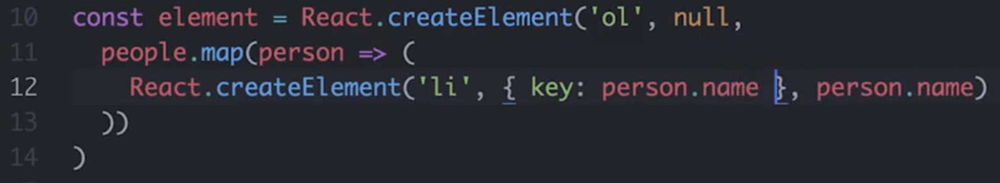

**使用数组时与项相关的另一个始终唯一的东西，是它们在数组中的索引。**所以如果我愿意，我也可以在此使用每位人员在原始数组中的索引作为键。那么，我如何获得索引呢？这又要用到 JavaScript 了，对吧？

这是我喜欢使用 JavaScript 的另一点。我没有在此使用任何人的模板语言，所以我不需要学习任何新的东西就知道**映射回调的第二个参数是索引**，这就是我获得它的方式。

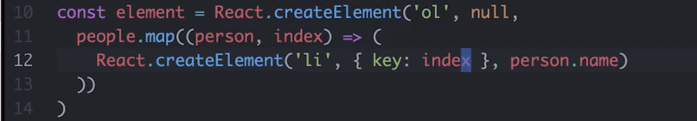

在这节课中，我们不会深入讲解键(key) prop ，但是要知道**当你的应用状态发生变化时，这将有助于 react 跟踪更改特定子元素。**

我们将在下节课中更多地讲解状态，现在你只需要知道你**使用数组时，你需要给每个子元素一个唯一个键 prop**。

---

### `.createElement()` 返回*一个* 根元素

`React.createElement( /* type */, /* props */, /* content */ );` 创建一个特定类型的 React 元素。我们通常会传入一个标签，例如 `<div>` 或 `<span>` 来表示该类型，但是**内容参数可以是*另一个* React 元素**！

看看下面的示例：

```react
const element = React.createElement('div', null,
  React.createElement('strong', null, 'Hello world!')
);
```

这里，当**此 React 元素渲染为 HTML** 时，"Hello world!"将包裹在 `<div>` 内。虽然我们可以嵌套 React 元素，但是注意整个调用仅返回一个元素。

---

现在我们已经学习了如何创建和嵌套元素，但是**如果只使用嵌套的方法来创建元素就会产生大量冗杂的嵌套结构**。如果我们有一些不同的语法，可以用来更自然地描述元素间的嵌套关系就好了。

HTML 怎么样，这不就是它的作用吗？或许我们可以借用一些这样的尖括号放在我们的 JavaScript 中？换句话说，或许**我们可以将创建元素的调用变得更像我们熟悉的 HTML，这正是 JSX（**JavaScript eXtension **） 所做的。**

**JSX 是 JavaScript 的语法扩展**，它可以让我们编写看起来有点像 HTML 的 JavaScript 代码，使其更加简洁易懂，我们来看看吧。

> 虽然JSX看起来像HTML，但**它实际上只是一种更灵敏的方式`React.createElement()`来编写声明**。当组件渲染时，它输出一个 React 元素树或该组件输出的 HTML 元素的虚拟表示。React 然后将基于此 React 元素表示来确定对实际 DOM 所做的更改。

---

我们来使用 JSX 而非 createElement 重新创建人员列表。

像我之前提到的 JSX 看起来与 HTML 很像， 所以我们要将这些 createElement 调用替换为一些类似 HTML 的东西。

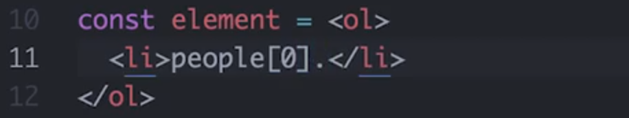

看看这些尖括号，它们怎么会在我的 JavaScript 中？

这是许多人第一次看到 JSX 时的反应，如果这是你现在的感觉，不用担心，这很正常。但是看看我们摆脱了多少语法。

我们在这里放上 li，我们想获取人员数组中第一个人的名字，那么我们说 `people[0].name`，看看会获得什么

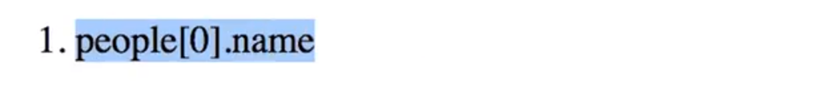

它只是给出了我们刚写的代码，我们想要的是这个表达式的结果，但 JSX 只是传递了所有的字符，并将它们显示在页面上。所以每当我们想让 JSX 为我们解析一些 javascripts 时，我们需要将这条 JavaScript 包裹在**花括号**中，这**可以是你想要的任何 js 表达式**。

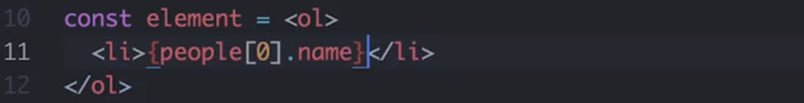

它可以是算术，也可以是三元运算符

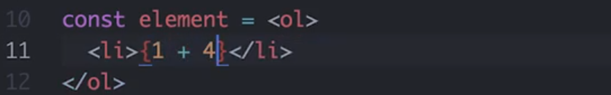

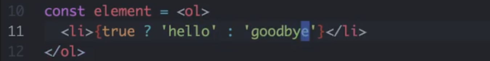

只要是放在这些花括号里的任何有效的 js 表达式都可以。

那之前的映射呢？我们也可以将它们放在花括号里吗？来试试看。

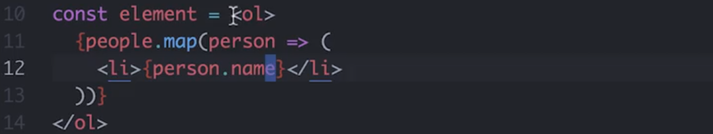

我们说 people.map 映射我们想要创建列表项的每个人员。然后在这里，我们用 person.name 获取人名。所以我们从 JSX 开始，而从这个花括号开始进入 js 评估 people.map 此映射函数的返回值将是一些 JSX，然后我们又从这里返回 js 说 person.name。所以我们**从 JSX 开始进入 js 返回 JSX 又返回 js**。但是整个过程非常流畅，也比我们之前用的嵌套的 createElement 调用要简洁得多。

我们之前说过，每当我们给 react 一个数组时，我们需要给所有子元素一个唯一键属性，这里也完全一样。我们查看浏览器控制台，毫不意外出现了关于键属性的警告，我们需要给每个列表项元素一个唯一键属性。

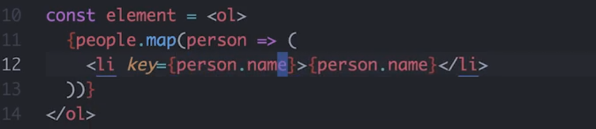

我们在 JSX 中这么做的方法与 HTML 属性非常像。我们可以说 key= 打开一个新的 js 表达式并使用 person.name 作为 key 的值。

为了更清楚，我们来看看这里的源代码，看看我们刚刚写的这个代码可以编译成什么。

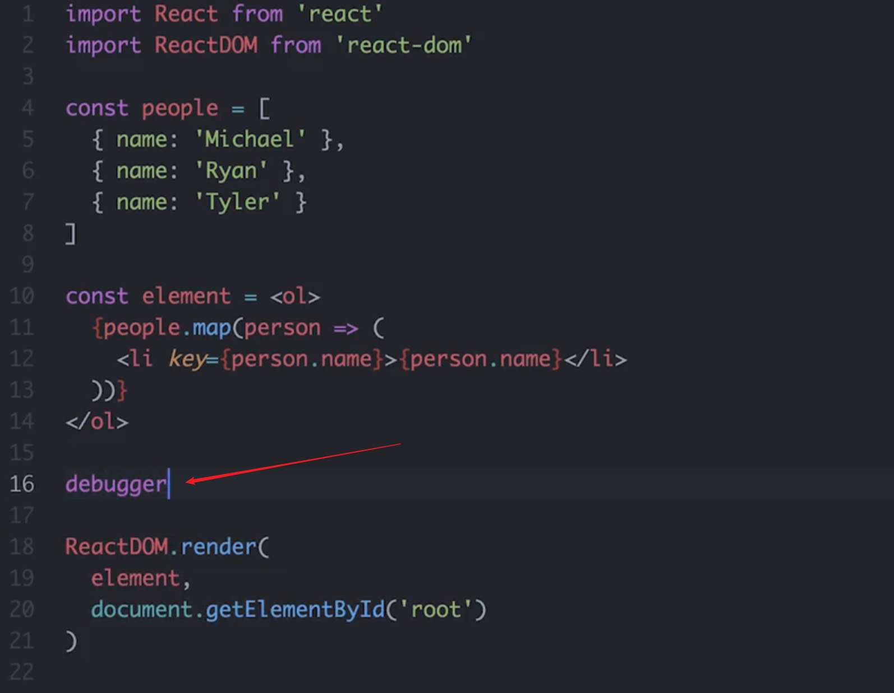

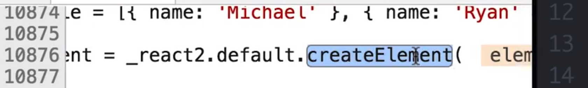

我们可以在源代码查看器中看到我们实际上仍在使用 createElement 调用来创建元素，所以即使我们在编辑器中使用 JSX，它非常简洁，**但这些代码最终都会编译成真正的 JavaScript。**

---

#### 习题 3/3

看看下面的 JSX 示例：

```react
const greeting = (
  <div className='greeting'>
    <h2>Hello world!</h2>
  </div>
);
```

如果你想输出相同的 HTML，在调用 `createElement()` 时，`1`、`2` 和 `3` 应该是什么？

```react
const greeting = React.createElement(
  __1__,
  { className: 'greeting' },
  React.createElement(
    __2__,
    {},
    __3__
  )
);
```

- `'div'`, `'h2' `, `'Hello World!'`

  - 注意是字符串

  - 无论是 JSX 还是普通的 JavaScript（使用 `createElement()`），两个示例都生成了相同的 HTML： 

  - ```html
    <div class='greeting'><h2>Hello world!</h2></div>
    ```

### JSX 也返回*一个*根元素

在**编写 JSX 时，请记住，它只能返回一个元素**。该元素**可以有任何数量的子元素**，但是只能有一个根元素封装整体 JSX （通常是一个 `<div>` 或 `<span>`）。请看看下面的示例：

```react
const message = (
  <div>
    <h1>All About JSX:</h1>
    <ul>
      <li>JSX</li>
      <li>is</li>
      <li>awesome!</li>
    </ul>
  </div>
);
```

注意到上述代码中只有一个 `<div>` 元素，其他所有 JSX 都嵌套在其中了吗？如果你想要多个元素，就应该这么编写。为了完全弄明白这一点，下面的示例不正确，将导致错误：

```react
const message = (
  <h1>All About JSX:</h1>
  <ul>
    <li>JSX</li>
    <li>is</li>
    <li>awesome!</li>
  </ul>
);
```

在此示例中，我们**有两个兄弟元素，它们都在根级别（即 `<h1>` 和 `<ul>`）。这样是不可行的，会产生错误**。

> Syntax error: Adjacent JSX elements must be wrapped in an enclosing tag

因为我们知道 **JSX 只是 `.createElement()` 的语法扩展**，因此是合理的；**`.createElement()` 只获得一个标签名称（字符串）作为其第一个参数。**

### 组件简介

到目前为止，我们已经看到 `.createElement()` 和 JSX 可以帮助我们生成一些 HTML。但是，通常我们将使用 React 的主要功能之一来构建 UI：组件。**组件是指可以*重复利用*的代码段，最终负责返回要渲染到网页上的 HTML。很多时候，你将看到用 JSX 编写的 React 组件。**

因为 **React 的侧重点是简化应用的 UI 构建过程**，因此在任何 React 组件类中，**只有一个方法是必须的：`render()`。**

我们开始构建我们的首个组件类吧！

---

React 提供了一个**基础组件类**，我们可以**用它来组合许多元素，并将它们视为一个元素来使用**。你可以**将 React 组件视为我们用于创建 React 元素的工厂**，**通过构建自定义组件或类，我们可以轻松生成自己的自定义元素**。

So this is really cool. 来看看我们如何做到这一点。

我们要创建一个新的类，将其称为 ContactList，然后扩展 React.Component

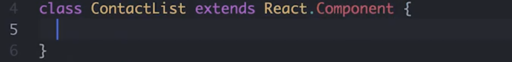

**此类中，实际需要的唯一方法叫做 render**，render 的工作是**返回 JSX 或该组件渲染的元素**。

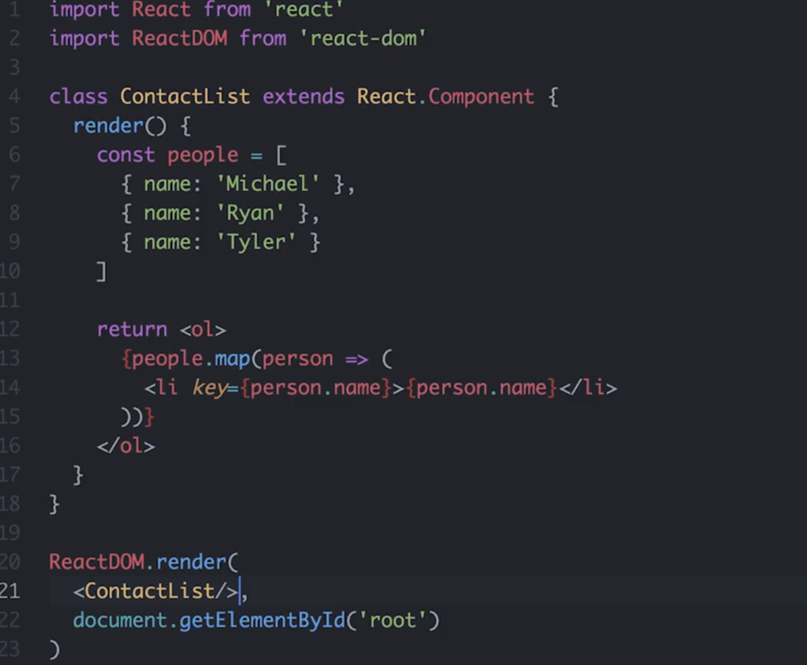

当我们渲染 ContactList 时，我们将渲染这整个 ol 以及其中的所有列表项，然后**我们要渲染的不是这个元素，而是 ContactList 元素**。而通过**将所有这些元素组合到单个组件中**，我们可以将它们**视为单个元素来进行渲染**。

---

> #### 💡 在 React 中声明组件 💡
>
> 在上个视频中，我们按以下方式定义了 `ContactList` 组件：
>
> ```react
> class ContactList extends React.Component {
> // ...
> }
> ```
>
> 换句话说，我们定义了一个其实是 JavaScript 类并且继承自 `React.Component`的组件。
>
> 在实际使用中（以及这门课程中），你可能还会看到下面的声明：
>
> ```react
> class ContactList extends Component {
> // ...
> }
> ```
>
> **两种方法的功能是一样的**，但是确保你的模块导入部分能匹配！即，**如果你选择像第二个示例那样声明组件，则 `React` 导入应该如下所示：**
>
> ```react
> import React, { Component } from 'react';
> ```

### 创建元素总结

最后，记住 **React 仅关心应用的 View 层级。这是用户能看见和互动的层级**。因此，我们可以使用 `.createElement()` 向文档中渲染 HTML。但是更多时候，你将使用语法扩展来描述 UI 的外观应该如何。这种语法扩展称之为 JSX，看起来和编写在 JavaScript 文件中的普通 HTML 很像。JSX 编译为调用 React 的 `.createElement()` 方法，并输出要在浏览器中渲染的 HTML。

在构建 React 应用时一个便利的思维方式是[React理念](https://facebook.github.io/react/docs/thinking-in-react.html)|([翻译链接](https://doc.react-china.org/docs/thinking-in-react.html))。组件代表的是 React 的模块性和可重复利用性。可以将组件类看做生成组件实例的工厂。**这些组件类应该遵守[单一功能原则](https://zh.wikipedia.org/wiki/%E5%8D%95%E4%B8%80%E5%8A%9F%E8%83%BD%E5%8E%9F%E5%88%99)，只做一件事。如果管理太多不同的任务，建议将组件拆分为更小的子组件。**

课外资料：

- [元素渲染](https://facebook.github.io/react/docs/rendering-elements.html)|([翻译文档](https://doc.react-china.org/docs/rendering-elements.html)) React 文档

  - > - 元素事实上只是构成组件的一个部分 
    > - React 元素都是[immutable 不可变](https://en.wikipedia.org/wiki/Immutable_object)的。当元素被创建之后，你是无法改变其内容或属性的。一个元素就好像是动画里的一帧，它代表应用界面在某一时间点的样子。 
    > - 根据我们现阶段了解的有关 React 知识，更新界面的唯一办法是创建一个新的元素，然后将它传入 `ReactDOM.render()` 方法。
    > - **React DOM 首先会比较元素内容先后的不同，而在渲染过程中只会更新改变了的部分。**
    >   - 即便我们每秒都创建了一个描述整个UI树的新元素，React DOM 也只会更新渲染文本节点中发生变化的内容。 
    > -  **根据我们以往的经验，将界面视为一个个特定时刻的固定内容（就像一帧一帧的动画），而不是随时处于变化之中（而不是处于变化中的一整段动画），将会有利于我们理清开发思路，减少各种bugs。** 

- [组件 & Props](https://doc.react-china.org/docs/components-and-props.html)

  - > - 组件可以将 UI 切分成一些独立的、可复用的部件，这样你就只需专注于构建每一个单独的部件。 
    > - 组件从概念上看就像是函数，它可以接收任意的输入值（称之为“props”），并返回一个需要在页面上展示的React元素。 
    > - 组件名称必须以大写字母开头。
    >   - 例如，`<div />` 表示一个DOM标签，但 `<Welcome />` 表示一个组件，并且在使用该组件时你必须定义或引入它。
    > - 组件可以在它的输出中引用其它组件，这就可以让我们用同一组件来抽象出任意层次的细节。在React应用中，按钮、表单、对话框、整个屏幕的内容等，这些通常都被表示为组件。 
    > - 通常，一个新的 React 应用程序的顶部是一个`App`组件。但是，如果要将 React 集成到现有应用程序中，则可以从下而上使用像`Button`这样的小组件作为开始，并逐渐运用到视图层的顶部。 
    > - 注意：组件的返回值只能有一个根元素。这也是我们要用一个`<div>`来包裹所有`<Welcome />`元素的原因。 
    > - 我们建议从组件自身的角度来命名props，而不是根据使用组件的上下文命名。 
    > - 提取组件一开始看起来像是一项单调乏味的工作，但是在大型应用中，构建可复用的组件完全是值得的。当你的UI中有一部分重复使用了好几次（比如，`Button`、`Panel`、`Avatar`），或者其自身就足够复杂（比如，`App`、`FeedStory`、`Comment`），类似这些都是抽象成一个可复用组件的绝佳选择，这也是一个比较好的做法。 
    > - 所有的 React 组件必须像纯函数那样使用它们的 props 。（也就是不允许在函数内部更改传入的参数）


## 2.3 创建 React 应用

在 JavaScript 代码中使用 JSX 可以使代码更容易阅读，但它需要一个**构建步骤**，这你之前可能没做过。

基本来说，**我们需要一个编译器来接受我们的 JSX 代码，并将其编译成我们可以在浏览器中实际运行的真实 JavaScript 代码。**

适用于 Web 项目的构建工具有多个，但在 React 社区最流行的一个工具叫做 webpack。

现在我们可以停下来，花些时间构建一个 webpack。幸运的是，Facebook 的开发者已经替我们做了，Facebook 开发的 Create React 应用设置了开发和构建使用 React 和 JSX 的应用所需的一切，我们就直接用它吧。


### 搭建 React 应用框架

JSX 很棒，但是它**需要反编译为普通的 JavaScript，然后才能提交给浏览器**。我们通常使用 [Babel](https://github.com/babel/babel) 等转译器来**为我们实现转译**。我们**可以通过构建工具运行 Babel**，例如 [Webpack](https://webpack.js.org/)，**它可以帮助我们打包 Web 项目的所有资源（JavaScript 文件、CSS、图片等）。**

为了简化这一初始配置过程，我们可以使用 Facebook 的 Create React App **包**来为我们实现所有设置！该工具非常实用，可以帮助我们开始构建 React 应用，因为它为我们设置了一切，我们无需进行任何配置！请 (通过 [npm](https://www.npmjs.com/get-npm)命令行）安装 Create React App，然后我们将讲解它的强大之处。

```
npm install -g create-react-app
```

当你试图安装一个全局的 package 但是出现报错时，可以查看一下 [这篇文章](https://docs.npmjs.com/getting-started/fixing-npm-permissions)。注意，想要找出这些全局软件包安装在哪儿，可以在终端运行`npm list -g` 查看（更多信息[这里](https://stackoverflow.com/questions/5926672/where-does-npm-install-packages)）。

---

好的，我们来安装 Create React App 并用它来创建第一个 React 应用。

我们使用 npm install -g create-react-app。

npm install 命令从 npm **抓取** create-react-app 包，-g 标志确保它在全局安装，以便我们的终端可以使用 create-react-app 命令。

我们说 create-react-app 并创建一个名为 contacts 的应用，以显示我们到目前为止一直在编写的 JSX。

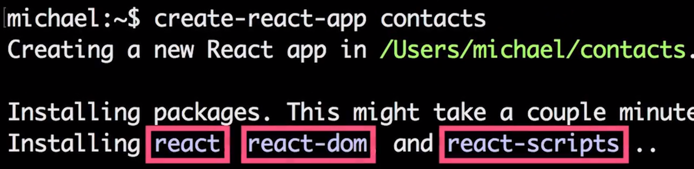

现在 create-react-app 安装 react 和 react-dom 我们已见过它们了，以及这个 react-scripts 包。

React-scripts 可以给我们很多奇妙的东西

- 它安装了 Babel 使我们可以使用最新的 JavaScript 语法以及 JSX
- 它安装了 webpack 以使我们进行生产和构建
- 以及 webpack-dev-server 它给了我们目前为止看到的自动重新加载行为。

如果所有这些让你有点不安，我完全明白，（不好意思，我反而很兴奋）你的确需要在计算机上安装很多东西。

在过去几年中 Web 开发的最先进技术以前所未有的速度取得了进步，我们所提到的 React 和其他工具在这方面起了很大的作用，但是不要担心你需要安装的所有东西。**与所有抽象一样，你可以一层层将它剥开**，如果需要可以在稍后返回其中所有不同的部分。

现在 create-react-app 是快速入门最新技术的一个好方法，你无需花费很多时间去学习它们，便可以开始构建第一个 React 应用了。

[这是本视频中所做更改的 commit。](https://github.com/udacity/reactnd-contacts-complete/commit/86824dc9f726e68a516f8cf85243b013a3b5c8b7) 

---

##### 确保我们保持同一进度。

Task List

- 我已经安装 [`create-react-app`](https://github.com/facebookincubator/create-react-app)
- 我已经使用 `create-react-app` 创建 `contacts` 项目

> ### Yarn Package Manager
>
> 在下面的视频和 create-react-app 输出中，我们都需要使用 `yarn start` 来启动开发服务器。如果你从未听说过 [Yarn](https://yarnpkg.com/)，它就是一个类似于 NPM 的软件包管理器。Yarn 完全由 Facebook 创建而成，旨在改善 NPM 比较缓慢或缺少的关键部分。
>
> 如果你不想安装 Yarn，也没问题！它的强大之处在于每个 `yarn` 使用情况都可以替换为 `npm`，一切还是正常运行！因此，如果命令是 `yarn start`，你可以使用 `npm start` 来运行同一命令。

---

好的，看起来我们的应用创建成功了，这里有一堆说明，告诉我们如何运行和构建它。

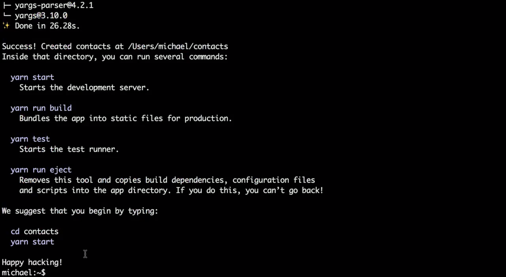

我喜欢 create-react-app 提供的详细信息。仓库、注释和各种不同的文件里都有非常详尽的说明，我鼓励你到处看看。现在，我们将按照这里的说明启动开发服务器。

进入联系人目录并输入 yarn start 命令。现在当我们运行 yarn start，create-react-app 将自动打开浏览器窗口，而应用就在浏览器中运行起来了，非常酷。

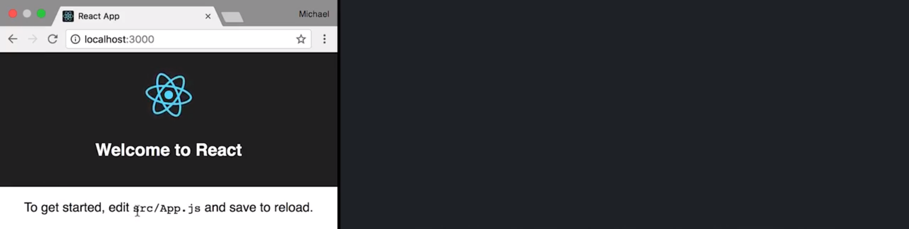

它说“要启动应用，请编辑 src/App.js 保存以重新加载”，那么在编辑器中，我们打开 src/App.js 便可以看到代码在浏览器中运行。

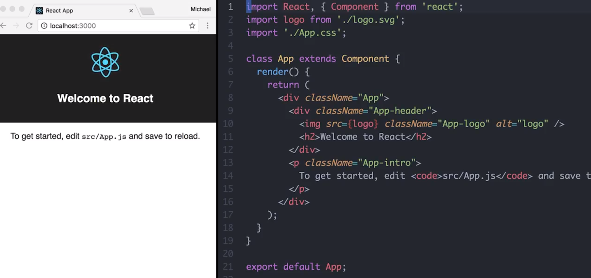

这个代码应该看起来比较眼熟，有些东西我们前面已经操作过了，可以看到此应用在渲染一个包含另一个 div 和一个段落标签的 div，第一个子 div 在 h2 标签中包含一个图像，但是**记住这些都不是字符串**，我们从前面的工作已经知道这些元素中的每一个都是通过一个叫做 createElement 的函数创建而来的，而 JSX 只是能帮助我们更简洁地表达创建过程的语法。

create-react-app 比较棒的一点在于它会自动提供我们之前看到的自动重新加载行为，比如我们可以编辑 h2，说 Hello World 并保存，那么我们的浏览器会自动刷新并显示这些更改：

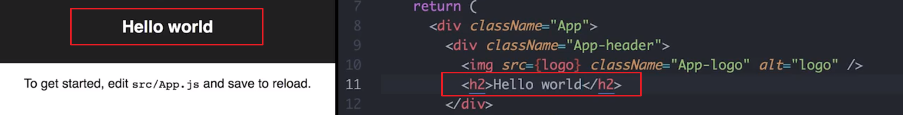

我们在此文件中**看不到的一点是对 ReactDom 的引用或者此应用是如何进入页面的**。如果我们在这里打开文件浏览器，可以看到 App.js  位于源目录中，我们知道我们就在此文件内，但是应用如何实际地进入页面呢？

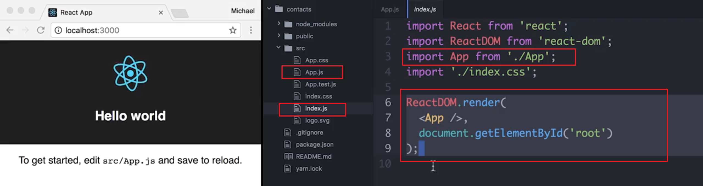

为了找到答案，打开 src 下的 index.js，这个调用看起来应该很熟悉吧。index.js 从应用文件导入应用并将应用渲染到已经存在于文档中的根元素。同样，你可能会想“那根元素从何而来？”

对此，你打开 public 下的 index.html 在这里，你可以看到运行此 JavaScript 的 HTML 文档，而我们的 div 在这里，也就是根元素：

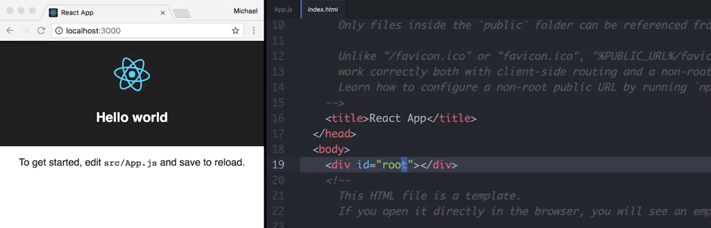

当我们运行构建时，webpack 将生成一个包含我们所有 JavaScript 的包，并在这个 div 之后的页面中放置一个脚本标签。

这就是它的来龙去脉。

如果你想了解更多关于 create-react-app 工作原理的更多信息，我强烈建议你阅读 README 文档，其中包含如何使用此应用和如何修改它满足你的需求的说明与指南。

> 观察力强的学员可能注意到了，我的 `index.js` 文件不包含你的项目中出现的 `registerServiceWorker();`这一行。在我录完此视频之后，Create React App 的新版本添加了对 Service Worker 的调用。因为我们在此项目中不使用 Service Workers，因此没有任何影响。但是如果你想删掉，也可以！ 

### `create-react-app` 总结

Facebook 的 `create-react-app` 是一个可以帮助构建 React 应用的命令行工具。借助该工具，就无需配置 Webpack 等**模块打包工具**，或者 Babel 等**转译器**。它们使用 `create-react-app` 进行预配置（并且隐藏起来），使你能够立即构建应用！

请点击以下链接，详细了解 `create-react-app`：

- GitHub 上的 [create-react-app](https://github.com/facebookincubator/create-react-app)
- [create-react-app 发行帖子](https://facebook.github.io/react/blog/2016/07/22/create-apps-with-no-configuration.html) React 博客
- [create-react-app 的更新](https://facebook.github.io/react/blog/2017/05/18/whats-new-in-create-react-app.html) React 博客

## 2.4 使用组件进行组合

早前我说过**组件是 React 的基础材料**，我这么说是什么意思呢？

如果你看看 API 和 React 的文档，会发现它们都较小，并没有一大堆方法，**React 的绝大多数 API 都是关于组件的**，所以说它们确实非常重要。它们是 React 给我们的**主要封装单元**。

组件的作用很大，因为**它们可以帮助我们将 UI 分解成小块，这些小块都有明确的责任和清楚定义的界面**。在构建大型应用时，这真的非常非常的重要，它可以让我们在应用的小块上工作，而不会不经意地影响其他块。

关于组件的另一个优点在于它们让我们使用**组合**而不是**继承**来构建应用程序。

来看看我说的组合是什么意思。

---

我们来谈谈使用组合来构建用户界面的**意义**以及 React **如何**让我们做到这一点的。

所以，我从原始的 create-react-app 应用开始，我要先删掉一些我们不需要的东西，然后粘贴我们目前为止一直在使用的 ContactList 组件。

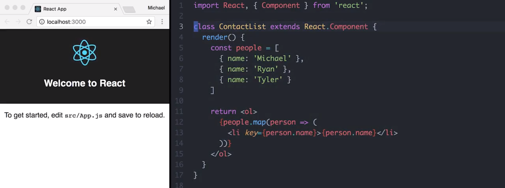

我们目前为止一直在使用的 ContactList 组件，接着我们不再渲染应用中所有的原始内容，而是渲染 ContactList  组件：

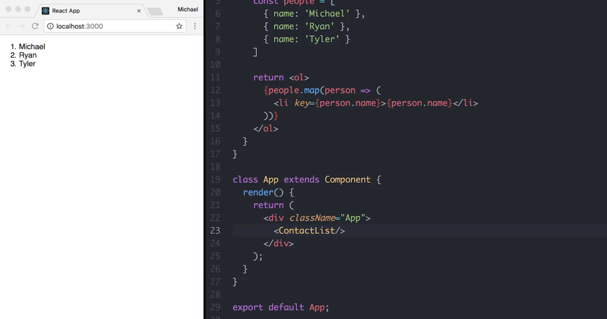

我们已经看到，创建自己的自定义元素是多么容易，就像我们之前讨论的那样。将它们组合在一起，我们可以提取 ContactList 并将它放入该应用中的任意一个正确位置。

在组件中封装多种元素给我们带来了一些好处。其中之一，就是复用这些元素真的非常方便，比如我想要 ContactList 的多个副本，我只需复制粘贴这行三次就能得到这些元素的三个相同副本：


这些组件的另一个非常好的特性在于，它们**具有明确的接口**，所以我**可以通过给它们不同的 props 来配置不同的组件**。

以我们的 ContactList 为例。假如说在第一个 ContactList 中，我想显示 Michael、Ryan 和 Tyler 然后在第二 ContactList 中，我想显示一组完全不同的联系人。在这个例子中，我希望可以单独的配置这些 ContactList 组件。如果 ContactList 有一个 prop 属性接口就好了，这样我就可以，通过向里面传递数据的方法实现这一点，而不是在 ContactList 的 render 方法中硬编码数据。

比如说 ContactList 具有一个联系人属性 contacts 然后在这个属性内我们可以传递一个联系人数组。同理，我们可以将完全不同的数组传递给第二个 ContactList 并且单独的配置它们：


我们在上面这里抓取 ContactList，我们不再采用硬编码，而是从“this.props.contacts”获取联系人列表：

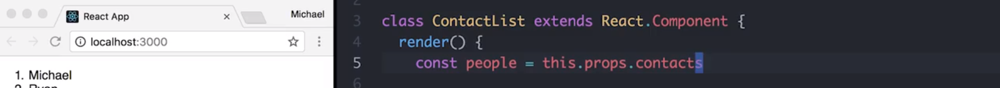

> 之前是有一个固定的 数组作为 people，现在为调用 render 时的组件 props 对象的 contacts 属性值。

可以看到每个组件会获得一个叫做“this.props”的对象，**“this.props”的属性就是我们传入组件的属性**。所以我们将联系人列表粘贴到下面，同样，在这个 ContactList 中，我们拥有一组完全不同的联系人： 

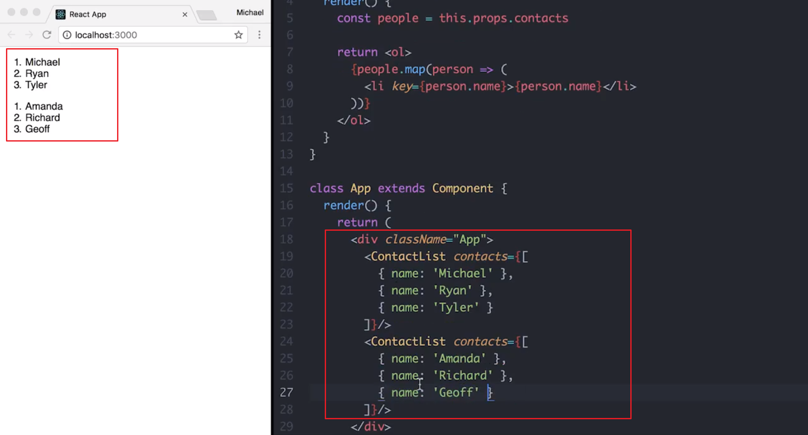

可以在这里看到，我们可以重用 ContactList 中的元素，但是完全单独地配置它们。这使得重用这些组件变得非常容易，只需通过 props 传入一些配置就可以了。

所以这两个原则：

- 能够**将大量元素封装在一个组件中**，并轻松地**重用**它们。
- 能够**通过 props 配置不同的且相互独立的组件**。

这些是理解 React 组合模型的两个非常重要和基础的关键。

[这是本视频中所做更改的 commit。](https://github.com/udacity/reactnd-contacts-complete/commit/069bbfa3f5359849d334a0f58813220291e61dc0)

### 优先使用组合而不是继承

你可能听过“**优先使用组合而不是继承**”这一说法。我认为**对于现今的编程语言，这种规则很难理解**。很多**最流行的编程语言经常使用继承，并出现在热门的 UI 框架中，例如 Android 和 iOS SDK**。

相反，**React 使用组合来构建用户界面**。没错，**我们会扩展 React.Component，但是不会扩展超过一次**。我们**使用嵌套和 props 以不同的方式组合元素**，而**不是扩展基本组件来添加更多 UI 或行为**。你最终希望你的 UI 组件是**独立、聚焦和*可重复利用的***。

因此，如果你始终没有明白“优先使用组合而不是继承”的含义，那么强烈建议你学习使用 React！


## 2.5 UI 渲染结尾部分

我们在本课中讨论的原则是从基础触发充分利用 React，你会一次又一次地使用它们。

总的来说：

- 我们了解了 JSX 如何让我们通过创建元素描绘 UI（用户界面）而不是通过编写死板的字符串模板来描绘。
- 我们还了解了如何在 React 组件中封装这些元素以及如何通过将它们组合在一起来构建更大的 UI 部分。
- 我们还安装了 create-react-app 并使用它快速开始用于创建现代 React 应用的所有最新的令人兴奋的技术，这些应用都具有自动重新加载和其他非常酷的功能。 

React 的封装和代码重用故事将在下一课中更加有趣，到时我们将讨论这些**小部件如何保持自己的状态**。


