# 2. Redux 的核心

> 你将了解 Redux 的三个核心元素：action、reducer 和 store。并利用三者之间的互动性构建一个课程项目。

[TOC]

---

## 2.1  简介

在上节课中，你已经大致了解了 Redux 的概况。在这节课中，我们将学习 Redux 的基础知识，包括 action、action creator、reducer 和 store。

---

在开始之前，我们需要聊一些东西。

当你学一些新东西时，你要从头开始。但从头开始在 Redux 这里有点问题，Redux 的主要元素包括：

- actions
- reducers
- store

问题是这些都是相互关联的，所以你需要同时学习这三个。

- action 由 store 分派（dispatch）
- 要创建 store 你需要 reducer
- 而 reducer 使用 action

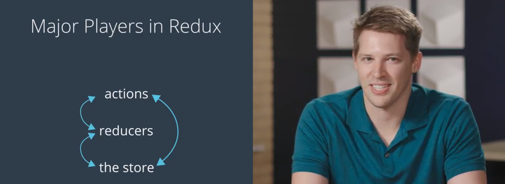

由于它们是相互关联的，使得 Redux 的教学和学习都有点挑战性。如果你从一开始就觉得有点摸不着头脑，完全情有可原。

我建议你先学完此课程，最后再回头看那些当时觉得含糊不清或困惑的地方，你可能要费些功夫，但我知道你一定行的。

---

**Redux 难学的原因在于，为了构建任何有价值的功能，你需要同时了解所有这些部分是怎样配合的。**所以，请尽你最大的努力，去理解每一部分在整个 Redux 生态系统中的作用，这样当你需要将它们组合到一起的时候，你将会更加游刃有余。

---

我在前面的课程中提到，Redux 共有三个主要部分：action、reducer  和 store，而且你也看到这三个概念是相互关联的。我们来分解这些联系。

首先是其中的老大 store，它保存着应用的状态，但 store 要获取状态，就得使用 reducer，要使状态进行变更，store 要分派一个 action，此 action 会传递给 reducer 然后由 reducer 更新 store 的状态。所以可以看出，它们都是密切联系的。

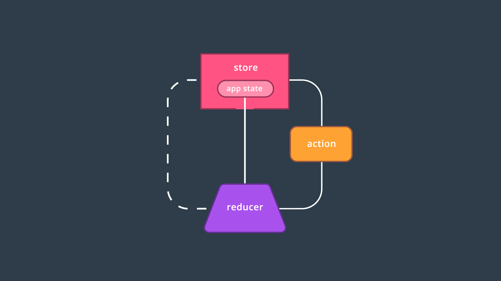

我们会不时向你展示此图，但是在学习任意一个时，比如 action 始终记得它在 Redux 应用的整体情境中的位置。

---

[*所有 Redux 元素都相互关联，而 store 是其最核心的元素。*](https://classroom.udacity.com/nanodegrees/nd019-cn/parts/cb5f29f8-f80b-4524-b29b-5f3dcfe7527e/modules/c278315d-f6bd-4108-a4a6-139991a50314/lessons/782f801d-3bd8-4b2b-b788-608b0fbe1306/concepts/4a4ff2dc-0639-4e6a-9b1a-a4e0a072c03e#)

这是我们刚刚看过的图表。可以看出，Redux 有三大主要部分：

- action
- reducer
- store

应用的大部分数据或状态都储存在 store 中。store 的数据由 reducer 填充（**可以有多个 reducer**，但是我们在上图中只显示了一个）。action 由 store “派遣”，reducer 通过 action 判断应该输出什么数据。需要声明的是，**Redux 应用中可以有（并且将会有）多个 action。**

[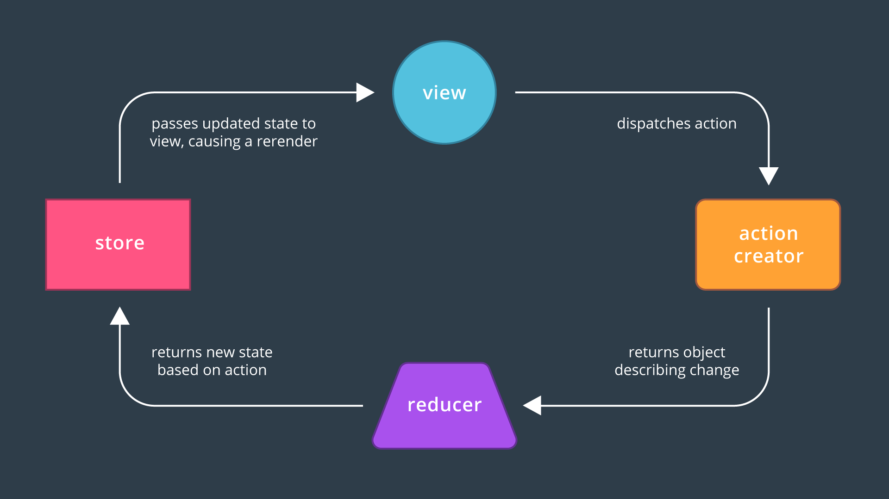*Redux 应用中的数据流动。store 向其 reducer 派遣一个 action。reducer 使用该 action 处理当前的状态，返回应用的新状态。*](https://classroom.udacity.com/nanodegrees/nd019-cn/parts/cb5f29f8-f80b-4524-b29b-5f3dcfe7527e/modules/c278315d-f6bd-4108-a4a6-139991a50314/lessons/782f801d-3bd8-4b2b-b788-608b0fbe1306/concepts/4a4ff2dc-0639-4e6a-9b1a-a4e0a072c03e#)

和 React 一样，Redux 采用的是单向数据流。这意味着数据在应用中始终朝着一个方向流动。

### 总结

Redux 的整个目标是让应用中的状态更易管理。通常，你会结合使用 Redux 和 React。但是，它们并非必须一起使用。Redux 可以用于任何需要管理状态的应用。

Redux 的核心概念是 **action**、**reducer** 和 **store**。store 是应用状态的单一数据源。reducer 规定 store 的形式（结构）并更新 store，action 是信息载荷，告诉 reducer 应用中发生了哪种类型的事件。


---

## 2.2 创建 Action

我们要看的 redux 拼图的第一块是 action，如果你用过 Web 不管时间长短，你就会知道原生 DOM 事件，比如像点击事件。

Redux action 类似于自定义事件，就像不同类型的本地事件一样。比如，点击、双击、按键、鼠标进入等等。我们可以创建 redux action 来表示应用中发生的不同类型的事件或 action，了解了 redux action 与本地事件的相似性后，我们来看看如何创建 action。

---

就像浏览器允许你设置事件监听器并对特定事件作出响应，Redux 也可以做到，但这里的事件叫做 action。这些 action 是你设置的信息载荷，**用于描述应用中应该更新应用状态的任何事件**。 

---

在 Redux 中创建 action 是非常简单的，它只是一个 JavaScript 对象。表明一个对象为 Redux action 的一点是，它必须有一个 type 属性，这个值完全取决于你并描述发生了什么，并且它所有字母都大写：


像此 action 表示发生了 EDIT_USER 事件。

那么就像**原生事件包括有关事件本身的详情**，Redux action **也可以包含数据**，通过在 action 中添加 id 我们包含了应编辑哪位用户：


这就是在 Redux 中创建 action 所需的全部操作。

---

Action 是 JavaScript 对象，**用于描述需要更新应用状态的任何事件**。这些对象必须具有 `type` 属性，以便区分发生的特定 action 类型。

```react
const LOAD_PROFILE = 'LOAD_PROFILE';

const myAction = {
  type: LOAD_PROFILE
};
```

当 type 所描述的行为发生时，任何与该行为相关的数据都可以作为 action 的属性被传入 action 内（换句话说，是普通的 JavaScript 对象）。

> #### 💡 Action 建议 💡
>
> 在构建 action 对象时需要注意以下几点：
>
> - 最好将 `type` 属性的值设为常量，而不是字符串。二者都可行，**但是使用常量的话，如果出现任何拼写错误（例如 `LAOD_PROFILE` 与 `LOAD_PROFILE`），控制台将显示错误，而不是毫无提示地运行失败。**
> - **使载荷数据尽量很小。让你的资源仅发送必要的数据！**

#### 习题 1/2

以下关于 Redux action 的描述哪些正确？请选中所有适用项：

- Action 只是普通的 JavaScript 对象 :star:
  - Action 是一种具有 `type` 属性的 JavaScript 对象，并且可能具有包含新信息的载荷属性。 
- Action 必须包含载荷数据 
- Action 必须包含 `type` 属性 :star:
- Action 本身会直接写入 store 中的状态
- Action 可以是数组，只要包含载荷即可


### Action Creators

Redux action 是 JavaScript 对象，用于描述应该更新应用状态的任何事件。但是，**普通对象不易移植。为了使 action 更易移植并更容易测试，它们通常封装在函数里**。这些函数称为 **action creator**。**术语“action creator”很好理解，因为它就是一个创建和返回 action 的函数。**

```react
const submitUser = user => ({
  type: SUBMIT_USER,
  user
});
```

现在，只要我们需要 `SUBMIT_USER` action，就可以调用 `submitUser()` 函数，向其传入 user，它将生成该 action！

```react
/* Create An Action Creator
 *
 * You need to create an action creator called 'mealCreator' that should:
 *   - Accept an id
 *   - Return a Redux action with a 'type' property that has a value of 'CREATE_MEAL'
 *   - Include the id passed to the action creator
*/

const CREATE_MEAL = 'CREATE_MEAL'
const mealCreator = id => ({
    type: CREATE_MEAL,
    id
})
```

### 开始构建项目

我们开始构建课程项目 Udacimeals 吧！该应用将提供一个可定制的日历，让用户跟踪他们整个星期的早餐、午餐和晚餐。用户将利用 [Edamam's Recipe Search API](https://developer.edamam.com/edamam-recipe-api) 的菜谱搜索 API，然后根据所选生成一份配料购物清单。

我们将编写 action 来表示以下两种应用状态更改方式：

1. **添加新的食谱**
2. **从日历中删除某种食物**。

我们将使用 [Create React App](https://github.com/facebookincubator/create-react-app) 脚手架。确保安装该工具，然后创建新的应用。你可以重新阅读之前的《React 基础知识》课程，复习下所学的知识。

[此处是项目脚手架的 commit](https://github.com/udacity/reactnd-udacimeals-complete/commit/6c458c57016e56c8e5f29c20a84dd705ea632cc8).

让我们确保有相同的进度！请确认以下内容：

- 我已经安装 [`create-react-app`](https://github.com/facebookincubator/create-react-app)
- 我已经使用 `create-react-app` 创建了 `Udacimeals` 项目
- 我已经在 `src` 文件夹下创建了 `actions`, `components` 和 `utils` 文件夹
- 我已将 `App.js` 放进了 `components` 文件夹 (并且解决了 import 路径问题)
- 我已经在 `utils` 文件夹下创建了 `api.js` 和 `helper.js` 文件 ([这是 commit](https://github.com/udacity/reactnd-udacimeals-complete/tree/6c458c57016e56c8e5f29c20a84dd705ea632cc8/src/utils))

---

还记得吗，在最终项目中，有两种方式可以更改 Redux store 的状态。

- 第一种是添加一个新食谱
- 第二种是从日历中删除一个食物项

意思是我们将在应用中有两个不同的 action（动作），接下来我们可以在 actions 文件夹下创建一个 index.js 的文件。

因为有两个不同的 action，这意味着我们需要创建两个不同的常量。第一个称为 ADD_RECIPE、第二个称为 REMOVE_FROM_CALENDAR：

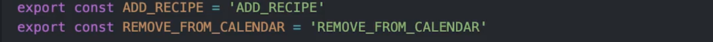

**我们创建这些常量的原因是可以将它们专门专递给 reducer 函数，这样我们就不必在所有地方进行字符串比较了**。（`？为什么`）

现在，我们需要来创建实际的创建器了，我们将导出第一个叫做 addRecipe，它将接受一个具有三种不同属性的对象：星期几（day）、食谱（recipe）、餐型（meal），然后它将返回一个 action 或者只是一个对象：

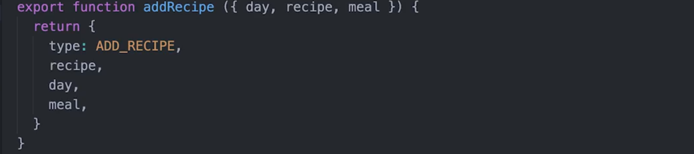

我们的第二个动作创建器叫做 removeFromCalendar，它将接受一个具有星期几和餐型属性的对象，然后返回一个带有 type 和其他传入参数的对象：

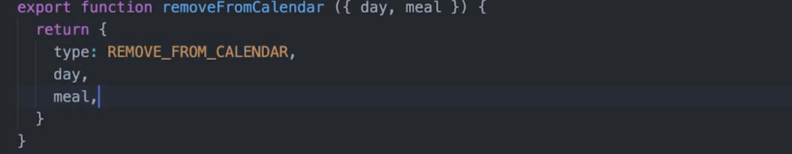

[这是本视频中所做更改的 commit。](https://github.com/udacity/reactnd-udacimeals-complete/commit/53bebcf6ce77202e1dd83ec255a70f5da8e73239)

---

### 总结

在此部分，我们学习了 **action** 和 **action creator**。

Redux 中的 Action 是 JavaScript 对象，你可以用来描述应用中应该更新应用状态的任何事件。

```react
const LOAD_PROFILE = 'LOAD_PROFILE';

const loadProfileAction = {
  type: LOAD_PROFILE
};
```

**普通对象不易移植，为了使 action 更易移植并更容易测试，它们通常封装在叫做“action creator”的函数里。这些 action 并不修改状态本身；它们只是指出发生了一些事件，应该更新状态。务必使 action 保持专一性，不能出现副作用。**

```react
const loadProfile = user => ({
  type: LOAD_PROFILE,
  user
});
```

现在的问题是：接下来该做什么？现在我们只介绍了创建对象 (action) 并在函数 (action creator) 中封装这些对象。我们依然需要回答两个问题。首先，Redux 如何知道调用这些 action creator 应该修改应用的状态？其次，我们如何根据这些 action 指定应用的状态应该如何改变？这两个问题就引出了 Redux 中的 `reducer`。

---

## 2.3 创建 Reducers

是时候看看 Redux 拼图的第二块了：reducer

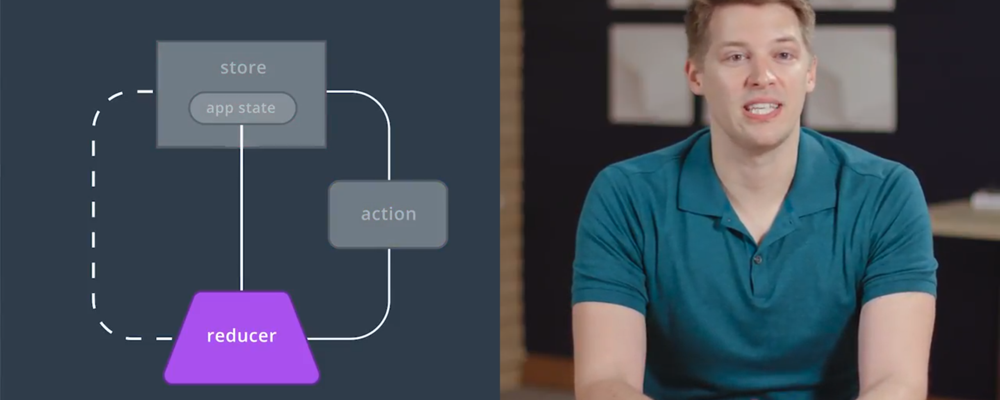

**reducer 负责创建应用程序的初始状态，之后该状态会保存在 store 中**，但是它的原理是什么？

类似于 Redux action 只是一个 JavaScript 对象，reducer 只是一个函数。

reducer 接受两个参数：

- 第一个是当前状态（state），reducer 总是要返回一个状态（`return state`）
- 第二个参数是分派的 action，此 action 用于决定要对状态做出何种变更，现在，这里不应用说“变更（change）”，**你永远不能修改状态，相反你要复制现在的状态，修改副本，然后返回更新后的副本。**

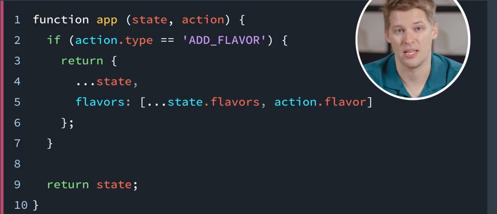

> 需要特别注意 `...state` 和 `...state.flavors` 的使用：
>
> - 这里的 `state` 应该是一个是对象，对象使用展开操作符一样可以在对象中展开，并且如果后面有相同的属性名称，然后会覆盖掉之前的，比如这里，如果展开的 ...state 中有 `flavors`，则会被后来的这个 `flavors` 属性覆盖。
> - `...state` 对象依次展开，将其属性放入这个新的对象中。
> - `...state.flavors` 是先调用 `state.flavors` 这个属性，返回一个数组，然后再展开，这样就会有一个新的 `flavors` 数组。

---

**action 描述的是应用中发生了某种 action 这一事实，但它们并不关心实际状态应该如何因此而变化**。这一点由 reducer 负责。**reducer 接收当前状态和被派遣的 action，然后根据所收到的 action 决定如何将当前状态转换为全新的状态**。

reducer 如何根据所收到的 action 知道怎样修改应用的状态？我们来看一个示例，了解其中的奥秘。

reducer 就是一个函数，接收当前状态和从 action creator 那返回的具体的 action 为参数：

```react
function reducer (state, action) {
   // ...
}
```

reducer 只是一个传入两个参数的函数。接着，在 reducer 中创建一个 switch 语句（或者 if/else 语句），以匹配该 action 的“type”属性，然后根据需要修改状态。

```react
function reducer (state, action) {
  switch (action.type) {
    case 'SUBMIT_USER' :
      return Object.assign({}, state, {
        user: action.user
      })
  }
}

// 另外一种写法
function reducer (state, action) {
  switch (action.type) {
    case 'SUBMIT_USER' :
      return {
        ...state,
        user: action.user
      }
      })
  }
}
```

> Object.assign是ES6新添加的接口，主要的用途是用来合并多个 JavaScript 的对象。
>
> Object.assign()接口可以接收多个参数，第一个参数是目标对象，后面的都是源对象，assign方法将多个原对象的属性和方法都合并到了目标对象上面，如果在这个过程中出现同名的属性（方法），后合并的属性（方法）会覆盖之前的同名属性（方法）。
>
> [浅谈Object.assign](https://blog.csdn.net/qs8lk88/article/details/79018481)

在上述示例中，每当 `submitUser` action creator 被调用并传入一个 reducer，我们的 `switch` 语句就匹配 `'SUBMIT_USER'` case。然后创建新的状态并向该新状态添加（或进行修改）`user` 属性，新状态的值是我们一开始传递给 `submitUser` action creator 的 user。

reducer 的行为存在一些规则。最重要的规则是 reducer 应该为纯函数。

### Reducer 是纯函数

> 纯函数：
>
> 1. 针对相同的参数返回同一个结果
> 2. 完全取决于传入的参数
> 3. 不产生副作用
>
> 请参阅“第 1 节课：为何要使用 Redux？”中的纯函数概念

Reducer 的作用只是接受当前状态和一个 action , 并返回新的状态。如果你在 reducer 中执行了其他操作，可能就出错了。reducer 不应该：

- 更改其参数
- 具有副作用（异步请求、更改作用域变量等）
- 使用其他非纯函数

换句话说，reducer 必须是纯函数！

#### 习题 1/3

选择所有正确的描述：

- Reducer 可以发出异步调用
- Reducer 应该始终返回状态 :star:
  - Reducer 必须始终返回状态。并且，因为 Reducer 是纯函数，所以它们不能使用 `Date.now()` 等非纯函数。 
- Reducer 应该始终改变现有的状态
- Reducer 绝不能使用 Date.now() :star:


参阅这个 reducer 并回答下列问题。

```react
function reducer(state = {}, action) {
    switch(action.type){
        case "ADD_ITEM":
            return action.item;
        case "EMPTY_CART":
            return {};
        case "UPDATE_ITEMS":
            state.items = action.items;
            return state;
        default:
            return state;
    }
}
```

#### 习题 2/3

上面的 reducer 代码中存在什么问题？请选中所有适用项：

- 没有返回默认状态
- switch 语句检查的是错误的表达式
- switch 语句格式错误
- 它改变了之前的状态 :star:
  - 很棒！是的，在 `UPDATE_ITEMS` case 中，现有状态被修改并返回，而不是返回新的状态。Reducers **绝不能**修改状态。但可以通过原来的状态来返回新的状态
- 没有考虑到所有 action 类型


现在该你自己创建 reducer 了！

```javascript
/* Create A Reducer
 *
 * You need to create a reducer called "appReducer" that accepts two arguments:
 * - First, an array containing information about ice cream 
 * - Second, an object with a 'DELETE_FLAVOR' `type` key
 * (i.e., the object contains information to delete the flavor from the state)
 *
 * The action your reducer will receive will look like this:
 * { type: 'DELETE_FLAVOR', flavor: 'Vanilla' }
 *
 * And the initial state will look something like this (as such, refrain 
 * from passing in default values for any parameters!):
 * [{ flavor: 'Chocolate', count: 36 }, { flavor: 'Vanilla', count: 210 }];
*/


const state = [
        {flavor:'Chocolate', count: 36},
        {flavor:'Vanilla', count: 210}
    ]
    
function appReducer(state, action){
    switch(action.type){
        case 'DELETE_FLAVOR':
            return state.filter(obj => obj.flavor !== action.flavor)
        default:
            return state;
    }
}

let result = appReducer(state,{
        type: 'DELETE_FLAVOR',
        flavor: 'Vanilla'
    })

console.log(result)
```

#### 练习答案：创建 Reducer

要快速了解我们是如何通过上述练习的，请查看下面这个视频！

---

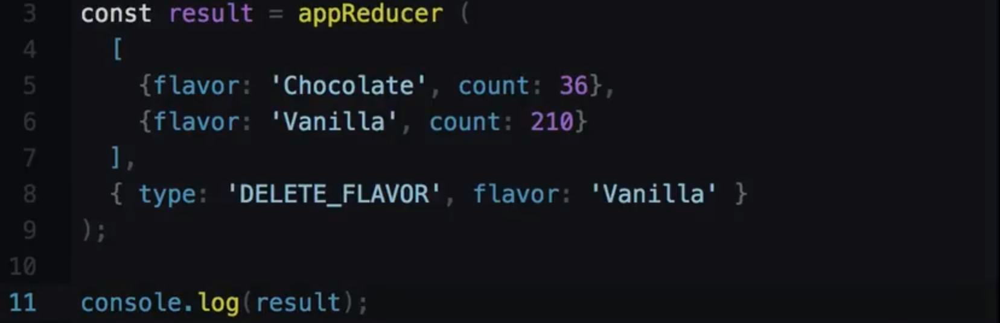

那么，我们要在此视频中做的是构建一个 AppReducer，它接收两个参数，第一个是由这里的单个口味对象，组成的数组表示的状态，可以看到一个是巧克力味，第二个是香草味。然后此 appReducer 接收的第二个参数是 action，它的 action 只是一个普通的 JavaScript 对象，具有一个 type 键，即这里的 DELETE_FLAVOR 和一个可选负载香草味，表示我们想做的更改。换句话说，从这个巧克力和香草的初始状态中删除香草。

首先，我想做的是构建 reducer，接收两个参数，state 和 action：

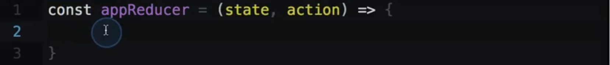

关于 action 我们知道什么呢？

我们知道 action 有一个对象所需的特定 type 键和一个可选负载，在这个例子中是香草味。那么对于 action 类型，我们可以做的是检查该 action 类型并根据该类型运行某种代码。那么在这个例子中，我们可以编写一个 switch 语句来检查 action.type，在检查特定类型之前，我们对 reducer 的了解是 reducer 需要返回状态，所以为了防止此 reducer 收到任何无关的 action，我们实际上可以返回默认状态（`default: return state`），那么我们在这里进行设置：

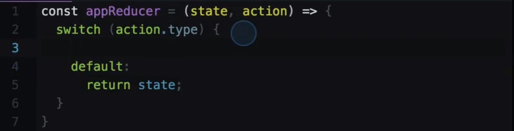

我们要检查的 action 类型是 DELETE_FLAVOR，这会从状态中删除 Vanilla，那么我们检查一下，将 DELETE_FLAVOR 作为一个字符串传入，那么我先把整个表达式写出来，然后再讲解它的作用：

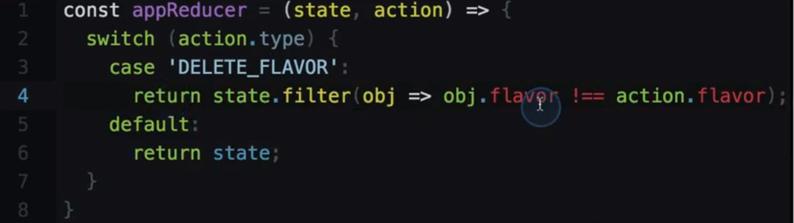

所以这段代码的作用是过滤我们状态中对象口味不等于传入 action 的口味的特定部分（当然是将不等于的过滤到新的数组中）。换句话说，如果我要过滤表示状态的数组对象，巧克力将被保留，因为它的口味不等于 action.flavor，即香草味。但是当我们到达数组中的香草味对象，香草味将被过滤掉，因为它等于传入的对象 action 的口味，即香草味。

我们在终端中运行看一下：

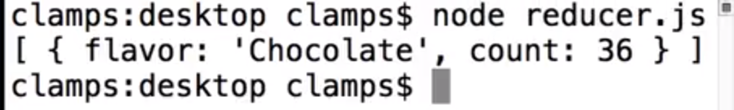

> 注意，最后有执行 `console.log(result)`，所以才会在终端中显示过滤之后的数组。

现在看到，当我们将这两个参数传入我们的 appReducer 函数中时，我们有初始状态巧克力味和香草味，然后我们将它传入具有 type 键 DELETE_FLAVOR 的对象。它的功能是从状态中过滤出香草味，然后 appReducer 返回的是仅包含可用口味的新状态，那就是巧克力，就这样的啦。

---

Reducer 返回的是应用程序的状态或结构化数据，但是此数据的形状应该是怎么样的呢？你是否应该有一个对象数组，还是包含一切数据的单个对象？

具体的形状将取决于你的应用的功能，无论你的状态形状最终是什么样的，这是你在开始编写 reducer 之前就应该决定的事情。**你需要花时间思考你的应用如何使用该数据以及哪种格式（形式，数组或对象还有其他）最适合**。只有在知道状态形状之后，你才能构建 reducer 让它以正确的格式返回数据。

---

### Reducer 和状态

Redux 中的 reducer 指定了应用的状态，并根据特定的 action 判断如何更改状态。

使用 ES6 的默认参数特征指定 Reducer 的初始状态。

```react
function myReducer (state = initialState, action) {
   // ...
}
```

reducer 所返回的将是应用的新状态，因此你需要确保始终返回新状态或上一个状态。

```react
function myReducer (state = initialState, action) {
  if ( /* ... */ ) {
    return {
      ...state,
      name: 'Tyler'
    };
  }

  return state;
}
```

你决定如何**更改状态的方式基于派遣的 action 类型**。

```react
function myReducer (state = initialState, action) {
  if (action.type === CHANGE_NAME) {
    return {
      ...state,
      name: 'Tyler'
    };
  }

  return state;
}
```

---

现在我们有两个 action，我们需要构建 reducer 来指定我们的状态如何根据这些 action 而改变。

首先，我们创建一个新的文件夹，并将其称为 reducers，再在这个文件夹中创建一个新文件，称之为 index.js。我想要做的第一件事是导入我们在 `action.js` 文件中创建的两个常量：

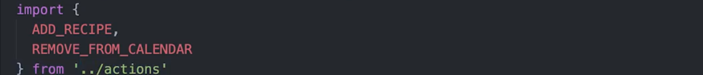

现在，正如我们前面所说的，reducer 将制定我们 store 的结构。我们要做的是将初始状态粘贴到这里：

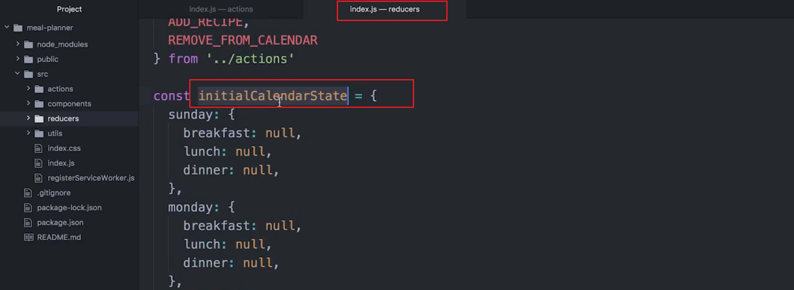

> 在文件标签栏上的 `index.js - reducers` 表示在 `reducers` 文件夹下的 `index.js` 文件

你会注意到我们有不同的星期，从星期天到星期六，每天都有三餐：早、中和晚餐。

第一次调用 reducer 时，当前的状态值为 undefined，那么我们将初始状态设为这里的这个对象，称之为 calendar，它将接受当前状态（state）和 action，像刚才我所提到的，如果状态未定义，我们就将它设为这里定义的初始日历状态，接着我们要设置 action 的一些属性，包括 day、recipe 和 meal，再次强调，这些是 action 的属性：

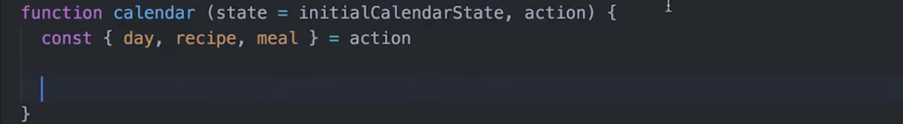

接下来我们要做的是指定我们的状态如何根据这些 action 而改变，我们从此函数返回的状态将作为 store 的新状态，那么我们可以在此添加一个 switch 语句，根据 action.type 进行转换，如果类型为 ADD_RECIPE，那么我们想做的是返回一些东西，另一个情况下是 REMOVE_FROM_CALENDAR 我们也会返回一些东西，如果这两种情况都未满足，那么我们要做的是作为默认状态，直接返回 state：

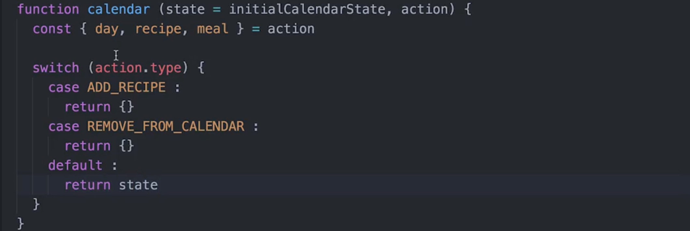

那么现在我们来构建当分派 ADD_RECIPE action 时，我们 store 的状态如何变化，我们想做的是使用对象扩展语法返回与之前相同的状态，但我们想做的是修改具体的星期天数。例如，如果某个 action 分派的日期为星期六，我们只想修改星期六，事实上，我们只想修改星期六和特定的餐饮（meal），那么我们要在这里做的是使用相同的逻辑，此特定天的状态将保持不变，但现在餐饮要变成 `recipe.label`，这只是特定食谱的名称。所以，每当分派 ADD_RECIPE action 时，我们的状态根据 action 发生的变化就是这样的：

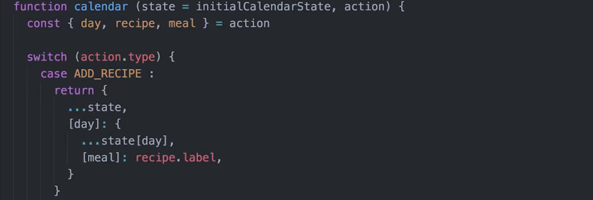

> 这里为什么需要加中括号呢？
>
> 因为如果是直接使用 day，则为返回的这个对象的属性名，使用中括弧表示里面的 day 为变量，则属性名为变量所指向的值。

REMOVE_FROM_CALENDAR 也是类似，所有的状态将保持不变，特定天除外。该天的所有其他餐饮也保持不变，只是特定餐饮将为 `null`，我们要做的最后一件事是导出日历 reducer 以及将他导入另一个不同的文件中：

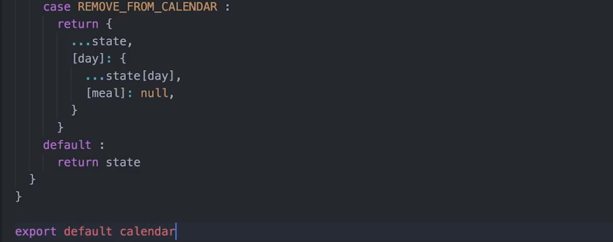


[这是本视频中所做更改的 commit。](https://github.com/udacity/reactnd-udacimeals-complete/commit/9303a724d8fe4388b7c9c2bdbeec8dd9339ad9c1)

---

> #### 💡 数据标准化 💡
>
> 当你的数据需要在多处使用时，该如何设定数据的格式？首先，你要确保数据已**标准化**。暂时不用太担心。我们将在之后的课程中讲解数据标准化！

### UI 状态

能够构建结构良好的 React/Redux 应用的基本元素是了解何时将状态存储在 Redux 中，何时将状态存储在 React 组件中。对此并没有硬性规定，甚至 React 社区都无法达成一致，因此一切都只是我的观点。

当我判断状态应该存储在何处时，**首先我会问自己“有两个组件依赖于这一状态吗？”如果答案是肯定的，则几乎始终需要让 Redux 管理该状态。原因是如果该状态存储在 Redux 中，无论两个组件之间有何关系，每个组件都能访问所需的状态。**

**我会问自己的第二个问题是“该状态的缓存看起来怎样？”如果获取该数据的操作代价很高，则有必要将其放在 Redux 中，这样每次组件装载时，都不需要重新获取该数据。对于任何其他情形，只需遵守你所习惯的组件状态规则即可。**

### 总结

**Reducer** 只是函数；它们接收当前状态和 action 对象，必须是纯函数，并且应该始终返回新状态或上一状态。

```react
function myReducer (state = initialState, action) {
  if (action.type === CHANGE_NAME) {
    return {
      ...state,
      name: 'Tyler'
    };
  }

  return state;
}
```

如果**两个组件依赖于同一状态或获取该状态的操作代价很高，则将状态存储在 Redux 中**。

---

## 2.4 创建 Redux Store

我们学习了 Redux 的两大支柱：action 和 reducer，现在是时候认识一下主角了：store

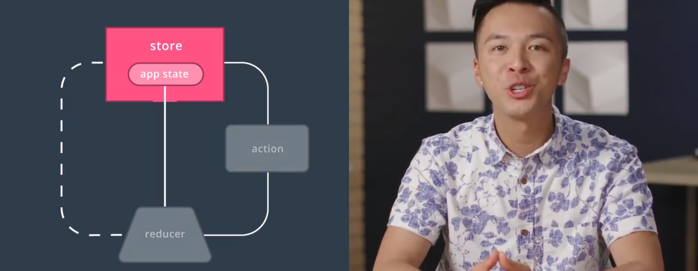

store 掌控着很多东西：

- 它保存着应用的状态
- 还负责分派 action
- 以及当 action 被分派后，调用 reducer 函数
- 它还负责接收并存储新状态

要创建 store，Redux 自带了一个名称贴切的方法：`createStore()`，`createStore()` 需要将 reducer 作为参数传入，会返回一个新的 store 对象：

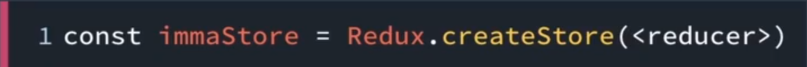

store 上只有几个方法，包括：

- `getState()`，它会返回 store 的当前状态
- `dispatch()`，它接收 action 对象并将它传递给 reducer 函数
- `subscribe()`，它接收 Listener 函数，在状态发生变更时调用

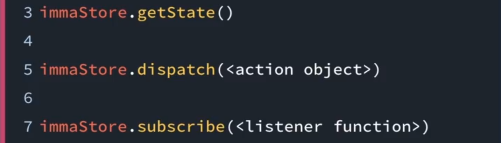

尽管 store 掌管着一切，但它并不是很复杂。

---

为了创建 store，需要将 reducer 函数当做第一个参数传递给 Redux 的 `createStore()` 方法。`createStore()` 所返回的就是 store 本身。该 store 具有三个属性：

- `getState()`
- `dispatch()`
- `subscribe()`

#### `.getState()`

`store.getState()` 不需要任何参数，并且将返回 store 的当前状态。

#### `.dispatch()`

`store.dispatch(action)` 传入 action 对象，并且将调用 reducer 函数，向其传递当前状态和所派遣的 action。例如：

```react
// store.js

import { createStore } from 'redux';
import reducer from '../reducers/reducer';

let store = createStore(reducer);

const receiveComment = comment => ({
  type: 'RECEIVE_COMMENT',
  comment
});

export default store;
```

```react
store.getState(); // []
store.dispatch(receiveComment('Redux is great!'));
store.getState(); // ['Redux is great!']
```

#### `.subscribe()`

`store.subscribe(cb)` 传入监听器回调函数，每当状态改变时，就会调用该函数。

---

现在我们有了 actions 和 reducer，接下来我们需要创建 store 了。

你可能注意到了，目前为止，我们还未对 Redux 包进行任何具体操作。事实上，我们甚至还没安装它，那么我们先安装 Redux，完成后，重启你的开发服务器：

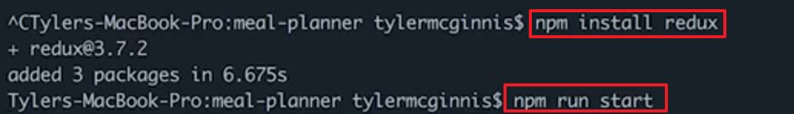

然后在你的 index.js 文件中，我们要做的是导入两个不同的东西，我们导入 createStore，它来自我们刚安装的 Redux 包，我们还将导入 reducer，它来自我们之前创建的 reducer 文件：

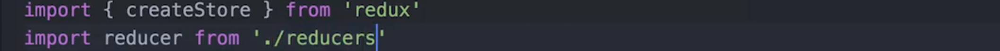

接下来要创建 store，你需要创建一个名为 store 的变量，我们定义它的值等于调用 createStore 的结果，它也一样来自 Redux，然后我们想向 createStore 传递我们创建的 reducer，那么现在我们创建好了 store：


接下来我们看看它上面的属性，那么我们直接对 store 使用 console.log 方法，打开控制台，你会注意到这个对象上有几个属性：

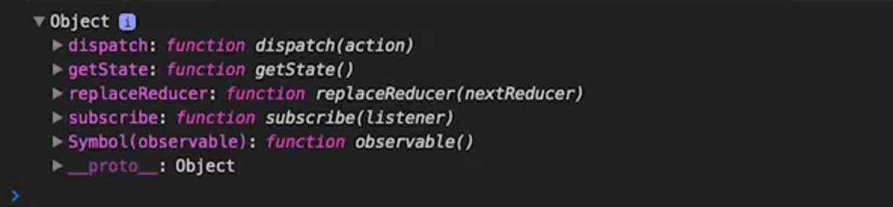

主要包括 dispatch，它是用来分派具体动作的，接下来 getState，它将返回 Redux store 的当前状态，以及 subscribe，它可以让你侦听 store 中的变更。

看个例子，我们不对 store 进行日志记录，而是调用 getState：


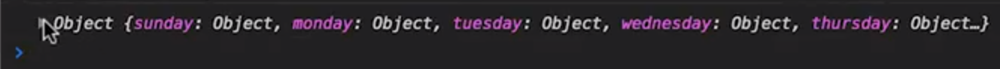

现在你会注意到，我们 store 的当前状态是这里的这个对象，这和我们在 reducer 文件中设置的初始日历状态完全相同。


[这是本视频中所做更改的 commit。](https://github.com/udacity/reactnd-udacimeals-complete/commit/e326c9569d89abc53da12ecd06f62f2c0c7a9389)

---

#### 你的应用现在进展如何？

Task List

- 我已经安装了`redux`并重启了我的开发服务器
- 我已经将我的 reducer 和 `createStore()`导入到`index.js`中
- 我已经将我的 reducer 传递给`createStore()`，将返回值存储在`store` 变量中

### Redux 开发者工具

Redux 开发者工具为 Redux 开发流程带来了很多便利。它使你能够查看 store 的当前状态，并根据所派遣的 action 判断该状态如何改变。请访问 [Redux 开发者工具扩展程序页面](https://chrome.google.com/webstore/detail/redux-devtools/lmhkpmbekcpmknklioeibfkpmmfibljd?hl=en)，将其添加到浏览器中。

---

在继续之前，我想做的是使 redux 应用与 redux 开发工具兼容，这样，我们便能很容易地看到我们向应用程序分派了哪些 action，我们的状态根据这些 action 发生了哪些变化，等等。

那么我们要做的是在这里的 index.js 文件中（src 下的），我们向 createStore 不只是传递 reducer，而是将它传递给 reducer，然后传递这行内容作为其第二个参数：

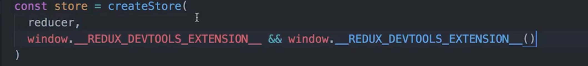

那么我们的目的是，我们说如果 REDUX_DEVTOOLS_EXTENSION 存在于 window 对象，则直接调用它，它的作用是使我们可以使用 redux 开发工具：

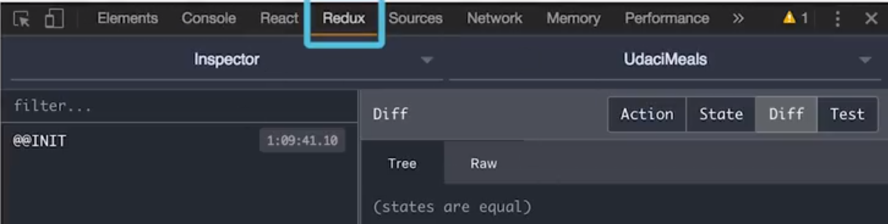

现在你注意到我们的 Redux 开发工具可以用了，我们有不同的选项卡，可以看到发出的任何操作（action），store 的当前状态，还有这个 diff 选项卡，它会告诉我们之前状态和新状态之间的差别。


[这是本视频中所做更改的 commit。](https://github.com/udacity/reactnd-udacimeals-complete/commit/6b56069be8e155955947e6de7e0c1ba826ad4628)

---

#### 习题 1/2

请将以下 store 方法与相应的角色相匹配： 

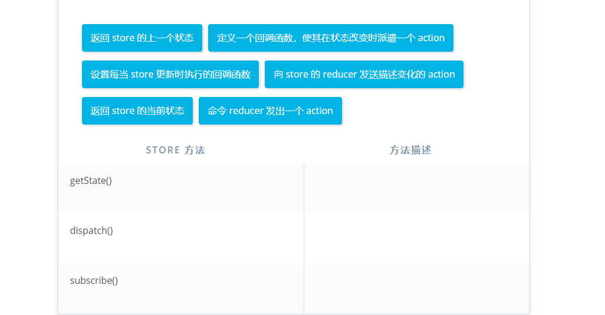

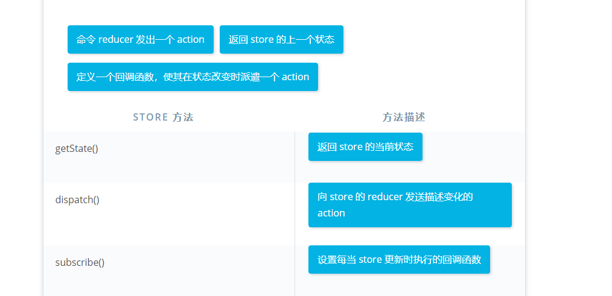


#### 习题 2/2

关于 Redux 的 store, 以下哪些说法是正确的？ 请选择所有适用项。

- **只有通过派遣才可以触发对 store 的更新** :star:
- `createStore()` 函数是从 React 中导入的
- store 的 subscribe() 函数帮助 React 组件 与 store 相关联 :star:
- 在 Redux 应用程序中，所有状态都需要专门保存在 store 中

提交

### 总结

Redux 具有一个叫做 `.createStore()` 的方法。该方法将 reducer 函数作为其第一个参数，并返回一个其上具有以下方法的 store 对象：

- `.getState()`
- `.dispatch()`
- `.subscribe()`

---

## 2.5 全组合到一起！

我们终于深入了解了构成 Redux 应用程序的各个部分，但是像我们一开始所说的，Redux 有点复杂，因为**要实际构建任何东西，你要同时让所有的部分一起工作**。那么现在，我们要通过单独构建每个部分，然后将他们全部结合起来的方式构建一个 Redux 应用。

---

[这是一些 React 代码](https://github.com/udacity/reactnd-udacimeals-complete/blob/d0d4b8ade3dea46b7a3250ea196e0f862a399672/src/components/App.js) 我们将在接下来的视频中粘贴进去，这样你就不用花时间看着我们全部输入。 我们还会在我们的`App`组件中进行渲染。

---

现在我们有了 actions、reducer 和 store，我们将它们连接到 React 应用，看看它们如何协同工作。那么，让我们从编辑 index.js 文件开始。

我们将 store 传递给应用组件，现在应用将接受 store 作为 props：

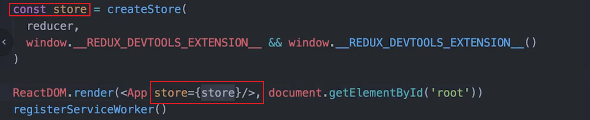

接着，我们在 App 组件这里，这个组件将渲染这个 UI（代码直接是粘贴的），它的作用是添加一个输入框，用来输入星期一的早餐，我们在这里输入的任何东西，最终都将保存为星期一的早餐；接着我们将有一个 submitFood 方法，然后在下面显示星期一的早餐，它将位于我们的组件状态上：

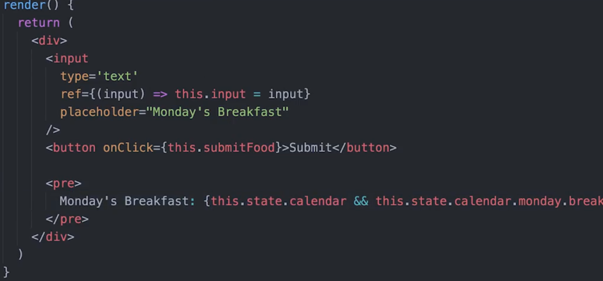

> 注意这里使用了回调 refs，第一个参数 input 代表这个 DOM ，也可用于组件：
>
>  `ref={ (input) => this.input = input }`

接着我们要做的第一件事是在组件内添加一个 state 属性，设置日历的值等于 null：

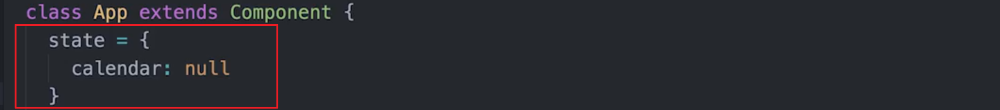

然后在组件被调用时，也就是当 componentDidMount 声明周期方法被调用时，我们想做的是从 props 获取 store，然后我们想订阅 Redux sotre 中发生的任何变化，然后在发生任何变化时，我们想做的是调用 setState，跟平常一样，我们继续从 store 中获取 state 将它放入本地组件 state 中，这将导致组件重新渲染，然后它会在下面这里（render() 中）渲染星期一的早餐：那么当 store 发生变化时，我们想让日历等于 store.getState 返回给我们的东西，它将是我们 store 的当前状态：

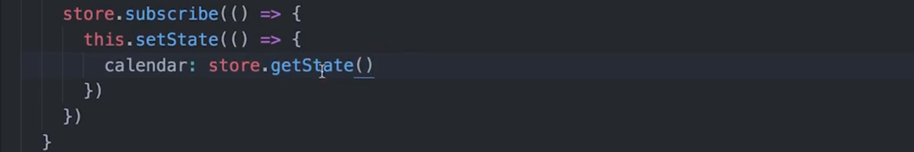

现在我们要做的是创建 submitFood 方法。接下来要发生是每当此函数被调用时，我们要做的是调用 store.dispatch 然后调用我们的 addRecipe actionCreator，在用之前记得导入它。它将来自我们的 actions 文件，你应该记得我们的 addRecipe actionCreator 需要一个具有三样东西的对象，日期（day）、食谱（recipe）和餐型（meal），那么在 App.js 中，我们可以调用 addRecipe，我们说日期为星期一，我们暂时硬编码它，餐型为早餐，食谱将是带有一个标签的对象。因为在 reducers 文件中，我们说 meal 等于 recipe.label，所以标签将是我们在输入控件中键入的内容，它等于 this.input.value：

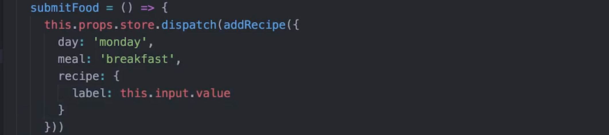

完成后，我们想做的是将输入值重置为一个空字符串：

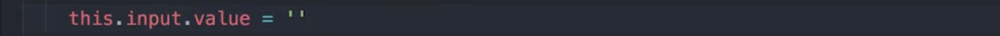

现在前往我们的应用，你会注意到我们输入控件：

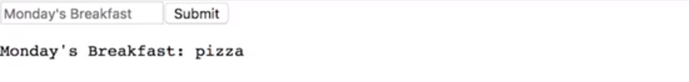

然后我们的 Redux 开发工具是打开的，那么我要做的是输入 pizza，这是不错的早餐选项，点击“提交”（submit）你会注意到如果我们位于“动作”（Actions）选项卡，这是我们分派的 action，我们发出了“ADD_RECIPE”的 action，我们传递这个食谱以及日期和餐型：

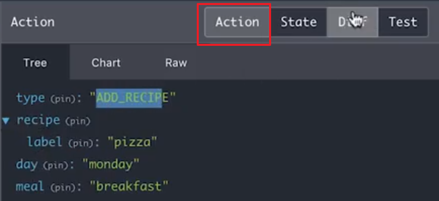

Diff 选项卡展示了我们的状态如何基于该 action 发生了变化：

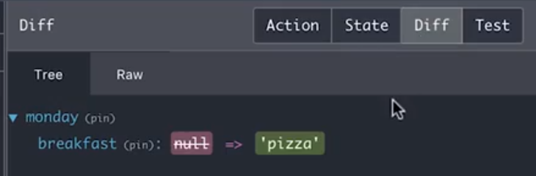

星期一下的早餐不再是 null 了，而是“pizza”。

那么我们再看看状态，发生的变化是星期一的早餐不再是 null 了，而是“pizza”：

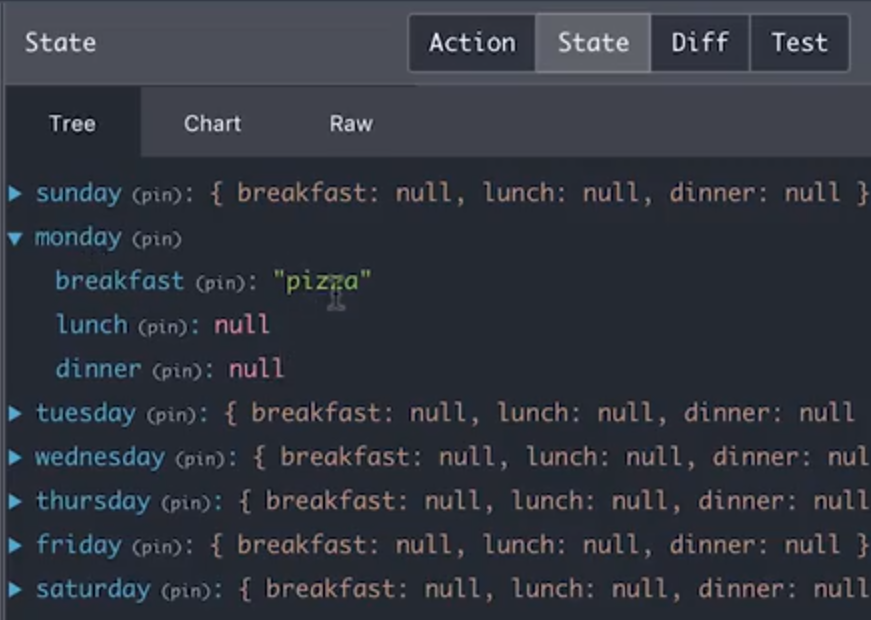

好的，现在我们已看了 Redux 运作的整个流程，这里发生的是我们订阅了 store，那么每当它发生变化时，我们就用当前状态更新组件状态：

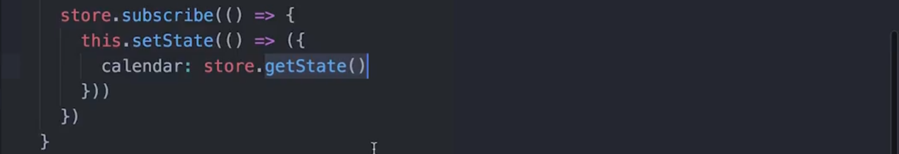

然后当 submitFood 方法被调用时，我们分派出一个 action，它将前往我们的 reducer 并更新 store：

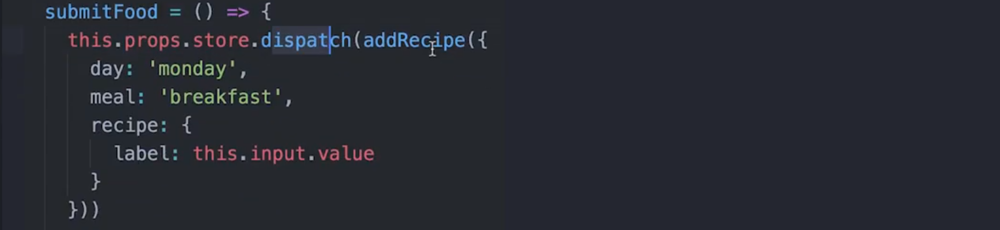

但是你会注意到这有点奇怪，让这么简单的一个应用运行竟需要这么多步骤，因为当你使用 Redux 构建 React 应用时，你并不使用 Redux 提供的这些低级别的方法（比如 subscribe()），我们只是向你展示一下它们怎么用。相反，有一个库叫做 React-Redux，它基本上是一个绑定库，会使所有这些步骤变得更容易。

> 这里我觉得编程有一个难点，就是数据的形式，到底应该使用数组还是对象还是其他的形式，我觉得这个当遇到的时候需要去认真思考一下。

[这是本视频中所做更改的 commit。](https://github.com/udacity/reactnd-udacimeals-complete/commit/d0d4b8ade3dea46b7a3250ea196e0f862a399672)

---

你在这一节课中学到了很多！ 现在来看看，你的应用进展如何？

Task List

- 我已经将 `store` 传递给了 ReactDOM 呈现的`App` 组件
- 我已经将 `addRecipe` 操作导入到 `App.js` 中
- 我已经创建了 `componentDidMount` 生命周期方法
- 我已经创建了 `submitFood` 方法
- 我在`App` 中添加了 `state` 属性
- 我渲染了受控组件 input
- 我已经导出了 `App` 组件

> #### 💡 `ref` 属性 💡
>
> 上个视频中的代码使用了 `ref` 属性。`ref` 属性是 React 提供的特殊属性，使你能够访问 DOM。要详细了解 `ref` 以及何时/如何使用它，请参阅 [Ref 和 DOM 文档](https://facebook.github.io/react/docs/refs-and-the-dom.html) | [翻译](https://doc.react-china.org/docs/refs-and-the-dom.html)。

#### 练习题

请将下列操作正确排序：

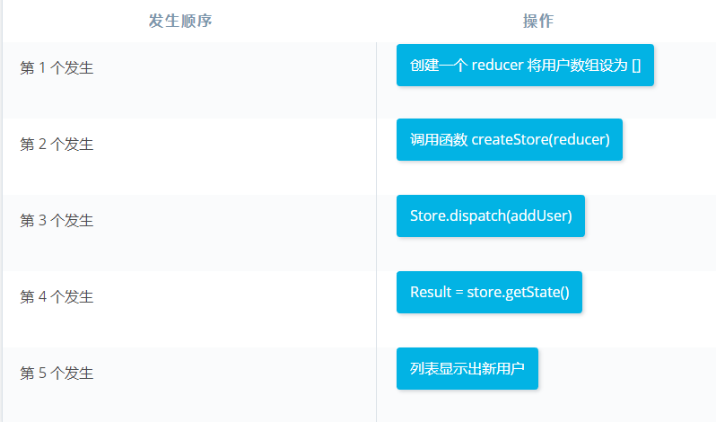

### 总结

`Action` 被派遣到 `store` 的 `reducer` 中，告诉它需要更新哪些信息。因为所有这三个元素都相互作用，帮助管理应用的状态，因此一开始单独学习它们可能有点难懂。如果需要的话，请复习前面的部分！

---

## 2.6 课程总结

你成功完成了此课程，恭喜你，现在你知道了所有 Redux 部分如何搭配协作，但是你注意到了吗？我们一直在讲 Redux，但还未在 React 应用中使用过 Redux 这将是下节课的内容。