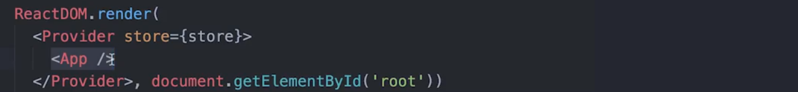
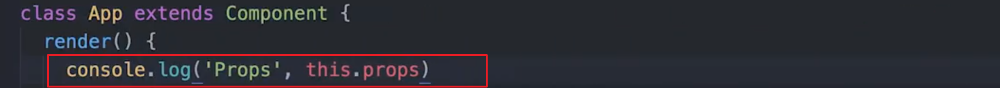
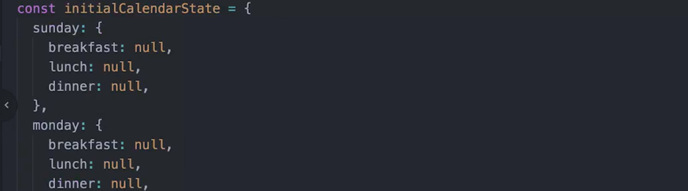
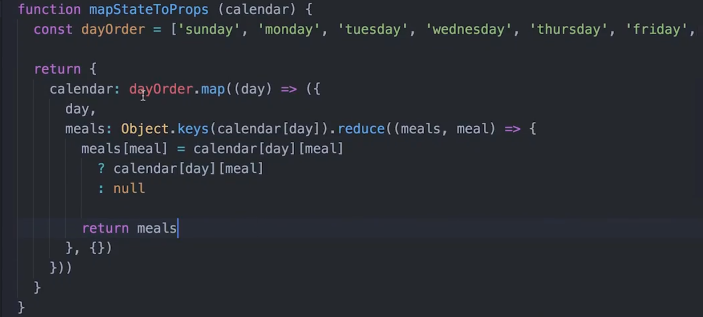
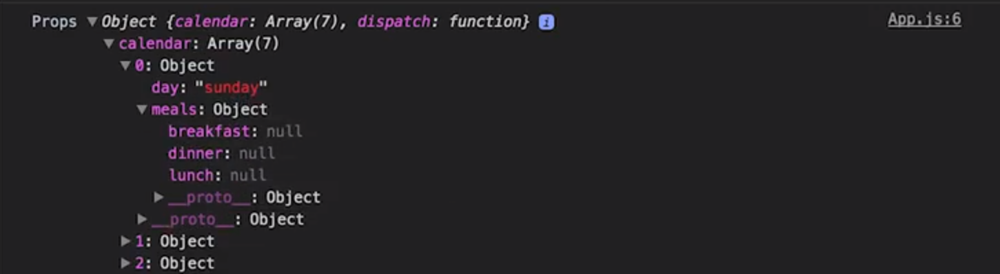
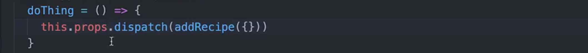
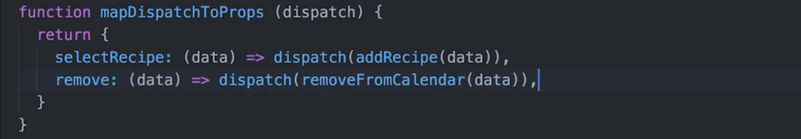
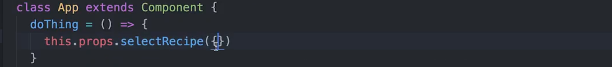
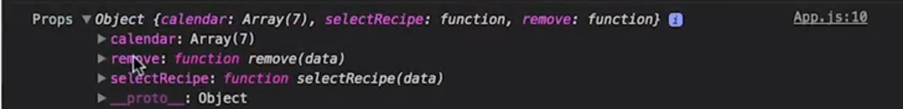

# 3. React 与 Redux

> 结合使用 Redux 和 React 来扩展应用的功能。并学习 react-redux 绑定，以及其他功能性 JavaScript 技巧。

[TOC]

---

## 3.1 简介

到目前为止，我们仅使用了纯 Redux。也就是说，直到现在一切都没有涉及框架或视图库。

概括来说，此前我们使用 `createStore()` 向其传递了 reducer 函数，创建了 store。然后我们学会了如何使用 `dispatch()`、`getState()` 和 `subscribe()` 将 Redux 关联到 React 应用。你可能注意到了：效果并不理想。我们最终将 store 向下传递到主组件，以便访问 `dispatch()`、`getState()`和 `subscribe()`。这种方法对小型应用来说是可行的，但无法扩展到更大规模的更多组件。

这并不表明 Redux 不高效；只是没有正确的抽象。到目前为止，我们学习的都是低级别的 Redux 方法，并尝试在 React 中使用这些方法。如果有更好的抽象呢，专门用于结合使用 Redux 和 React？好消息是，确实有这样的抽象，它被称为 `react-redux`，由 Redux 本身的发明者创建而成。

`react-redux` 的最大优势是可以从 React 组件内派遣 action 和访问 Redux store。借助 `react-redux` 的`Provider` 组件和 `connect()` 方法，所有这一切成为可能。

`connect()` 使你能够指定哪个组件应该从 store 中接收哪些数据，并且 `Provider` 使 `connect()` 能正常工作。我们深入了解下这两个概念。


---

## 3.2 Provider

还记得之前的这个嵌套组件结构吗？：


最底层的组件需要访问 store，但是如果我们只使用 React，嵌套组件中的父组件需要接收 store 属性来将它传递给子组件，这叫做 prop 线程（threading）：


这不仅非常累人，而且还容易引入一些错误。

好在 react-redux 包含一个叫做 Provider 的组件，我们可以通过它有效地将 store 深入传递到最底层的组件。整个过程无需任何 prop 线程。

Provider 将整个应用包裹起来，这样所有需要数据的子组件都要可以直接从 store 接收数据，我们来看看实际操作。

---

### 设置

在使用 **Provider** 之前，我们需要安装它：

```npm
npm install --save react-redux
```

> --save 可以将 react-redux 这个写入 package.json 文件中，这样当我们重新运行时，会自己安装这些包。（应该是这样。。不过现在已经不需要了，默认情况下就会有 --save）

对于通过 ReactDOM 渲染到 DOM 的组件，确保导入 **Provider**。注意：该组件的文件名称很灵活，但是你可能经常看到命名为 `app.js`、`root.js` 或 `index.js`（如下面的视频中）。

```react
import { Provider } from 'react-redux';
```

### 使用 Provider 组件

我们删除掉这些 vanilla Redux 的复杂部分，回到最初的 Hello World 组件。（将 App.js 还原）

现在，我们要做的是安装 react-redux，这将使 react 组件连接 redux store 变得非常容易。完成安装后，记得重启开发服务器。

现在你会注意到，像我之前提到的，我们要将 sotre 传给 App 组件，但这里的问题是，如果 APP 组件有很多子组件，且每个都需要 store 怎么办？无论它们是需要分派任何东西还是需要访问 redux store，问题是，每当这些子组件需要与 redux store 交互时，我们都需要将 store 向下传递给所有这些子组件，这会非常低效，而且对于开发人员来说也很无趣。

我们可以做的是，使用这个叫做 Provider 的组件，它来自于 react-redux 库，我们可以将主要根组件包含在 provider 内，然后不将 store 传递给 App 组件，我们想做的是将它传递给 Provider 组件，那么在将来，每当应用渲染的任何组件或应用本身需要访问 redux store 或分派 action 时，整个操作都会更加简便：




[这是本视频中所做更改的 commit。](https://github.com/udacity/reactnd-udacimeals-complete/commit/b8d39c14c22f7b9067a807a3a76ae133923b1669)

---

任务进度检查

Task List

- 我已经从 `App` 组件中删除了一些较低等级的方法
- 我已将 `react-redux` 中的 `Provider` 组件导入到 `index.js` 中
- 我已经将 `store`属性 传递到 `Provider`
- 我用 `Provider` 封装了 `App`

### 使用 Provider

Provider 的奥秘在于 React 的 [context](https://facebook.github.io/react/docs/context.html)|([翻译](https://doc.react-china.org/docs/context.html)) 功能。以下内容摘自 React 文档：

> “在某些情况下，当你在组件树中传递数据时，你希望不用手动地经过每个级别向下传递属性。你可以在 React 中使用强大的 'context' API 直接这么做"

Provider 使 `connect()` 成为可能的原因是，正如该文档所描述的，Provider 使我们能够“在组件树中传递数据时，不需要手动地经过每个级别向下传递数据”。

#### 练习题

关于 **Provider** 的描述，哪些正确？请选中所有适用项：

- 它向 store 提供 API 端点 
- 它将 store 全局地提供给所有子组件 :star:
  - Provider 只是一个 React 组件，用来封装整个应用。它接受 `store` 作为属性，然后设置 `store` `context`，将其向下传递给其所有子组件。Provider 封装的所有组件将接收该`store` `context`。 
- 它向 store 提供 action creator
- Provider 只是一个包裹应用的 React 组件 :star:
- 没有 Provider 的话，任何 React-Redux 应用都无法正常工作


### Provider 总结

Provider 使 Redux 能够将数据从 store 传递给需要该数据的任何 React 组件。它使用 React 的 [context](https://facebook.github.io/react/docs/context.html)|([翻译](https://doc.react-china.org/docs/context.html)) 功能来实现这一点。

但是，需要访问 store 的组件依然需要一种方式来与其连接。我们之前提到了 `connect()` 函数，该函数利用函数式编程中的一种技巧，叫做 **currying (柯里化)** 。在查看 `connect()` 的具体使用情况之前，我们仔细看看 **柯里化**的工作原理！

---

## 3.3 柯里化

我们先将 react 和 redux 的这些东西放在一边，来聊聊柯里化（Currying）

柯里化这个词是悦耳易记的，但意义却很模糊。柯里化也称为**偏函数应用**。通常，具有两个形参的函数在调用时需要传入两个实参：


但是当函数柯里化后，你不需要在调用函数时传入全部参数，（柯里化后的）函数会返回一个函数去接收剩余的参数：


柯里化是一种动态技术，它能够让你在之后的某个节点向函数提供一些数据直到函数所需的数据被完全提供，这是一种非常强大的技术，我们在之后会看到 Redux 是如何使用的。

---

下面是一个简单的 plate 函数，它具有两个参数：`vegetable` 和 `fruit`。

```react
function plate(vegetables, fruit) {
  return `I ate a plate of ${vegetables} and ${fruit}!`;
}

plate('corn', 'apples');
```

现在假设因为任何原因，我们想要将水果的上餐时间延迟到某个时间点。一种方式是返回一个函数，它接受的是可以稍后调用的水果。

```react
function plate(vegetables) {
  return function fruitFunc (fruit) {
    return `I ate a plate of ${vegetables} and ${fruit}!`;
  }
}

const fruitFunc = plate('corn');
```

现在我们可以调用 fruitFunc，向其传入 fruit，依然可以通过 closure 访问蔬菜 (corn)。

另一种没有延迟的编写方法是：

```react
function plate(vegetables) {
  return function fruitFunc (fruit) {
    return `I ate a plate of ${vegetables} and ${fruit}!`;
  }
}

const sentence = plate('corn')('apples');
```

你可能需要花点时间才能理解里面的双重调用，我们分步讲解下。当你调用 plate 函数时，它返回 fruitFunc，后者被调用并传递“apples”。这一技巧在函数式编程中会用到，叫做 **currying**（也称为偏函数应用）。

#### 习题 1/2

下面是一个局部应用函数：

```react
function iceCreamOrder(name) {
    return function flavorPicker (flavor) {
        return function scoops (numScoops) {
            return `${name} ordered ${numScoops} scoops of ${flavor} ice cream!`;
        };
    };
}
```

下面的哪个调用正确？

- iceCreamOrder('chocolate')(3)
- iceCreamOrder('Richard', 'Cookies & Cream', 2)
- iceCreamOrder('Richard')('Strawberry', 1)
- const func = iceCreamOrder('Richard')('Mint Chocolate Chip') 
  func(5)
  - `iceCreamOrder(''Richard'')(''Mint Chocolate Chip'')` 返回一个函数，然后调用它并传入参数 "5" 


> #### 💡 函数调用 💡
>
> 如果你不确定应该返回多少个函数，请看看有多少个函数调用！一般规则是返回的函数数量比调用的函数数量少一个。例如，如果看到 3 个函数调用，则需要返回 2 个函数。


### 柯里化总结

**柯里化** 是指向需要额外数据的函数提供部分输入的**流程**。Redux API 使用柯里化的部分是其 `connect()` 方法。我们来看看！

#### 深入研究

- [在函数式 JavaScript 中进行柯里化的初学者指南](https://www.sitepoint.com/currying-in-functional-javascript/)
- [通过柯里化 JavaScript 实现神奇的功能](http://blog.carbonfive.com/2015/01/14/gettin-freaky-functional-wcurried-javascript/)
- [在 JavaScript 中进行柯里化](http://kevvv.in/currying-in-javascript/)

---

## 3.4 Connect

Provider 组件为我们提供了一个非常方便的方式将 store 传递给所有子组件，但是，我们实际上仍需要一种方式来访问 store 的上下文。

React-Redux 库为我们提供了 `connect` 方法来实现这一点，这里也是你的技能和柯里化技术派上用场的时候，因为 **`connect` 会返回一个被柯里化的函数**。

**使用 connect 我们可以传入 store 状态的特定部分，并且可以将状态分发器（action dispatch）作为属性传入我们的组件，让我们来一探究竟。**


### 安装

你需要从 NPM 中安装 react-redux（如果尚未安装的话）。

```
npm install --save react-redux
```

安装后，就可以从 react-redux 软件包中获取 `connect()`：

```react
import { connect } from 'react-redux';
```

### 使用 Connect

`connect()` 是一种函数，使组件能够获取数据并从 Redux store 进行派遣。它的语法很有意思。充分使用的话，看起来如下所示：

```react
connect(mapStateToProps, mapDispatchToProps)(MyComponent)
```

**提醒下，`MyComponent` 是接收 store 数据和/或进行派遣的组件**。`mapStateToProps()` 是接收当前 store 和当前属性（props）的函数，返回的内容将作为属性传递给 MyComponent。`mapDispatchToProps()` 使你能够在派遣中封装 action creator。我们来仔细看看每个概念！

#### mapStateToProps()

`mapStateToProps()` 使你能够指定你希望将 store 中的哪些数据传递给 React 组件。 它需要一个 store 的状态，一个可选的 `ownprops` 参数，并返回一个对象。检查其完整语法：

```react
mapStateToProps(state, [ownProps])
```

正如 Redux 文档中所描述的：

> “如果指定了该参数，新组件将订阅 Redux store 更新。**这意味着任何时候 store 被更新了，mapStateToProps 将被调用**。mapStateToProps 的结果必须是纯对象，并与组件的属性合并。”

**这意味着 `mapStateToProps()` 返回的对象上的属性将当做 prop 传递给组件！**

```react
function User ({ name, age }) {}

function mapStateToProps (state, props) {
  return {
    name: state.user.name,
    age: state.user.age,
  }
}

connect(mapStateToProps)(User)
```

在上述示例中，`name` 和 `age` 都将作为 prop 供组件访问。

#### mapDispatchToProps()

当你连接组件时，该组件将自动被传入 Redux 的 `dispatch()` 方法。也就是说，如果你想派遣某个 action，可以在组件中按以下方式操作：

```react
import React, { Component } from 'react'
import { connect } from 'react-redux'
import { updateName } from './actions'

class User extends Component {
  state = { name: '' }
  handleUpdateUser = () => {
    this.props.dispatch(updateName(this.state.name))
  }
  render () {}
}

connect()(User)
```

`mapDispatchToProps()` 可以稍微清理上述代码。`mapDispatchToProps()` 的整个目标是在 action creator 接触组件之前，让你能够将 `dispatch()` 绑定到该 action creator。代码如下所示： 

```react
import React, { Component } from 'react'
import { connect } from 'react-redux'
import { updateName } from './actions'

class User extends Component {
  state = { name: '' }
  handleUpdateUser = () => {
    this.props.boundUpdateName(this.state.name)
  }
  render () {}
}

function mapDispatchToProps (dispatch) {
  return {
    boundUpdateName: (name) => dispatch(updateName(name))
  }
}

connect(null, mapDispatchToProps)(User)
```

**`mapDispatchToProps()` 完全是可选的，我并不觉得它会使一切更整洁，但是有必要了解下。**

---

现在，我们将 App 组件包裹在了 Provider 中并传入了 store，任何需要分派或需要从 store 获取状态的组件都可以使用 React Redux 的 connect 函数。我们来看看它是怎么样的。

在你的 App.js 文件内，我们从 react-redux 导入 connect：


现在我们要做的不只是导出 App，我们还要导出 connect 并注意我们将调用它，它将向我们返回一个全新的函数，我们可以将组件作为参数传入：


现在我在上面这里令控制台打印出 this.props，你会注意到我们有一个 dispatch：




如果你需要在一个组件内分派 action，你需要做的是连接该组件（使用 connect），然后你就能调用 dispatch 了，这样你就可以直接使用 `this.props.dispatch` 来进行派遣了。

但在我们的例子中，在这个视频中，我们不只是想分派 action，事实上，我们不想在此视频中这么做，我们想做的是将 App 组件连接到 Redux store 以获得我们 Redux store 中存在的日历状态。

这就要引入 mapStateToProps 的话题，我们要做的是创建一个叫做 mapStateToProps 的函数，**此函数要做的是将我们的 Redux 状态映射到组件 props**，那么此组件将接受我们的状态，叫做日历。现在，只要我们将 mapStateToProps 作为第一个参数传递给 connect，那么无论我们在该函数中返回什么，都会传递给我们的组件。

我们在这里定义 name 为 “Tyler”，现在我们用 console.log 方法打印 props，你会注意到我们不仅有 dispatch 而且还有 name：


显然我不想要名字，想要的是来自应用的日历状态，我不只是要传入日历状态，我想做的是稍微重新调整一下它的格式，因为你记得吗？它的格式现在是这样的：



我不想使用这个臃肿的对象，而是使用一个对象数组，而该对象将包含具体的一天和特定的餐饭。我们接下来要在此施展一些 JavaScript 魔法了。

我创建一个星期数组，它包含一周中的每一天，然后我要做的是返回一个具有 calendar 属性的对象，此 calendar 属性将等于调用 dayOrder.map 的结果，显然这将是一个数组，我们还要传递具体的星期几，我们在此返回一个对象，它具有我提到的 day 属性。现在，我想获得这一天的所有餐饭，那么我们调用 Object.keys，传入特定天的日历，它会向我们返回此对象的所有键，然后我们调用 .reduce，我们希望发生的是将所有这些归纳为单个对象。然后我们说 meals，它是这里这个我们在归纳过程中收集的对象，然后每一项将为 meal，我们定义 meals[meal] 将等于如果 `calendar[day][meal]` 为某个东西，它将等于此 `calendar[day][meal]`，如果不是，则等于 null ，那么我们就直接返回 meals：



> `Object.keys()` 方法会返回一个由一个给定对象的自身可枚举属性组成的数组，数组中属性名的排列顺序和使用 [`for...in`](https://developer.mozilla.org/zh-CN/docs/Web/JavaScript/Reference/Statements/for...in) 循环遍历该对象时返回的顺序一致 。 

> 这里返回的对象中 meals 的属性值不用这么麻烦，只需要直接返回 calendar[day] 就可以了。但是这是错误的想法，因为这样的方式会让 meals 属性指向 calendar[day] 的值，而不是一个新对象。
>
> 不过也可以使用这样的方式 `Object.assign({},calendar[day])}` 和 `{...calendar[day]}`

这里的内容挺多的，但是如果一切正确运行，那么当我们用日志记录 props 时，我们会在映射 days 并在此使用 reducer 后，看到新的日历格式。我们转至  props，你会注意到我们仍然有 dispatch，但是现在我们的日历设置在一个数组中，数组中的每个项是特定的一天，然后它还有一个 meals 属性，包含早餐、午餐、晚餐：



那么它的作用是，你是否记得在最终项目中，我们在这里有一个网格，其中有所有星期几和所有餐饭，现在在我们的组件内，我们可以直接映射日历并创建该网格。（指的是最终项目的渲染视图）

要将初始状态从这样转变为这样，稍微有点烦人（指的是默认的 calendar 对象对象，转变为 对象数组）。但 React 和 Redux 的性质就是如此，具体来说，在 React 中，**如果你要创建一个网格，你要能映射一些东西，所以我们需要数组**。但是**对于 Redux，将数据结构处理为对象这样更为合理**。那么**在 mapStateToProps 中，它将返回我们想要从 Redux store 获取并传递给组件的状态，这样我们可以按想要的方式重新格式化数据的结构**。


[这是本视频中所做更改的 commit。](https://github.com/udacity/reactnd-udacimeals-complete/commit/e01aeaf5719ab83cb4af8bf6aa944148335122f9)

---

之前，我们讲过如何使用 connect 方法通过 mapStateToProps 将 redux 状态映射到特定组件的 props，如果我们在控制台打印出 App 组件接收到的 props，你会注意到我们接收到了 dispatch 和 calendar，那么我们来导入两个 action creator，这样我们就能看到在分派 action 时应用时什么样的。

这些都来自我们的 actions 文件，如果你还记得，他们是 addRecipe 和 removeFromCalendar，一般来说，我们可以做的是就像之前使用 Vanilla Redux 时一样，如果我们想分派 action，我们分派 addRecipe 然后向它传递任意特定属性，因为我们在接收 dispatch，并且我们连接了组件（意思是，因为我们使用 connect 连接了组件，所以组件内属性 props 有 dispatch 函数，我们通过调用这个函数，传入 action 来改变 store 的值。）：



但是我们也可以用另一种方式，这种更简洁一些，我们创建一个叫做 mapDispatchToProps 的函数，你可能已经猜到了，它能让我们做的是，将 dispatch 方法映射到特定 props，所以我们将向此方法传递 dispatch，而返回的东西就像在 mapStateToProps 中一样，将作为 props 传递给我们的组件。但是，我们不在这里分派（指上面的那里 doThing() ），而是向此对象添加一些属性，假如说 selectRecipe 是第一个，此函数将接受数据，然后调用 dispatch 在其中调用 addRecipe 并传入数据，然后此对象上的第二个方法将是 remove，它同样也将接受数据，然后它将分派 removeFromCalendar 并传入数据。（这样做，实际上是集中式的将 dispatch 放入一个地方，但其实和在组件内使用组件方法的形式调用 dispatch 相同，只是之前的调用是通过 this.handler，现在是通过 this.props.handler）



现在，我们不使用传递给组件的 dispatch 属性，我们可以做的是通过将它作为第二个参数传递给 connect，将 mapDispatchToProps 绑定到我们的组件。

现在，我们的组件 props 上将有一个 selectRecipe 方法和一个 remove 方法，然后当这些函数调用时，它们将自动为我们分派。再次说明，这是另一种可选的方法，你如果不想用也可以不用，直接调用 this.props.dispatch，然后在其中传入 action creator 也完全可以。但是如果你想，也可以使用 mapDispatchToProps **让你的组件更简洁一点**。

在这里我们不调用 this.props.dispatch，而只是调用 this.props.selectRecipe，然后传入一个对象：



同样，我们看看此组件在接收什么，注意由于我们在使用 mapDispatchToProps ，我们不再在组件中接收 dispatch 作为 props，但是我们在这里接收 selectRecipe 和 remove：



（注意，这里由于使用了 mapDispatchToProps ，props 中没有了 dispatch 方法）

selectRecipe 和 remove 将在被调用时自动分派，我们基本上将 action creator 包裹在 mapDispatchToProps 中的 dispatch 内，以使我们的组件更简洁一些。因为我们现在可以直接调用 this.props. 将上 mapDispatchToProps  中的方法就可以了。


[这是本视频中所做更改的 commit。](https://github.com/udacity/reactnd-udacimeals-complete/commit/66a4a3ecae2d9dd4f3b20611529c4c55be19a3b2)

---

#### 习题 1/3

`connect()` 会连接哪两项?

- Action
- Action creator
- Store :star:
  - 通过 `connect()`，我们可以轻松地访问 `Provider` 设置的 `store` `context`。我们将一部分状态和 action-dispatch 当做属性传递给组件。 
- Reducer
- API util
- Component :star:

提交

#### 习题 2/3

假设有一个简单的 React 组件 `MyComponent`。`MyComponent` 如何访问状态？

- 整个 store 被传入 `connect()`，后者与 MyComponent 一起柯里化
- 唯一方式是将 store 从父组件那向下传递给子组件，直到抵达 MyComponent
- 容器组件将 store 连接到 MyComponent，向 MyComponent 提供可通过 prop 访问的部分状态 :star:
  - `mapStateToProps` 是一种函数，让 `connect()` 知道如何将`状态`映射到组件的属性列表中。 
- MyComponent 可通过 `this.state` 访问状态，因为所有状态都应始终存储在 Redux 应用中的组件本身里。

提交

#### 习题 3/3

ContactForm 会将哪些变量作为 prop 接收？

```react
const ContactForm = ({ firstName, handleAdd }) => (<div>...</div>);

const mapStateToProps = state => ({
        fullName: state.name
});

const mapDispatchToProps = dispatch => ({
        handleAdd: contact => dispatch(addContact(contact))
});

export default connect(
        mapStateToProps,
        mapDispatchToProps
)(ContactForm);
```

- fullName :star:
  - `fullName` 将使 `ContactForm` 组件能够访问部分状态，而 `handleAdd` 则使其能够访问 action-dispatch。 
- mapDispatchToProps
- mapStateToProps
- contact
- handleAdd :star:
- the entire state


### Connect 总结

`connect()` 将 React 组件连接到 Redux store。`mapStateToProps()` 使我们能够指定要将 store 中的哪个状态传递给 React 组件。`mapDispatchToProps()` 使我们能够在 action creator 抵达组件之前，将 dispatch 绑定到该 action creator。

### 更多资料

- [react-redux 文档中的 connect()](https://github.com/reactjs/react-redux/blob/master/docs/api.md#connectmapstatetoprops-mapdispatchtoprops-mergeprops-options)
- [connect() 与 subscribe()](https://stackoverflow.com/a/41963751) 来自 StackOverflow

---

## 3.5 课程总结

我们在这节课中涵盖了很多重要的话题，我们将新学到的 Redux 知识运用到了我们的 React 应用中，我们常常使用 React-Redux 库帮助我们顺利地将 Redux 和 React 连接起来，我们还学习了柯里化（currying）并且在 connect 方法中使用它。

在下节课中，我们将学习如何构建 Redux store。