# 2. React 与 React Native

> 您将了解面向 web 和面向本机构建的意识形态差异，以及 React 和 React Native API 之间的主要区别。

[TOC]

## 2.1 简介

在这节课：

- 我们将从用户界面和用户体验的角度了解 Web iOS 和 Android 平台之间有何区别

- 我们将了解 React Native 包含的组件
- 我们会将 Redux 添加到 React Native 应用中


## 2.2 Web 与原生

从技术的角度来看，React Native 使你能够轻松地利用网站开发的经验构建原生应用，请务必了解在移动设备上开发的体验与在网站平台上开发的体验完全不一样。不仅原生应用与网站应用不同，而且 iOS 应用与 Android 应用也区别很大。如果你将 Android 风格的应用放在 iOS 上，会很奇怪。

在这节课，我们将介绍在开发网站应用、iOS 和 Android 应用时需要注意的细微差别。

---

原生应用程序看起来及“感觉起来”不同，是因为它们*从根本上*是不同的。尽管我们使用的是你在这整个项目中学习的同样的 React 原则，但记住，我们现在不再是面向 Web 进行构建了！尽管其中一些差异比较明显（例如，开发过程、访问原生特征、用户如何获取更新等），但有一些关键差异较为深入，我们将在此课中详细讲解。

举例来说，原生应用通常利用**动画**来帮助创建较好的用户体验。按钮效果、屏幕转换和其他视觉反馈等动画可能较为微妙，但它们为你构建的应用提供了连续性和引导。它们的功能是**动态地*讲述有关你的应用工作原理*的故事**。若没有动画，一个应用会感觉只是静态屏幕的集合。敬请关注，我们将在第 5 课深入探讨动画效果。

原生应用和 web 应用的另一个主要差别是**导航**。记得吗，React Router 的 `Route` 组件允许我们将 URL 映射到特定的 UI 组件。在 React Native 中，路由器的功能为一个_堆栈_；也就是说，各个屏幕会根据需要被"压入"和"弹出"。我们会在稍后的第 4 课中详细介绍路由。

### Android 与 iOS

不仅_原生_应用和 *web* 应用之间存在根本差异，你会发现原生平台（iOS 和 Android）的*外观和感受*也存在差异。或许最明显的差异要数每个平台独特的设计理念: Android 应用采用 Google 的 [Material Design](https://material.io/guidelines/material-design/introduction.html)，而 iOS 应用采用 Apple 的 [Human Interface Design](https://developer.apple.com/ios/human-interface-guidelines/overview/design-principles)。在设计移动应用时，重要的是确保用户感受到的 iOS 应用_具有_ iOS 应用的特点，而 Android 应用_具有_ Android 应用的特点。

Android 和 iOS 在屏幕_间_导航的感觉也不同。Android 设备在屏幕底部有一个**导航栏**，使用户可以返回上一个屏幕（以及发挥其他功能）。而在 iOS 上，导航方式是不同的: 它并没有这样的通用导航栏！在为 iOS 应用构建 UI 时，重要的是包含一个后退按钮（或许在自定义的[导航栏](https://developer.apple.com/ios/human-interface-guidelines/ui-bars/navigation-bars/)上），以便在应用中导航。

Android 和 iOS 之间的另一个主要区别在于标签栏导航。iOS 应用在应用屏幕底部包含[标签栏](https://developer.apple.com/ios/human-interface-guidelines/ui-bars/tab-bars/)，使用户方便地访问应用的不同部分。同样，Android 应用中也包含它们；但标签栏都明显地位于[屏幕顶部](https://material.io/guidelines/components/tabs.html)。它们都允许访问高层级内容，我们将在第 4 课中详细探讨 React Native 的**标签栏**导航。


#### 练习题

以下关于 web 应用与原生应用的说法哪个是正确的？勾选所有适用项：

- Web 应用的特征是比原生应用有更多的动画
- 原生 iOS 应用中的标签通常会位于设备屏幕的底部 :star:
- 原生应用中的每个屏幕实际上只是映射到 UI 组件的 URL
- 原生 iOS 应用可以利用通用的"返回"按钮

Web 应用和原生应用有自己独特的特征，同样 iOS 和 Android 也在"外观和感觉"方面具有标志性的特点。


### 概括

在开发你的 React Native 项目时，记住你要设计的是与 web 应用不同的体验。由于存在根本差异，移动应用在外观和_感觉_方面也不一样，比如在给用户连续感的微妙动画上有差异。Android 和 iOS 之间也存在差异，特别是在设计理念和导航方面。我们将在下一节中看看组成 React Natives 应用的一些基本组件！


## 2.3 常见 React Native 组件

当你开发网站应用时，可以自动访问 HTML 规范中的每个元素，包括 div 和 span 元素。在 React Native 中情况差不多，但是你将使用 React Native 提供的组件，而不是 HTML 规范提供的元素，这些组件包括视图（`<view>`）和文本（`<text>`）。

在这节课，我们将介绍一些你可能会遇到的最常见的 React Native 组件，我们会在 UdaciFitness 项目中用到某些组件，有些则不会，但是有必要了解所有这些组件。

---

在编写 HTML 时，我们习惯使用 `<div>` 和 `<span>` 标签来定义分区或在页面上包含其他元素。在 React Native 中，类似的规则也适用，但这次我们使用 React Native 的 `<View>` 组件来构建应用 UI。跟 HTML 的 `<div>` 一样，`<View>` 组件可以容纳几个属性（例如`style`），甚至可以嵌套在其他 `<View>` 组件中！

`<Text>` 的用途如你所料。它的主要作用无疑是在应用中渲染文本。跟 `<View>` 一样，样式和嵌套功能也适用于 `<Text>` 组件。

我们来看看它们的工作原理！

---

React Native 中的两个最基本的组件是 View 和 Text，我们可以在 Create React Native 提供给我们的示例应用中看到这两个组件：

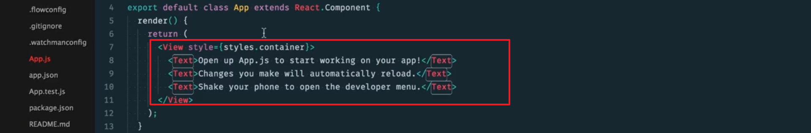

View 比较酷的一点是它可以直接映射到 React Native 所运行的平台上的对等元素。在 Android 上，它将映射到 Android.View；在 iOS 上，它将映射到 UIView。

可以将 View 看做网页上的 div，有一点需要时间来适应的是，通常在网页上，你会执行这样的操作，有一个段落，里面有一些文本，或有时候甚至有一个 div，里面有一些文本：

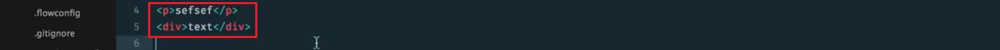

但是对于 React Native，需要**确保每当有文本时，需要将该文本封装在 Text 组件中**。如果不这么做，在尝试运行应用时会怎样？

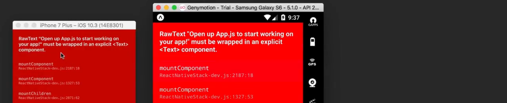

可以看到会有系统提示：RawText：“open up App.js to start working on your app!”，也就是说这部分文本没有封装在 Text 组件中。

---

### 课堂项目概述

在本视频中，我们将完整地展示我们即将构建的应用，因此当你与我一起构建时将完全知道我们正在执行什么操作。

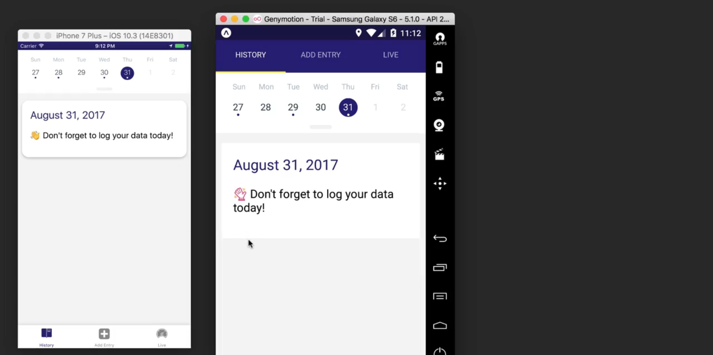

这将是一个铁人三项跟踪应用，如果你不知道铁人三项是什么的话，其实就是一项包含跑步、游泳和骑行的运动。此外，我们还将跟踪当前的三餐饮食或某一天的饮食情况以及睡眠时长。

上图是一个历史记录视图，对于当天来说，如果你没有记录任何当天的信息，系统将发出一条消息提醒，提示你别忘了记录信息。

我们可以打开日历，并上下滚动选择 8 月 8 日，当我们选择日期后将显示 8 月 8 日及之后的每一天并显示特定一天的数据：

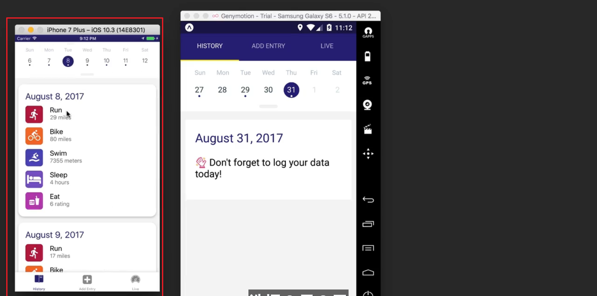

在安卓上是完全一样的。

点击某个日期并转到此此视图：


标题上是日期，这些是所有的信息，还可以重置并清空当天的信息。

点击 Add Entry，这样就可以为当天添加或记录具体信息：

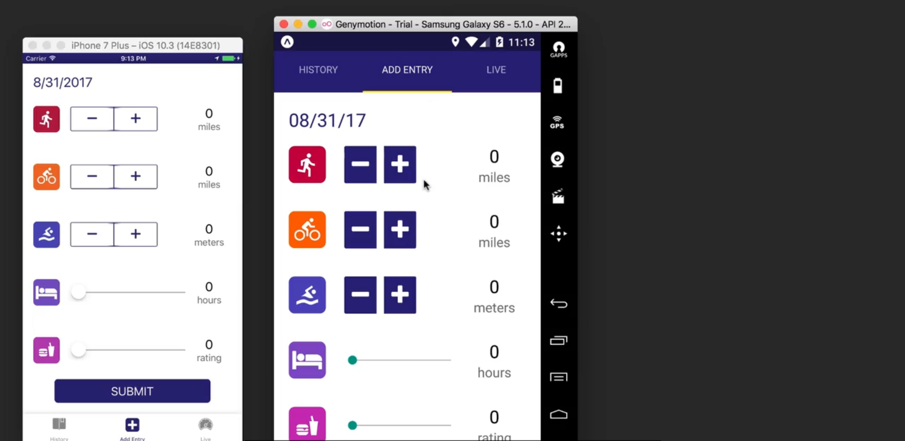

你将注意到一些不同之处，iOS 上的样式与 Android 上的有所不同，因为它们是两个不一样的独特平台。

这里我们可以为当天记录一些信息，然后提交。

如果你记录了信息后跳转到添加条目屏幕，将转到此视图，它会提示你已经记录了信息：

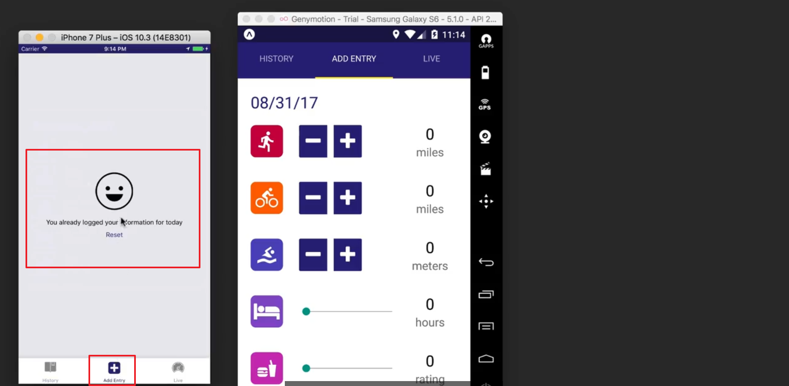

最后一个屏幕比较有趣，它就像一个实时跟踪器：

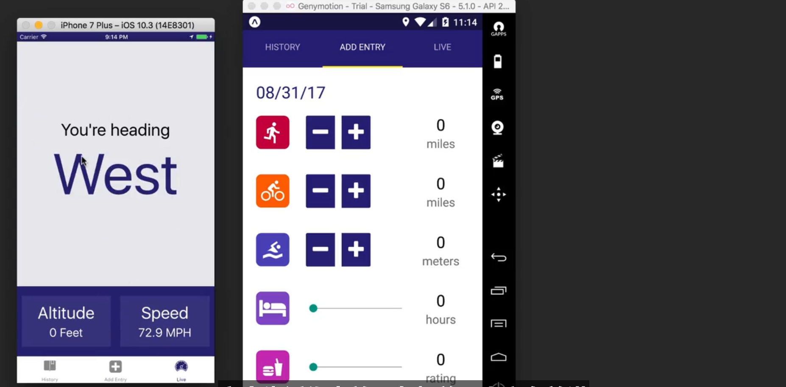

它会告诉你当前正在朝着哪个方向前进，以及海拔和行进速度。我现在讲模拟器设置成了模拟告诉驾驶状态，你会导航现在是 70-73 英里/小时，当前朝西前进。

这就是我们即将构建的应用，有很多功能，是一个很庞大的应用。因此会有很多讲解视频，但是如果你能一直跟进学习进度，你不会失望的。

---

### 图标

create-react-native-app 的一个优势是它本身就支持图标：

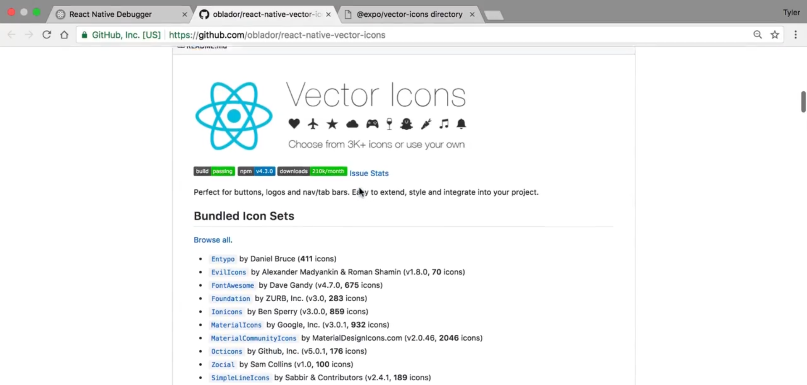

你在这些图标中看到的任何图标，无论是 FontAwesome、Ionicons 还是 MaterialIcons，都可以通过 create-react-native-app 访问这些图标。

如果你想了解你可以使用的所有图标，你可以访问这个网站：

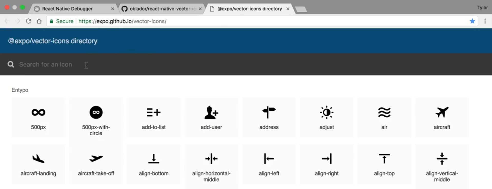

假设我想要一个披萨图标，就可以直接搜索获得。

假设我想在应用中使用这个 Ionicons 披萨图标，我们可以转到我们的应用，输入 `import { Ionicons } from ‘@expo/vector-icons’`。现在，当我们渲染这个 Ionicons 组件时，我们为其设定的名称（name）将与我们将在 Ionicons 库中使用的特定图标关联（直接使用从搜索结果中获得的名称），还可以设定其他选项，例如颜色（color），尺寸（size）：

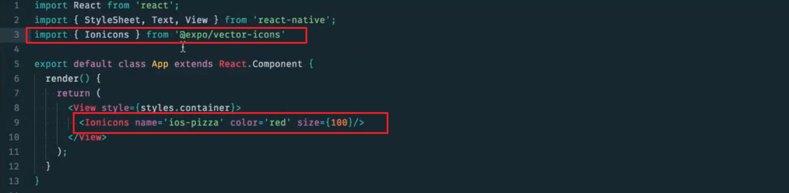

所以，Create React Native App 默认地具有 `@expo/vector-icons` 使你能够访问所有这些图表集。

---

**Create React Native App**开箱即用，可为在你的应用中使用数千个矢量图标提供支持。请随意添加书签并查看 Expo 的[矢量图标目录](https://expo.github.io/vector-icons) 获取完整列表。无论你选择哪个图标，请确保它符合你的应用的整体外观（例如，使用用于特定平台的图标）。

---

如果还记得我们将构建的最终应用的话，就会发现我们将跟踪五个指标：

- 跑步
- 骑行
- 游泳
- 睡眠
- 饮食

我们将打开 helpers.js 文件，在这个创建一个称为 `getMetricMetaInfo` 的函数，我们将在这里添加一个对象，该对象将具有五个属性，对应的是我们将跟踪的特定指标。因此包含

- run
- bike
- swim
- sleep
- eat

这些对象将包含帮助我们构建具体表格 UI 的所有信息。例如，对于跑步，我们需要知道这些信息，需要知道：

- `displayName: ‘run’`
- 一天能跑的最远路程设为 50（英里）`max:50`
- 单位，设为 ‘miles’（英里）`unit:‘miles’`
- step，当我们创建表格，用户点击按钮后，我们将按多大的步长递增该计数。`step:1`
- `type: ‘steppers’` 在表格 UI 中有按钮，称为步进器，还有滑块，将用于睡眠和饮食。
- 最后，输入 getIcon，每当我们调用这里的 getIcon 方法，我们想要获取这个特定指标的图标。转到顶部，我们将导入 ‘react’，因为我们将使用 JSX，将从 react-native 导入 ‘View’，然后从 ‘@expo/vector-icons’ 导入一些不同的图标。我们需要三种不同的图标 FontAwesome 、MaterialIcons、MaterialCommunityIcons，我们还将从 colors 文件导入 ‘white’
  - 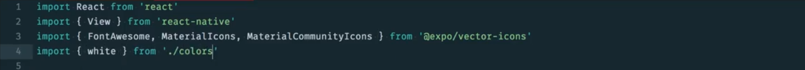
- 现在，在 getIcon 中我们想要返回一个 View，我们最终会设定样式，暂时先不管样式，然后在这里面将使用 MaterialIcons，名称设为 ‘directions-run’，color 是最终是 white（之前导入的变量），但现在我们设为黑色，方便我们看到，size 设为 35

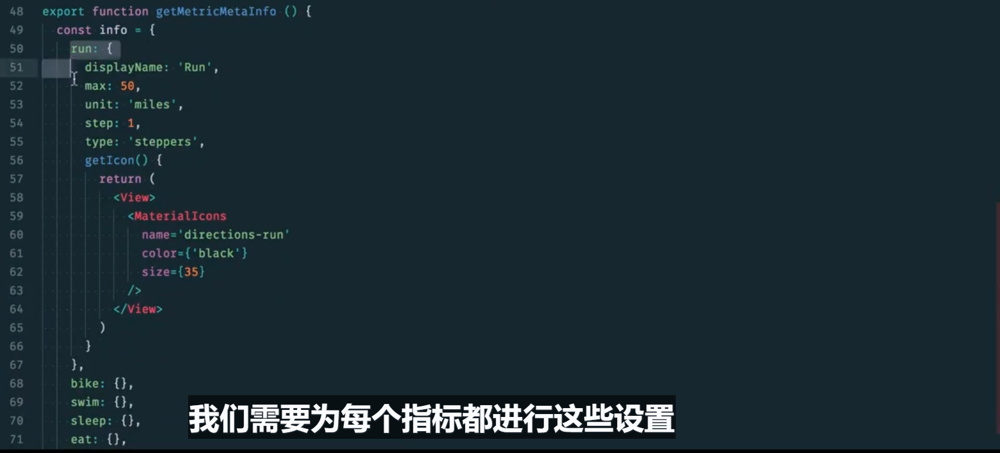

我们需要为每个指标都进行这些设置，所以下面就是复制粘贴了，不过要改一些属性值，比如对于 bike，displayName 将为 ‘Bike’ 等等（具体修改的参数可以去代码里查看）

修改完成后，我们有了一个庞大的对象，称为 info，如果我调用 getMetricMetaInfo 并且不传入参数，则直接返回整个对象，但是如果我传入一个参数，具体而言是 metric，我想返回该 metric，这样进行设置，如果 metric 未定义或其属性未定义，然后我们就直接返回 info 对象，如果不是这种情况则返回该指标信息：

```jsx
export function getMetricMetaInfo(metric){
  const info = {...}
	return typeof metric === 'undefined'
	  ? info
		: info[metric]
}
```

---

我们已经设置好了 getMetricMetaInfo 函数，我们来使用该函数吧。

我们将构建首个组件，在这里新建一个文件夹，命名为 components，并在里面创建一个 AddEntry.js 文件，从 React 导入 React，并获取组件（Component），就像在网络平台上的普通 react 中一样。但是现在，我们将从 react-native 获取 View 和 Text，然后获取我们刚刚构建的 getMetricMetaInfo 函数，位于 utils/heplers。

这个 AddEntry 组件将是我们的首个 React Native 组件，扩展自 Component，现在返回一个 UI：

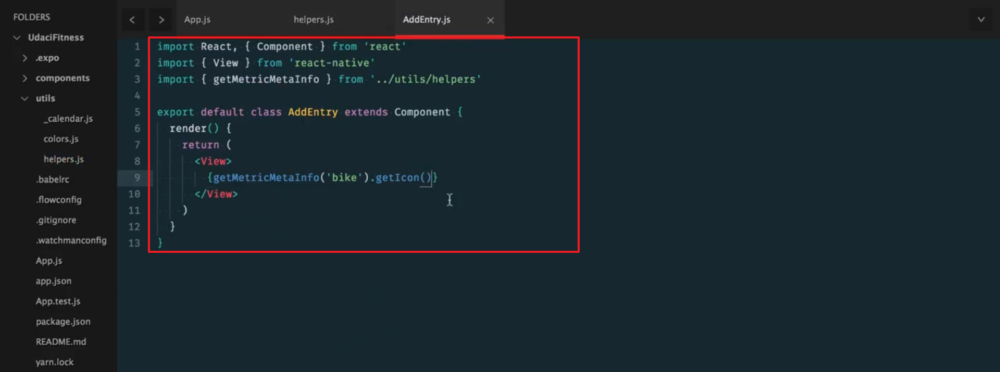

然后再到 App.js 中引入它：

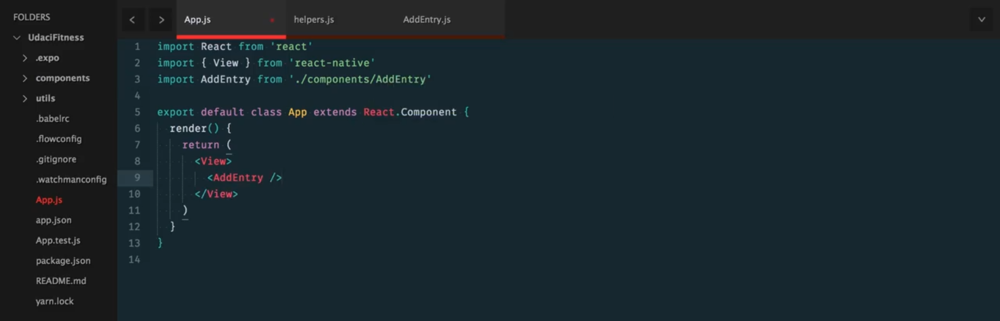

---

[这是包含前面两个视频中所做更改的提交。](https://github.com/udacity/reactnd-UdaciFitness-complete/commit/aa767680f50fb26e7e8201fd6a664dfd49f50ac9)

---

在上个视频中我们构建了一个函数，也就是这个 `getMetricMetaInfo`，在该函数中有两种输入，稍后我们将用到一个步进器（type:‘steppers’），它由两种不同的按钮组成，一个递增按钮和一个递减按钮。还有一个是滑块（type: ‘slider’），通常位于 1 和特定数字之间。

对于这两种类型的**输入**，我们需要在类中使用三种方法才能修改这些输入，因此我们的 state 将包含五项不同的内容，也就是 run bike 和其他要跟踪的指标：

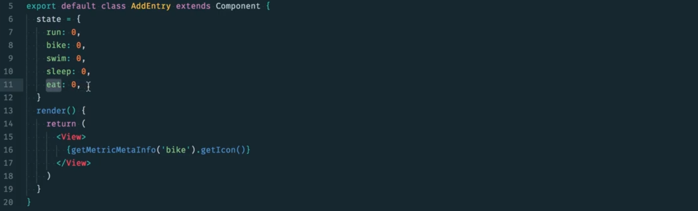

每项指标都是从 0 开始，因为该组件的最终目标是获取用户在某一个的铁人三项数据和睡眠及饮食数据，我们要跟踪的指标就是这五项指标。

首先我们要在这里创建一个 increment 方法，专门用于 run bike 和 swim 指标，当我们调用该方法时，我们将传入 metric，然后我们需要获取该指标的最大值，以及递增幅度，也就是步长（step），我们将从创建的 getMetricMetaInfo 函数中获取这些信息传入特定的指标；然后我们将调用 setState，我们将更新本地组件状态，调用 setState 时传入一个函数并获得当前状态，然后我们将 count 设为指标的特定属性，如果是 bike，那么这里的 count 将为 0，因为骑行状态等于 0，然后我们按照相应的步长递增，同样从此函数中获取。现在我们返回一个新的对象，setState 返回的对象将与当前状态合并，因此保留已经存在的所有属性（这里是做了 ...state 的操作，但是我觉得是多余的，因为只会改变你所返回的 state 中的属性，因此不需要返回一个新的 state，但也有可能需要返回一个新的 state 作对比吧。这个问题可以去研究一下），但是无论该指标是什么，我们都想更新它，如果 count 大于最大值，则指标现在将是相应的最大值，如果不大于最大值，则是 count：

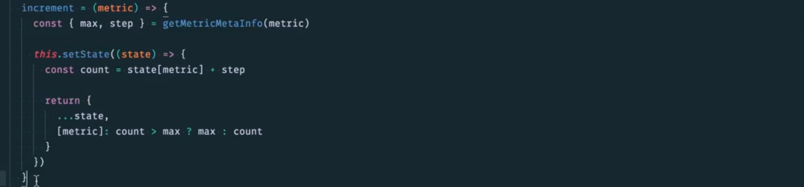

接着我们将执行完全一样的流程，但是现在是递减操作，然后把上面这段代码复制过来，成为 decrement，现在我们不再需要 max 和 step，因为我们将执行减法操作，我们将调用 setState，并像在上面那样获得 count，但是现在不是加上步长，而是减去步长，然后就像下面这样我们要返回所有内容，我们希望状态保持不变的，但是将更新这个指标，如果 count 小于 0 则设为 0，如果不小于 0，则设为这个 count，因此和上面的操作很相似，只是现在要确保不能小于 0：

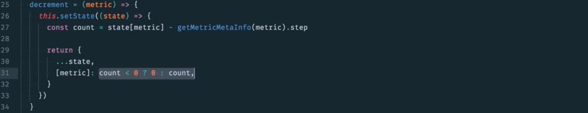

最后要执行的是，我们为这三个指标创建了 increment 和 decrement 功能，但是我们将为 sleep 和 eat 创建滑块。

在这里创建一个 slide 方法，并传入具体的指标以及新的值，然后我们将调用 setState 并返回一个对象，新的指标将是我们在 slide 函数中传入的第二个参数：

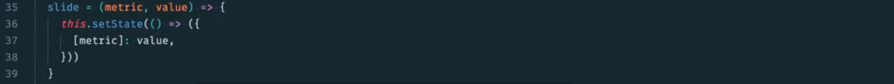


[这是包含此视频中所做更改的提交。](https://github.com/udacity/reactnd-UdaciFitness-complete/commit/f710aa25881665feacf82b100643146b8d011446)

---

我们已经编写了所有的方法和状态，在本视频中，我们将为滑块和步进器构建最基本的 UI。

我们再创建两个组件，这个叫做 UdaciSlider.js，第二个叫 UdaciSteppers.js，正如我提到的，这两个组件都是最基本的用户界面，导入 react 并导入 View 和 Text，它俩都是无状态函数式组件，输入 UdaciSlider 返回一个视图里面加入 Text 标签放入组件的名称：

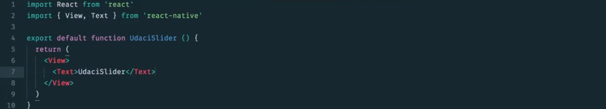

复制这段代码并粘贴到 UdaciSteppers.js 文件中，因为它俩比较相似，然后更改组件的名称为 UdaciSteppers。

然后转到 AddEntry 导入这两个组件，也就是 UdaciSlider 和 UdaciSteppers。现在我们并不渲染这两个组件，而是获取我们关心的指标，也就是这五个指标，然后根据该指标对应的类型显示滑块或步进器。

在这里的 render 中，我们先执行几项内容，我们将通过调用之前创建的 getMetricMetaInfo 获取这个 metaInfo，现在我们输入 Object.keys 传入 MetaInfo 将返回一个数组， 它有五个属性，swim bike 以及所有这些指标，然后调用 .map，这里将是特定的 key，然后我们从 metaInfo[key] 获取 getIcon、type、以及所有其他内容，这段代码的作用是调用 getMetricMetaInfo 返回整个对象，也就是这里的整个对象，然后映射它的所有键，并从这个键中获取每个属性）。（这里很厉害，因为对象是没有办法通过 map 循环印射的，所以先将这个对象的 key 取出来放入一个数组，通过 map 这个数组取这个对象中不同对象的值）。创建一个 value 变量，该值来自于 this.state[key]，在这里的这个示例中，假设 `Object.keys(metaInfo).map` 第一次运行，key 将设为 run，使用来自 `metaInfo[run]` 的 getIcon 和 type，然后获取值，也就是 `this.state[run]`，现在返回一些 UI，输入 View 因为位于 map 中，确保提供一个 key，使用 getIcon，你将发现在这两个平台上，都出现了每个图标，因为这里有 getIcon，现在我们将显示滑块或步进器，如果 type 等于 slider，我们将渲染 UdaciSlider 传入几个参数，首先将传入在第 49 行中获得的 value，然后传入一个 onChange 函数，该函数将获得 value，然后我们将调用 this.slide，注意我们需要传入 metric 和 value，然后传入所有其他内容。如果不是滑块类型，则渲染 UdaciSteppers 组件，代码很形式，传入 onIncrement，它将调用 increment 函数传入具体的 key，递减部分也一样，因此复制粘贴这行并稍加修改，最后和之前一样，传入所有其他内容：	

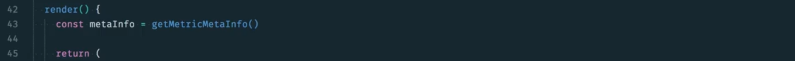

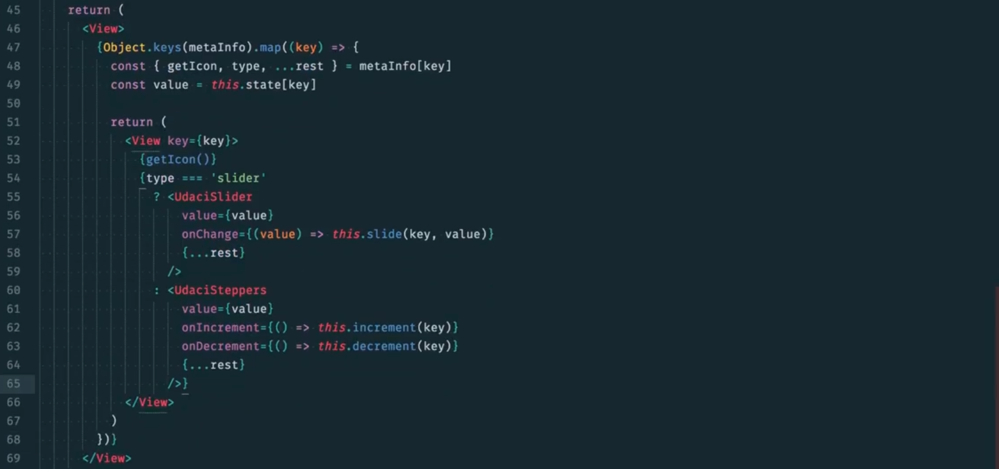

你会发现，对于顶部的三个指标，对应的是步进器，对于底部的两个指标，对应的是滑块：

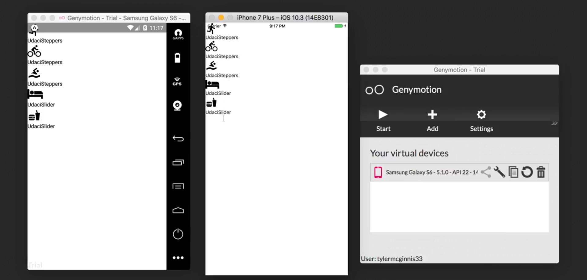


[这是包含此视频中所做更改的提交。](https://github.com/udacity/reactnd-UdaciFitness-complete/commit/3aa3f69d21b8a96b4b9d99f67b655772a479095f)

---

这些就是我们将构建的应用的最终屏幕效果：

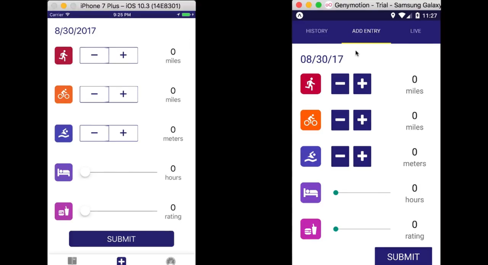

在本视频中，你会发现这里有个日期，我们将在应用中使用几种不同的时间，我们将构建一个组件。

在 components 文件夹中新建一个文件，命名为 DateHeader.js，我们需要导入几项内容，react 与 text，这将是一个无状态函数式组件，它将接受日期而不是文本，我们将该日期封装在 Text 组件中：

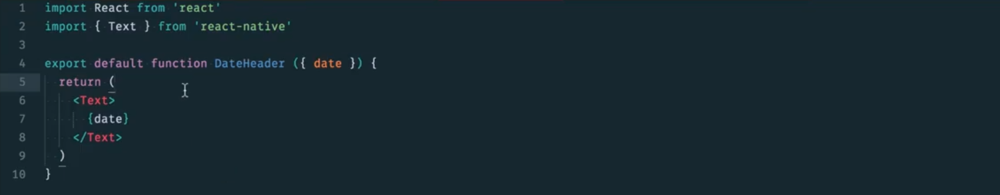

看起来似乎很简单，但的确就是这样，最终我们将添加样式，下节课会介绍样式。

在此之前，转到 AddEntry，导入刚刚创建的 DateHeader，现在渲染该组件，然后再开始映射所有信息，我们需要传入一个日期，我们可以在这里新建一个 Date 实例，然后调用 toLocaleDateString() 使其变成带格式的字符串，刷新之后就可以看到两个应用中都出现了日期。

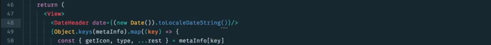


[这是包含此视频中所做更改的提交。](https://github.com/udacity/reactnd-UdaciFitness-complete/commit/a7ab15bf3f46d1202d86a2c2fe06e458bd7faffd)

---

##### 效果如何？

Task List

- 我向 `AddEntry` 添加了本地组件状态
- 我在 `AddEntry` 中创建了 `increment()`、`decrement` 和 `slide()` 方法
- 我创建了 `UdaciSlider` 组件
- 我创建了 `UdaciSteppers` 组件
- 我创建了 `DateHeader` 组件
- 我更新了 `AddEntry` 中的 `render()` 方法`

---

### 可触摸元素

用户主要通过**点击**与 web 应用进行交互。但是，在移动应用的世界中，用户会使用**几种不同的触摸手势**来在应用中导航: **点击按钮**、**滑动滚动列表**等等。

React Native 提供了多个组件来处理"点击手势"或我们所称的**可触摸元素**。我们在下面的视频中详细看看它们：

- `Button`
- `TouchableHighlight`
- `TouchableOpacity`

---

用户与原生应用互动的主要方式是通过**触摸**，因此我们要确保提供正确的按钮和组件以对任何触摸时间做出响应，具体而言，对按钮点击做出响应。

react-native 提供了四种不同的组件，分别为：

- `TouchableHighlight`
- `TouchableNativeFeedback`
- `TouchableOpacity`
- `TouchableWithoutFeedback`

我们将介绍每种组件，首先介绍 `TouchableHeightlight`，它的作用是当你点击按钮时，它会使按钮从主颜色变成另一种颜色，我们可以向此组件添加按钮样式，然后输入 onPress 并运行这里的 handlePress 方法，最后指定 underlayColor，也就是按钮背景所变成的颜色，输入 #d4271b，也就是深红色，在这里我们可以传入希望按钮显示的内容（指组件标签内容部分，注意需要 Text 组件）：

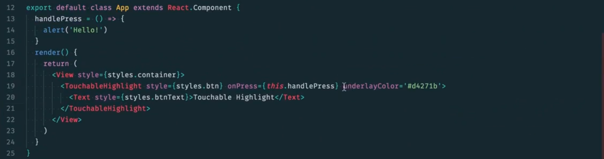

（注意，这里是有一些样式的，但没有截图，反正知道怎么使用就行）

实际效果如下：


按着不放则是左边那样的暗红色，一旦你放开手指就会出现提示 hello。

下一个是 `TouchableOpacity`，我实际上很喜欢 `TouchableOpacity` 组件，我们将删除这里的 `underlayColor`，现在当我们点击此按钮时，你会发现按钮的透明度变化了，也就是透出了背景色：


接着是 `TouchableWithoutFeedback`，当你点击按钮时，它基本上不会改变按钮外观，它的区别在于不使用与文本，设定一个唯一子级 `View`，然后获取 `TouchableWithoutFeedback` 上的样式并放在该 View 上：

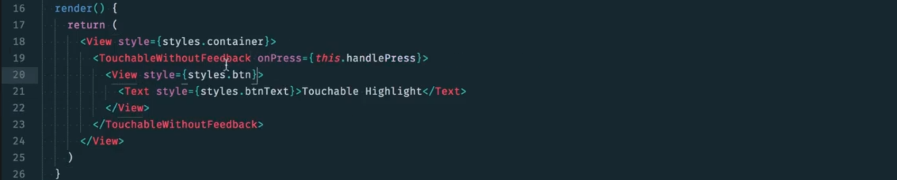

现在，当我点击该按钮时，什么也没发生，因为我们没有获得任何反馈（指 UI，放开依然会弹出提示框）。该组件最好别使用，因为原声应用就是要向用户提供反馈，但在某些情况下，它也很有用。

最后我们将讨论 `TouchableNativeFeedback`，此组件在 iOS 上不受支持，仅适用于 Android，它将使按钮出现涟漪效果，该效果是 Android 平台的原声效果。我们可以在这里添加背景属性（`background`），然后输入 `TouchableNativeFeedback.SelectableBackground()`，对于`TouchableNativeFeedback`还需要注意一点，它不能讲 `Text` 作为其直接子级，因此要使用`View`：

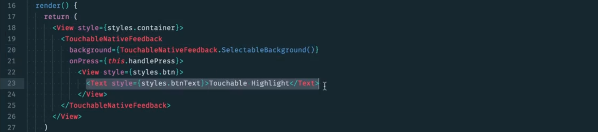

现在你会发现，在 iOS 上出现了错误，因为该组件不适用于 iOS 平台：

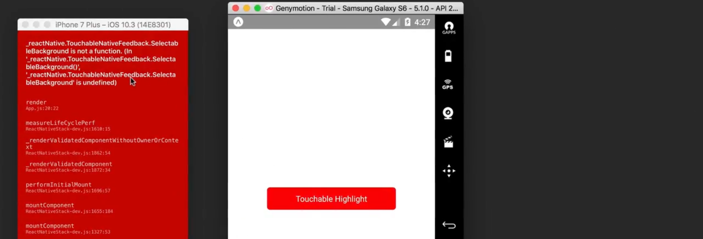

---

接着我们将为底部的提交按钮构建组件。

首先，向 AddEntry 组件添加一个方法，称其为 submit。首先，它将获取这一天的键，在 helpers 中，有一个这样的函数（timeToString），它将返回一个设定格式的日期，我们将使用这个具有格式的日期作为特定日期的键。这么做的原因是，我们将使用的 calendar 组件需要这种格式的日期，因此将这么设定。

我们首先将导入刚刚提到的 `timeToString` 函数，然后在 submit 中，我们将创建一个 key 变量，它将为调用 timeToString 后返回的内容，我们创建一个 entry，它将是一个起始状态，并从 state 中获取所有内容，也就是这里的指标。然后我们将在此函数中进行几项设置，但是现在不会进行所有设置，所以添加一些注释：

- 我们想要最终更新下 Redux
- 我们还想在添加导航功能后导航到主屏幕上
- 我们想要将这些信息保存到数据库中
- 我们将清空本地通知，使用户不会受到关于提交当天信息的通知。

但是现在我们能做的是重置状态，将所有这一切重置为 0：

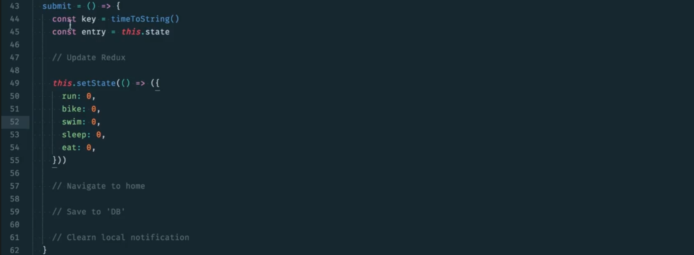

现在，每当我们运行 submit 时，所发生的情况是，获取 key，暂时不会用到该 key，我们还将获取所有这些状态，暂时也不会用到，然后重置本地状态。

现在，转到这里（AddEntry.js 的最上面），创建提交按钮，传入 `onPress` 方法，该按钮的 UI 将是可触摸组件，你可以使用几种不同的组件，比如这里使用 `TouchableOpacity`，当该组件被点击时，注意不是 onClick，而是 onPress，因为我们位于 React Native 中，可能需要一段时间才能适应这种区别。输入 SUBMIT：

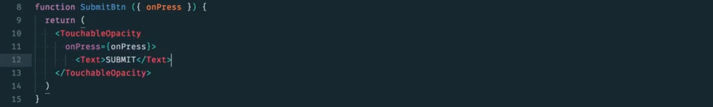

然后滚动到下面，在渲染方法中的 key 对象下面，渲染我们的提交按钮，传入在这里创建的 submit 方法：

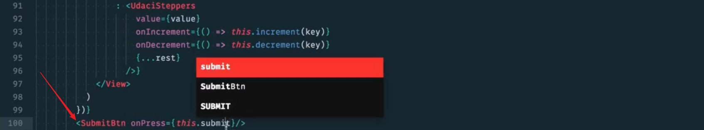

测试下，将 bike 改变 10，将 eat 改变 5，在 render 方法中，渲染 `JSON.stringify` 以便看到状态：

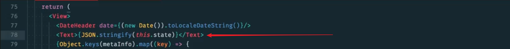

现在如果一切正常的话，当我们点击提交按钮，数据会重置为 0。

好了，最后删掉 stringify 那行，然后将 state 中的 metric 重置为 0。

（这一节最有意思的应该就是如何在 UI 中快速查看一个对象的值了，使用 `JSON.stringify`


[这是包含此视频中所做更改的提交。](https://github.com/udacity/reactnd-UdaciFitness-complete/commit/fea2dbb62ef103ed0a44307dd7922bdfcab83ef2)

---

[这是包含此视频中所做更改的提交。](https://github.com/udacity/reactnd-UdaciFitness-complete/commit/fea2dbb62ef103ed0a44307dd7922bdfcab83ef2)


#### 习题 1/3

以下关于在 React Native 应用中处理触摸元素的说法哪个是正确的？选择所有适用项：

- 与按钮不同，可触摸元素已包含一些基本的默认样式
- iOS 和 Android 上的按钮看起来是一样的
- 按钮和可触摸元素都有 `onPress` 属性 :star:
- 可触摸元素可以嵌套在视图中，视图可以嵌套在可触摸元素中 :star:

按钮和触摸元素都可以使我们处理应用中的点击手势。按钮可以开箱即用进行很好的渲染，但你可以自由地集成诸如`TouchableHighlight`或`TouchableOpacity`等组件，为用户提供更细致入微的反馈。

<video src="F:\Videos\Tiny Desk Concert\Anderson .Paak & The Free Nationals- NPR Music Tiny Desk Concert.mp4"></video>

---

在原生应用中，滑块是让用户在最低值和最高值之间进行选择的最佳方式，幸运的是 React Native 内置了 Slider 组件。

我们将向该组件中添加一些状态 `value:0`，我们将向 Slider 组件传入几个不同的属性，第一个属性是 value 来自于 this.state.value，接着告诉滑块如何更新该 value，输入 `onValueChange`，它将是一个函数并接受新的 value，然后更新为这一新的 value，然后添加一个 Text 输入 value，看看当前状态的值：

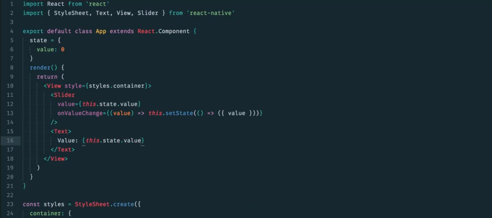

在 iOS 和 Android 上分别看起来是这样的：

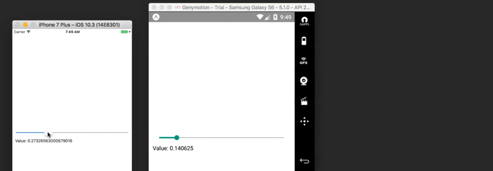

React Native 最大的好处就是提供了这些跨平台组件，无论在哪个平台上都具备相同的外观。

现在我们将向滑块中添加最小值和最大值，你可能已经猜到了，我们将输入 `minimumValue={-10}`，`maximumValue={10}`：

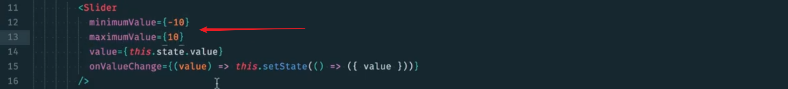

因为我们从 0 开始，因此位于中间部分：

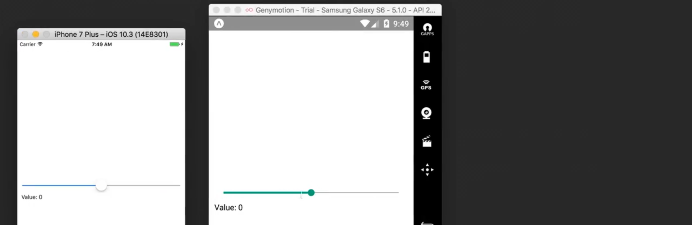

但是我们可以在 -10 和 10 之间移动。

最后，我们不希望出现这些小数，值希望显示整数，因此输入 step，设为 1：

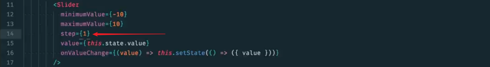

现在当我们移动滑块时，将按照 1 为步长调整滑块，无论是在哪个平台上都一样。

---

我们不再使用文字 UdaciSlider 来代表滑块，而是使用 react-native slider 组件构建 UdaciSlider 组件。

在 UdaciSlider.js 中，首先删掉这个 Text 并导入 slider。现在，如果你记得的话，当我们使用 UdaciSlider 时，我们向其传入一个 value 和 onChange，然后是来自 metaInfo 的所有其他内容，我们将重构所有这些，输入 max、unit、step、value、onChange（指解构 props），然后，我们将渲染 Slider 组件，我们将向其传入 step 和 value，然后传入 maximumValue 并向其传入 max，minimumValue 设为 0，然后是 onValueChange，值是传入进来的 onChange 方法。然后，我们再渲染一些其他内容，我们想显示 value，还想显示 unit：

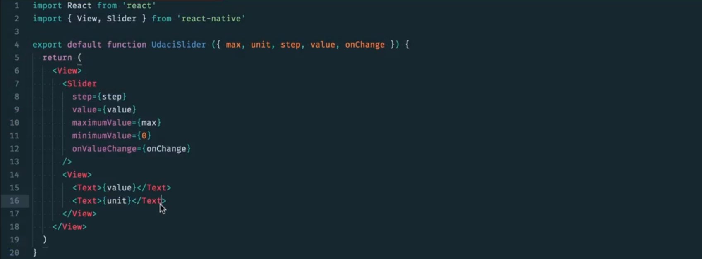

最终结果将是这样的：


我们将显示一个滑块，然后还有值和单位，可以看到 UdaciSlider 组件部分。


[这是包含此视频中所做更改的提交。](https://github.com/udacity/reactnd-UdaciFitness-complete/commit/528c326cc0dfafcd74199c7be9cb00d971cc8a23)

---

现在就像滑块流程那样，我们更新下 UdaciSteppers 组件。

在 UdaciSteppers 中，我们将需要添加几项不同的内容，它们将是按钮，导入 `TouchableOpacity`，还需要获取一些图标组件，我们将获取 `FontAwesome` 和 `Entypo`，二者都是 React Native 应用自带的，并位于 `@expo/vector-icons` 。和 UdaciSlider 一样，我们将在 UdaciSteppers 中为 onIncrement、onDecrement 和其他一切提供值。转到 UdaciSteppers.js 中进行解构。我们将返回几项不同的内容，而不是输出文本，首先返回一个可触摸组件，每当我们点按它时将运行 onDecrement，在这里面将是一个图标，名称为 minus，size 设为 30，color 设为 black 以便现在就能看到，还需要一个按钮，这次不是递减，而是递增，名称从 minus 改为 plus，将这些封装在 View 中（指两个按钮）。和滑块一样，我们还需要添加具体的值和单位，添加一个 View 其中具有两种不同的 Text 组件，第一个组件将是 value，第二个将是 Unit：

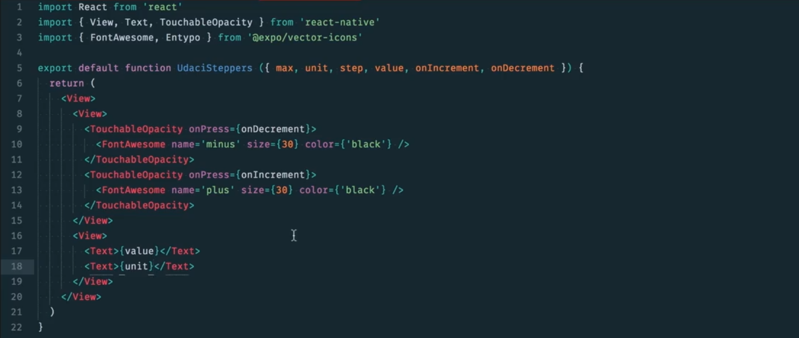


[这是包含此视频中所做更改的提交。](https://github.com/udacity/reactnd-UdaciFitness-complete/commit/f9b86f4b8fd5c2c2c89cfa32552b67f76a48fcf3)

---

现在，假设用于已经记录了当天的信息，我们要做的是确保显示这个屏幕消息，并使用户能够重置信息：

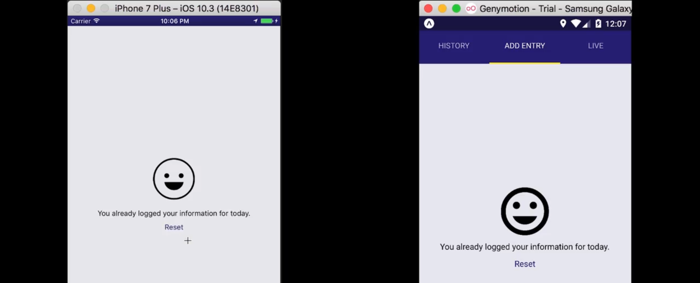

首先，在 AddEntry 中导入一些内容，先确保导入 Ionicons，因为我们将使用该图标组件，然后在下面的 render 方法中，输入 `if(this.props.alreadyLogged)` 我们最终将导入这个属性，但是**现在先设置下，以便在使用时能够直接拿来用**。如果已经记录了信息，则返回一个 View，在该 View 中渲染 Ionicons 图标，名称设为 ios-happy-outline 大小为 100，然后在下面输出文本：“You already logged your information for today.”，然后在这里添加一个重置按钮，这样我们就能点击该按钮并重置信息，这将是一个非常常见的组件——文本按钮：

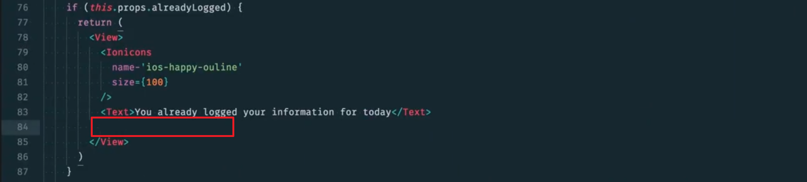

（<span style="color:red">红色方框部分</span>会添加一个文本按钮，注意上面有两处错误，name 后是 `=`，ouline 其实是 outline，然而没有 ios-happy-outline 只有 md-happy）

现在我们将创建该按钮，因为我们在应用的其他几个地方也会用到该按钮，称其为 TextButton.js，因为它将是一个按钮，因此需要导入一些内容，导入 Text 和 TouchableOpacity 二者都来自 react-native，它将是一个无状态函数式组件，并且将接受几项不同的参数，包括 Children 和 onPress，返回 TouchableOpacity 和 onPress，很明显要调用传入的 onPress，然后渲染 children，将其封装在 Text 组件中：

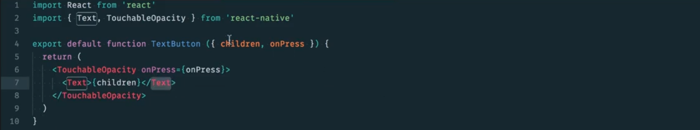

转到 AddEntry，导入 TextButton，然后向下滚动到 if 那个红框那儿，然后渲染 TextButton，在里面输入 Reset：

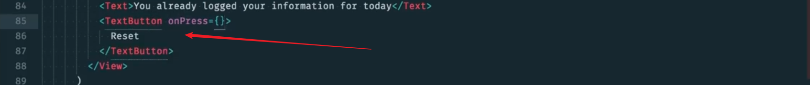

（这里可以通过 this.props.children 来获取 Reset）

现在需要传入一个按钮被点击时运行的方法，我们在这里添加 Reset 方法，获取今天的 key，可以通过调用 timeToString 来获取，然后就像在这里的 submit 方法中一样，最终我们将执行几项操作，先添加几条注释：

- 我们将更新 Redux
- 然后转到主屏幕
- 更新数据库

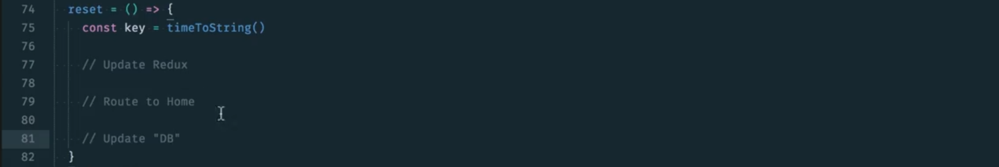

现在已经创建好 Reset 可以将其传入 TextButton 组件中。

现在在出现的视图中点击 Reset 什么也不会发生，但最终会有后续效果。


[这是包含此视频中所做更改的提交。](https://github.com/udacity/reactnd-UdaciFitness-complete/commit/1faffa1c2df4775c3f4fb1dc7460faca86b084fe)

---

**我们刚刚向 UdaciFitness 添加了很多功能。我们来看看！**

Task List

- 我在 `AddEntry` 中创建了 `submit()` 方法
- 我创建了 `SubmitBtn()` 组件并在 `AddEntry` 中渲染了它
- 我更新了 `UdaciSlider` 组件
- 我更新了 `UdaciStepper` 组件
- 我创建了 `TextButton` 组件
- 我在 `AddEntry` 中创建了 `reset()` 方法
- 我更新了 `AddEntry` 中的 `render()` 方法

---

> ### 💡 Pause Udacifitness💡

> 现在，我们将 UdaciFitness 项目暂时放一边，来聊聊其他一些常见的 React Native 组件。 例如，如何处理移动应用中的列表？还有表格或图像呢？

> 尽管这些并不一定在课堂项目中使用，但知道这些组件总会在你开发 React Native 应用时帮上忙。

### 列表

React Native 具有三种显示列表的方式:

- `ScrollView`
- `FlatList`
- `SectionList`

我们来详细看看每一个！

---

如果你去看看使用过的原生应用，就会发现基本上都是一堆列表信息，Spotify、Facebook 和所有其他的热门应用，都只是显示一些不断变化的庞大列表数据，在本视频中，我们将介绍如何在 react-native 中添加能正常运行的列表。

这是一个 reviews.js 文件：

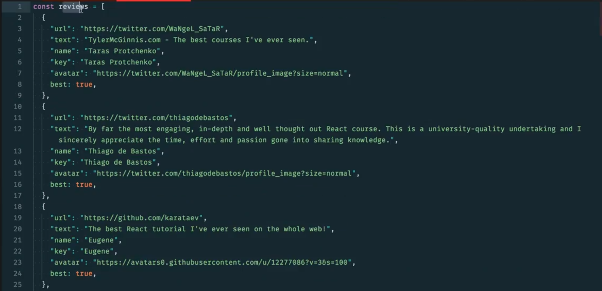

其实就是一个包含各组不同项目的数组，然后是一个 getReviews 函数，用来返回上面的 reviews：

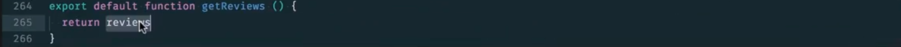

我们导入 getReviews 并在这里添加 Review 组件，它会接受名称、文本和头像并向 View 显示这些信息，我们将逐步介绍在应用中显示这些评价的不同方式。

首先，也是最明显的方式是这样，在 reture 的`<view>`下面输入 reviews.map 就像在网络平台上一样，获得 name、text、avatar，然后渲染 Review 组件，传入 key，该 key 将为 name，然后传入 name、text 和 avatar：

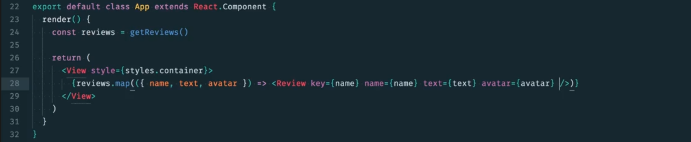

看起来似乎可行，我们来看看实际效果：

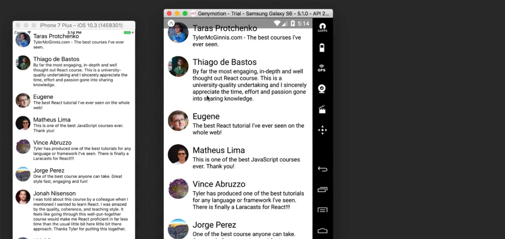

你会发现一切看起来正常，但当你想滚动屏幕的时候却发现无法滚动，因为视图被限定在屏幕空间内。

解决的方法很简单，我们不再使用 `View`，而是将列表封装在这个 `ScrollView` 组件中：

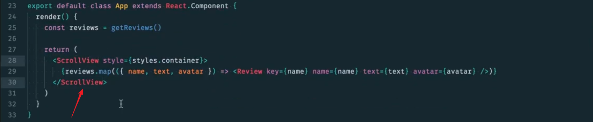

现在我们的应用就能够滚动了。

但是 `ScrollView` 并不是那么强大，也存在问题，我们现在的做法是，渲染该列表中的每一项，无论用户是否能看到这些项，当我们位于该视图的顶部时，依然在渲染下面的评论。

比较高效的做法是我们不用渲染所有项目，而是只渲染用户当前能看到的项目，这时候，这个 `FlatList` 组件就派上用场了，它完全能实现刚才提到的渲染效果，只渲染用户当前查看的项目。

将 `ScrollView` 重新改为普通的 `View`，然后在 `View` 里面渲染 `FlatList` 组件，将传入两项不同的内容，需要一些`data`，设为 reviews（`data={reviews}`），还需要 `renderItem`，它负责渲染实际的项目，在这里创建一个 `renderItem` 方法，`renderItem` 将接受一个对象，并且实际项目本身是要映射的内容，每个 item 都将是具体的 Review，然后我们将渲染 Review 并传入该 item：

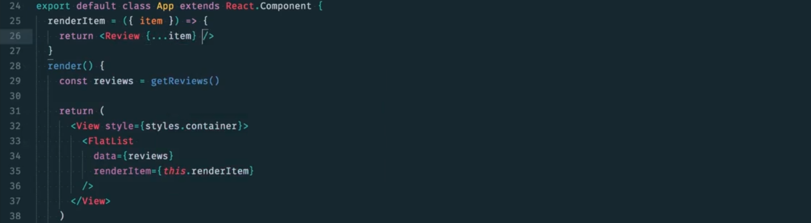

（这里应该是这样，FlatList 组件接受 data，data 的值会作为 renderItem 的函数的第一个参数被传入，renderItem 的返回值为需要渲染的每一项的 UI，这样我觉得 data 的参数只能是数组，要不无法在内部做循环。）

（这段代码我最喜欢的部分是 `return <Review {...item}>` 一下就把所有的属性传入进去了，这就需要在构建 Review 组件时对数据要一一对应的写）

现在我们来看应用效果，一切应用看起来没变化，滚动效果还是一样的，但是当你在实际手机上运行该应用，并滚动查看这么长的列表会发现效果好多了，因为我们使用的是 FlatList，我们只是渲染用户当前看到的具体项目，而不是整个列表。

---

#### 习题 2/3

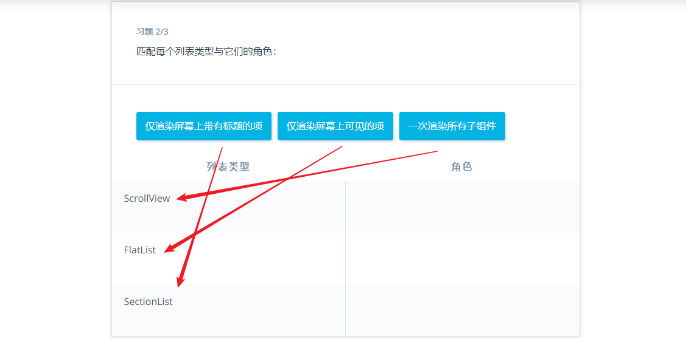

---

### 表单

React Native 中的表单与你已经熟悉的 React 中的表单一样: **表单输入元素的状态由渲染表单的 React 组件控制**。也就是说，**表单值保存在本地组件状态中，使状态成为该表单的"数据源"（SOT）**。

React Native 提供几个在应用的表单中使用的基本组件。我们将在下面的视频中详细介绍每一个：

- `TextInput`
- `KeyboardAvoidingView`
- `Slider`
- `Switch`

---

在本视频中，我将深入讲解下 React Native 中的表单，具体而言是这个 TextInput 组件和 Switch 组件。

在这里添加一些属性，输入 input 和我的推特账号，输入 showInput 设为 false：

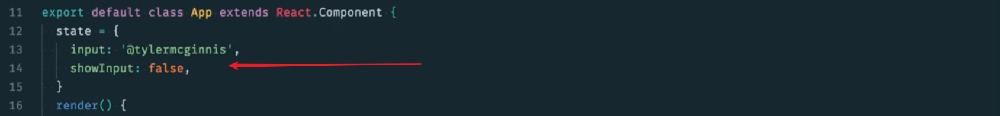

我们希望我们的 UI 能出现一个切换按钮，该按钮开启时，显示可以更改的输入文本，关闭时，则隐藏文本。

在这里，首先渲染 Switch 组件，需要传入两项不同的内容，首先传入 value，其次传入点击按钮时将调用的函数，我们在这里对我们的 state 解构这两项属性，然后创建一个 handleToggleSwitch 函数，该函数的作用是负责更新切换开关的状态，在这里输入 `showInput`，它的值将是当前状态的对立状态，每当运行该函数时，switch 输入将切换，在这里输入 `value={showInput}`，然后输入 `onValueChange={this.handleToggleSwitch}`：


现在转到应用界面上，看到这个切换按钮，可以开启或关闭：

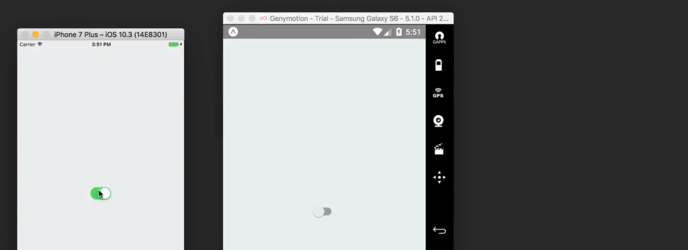

它会对我们的 state 更新该 showInput 属性。

现在我们需要添加 TextInput 并输入如果 showInput 为 true，则显示这个 TextInput 组件，实际上我们希望能更改这个 TextInput，因此需要再设置几项内容，提供 input 本身，设定一些样式（他下面有），然后提供一个当它改变时将被调用的函数，这样就能更新本地状态，输入 this.handleTextChange，handleTextChange 将为组件上的一个方法。它将接受崭新的 input，还将调用 setState，然后它将更新 input：

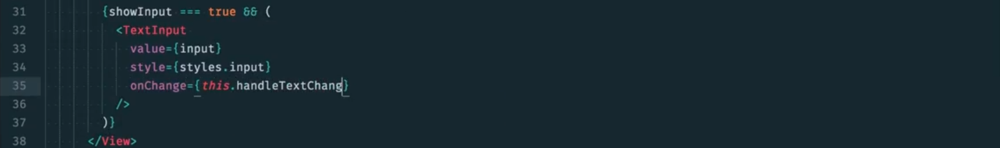

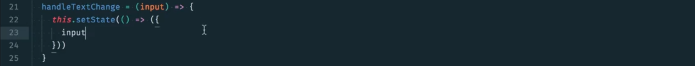

现在运行代码，点击该开关，你会看到输入框，我们可以更改输入内容：

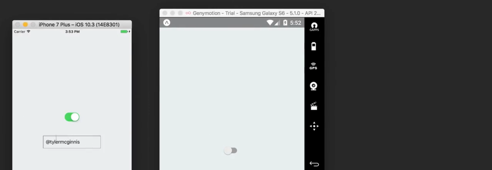

如果我们想向用户界面上添加图片呢？如下（记得导入 Image 组件）：

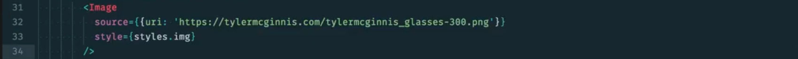

但是现在点击文本输入框的话出现了键盘，并且将输入框隐藏起来了，这样不太合适：

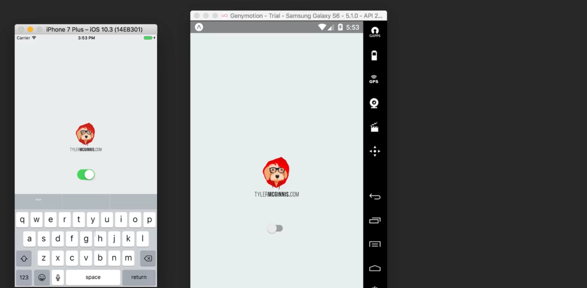

避免方法很简单，React Native 提供了 `keyboardAvoidingView` 组件，我们可以将这里的 `View`（最外层的 View），替换为 `keyboardAvoidingView`，并为其提供 `behavior` 属性，设为 `padding`，指明该视图如何不被键盘遮盖，我们将在其周围添加一些内边距：

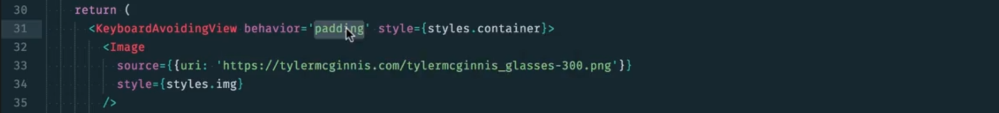

现在开启输入字段的话，你会发现输入字段没有被隐藏，整个视图都能看到：

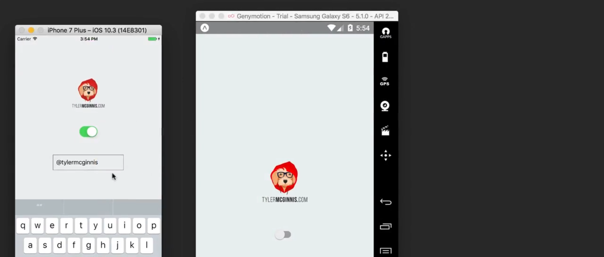


#### 习题 3/3

以下关于 `KeyboardAvoidingView` 的说法哪一个是正确的？选择所有适用项。

- 没有 `KeyboardAvoidingView`，键盘会"弹出来"挡住文本输入 :star:
- `KeyboardAvoidingView` 可以包裹 `TextInput` 组件​ :star:
- `KeyboardAvoidingView` 应始终包含在一个 `View` 组件中
- 内边距 padding 可以通过 `KeyboardAvoidingView` 上的一个属性调整​ :star:


`KeyboardAvoidingView` 解决了视图会阻挡虚拟键盘的问题。

---

在本视频中，我要讲解的是，如何在 react-native 里向视图中显示图片。

通常有两种图片显示方式，也就是可以从两个来源获取图片。

- 第一种方式是使用本地文件，也就是这个 PNG 文件：
  - 
- 第二种方式是图片文件位于服务器上

我将演示如何显示这两种图片，先介绍第一种方式。

对于这个本地文件，我们需要获取 Image 组件，然后像其他组件一样渲染它，它将接受几种不同的属性，为其设定样式属性 styles.img（位于当前文件下面），接着提供 soure，对于本地文件，我们将使用 `require()`，并传入该文件的路径，你会发现当前文件 App.js 与图片文件位于同一层级，因此可以直接通过输入 ./ 然后是图片名称来获取图片：

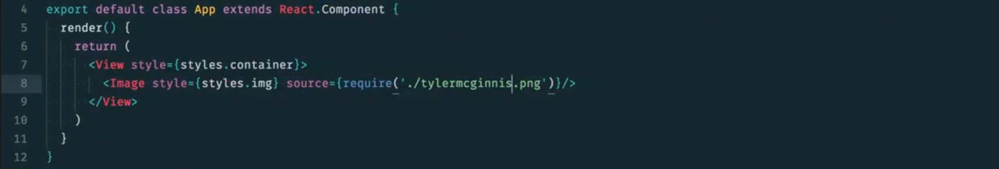

现在假设我们想添加来自外部来源的图片，也就是图片托管在了其他位置，添加一个 View 并快速添加一些间隔，为了获取托管在其他位置的图片，我们将执行相同的操作，添加一个样式，但这里不再调用 `require()`，而是传入一个对象，它具有一个 URI 属性，值为图片所在的具体网址。这里是位于 tylermcginnis.com 网站上：

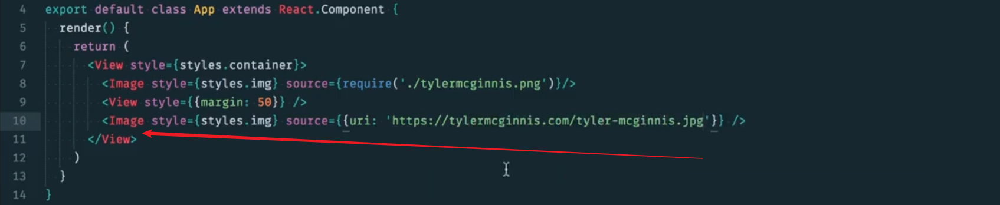

---

### 其他组件

我们刚看了 React Native 中内置的一些最重要的组件。这些组件能让你开始使用你构建的应用中的基本功能 - 但可用的组件并不止这些！请自行查看 React Native 文档获取[完整列表](https://facebook.github.io/react-native/docs/components-and-apis.html#components-and-apis)。首先，我们建议你查看：


- [ActivityIndicator](https://facebook.github.io/react-native/docs/activityindicator.html)
  - 显示一个圆形的 loading 提示符号。
  - https://reactnative.cn/docs/activityindicator/
- [Picker](https://facebook.github.io/react-native/docs/picker.html)
  - 本组件可以在 iOS 和 Android 上渲染原生的选择器（Picker）
  - https://reactnative.cn/docs/picker/
- [WebView](https://facebook.github.io/react-native/docs/webview.html)
  - `WebView` 创建一个原生的 WebView，可以用于访问一个网页。
  - https://reactnative.cn/docs/webview/
- [Modal](https://facebook.github.io/react-native/docs/modal.html)
  - Modal 组件是一种简单的覆盖在其他视图之上显示内容的方式。
  - https://reactnative.cn/docs/modal/

注意某些组件是特定于平台的！虽然你可能想要使用_组合_构建跨平台组件，尽可能多地重复使用代码，但根据受众群体（即 iOS 或 Android），某些元素还是会有所不同。

### 总结

React Native 为开发应用程序提供各种内置组件。其中一些支持应用中的基本功能（例如，文本、图像、列表等），另外一些提供更专门的功能（例如，拉动刷新、显示加载指示器等）。请自行查看 React Native 文档中的[组件和 API](https://facebook.github.io/react-native/docs/components-and-apis.html)，获取详尽列表。

中文：https://facebook.github.io/react-native/docs/components-and-apis

---

## 2.4 AsyncStorage

### 本地存储

为在 web 应用中保留数据，我们通常会将数据存储在某种数据库中。这可以防止在页面刷新之间丢失应用程序数据。使用 `localStorage`，我们可以*直接将数据存储在浏览器中*，以达到保留数据的效果。最好的是 -- 存储在 `localStorage` 中的数据没有到期日期。这意味着即使会话结束（例如，浏览器选项卡关闭），数据也不会丢失！

请自行查看 MDN 上的 [Window.localStorage](https://developer.mozilla.org/en-US/docs/Web/API/Window/localStorage) 了解概述。

#### 示例：保存到 `localStorage`

假设我们在构建一个简单的 React 和 Redux 应用，它可以使用户创建并管理任务列表。基本功能包括允许用户向他们的任务列表添加项、删除项以及将项目标记为已完成。

假设大部分数据都存储在了应用的存储器中，我们将如何保留此数据？一种方式是每次更新状态时保存到 `localStorage`。也就是说，存储器的状态将在每次_分发_时保存:

```js
// store.js

import { createStore } from 'redux';
import Reducer from '../reducers/reducer';

const configureStore = () => {
  const store = createStore(Reducer);

  store.subscribe(() => {
    localStorage.state = JSON.stringify(store.getState());
  });

  return store;
};

export default configureStore;
```

创建好存储器，我们调用 `store.subscribe()` 并传入一个回调函数。回调会有效地将存储器状态的 JSON 字符串保存到 `localStorage` 中。最终，通过在创建存储器后立即订阅它，我们可以将与用户所有任务相关的数据直接保存在他们的浏览器中！

---

在 React Native 中 LocalStorage 叫做 AsyncStorage，它和 LocalStorage 相似，但是是异步形式。

AsyncStorage 的好处是它是 iOS 和 Android 对等项的 JavaScript 抽象形式，在使用它时，不用担心不同的环境。

和 LocalStorage 相似，AsyncStorage 具有三个主要方法：

- 设置项目（setItem)
- 删除项目（removeItem）
- 清除所有项目（clear all）

React Native 文档中关于 [AsyncStorage](https://facebook.github.io/react-native/docs/asyncstorage.html) 的部分提到：

> AsyncStorage 是一个简单、未加密、异步、持久的键值存储系统，对应用来说是全局性的。它应该用于替代 LocalStorage。

在下一个视频中，我们将看看如何在应用中实现它！

---

在 AddEntry.js 文件中，有一个这样的 reset 方法，还有一个 submit 方法：

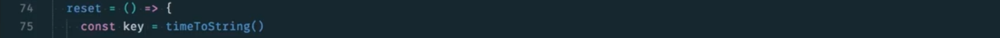

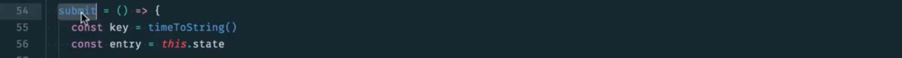

你会发现这两个方法内部注明了我们将在这两个方法中执行的任务，其中一个任务是将数据保存在数据库中。数据库用引号引起来了，因为我们将使用 AsyncStorage 即 react-native 的本地存储组件来假装我们有一个数据库。

在本视频中，我们将构建 api.js 文件，以便执行第 70 行和 81 行注明的任务。

在 utils 文件夹中新建一个 api.js 文件，在此文件中，首先需要导入之前提到的 AsyncStorage，它来自于 react-native，然后需要获取的是 _calendar.js 文件中的 `CALENDAR_STORAGE_KEY`：

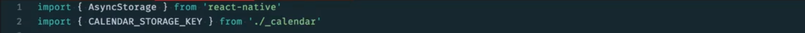

现在我们将用到两种不同的方法，即两种函数，第一个叫做 submitEntry，第二个叫做 removeEntry，提交和删除功能创建好了：

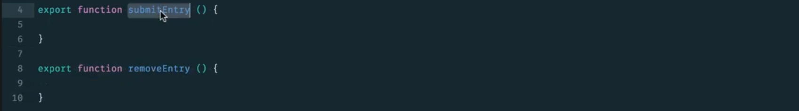

当我们提交时，将调用我们要创建的提交函数，而重置时要调用我们的 remove。

我们向 submitEntry 传入 entry 和 key，然后调用 AsyncStorage.mergeItem 传入 CALENDAR_STORAGE_KEY，合并的内容是该对象的 stringify 版本，key 是属性名称，entry 是值：

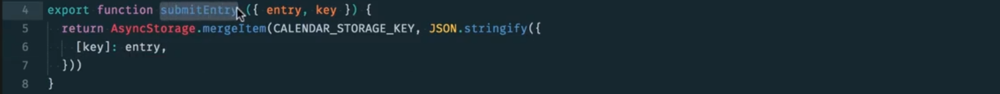

这里是为当天提交新的条目，我们想要将该条目添加到数据库中，也就是手机上的 AsyncStorage，方法是使用 mergeItem，我们将该对象合并到 AsyncStorage 中的这个属性上（CALENDAR_STORAGE_KEY）。

对于 removeEntry，向其传入一个 key，然后从 AsyncStorage 中删除位于这个 key 的项目。输入 `return AsyncStorage.getItem(CALENDAR_STORAGE_KEY)` 来获取这个位置的所有信息，获得这些信息后，称之为 results，然后解析该信息，输入 `data[key] = undefined`，肯定还有更好的方式，不过这样也可行，现在`delete data[key]`，也就是获取所有这些信息，删除该 key 属性所在位置的所有信息， 然后使用 AsyncStorage.setItem 并输入 CALENDAR_STORAGE_KEY 即位于 CALENDAR_STORAGE_KEY 的所有信息，将为删除该特定键所对应位置的项目及对信息 stringify 之后的所有数据：

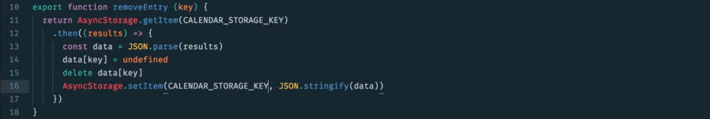

现在我们将在 AddEntry 中调用这两个函数，在顶部导入这两个函数，即 submitEntry 和 removeEntry，然后在下面的 submit 中，我们调用 submitEntry，我们要传入的对象具有一个 key，该 key 是 timeToString 提供给我们的信息以及 entry 是本地状态：

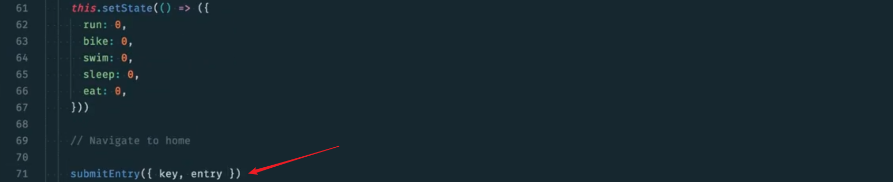

然后在下面的 reset 中，我们将调用 removeEntry 传入一个 key，它也来自于 timeToString 提供给我们的信息：

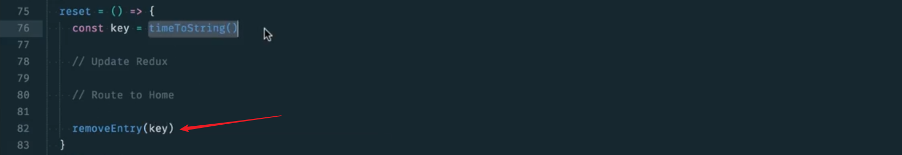


[这是包含此视频中所做更改的提交。](https://github.com/udacity/reactnd-UdaciFitness-complete/commit/78a78135ab80b78e8585f428052e76573fc8996e)

---

**效果如何？**

Task List

- 我创建了 `api.js` 工具文件
- 我更新了 `AddEntry` 中的 `submit( )` 和 `reset( )` 方法

---

### 概括

React Native 版本的 `localStorage` 为 `AsyncStorage`。这非常方便，因为 `AsyncStorage`只是 iOS 和 Android 等平台对应部分的抽象，所以不用考虑不同的环境。

我们来看看 `AsyncStorage` 的三个主要方法：

- `setItem`
- `removeItem`
- `clearAll`

请自行访问[文档](https://facebook.github.io/react-native/docs/asyncstorage.html#methods) 获取完整清单。

在下一个小节中，我们将结合 Redux 来帮助管理应用状态！

---

## 2.5 Redux 和 React Native

在构建 React Native 应用时，有时候难以知道能够执行和不能执行的操作，因为通过编写 JavaScript 代码来构建原生应用很不常见。好消息是 React Native 本质上依然是 JavaScript，这就意味着，如果你想天添加 Redux 等 JavaScript 库，可以像开发网络应用那样添加库。但并非始终这样，例如 React Native 的样式设置过程有所不同，但是对于 JavaScript 库，可以像网络应用那样添加这些库。

---

### 添加 Redux

你应该记得 Redux 是 JavaScript 应用的***可预测的状态容器*****。它对于任何特定的视图库或框架无关**，所以我们不仅可以将它与 React 一起使用，也可以将其集成到 React Native 应用中！

由于 Redux 精简的尺寸和较小的依赖性，它无疑是 React Native 项目的很好工具。最重要的是: 由于 React Native 从根本上来说*只是 JavaScript*，我们可以用习惯的方式将 Redux 添加到项目中。我们来看看吧 -- 首先，构建**actions**！

---

正如之前所说，当我们点击 AddEntry 中的 submit 或 reset 时，我们还需要更新 Redux，但是为此我们还需要向应用中添加 Redux，在本视频中，在向应用添加 Redux 之前，我们将新建一个文件夹，称之为 actions。我们将定义在更新 redux store 之前需要发生的所有 aciton。

在 action 中有一个 index.js 文件，回到应用界面，左边是主屏幕，右边是我们正在创建的添加条目屏幕：

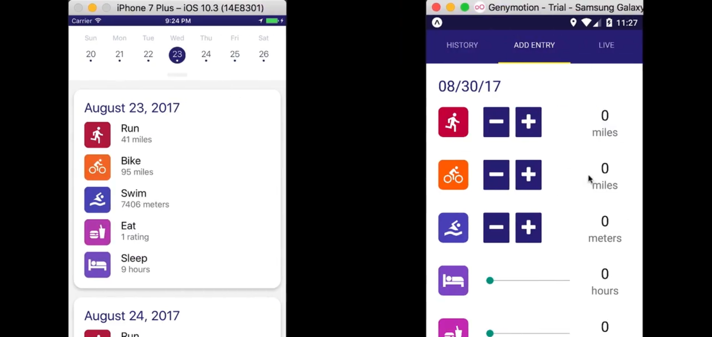

我们将创建两种会更新 redux 的 action：

- 第一种是为当天输入新的条目
- 第二种是从数据库中获取数据

因此，这里将有两种常量，第一个称为 RECEIVE_ENTRIES，表示我们将获取条目，也就是从数据库的日历中获取所有日期数据。第二个常量是 ADD_ENTRY，表示点击添加条目界面下的 SUBMIT：

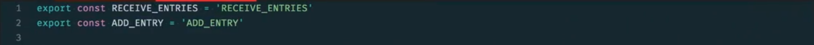

现在创建 action creator，将创建两个，第一个称为 receiveEntries，它将接收所有的条目，返回一个类型为 RECEIVE_ENTRIES 的 action 并传递所有这些条目：

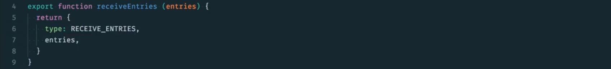

第二个 action creator，将称为 AddEntry，你可能已经猜到了，它将接受一个条目，然后将返回一个 action 或类型为 ADD_ENTRY 的对象并且传递该条目：

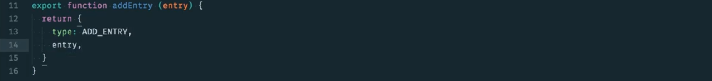


[这是包含此视频中所做更改的提交。](https://github.com/udacity/reactnd-UdaciFitness-complete/commit/3aa5927c69939de2a7e36784548d703058cde5eb)

---

我们已经创建 action creator，下一步是创建处理这些 action 的 Reducer。

新建一个叫做 reducers 的文件夹，在该文件夹中新建一个文件叫做 index.js，然后我们将导入这两个常量，导入 RECEIVE_ENTRIES 以及 ADD_ENTRIES 二则都来自 `../actions`。

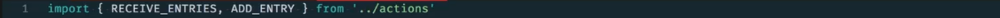

现在创建一个 entries reducer，它将传入一个 state，我们将默认 state 设为空的对象，然后传入一个 aciton。和平常一样，在这里创建一个 switch 语句，对 action.type 进行切换，然后设定几个不同的 case，第一个是 RECEIVE_ENTRIES，第二个是 ADD_ENTRY，最后一个是默认 case，它将直接返回 state。

每当符合 RECEIVE_ENTRIES case 时，即每当 action.type 是 RECEIVE_ENTRIES 时，我们希望 state 保持不变，并且在 state 上合并 action.entries，action.entries 是一个对象，该对象的键代表的是具体的某一天，值是当天的具体指标，我们想将整个对象合并到现有 state 上，当这个函数运行时，将为空的对象（指 reducer 这个函数，默认为空对象）。

接着，如果符合 ADD_ENTRY case，则返回现有的 state，并且和之前一样，获取 action.entry，entry 现在讲是当天的崭新条目，并将其合并到 state 上：

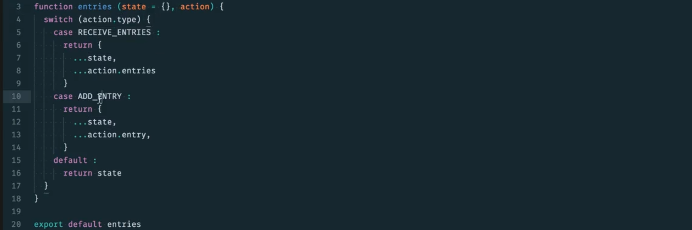

我们只有这里一个 Reducer 并且始终只有一个，state 将是一个很庞大的对象，并且始终是这样，该对象上的每个键都代表特定的某一天，每个值代表当天的具体指标。因此 RECEIVE_ENTRIES 和 ADD_ENTRY case 中，我们可以获取该特定 action 上的信息并将其合并到 state 上，因为 state 是针对所有日期的庞大对象。


[这是包含此视频中所做更改的提交。](https://github.com/udacity/reactnd-UdaciFitness-complete/commit/1bcb8b1094f41b648d41acbfcfc1cbe0aff99e15)

---

> ### 💡 忘记 Redux 了？💡

> 如果你需要复习一下 Redux 的原理，请自行回顾前面的课程 [React & Redux](https://classroom.udacity.com/nanodegrees/nd019/parts/7b1b9b53-cd0c-49c9-ae6d-7d03d020d672)！由于 Redux 与任何特定的视图库或框架无关，Redux 的相同原则也适用于使用 React Native 构建的应用程序。

---

我们已经创建了 action 和 reducer，下一步是使用 Provider 和 createStore 将 Redux **关联**到应用中。

为此，我们需要将 Redux 和 React Redux 添加到应用中，就像在网络应用上一样，输入 yarn add，添加 Redux 和 React Redux：

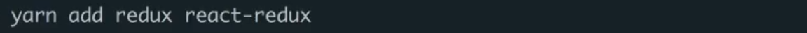

完毕后，重启应用。

在 App.js 文件中，导入刚刚安装的这些**软件包**，我们将需要 createStore 它来自于 redux 软件包，还需要 Provider，来自于 react-redux，然后导入 reducer，它来自于我们在上个视频中创建的 reducers 文件夹，然后就像在网络应用中一样，为了将 redux 关联到应用中，我们将一切都封装在这个 Provider 组件中，然后我们需要向 Provider 传入一个 store，方式是调用 createStore 并传入 reducer 函数：

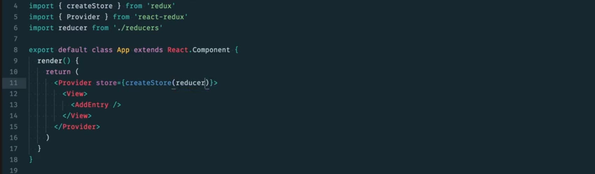


[这是包含此视频中所做更改的提交。](https://github.com/udacity/reactnd-UdaciFitness-complete/commit/170f06a5b58a7539ae10d483c1407c4697361d34)

---

我们已经创建了 action 和 reducer，并使用 provider 和 createStore 将 redux 关联到应用中，下一步是连接 AddEntry 组件，这样的话，当我们提交新的条目时，我们可以在这里添加一些功能，并且当我们重置某一天的信息时，可以在这里添加一些 redux 功能。（指在 AddEntry.js 中的 submit 和 reset 方法）

我们先导入一些内容，我们将导入 connect 来自于 react-redux，然后导入 AddEntry action creator，来自于 acitons 文件：

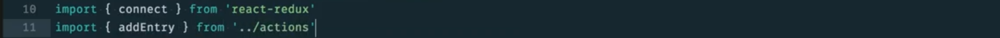

我们不再导出组件，而是导出对 connect 的调用，结果是传递 AddEntry，现在 AddEntry 将能够访问 dispatch，在 submit 中写着更新 redux，输入 this.props.dispatch，我们要分派的是刚刚导入的 addEntry，addEntry 接受的是新的条目，最后该条目将被添加到我们的 state 上，输入 key，它是 timeToString 的返回值，value 将是 entry，其实就是我们的 state，它具有所有这些属性。现在当我们点击提交，我们不仅会重置状态和更新数据库，并且会分派 addEntry action creator，它负责将具体的条目保存到 redux store 中：

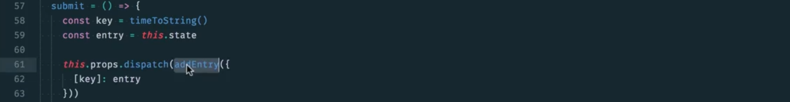

现在，下面执行非常相似的流程，每当我们点击这里的这个 reset 按钮时，这个 reset 函数将会运行我们将和之前一样，输入 this.props.dispatch，我们要分派的是 addEntry key 完全一样，但是现在我们希望将其重置为初始状态，而不是具体的条目。

看看我们的应用，这些完全一样的屏幕：


注意这里是当前日期：8 月 30 日，我们提示别忘了记录今天的数据，8 月 2 日不一样，提示你没有记录任何信息，因此在 redux store 中，我们有三种不同的值，第一种是这里的值，也就是一个对象，包含 run、bike、swim、eat 和 sleep 属性，这些属性的值为 30、65、5153，表示具体指标的值。在上面，键将是 2017 年 8 月 2 日，值将为空。然后在左边屏幕中，注意，我们没有记录任何信息，但日期是今天，我们不能说没有记录这一天的数据，我们希望提醒的是：嘿，别忘了记录数据。

转到 helpers 文件，新建一个函数，名称设为 getDailyReminderValue，它将返回一个具有日期属性的对象，值将为“挥手”表情符，然后输入文本，:wave: Don't forget to log your data today!，现在，每当我们想重置某一天的值时，我们将调用这个函数并获得这个对象：

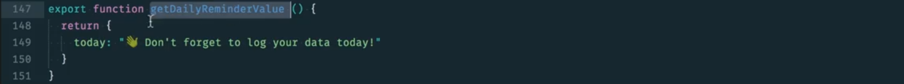

转到 AddEntry.js 文件，导入这个组件，来自于 /utils/helpers，似乎在这里从该路径中导入了内容，直接在这里添加 getDailyReminderValue。在提交数据时，我们将重置为 entry，但当我们 reset 时，我们将调用 getDailyReminderValue，这样的话，每当 reset 运行时，我们阿静 state 上这个属性值，设为这一天的默认值，也就是提示别忘了记录今天的信息：

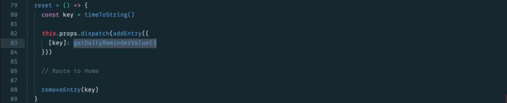

最后的任务是，如果还记得的话，这一部分的作用是提示如果你已经记录了当天的信息，则显示这个视图，而不是让用户重新记录信息：

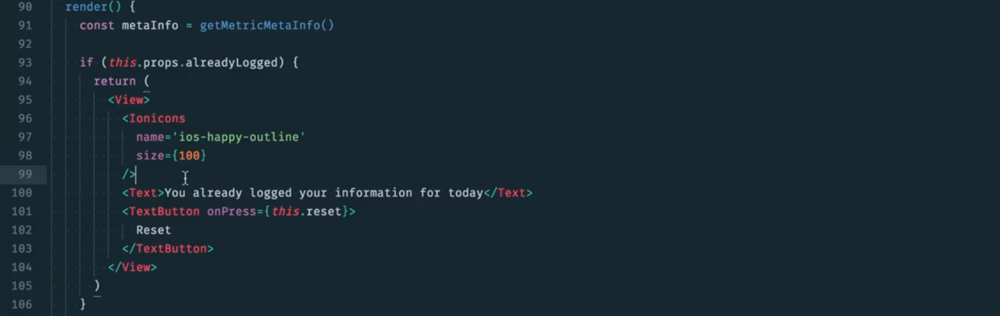

现在我们在这里，创建一个函数称为 mapStateToProps，它将接受 state，我们可以像之前一样，通过调用 timeToString 创建新的 key，为了知道用户是否已经记录信息，输入 state[key] 也就是今天的 key，然后输入 `typeof state[key].today === ‘undefined’`表示用户已经记录信息，如果 state[key] 具有内容，也就是不为空，并且 state[key].today 为 undefined ，这行的作用是，右下将是一个具有所有这些属性的对象，右上部分为空，但是左边将具有 today 属性（指的是每日模块中的三种信息的显示，具体参考）：


正如这行代码所表示的，如果特定日期的值在 redux store 中具有 today 属性，则表示用户尚未记录信息，this.props.alredayLogged 将为 false：

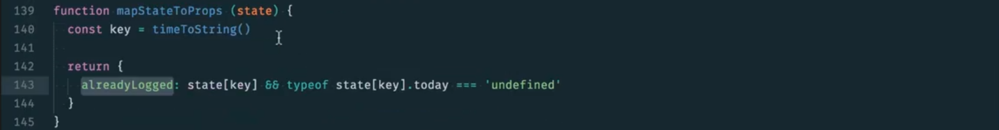

（这里非常有意思的是，利用 mapStateToProps 像组件的 props 传入的一个值，并且虽然使用了 state，但不是为了将 state 中的值放到这个将传入的值中，而是利用 state 来做判断返回 Boolean）


[**这是包含此视频中所做更改的提交。](https://github.com/udacity/reactnd-UdaciFitness-complete/commit/a3e78fe08ac785e6ce372ed37bfb5bcfa19851e3)**

---

**我们刚结合了 Redux 来帮助管理我们的全局状态。让我们确保我们步调一致！**

Task List

- 我创建了必要的 actions
- 我创建了 reducers
- 我创建了 store
- 我使用 `Provider` 包裹了我的应用
- 我创建了 `getDailyReminderValue()` 辅助函数
- 我更新了 `AddEntry` 中的 `reset()` 方法
- 我使用 `connect()` 将 `AddEntry` 与存储器上下文连接起来了

### 总结

记住 React Native 从根本上来讲*还是 JavaScript*。因此，添加 Redux 来帮助管理应用状态和将 Redux 添加到 web 应用拥有相同原则和过程。


---

## 2.6 课程总结

- 我们学习了开发网站应用和原生应用之间的区别
- 让 React Native 保持一致的外观很重要，我们学习了所有重要的 React Native 组件
- 学习了如何使用 AsyncStorage 在本地存储数据
- 学习了如何将 Redux 添加到 React Native 应用中

接下来，我们将介绍 React Native 中的所有布局和样式内容


