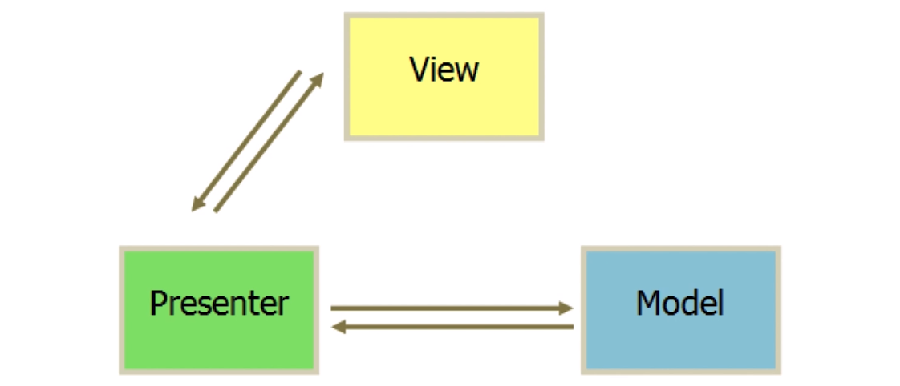
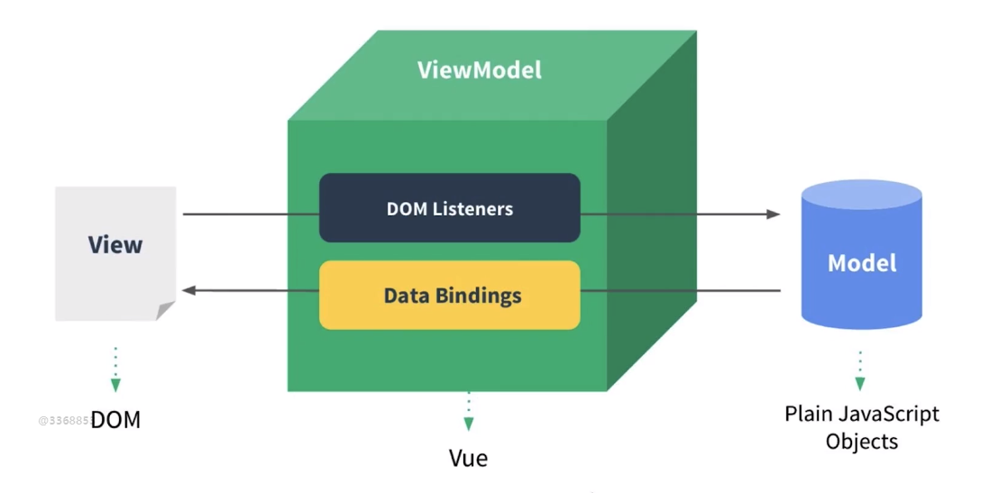

# 2.Vue 起步

[TOC]

## 基础讲解

### 实现页面中显示 HTML

```html
<div id="app">{{content}}</div>
```

```javascript
var app = new Vue({
    el: '#app',
    data: {
        content: 'hello world'
    }
})
```

- 创建 Vue 实例，并让示例接受一些配置项
- `el` 配置项指示实例**负责管理的区域**
  - 接管 #app 的元素里的所有内容
- `data` 定义和保存一些数据
- `{{content}}` - 插值表达式
  - 用来调用 data 中的数据
  - 也可以使用表达式所计算出的数据

#### 如果我们想要隔两秒钟后修改 content 中的内容

```javascript
setTimeout(function(){
    app.$data.content = 'bye world'
},2000)

// 或者使用

setTimeout(function(){
    app.content = 'bye world'
},2000)
```

- 使用 Vue 我们能够不用再直接去获取 DOM，然后再操作 DOM 来实现页面的更改

- Vue 中，只要数据发生变化 DOM 中的相应对象如果绑定了该数据，则会自动变化

- $data 是 data 的一个别名，可以理解为就是 data 对象

  - app.content 实际上指针指向app.$data.content ，两者是一个东西，Vue 内置的语法而已 

  - 我们可以直接使用是因为 vue 实例 vm 的 data 做了 一层代理， 所以你访问

    vm.xxx  等同于 访问 vm.$data.xxx, 具体的代理代码实现，可以参考这篇文章

    <https://github.com/answershuto/learnVue/blob/master/docs/%E5%93%8D%E5%BA%94%E5%BC%8F%E5%8E%9F%E7%90%86.MarkDown>

## 开发 TodoList

app 页面图示：


功能实现：

- 在输入框输入内容并点击回车，将输入框中内容放入 正在进行 的列表中，并在 正在进行 列表数量也会有相应的增加。
- 点击 正在进行 列表中每一项前的多选框，将这一项从 正在进行 列表中删除，并且添加到 已经完成 列表内，并且每一项变暗显示，多选框呈现勾选状态，正在进行列表项数量减少，已经完成列表项数量增加。
- 点击每一项右侧的删除按钮可删除项目。

### 实现在输入框输入内容并确定后增加列表项内容

```html
<div id="app">
    <input type="text" v-model="inputValue">
    <button v-on:click="handleBtnClick">提交</button>
    <ul>
        <li v-for="item in list">{{item}}</li>
    </ul>
</div>
```

```javascript
var app = new Vue({
    el: '#app',
    data:{
        list:['第一课的内容','第二课的内容'],
        inputValue:''
    },
    methods:{
        handleBtnClick:function(){
            this.list.push(this.inputValue)
            this.inputValue = ''
        }
    }
})
```

模板指令：

- v-on:
  - 简写 @
- v-for
  - 推荐内部使用 of 去循环数组
- v-model
  - 指数据的双向绑定
  - 当 input 框中的内容发生变化时，所绑定的数据 `inputValue `会发生变化；同样，当所绑定的数据 `inputValue` 发生变化时，页面中 input 数据也会发生变化。

这种模式称为 MVVM 模式，整个过程中我们不需要对 DOM 进行操作，我们只需要改数据层，当数据发生改变时，Vue 的底层会自动根据数据的更改而重新渲染页面


---


## MVVM 模式

###  传统 MVP 设计模式

将代码分为三层：

- Model 数据层、模型层
- Presenter 呈现层，也可以理解为业务逻辑相关的控制层
- View 视图层，指页面的 DOM 渲染、展示

图示：



使用 jQuery 来实现一个 TodoList：

```html
<div>
    <input id="input" type="text">
    <button id="btn">提交</button>
    <ul id="list"></ul>
</div>
```

```javascript
function Page() {
    
}

$.extend(Page.prototype, {
    init: function () {
        this.bindEvents()
    },
    bindEvents: function () {
		var $btn = $('#btn');
         $btn.on('click',$.proxy(this.handleBtnClick, this));
    },
    handleBtnClick: function () {
        var inputElem = $("#input");
        var inputValue = $("#input").val();
        var ulElem = $("#list");
        ulElem.append('<li>' + inputValue + '</li>')
        inputElem.val('');
    }
})

var page = new Page();
page.init();
```

以上代码是符合 MVP 的设计模式：

- 这段代码由于没有使用 Ajax 来获取远程的数据，所以可以认为并没有 M 这样一层
- V 是上面 HTML 代码中和 js 中在触发 P 控制器后所渲染出来的视图层。
- 在 V 上进行操作后，比如这里是点击提交按钮，就会触发你使用 js 写的控制器代码。控制器代码负责所有的业务逻辑，P 控制器可以使用 Ajax 来调用 M 模型层中的数据。控制器再通过 DOM 操作来改变视图。
- 所以根据图示，你可以发现 Presenter 层是 MVP 模式中的核心层，而 M 却是边缘的。因此我们有大量的代码都是写在了 Prensenter 中，而这大量的代码基本上都是在做 DOM 的操作。

接下来我们再回到 MVVM 模式之中：

Vue 官方图示：



对比 MVP 设计模式的区别：

- 有 Model 层用于存储数据
- 也有 View 层负责显示数据
- 但没有 presenter 这层，而取而代之的是 ViewModel，并且我们可以看到 VM 这层是 Vue 自带的，并不需要我们自己去编写代码。
- 在使用 MVVM 模式进行编写代码时，我们并不需要了解 VM 这层是怎么实现的，我们只需要关注 V 与 M 层
- 所以，我们在编写代码时重点在于 V 与 M 层的代码编写
- Vue 所实现的 VM 层帮助我们操作 DOM 实现数据的渲染。它会监听我们数据的变化，从而改变视图。也能监听到视图中的事件触发，通过 VM 调用我们所写的逻辑代码从而改变数据，当数据发生变化，又反过来将数据映射到视图上来。
  - 好处：这样开发的时候，我们只需要去关注 M 层的开发。
  - 因此，重点在于 M 层的开发之上。
  - 面向数据的编程。
- 减少 DOM 操作的代码量。

Vue 如何实现数据改变从而改变视图：

- 使用到 ES5 核心 API：[Object.defineProperty](https://developer.mozilla.org/en-US/docs/Web/JavaScript/Reference/Global_Objects/Object/defineProperty) 
- 引入虚拟 DOM 的机制


---


## 前端组件化

组件 - 页面的一个部分、一个区域

- 将页面由原来的整体切分为一个一个的部分，每个部分称为一个组件
- 比如：
  - 图示：
  - 
  - 最上面的轮播就可以称为是一个组件。
  - 右上角的按钮也可以称为是一个组件。
  - 合理的拆分组件，可以将一个大型项目像是拼积木一样拼接起来。
  - 一个大型的项目业务逻辑可能非常的复杂，但是拆分为组件后就能相对容易一些，并且维护性也能得到提高。


---


## 使用组件化思想修改 TodoList

