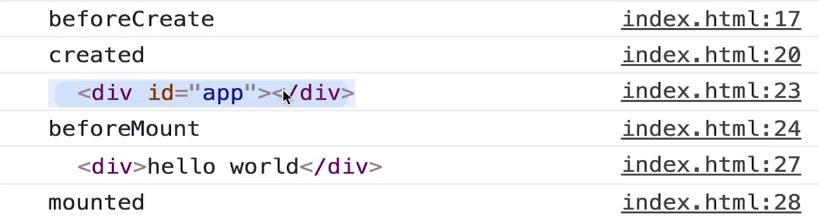

# 3.Vue 基础精讲

[TOC]

---

## 3.1 Vue 示例

```html
<div id='root'>
    <div :click="handleClick">
        {{message}}
    </div>
</div>
```

```javascript
var vm = new Vue({
    el: '#root',
    data: {
        message: 'hello world'
    },
    methods: {
        handleClick: function() {
            alert("hello boy")
        }
    }
})
```

- 通过 Vue 类创建一个 vm 实例来接管页面上某一部分 DOM 的渲染。

  - el 属性负责定义这个 Vue 实例接管的 DOM 的最外层标签，比如这里的 '#root' 
  - data 属性用于存放数据，这样就可以使用插值表达式 `{{message}}` 来渲染数据。
  - 我们在页面中使用 Vue 的实例接管某一部分后，实例会自动对 DOM 中的内容进行分析。比如这里，我们在 DOM 中使用了 {{message}} 插值表达式语法，那么它就会到 data 中去寻找相应的属性并返回其值到插值表达式中，插值表达式计算出相应的值后就会添加为 DOM 中的内容。

- 使用 `v-on:click="handleClick"` 绑定点击事件并执行相应的函数

  - 因为 Vue 示例接管了这部分的 DOM，那么当代码中存在这样的写法时，它能知道需要绑定一个这样的事件，并且属性值会去对应实例中键为 methods 的相同的键，当事件触发时执行对应的方法键值。
  - 这里的 handleClick 只能定义在 methods 中，不能定义在别的地方。
  - 缩写语法：`:click="handleClick"`

- 实例与组件

  - 通过 Vue 来构建的程序需要一个入口点，一般为接管 div#root 的根实例

  - 除了页面中的根实例以外，其他的所有组件都是不同的实例，比如：

    - ```
      Vue.component('item',{
          template: '<div>hello item</div>'
      })
      ```

    - 这里定义了一个全局组件，组件名为 'item'

    - 使用 template 创建一个模板，显示一个 div

    - 这样创建过来，我们就可以在根实例所接管的 div 中去使用这个组件，使用方法如下

    - ```html
      <div id='root'>
          <div :click="handleClick">
              {{message}}
          </div>
          <item></item>
      </div>
      ```

    - 通过标签的形式就可以使用了

    - 实际上，**当我们创建一个组件的时候，Vue 的底层也会把这个组件编译为一个实例**。也就是说，一个 Vue 所构建的项目是由很多组件所构成，也可以说是由很多 Vue 的实例所构成。

- 通过控制台，我们来查看一些实例的属性和方法：

  - `vm.$data` 来获取 data 对应的对象
  - `vm.$el` 获取接管的元素
  - 使用 $ 开头的，都是实例的属性和方法，比如：
    - `vm.$destroy()` 用于销毁这个实例的方法


---


## 3.2 Vue 实例的生命周期与钩子函数

生命周期图示：

 

 什么是生命周期函数？

- 生命周期函数就是 vue 实例在某一个时间点会自动执行的函数。

那么有哪些生命周期函数呢？（共 11 个）

- 1.初始化事件和生命周期相关内容后，执行 beforeCreate 函数
- 2.初始化注入与双向绑定等内容，执行 created 函数
- 初始化结束后，询问我们示例中是否有 el 选项
- 是否有 template 选项
  - 如果没有，则会将 el 外层的 HTML 当做模板。也就是说，会把 el 所接管的元素当做是模板。
    - 这是因为 vue 的渲染是通过模板来进行的，如果没有模板就没法渲染
  - 如果有，则使用模板来渲染
- 3.在判断玩是否有 template 选项后，在数据与模板想结合所生成的 DOM 即将替换 el 所指元素并渲染之前，会执行 beforeMount 函数
- 4.接下来将示例中所生成的 DOM 元素替换 el 所接管的元素并渲染（挂载），之后会执行 mounted 函数
- 通过一下图示能够清楚的知道 vue 对元素做了什么：
  - 
  - 他在 beforeMount 之后使用我们所创建的模板替换了 div#app
  - mounted 执行时表示页面已经渲染完毕
-  5.6.当我们调用 vm.$destroy() 这个方法，在销毁之前会执行 beforeDestroy，当组件被完全销毁过后 destroyed 这个方法会执行。
- 7.8.当数据改变时，在没有渲染之前执行 beforeUpdate，渲染之后执行 updated
- 9.activated
  - keep-alive 组件激活时调用。
  - **该钩子在服务器端渲染期间不被调用。**
- 10.deactivated
  - keep-alive 组件停用时调用。
  - **该钩子在服务器端渲染期间不被调用。**
- 11.errorCaptured
  - https://vuefe.cn/v2/api/#errorCaptured

如何使用呢？

```html
<div id="app">hello world</div>
```

```javascript
var vm = new Vue({
    el: "#app",
    beforeCreate: function(){
    }
})
```

- 直接在示例对象中通过键值的方式使用
- 具体的用法会在项目中进行讲解


---


## 3.3 Vue 的模板语法

- 插值表达式语法：`{{name}}`
- `<div v-text="name"></div>`
  - 将 name 的值作为元素的内容添加到元素中，为纯字符串内容，也就是如果带有 html 语法的标签会被转义为字符串。
  - 当使用 `v-` 等 vue 指令并在后面通过 `=""` 来引入值的时候，里面的值并不是由双引号表示的字符串，而是双引号内部表示里面的内容是 js 的表单式
- `<div v-html="name"></div>`
  - 如果有 html 标签则以 html 标签的形式渲染到页面中
- ... 更多的指令稍后讲解，可以去官网查看 API
- `<div v-text="name + 'Lee'"></div>`
  - 可以使用这样的方式来连接字符串，也可以用来计算


---


## 3.4 计算属性，方法与侦听器

使用三种方式来实现将 data 中的两个参数来进行拼接并渲染到页面中

### 计算属性

```html
<div id="app">
    {{fullName}}
</div>
```

```javascript
var vm = new Vue({
    el: "#app",
    data: {
        firstName: "Dell",
        lastName: "Lee"
    },
    // 计算属性
    computed:{
        fullName: function(){
            return this.firstName + " " + this.lastName
        }
    }
})
```

- 使用 computed 这个选项（键）定义一个对象，在对象中的使用键值的方式创建函数，函数中可以使用 data 中的数据来进行一些操作并返回值。
- 计算属性会内置缓存。
  - 如果使用 data 中的数据并没有发生改变，那么 computed 所定义的键就使用之前的值，也就是将这个缓存到了之前使用的键中。

- 目的是将本来存在于 data 中的数据进行计算然后返回到一个新的变量（键）之中，这样会能够减少很多工作。

### 方法

使用方法的功能也同样能够实现以上的效果

```html
<div id="app">
    {{fullName()}}
</div>
```

```javascript
var vm = new Vue({
    el: "#app",
    data: {
        firstName: "Dell",
        lastName: "Lee"
    },
    // 方法
    methods: {
        fullName: function() {
            return this.firstName + " " + this.lastName
        }
    }
})
```

- 当任何数据发生改变（包括这里的 firstName 与 lastName 以外的数据），页面便会重新渲染，使用方法的形式来实现效果就会又重新执行一次方法的函数，并不会有缓存的存在。
- 计算属性因为有缓存的存在而有较好的性能。

### 侦听器

```html
<div id="app">
    {{fullName}}
    {{age}}
</div>
```

```javascript
var vm = new Vue({
    el: "#app",
    data: {
        firstName: "Dell",
        lastName: "Lee",
        fullName: "Dell Lee",
        age: 28
    },
    watch: {
        // 当 data 中 firstName 键值发生改变时执行
        firstName: function () {
            this.fullName = this.firstName + " " + this.lastName;
        },
        // 当 data 中 lastName 键值发生改变时执行
        lastName: function () {
            this.fullName = this.firstName + " " + this.lastName;
        }
    }
})
```

- 侦听器是对 data 中的键进行监听，当其值发生变化时便执行相应的函数。
- 这里我们在 data 中创建了 fullName 键，便可以通过这个键来存放当 firstName 与 lastName 变化时所产生的新值，与计算器属性一样会有一个缓存的作用。

总结：

- 当我们可以通过以上三种方式来实现一个功能时，推荐实用计算属性 `computed` 方法，简单并且高性能。