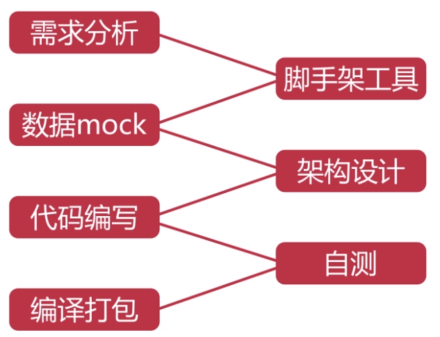

# 课程介绍 & Vue 介绍

[TOC]

## 课程介绍

### 课程内容

从以下方面来讲解使用 Vue.js 来开发 Web app 从 0 到 1 的过程：

### 课程亮点

项目课程的亮点是以线上生产环境的代码质量来要求，包括：

- 代码开发及测试环节
  - 1.像素级完美还原 UI 设计图。（UI 标注）
  - 2.用真实外卖 app 数据做演示
- 代码规范
  - 1.架构设计
  - 2.组件抽象
  - 3.模块拆分
  - 4.代码风格统一
  - 5.JS 变量命名规范
  - 6.CSS 代码规范
- 至于编写**高可维护**、**易于扩展**、**通用性强**的代码。

### 使用到的技术

- 使用 vue-resource 与后端做**数据交互**。
- 使用 vue-router 做前端路由，从而实现单页应用。
- 第三方 js 库 better-scroll
- 最大程度组件化
  - 这样能够将页面中相似和功能相似的区块在项目中复用
- html5 的 localstorage 接口将一些数据保存在浏览器端
  - 比如商家页面中的收藏功能
- 图标字体的使用
- 移动端 1 像素边框
- css sticky footer 布局
- flex 弹性布局

### 学习目标

- 掌握 Vue.js 在实战中的运用

  

Vue.js 框架有什么特点？

- MVVM
- 数据驱动
- 组件化
- 轻量
- 简洁
- 高效