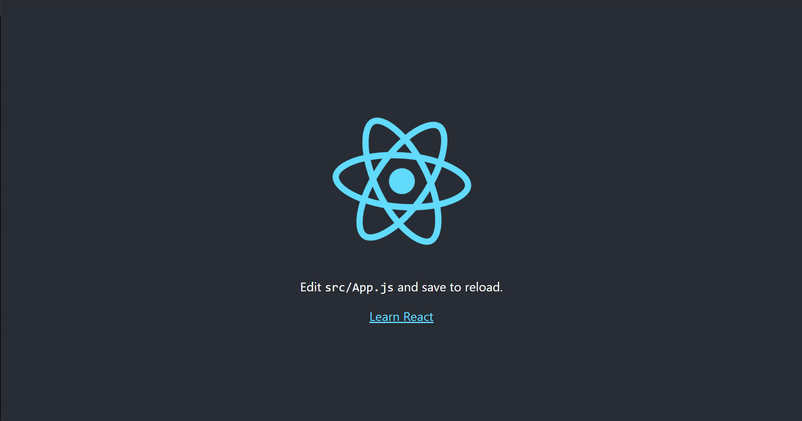
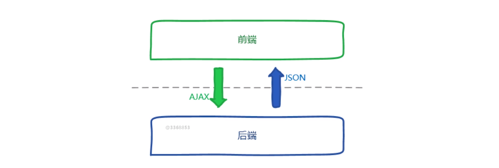
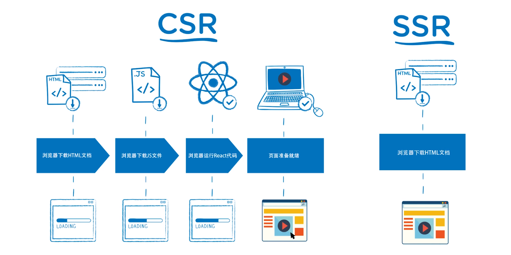

# 1.第1章 服务器端渲染基础

[TOC]

## 1.1 课程导学

服务器端渲染 - SSR（Server side rendering)


客户端渲染 - CSR（Client side rendering）


在主流的单页面应用中，比如 React 或者 Vue 开发的项目，采用的都是客户端渲染的模式。但是客户端渲染会带有比较明显的两个问题：

1. TTFP 的时间过长（可以理解为首屏展示的时间，但是其实并不是）
2. 不具备 SEO 的条件，这样所做的网站在搜索引擎上的排名就不是很好

因此，我们可以借助框架来改变我们的单页面项目，把单页面应用转变为服务器端渲染的应用。

目前主流的 SSR 渲染框架有：

- Next.js（针对 React）
- Nuxt.js（针对 Vue）

其实你可以直接照着文档来写就能熟练的掌握。

### 十个模块

- SSR 简介
  - 介绍什么是 SSR，什么是 CSR，并对两者做出比较，优势和劣势在哪里。
- 搭建 React SSR 框架，解决 CSR 的问题。
- 在框架中如何实现**同构**
  - 在业界普遍认为同构与 SSR 是完全相同的，但其实会有差别，这一章节会具体介绍
- 框架中路由机制的实现
  - 使框架具备复杂的页面跳转逻辑
- 框架与 Redux 数据框架进行融合
  - 这是难点，**数据脱水**与**数据注水**的概念会在这一章节中介绍
- 框架作为中间层的职能处理
  - 什么是中间层，中间层做了什么，如何让框架能够作为中间层
- 细节调优
- 样式相关的 Webpack 配置
- 框架 SEO 特性优化
- 预渲染技术介绍

### 所涉及的技术知识点

- 熟练使用 node，包的安装与 npm 启动服务器，基本语法
- Express 的基本使用方式与原理
  - 比如路由的原则、中间件
- React 与 Redux
- webpack 的基础知识
- ES6 语法

### 学完这本课程后的收获

- 成为 React SSR 技术高手
- 提升前端架构能力
- 学会如何造轮子
- Much More Money

---

## 1.2 什么是服务器端渲染

我们首先应该使用 node 来创建一个服务器。使用 Express 框架来构建一个 node 服务器（也可以使用 koa2）：

1. 下载 node

2. 创建文件夹

3. 使用 npm init 来初始化生成一个 package.json 的文件帮助我们构建项目

4. 创建 app.js 文件，复制官网示例代码：

   ```js
   const express = require('express')
   const app = express()
   
   app.get('/', (req, res) => res.send('Hello World!'))
   
   app.listen(3000, () => console.log('Example app listening on port 3000!'))
   ```

5. 使用 node app.js 启动服务器

6. 打开 localhost:3000 访问服务器

当访问我们所创建的服务器时，返回的页面内容（.html 文件）是由服务器所产生的，因此浏览器所渲染出来的页面是由服务器所产生的内容来渲染的，这种方式我们就称之为服务器端渲染。

---

## 1.3 什么是客户端渲染

首先我们通过 `npx create-react-app client` 来创建一个 react 项目并通过 npm start 启动项目：



右键->查看源码：


我们会发现，源码中并没有像我们在页面中所看到的文本：Edit src/App.js and save to reload.

这是因为这部分的内容是由 bundle.js 等等脚本来执行渲染上去的。

你也可以通过禁止页面执行 js 来查看页面中的内容哪些是由 js 生成，哪一些是原本 .html 文件所自带的内容。

所以，对于这样由客户端浏览器通过 js 脚本来渲染页面内容的方式，我们称之为客户端渲染。这也就是为什么不利于 SEO，因为页面中本来应该由搜索引擎捕捉到的内容现在都在 js 当中，当然会不利于 SEO。（也有可能存在能够捕捉 js 中内容的爬虫）

### 思考题

最后，老师留了一个思考题，问了知乎是由客户端渲染还是服务器端渲染？

通过禁止 js 执行的方法，我们可以看到页面中大部分内容是服务器端所渲染出来，而部分很少的内容，则是又客户端所渲染，而具体的原因，我想和本地的缓存有关系。

然后我又思考了如果之前登录过知乎的页面，想要快速的显示内容，最好的方式还是由客户端来渲染。因为如果每一次都需要服务器那边根据用户账户的资料来渲染出内容会很慢，而客户端这边只需要请求数据就好，但在不了解具体的情况下，这也只是一个猜测。（但实际要看具体的情况）

接着我又思考了一下知乎是如何做 SEO 的，我想应该是所有的问题和答案在服务器上都有相应的页面。

接着如果有相应的页面是只有文本内容和很少很少的标签呢，还是带有各种各样的样式的原本样子的页面（因为只有内容的页面更小，浏览器或者执行这个页面的引擎会很快），我想只是单独的有内容，因为这样的页面搜索引擎也能很快的查找到，但这也是一个猜测，因为我也不了解搜索引擎是如何做排序的。


> npx 是 npm 引入的一个工具，可以使你在全局中没有安装某个包情况，使用这个包的执行任务，并且在执行完成后会在本地删除。
>
> 主要特点：
>
> 1、临时安装可执行依赖包，不用全局安装，不用担心长期的污染。
> 2、可以执行依赖包中的命令，安装完成自动运行。
> 3、自动加载 node_modules 中依赖包，不用指定$PATH。
> 4、可以指定 node 版本、命令的版本，解决了不同项目使用不同版本的命令的问题。

---

## 1.4 Reat 客户端渲染的优势与利弊

通过 React 框架来实现的页面应用，是客户端渲染的应用，那么优势与弊端又是什么呢？

### 优势：

先看图：



React 或者 Vue 框架所编写的应用是前后端分离的，前端负责使用框架编写视图层的内容，而数据通过 AJAX 的方式向后端请求，当请求到数据以后再渲染页面中数据改变的部分。

在团队开发的过程中，这种前后端分离的架构体系对我们的**开发效率提升很大**。

> 因为：
>
> - 1.如果像以前那样做开发，前端只做 html 和 css 还有部分 js，后端需要单独的去绑定数据，这样的工作量对于后端太大，在团队不平均的情况下是非常慢的。
> - 2.对于浏览器请求并收到页面也会更快，用户输入地址，你只需要返回原本已经写好的页面给好就行，而不用再去进行计算和填模板，等用户收到数据以后通过 ajax 来请求数据就好。（可这一点在下面讲弊端的时候有歧义，因为按照他给的流程，似乎服务器端只需要返回一个 html 就够了，但实际上服务器端也需要做一些计算的，不过也可以让服务器端的计算更简单从而更快的返回）

### 弊端：

#### 1.首屏的加载速度慢。



上图中，左边是客户端的渲染流程，右边是服务器端的渲染流程。（流程的多少并不代表速度的快慢）

确实从上图中我们可以看到，服务器端可以事先准备好一份 HTML 文件，然后返回给浏览器，浏览器就能快速的显示页面，至于 js 文件可以在显示完页面以后再请求并执行。

而客户端的渲染还需要请求 js，执行 js 以后才会显示页面。

从用户第一次看到页面的速度相比较，服务器端的渲染似乎更快。

#### 2.不利于 SEO

搜索引擎优化（SEO Search Engine Optimization）：通过对 HTML 代码的优化来使页面在搜索引擎的搜索结果中更靠前的过程。

因为百度的搜索引擎爬虫只能够识别 HTML 文本上的内容（对于大多数搜索引擎的爬虫而言），因此客户端渲染的内容都在 js 中，无法识别，从而无法让网站的内容出现在搜索结果中。


> 对于渲染这个词的理解
>
> 如果从词的直接意思来看，应该是指对图像的再加工，使图像变得更好、更美观、更真实或者更震撼。但在浏览器中，渲染是指浏览器通过执行代码中的内容来显示图像。而浏览器显示图像，从直接关系来看是由 HTML 来决定的（DOM 树），所以所谓服务器端渲染就是指服务器创建了页面中主要显示页面内容的 HTML，而客户端渲染是指由浏览器通过执行 js 文件来生成 HTML（DOM 树）来显示页面内容。


