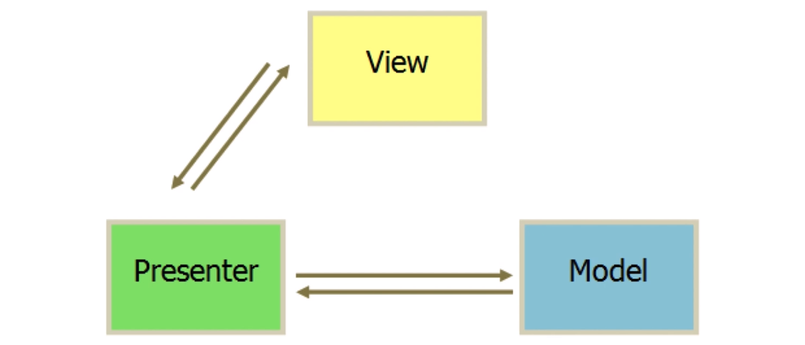
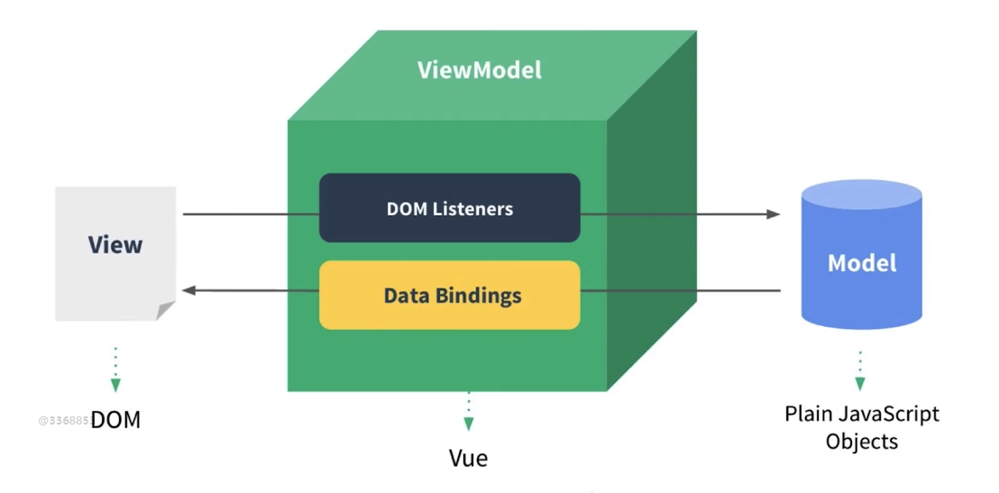
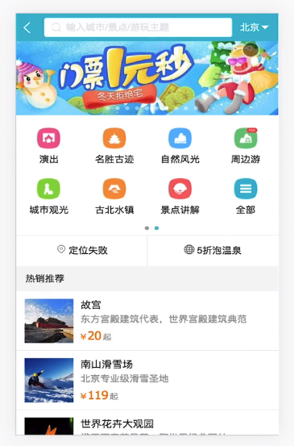

# 2.第2章 Vue 起步

[TOC]

## 2-1 课程学习方法

任何一门框架的学习其最好的资料就是官方的文档。Vue 因为是国人写的框架，所以其中文文档非常的健全。

> [Vue 中文官方网站](https://cn.vuejs.org/)

但是，对于初学者学习框架，去一行一行的读文字是非常的枯燥的，因此跟着视频教程先去掌握一些基础的知识点然后再去查看官方文章再看一遍相关内容，这样才能将视频所讲述的内容深化理解，同时对于讲者在表述上的偏差也能得到及时的修正。

在拥有了基础知识以后，跟着讲师把实战课的内容过一遍，就基本能完整的掌握 vue 在真实项目中的使用。

---

## 2-2 hello world

先来到 vue 文档[安装](https://cn.vuejs.org/v2/guide/installation.html)部分的地方。

首先我们得知道 vue 不支持 IE 及以下版本：

> **兼容性**
>
> Vue **不支持** IE8 及以下版本，因为 Vue 使用了 IE8 无法模拟的 ECMAScript 5 特性。但它支持所有[兼容 ECMAScript 5 的浏览器](https://caniuse.com/#feat=es5)。

因为我们需要快速的入门 vue ，所以采用 script 标签引入 vue 库的方式来进行 vue 的学习。

这里 vue 提供了「开发版本」和「生产版本」的引用代码，由于我们是学习，需要错误提示与警告，还有调试的功能，因此我们点击「开发版本」，下载代码。

### 使用原生 JS 实现 Hello World

我们在文件夹中创建一个 index.html 文件，然后输入以下代码：

```html
<body>
  <div id="app"></div>
  <script>
    var app = document.getElementById('app')
    app.innerHTML = 'Hello World'
  </script>
</body>
```

通过原生提供的 DOM API 我们实现了在 div#app 中添加 Hello World 的功能。

### 使用 vue 实现 Hello World

先引入 vue.js 框架代码，然后输入以下代码：

```html
<head>
  ...
  <script src="./vue.js"></script>
</head>
<body>
  <div id="app">{{content}}</div>
  <script>
    var app = new Vue({
      el: '#app',
      data: {
        content: 'Hello World from Vue'
      }
    })
  </script>
</body>
```

1. 首先创建了一个 vue 的实例
2. 然后 vue 接受一些配置项
3. `el` 指的是实例负责管理的区域，这里是指 id 为 app 的元素，那么可以这么说，让使用 Vue 类所创建的是实例去接管 id 为 app 的元素中的内容。
4. `data` 用于定义数据，这里创建了一个叫做 content 的数据，其内容是 'Hello World from Vue'
5. 在 html 中，vue 实例所接管的部分使用**插值表达式（`{{}}`）**这种语法来调用实例中定义的数据。
   - 所以，如果我们在非 app 这个实例所接管的地方使用**插值表达式（`{{}}`）**来引用其数据则不会有效，会执行在页面中显示其输入的带有插值表达式的内容，比如上面就是：{{content}}


### 原生 JS 与 Vue.js 改变内容方式

这里我们想实现两秒钟后改变 div#app 中的内容，如果使用原生 js 的方式，如下：

```js
var app = document.getElementById('app')
app.innerHTML = 'Hello World'
setTimeout(function() {
  app.innerHTML = 'Bye World'
}, 2000)
```

如果使用 vue 的话，如下：

```js
var app = new Vue({
        el: '#app',
        data: {
          content: 'Hello World from Vue'
        }
      })
setTimeout(function(){
  app.$data.content = 'Bye World'
},2000)
```

- 我们这里只需要改变 app 实例中所定义的数据，那么页面中引用的数据也会自然的跟着变化。

- `$data` 就是 `data` 的别名，可以理解为指的是同一个对象。
- 数据发生变化，页面中的数据也会变化（跟 react 相同）

我们在使用 vue 来做开发时不需要再对 dom 进行操作，我们更多的是操作数据，通过数据来改变网页中的内容。

---

## 2-3 开发 TodoList（v-model、v-for、v-on）

app 页面图示：


功能实现：

- 在输入框输入内容并点击回车，将输入框中内容放入 正在进行 的列表中，并在 正在进行 列表数量也会有相应的增加。
- 点击 正在进行 列表中每一项前的多选框，将这一项从 正在进行 列表中删除，并且添加到 已经完成 列表内，并且每一项变暗显示，多选框呈现勾选状态，正在进行列表项数量减少，已经完成列表项数量增加。
- 点击每一项右侧的删除按钮可删除项目。

### 实现添加功能

这节课我们只需要实现通过 input 框向正在进行列表中添加列表项内容。

#### v-for

首先我们来学习一个指令 `v-for` ，这个指令可以让使我们迭代遍历数组或对象中的内容并生成相同数量的组件或是元素。如下：

```html
<div id="app">
  <input type="text">
    <button>提交</button>
<ul>
    <li v-for="item in list">{{item}}</li>
</ul>
</div>

<script>
  var app = new Vue({
    el: '#app',
    data:{
      list:['第一课的内容','第二课的内容']
    }
  })
</script>
```

- `v-for` 指令告诉 vue，在 li 标签中我们要循环 `list` 数据，循环的每一项都放在 `item` 中，然后我们就可以在 li 标签的内容中使用 `item` 了。
- `item in list`是一种特殊语法形式。

#### v-on

由于我们的功能中需要使用到按钮，当按钮点击时才会将 input 中的内容添加到 list 中，因此我们需要使用到事件。事件在 vue 中是通过 `v-on` 这个指令来进行绑定的，如下：

```html
<div id="app">
  <input type="text">
    <button v-on:click="handleBtnClick">提交</button>
<ul>
    <li v-for="item in list">{{item}}</li>
</ul>
</div>

<script>
  var app = new Vue({
    el: '#app',
    data:{
      list:['第一课的内容','第二课的内容']
    },
    methods:{
      handleBtnClick: function(){
        alert('click')
      }
    }
  })
</script>
```

- 以上代码中，只要我们点击 button，则就会执行位于 app 实例中字段为 `methods` 中的 `handleBtnClick` 方法。
- 因为 app 实例接管了 div#app 中的内容，因此只要其内部出现 `v-on` 指令，`v-on` 其对应的属性值就会自动到 app 实例中 methods 字段中去找这个属性值所对象的方法来绑定。


#### v-model

由于我们需要获取 input 中的值，所以我们使用`v-model` 指令，它是指数据的双向绑定，也就是当其绑定的元素（如 input）的值发生变化时，其所绑定的值也会发生变化，同样，当所绑定的值发生变化时，其元素的值也会发生变化。如下：

```html
<input type="text" v-model="inputValue">

<script>
  var app = new Vue({
    el: '#app',
    data:{
      list:['第一课的内容','第二课的内容'],
      inputValue: ''
    },
	...
</script>
```

- 在这里我们将 input 中的值与 app 数据中的 `inputValue` 进行的绑定。所以当 input 中的值发生变化的时候 `inputValue`会跟着变化，同理 `inputValue` 发生变化时，input 中的值也会改变。


#### 添加功能

好的，现在我们已经可以获取 input 的值了，也就是在 app 数据中的 `inputValue`，那么我们如何在 methods 所定义的方式中获取`inputValue`呢？使用 `this.inputValue` 就可以了，因为当你去调用 `this.inputValue` 中的值时，vue 会帮你去找这个实例 data 中的值。

然后，我们需要知道，列表内容中的多少是根据 data 中 list 数组中的项来渲染的，那么我们将 `inputValue` 添加到 list 这个数组就能够实现添加列表项功能。如下：

```html
<div id="app">
   <input type="text" v-model="inputValue">
   <button v-on:click="handleBtnClick">提交</button>
   <ul>
     <li v-for="item in list">{{item}}</li>
   </ul>
</div>

<script>
  var app = new Vue({
    el: '#app',
    data:{
      list:['第一课的内容','第二课的内容'],
      inputValue: ''
    },
    methods:{
      handleBtnClick: function(){
        this.list.push(this.inputValue)
        this.inputValue = ''
      }
    }
  })
</script>
```

- 通过在 handleBtnClick 执行如上代码就可以将 inputValue 中的值添加到 list 数组的最后，然后我们再将 input 中的值清空。


整个编码过程中，我们没有出现过 dom 的操作语句，取而代之，我们都在操作数据。

- 列表的内容我们放在了 list 
- input 的内容放在了 inputValue 中
- 当触发点击事件后，我们也并没有改变 dom，而是改变数据，数据改变，页面也跟着发生了改变。

而这种设计模式我们称之为 MVVM 设计模式。


## 2-4 MVVM模式

在学习 MVVM 设计模式之前，我们现在看看传统前端设计模式 MVP：

### 传统 MVP 设计模式

将代码分为三层：

- Model 数据层、模型层
- Presenter 呈现层，也可以理解为业务逻辑相关的控制层
- View 视图层，指页面的 DOM 渲染、展示



使用 jQuery 来实现一个 TodoList：

```html
<div>
    <input id="input" type="text">
    <button id="btn">提交</button>
    <ul id="list"></ul>
</div>
```

```javascript
function Page() {
    
}

$.extend(Page.prototype, {
    init: function () {
        this.bindEvents()
    },
    bindEvents: function () {
		var $btn = $('#btn');
         $btn.on('click',$.proxy(this.handleBtnClick, this));
    },
    handleBtnClick: function () {
        var inputElem = $("#input");
        var inputValue = $("#input").val();
        var ulElem = $("#list");
        ulElem.append('<li>' + inputValue + '</li>')
        inputElem.val('');
    }
})

var page = new Page();
page.init();
```

以上代码是符合 MVP 的设计模式：（M 数据模型，V 视图，P 控制器）

- 这段代码由于没有使用 Ajax 来获取远程的数据，所以可以认为并没有 M 这样一层，不是很明显。
- V 是上面 HTML 代码中和 js 中在触发 P 控制器后所渲染出来的视图层。
- 在 V 上进行操作后，比如这里是点击提交按钮，就会触发你使用 js 写的控制器代码。控制器代码负责所有的业务逻辑，P 控制器可以使用 Ajax 来调用 M 模型层中的数据。控制器再通过 DOM 操作来改变视图。
- 所以根据图示，你可以发现 Presenter 层是 MVP 模式中的核心层，而 M 却是边缘的。因此我们有大量的代码都是写在了 Prensenter 中，而这大量的代码基本上都是在做 DOM 的操作。

接下来我们再回到 MVVM 模式之中：

Vue 官方图示：



对比 MVP 设计模式的区别：

- 有 Model 层用于存储数据
- 也有 View 层负责显示数据
- 但没有 presenter 这层，而取而代之的是 ViewModel，并且我们可以看到 VM 这层是 Vue 自带的，并不需要我们自己去编写代码。
- 在使用 MVVM 模式进行编写代码时，我们并不需要了解 VM 这层是怎么实现的，我们只需要关注 V 与 M 层，所以，我们在编写代码时重点在于 V 与 M 层的代码编写。
  - V 在代码中指 html 模板与引用的 M 层的数据。M 层是实例中 data 中的数据和操作数据的逻辑 methods
- Vue 所实现的 VM 层帮助我们操作 DOM 实现数据的渲染。它会监听我们数据的变化，从而改变视图。也能监听到视图中的事件触发，通过 VM 调用我们所写的逻辑代码从而改变数据，当数据发生变化，又反过来将数据映射到视图上来。
  - 好处：这样开发的时候，我们只需要去关注 M 层的开发。
  - 因此，重点在于 M 层的开发之上。
  - 也可以这么说，以前是面向 DOM 编程，现在是面向数据的编程。
- 减少 DOM 操作的代码量。

Vue 如何实现数据改变从而改变视图：

- 使用到 ES5 核心 API：[Object.defineProperty](https://developer.mozilla.org/en-US/docs/Web/JavaScript/Reference/Global_Objects/Object/defineProperty) 
- 引入虚拟 DOM 的机制


---


## 2-5 前端组件化

如果在不使用组件这种形式来进行开发，那么就会将页面大部分的页面逻辑写在一个文件。

组件 - 页面的一个部分、一个区域

- 将页面由原来的整体切分为一个一个的部分，每个部分称为一个组件
- 比如：
  - 图示：
  - 
  - 最上面的轮播就可以称为是一个组件。
  - 右上角的按钮也可以称为是一个组件。
  - 合理的拆分组件，可以将一个大型项目像是拼积木一样拼接起来。
  - 一个大型的项目业务逻辑可能非常的复杂，但是拆分为组件后就能相对容易一些，并且**维护性**也能得到提高。

组件就是页面上的某一个区域。


---

## 2-6 使用组件改造 TodoList

### 全局组件

首先，我们将之前的列表项变为一个组件，我们可以使用 `Vue.component` 方法来创建**全局**组件，如下：

```html
<ul>
  <todo-item v-for="item in list"></todo-item>
</ul>

<script>
      Vue.component('TodoItem', {
        template: '<li>todo item</li>'
      })
......
</script>
```

- 首先我们使用 `Vue.component` 方法创建了一个组件，组件名称以驼峰来命名-`TodoItem`，然后我们为这个组件添加了一个 template 的配置项，而我们的组件最终渲染的结果就是 template 中所定义的内容。
- 然后，我们在 html 中引入这个组件，但注意组件的名称是以连接符 `-`来命名，通过`-`将驼峰中的大写字母部分与小写字母部分分隔开，并且全部以小写来书写。（我尝试了使用驼峰来书写组件，似乎不行，但在 vue-cli 所生成的项目中是可以使用驼峰形式的）

不过现在出现一个问题，列表项中的内容并不是我们在 input 中所输入的，而永远是我们在 template 中所定义的 todo item，如何解决这个问题？

这个时候需要使用到 `v-bind` 指令来 app 实例中的内容传递给这个 TodoItem 这个子组件。如下：

```jsx
<ul>
  <todo-item v-bind:content="item" v-for="item in list"></todo-item>
</ul>

<script>
  Vue.component('TodoItem', {
    props:['content'],
    template: '<li>{{content}}</li>'
  })
......
</script>
```

- 我们将通过`v-for`指令所迭代出的每一项 item 通过 `v-bind` 以 content 这个变量传递给 `TodoItem` 组件
- 在子组件`TodoItem` 中，通过 props 配置项传入数组的方式来接受这个内容。
- 然后在 template 中通过 {{content}} 的形式进行引用即可。


### 局部组件

如下代码：

```html
<ul>
  <todo-item v-bind:content="item" v-for="item in list"></todo-item>
</ul>

<script>
  var TodoItem = {
    props:['content'],
    template: '<li>{{content}}</li>'
  }

  var app = new Vue({
    el: '#app',
    components:{
      TodoItem:TodoItem
    }，
    ......
</script>
```

- 我们通过创建一个组件对象 TodoItem，然后将这个对象通过 components 这个字段**注册**到 app 这个实例中，那么在 app 这个实例所控制住的区域中就可以使用这个局部组件 TodoItem 了。


## 2-7 简单的组件间传值

这里提一点，就是通过 new Vue() 所创建的实例可以理解为一个组件 ，而组件的模板就是其所接管区域的 html 结果。

### 父组件向子组件传值

就是上节课中我们通过 `v-bind`指定一个参数来接收从父组件中传递过来的值。

### 子组件向父组件传值

现在我们来做一个功能，当我们点击列表项时可以删除这个列表项。

对于这个功能，在代码层面中是这样的。TodoItem 的数据和内容是基于父组件 list 数组，因此当我们点击某一个 item 时就删除这个 item 位于 list 中的 index 即可。如下：

```html
<ul>
  <todo-item 
             v-bind:content="item" 
             :index="index"
             v-for="(item,index) in list"
             @delete="handleItemDelete"
             />
</ul>

<script>
  var TodoItem = {
    props: ['content',"index"],
    template: '<li @click="handleItemClick">{{content}}</li>',
    methods: {
      handleItemClick: function() {
        this.$emit('delete',this.index)
      }
    }
  }

  var app = new Vue({
    ...
    methods: {
      ...
      handleItemDelete: function(index){
        this.list.splice(index,1)
      }
    }
  })
</script>
```

- 首先我们通过给 TodoItem 所要渲染的 li 元素绑定一个 click 事件来处理一些逻辑，并且在 `v-for` 中写入一个新的 index 值用于获取，list 数组中的当前索引。

- 接着在 click 所触发的 `handleItemClick` 方法中，需要使用 `$emit` 这个方法通过触发当前组件实例 `TodoItem` 上的监听事件 `delete` 来执行父组件中的 `handleItemDelete` 方法，并将当前实例中的 `index` 值传递给监听器的回调 `handleItemDelete`

  > [官方文档](https://cn.vuejs.org/v2/api/#vm-emit)
  >
  > vm.$emit( eventName, […args] ) 
  >
  > - **参数**：
  >   - `{string} eventName`
  >   - `[...args]`
  >
  > 触发当前实例上的事件。附加参数都会传给监听器回调。

- 接着在监听器回调 `handleItemDelete` 中通过`this.list.splice(index,1)` 来删掉当前点击的列表项。
- 语法知识：`:` == `v-bind`   `@` ==`v-on`

这里我补充一点，因为我觉得这样的方式太麻烦，所以就想直接在 TodoItem 实例的 handleItemClick 回调中直接改变 list 的值，通过 `v-bind` 能够获取到父组件的 list，但是并不能改变它，会提示以下错误：

> =[Vue warn]: Avoid mutating a prop directly since the value will be overwritten whenever the parent component re-renders. Instead, use a data or computed property based on the prop's value. Prop being mutated: "list"
>
> 谷歌翻译：避免直接改变 prop。因为只要父组件重新渲染，该值就会被覆盖。 而是根据 prop 的值使用数据或计算属性。 支持变异：“列表”

总结一下：

父组件向子组件传值，是通过 `v-bind`指令，同时别忘了在子组件的配置中使用 props 来接收。

子组件向父组件传值，是通过 `this.$emit` 触发组件中的一个事件，而这个事件监听器所触发的函数是父组件的，通过这个函数来向父组件传值。


## 2-8 章节小结

- 我们首先学习了通过 script 引入 vue.js 的文件来进行一些基础代码的编写。
- 数据的双向绑定（`v-model` 指令，它能轻松实现表单输入和应用状态之间的双向绑定。）
- 父子组件传值
- 编写了一个简单 todoList

记得把**基础**下的**介绍**部分看一遍。

