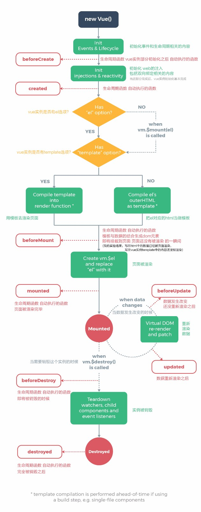

# 3.第3章 Vue 基础精讲

[TOC]

---

## 3-1 Vue 实例

```html
<div id='root'>
    <div :click="handleClick">
        {{message}}
    </div>
</div>
```

```javascript
var vm = new Vue({
    el: '#root',
    data: {
        message: 'hello world'
    },
    methods: {
        handleClick: function() {
            alert("hello boy")
        }
    }
})
```

- 通过 Vue 类创建一个 vm 实例来接管页面上某一部分 DOM 的渲染。

  - el 属性负责定义这个 Vue 实例接管的 DOM 的最外层标签，比如这里的 '#root' 
  - data 属性用于存放数据，这样就可以使用插值表达式 `{{message}}` 来渲染数据。
  - 我们在页面中使用 Vue 的实例接管某一部分后，实例会自动对 DOM 中的内容进行分析。比如这里，我们在 DOM 中使用了 `{{message}}` 插值表达式语法，那么它就会到 data 中去寻找相应的属性并返回其值到插值表达式中，插值表达式计算出相应的值后就会添加为 DOM 中的内容。

- 使用 `v-on:click="handleClick"` 绑定点击事件并执行相应的函数

  - 因为 Vue 示例接管了这部分的 DOM，那么当代码中存在这样的写法时，它能知道需要绑定一个这样的事件，并且属性值会去对应实例中属性为 methods 的对象中找名称相同的属性，当事件触发时执行对应的函数属性值。
  - 这里的 handleClick 只能定义在 methods 中，不能定义在别的地方。
  - 缩写语法：`@click="handleClick"`

- 实例与组件

  - 通过 Vue 来构建的程序需要一个入口点，一般为接管 div#root 的根实例

  - 除了页面中的根实例以外，其他的所有组件都是不同的实例，比如：

    - ```jsx
      Vue.component('item',{
          template: '<div>hello item</div>'
      })
      ```

    - 这里定义了一个全局组件，组件名为 'item'

    - 使用 template 创建一个模板，显示一个 div

    - 这样创建过来，我们就可以在根实例所接管的 div 中去使用这个组件，使用方法如下

    - ```html
      <div id='root'>
          <div :click="handleClick">
              {{message}}
          </div>
          <item></item>
      </div>
      ```

      - 通过标签的形式就可以使用了

      - 实际上，**当我们创建一个组件的时候，Vue 的底层也会把这个组件编译为一个实例**。也就是说，一个 Vue 所构建的项目是由很多组件所构成，也可以说是由很多 Vue 的实例所构成。

- 通过控制台，我们来查看一些实例的属性和方法：

  - `vm.$data` 来获取 data 对应的对象
  - `vm.$el` 获取接管的元素
  - 使用 $ 开头的，都是实例的属性和方法，比如：
    - `vm.$destroy()` 用于销毁这个实例的方法，销毁后的示例更改其数据，页面中的内容不会发生变化。


---


## 3.2 Vue 实例的生命周期与钩子函数

生命周期图示：

 

 什么是生命周期函数？

- 生命周期函数就是 vue 实例**在某一个时间点会自动执行的函数**。这给了用户在不同阶段添加自己的代码的机会。

那么有哪些生命周期函数呢？（共 11 个）

- 1.初始化事件和生命周期相关内容后，执行 `beforeCreate` 函数

- 2.初始化注入与双向绑定等内容，执行 `created` 函数

- 初始化结束后，询问我们示例中是否有 el 选项

- 是否有 template 选项
  - 如果没有，则会将 el 属性所选择元素的 outerHtml 属性当做模板。也就是说，会把 el 所接管的元素当做是模板。
    - 这是因为 vue 的渲染是通过模板来进行的，如果没有模板就没法渲染。
    - outerHTML是把当前标签的全部内容**包括标签本身**也全部取出来了。
  - 如果有，则使用模板来渲染

- 3.在判断玩是否有 template 选项后，在数据与模板相结合所生成的 DOM 即将替换 el 所指元素并渲染之前，会执行 `beforeMount` 函数。

- 4.接下来将实例中所生成的 DOM 元素替换 el 所接管的元素并渲染（挂载），之后会执行 `mounted` 函数

- 在这里我们使用以下代码测试一下：

  - ```html
    <div id='#app'></div>
    ```

  - ```js
    var vm = new Vue({
      el: "#app",
      template: "<div>hello world</div>",
      beforeCreate: function(){
        console.log("beforeCreate");
      },
      created: function(){
        console.log("created")
      },
      beforeMount: function(){
        console.log(this.$el)
        console.log("beforeMount")
      },
      mounted: function(){
        console.log(this.$el)
        console.log("mounted
      }
    })
    ```

  - 

  - 他在 `beforeMount` 之后**使用我们所创建的模板替换了** div#app

  - `mounted` 执行时表示页面已经渲染完毕

- 5.6.当我们调用 `vm.$destroy()` 这个方法，在销毁之前会执行 `beforeDestroy`，当组件被完全销毁过后 `destroyed` 这个方法会执行。

- 7.8.当数据改变时，在没有渲染之前执行 `beforeUpdate`，渲染之后执行 `updated`

- 9.activated

  - keep-alive 组件激活时调用。
  - **该钩子在服务器端渲染期间不被调用。**

- 10.deactivated

  - keep-alive 组件停用时调用。
  - **该钩子在服务器端渲染期间不被调用。**

- 11.errorCaptured

  - https://vuefe.cn/v2/api/#errorCaptured

如何使用呢？

```html
<div id="app">hello world</div>
```

```javascript
var vm = new Vue({
    el: "#app",
    beforeCreate: function(){
    }
})
```

- 直接在示例对象中通过键值的方式使用
- 具体的用法会在项目中进行讲解

---

## 3.3 Vue 的模板语法

- 第一种模板语法：插值表达式语法：`{{name}}`
- `<div v-text="name"></div>`
  - `v-text`指令是将 name 的值作为元素的内容添加到元素中，为纯字符串内容，也就是如果带有 html 语法的标签会被转义为字符串。
  - 当使用 `v-` 等 vue 指令并在后面通过 `=""` 来引入值的时候，**里面的值并不是由双引号表示的字符串，而是双引号内部表示里面的内容是 js 的表达式**。
  - 插值表达式与`v-text` 是相同的。
- `<div v-html="name"></div>`
  - 如果有 html 标签则以 html 标签的形式渲染到页面中
- ... 更多的指令稍后讲解，可以去官网查看 API
- `<div v-text="name + 'Lee'"></div>`
  - 可以使用这样的表达式来连接字符串，也可以用来计算。
  - 这样的表达式也可以用在 `{{}}` 和 `v-html=""` 中
- `v-on:clice` === `@click`
- `v-bind:title` === `:title`

---

## 3.4 计算属性，方法与侦听器

假设我们有如下的 html 与一个 vue 实例：

```html
<div id="app">
    {{fullName}}
</div>
```

```js
var vm = new Vue({
    el: "#app",
    data: {
        firstName: "Enxiao",
        lastName: "Zhao"
    }
})
```

我们想在 `{{fullName}}` 的地方显示一个全名，可能最直接的方式就是在 data 中再添加一个 `fullName: “Enxiao Zhao”`，但这样就会产生数据的冗余，因为明明现在内存中有现场的数据可以利用，并且当 firstName 或者 lastName 改变时，fullName 也不会发生改变。

那么们是否可以在插值表达式中直接使用表达式来返回一个全名：`{{firstName + ‘ ’ + lastName}}`，这样的方式是完全可以的，在这里也是没什么太大的问题，关键的问题是，如果这个表达式过于复杂、逻辑太多，就会让模板过重而难以维护。例如：

```html
<div id="example">
  {{ message.split('').reverse().join('') }}
</div>
```

因此，Vue 为我们提供了计算属性（computed），所以对于任何复杂逻辑，你都应当使用计算属性。

### 计算属性 computed

以下代码中，添加了 `fullName` 计算属性用来帮助我们计算并返回全名：

```html
<div id="app">
    {{fullName}}
</div>
```

```javascript
var vm = new Vue({
    el: "#app",
    data: {
        firstName: "Enxiao",
        lastName: "Zhao"
    },
    // 在 computed 中的属性，就叫做计算属性
    computed:{
        fullName: function(){
            return this.firstName + " " + this.lastName
        }
    }
})
```

- 使用 computed 这个选项（键）定义一个对象，在对象中的使用键值的方式创建函数，函数中可以使用 data 中的数据来进行一些操作并返回值。

- **计算属性**会产生**内置缓存**。

  - 如果使用 data 中的数据并没有发生改变，那么 computed 所定义的计算属性就使用之前的值，而不会重新运算并返回。

  - 测试的方式是这样，如下代码：

    ```js
    computed:{
      fullName: function(){
        console.log('计算一次')
        return this.firstName + " " + this.lastName
      }
    }
    ```

    比如，你改变你组件中的某个其他参数让组件重新渲染，`计算一次` 并不会再次打印，这样就能证明，当计算属性所使用的 data 并没有发生变化时会将第一次执行所返回的值保存起来，在以后的渲染中继续使用。

> 对于我而言，计算属性的好处在于它即处理的逻辑又能缓存逻辑处理后返回的值，这样对于单纯的逻辑处理而言更高效。

### 方法 methods

使用方法的形式也同样能够实现以上的功能

```html
<div id="app">
    {{fullName()}}
</div>
```

```javascript
var vm = new Vue({
    el: "#app",
    data: {
        firstName: "Dell",
        lastName: "Lee"
    },
    // 方法
    methods: {
        fullName: function() {
            return this.firstName + " " + this.lastName
        }
    }
})
```

- 当任何数据发生改变（包括这里的 firstName 与 lastName 以外的数据），页面便会重新渲染，使用方法的形式来实现效果就会又重新执行一次方法的函数，和计算属性不同，并不存在缓存。

- 每当触发重新渲染时，调用方法将**总会**再次执行函数。

- 因此，**方法**与**计算属性**相比，因为有缓存的存在而有较好的性能。

- > 我们为什么需要缓存？假设我们有一个性能开销比较大的计算属性 **A**，它需要遍历一个巨大的数组并做大量的计算。然后我们可能有其他的计算属性依赖于 **A** 。如果没有缓存，我们将不可避免的多次执行 **A** 的 getter！如果你不希望有缓存，请用方法来替代。

### 侦听器 watch

```html
<div id="app">
    {{fullName}}
    {{age}}
</div>
```

```javascript
var vm = new Vue({
    el: "#app",
    data: {
        firstName: "Dell",
        lastName: "Lee",
        fullName: "Dell Lee",
        age: 28
    },
    watch: {
        // 当 data 中 firstName 键值发生改变时执行
        firstName: function () {
            this.fullName = this.firstName + " " + this.lastName;
        },
        // 当 data 中 lastName 键值发生改变时执行
        lastName: function () {
            this.fullName = this.firstName + " " + this.lastName;
        }
    }
})
```

- 侦听器是对 data 中的键进行监听，当其值发生变化时便执行相应的函数。

- 这里我们创建了两个监听器，分别监听数据 firstName 与 lastName，而这两个监听器内部会更改 fullName 的值，因此当我们改变 firstName 或者 lastName，就会改变 fullName，从而实现我们想要的效果。

- 提示：监听可以获取新的值和旧的值，比如上面 firstName 监听器中：

  ```jsx
  watch:{
    firstName:function(newName, oldName){}
  }
  ```


### 总结

当我们可以通过以上三种方式来实现上述拼接数据，或者使用现有数据来执行一些逻辑时，推荐使用计算属性 `computed` 方法，因为简洁与高效。

## 3-5 计算属性的 getter 和 setter

计算属性实际上有两个方法，getter 与 setter

- 当计算属性被使用时，比如在插值表达式中`{{}}`，那么其实调用的使用 getter 方法所返回的值。
- 当计算属性被改变时，就会调用 setter 方法，并且所改变的值会传递给 setter 方法。

比如：

```html
<div id="app">{{ fullName }}</div>
```

```js
var app = new Vue({
  el: '#app',
  data: {
    firstName: 'Enxiao',
    lastName: 'Zhao'
  },
  computed: {
    fullName: {
      get: function() {
        return this.firstName + ' ' + this.lastName
      },
      set: function(fullName) {
        var arr = fullName.split(' ')
        this.firstName = arr[0]
        this.lastName = arr[1]
      }
    }
  }
})
```

当改变 fullName 的值时，就会执行 set 方法并且传入新的值给 set，因为 set 又改变了 firstName 与 lastName 的值，因此会重新执行 get 方法并返回一个新的 fullName 并缓存。

其实就是给予了一种很直接的方式来改变计算属性的值，这样你就可以直接通过赋值语句来改变其值了。但似乎又是一件稍微麻烦的事情。

---

## 3-6 Vue 中的样式绑定

如果要做一个功能，点击一个 div，让其文字颜色切换，那么可以怎么做？

HTML 与 CSS 部分代码：

```html
<div id="app">
  <div>Hello World</div>
</div>
```

### 第一种方式 - class 的对象语法

通过向 `:class` 中传入一个对象（**class 对象绑定**），如`:class="{activated: isActivated}"`这里需要知道，如果向 `:class` 传入一个对象，那么这个对象属性的值的 [truthiness](https://developer.mozilla.org/zh-CN/docs/Glossary/Truthy) 为 true 时，那么就会将这个对象属性添加到元素的 class 中，所以，可以通过点击事件来改变对象属性的值从而实现效果，如下：

```html
<div id="app">
  <div @click="handleDivClick" :class="{activated: isActivated}">
    Hello World
  </div>
</div>
```

```css
.activated {
  color: coral;
}
```

```js
var app = new Vue({
  el: '#app',
  data: {
    isActivated: false
  },
  methods: {
    handleDivClick() {
      this.isActivated = !this.isActivated
    }
  }
})
```

给 div 的 class 绑定一个对象，这个对象的 activated 属性的值为数据属性 isActivated，默认为 false，当点击这个 div 时就会取反则会变化 true，当为 true 时就会给 div 添加一个名为 activated 的 class。

> 当给 `:class` 以对象语法的形式传递属性值时：
>
> - 绑定的数据对象不必内联定义在模板里：
>
>   ```html
>   <div v-bind:class="classObject"></div>
>   ```
>
>   ```js
>   data: {
>     classObject: {
>       active: true,
>       'text-danger': false
>     }
>   }
>   ```
>
> - 我们也可以绑定一个返回对象的[计算属性](https://cn.vuejs.org/v2/guide/computed.html)。这是一个常用且强大的模式：
>
>   ```html
>   <div v-bind:class="classObject"></div>
>   ```
>
>   ```js
>   data: {
>     isActive: true,
>     error: null
>   },
>   computed: {
>     classObject: function () {
>       return {
>         active: this.isActive && !this.error,
>         'text-danger': this.error && this.error.type === 'fatal'
>       }
>     }
>   }
>   ```

### 第二种方式 -  class 的数组语法

通过向 `:class` 中传入一个数组（`class 数组绑定`），如 `:class=“[activated]”`，那么指的是，我们向 class 中添加数据属性 activated 的值，如下：

```html
<div @click="handleDivTwoClick" :class="[activated]">
  Hello World Two with Arrary
</div>
```

```js
var app = new Vue({
	...
  methods: {
    handleDivTwoClick() {
      this.activated = this.activated ? '' : 'activated'
    }
  }
})
```

当点击 div 时，如果 `this.activated` 的布尔值为 `true` 则返回空字符串，如果布尔值为 `false` 则返回字符串 `'activated'`，通过将数据属性 `activated` 返回给 div 的 class 来改变其样式。

> 当给 `:class` 以数组语法的形式传递属性值时：
>
> - 还可以传多个数据属性：
>
>   ```html
>   <div v-bind:class="[activeClass, errorClass]"></div>
>   ```
>
> - 也可以在数组只用使用表达式：
>
>   ```html
>   <div v-bind:class="[isActive ? activeClass : '', errorClass]"></div>
>   ```
>
> - 也可以在数组中添加对象语法：
>
>   ```html
>   <div v-bind:class="[{ active: isActive }, errorClass]"></div>
>   ```

### 第三种方式 - style 的对象语法

通过给 `:style` 传入一个对象的方式来设置 style 的属性，当然传入的对象也可以不是字面量形式而是存在于组件上的数据属性。如下：

```html
<div @click="handleDivThreeClick" :style="styleObj">
  Hello World Three with Sytle Object
</div>
```

```js
methods: {
  handleDivThreeClick() {
    this.styleObj.color = this.styleObj.color ? undefined : 'coral'
  }
}
```

点击切换对象属性上的 color 值，从而改变 div 的 style 的。

> 对于对象语法：
>
> - 直接绑定到一个样式对象通常更好，这会让模板更清晰。
>
> - 同样的，对象语法也常常结合返回对象的计算属性使用。

### 第四种方式 - style 的数据方法

```html
<div @click="handleDivThreeClick" :style="[styleObj,{fontSize: '20px'}]">
  Hello World Three with Sytle Object
</div>
```

很简单，就是你可以通过数组的形式来传入多个对象。

> 从 2.3.0 起你可以为 `style` 绑定中的属性提供一个包含多个值的数组，常用于提供多个带前缀的值，例如：
>
> ```html
> <div :style="{ display: ['-webkit-box', '-ms-flexbox', 'flex'] }"></div>
> ```
>
> 这样写只会渲染数组中最后一个被浏览器支持的值。在本例中，如果浏览器支持不带浏览器前缀的 flexbox，那么就只会渲染 `display: flex`。

---

## 3-7 Vue中的条件渲染

### v-if 与 v-show

其实很简单，就是通过指令和数据属性的方法来显示或者不显示元素：

```html
<div id="app">
  <div v-if="isShow">
    {{message}}
  </div>
  <div v-show="isShow">
    {{message}}
  </div>
</div>
```

这里我们使用了两个不同的指令——`v-show`和 `v-if` ——来通过数据属性判断是否显示元素。

它们的区别与使用：

- `v-if` 是“真正”的条件渲染，因为它会确保在切换过程中条件块内的事件监听器和子组件适当地被销毁和重建。

- `v-if` 是当返回的值为 `false` 时，并不会渲染到页面上，也就是不会出现在 DOM 中，而 `v-show` 则**始终**会被渲染并保留在 DOM 中。`v-show` 只是简单地切换元素的 CSS 属性 `display`。
- `v-if` 也是**惰性的**：如果在初始渲染时条件为假，则什么也不做——直到条件第一次变为真时，才会开始渲染条件块。相比之下，`v-show` 就简单得多——不管初始条件是什么，元素总是会被渲染，并且只是简单地基于 CSS 进行切换。
- 一般来说，`v-if` 有更高的切换开销，而 `v-show` 有更高的初始渲染开销。因此，如果需要非常频繁地切换，则使用 `v-show` 较好；如果在运行时条件很少改变，则使用 `v-if` 较好。


### v-if 更复杂的用法

既然叫做 if，那么对于程序语言而言就应该存在 else 与 else if 这样的语法，当然 vue 也提供了这样语法。如下：

```html
<div v-if="Math.random() > 0.5">
  Now you see me
</div>
<div v-else>
  Now you don't
</div>
```

```html
<div v-if="type === 'A'">
  A
</div>
<div v-else-if="type === 'B'">
  B
</div>
<div v-else-if="type === 'C'">
  C
</div>
<div v-else>
  Not A/B/C
</div>
```

但是在使用 if else 这样的语法时，中间不能出现阻隔，否则就会报错这样的错误：


如下这样的情况就是一种错误方式：

```html
<div v-if="Math.random() > 0.5">
  Now you see me
</div>
<span>obstruct</span>
<div v-else>
  Now you don't
</div>
```

`<span>` 元素隔断了两个使用 if else 指令的 div，从而 vue 无法正常运行。


### 用 `key` 管理可复用的元素

Vue 会尽可能高效地渲染元素，通常会复用已有元素而不是从头开始渲染。这么做除了使 Vue 变得非常快之外，还有其它一些好处。例如，如果你允许用户在不同的登录方式之间切换：

```html
<template v-if="loginType === 'username'">
  <label>Username</label>
  <input placeholder="Enter your username">
</template>
<template v-else>
  <label>Email</label>
  <input placeholder="Enter your email address">
</template>
```

那么在上面的代码中切换 `loginType` 将不会清除用户已经输入的内容。因为两个模板使用了相同的元素，`<input>` 不会被替换掉——仅仅是替换了它的 `placeholder`。

> 比如当你在上面的 `input` 中输入一些内容后，`loginType` 的值发生了变换，则会渲染下面的 `input`，但由于两个 `input` 元素对于 vue 来说是相同的因此只改变其 `placeholder` 值，而不会改变其 `value` 内容值。

这样也不总是符合实际需求，所以 Vue 为你提供了一种方式来**表达“这两个元素是完全独立的，不要复用它们”**。只需添加一个具有唯一值的 `key` 属性即可：

```html
<template v-if="loginType === 'username'">
  <label>Username</label>
  <input placeholder="Enter your username" key="username-input">
</template>
<template v-else>
  <label>Email</label>
  <input placeholder="Enter your email address" key="email-input">
</template>
```

这样当 `loginType` 变化以后，则上面 `input` 就会完全的被替换为下面的 `input`，从而输入的内容也消失了。

---

## 3-8 Vue 中的列表渲染

> [文档地址](https://cn.vuejs.org/v2/guide/list.html)
>
> 这一章节的官方文档写的很情况，可以去查看官方文档来学习。

我们可以通过 `v-for` 指令来遍历数组或是对象中的每一项，语法形式是`item in items` 或者 `item of items`，`of` 替代 `in` 作为分隔符最接近 JavaScript 迭代器的语法。如下的使用：

```html
<ul id="example-1">
  <li v-for="item in items">
    {{ item.message }}
  </li>
</ul>

或者：

<ul id="example-1">
  <li v-for="item of items">
    {{ item.message }}
  </li>
</ul>
```

```js
var example1 = new Vue({
  el: '#example-1',
  data: {
    items: [
      { message: 'Foo' },
      { message: 'Bar' }
    ]
  }
})
```

`items` 是源数据数组并且 `item` 是数组元素迭代的别名。

在 `v-for` 块中，我们拥有对**父作用域属性**的完全访问权限。`v-for` 还支持一个可选的第二个参数为当前项的索引。

```jsx
<ul id="example-2">
  <li v-for="(item, index) in items">
    {{ parentMessage }} - {{ index }} - {{ item.message }}
  </li>
</ul>
```


当我们遍历的是一个对象时，其参数分别对应：属性值（value），属性键（key），属性下标（index）：

```html
<div v-for="(value, key, index) in object">
  {{ index }}. {{ key }}: {{ value }}
</div>
```

> 在遍历对象时，是按 `Object.keys()` 的结果遍历，但是不能保证它的结果在不同的 JavaScript 引擎下是一致的。


### key

为了给 Vue 一个提示，以便它能跟踪每个节点的身份，从而重用和重新排序现有元素，你需要为每项提供一个唯一 `key` 属性。理想的 `key` 值是每项都有的唯一 id。

```html
<div v-for="item in items" :key="item.id">
  <!-- 内容 -->
</div>
```

- 建议尽可能在使用 `v-for` 时提供 `key`，除非遍历输出的 DOM 内容非常简单，或者是刻意依赖默认行为以获取性能上的提升。

- 因为它是 Vue 识别节点的一个通用机制，`key` 并不与 `v-for` 特别关联，`key` 还具有其他用途，我们将在后面的指南中看到其他用途。
- `key`最好不要使用数组或是对象的 index，因为这些 index 与数据本身并不是完全的固定对应关系，所以会影响性能。


### 数组更新检测

vue 对于数组或者对象的变化的更新是有固定机制的，由于 JavaScript 的限制，Vue 不能检测到某些方式改变了数组或是对象而重新渲染页面。比如：

1. 当你利用索引直接设置一个项时，例如：`vm.items[indexOfItem] = newValue`
2. 当你修改数组的长度时，例如：`vm.items.length = newLength`
3. 当你对一个对象添加或删除属性时，例如：`vm.objs.newProp = newPropValue`

你可以通过一下方式来改变数据并重新渲染：

#### 变异方法

Vue 所提供的一组观察数组的**变异方法**：

- `push()`
- `pop()`
- `shift()`
- `unshift()`
- `splice()`
- `sort()`
- `reverse()`

#### 替换数组

变异方法 (mutation method)，顾名思义，会改变被这些方法调用的原始数组。相比之下，也有非变异 (non-mutating method) 方法，例如：`filter()`, `concat()` 和 `slice()` 。这些不会改变原始数组，但**总是返回一个新数组**。当使用非变异方法时，可以用新数组替换旧数组。当然你也可以通过直接用一个新的数组来替换。

#### set 方法

- ```js
  Vue.set(vm.items, indexOfItem, newValue)
  vm.$set(vm.items, indexOfItem, newValue)
  ```


### 显示过滤/排序结果

有时，我们想要显示一个数组的过滤或排序副本，**而不实际改变或重置原始数据**。在这种情况下，可以创建返回过滤或排序数组的计算属性。例如：

```html
<li v-for="n in evenNumbers">{{ n }}</li>
```

```js
data: {
  numbers: [ 1, 2, 3, 4, 5 ]
},
computed: {
  evenNumbers: function () {
    return this.numbers.filter(function (number) {
      return number % 2 === 0
    })
  }
}
```

在计算属性不适用的情况下 (例如，在嵌套 `v-for` 循环中) 你可以使用一个 method 方法：

```html
<li v-for="n in even(numbers)">{{ n }}</li>
```

```js
data: {
  numbers: [ 1, 2, 3, 4, 5 ]
},
methods: {
  even: function (numbers) {
    return numbers.filter(function (number) {
      return number % 2 === 0
    })
  }
}
```


### 一段取值范围的 v-for

`v-for` 也可以取整数。在这种情况下，它将重复多次模板。

```html
<div>
  <span v-for="n in 10">{{ n }} </span>
</div>
```

结果：

```
1 2 3 4 5 6 7 8 9 10
```


### v-for on a `<template>` 

类似于 `v-if`，你也可以利用带有 `v-for` 的 `<template>` 渲染多个元素。比如：

```html
<ul>
  <template v-for="item in items">
    <li>{{ item.msg }}</li>
    <li class="divider" role="presentation"></li>
  </template>
</ul>
```


### `v-for` with `v-if`

当它们处于同一节点，`v-for` 的优先级比 `v-if` 更高，这意味着 `v-if` 将分别重复运行于每个 `v-for` 循环中。当你想为仅有的*一些*项渲染节点时，这种优先级的机制会十分有用，如下：

```html
<li v-for="todo in todos" v-if="!todo.isComplete">
  {{ todo }}
</li>
```

上面的代码只传递了未完成的 todos。

而如果你的目的是有条件地跳过循环的执行，那么可以将 `v-if` 置于外层元素 (或 [`)上。如：

```html
<ul v-if="todos.length">
  <li v-for="todo in todos">
    {{ todo }}
  </li>
</ul>
<p v-else>No todos left!</p>
```


## 3-9 Vue 中的 set 方法

set 就是指 vue 所提供的两种改变数组与对象的方法：`Vue.set` 与 `vm.$set`