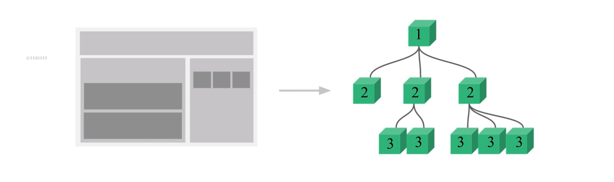

# 4.第4章 深入理解 Vue 组件

[TOC]

## 4-1 使用组件的细节点

### 使用 is 属性解决某些元素使用的严格限制

比如，我们需要写一个表格，如下：

```html
<div id="root">
  <table>
    <tbody>
      <tr>
        <td>1</td>
      </tr>
      <tr>
        <td>2</td>
      </tr>
      <tr>
        <td>3</td>
      </tr>
    </tbody>
  </table>
</div>
```

如果以上内容中的`<tr>`部分，也就是每一行的内容，想以组件的形式添加，那么 js 部分可以这样写：

```js
Vue.component('row',{
  template:'<tr><td>this is a row</td></tr>'
})

var vm = new Vue({
  el: '#root'
})
```

- 使用 `Vue.component` 添加一个全局组件`<row>`，然后填写一个模板
- 使用 `Vue` 构造一个实例接管`#root`部分的内容，这样才能识别这个部分的组件`<row>`

好，将这个`<row>`组件替换掉之前 html 中的`<tr>`部分：

```html
<div id="root">
  <table>
    <tbody>
      <row></row>
      <row></row>
      <row></row>
    </tbody>
  </table>
</div>
```

页面中显示没有问题，内容都出现了，但其实 DOM 结构是有问题的，console 中的 DOM 如下：

```html
<div id="root">
  <tr>
    <td>this is a row</td>
  </tr>
  <tr>
    <td>this is a row</td>
  </tr>
  <tr>
    <td>this is a row</td>
  </tr>
  <table>
    <tbody></tbody>
  </table>
</div>
```

`<tr>` 部分跑到了 `<table>`与 `<tbody>`之外，正常的应该在`<tbody>`的内部。

在 H5 的规范中，规定 `<tbody>`中只能放`<tr>`，而我们这里放的是`<row>`，所以浏览器在解析的时候就会出现以上问题。

这个时候就可以使用 vue 所提供的 `is`属性来解决这个问题。

既然`<tbody>`中只能使用`<tr>`，那么就使用`<tr>`，只不过给`<tr>`一个`is`属性，并赋予`row`值，这样就能够使用`row`组件并且也会使用这个组件的内容来替换`<tr>`，如下：

```html
<div id="root">
  <table>
    <tbody>
      <tr is="row"></tr>
      <tr is="row"></tr>
      <tr is="row"></tr>
    </tbody>
  </table>
</div>
```

OK，这样写以后就不会有 DOM 错乱的问题。

像这样问题的元素还是有哪里呢？

比如：

- `ul`或者`ol` 下要使用`li`
- `select`下要使用`option`

> [官方文档内容](https://cn.vuejs.org/v2/guide/components.html#%E8%A7%A3%E6%9E%90-DOM-%E6%A8%A1%E6%9D%BF%E6%97%B6%E7%9A%84%E6%B3%A8%E6%84%8F%E4%BA%8B%E9%A1%B9)
>
> 有些 HTML 元素，诸如 `<ul>`、`<ol>`、`<table>` 和 `<select>`，对于哪些元素可以出现在其内部是有严格限制的。而有些元素，诸如 `<li>`、`<tr>` 和 `<option>`，只能出现在其它某些特定的元素内部。
>
> 这会导致我们使用这些有约束条件的元素时遇到一些问题。例如：
>
> ```
> <table>
>   <blog-post-row></blog-post-row>
> </table>
> ```
>
> 这个自定义组件 `<blog-post-row>` 会被作为无效的内容提升到外部，并导致最终渲染结果出错。幸好这个特殊的 `is` 特性给了我们一个变通的办法：
>
> ```
> <table>
>   <tr is="blog-post-row"></tr>
> </table>
> ```
>
> 需要注意的是**如果我们从以下来源使用模板的话，这条限制是不存在的**：
>
> - 字符串 (例如：`template: '...'`)
> - [单文件组件 (`.vue`)](https://cn.vuejs.org/v2/guide/single-file-components.html)
> - `<script type="text/x-template">`

### 子组件内部 data 使用 function 返回

接下来，如果想将之前`row`组件中的`this is a row`内容用数据属性来替换掉的话，那么可以这样写：

```js
Vue.component('row', {
  data:{
    content: 'this is a row'
  },
  template: '<tr><td>{{content}}</td></tr>'
})
```

这时会报错：

```
[Vue warn]: The "data" option should be a function that returns a per-instance value in component definitions.
翻译：“data”选项应该是一个在组件定义中返回每个实例值的函数。
```

也就是说，需要将组件中 data 所定义的数据属性对象以函数的方式返回，如下：

```js
Vue.component('row', {
  data: function() {
    return {
      content: 'this is a row'
    }
  },
  template: '<tr><td>{{content}}</td></tr>'
})
```

那么，为什么在子组件中定义 data 时，data 必须是一个返回数据属性对象的函数呢？

因为，一个子组件不像根组件那样只会被调用一次，那么如果以对象的方式返回，那么多个子组件就会共用位于内存地址上的那一个数据对象。如果以函数返回，由于闭包的原因，这些数据对象是完全不同的。

### Vue 中的 ref 引用

在以前比如使用 jQuery 编写 js 代码时，是通过频繁的操作 DOM 来实现一些功能。比如给一个 div 绑定点击事件，那么就先得获取这个 div 的 DOM，然后绑定。

但在 Vue 中，是不建议直接操作 DOM 的，可以通过直接在标签上添加`@click`的方式来绑定点击事件。

不过，对于有些时候想要操作 DOM 怎么办呢？

可以使用`ref`属性来实现这一点。通过在元素上添加一个`ref`属性并赋予一个值，就可以在根组件内部通过`this.$refs.值`的形式获取到 DOM，比如，我想通过点击事件获取某个 div 的内容：

```html
<div id="root">
  <div ref="helloDiv" @click="handleClick">Hello</div>
</div>
```

```js
var vm = new Vue({
  el: '#root',
  methods: {
    handleClick(){
      alert(this.$refs.helloDiv.innerHTML)
    }
  },
})
```

OK，这样就能够通过`this.$refs.helloDiv.innerHTML`获取 div 的内容。

如果这个元素是一个组件，通过 `ref`所获取的是这个组件的引用。下面通过一个例子来说明可以利用这一点来做什么。

现在，我们创建一个`counter`组件，用于显示一个数，这个数被点击则会+1，然后在页面上显示两个`counter`组件，并在这两个组件的下面添加一个 div 用于显示这两个`counter`的和，并且当`counter`中的数字发生变化时还能实时的更改，代码如下：

```html
<div id="root">
  <counter ref="one" @change="handleChange"></counter>
  <counter ref="two" @change="handleChange"></counter>
  <div>total:{{ totle }}</div>
</div>
```

```js
Vue.component('counter', {
  data: function() {
    return {
      number: 0
    }
  },
  template: '<div @click="handleClick">{{number}}</div>',
  methods: {
    handleClick() {
      this.number++
      this.$emit('change')
    }
  }
})
var vm = new Vue({
  el: '#root',
  data:{
    totle:0
  },
  methods: {
    handleChange() {
      this.totle = this.$refs.one.number + this.$refs.two.number
    }
  }
})
```

- `counter`组件中点击事件会触发一个`emit`为`change`，通过`change`事件来调用父组件的`handleChange`监听器，然后在`handleChange`中通过对两个`counter`的引用来获取其值并相加来返回给`totle`数据属性。
- 实际上以上也是一种子组件像父组件传值的方式


## 4-2 父子组件间的数据传递

### 父组件像子组件传值

父组件给子组件传值是使用`v-bind`指令（简写`:`），通过`:`指令指明一个属性来获取一个父组件的值，也可以是一个字面量。然后在子组件的选项中用 `props`字段声明一个带有这些属性的数组，然后就可以在子组件中使用了。如下：

```html
<div id="root">
  <counter :number="1"></counter>
  <counter :number="fatherConponentValue"></counter>
</div>
```

```js
Vue.component('counter', {
  props:['number'],
  template: '<div>{{number}}</div>',
})
```

如果想要改变这个值，比如点击+1，如下这样：

```js
Vue.component('counter', {
  props:['number'],
  template: '<div @click="handleClick">{{number}}</div>',
  methods:{
    handleClick(){
      this.number++
    }
  }
})
```

那么会报错，如下：

```
[Vue warn]: Avoid mutating a prop directly since the value will be overwritten whenever the parent component re-renders. Instead, use a data or computed property based on the prop's value. Prop being mutated: "number"

翻译：避免直接改变 prop，因为只要父组件重新渲染，该值就会被覆盖。而是根据 prop 的值使用的 data 或计算属性。 支持变异：“数字”
```

就是不要去直接改变 prop，而是创建 data 或者 computed 属性来传入这个值来改变它。如下：

```js
Vue.component('counter', {
  props: ['number'],
  data() {
    return {
      count: this.number
    }
  },
  template: '<div @click="handleClick">{{count}}</div>',
  methods: {
    handleClick() {
      this.count++
    }
  }
})
```

通过将 props 中的 number 传递给 count，然后改变 count 就可以实现改变父组件传递过来的值。

这是 vue 中的**单向数据流**的概念，也就是父组件可以随意的向子组件传递参数，但是子组件不能随意的修改父组件传递过来的参数。

> 这里我说明一下
>
> - 当父组件传递过去的是像是Undefined、Null、Boolean、Number 和 String 这样的基本数据类型时，使用上述的方式，直接将这个值赋给 data 属性是可以的，你改变了子组件 data 中变量，也并不会改变父组件中所传过来这个变量，因为 JS 会复制基本类型值。
> - 但是，如果你传递过来的是一个引用类型，比如对象、数组，那么如果对这个引用类型进行改变，实际上也会改变父组件本身传递过的值。除非你使用拷贝。
>   - 但对于是否要拷贝，也要根据实际需求来定。因为也存在喜欢子组件直接改变父组件的情况。

### 子组件向父组件传值

通过之前使用过的`emit`方法的第二参数就可以实现向父组件传值。比如：

```js
Vue.component('counter', {
	...
  methods:{
    handleClick() {
      this.number++
      this.$emit('change',20)
    }
  }
})
var vm = new Vue({
	...
  methods: {
    handleChange(childValue) {
      console.log(childValue)
    }
  }
})
```

子组件`counter`中通过点击事件执行`this.$emit('change',20)`，`emit`会给子组件绑定一个`change`事件，父组件监听这个`change`事件执行其`methods` 的 `handleChange`，`handleChange`的第一个参数就是其传过来的`20`

## 4-3 组件属性校验与非 props 特性

在了解本课内容之前，先补充一点关于子组件属性的内容，看代码：

```html
<div id="root">
  <child content="123"></child>
</div>
```

```js
Vue.component('child',{
  props:['content'],
  template:'<div>{{content}}</div>'
})
```

注意，以上代码中，给`child`子组件传入的属性 `content`并不是通过`v-bind`指令所写的，而是直接以一个标签属性的形式而写。这样的形式的属性的值无论写的是什么，都会是字符串。而如果以`v-bind`指令的形式来写，则`“”`内的值会认为是表达式，比如上面的`“123”`会认为是 number 类型，代码如下：

```html
<div id="root">
  <child :content="123"></child>
</div>
```

### 组件属性校验

顾名思义和 react 相同，可以对传入子组件的属性进行一个教研。比如要对以下子组件的 content 进行校验：

```html
<div id="root">
  <child :content="123"></child>
</div>
```

通过传入一个构造函数的方式：

```js
Vue.component('child',{
  props:{
    content:String //只允许 content 为字符串，所以会报错
  }
  template:'<div>{{content}}</div>'
})
```

通过传入一个数组的方式：

```js
Vue.component('child',{
  props:{
    content:[String,Number] //允许 content 为字符串和数字
  }
  template:'<div>{{content}}</div>'
})
```

通过传入一个对象的方式：

```js
Vue.component('child',{
  props:{
    content:{
      type: String,
      required: true, // 是否为必需
      default: 'default value', // 默认值，如果不写 content 也可以
      validator: function(value) { // 自定义校验器，用于更复杂的检测，返回 true 为适用
        return (value.length > 5) 
      }
    }
  }
  template:'<div>{{content}}</div>'
})
```

### props 特性

以上的 props 就是使用了 props 特性，也就是指父组件给子组件传递了一个值，子组件在其内部 props 选项中进行了声明的方式。特性：

- 传递的属性不会在 DOM 标签上进行显示
- 可以在子组件的选项中通过插值表达式或者 this 来调用

### 非 props 特性

与 props 相对，指指父组件给子组件传递了一个值，但没有在内部 props 选项中进行声明。特性：

- 传递的属性会在模板最外层的标签上显示
- 无法在子组件内部调用，调用会报错

（实际生产环境中使用非 props 特性较少）


## 4-4 给组件绑定原生事件

当给子组件绑定一个事件时，其实是由`$emit`方法所触发的**自定义事件**，如下：

```html
<div id="root">
  <child @click="handleClick"></child>
</div>
```

这个`@click`就是自定义事件，而非原生事件并且其触发的函数是父组件传递过来的 handleClick 方法。如果要给这个 child 绑定原生事件，需要在其模板上最外层的 div 中绑定然后再执行`$emit`来触发这个自定义事件：

```js
Vue.component('child',{
  template:'<div @click="handleChildClick">{{content}}</div>',
  methods:{
    handleChildClick(){
      this.$emit('click')
    }
  }
})
```

但是这样的方式太麻烦了，为了触发一个子组件的 click 事件来执行父组件的方法需要模板上的 click 触发自身方法来执行`$emit`触发这个 click 事件。如果想要直接绑定一个原生的事件应该怎么做？如下：

```html
<div id="root">
  <child @click.native="handleClick"></child>
</div>
```

通过给`@click`指令添加一个`.native`修饰符就可以让其绑定一个原生事件。


## 4-5 非父子组件间的传值

> 非父子组件指非直接关系的父子组件

先看一张图：



一个网页可以被拆分成多个组件，然后进行嵌套+组合。

比如上面的，1 则可以理解为整个网页，而这个网页又被三个部分 2 组成，顶部区域、左侧区域、右侧区域。然后左侧的区域与右侧区域又被组件新的一些组件 3 来组合。

那么，如果组件 1 与组件 2 之间的传值是可以通过 props 和 `emit`，那么 1 和 3 这样的隔代组件呢？

可能会想通过 2 这个中间组件来帮忙，但是如果这样会非常的麻烦，因为如果是 1 与 5 与 6，或者又是这边的 3 与另一边的 3 呢？这样就会使整个代码变得相对复。

vue 官方把 vue 定义为一个视图层的框架，也就是它其实不能作为一个 M 层来使用，官方提供了 vuex 这个数据层的框架，不过较为复杂，这里就先不使用这种方式。而这里，我们要使用的是**发布订阅模式**来解决非父子组件之间传值的问题，这种**发布订阅模式（观察者模式）**在 vue 中被称为**总线（bus）机制**。

先看代码：

```html
<div id="root">
  <child content="Dell"></child>
  <child content="Dell"></child>
</div>
```

假设有两个子组件 child，并且想让这两个组件之间相互传值，正好这也满足于两个非父子组件间的传值。那么我们就可以通过`总线机制`来传值，如下：

```js
Vue.prototype.bus = new Vue()

Vue.component('child',{
  data: function(){
    return {
      selfContent: this.content
    }
  },
  props:{
    content:String
  },
  template: '<div @click="handleChildClick">{{selfContent}}</div>',
  methods: {
    handleClick: function() {
      this.bus.$emit('change',this.selfContent)
    }
  },
  mounted: function() {
    var this_ = this
    this.bus.$on('change',function(msg){
      this_.selfContent = msg
    })
  }
})
```

1. 在 Vue 原型上添加一个 bus 属性并将一个 Vue 实例返回这个属性中，那么这个属性就会存在于所有 Vue 的实例下，通过`this.bus`就可以调用。
2. 在`mounted`钩子中为`bus`示例监听`change`事件，并通过事件函数中的参数来获取传过来的值赋值给组件`child`的数据属性`selfContent`，这里需要注意两点：
   - `bus`所监听的事件函数中的`this`指向是`bus`，所以需要在外层将`child`的`this`传递给一个变量`this_`，从而在函数内部通过`this_`来调用`child`
   - 由于这里想要改变父组件传给子组件`child`的 prop `content`，所以在`child`中声明一个`selfContent`来接受`content`，并在改变的地方直接改变`selfContent`
3. 在`child`点击事件所触发的方法`handleClick`中，通过`this.bus.$emit`触发`bus`实例的`change`事件并传值，从而执行之前在`mounted`钩子中所监听的事件函数向`child`传值。


## 4-6 在 Vue 中使用插槽（slot）

插槽是一个非常重要的概念，在 vue 的相关插件与模块中都大量的使用了插槽这种特性。

好，先来说明一个需求，如果父组件传递过来的不是简单的字符串，而是带有 div 等标签的模板字符串，我们应该如何在子组件内部渲染呢？可能最直接的方式就是直接放到子组件中，比如：

```html
<div id="root">
  <child content="<div>this is a content<div>"></child>
</div>
```

```js
Vue.component('child',{
  props:['content']
  template:'<div>{{content}}</div>',
})
```

但是这样是有问题的，因为`child`会将内容整体当做字符串进行渲染，而不会认为`<div>`是一个标签。所以我们需要使用`v-html`指令：

```js
Vue.component('child',{
  props:['content']
  template:`<div>
							<div v-html:"{{content}}"></div>
						</div>`,
})
```

OK，这样就可以解决这个问题。

但有的时候，我们会觉得这样来传入一个模板字符串看起来很麻烦而且会有一个问题，会多出一个 div 标签，可能觉得可以使用`template`标签，但是`template`标签不支持`v-html`，所以这个时候就可以使用`slot`插槽标签来解决这个问题：

```html
<div id="root">
  <child>
  	<h1>这是一个标题</h1>
  </child>
</div>
```

```js
Vue.component('child',{
  props:['content']
  template:`<div>
							<p>Hello</p>
							<slot>默认值</slot>
						</div>`,
})
```

好的，通过在`child`标签的内容中添加一些内容，我们就可以在`child`的 template 属性中通过`<slot>`标签来获取传入内容，并且`<slot>`在`child`标签中没有内容时可以允许设置默认值，而且`<slot>`相对于之前使用`v-html`更灵活。

### 具名插槽 slot

是否可以通过某种方式在一个子组件中使用多个且不同的`slot`，从而能够调用多种不同的 DOM 结构呢？

答案是可以的，通过在传入子组件标签中的内容中的标签属性上添加一个 slot 属性来创建不同的 slot，然后在子组件 template 中的 slot 标签上添加 name 名字来调用即可，如下：

```html
<div id="root">
  <body-content>
  	<div class='header' slot='header'>
      Header
    </div>
    <div class='footer' slot="footer">
      Footer
    </div>
  </body-content>
</div>
```

```js
Vue.componet('body-content',{
  template: `<div>
								<slot name="header"></slot>
								<div class="content">content</div>
								<slot name="header"></slot>
						</div>`
})
```


## 4-7 作用域插槽（scope-slot）

先来实现一个效果，子组件通过一个数组数据来渲染一些列表：

```html
<div id="root">
  <child></child>
</div>
```

```js
Vue.component('child', {
  data(){
    return {
      list:[1,2,3,4]
    }
  },
  template:`<div>
            		<ul>		
            		    <li v-for="item of list">{{item}}</li>
                </ul>
            </div>`
})
```

OK，通过给 li 添加`v-for`指令通过 list 数组来渲染出一些 li 标签。

那如果现在不要要固定渲染 li 标签，而是想渲染子组件标签内部传递过来的标签内容呢？既然需要使用子组件标签中的标签内容，那么就需要使用 slot 标签、template 模板、slot-scope 属性，如下:

```html
<div id="root">
  <child>
    <template slot-scope="props">
      <li>
        <h3>{{ props.hText }}</h3>
        <p>{{ props.item }}</p>
      </li>
    </template>
  </child>
</div>
```

```js
Vue.component('child', {
  data() {
    return {
      list: [1, 2, 3, 4]
    }
  },
  template: `<div>
                <ul>
              	  <slot v-for="item of list" :item="item" hText="标题"></slot>
                </ul>
              </div>`
})
```


1. 首先在子组件模板中添加`slot`标签并使用`v-for`来循环它，再在标签上添加两个需要传递的值。
2. 然后通过在`child`标签内添加作用域插槽（标签内容），注意作用域插槽只能使用`temlate`模板，并且添加一个`slot-scope`属性来接收从子组件中传递过来的数据，当然还有用于显示的模板内容。

当子组件做循环且其中的某一部分是来源于其插槽内容的时候，我们就可以通过作用域插槽来传值使用。

> 其实我觉得只要需要向插槽中传入内容就需要使用。


## 4-8 动态组件与 v-once 指令

还是先来实现一个效果，有一个按钮，通过点击可以在组件1与组件2之间进行切换，如下：

```html
<div id="root">
  <child-one v-if="type === 'child-one'"></child-one>
  <child-two v-if="type === 'child-two'"></child-two>
  <button @click="handleClick">toggle</button>
</div>
```

```js
Vue.component('child-one', {
  template: '<div>child-one</div>'
})
Vue.component('child-two', {
  template: '<div>child-two</div>'
})

var vm = new Vue({
  el: '#root',
  data:{
    type: 'child-one'
  },
  methods: {
    handleClick() {
      this.type = this.type === 'child-one' ? 'child-two' : 'child-one'
    }
  }
})
```

通过使用`v-if`指令来实现。

### 动态组件

其实以上效果可以用更简单的方式来实现，使用组件`<component>`和其`is`属性即可，只需要更改以上的 html 部分：

```html
<div id="root">
  <component :is="type"></component>
  <button @click="handleClick">toggle</button>
</div>
```

`component`标签会根据`is`的属性值来渲染某一个子组件，由于这里`is`是根据变量`type`决定，又由于`type`会随着点击事件的变化而变化，因此为**动态组件**


### v-once 指令

上面的效果中，当渲染其中一个组件而不渲染另一个时，实际上是将另一个组件销毁了，这样你在不断的切换组件的过程中，就会不断的创建新的 DOM 再删除 DOM，这样会比较耗费性能，所以这个时候你可以通过给组件模板的最外层元素添加`v-once`指令来缓存组件从而减少性能的消耗。

 ```js
Vue.component('child-one', {
  template: '<div v-once>child-one</div>'
})
Vue.component('child-two', {
  template: '<div v-once>child-two</div>'
})
 ```


