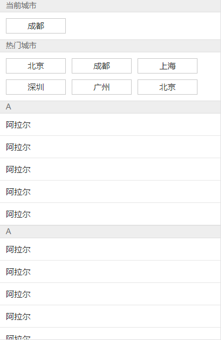
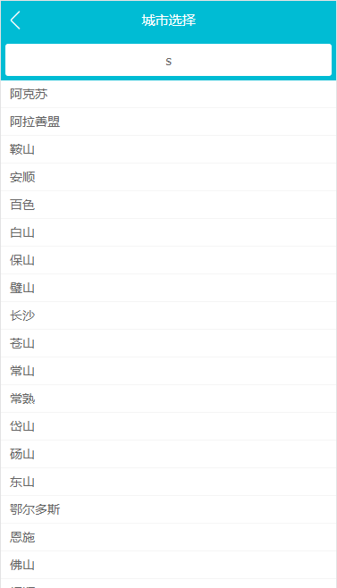
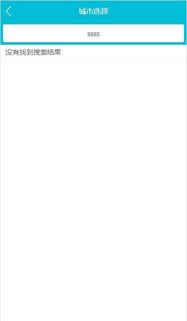
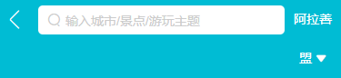

# 08.第8章 项目实战 - 旅游网站城市列表页面开发

[TOC]

## 8-1 Vue项目城市选择页 - 路由配置

新的分支：city-router


### 代码部分

router 配置：

```jsx
export default new Router({
  routes: [
    {
      path: '/',
      name: 'Home',
      component: Home
    },
    {
      path: '/city',
      name: 'City',
      component: City
    }
  ]
})
```

city 页面的 header 组件部分的 template：

```html
<template>
  <div class="header">
    城市选择
    <router-link to="/">
      <div class="header-left">
        <span class="iconfont header-back">&#xe624;</span>
      </div>
    </router-link>
  </div>
</template>
```

- 使用 router-link 来回到主页面


stylus 部分：

```stylus
@import '~styles/variables.styl'

.header
  position relative
  line-height $headerHeight //
  overflow hidden
  text-align center
  color #fff
  background-color $bgColor
  font-size 0.3rem

  .header-back
    position absolute
    left 0
    top 0
    width 0.64rem
    text-align center
    font-size 0.4rem
    color #fff //
    
// variables.styl
$headerHeight = 0.86rem
```

- 因为`router-link`组件会渲染一个 a 标签，而 a 标签在 reset.css 中的默认规则为 蓝色，因此需要在 .header-back 中将字体颜色设置为 白色
- 多次页面的头部高度都是一样的，而且为了未来可以同一调整，我们使用一个 $headerHeight 来表示头部的高度


## 8-2 Vue 项目城市选择页 - 搜索框布局

创建分支：city-search


图示：


代码部分没有好说的，就是在一个 div 中套一个 input 用于输入，不过有一点可以提一下，像`border-radius`这样可能需要使用内核前缀的属性，vue-cli 所构建的项目中已经准备了相应补全的工具。


## 8-3 Vue项目城市选择页 - 列表布局

创建分支：city-lish


图示：




### 代码部分

每一个带有标题的块我们都可以将他们设为大概相同样式的区域，因为至少 title 是相同的。然后使用 .area 来作为他们的类：

```html
<div class="area">
  <div class="title border-topbottom">当前城市</div>
  <div class="button-list">
    <div class="button">
      成都
    </div>
  </div>
</div>
```


现在，我们来看第一个 area 区域，由于「成都」块使用了`float:left`，成为了一个浮动元素，因此如果不对父元素做任何处理的话肯定会产生塌陷，因此可以触发父元素的 BFC（Block fomatting context 块级格式化上下文）来让浮动元素也参与计算，如下：

```stylus
  .button-list
    overflow hidden
    padding 0.1rem 0.6rem 0.1rem 0.1rem

    .button
      float left
      width 30%
      margin 0.1rem
      padding 0.1rem 0
      text-align center
      border 0.02rem solid #ccc
      box-sizing border-box
```

> 更多关于 BFC 的内容可以看如下链接中的内容：
>
> [前端精选文摘：BFC 神奇背后的原理](https://www.cnblogs.com/lhb25/p/inside-block-formatting-ontext.html)


由于使用的 border.css 库的默认边框颜色太浅，所以如下设置来改变其颜色：

```stylus
.border-topbottom
  &::before
    border-color #ccc

  &::after
    border-color #ccc

.border-bottom
  &::before
    border-color #ccc
```

- 注意 `.border-topbottom` 是上下都有所以对其 `::before` 和 `::after` 都进行了更改，而`.border-bottom`只有下边有所以就只对`::before`进行了更改


本来这样就已经可以使用了，但由于课程作者想要使用 Better-scroll 插件来让效果更炫酷，所以他对本来不需要设置任何样式的最外层的 .list 元素进行了如下设置：

```stylus
.list
  position absolute
  overflow hidden
  left 0
  right 0
  top 1.78rem
  bottom 0
```

- 这样设置的结果就是让整个元素的高度变为了整个屏幕的高度，并且由于`overflow hidden`使其无法滑动。


## 8-4 Vue项目城市选择页 - BetterScroll 的使用和字母表布局

### 使用 better-scroll

[better-scroll](https://github.com/ustbhuangyi/better-scroll) 是以 [iscroll](https://github.com/cubiq/iscroll) 为基础做的封装，但使用起来更友好（视频作者这样说）

> better-scroll 是公用插件，也就不需要还是用 Vue.use() 来使用一个 vue 的特性，而是直接引用就可以。

安装：

```shell
npm i better-scroll
```

如文档所示，如果要使你的页面能够使用`better-scroll`滚动需要如下的 HTML 结构：

```html
<div class="wrapper">
  <ul class="content">
    <li>...</li>
    <li>...</li>
    ...
  </ul>
  <!-- you can put some other DOMs here, it won't affect the scrolling -->
</div>
```

也就是你得让你的内容有两层包裹，外层的 `.wrapper`与内层的`.content`，然后将其余需要滚动的部分放在内层就行。

所以，我们的代码也需要在已有的最外层`.lish`的情况下再添加一层，可以随便使用一个`div`

然后在我们在`<script>`中引入这个包，然后使用：

```js
import BScroll from 'better-scroll'
export default {
  name: 'CityList',
  mounted () {
    this.scroll = new BScroll(this.$refs.wrapper)
  }
}

// <templage> 部分
<div class="list" ref="wrapper">
```

- 这里我们使用了 `ref` 来帮助我们快速获取 DOM，注意在 js 中是使用 `this.$refs`来获取
- 然后是，我们需要将构建的实例赋值给这个组件而不能是一个变量，原因是 ESLint 会让我们没有使用这个变量而报错。

好了，这样以后就能够使用一个带有物理特性并且能够有回弹效果的滚动。


### 创建字母表

创建一个新的组件 Alphabet，然后写下如下内容即可：

```html
<template>
  <ul class="list">
    <li class="item">A</li>
    <li class="item">A</li>
    <li class="item">A</li>
    <li class="item">A</li>
    <li class="item">A</li>
    <li class="item">A</li>
    <li class="item">A</li>
  </ul>
</template>
```

```stylus
@import '~styles/variables.styl'

.list
  display flex
  flex-direction column
  justify-content center
  position fixed
  top 1.58rem
  right 0
  bottom 0
  width 0.4rem
  text-align center

  .item
    line-height 0.4rem
    color $bgColor
```

- 这里使用了 `flex-direction column`和`justify-content center` 来使子元素垂直方向上居中。


## 8-5 Vue项目城市选择页 - 页面的动态数据渲染

创建分支：city-ajax

> 从这节课开始，我不会重新分支来进行发开了，而是直接在主分支上开发，但会在提交时说明完成了哪一部分的内容。


### 课程内容

ajax 依然是在容器组件（父组件、页面组件）中发送数据，如下：

```js
export default {
  name: 'City',
  components: {
    CityHeader,
    CitySearch,
    CityList,
    CityAlphabet
  },
  data () {
    return {
      cities: null,
      hotCities: []
    }
  },
  computed: {
    alphabet () {
      return Object.keys(this.cities)
    }
  },
  methods: {
    getCityInfo () {
      axios.get('/api/city.json')
        .then((res) => {
          res = res.data
          if (res.ret && res.data) {
            const data = res.data
            this.cities = data.cities
            this.hotCities = data.hotCities
          }
        })
    }
  },
```

- 这里我们利用`computed`来将`this.cities`中的`key`值放入一个数组中，然后传入给需要使用的`CityAlphabet`组件。但讲师是直接通过将`this.cities`传给`CityAlphabet`组件来实现这一点的，因为`v-for`可以循环对象。


然后通过属性的方式将父组件的数据传入到子组件中：

```html
<CityHeader></CityHeader>
<CitySearch></CitySearch>
<CityList
          :cities="cities"
          :hotCities="hotCities"
          ></CityList>
<CityAlphabet :alphabet="alphabet"></CityAlphabet>
```


然后在子组件中通过 `v-for`指令来循环出不同的元素：

```html
<div
     class="area"
     v-for="(item,key) of cities"
     :key="key"
     >
  <div class="title border-topbottom">{{key}}</div>
  <div class="item-list">
    <div
         class="item border-bottom"
         v-for="innerItem of item"
         :key="innerItem.id"
         >{{innerItem.name}}</div>
  </div>
</div>
```

- 这里重点讲一下对 `cities` 数据的循环，因为`cities`在这里是一个对像而非一个数组，可以看到可以在语句的参数位置获取到`key`而不是`index`，而这个`key`正式我们需要使用的每一个区域的 title 内容。而每一个`item`则是一个数组，因此又在内部使用`v-for`指令来循环，并且使用`innerItem`来获取`item`中的每一个对象。
- 总之，`v-for`指令不但可以循环数组而且可以循环对象。


## 8-6 Vue项目城市选择页 - 兄弟组件数据传递

### 功能

点击字母列表中的字母，列表视图跳转到相应的区域。


### 涉及问题

相同父组件的子组件之间的传值。


### 思路与实现

1.在 Alphabet 子组件中，点击字母时获取字母 letter：

```html
<ul class="list">
  <li
      class="item"
      v-for="item of alphabet"
      :key="item"
      @click="handleLetterClick"
      >{{item}}</li>
</ul>
```

```js
methods: {
  handleLetterClick (e) {
    this.$emit('change', e.target.innerText)
  }
}
```

- 向外暴露一个`change`事件，从而可以让父组件通过传入的回调来获取子组件传递的值。
- 这里的值是 `e.target.innerText` 也就是字母内容


2.在 City 父组件中，将 letter 传递给子组件 List：

```html
<CityList
          :cities="cities"
          :hotCities="hotCities"
          :letter="letter"
          ></CityList>
<CityAlphabet
          :alphabet="alphabet"
          @change="handleLetterChange"
          ></CityAlphabet>
```

```js
data () {
  return {
    cities: {},
    hotCities: [],
    letter: ''
  }
},
methods: {
  handleLetterChange (letter) {
    this.letter = letter
  }  
},
```

- 在 data 中定义一个数据 `letter`用来接受从 Alphabet 子组件中传递过来的值，并且将这个值传给另一个子组件 List
- 这里是通过向子组件的`@change`属性中`handleLetterChange`回调来获取子组件的值。


3.在 List 子组件中，利用 letter 与 BScroll 库的 API 来进行跳转。

```html
<div
     class="area"
     v-for="(item,key) of cities"
     :key="key"
     :ref="key"
     >
  <div class="title border-topbottom">{{key}}</div>
  <div class="item-list">
    <div
         class="item border-bottom"
         v-for="innerItem of item"
         :key="innerItem.id"
         >{{innerItem.name}}</div>
  </div>
</div>
```

- 给每一个字母区域元素添加`:ref="key"`，从而可以通过字母来获取这个 DOM

```js
watch: {
  letter () {
    if (this.letter) {
      const ele = this.$refs[this.letter][0]
      this.scroll.scrollToElement(ele)
    }
  }
```

- 利用 watch 来监听 `letter`，当发生变化就执行以上逻辑
- 注意，`this.$refs[this.letter]` 所获取的是一个数组，需要用 [0] 来获取 DOM
- 然后利用 BScroll 的 API scrollToElement 来跳转到相应的 DOM 位置


### 新的功能

通过在字母表上点击按住然后滑动手指从而根据手指所在位置来跳转到对应字母的列表位置。


### 涉及问题

根据字母所在位置计算出具体的字母


### 思路与实现

1.绑定三个关于触屏的事件来执行相应的任务：

```html
  <ul class="list">
    <li
      class="item"
      v-for="item of alphabet"
      :key="item"
      :ref="item"
      @click="handleLetterClick"
      @touchstart="handleTouchStart"
      @touchmove="handleTouchMove"
      @touchend="handleTouchEnd"
    >{{item}}</li>
  </ul>
```

- `@touchstart`触摸开始时触发
- `@touchmove`触摸移动时触发，每移动一个像素点触发一次，就算移出绑定元素之外也触发，但无法从其他元素触摸开始移动到相应元素而触发，这一点也是之后我会讲到的一个问题。
- `@touchend`触发结束时触发


2.添加两个数据来描述组件状态

```js
  data () {
    return {
      // 标识参数，用于判断 touch 目前位于的步骤，一般可能会使用 0 1 2 3 这样的数字来表示不同的状态
      // 这里只是表示是否触碰，则只需要布尔值来表示
      // 为什么判断是否触碰是因为有一种情况，你可以从其他的地方滑动到带有字母的按钮，依然会触发相应的滑动事件，可是这个猜测是错误的
      touchStatus: false,
      // 字母A距离其父元素的最上面的距离
      alphabetOffsetTop: 0
    }
  },
```

- `touchStatus`让我知道了一个非常好的软件设计方式，通过`touchStatus`我们可以将软件不同的状态通过某个值来表示，比如 1 表示一种状态，2 表示一种状态，通过这个状态来判断执行相应任务。

  这里是用于判断是否触摸开始与接触，所以只有两种状态，因此我们使用布尔值：true 与 false。

  但是，这里存在一个问题，其实不需要判断，因为就算从其他地方触摸开始然后移动到某个元素上也不用触发某个元素的 `touchmove` 事件，不过这里这是我的一个猜测。

- `alphabetOffsetTop`是用于保存字母 A 到其父元素最上面的距离，也就是这里的 ul 的最上方距离，讲师是将这个值的获取放在了`touchmove`中，但这个值其实不会随着手指的滑动而变化，因此没有必要不断的重新获取，只需要当手指触碰到屏幕时获取即可。


3.在相应事件中添加逻辑，计算出所需要的 letter 值。

```js
handleTouchStart (e) {
  this.touchStatus = true
  this.alphabetOffsetTop = this.$refs['A'][0].offsetTop
  this.$emit('change', e.target.innerText)
},
handleTouchMove (e) {
  if (this.touchStatus) {
    const touchY = e.touches[0].clientY
    const singleLetterTop = touchY - this.alphabetOffsetTop - 89
    const index = Math.floor(singleLetterTop / 20)
    const letter = this.alphabet[index]
    if (index >= 0 && index < this.alphabet.length) {
      this.$emit('change', letter)
    }
  }
},
handleTouchEnd () {
  this.touchStatus = false
}
```

- `handleTouchStart`回调函数中
  - 首先改变了`touchStatus`的值表示触屏到字母元素开始
  - 然后获取`alphabetOffsetTop`值保存在组件状态中
    - `HTMLElement.offsetTop` 是指其距离 `HTMLElement.offsetParent` 最上方的距离，而 offsetParent 是该元素的定位元素，如果没有定位元素则为最近的 `table`、`table cell`或 根元素（标准模式下为 `html`；quirks 模式下为 `body`）
  - 将当前所触碰的字母传递给 List，让其跳转到相应的列表位置（这里是用以替代 Click 事件，因为 Click 事件需要抬手时才触发，我个人认为其交互方式并不合适）

- `handleTouchMove`回调函数中
  - 获取`touchY`，也就是当前触摸位置具体屏幕最上方的距离
  - 然后通过计算获取`singleLetterTop`当前触摸位置距离 A 字母元素的上方距离
  - 通过`Math.floor(singleLetterTop / 20)`计算出其 index
  - 然后先判断 index 的值是否在字母表数组中再向外传递 letter 值
    - 原因是因为你可以通过将手指滑动到字母表下方来获取一个超过字母表数组索引的值，可能你从字母数组中通过 index 获取了 undefined 了，也会向外传送数值，而一旦传值又会触发一些逻辑的执行。


4.剩下的，由于之前在 List 中已经做了相应的逻辑处理，因此只要改变 letter 就会跳转到 List 的字母位置。


### 重构

现在我要将 89 这个固定数值通过代码来获取，因为如果高度发生了变化也可以自动的更改，而不是我手动的来更改。

实现：

在 City 容器组件中通过使用一个 div 将 Header 与 Search 组件包括，然后获取这个 div 的高度传给 Alphabet 组件即可：

```jsx
// City.vue
<div
  ref="header"
  >
  <CityHeader></CityHeader>
  <CitySearch :cities="cities"></CitySearch>
</div>
...
<CityAlphabet
  :alphabet="alphabet"
  @change="handleLetterChange"
  :headerHeight="headerHeight"
  ></CityAlphabet>

data () {
  return {
		...
    headerHeight: 0
  }
}
mounted () {
  this.getCityInfo()
  // 获取头部的高度 - 包括 Header 组件与 Search 组件
  this.headerHeight = this.$refs.header.offsetHeight
}
```

- 通过在 mounted 钩子中获取并传给 CityAlphabet 组件
- `offsetHeight`属性可以获取元素的高度

## 8-7 Vue 项目城市选择页 - 列表性能优化

### 优化一

将获取字母 A 到其父元素最上面的距离的处理放到`updataed`生命周期中，代码如下：

```js
updated(){
  this.alphabetOffsetTop = this.$refs['A'][0].offsetTop
}
```

- 然后当子组件中的数据发生变化时则会触发这个钩子，比如父组件通过 ajax 获取字母表的数据后传给子组件时。
- 但这个问题我上节课就用另一种方式解决了，通过触摸开始时事件获取。我觉得我使用的方式相对较好一些，因为用户可能不需要去点击字母表，也就没有必要获取`alphabetOffsetTop`的值。


### 优化二

**函数节流**，因为通过`touchmove`事件触发函数的频率非常高，所以我们需要减少执行次数。代码如下：

```js
data(){
  timer: 0
}

methods:{
	handleTouchMove (e) {
      if (this.touchStatus) {
        if (this.timer) {
          clearTimeout(this.timer)
        }
        this.timer = setTimeout(() => {
          const touchY = e.touches[0].clientY
          const touchToA = touchY - this.alphabetOffsetTop - 89
          const index = Math.floor(touchToA / 20)
          const letter = this.alphabet[index]
          if (index >= 0 && index < this.alphabet.length) {
            this.$emit('change', letter)
          }
          console.log(11)
        }, 16.6)
      }
    },
}
```

- 先存储一个`timer`用于保存定时器返回的标识 ID 值，用于清除定时器
- 然后在回调中先判断是否存在`timer`，也就是判断是否已经绑定了定时器，如果有就清除它
- 然后就是绑定定时器，并将 ID 返回给 `timer`


代码逻辑如上，但我想说一下原理：

- 因为如果在 16.6ms 内又触发了`touchmove`事件，那么就会将之前绑定的定时器清除掉，从而不执行定时器内的代码，但如果没有触发`touchmove`事件，则就会执行，从而发生跳转。
- 那么定时器的作用就是一个节流，保证在 16.6ms 内无法发生第二次的重复逻辑。至少在 16.6ms 内是让程序能够做一些其他的事情的。

这个节流的手段可以学一学，算是很有用的，对于高频重复代码而言都可以使用。


## 8-8 Vue项目城市选择页 - 搜索逻辑实现

### 功能：

在 city 页面的城市选择输入框中输入拼音或汉字时，在页面的下部分出现一个对应的搜索结果列表。


### 视图：




### 涉及问题：

- 通过循环每一项内容中的字符串来进行匹配
- 利用现有数据做判断来决定是否显示元素


### 思路与实现：

1.创建一个列表用于显示内容：

```html
<div
     class="search-content"
     ref="content"
     v-show="keyword"
     >
  <ul>
    <li
        class="search-item border-bottom"
        v-for="item of list"
        :key="item.id"
        >{{item.name}}</li>
    <li
        class="search-item border-bottom"
        v-show="hasNoData"
        >
      没有找到搜索结果
    </li>
  </ul>
</div>
```

- 在循环的`li`下面添加了一个用于当搜索结果不存在时显示的内容
- 注意两个`v-show`
  - `div`中的`v-show`是用于显示整个搜索内容的，当输入框中没有值时则不显示
  - `li`中的`v-show`是用于显示是否有搜索结果的，当搜索结果中的数组没有内容时则显示


2.添加一个数据项`keyword`用于与`input`绑定

```html
<div class="search">
      <input
        ...
        v-model="keyword"
      >
</div>
```

```js
data () {
    return {
      keyword: '',
      ...
    }
  },
```


3.利用 watch 属性来对 keyword 做监听，如果发生变化则执行逻辑：

```js
props: {
  cities: Object
},
watch: {
  keyword () {
    if (!this.keyword) {
      this.list = []
      // return
    } else {
      if (this.timer) {
        clearTimeout(this.timer)
      }
      this.timer = setTimeout(() => {
        const result = []
        for (let i in this.cities) {
          this.cities[i].forEach(item => {
            // 判断每一个城市对象的中文和中文拼音中是否带有 keyword 的值，有则就将此项添加到 result 中
            if (item.spell.indexOf(this.keyword) > -1 || item.name.indexOf(this.keyword) > -1) {
              result.push(item)
            }
          })
        }
        this.list = result
      }, 50)
    }
  }
}
```

- `cities`是来自于父组件的数据，用于循环判断，循环对象需要使用 for in
- 首先我们要判断`keyword`是否有值，如果没有则将 list 设为空数组，目的是当清空输入框中的内容时使其内容为空。
- 如果`keyword`为空，那么就没有必要再执行后面的查询语句了，可以使用注释掉的 `return`，让程序直接返回不执行后面的逻辑，也可以如我在这里的方式使用 `else` 语句。
- 第 10 行开始，依然使用节流，因为这段代码的循环太多会影响性能，因此我们将其逻辑只允许在 50ms 后执行，如果 50ms 内出现相同的操作就需要重新等待 50ms
- 从 14 行开始，先创建一个空数组用于添加匹配项，然后通过循环对象和对象中的数组，对每一个城市对象进行匹配，匹配方式使用对`spell`和`name`字符串值使用`indexOf`方法，当其返回大于等于 -1 时，说明能够匹配，那么就将这个城市对象添加到`result`数组中，最后，等循环结束，`result`结果确定后将这个值添加给组件数据`list`从而重新渲染组件显示内容。

​	

4.因为最好不要在模板内添加逻辑，所以利用 computed 属性来做一个简单的逻辑：

```js
computed:{
  hasNoData () {
      return !this.list.length
    }
}
```

- `hasNoData`是用于判断 List 中是否有值，如果有则返回 false，没有返回 true


5.利用`better-scroll`插件对搜索结果内容添加滚动效果：

```js
import BScroll from 'better-scroll'

mounted () {
  this.scroll = new BScroll(this.$refs.content)
}
```


### 优化

由于目前存在一个问题，当我们输入搜索内容时，会先显示提示内容「没有找到搜索结果」，然后在一瞬间，100ms 以后会显示搜索结果。这样的效果不是很舒服，因为会闪烁一下，所以我做了如下优化。代码如下：

```js
data () {
    return {
      hasNoData: false
    }
  },

} else {
  if (this.timer) {
    clearTimeout(this.timer)
  }
  this.timer = setTimeout(() => {
    ...
    // 当循环完之后，根据数组中是否有值返回相应的状态
    this.hasNoData = !result.length
  }, 50)
}
```

- 首先，将节流的间隔时间设为 50ms，因为 50ms 是人能够承受等待的比较舒服的时间，代码如下：

- 然后，将`hasNoData`这个用于表示是否显示提示内容的状态默认为`false`，这样便不会一开始就出现提示内容，然后在查询逻辑结束后再根据数组是否有值返回其状态。


## 8-9 Vue项目城市选择页 - Vuex实现数据共享

### 功能

当我们在 city 页面的内容列表中点击某个城市时，会改变 Home 页面中右上角所显示的城市名称。


### 涉及问题

City 组件与 Home 组件没有一个共同的父组件（因为两个组件的渲染是由 `<router-view>` 这个组件来完成的，所以说没有一个共同的我们自己所创建的父组件会比较准确一点），因此传值会比较麻烦，可以使用总线`bus`但也会比较麻烦，我们这里使用 vue 官方所提供的数据框架 `vuex`

在大型的项目开发中，vue 基本上只能承担视图层的内容，而当我们涉及到大量数据在不同的组件间传递的时候，则我们就需要一个数据框架来进行辅助，而在 vue 中就是 `vuex`


### vuex 简单说明

> [官方文档](https://vuex.vuejs.org/zh/)

首先我们可以这样考虑数据传递问题，如果我们的数据并不是单独的存在于一个组件中，而是存放在一个单独的公共存储空间中，然后所有的组件都可以从这个地方来取数据，并且当某一个组件改变了这个公用存储数据中的数据时，其他组件也能够感知并相应重现渲染，那就能非常好了。vuex 就是这样的设计。


这张图可以理解为整个 Vue 项目，而虚线部分则是 vuex，如果要更准确的说，可以称为“store”（仓库），而 store 是由几部分组成：

- State - 公共数据存放处，因此可以看到 State 中的数据可以流向 Vue 组件，因此组件可以从 state 中调用数据。
- Action - 派发任务给 Mutation，可以看到 Actions 可以接受来自后端（Backend）API 的数据，也可以接受来自组件本身的数据，也可以理解为组件或者异步调用 Actions，然后 Actions 再去调用 Mutations
- Mutations - 提交用于修改 State 的数据。

State 中存放的是公用数据，而要更改 Stata 则先要调用 Actions 做一些异步处理或者是批量的同步操作，然后 Actions 再调用 Mutations，只有通过 Mutations 我们才能最终改变公用数据的值。

但并非绝对，有时可以略过 Actions，让组件直接去调用 Mutations 来修改 state 中的数据。

注意：当组件调用 Actions 时，实际上使用的是 Dispatch 方法来操作 Actions，而组件或者 Actions 调用 Mutations 则是使用 Commit 来操作 Mutations。


### 使用方法

1.首先，我们在 src 目录中创建一个 store 文件夹用于存放 vuex 相关的代码，然后在 store 中创建一个 index.js 文件用来初始化我们的 store，如下：

```js
import Vue from 'vue'
import Vuex from 'vuex'

Vue.use(Vuex)

export default new Vuex.Store({
  state: {
    city: '成都'
  }
})
```

- 现在我们有了一个拥有初始状态的 state


2.然后，我们在 Vue 的实例中引入，也就是 main.js 中，如下：

```js
import store from './store'
new Vue({
  el: '#app',
  router,
  store,
  components: {
    App
  },
  template: '<App/>'
})
```

- 这样，我们的项目中就可以使用 vuex 了


3.现在去我们需要使用到这个数据的组件中进行调用，如下：

```jsx
// home/components/Header.vue

<router-link to="/city">
  <div class="header-right">
    {{this.$store.state.city}}
    <span class="iconfont arrow-icon">&#xe64a;</span>
  </div>
</router-link>

// city/components/List.vue

<div class="area">
  <div class="title border-topbottom">当前城市</div>
  <div class="button-list">
    <div class="button">
      {{this.$store.state.city}}
    </div>
  </div>
</div>
```

- 因为在 Vue 示例中传入了一个 store，所以我们可以在其任意的子组件中通过`$store`来进行调用，而数据就存放在`this.$store.state`中。


4.通过在组件中调用事件来触发 Dispatch 来派发一个 action，然后触发 store 中的 aciton 来派发一个 mutation，mutation 再改变数据：

```jsx
// City/components/List.vue

<div class="button-list">
  <div
    class="button"
    v-for="item of hotCities"
    :key="item.id"
    @click="handleCityClick(item.name)"
    >
    {{item.name}}
  </div>
</div>

methods: {
  handleCityClick (city) {
    this.$store.dispatch('changeCity', city)
  }
},
```

- 注意这里在传给`@click`属性时，可以向这个函数中传入参数，虽然感觉很奇怪，因为像是在调用函数，不过实际上并没有调用，只是传入，因为如果是调用则会返回一个值给`@click`。也就是这样理解，我们把`handleCityClick(item.name)`语句放到了 click 所触发的某个事件回调中的某部分执行。

```js
// store/index.js

export default new Vuex.Store({
  state: {
    city: '成都'
  },
  actions: {
    changeCity (ctx, city) {
      ctx.commit('changeCity', city)
    }
  },
  mutations: {
    changeCity (state, city) {
      state.city = city
    }
  }
})
```

- 首先，在 List 组件中的按钮中绑定一个点击事件用来触发 dispatch，第一个参数为触发的 Actions，第二参数为需要传入的数据。
- 然后，在创建 store 的地方，actions 字段中创建一个 aciton - changeCity，第一个参数是 ctx（context 上下文），其中会带有一些操作 store 的方法和数据，第二个参数为接受的数据。通过`ctx.commit`提交一个 mutation，第一个参数是 mutation 的名称，第二个参数是数据。
- 最后，通过在 mutations 字段中创建的 mutation - changeCity 来改变 state 中的数据，第一个参数是 state，第一个参数是传过来的数据。

> 在这里你就可以发现，软件开发中其实是利用了很多的概念，但这些概念的基础是语言本身的特性来实现的，比如这里的 Mutations 或者 Actions 还是 Dispatch 或者 commit 实际上都是函数，只是因为其执行的行为不同而被称为了不同的东西而已，都是接受参数执行任务。


### 新的问题

由于我们刚才使用 actions 时并使用异步数据并且过程也很简单，所以没有必要使用 Dispatch 来派发 acitons，而应该让组件执行 commit 来调用 mutation，如下：

```js
methods: {
  handleCityClick (city) {
    this.$store.commit('changeCity', city)
  }
},
```


### 路由跳转

在网页中做页面跳转有两种方式，一种是通过 a 标签，一种是通过 js 的 `window.location.href = ‘’`，而在 vue 中使用 js 跳转的方式是 [编程式导航](https://router.vuejs.org/zh/guide/essentials/navigation.html)，而会为我们提供一个 push 方法来帮助我们做页面跳转。

使用：

```js
methods: {
  handleCityClick (city) {
    this.$store.commit('changeCity', city)
    this.$router.push('/')
  }
},
```

- 也就是组件本身带有一个 `$router`属性可以使用的 push 方法


## 8-10 Vue项目城市选择页 - Vuex的高级使用及 localStorage

### 一个问题

由于我们在初始化 store 时，传入的 state.city 是固定的一个值，如下：

```js
export default new Vuex.Store({
  state: {
    city: '成都'
  },
 ...
```

这个固定值是存放在程序中的变量的，并且 state 本身也是存放在程序的变量中，因此如果用户通过操作改变了 state 的值，当用户刷新页面后，或者重新登录页面时并不会看到已经改变的城市名，而是固定的如这里的‘成都’。

而在正常的程序设计中，当用户切换了城市以后应该在下一次登录或是重新刷新时也还是之前改变过后的值。

这个问题可以直接描述为：数据并没有保存。

### 解决问题

对于数据没有保存的问题，我可以使用 HTML5 提供了一个 API —— `LocalStorage`，它可以帮助我们实现类型 cookie 的功能，从而做到本地存储，并且相对于 cookie 有很多好处，比如 API 的设计更简单和直接，存储空间比 cookie 大等等。

代码部分：

```js
// src/store/index.js

export default new Vuex.Store({
  state: {
    city: localStorage.city || '成都'
  },
  actions: {
    changeCity (ctx, city) {
      ctx.commit('changeCity', city)
    }
  },
  mutations: {
    changeCity (state, city) {
      state.city = city
      localStorage.city = city
    }
  }
})
```

- 在使用`localStorage`时，这里是使用`.`操作符的对象形式来进行存储和取值，但也可以通过`localStorage.getItem`和`localStorage.setItem`API 来完成。
- 在第 5 行代码中，使用了短路求职，当左边为 falsy 时调用后面的值。


### 新的问题 - 程序异常

用户如果关闭本地存储或者使用了隐身模式，在使用 LocalStorage 时会抛出异常从而使整个程序都无法运行，所以我们需要使用 `try..catch`来保证程序的正常。如下：

```js
let defaultCity = '成都'

try {
  if (localStorage.city) {
    defaultCity = localStorage.city
  }
} catch (e) {}

export default new Vuex.Store({
  state: {
    city: defaultCity
  },
  actions: {
    changeCity (ctx, city) {
      ctx.commit('changeCity', city)
    }
  },
  mutations: {
    changeCity (state, city) {
      state.city = city
      try {
        localStorage.city = city
      } catch (e) {}
    }
  }
})
```

- 只需要注意一点，对于 `try...catch`的使用只需要将可能会报错的语句包裹起来就好，比如这里的`localStorage.city`部分。


### 代码结构拆分

这样的代码其实比较臃肿，我们可以将其中的某些逻辑拆分出来，比如有关 state 初始化对象的代码、创建 actions 对象的代码与 mutations 对象的代码，都可以放入一个单独的文件中。如下：

```js
// store/index.js

import Vue from 'vue'
import Vuex from 'vuex'
import state from './state'
import actions from './actions'
import mutations from './mutations'

Vue.use(Vuex)

export default new Vuex.Store({
  state,
  actions,
  mutations
})
```

```js
// store/state.js

let defaultCity = '成都'

try {
  if (localStorage.city) {
    defaultCity = localStorage.city
  }
} catch (e) {}

export default {
  city: defaultCity
}
```

```js
// store/actions.js

export default {
  changeCity (ctx, city) {
    ctx.commit('changeCity', city)
  }
}
```

```js
// store/mutations.js

export default {
  changeCity (state, city) {
    state.city = city
    try {
      localStorage.city = city
    } catch (e) {}
  }
}
```


### 新的问题 - 右上角城市名称文字太多会超出

如图：



问题的原因是因为右上角的部分使用了固定的宽度，所以一旦超过这个宽度就会换行，因此我们可以将`width`改为`min-width`，从而超过了也会自动增加宽度。（中间部分是使用剩余的宽度，所以也会自动改变）

```stylus
  .header-right
    min-width 1.04rem // 之前是 width
    padding 0 .1rem
    float right
    text-align center
    color #fff
```


### 优化 - 通过 mapState 将 state 映射到组件的 computed 中

之前的代码：

```jsx
<div class="header-right">
  {{this.$store.state.city}}
  <span class="iconfont arrow-icon">&#xe64a;</span>
</div>
```

- 可以看到在调用 state 中的 city 数据时需要写一长串

优化之后的代码：

```jsx
<div class="header-right">
  {{this.city}}
  <span class="iconfont arrow-icon">&#xe64a;</span>
</div>

import { mapState } from 'vuex'
export default {
  name: 'HomeHeader',
  computed: {
    ...mapState(['city'])
  }
}
```

- 现在我们只需要使用`this.city`上就可以调用存储在 store 中的 city 值了
- 使用方法：
  - 导入`vuex`中的`mapstate()`方法。
  - 然后通过传入一个带有 state 属性的数组，最终使用展开运算符对`mapstate`的返回的对象展开到`computed`对象中。
  - 这样我们就可以使用`this`来访问了。


上面是使用传入数组的方式，其实也可以传入对象的方式，如下：

```jsx
<div class="header-right">
  {{this.currentCity}}
  <span class="iconfont arrow-icon">&#xe64a;</span>
</div>

computed: {
  ...mapState({
    currentCity: 'city'
  })
}
```


### 优化 - 使用 mapMutations 来将 commit 方法映射到组件 methods 中

之前的代码：

```js
  methods: {
    handleCityClick (city) {
      this.$store.commit('changeCity', city)
      this.$router.push('/')
    }
  },
```

- 我们是通过调用位于`$store`对象中的`commit`方法来提交`changeCity`这个 mutaiton 的

之后的代码：

```js
import { mapMutations } from 'vuex'

methods: {
  handleCityClick (city) {
    this.changeCity(city)
    this.$router.push('/')
  },
    ...mapMutations(['changeCity'])
},
```

- 通过引入`mapMutations`方法，在 `methods` 中使用展开运算符将`mapMutations([‘changeCity’])`返回的方法对象展开出来，从而可以在组件的其他位置通过`this`来调用。


### Vuex 的核心概念之一 —— getter

> [Vuex - Getter](https://vuex.vuejs.org/zh/guide/getters.html)
>
> Vuex 允许我们在 store 中定义“getter”（可以认为是 **store 的计算属性**）。就像计算属性一样，getter 的返回值会根据它的依赖被缓存起来，且只有当它的依赖值发生了改变才会被重新计算。

如上所述，你可以认为 getter 就是 store 中相当于组件的 computed（计算属性），那么当我们要使用 state 中的数据来进行一些计算的时候，则可以使用 getter 来帮助我们计算并返回到一个变量中缓存起来。这样的好处是，只有当数据发生变化时才会重新计算，减少了计算量，相比于在组件中来调用计算而言，节省了计算量（因为无论是使用函数还是单独放在某个生命周期中，每一次都需要重新执行计算步骤）。

使用方式：

```jsx
// store/index.js
export default new Vuex.Store({
  state,
  actions,
  mutations,
  getters: {
    doubleCity (state) {
      return state.city + ' ' + state.city
    }
  }
})


// 比如在 City/components/List.vue 中
<div class="button">
  {{this.doubleCity}}
</div>
  
import { mapMutations, mapGetters } from 'vuex'
computed: {
	...mapGetters(['doubleCity'])
},
```

- 依然先是在初始化 Store 实例的地方，在 getters 字段中传入一个对象，对象中是一些用于计算后缓存的函数。
- 然后在需要使用组件的位置，引入`mapGetters`，在`computed`字段值进行展开即可。


### Vuex 的核心概念之一 —— Module

> [Vuex - Module](https://vuex.vuejs.org/zh/guide/modules.html)
>
> 由于使用单一状态树，应用的所有状态会集中到一个比较大的对象。当应用变得非常复杂时，store 对象就有可能变得相当臃肿。
>
> 为了解决以上问题，Vuex 允许我们将 store 分割成**模块（module）**。每个模块拥有自己的 state、mutation、action、getter、甚至是嵌套子模块——从上至下进行同样方式的分割：
>
> ```js
> const moduleA = {
>   state: { ... },
>   mutations: { ... },
>   actions: { ... },
>   getters: { ... }
> }
> 
> const moduleB = {
>   state: { ... },
>   mutations: { ... },
>   actions: { ... }
> }
> 
> const store = new Vuex.Store({
>   modules: {
>     a: moduleA,
>     b: moduleB
>   }
> })
> 
> store.state.a // -> moduleA 的状态
> store.state.b // -> moduleB 的状态
> ```

如上官方所述，如果应用非常的庞大，那么所牵涉到的数据就会非常的多，如果只使用一个 store 来管理数据与行为就会非常的庞杂而难以维护，因此可以使用 module 来将 store 分割成多个模块，这些模块也有自己的数据和行为。

比如上面，我们可以将一个模块的数据放在一个单独的 moduleA 或者 moduleB 中，数据可以通过单独属性名来调用，而行为是针对模块中数据的行为。


## 8-11 Vue项目城市选择页 - 使用keep-alive优化网页性能

这节课是使用`keep-alive`这个 vue 内置的标签（组件）来对已经写好的两个页面进行性能优化。

### 问题

当我们在 Home 页面与 City 页面之间切换时，每切换一次则会重新执行一次 ajax 来请求数据。原因是因为当组件切换时就会重新渲染，而重新渲染就会执行其 mounted 钩子，而这个钩子中就有请求数据的逻辑。

对于有些庞大而又不需要不断更新的数据而言，这样的不断请求实际上是低性能和没有必要的。


### 解决

```jsx
// App.vue

<template>
  <div id="app">
    <keep-alive>
      <router-view />
    </keep-alive>
  </div>
</template>
```

`<keep-alive>`组件所包裹路由内容被加载过一次之后，就把路由中的内容放到内存之中，下一次切换到这个路由的时候，则不需要重新渲染这个组件（那么就不需要重新执行 mounted 钩子），只需要将内存中的内容拿出来重新渲染到页面上就行。


### 新的问题

这个应用是需要当你切换城市时，首页中的内容是需要重新请求的。但是如果是现在这样的配置，当切换了城市回到首页时并不会重新渲染 Home 组件，则不会执行 mounted 钩子，因此也就不会请求新的数据。

### 解决

被`<keep-alive>`所包裹的组件中会存在一个新的生命周期函数——`activated`，也就是组件切换虽然不会执行`mounted`生命周期函数，但会执行`activated`生命周期。那么我们就可以通过如下的代码来实现：当点击列表中的城市从而切换城市跳转到主页时也能够请求数据。

首先，我们先更改一下接口：

```js
  methods: {
    getHomeInfo () {
      axios.get('/api/index.json?city=' + this.city)
```

- 因为当需要请求某个城市的数据时，我们会使用查询字段来返回相应的数据。
- 在控制台的 Network 中的显示如下：
  

然后，在相应的生命钩子中执行一些逻辑来请求数据：

```js
data () {
  return {
    lastCity: '',

mounted () {
    this.lastCity = this.city
    this.getHomeInfo()
}
    
activated () {
  if (this.city !== this.lastCity) {
    this.lastCity = this.city
    this.getHomeInfo()
  }
}
```

- 先添加一个数据`lastCity`用于保存之前的城市，当 Home 页面首次加载时会执行 mounted 函数，从而将存储在 `store` 中的 `city` 传给 `lastCity`，然后再去请求数据。
- 接着，因为使用了`keep-alive`，页面在相互之间切换时，`mounted`失效了，取而代之的是`activated`生命周期函数，但我们不能让其随意的请求数据，而应该先判断是否改变了`city`，如果改变了才加载，并且把现在的 city 又传给 `lastCity`用于保存作为之后比较。

