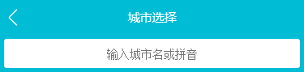

# 08.第8章 项目实战 - 旅游网站城市列表页面开发

[TOC]

## 8-1 Vue项目城市选择页 - 路由配置

新的分支：city-router


### 代码部分

router 配置：

```jsx
export default new Router({
  routes: [
    {
      path: '/',
      name: 'Home',
      component: Home
    },
    {
      path: '/city',
      name: 'City',
      component: City
    }
  ]
})
```

city 页面的 header 组件部分的 template：

```html
<template>
  <div class="header">
    城市选择
    <router-link to="/">
      <div class="header-left">
        <span class="iconfont header-back">&#xe624;</span>
      </div>
    </router-link>
  </div>
</template>
```

- 使用 router-link 来回到主页面


stylus 部分：

```stylus
@import '~styles/variables.styl'

.header
  position relative
  line-height $headerHeight //
  overflow hidden
  text-align center
  color #fff
  background-color $bgColor
  font-size 0.3rem

  .header-back
    position absolute
    left 0
    top 0
    width 0.64rem
    text-align center
    font-size 0.4rem
    color #fff //
    
// variables.styl
$headerHeight = 0.86rem
```

- 因为`router-link`组件会渲染一个 a 标签，而 a 标签在 reset.css 中的默认规则为 蓝色，因此需要在 .header-back 中将字体颜色设置为 白色
- 多次页面的头部高度都是一样的，而且为了未来可以同一调整，我们使用一个 $headerHeight 来表示头部的高度


## 8-2 Vue 项目城市选择页 - 搜索框布局

创建分支：city-search


图示：




代码部分没有好说的，就是在一个 div 中套一个 input 用于输入，不过有一点可以提一下，像`border-radius`这样可能需要使用内核前缀的属性，vue-cli 所构建的项目中已经准备了相应补全的工具。


## 8-3 Vue项目城市选择页 - 列表布局

创建分支：city-lish


图示：


### 代码部分

每一个带有标题的块我们都可以将他们设为大概相同样式的区域，因为至少 title 是相同的。然后使用 .area 来作为他们的类：

```html
<div class="area">
  <div class="title border-topbottom">当前城市</div>
  <div class="button-list">
    <div class="button">
      成都
    </div>
  </div>
</div>
```


现在，我们来看第一个 area 区域，由于「成都」块使用了`float:left`，成为了一个浮动元素，因此如果不对父元素做任何处理的话肯定会产生塌陷，因此可以触发父元素的 BFC（Block fomatting context 块级格式化上下文）来让浮动元素也参与计算，如下：

```stylus
  .button-list
    overflow hidden
    padding 0.1rem 0.6rem 0.1rem 0.1rem

    .button
      float left
      width 30%
      margin 0.1rem
      padding 0.1rem 0
      text-align center
      border 0.02rem solid #ccc
      box-sizing border-box
```

> 更多关于 BFC 的内容可以看如下链接中的内容：
>
> [前端精选文摘：BFC 神奇背后的原理](https://www.cnblogs.com/lhb25/p/inside-block-formatting-ontext.html)


由于使用的 border.css 库的默认边框颜色太浅，所以如下设置来改变其颜色：

```stylus
.border-topbottom
  &::before
    border-color #ccc

  &::after
    border-color #ccc

.border-bottom
  &::before
    border-color #ccc
```

- 注意 `.border-topbottom` 是上下都有所以对其 `::before` 和 `::after` 都进行了更改，而`.border-bottom`只有下边有所以就只对`::before`进行了更改


本来这样就已经可以使用了，但由于课程作者想要使用 Better-scroll 插件来让效果更炫酷，所以他对本来不需要设置任何样式的最外层的 .list 元素进行了如下设置：

```stylus
.list
  position absolute
  overflow hidden
  left 0
  right 0
  top 1.78rem
  bottom 0
```

- 这样设置的结果就是让整个元素的高度变为了整个屏幕的高度，并且由于`overflow hidden`使其无法滑动。


## 8-4 Vue项目城市选择页 - BetterScroll 的使用和字母表布局

### 使用 better-scroll

[better-scroll](https://github.com/ustbhuangyi/better-scroll) 是以 [iscroll](https://github.com/cubiq/iscroll) 为基础做的封装，但使用起来更友好（视频作者这样说）

> better-scroll 是公用插件，也就不需要还是用 Vue.use() 来使用一个 vue 的特性，而是直接引用就可以。

安装：

```shell
npm i better-scroll
```

如文档所示，如果要使你的页面能够使用`better-scroll`滚动需要如下的 HTML 结构：

```html
<div class="wrapper">
  <ul class="content">
    <li>...</li>
    <li>...</li>
    ...
  </ul>
  <!-- you can put some other DOMs here, it won't affect the scrolling -->
</div>
```

也就是你得让你的内容有两层包裹，外层的 `.wrapper`与内层的`.content`，然后将其余需要滚动的部分放在内层就行。

所以，我们的代码也需要在已有的最外层`.lish`的情况下再添加一层，可以随便使用一个`div`

然后在我们在`<script>`中引入这个包，然后使用：

```js
import BScroll from 'better-scroll'
export default {
  name: 'CityList',
  mounted () {
    this.scroll = new BScroll(this.$refs.wrapper)
  }
}

// <templage> 部分
<div class="list" ref="wrapper">
```

- 这里我们使用了 `ref` 来帮助我们快速获取 DOM，注意在 js 中是使用 `this.$refs`来获取
- 然后是，我们需要将构建的实例赋值给这个组件而不能是一个变量，原因是 ESLint 会让我们没有使用这个变量而报错。

好了，这样以后就能够使用一个带有物理特性并且能够有回弹效果的滚动。


### 创建字母表

创建一个新的组件 Alphabet，然后写下如下内容即可：

```html
<template>
  <ul class="list">
    <li class="item">A</li>
    <li class="item">A</li>
    <li class="item">A</li>
    <li class="item">A</li>
    <li class="item">A</li>
    <li class="item">A</li>
    <li class="item">A</li>
  </ul>
</template>
```

```stylus
@import '~styles/variables.styl'

.list
  display flex
  flex-direction column
  justify-content center
  position fixed
  top 1.58rem
  right 0
  bottom 0
  width 0.4rem
  text-align center

  .item
    line-height 0.4rem
    color $bgColor
```

- 这里使用了 `flex-direction column`和`justify-content center` 来使子元素垂直方向上居中。


## 8-5 Vue项目城市选择页 - 页面的动态数据渲染

创建分支：city-ajax

> 从这节课开始，我不会重新分支来进行发开了，而是直接在主分支上开发，但会在提交时说明完成了哪一部分的内容。


### 课程内容

ajax 依然是在容器组件（父组件、页面组件）中发送数据，如下：

```js
export default {
  name: 'City',
  components: {
    CityHeader,
    CitySearch,
    CityList,
    CityAlphabet
  },
  data () {
    return {
      cities: null,
      hotCities: []
    }
  },
  computed: {
    alphabet () {
      return Object.keys(this.cities)
    }
  },
  methods: {
    getCityInfo () {
      axios.get('/api/city.json')
        .then((res) => {
          res = res.data
          if (res.ret && res.data) {
            const data = res.data
            this.cities = data.cities
            this.hotCities = data.hotCities
          }
        })
    }
  },
```

- 这里我们利用`computed`来将`this.cities`中的`key`值放入一个数组中，然后传入给需要使用的`CityAlphabet`组件。但讲师是直接通过将`this.cities`传给`CityAlphabet`组件来实现这一点的，因为`v-for`可以循环对象。


然后通过属性的方式将父组件的数据传入到子组件中：

```html
<CityHeader></CityHeader>
<CitySearch></CitySearch>
<CityList
          :cities="cities"
          :hotCities="hotCities"
          ></CityList>
<CityAlphabet :alphabet="alphabet"></CityAlphabet>
```


然后在子组件中通过 `v-for`指令来循环出不同的元素：

```html
<div
     class="area"
     v-for="(item,key) of cities"
     :key="key"
     >
  <div class="title border-topbottom">{{key}}</div>
  <div class="item-list">
    <div
         class="item border-bottom"
         v-for="innerItem of item"
         :key="innerItem.id"
         >{{innerItem.name}}</div>
  </div>
</div>
```

- 这里重点讲一下对 `cities` 数据的循环，因为`cities`在这里是一个对像而非一个数组，可以看到可以在语句的参数位置获取到`key`而不是`index`，而这个`key`正式我们需要使用的每一个区域的 title 内容。而每一个`item`则是一个数组，因此又在内部使用`v-for`指令来循环，并且使用`innerItem`来获取`item`中的每一个对象。
- 总之，`v-for`指令不但可以循环数组而且可以循环对象。


