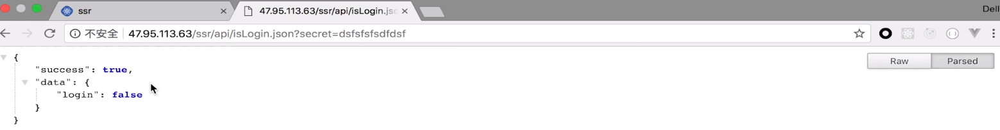
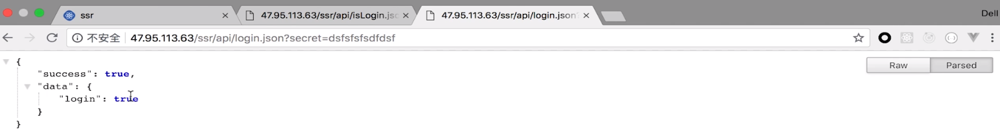
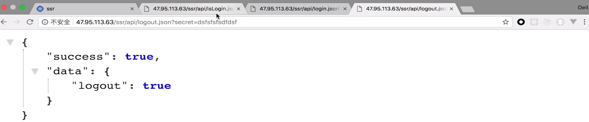
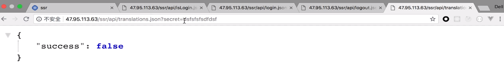
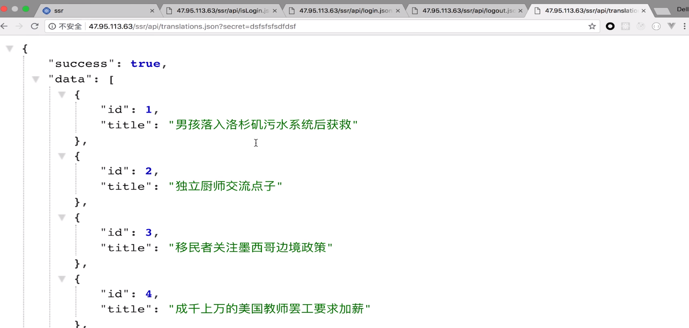

# 6.第6章 使用 Node 作为数据获取中间层

[TOC]

## 6-1 使用 proxy 代理，让中间层承担数据获取职责


中间层：当客户端通过 API 请求远程数据时需要借助中间层来作为一个中转。

### 目前项目中各层的代码和接口

- 客户端：./public/index.js
- node 服务器中间层：./build/bundle.js
- java 服务器或者说远程数据服务器：action 中使用的接口

### 三端之间的互动关系

客户端请求页面内容会访问 node 服务器，如果请求的页面需要异步数据则 node 会向远程的数据服务器发送请求，等请求到数据之后再将数据与页面一起渲染后返回给客户端。

### 目前中间层架构问题

当客户端在运行应用的过程中访问了需要异步数据的页面时，客户端则会直接向远程数据服务器请求数据，这时作为数据中转的中间层就失去了作用，这是不符合这个架构设计的。

### 中间层架构的好处

中间层架构将客户端与远程数据服务器分离，这样当出现一些问题时减少了查找问题的范围。比如当页面中的逻辑出现问题时，可能是客户端与 node 端的问题，而不应该是数据端的问题，而数据发生错误时，应该是 node 端和数据端的问题，而不应该是客户端的问题。

### 解决问题——让中间层来负责所有数据的中转

思路是让 node 端成为一个代理服务器（proxy），客户端请求数据是由 node 端帮忙向数据端请求，数据端将数据返回给 node 端再交给客户端。

由于我们的 node 服务器是使用了 express 框架，因此我们可以使用 express-http-proxy 中间件来帮助我们搭建一个 proxy 服务器。代码如下：

```jsx
// server/index.js
import proxy from 'express-http-proxy'

// /api/news.json 客户端请求路径
// req.url = 'news.json'
// proxyReqPathResolver: /ssr/api/news.json  这个函数会返回的路径字符串
// http://47.95.113.63 + proxyReqPathResolver() 在服务器端请求的路径
// http://47.95.113.63/ssr/api/news.json

app.use('/api', proxy('http://47.95.113.63', {
  proxyReqPathResolver: function (req) {
    return '/ssr/api' + req.url
  }
}))
```

通过使用中间件，当客户端访问服务器根目录下的 `/api` 目录时，服务器就会代理访问 `http://47.95.113.63` 这个服务器。配置 proxyReqPathResolver() 方法可以帮助我们解析客户端请求的路径，我们通过 req.url 来获取到 '/api' 之后的路径字符串并通过字符串拼接来返回我们需要访问的数据服务器的路径字符串。最终，服务器就会去访问数据服务器上这个路径资源并返回。

因此，客户端之前请求的数据服务器路径需要改为 node 服务器，如下：

```jsx
// action.js
export const getHomeList = () => {
  // http://47.95.113.63/ssr/api/news.json?secret= 之前的路径
  return dispatch => {
    return axios.get('/api/news.json?secret=' + secret) // 现在的
      .then((res) => {
        const list = res.data.data
        dispatch(changeListAction(list))
      })
  }
}
```

最后，会有一个问题，当客户端访问需要加载异步数据的页面时，一直在等在服务器的响应。

我们先来对比一下客户端与服务器端请求 `/api/news.json` 的不同：

```jsx
// 浏览器端运行：
// /api/news.json = http://localhost:3000/api/news.json
// 服务器端运行：
// /api/news.json = 服务器根目录下/api/news.json
```

服务器在请求异步数据时访问 `'/api/news.json'` 这个路径时并不会请求到数据，因为在服务器端根目录下并不存在 api 这个目录，那对于 `/api/news.json` 这个路径来说就没有数据可以请求。

## 6-2 服务器端请求和客户端请求的不同处理

如标题，解决上节课遗留的问题就是通过让服务器端请求和客户端请求的路径不同，那想让请求的路径不同，则需要在请求之前做一个**环境判断**，如果是服务端的请求则返回远程数据端的路径，如果是客户端的请求则返回请求 node 端的路径，由于我们服务器端与客户端在请求异步数据时是执行不同的逻辑，所以代码如下：

```jsx
// action.js

export const getHomeList = (isServer) => {
  let api = ''

  if (isServer) {
    api = 'http://47.95.113.63/ssr/api/news.json?secret=' + secret
  } else {
    api = '/api/news.json?secret=' + secret
  }

  return dispatch => {
    return axios.get(api)
      .then((res) => {
        const list = res.data.data
        dispatch(changeListAction(list))
      })
  }
}

// Home.js

// 服务器端执行请求
Home.loadData = (store) => {
  return store.dispatch(getHomeList(true))
}

// 客户端执行请求
componentDidMount() {
  if (!this.props.list.length) {
    this.props.getHomeList()
  }
}

const mapDispatchToProps = dispatch => ({
  getHomeList() {
    dispatch(getHomeList(false))
  }
})
```

需要注意的是，客户端执行请求的代码是由 mapDispatchToProps 传给组件 props 的，因此你需要在 mapDispatchToProps 中给从 action 文件中获取的 getHomeList 传入是否为 server 的参数。

## 6-3 axios中 instance 的使用

上节课中处理不同环境请求不同 api 的代码其实有点冗余。所以，接下来我们使用 axios 中 instance 来让代码更加简洁。

> [axios 的 github 地址](https://github.com/axios/axios)

我们平时在使用 axios 时可能使用最多的方法是 get，post 等等，但其实在 axios 中也有一些其他的功能可以使用。

在 axios 存在两个概念，一个叫做 instance，另一个叫做 interceptor，这两个概念在我们使用 axios 做一些相对高级的方法时非常的好用。针对我们的项目场景，我们这里需要使用 instance。（作者在知乎上有相关的文章）

有时我们使用 axios 发送 get 或者 post 请求时，希望路径前缀使用绝对路径的形式（带有 http，比如上面服务器所发送的请求），有时又希望路径使用相对路径的前缀（比如上面客户端发送的请求），那么我们就可以使用 instance 对请求路径的前缀做一些独立的配置。

首先分别在 client 和 server 目录中创建相同的文件 request.js，并在文件中创建 axios 的实例并导出：

```jsx
// client/request.js
import axios from 'axios'

const instance = axios.create({ 
  baseURL: '/', // URL 是全大写
})
export default instance

// server/request.js
import axios from 'axios'

const instance = axios.create({
  baseURL: 'http://47.95.113.63/ssr',
})

export default instance
```

然后在需使用 axios 的地方引用它们，比如项目中的 action.js：

```jsx
import clientAxios from '../../../client/request'
import serverAxios from '../../../server/request'

export const getHomeList = (isServer) => {
  let request = null

  request = isServer ? serverReques : clientReques

  return dispatch => {
    return request.get('/api/news.json?secret=' + secret)
      .then((res) => {
        const list = res.data.data
        dispatch(changeListAction(list))
      })
  }
}
```

引入 axios 的不同实例后，我们通过判断是否为服务器发送的请求来返回对应的实例，然后使用这个实例来请求异步数据。

这里我们可以把实例的请求理解为，使用 baseURL 的值作为请求路径的前缀，然后和我们传入 get 方法中的第一个路径参数进行字符串拼接，最后使用拼接过后的完整路径字符串来进行请求。


## 6-4 巧用 redux-thunk 中的 withExtraArgument 来使代码更优雅

之前 action.js 的 getHomeList(isServer) 方法在调用时需要传入一个参数来判断我们是在服务器端请求还是客户端端请求，那么在使用这样的异步 actionCreator 时，我们都需要传入一个参数来判断就很麻烦，所以得想个办法来解决这个问题。

在 Home.js 中，客户端调用 getHomeList 是在 componentDidMount 中，而服务器端调用 getHomeList 是在 Home.loadData 这个静态方法中。那么，这两个环境中调用 getHomeList 是否有相似的特点，是否可以把这些相似的特点抽象出来。

其实，这里的相似点就是大家都调用了 getHomeList() 这个方法，那么既然我们想不传入一个参数来作为判断，然后还能请求不同的接口，那就应该考虑如何在 getHomeList 函数内部去获取不一样的接口，也就是在使用 axios 之前将 axios 替换为不同环境下所创建的 axiosInstance，代码的位置如下：

```jsx
export const getHomeList = (isServer) => {
  //let request = null
  // request = isServer ? serverAxios : clientAxios
	//
   return dispatch => { //
    return request.get('/api/news.json?secret=' + secret)
      .then((res) => {
        const list = res.data.data
        dispatch(changeListAction(list))
      })
  }
}
```

上面我给出注释的地方就是我们应该去获取这个不同 axiosInstance 的位置，其实就是当 getHomeList() 执行开始到 axios 执行之前。

这里我们可以通过 react-thunk 给我们的 Injecting a Custom Argument（自定义注入参数）的方式，使用 thunk.withExtraArgument() 方法就可以实现，官方示例代码：

```jsx
const store = createStore(
  reducer,
  applyMiddleware(thunk.withExtraArgument(api))
)

// later
function fetchUser(id) {
  return (dispatch, getState, api) => {
    // you can use api here
  }
}
```

给 thunk.withExtraArgument() 传入一个参数，在返回给 store.dispatch 的函数中的第三个参数就是我们注入的自定义参数。

由于我们项目代码中创建客户端 store 与创建服务器端 store 是分开的，那么我们就可以在创建 store 的时候注入不同的 axiosInstance，从而让我们在 getHomeList() 执行开始到 axios 执行之前获取到 axiosInstance，这样就不用再给 getHomeList() 传入一个 isServer 的参数来作为判断再返回相应的 axiosInstance 了，使代码更简单优雅，代码如下：

```jsx
// .src/store/index.js
import clientAxios from '../client/request'
import serverAxios from '../server/request'

export const getServerStore = () => {
  return createStore(reducer, applyMiddleware(thunk.withExtraArgument(serverAxios)))
}

export const getClientStore = () => {
  const preloadedState = window.context.state
  return createStore(reducer, preloadedState, applyMiddleware(thunk.withExtraArgument(clientAxios)))
}

// action.js
export const getHomeList = () => {
  return (dispatch, getState, axiosInstance) => {
    return axiosInstance.get('/api/news.json?secret=' + secret).then(res => {
      const list = res.data.data
      dispatch(changeListAction(list))
    })
  }
}
```

出现了小问题，我把 clientAxios 和 serverAxios 放反了。。

> 我上面思路的错误和关于代码优化的思路问题。
>
> 上面我说我们需在在 getHomeList() 执行开始到 axios 执行之前获取到 axiosInstance，其实是错误的。我之所以这样认为，逻辑是这样的：我们之前是在传入一个 isServer 参数以后进行判断获取 axiosInstance，那么相应的我们不传入 isServer 就应该也在相同的地方完成相同的逻辑，只是不使用 isServer 进行判断。但这样的想法错误在于，我们真正让 axiosInstance 不同并不是在 getHomeList() 执行开始到 axios 执行之前，而是在 getStore() 这个函数的执行环境中，我们通过 Thunk.withExtraArgument() 这个方法来传入了相应的 axiosInstance。
>
> 所以，我在考虑关于代码优化的一个问题，就是我们的代码在大部分情况下都是同步执行的，那么就需要一段代码执行完毕以后才会执行另一端代码，而每一段代码在程序中基本上都是以函数的形式来封装执行，那么对于代码本身它就存在一个执行环境，得让这个执行环境结束以后才会进行到下一个执行环境中。
>
> 这是我想说的第一点。
>
> 第二点是，在考虑让两部分执行相同函数或者方法但执行结果不同时，其实我们只能在他们执行这个相同函数的执行环境中做手脚，比如 componentDidMount 和 Home.loadData 这两个执行环境中执行一些不同的代码，或者在任何相似但又不同的执行环境中做手脚，比如 getClientStore() 和 getServerStore()，这里就是这样做的。
>
> 再补充说明说一下，我是如何在 componentDidMount 和 Home.loadData 这两个执行环境中做手脚的呢？给一个全局变量定义不同的值，然后在 getHomeList() 内部去获取后返回不同的 axiosInstance。。。其实这样的方式和你传入不同的 isServer 逻辑上是一样的。。。。
>
> 好吧，差不多就是这样。说点其他的。。
>
> 我是觉得代码这个东西，你得去不断的接触和思考，接触不同的代码你就能明白更多关于写代码的技巧和原因，虽然程序是固定的，但是写程序这件事非常的灵活，只有不断的观察和思考才能写出更优雅的代码。加油！


## 6-5 renderRoutes 方法实现对多级路由的支持

> 这节课的内容我在之前因为发现了这个问题所以自己已经解决了，但可以通过这个课程来回顾一下为什么要使用 renderRoutes 来实现多级路由。

在课程的代码中，Header 组件是单独引入到 Home 组件和 Login 组件的，所以如果 Header 中要导航更多的组件，那么 Header 会引入到更多的组件中，这个时候就出现了可以抽出来的相同代码也就是引入 Header 的这部分。那么，我们想要解决的是将 Header 引入一个地方来实现在各个页面中共享。

在 React 中，有一个叫做多级路由的概念，我们可以利用多级路由来实现当用户访问二级路径的页面时，比如 /login 或者 /home 时，都会渲染 Header 组件。（ 根路径 / 为一级路由）

### 实际步骤

在 ./src 下创建 App.js，让 App.js 成为我们程序的入口，然后创建一个 App 组件，这个组件表示我们整个应用的状态。如下：

```jsx
import React, { Fragment } from 'react'
import Header from './components/Header'

const App = () => {
  return (
    <Fragment>
      <Header />
    </Fragment>
  )
}

export default App
```

因为我们的页面如何显示，实际上是由路由决定的，所以我们需要将 App 组件引入到路由中：

```jsx
// Routes.js

export default [
  {
    path: '/',
    component: App,
    routes: [{
      path: '/home',
      component: Home,
      loadData: Home.loadData,
      routes: [{
        path: '/home/homechild',
        exact:true,
        component: HomeChild
      }]
    },
    {
      path: '/login',
      component: Login,
      exact: true,
    },]
  },
]
```

而在引用路由并渲染的地方，也就是 client/index.js 或者 server/index.js 中，我们之前是使用 routes.map 的方式将这些配置项循环添加到 Route 组件中然后渲染，如下：

```jsx
routes.map( route => {
  <Route {...route} />
})
```

这样的渲染方式只对单层的路由有用，对于路由配置中带有 routes 字段的多层嵌套路由而言就不好用了。因此我们需要使用 `react-router-config` 包所提供的 `renderRoutes` API 来渲染，如下：

```jsx
renderRoutes(routes)
```

但这样是不够的，因为如果只在 Browser 组件中添加了如上代码，只会渲染多级路由配置中的第一层，在上面的路由配置中就是 App 组件。

那么为了让除第一层以外的其他路由配置能够起作用，我们就需要在第一层路由所渲染的组件中使用 renderRoutes() API 来传入第一层的子路由配置 routes，并且第一层所渲染的组件 props 中已经带有 route 这个参数，让我们可以方便的获取到其子路由配置，如下：

```jsx
const App = ({ route }) => {
  return (
    <Fragment>
      <Header />
      {renderRoutes(route.routes)}
    </Fragment>
  )
}
```

这里我需要更改一下我的路由配置，以满足当访问网站首页时能够渲染 Home 组件，目前的需要到 /home 下才会渲染 Home，更改如下：

```jsx
// routes.js
export default [
  {
    path: '/',
    component: Header,
    routes: [{
      path: '/',
      component: Home,
      loadData: Home.loadData,
      routes: [{
        path: '/homechild',
        exact:true,
        component: HomeChild
      }]
    },
    {
      path: '/login',
      component: Login,
      exact: true,
    },]
  },
]
```

但这样会有个问题，当我们的路由是 /login 时，Home 组件也会加载，但为了不让 Home 组件加载，给 Home 组件的路由配置中添加 exact: true 又会出现问题，这个时候路由为 /homechild 时，HomeChild 不能渲染，这是因为 Home 组件是当路由完全是跟路径 / 的情况下才渲染，Home 组件不渲染，HomeChild 也就无法渲染。

总之，我先给 Home 组件的路由添加 exact:true，然后对于无法渲染 HomeChild 的问题，目前我觉得我的路由配置方式在逻辑上是有问题的，因为 /homechild 这样的二级路由应该是在 App 下，而不应该在 Home 下，也就是应该和 Login 是同级的，这样才比较符合路由的嵌套逻辑。

如果要解决，我想直接把 HomeChild 组件放到 Home 组件内，这样虽然无法通过 /homechild 这个路由来访问，但因为这样的路由配置有问题因此就所谓了。

所以，关于路由的配置问题其实也可以思考一下，但总的来说还是应该根据实际的项目来分配，我想上面是遇到的问题应该在实际项目中很少会存在，如果存在我再考虑一下吧。

最后，为了让这种嵌套方式能够合理的实现，我将 HomeChild 更改为 LoginChild，然后将 LoginChild 嵌套到 Login 之下，路由配置代码如下：

```jsx
export default [
  {
    path: '/',
    component: App,
    routes: [
      {
        path: '/',
        component: Home,
        exact: true,
        loadData: Home.loadData
      },
      {
        path: '/login',
        component: Login,
        routes: [
          {
            path: '/login/login-child',
            component: LoginChild
          }
        ]
      }
    ]
  }
]
```

好了，总之，路由的嵌套一定要符合路径的一级二级这样的关系对应，否则在逻辑和实际配置过程中都会存在问题。

这里我又发现了一个问题。。。

我已经说明路由最好是一一对应的关系，但在上面的路由配置中就存在不对应的关系，因为一级路由 / 的二级路存在和一级路由相同的 / 的情况，而正确的情况应该是 /login 这样的。既然根路径下要渲染 App 又要渲染 Home，为什么不直接把 Home 放到 App 中呢？上面的路由配置存在着这个问题。

可是如果在上面的代码中你把 Home 直接放到 App 中，而在路由配置中就不存在 Home 组件的情况下，服务器端就无法获取 Home.loadData 了，那要是想要获取，目前我能想到的办法是让 App 组件中存在一个 loadData，然后让这个 loadData 去获取数据并更改 store 中的数据。

> 存个档。。因为马上要回眉山了，关于这段代码的修改，回去再说。先列一个 todo：
>
> 1. 删掉 routes.js 中的二级路由 / 的配置，把这个配置所要渲染的 Home 组件移 App 组件中
> 2. 将 Home 组件中更改 store 的逻辑移到 App 内，并添加 App.loadData 方法

上面的做法解决了路由在配置中的不对应关系，但也出现了新的问题，现在我们无法通过跳转到 Login 而让 Home 组件不渲染，因为 Home 组件是 App 组件所渲染的，而整个应用都会渲染 App。

所以不能将一个根据路由状态来渲染的组件放到总是渲染的组件中。那只能还是使用不对应关系的路由配置了。等以后学习到更多关于路由的知识以后再来思考。


## 6-6 登陆功能的制作

这节课开始会逐步完成一个登陆的功能，当点击 Login 登陆以后，会显示一个翻译的列表，如果没有登陆则没有获得翻译列表的权限。

这里有几个接口：



api/islogin.json 是否登录接口。



api/login.json 接口，访问这个接口会把将是否登录状态变为 true，表示登录，也就是上面的 islogin 接口会返回 true。



api/logout.json 接口，访问这个接口会将是否登录状态变化 false，表示退出，也就是上面的 islogin 接口会返回 false。



api/translations.json 是获取翻译文章列表的接口，当你没有登陆时，会返回上面那样的数据，当你通过访问 api/login.json 接口让登录状态变为 true 以后，你就能获取到一个列表内容，如下：



总共有如上四个接口，我们结合这四个接口做一个登录功能。

### 回到代码

我们先将 Header 中的按钮部分更改一下，首先将文本从英文更改为中文，然后添加一个新的退出按钮。

由于登录与退出是一对 toggle 按钮，出现登录就不能出现退出，出现退出就不能出现登录，其实这也是对应着登录状态与退出状态，并且在登录状态时能够显示翻译列表。

所以，我们需要使用 Redux 来管理我们的登录状态，通过这个状态来显示相应的内容和按钮。

因为需要使用到 Redux，那么我们就要用到 reducer、actionCreator，因此将 Header 组件放在 Header 文件夹中，让这个文件夹来管理组件和 redux 相关的内容。如下：

```jsx
// src/components/Header/index.js
import { connect } from 'react-redux'

const Header = ({ isLogin }) => {
  return (<Fragment>
      <Link to='/'>首页</Link>
      {isLogin 
        ? <button>退出</button> 
        : <Link to='/login' style={{ marginLeft: '100px' }}>登录</Link>}
      <Link to='/login/login-child' style={{ marginLeft: '100px' }}>LoginChild</Link>
    </Fragment>)
}

const mapStateToProps = (state) => ({
  isLogin: state.header.isLogin
})

export default connect(mapStateToProps)(Header)
```

```jsx
// src/components/Header/store/reducer.js
const defaultState = {
  isLogin: false
}

export default (state = defaultState, action) => {
  switch (action.type) {
    default:
      return state;
  }
}
```

这节课的代码就这些，添加一个 reducer 并通过 index.js 文件导出，在 src/store/index.js 中导入，然后让 Header 组件内使用这个 reducer 里的 isLogin 状态，在 Header 组件内容添加一个根据状态返回不同 UI 的逻辑判断。

> 讲师推荐软件：beyond compare
>
> 这个工具可以将两个文件进行比对，找出两个文件中的不同。在这个项目中的目的是为了用自己的项目文件与讲师的目录文件进行比对。


## 6-7 获取登陆状态

我们现在要做的是，通过 api/islogin.json 接口来获取是否登录的状态，并把这个状态用来改变 store 中的登录状态，既然要改变 store 中的登录状态，则需要派发 action 来改变 store 中的值。从之前的经验来看，无论是客户端还是 node 端，我们都需要获取状态并改变 store 从而改变 ui，而 action 的派发，对于客户端而言一般会在 componentDidMount 中，而在 node 端是在组件的 loadData 静态方法中，所以接下来就是为 App 组件添加 loadData 方法，并派发 action，代码如下：

```jsx
import { actions } from './components/Header/store'

App.loadData = store => {
  store.dispatch(actions.getLogin())
}
```

Header 中 actions 的代码如下：

```jsx
import { secret } from '../../../utils/secret'

export const CHANGE_LOGIN = 'CHANGE_LOGIN'

const changeLoginAction = isLogin => ({
  type: CHANGE_LOGIN,
  isLogin
})

export const getLogin = () => {
  return (dispatch, getState, axiosInstance) => {
    return axiosInstance.get('/api/islogin.json?secret=' + secret).then(res => {
      const isLogin = res.data.data.login
      dispatch(changeLoginAction(isLogin))
    })
  }
}
```

Header 中 reducer 的代码如下：

```jsx
import { CHANGE_LOGIN } from './actions'

const defaultState = {
  isLogin: false,
}

export default (state = defaultState, action) => {
  switch (action.type) {
    case CHANGE_LOGIN:{
      return {
        ...state,
        isLogin: action.isLogin
      }
    }
    default:
      return state
  }
}
```

注意，我们的 actions 与 reducer 都是通过 store 下的 index.js 文件作为一个接口导出的：

```jsx
import reducer from './reducer'
import * as actions from './actions'

export { reducer, actions }
```


OK，node 端在加载页面时就会执行 App.loadData 从而派发 action，然后请求数据端接口，返回登录状态，利用 reducer 改变 store 中的 isLogin。

### 一个问题

这里需要思考一个问题，为什么之前在请求列表数据时，Home 组件除了让服务器通过 loadData 来请求数据之外，还让客户端通过 componentDidMount 来请求数据？而这里 App 组件不需要这样做？

是因为 Home 组件并不是每一个页面、每一种路由都会渲染，如果不让客户端执行远程数据的请求，那么一旦首次加载的页面中没有 Home 组件，则用户跳转到 Home 组件时就不会有数据。而 App 组件所请求的登录状态数据是无论用户访问任何一个路由状态都会渲染和执行，所以只需要服务器这边帮忙获取数据即可。（提示，SSR 服务器端渲染只是第一次加载页面时才会执行渲染逻辑）


> 我目前的代码中存在 bug，不过这个问题后面会讲到。
>
> 当我访问页面时，获取的 isLogin 参数在派发给 store 之后，有可能不会改变存储在 store 中的 isLogin，但根据我的测试，代码一定是执行了下面这段的：
>
> ```jsx
> case CHANGE_LOGIN:{
>       return {
>         ...state,
>         isLogin: action.isLogin
>       }
>     }
> ```
>
> 也就是当 action.type 为 CHANGE_LOGIN 时，改变 isLogin，可不知道为什么有时候能更改有时候并不能。


## 6-8 登陆状态切换

这节课要做的是，当我们点击登录按钮以后能够访问登录接口从而改变登录状态，点击退出按钮访问退出接口并改变登录状态。

由于我们在 Header 中需要使用到点击以后触发的函数，所以将 Header 从函数组件变为普通组件。

接着我们添加两个 `<button>` 并添加分别添加两个不同的点击事件，点击事件会派发 action 给 store 从而改变 isLogin 的状态。代码如下：

```jsx
// src/components/Header/index.js
import { actions } from './store'

class Header extends Component {
  render() {
    const { isLogin, handleLogin, handleLogout } = this.props
    return (
      <Fragment>
        <Link to="/">首页</Link>
        {isLogin ? (
          <button style={{ marginLeft: '100px' }} onClick={handleLogout}>
            退出
          </button>
        ) : (
          <button style={{ marginLeft: '100px' }} onClick={handleLogin}>
            登录
          </button>
        )}
        <Link to="/login/login-child" style={{ marginLeft: '100px' }}>
          LoginChild
        </Link>
      </Fragment>
    )
  }
}
const mapStateToProps = state => ({
  isLogin: state.header.isLogin
})

const mapDispatchToProps = dispatch => ({
  handleLogin() {
    dispatch(actions.login())
  },
  handleLogout() {
    dispatch(actions.logout())
  }
})

export default connect(
  mapStateToProps,
  mapDispatchToProps
)(Header)
```

然后我们在 action 中添加两个 actionDispatch（因为返回的是函数）：

```jsx
export const login = () => {
  return (dispatch, getState, axiosInstance) => {
    axiosInstance.get('/api/login.json?secret=' + secret).then(res => {
      dispatch(changeLoginAction(true))
    })
  }
}

export const logout = () => {
  return (dispatch, getState, axiosInstance) => {
    axiosInstance.get('/api/logout.json?secret=' + secret).then(res => {
      dispatch(changeLoginAction(false))
    })
  }
}
```

这里的两个 actionDispatch 都是使用了 changeLoginAction 这个 actionCreator 来生成一个 aciton

好的，这样当你点击登录与退出时就能够切换组件的状态了。

接下来是解决上节课最后出现的，刷新页面会让 isLogin 的值一会儿是 true 一会儿是 false，原因的根源在于我们没有返回 promise。（下节课有讲到如何解决）

然后，对于为什么点击登录以后依然为未登录状态，先讲解一下具体的逻辑：

1. 刚进入页面，Cookies 为空，处于非登录状态
2. 用户点击登录，进行登录操作：
   1. 浏览器发请求给 node 服务器
   2. 转发给 api 服务器，进行登录
   3. api 服务器生成 cookie
   4. 浏览器上存在 cookie，登录成功
3. 当用户重新刷新页面的时候：
   1. 浏览器请求 html（携带了 cookie，只要之前登录过，浏览器上存在 cookie，发送请求时就会带着 cookie 发送过去）
   2. node 服务器进行服务器端渲染
   3. 进行服务器端渲染，首先要去 api 服务器取数据（没有携带 cookie，使用 proxy 代理，默认不会转发 cookie）
4. 由于 api 服务器没有收到 cookie，所以 api 服务器返回的依然为未登录状态的 fasle


## 6-9 解决登陆 cookie 传递问题

### 第一个问题

刷新页面会出现一会儿是登录状态一会儿是非登录状态。

原因是我们的代码有点问题，在 ./src/server/index.js 中，我们将匹配路由中所携带的 loadData 执行完成返回的 promise push 到了 promises 数组中并在接下来通过 Promise.All 方法来同一执行逻辑，但我们在 App.loadData 中并没有返回 promise 如下：

```jsx
// ./src/App.js

// 之前
App.loadData = store => {
  store.dispatch(actions.getLogin())
}

// 更改之后
App.loadData = store => {
  return store.dispatch(actions.getLogin())
}
```

我们通过添加 return 关键字将 store.dispatch(actions.getLogin()) 中要执行的函数所返回的值返回出去。通过这个修改就能够解决这第一个问题。

但具体的原因是，由于没有返回这个通过异步请求登录状态接口的 promise，当我们请求首页时，就会通过组件 Home 中的 loadData 所返回的 promise 来执行渲染页面的代码（render()），这个时候，如果请求登录状态的异步请求执行比 Home 中请求 List 的快，那么就会改变组件的状态为未登录（默认是登录），如果慢了，则会保持登录的状态。这就是为什么刷新是一会儿为登录，一会儿又是未登录。

> 这里补充一点，Promise.all() 方法是当传入的 promise 数组中返回的 promise 都为 resolve 时就会执行 .then() 中的逻辑，如果其中有一个为 reject，那么就执行 .catch() 中的逻辑，并且不会等待其他 promise 是否执行完成（pending 状态）。

### 第二个问题

用户点击登录以后刷新页面依然为未登录状态。

原因在于，用户在发送登录请求时并不是向 api 服务器发送的请求，而是向 node 服务端，而 node 服务器端作为代理服务器向 api 服务器发送请求时并不会将本地表示登录状态的 cookie 传给 api 服务器。因此，每一次请求 api 服务器都以为 cookie 为空，也就是未登录状态，所以返回 isLogin 为 false。

为了解决这个问题，我们需要将客户端发送过来的 cookie 让 node 代理服务器帮忙发给 api 服务器。

服务器发送请求使用的是 ./src/server/request.js 中创建的 axios 实例，因此我们只需要在这个 axios 中添加一个 headers 字段，然后传入一个带有 cookie 的对象就可以了，代码如下：

```jsx
// ./src/server/request.js

import axios from 'axios'

const instance = axios.create({
  baseURL: 'http://47.95.113.63/ssr',
  headers:{
    cookie: req.get('cookie')
  }
})

export default instance
```

这里 `req.get(‘cookie’)` 是获取客户端传给 node 的 cookie。但在这段代码中我们没有 req，因此我们需要去找能够获取 req 的地方。

我们可以从调用 instance 这个实例的地方开始找，这个实例是在 ./src/store/index.js 中创建 getServerStore 方法中调用的，ServerSotre，如下：

```jsx
import serverAxios from '../server/request'

export const getServerStore = () => {
  return createStore(reducer, applyMiddleware(thunk.withExtraArgument(serverAxios)))
}
```

那么 getServerStore 是在哪里被调用的呢？是在 ./src/server/index.js 中创建 store 时调用的，如下：

```jsx
app.get('*', (req, res) => {
  const store = getServerStore()
  ...
}
```

而在这个地方我们就可以获取到 req，通过传给 getServerStore() 方法我们就可以将 req 传给 ./src/server/request.js，但现在 ./src/server/request.js 中是直接返回一个实例的方式，无法接受参数，因此，我们需要将其变为返回一个函数的方式，这样我们才能够传 req 给 ./src/server/request.js 中的实例使用。如下：

```jsx
// ./src/server/request.js

import axios from 'axios'

const Createinstance = (req) => axios.create({
  baseURL: 'http://47.95.113.63/ssr',
  headers:{
    cookie: req.get('cookie') || ''
  }
})

export default Createinstance
```

注意，需要使用短路求值，因为当应用为未登录状态时，请求中并没有 cookie

然后把 req 往下传就行了。先是 ./src/server/index.js 中：

```jsx
app.get('*', (req, res) => {
  const store = getServerStore(req)
  ...
}
```

然后是 ./src/store/index.js 中：

```jsx
import createServerAxios from '../server/request'

export const getServerStore = (req) => {
  return createStore(reducer, applyMiddleware(thunk.withExtraArgument(createServerAxios(req))))
}
```

完成。


## 6-10 翻译列表页面制作

这节课的内容是，登录以后，点击翻译列表按钮，跳转到翻译列表的地址并且能够显示翻译列表内容。

首先在 Header 中添加一个 LInk 用于跳转到 `/translation` 路由： 

```jsx
{isLogin ? (
  <Fragment>
    <Link to="/translation" style={{ marginLeft: '100px' }}>翻译列表</Link>
    <button style={{ marginLeft: '100px' }} onClick={handleLogout}>
      退出
    </button>
  </Fragment>
) : (
  <button style={{ marginLeft: '100px' }} onClick={handleLogin}>
    登录
  </button>
)}
```

然后我们在 routes.js 中添加一个路由配置，当路由为 `/translation` 时加载 Translation 组件：

```jsx
{
  path: '/translation',
    component: Translation,
      loadData: Translation.loadData
}
```

- 需注意这个路由是 APP 组件的子路由。

好的，现在我们需要创建 Translation 组件：

```jsx
// ./containers/Translation/index.js

import React, { Fragment, Component } from 'react'
import { connect } from 'react-redux'
import { getTranslationList } from './store/actions'
import { Redirect } from 'react-router-dom'

class Translation extends Component {
  componentDidMount() {
    if (!this.props.list.length) this.props.getTranslationList()
  }
  render() {
    const { list, isLogin } = this.props
    return isLogin ? (
      <Fragment>
        {list.map(item => (
          <div key={item.id}>{item.title}</div>
        ))}
      </Fragment>
    ) : (
      <Redirect to="/" />
    )
  }
}

Translation.loadData = store => {
  return store.dispatch(getTranslationList())
}

const mapStateToProps = state => ({
  list: state.translation.translationList,
  isLogin: state.header.isLogin
})

const mapDispatchToProps = dispatch => ({
  getTranslationList() {
    dispatch(getTranslationList())
  }
})

export default connect(
  mapStateToProps,
  mapDispatchToProps
)(Translation)
```

- 上面的内容我已经写完，主要是获取翻译列表数据和登录状态，根据登录状态渲染内容。
- 这里用到了 `<Redirect/>` 组件来帮助我们重定向，当页面为未登录状态时跳转到主页面。
- `componentDidMount` 中也有一个判断逻辑——当 list 中没有数据时才派发 action
- 只要页面第一次加载需要数据，那么都需要添加 `loadData` 静态方法。

其余 action 与 reducer 的代码实际上和之前获取 Home 组件中 list 的代码是相同的，所以这里就不写了，如果想要了解，可以去看工程中的代码。


