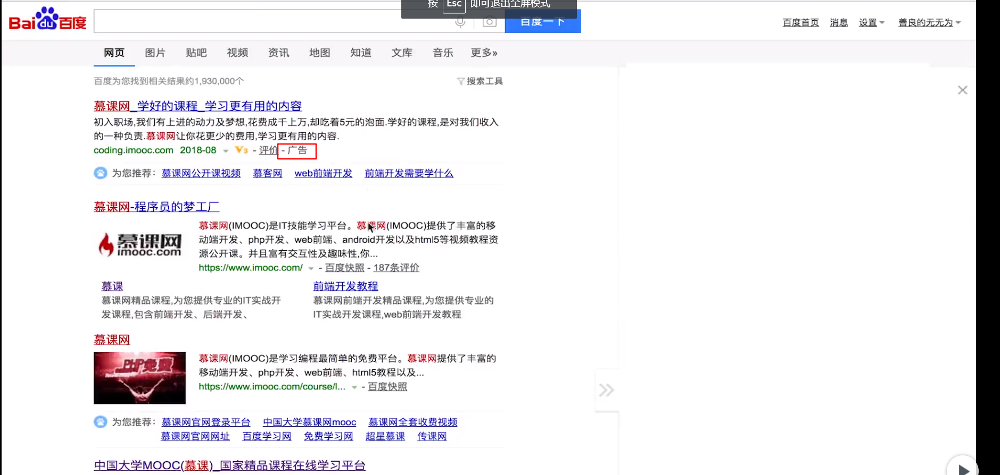
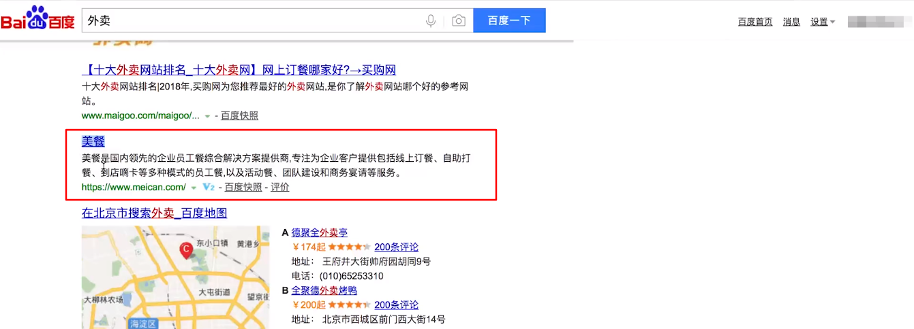

# 9.第9章 SEO技巧的融入

[TOC]

## 9-1  什么是SEO， 为什么服务器端渲染对 SEO 更加友好 ？

### 什么是 SEO 

SEO（Search Engine Optimization）搜索引擎优化。

### 思考一个问题，如何让我们自己的网站获得外部的流量？

我们大多数人在使用网络获得一般资讯的过程是打开浏览器访问百度或者谷歌等搜索引擎网站来搜索相关内容，那么是否可以通过让这些搜索引擎返回我们的网站呢？

通常我们认为一个网站要想在这些搜索引擎网站的搜索结果中靠前，是通过花钱来实现的。但其实也可以不用。

我们首先来区分一下哪些网站是广告网站呢？如下：



带有广告标示的列表项就是广告内容，而剩下的网站中就搜索引擎通过其他的方式排列出来的。而一般靠前的是搜素引擎认为质量比较高的网站。

而让一个网站成为让搜索引擎让其排列靠前的技术，就是 SEO。也就是，通过一些技术手段让我们的网站在搜索引擎的结果中排名尽量靠前。

### 为何 SSR 对 SEO 更友好

首先，你的网站是否靠前完全取决于搜索引擎（如百度）认为你的网站是否有价值。那么搜索引擎在认为你的网站是否有价值之前，一定需要知道你网站中的内容，而了解你网站内容的方式一般是使用一些爬虫来抓取你网站中的内容，也就是查看源码，并且绝大多数搜索引擎是不认识 js 内容，只识别 html 中的内容，所以你的网站如果是客户端渲染（CSR）则对于大多数搜索引擎而言是无法识别你网站中的内容的，那搜索引擎就很可能认为你网站没什么东西，也就无法给你一个好的排名，而服务器端渲染（SSR）的网站因为在 html 中有内容所以可以被识别。


很多同学认为 SEO 是指对你网站中 title 与 meta 的 description、keyword 的识别，但其实并不只是这么简单。


## 9-2 Title 和 Description 的真正作用

Title 和 Description 对于 SEO 的作用其实并不是很大。举个例子：

比如你搜索「美餐」这个关键词，然后会得到一个 title 叫做「美餐」的网站，如下：



这个网站不只 title 不含有「外卖」这个关键词，连 description 也不带「外卖」，但搜索外卖却能搜索到。这是为什么？

当你使用百度搜索「外卖」时，百度肯定会去查找与「外卖」最相关的网站，但它查找是否相关，并不是通过 title 和 description，而是基于一个全文的匹配。全文的匹配是指，搜索引擎会将你整个网站的文字内容都提取出来，甚至是这个网站的其他页面内容也一样，提出来以后会做一个分析，分析的结果就是对你这个网站内容的定位，也就是大致上确定你的网站到底在做什么。而「美餐」这个网站经过分析以后，虽然 title 与 description 中并不包含有「外卖」的关键词，但搜索引擎会认为你的网站是与「外卖」相关的网站，那么就会出现在搜索结果中。

现在的搜索引擎是基于全文搜索的第二代搜索引擎，你的 title 与 description 对你的排名依据非常小了。那么你想通过只在网站中添加 title 和 description 来提升排名是很困难的。但 title 与 description 却又很重要，如下：


在搜索「慕课网」关键字后会在返回的列表中出现如下两个网站，但它们的 title 却不同，相比之下，上面网站的 title 给出了更多的信息，而且这个 title 对于用户而言可能会更有吸引力，那么用户点击这个网站的可能性就会增加。

而 description 的内容一般会显示在返回列表中每一项的描述部分，同样，它能帮助搜索者了解你网站的具体内容，那么好的 description 对于搜索者而言也会具有吸引力，那么他点开你的网站的可能性也会增加。

所以，title 和 description 的真正作用并不在于提升 SEO（排名靠前），而在于提升你网站在搜索结果中被点击的可能性，也可以说为转化率。


## 9-3 如何做好 SEO

SEO 的内容其实很多，这节课会讲到一些核心的内容。

首先我们考虑一下，一个网站如果从内容的角度来说，是由哪些部分组成的呢？

基本上都是由文字、多媒体（图片、音乐、视频、flash、Canvas）、链接这三部分所组成的。

而我们知道，搜索引擎在判断一个价值如何时也就是从这三方面来判断的，那么做好 SEO 就是对这三方面做好优化。

### 文字优化

我们如今的时代是自媒体时代，在自媒体时代文字内容的原创性价值肯定比抄袭的价值高（从内容本身来说，是肯定的），那么对于谷歌、百度这样的搜索引擎在分析文字时，会把原创性作为一个非常重要的指标。因此，如果你的博客一直是抄别人的文章，那么肯定你的博客就会被认为没有太大的价值，所以，原创是非常重要的。（Lee 提到一个有趣的方式，将你要抄袭的文章去翻译软件上转成英文、德文、日本等，再转回中文使用，但他觉得最好还是不要抄袭，引用也要给个出处，需要一个道德素养，我觉得他说的非常好，尊重别人的劳动价值）

### 链接优化

链接分为两种，一种是网站内部自己的链接跳转到自己的网站，被称为**内部链接**。而另一种是其他网站的链接跳转到到你自己的网站，被称为**外部链接**。

1.内部链接所访问的网站内容要和主网站内容相关，相关性越强，则 SE 认为你的网站价值越大。

因为，如果你的网站是做教育培训的，而你的网站的链接却是去到一些体育、游戏等网站，则你的网站就会被认为不靠谱，认为没有在做本职工作的培训，而是做在其他的事情。

2.外部链接越多，则越有价值

外部链接越多说明你的网站影响力更大则更有影响力则更有价值，因此你可以到别的网站去多发一些你自己网站的链接，这样你的网站就有可能更靠前一些。

### 多媒体优化

如今的搜索引擎已经可以对图片等多媒体进行识别和收集，尤其像是 google 这样比较先进的搜索引擎。

在两个文字与链接基本相同的网站上，有图的网站会比没图的网站排名更靠前，因为 SE 认为你的网站更丰富。


根据上面简单的一些关于 SEO 的内容，在 SSR 的基础上会让你的网站排名更靠前。

那么思考一个问题，在以上内容无法优化的情况下，我们可以通过什么来对我们的框架进行优化呢？

Title 与 Description。下节课讲解。


## 9-4 React-Helmet 的使用

这节课使用 React-Helmet 来定制页面独立的 title 和 description。

> React-Helmet 的 GitHub 仓库：https://github.com/nfl/react-helmet

首先要记得安装 React-Helmet。React-Helmet 是可以帮助我们对不同的页面组件设置不同的 head 信息，比如 link、meta、title 等。（这个可重用的 React 组件将管理对文档头的所有更改。）

因为对于 SPA 来说，其实际上只是一个页面，内部的链接跳转也并非刷新页面，那么如果我们想让 title 和 description 不同则就需要使用 React-Helmet 来帮助我们对每一次跳转产生的新页面组件都单独设置一个 title 和 description。

根据官方文档的说明，就是很简单就能使用 React-Helmet。比如在我们的 Home 组件中，我们添加如下代码：

```jsx
// Home/index.js
import { Helmet } from 'react-helmet'

render() {
  const { name, list } = this.props
  return (
    <Fragment>
      <Helmet>
        <meta charSet="utf-8" />
        <title>欢迎来到首页 - Home 组件</title>
        <meta name="description" content="首页面的描述就是没有描述" />
      </Helmet>
      <h1 className={styles.homeTest}>My first App</h1>
      ......
```

其实就是引入 'react-helmet' 中的 Helmet 组件，然后在这个组件内部写入一些 head 中需要引入的标签即可。

如果一个路由状态下渲染的多个组件都使用了 Helmet，那么嵌套内部的 Helmet 组件会覆盖外层的 Helmet，而下面的组件会覆盖前面组件的 Helmet。比如在这里，如果 Header 组件中也有 Helmet，那么会被 Home 组件中的 Helmet 给覆盖掉。

### 服务器端的使用

由于以上的方式只能在客户端渲染时有效，我们通过官方文档中 「Server Usage」 部分的说明来搞定服务器端的使用。

官方代码示例：

```jsx
ReactDOMServer.renderToString(<Handler />);
const helmet = Helmet.renderStatic();

const html = `
    <!doctype html>
    <html ${helmet.htmlAttributes.toString()}>
        <head>
            ${helmet.title.toString()}
            ${helmet.meta.toString()}
            ${helmet.link.toString()}
        </head>
        <body ${helmet.bodyAttributes.toString()}>
            <div id="content">
                // React stuff here
            </div>
        </body>
    </html>
`;
```

它的意思是在你使用了 renderToString 方法的下面，对 Helmet 组件执行其 renderStatic() 静态方法，然后就可以在返回的字符串模板中通过返回的示例 helmet 来获取页面中 Helmet 组件内对 header 的配置了。

我们到 .src/server/utils.js 下来对自己的代码进行更改：

```jsx
import { Helmet } from 'react-helmet'

export const render = (req, store, routes, context) => {
  const reactContent = renderToString(
    <Provider store={store}>
      <StaticRouter location={req.path} context={context}>
        <div>
          {/* {routes.map(route => (
              <Route {...route} />
            ))} */}
          {renderRoutes(routes)}
        </div>
      </StaticRouter>
    </Provider>
  )
  const helmet = Helmet.renderStatic()
  
  ...
  
    return `
    <html>
      <head>
        ${helmet.title.toString()}
        ${helmet.meta.toString()}
        <style>${cssStr}</style>
      </head>
      <body>
```

如上，就可以在返回的首屏页面中添加定制化的 title 啦。

## 9-5 课程总结


### 第一章

01-01 什么是服务器端渲染

- 在早期的网站使用 java 与 php 开发的页面都是由服务器端渲染的。

01-02 什么是客户端渲染 

- js 渲染的页面就是客户端渲染

01-03 React 客户端渲染的利弊

- 对比了服务器端与客户端渲染，讲了**同构**的概念，同构是让我们的代码在客户端和服务器端都执行一遍，使网站具备两者的特性。

### 第二章

- 从 React 语法层面来编写 SSR 方面的内容。

- 由于我们的使用的是 React 来构建 SSR，那么我们就需要搭建客户端执行与服务器执行的两套环境，也因此我们需要有两套 webpack 的配置。
- 为什么 react 能够做服务器端渲染，是因为它是建立在 虚拟 DOM 上的框架，有了虚拟 DOM 才使我们的服务器端渲染得以实现。
- 使用 nodemon(node monitor) 来自动监听文件的改变帮我们重新启动前后端的服务器。
- 使用 npm-run-all 这个模块来帮助我们一次运行多条 npm 指令。

### 第三章

- 开始具体的讲解同构方面的内容。
- 讲解了代码在服务器上是如何执行，在浏览器上是如何的执行。

### 第四章

- 讲解了服务器渲染中一些具体实现。
- 讲解了路由的实现，不能以以前的方式来写路由（以 Route 组件的形式排列嵌套），而我们是借助一个第三方模块`react-router-config` 进行路由的配置，并使用其提供给我们的方法 renderRoutes() 来帮助我们自动的识别路由配置。跳转依然使用的 Link 组件。

### 第五章

- 我们引入了 Redux 框架，讲解了 Redux 框架如何与 SSR 结合。
- 这一块的难点在于数据的准备。当我们在做服务器端渲染的时候，需要保证页面在渲染之前准备好数据，接触 loadData 我们得以实现这一点。
- 通过 loadData 方法内部对 action 进行派发，将派发结果返回的 promise 添加到一个数组中，等所有 loadData 都执行完毕并且都返回 promise 以后，我们通过 Promise.all 来对数组 promise 做一个判断，如果其中出现了 rejected 状态的 promise 那么我们就执行 catch 中的语句，如果都为 resolved 状态则说明我们的数据已经都准备完成，那么我们执行 then() 中的语句。通过 then 中执行 render() 方法我们返回了服务器端渲染完成后的 html 代码并发送给客户端。
- 由于我们为了将客户端的代码与服务器端的代码保持一致，因此讲解了数据的注水与脱水。
- node 作为中间层 proxy 代理，代理过程中会携带 cookie 作为登录请求状态判断的依据，因此需要单独配置 proxy，比如要从 req 中取出 cookie 的内容带在请求上传给数据服务器。
- 针对服务器端与客户端的请求如何做不同的处理，我们借助了 axios 的 instance 的概念。如果是服务器端请求远程的服务器，则我们直接调用对应的网址请求 api；如果是客户端请求远程的地址，则需要先请求代理的服务器，代理服务器再发请求。

### 第六章

- 服务器与客户端创建 store 的差异。

### 第七章

- 借助 context 实现服务器端渲染时与组件之间的通信从而实现 404（服务器无此页面）、301（重定向）的内容，包括服务端样式渲染的内容。

### 第八章

- 通过高阶组件让我们的代码写的更优雅。
- 借助 css-loader 来实现 css 样式的打包。

### 第九章

- SEO 的概念和 react-helmet 这个模块如何在服务器端使用。使用了 react-helmet 可以独立的定制我们每一个页面 head 标签中的内容，比如 title 和 description，从而让我们的页面在搜索引擎返回的列表结果中有一个更好的转换率。

服务器端渲染是一个非常复杂的技术流程，之前我们只要写一些 js 前端代码即可，现在我们要去写 node 端的代码，所以它让我们项目的整体架构变得复杂了，我们需要在前端与后端之前再引入一个 node 中间层，以前一个项目可以只需要一个好的前端工程师和一个后端工程师，现在维护一个 ssr 项目还需要一个 node 工程师，从而增加了我们项目的复杂度。同时，我们也知道，我们的 js 代码不只要在客户端执行一遍，也需要在服务器端执行一遍，这就意味着我们的 node 端需要执行大量  react 渲染计算，而这样的计算是非常消耗性能的，因此也就增加了我们项目额外的损耗，中间层需要更多的机器来帮忙运算，这样无论在费用还是维护成本上也算是一个比较大的负担，所以这是 SSR 的一些缺点。包括调错，以前前后端进行联调测试的时候，或是线上出现 bug 的时候，不是前端出错就是后端出错，现在如果出错了则还需要定位 node 端。

但是，SSR 却可以带来用户体验的提升，一个是首屏渲染时间（TTFP)，这个的时间会明显的缩短，因为当用户看到用户返回的 html 的时候就能直接看到页面，不需要像客户端渲染那样等待 js 加载完成才能看到页面。

还有一点，SSR 可以帮助我们提升 SEO，以前客户端渲染的内容是没有办法帮我们做 SEO 的，因为其返回给客户端的内容就是一个空白的 HTML，SSR 让我们的 html 包含了整个网页的内容，这样你的搜索排名会相对更好一些。

讲师建议，除非你的项目对 SEO 和 TTFP 有非常高的要求而且能够忽略性能上的影响时再去使用 SSR 这种架构体系去设计你的代码。如果你的网站在使用客户端渲染时就已经渲染很快了，而且对于 SEO 没有特别大的需求时，这个时候还是建议不要使用这么复杂的框架，直接正常的使用 react.js 就好了。这也是为什么 react 官方不推荐大家使用这种服务器端渲染的概念，因为这样会让你的项目变得会对以前复杂的多。

如果假设我们的项目对 SEO 有非常高的要求，但对 TTFP 要求不高时，这种请求我们应该如何去做呢？下节课会通过讲解预渲染的思维来帮助自己做一些 SEO 的优化即可。


## 9-6 使用预渲染解决SEO问题的新思路


比如我们有一个 React 项目，这个项目不必是一个 SSR 的项目，只要是一个普通的 React 项目就行。对于一个普通用户来说（如上图中的男孩子）去访问这个 react 项目时，你正常返回一个带有 react.js 的页面，我在本地执行 js 来渲染页面即可，也不需要做 SSR 的处理。但对于一个爬虫而言，如何和用户一样直接去访问这个项目的话，那对于绝大多数爬虫而言肯定就不知道你页面中的内容是什么，因此就不会有一个好的排名。这个时候我们就需要使用到预渲染。

当我的网站被访问时，我们先判断一下到底是普通用户还是爬虫在访问我们的网站，如果是爬虫，那么就让它访问我们的预渲染服务器，预渲染服务器会去访问我们的 react 项目的内容，然后预先渲染生成一个带有内容的 html 返回给这个爬虫，这样爬虫所看到的就不是一个简单的客户端渲染的页面，而是一个包含所有内容的 html。

预渲染的过程是：访问本来的 react 项目，将执行项目过后生成的 html 页面返回给爬虫。

### 例子

首先，我们先来手动的模拟一下 prerender 的过程，假设我们是一个预渲染的工具，我们会先访问我们的 react 项目，然后打开控制台，选择 Elements 选项卡，然后对 html 右键选择 Edit as Html 然后全选复制，创建一个 html 空白文档将刚才复制的文本粘贴进去，最后将这个 html 发送给爬虫即可（当然也可以直接将复制的文本直接返回给爬虫）

上面是人手动的去执行了这个过程，实际上可以使用 prerender 这个工具来帮助我们执行上面的过程。如下过程：

1. 通过 `npx create-react-app pre-rendered-client` 来快速创建一个 react 项目并运行。

2. 然后我们创建一个叫做 pre-rendered-server 的空白文件夹，然后执行 `npm init -y` 来让这个文件夹成为一个 node 包。

3. 接着在这个包中通过 `npm i prerender` 安装 prerender（可以通过 nrm 工具帮我们快速的切换 npm 包的下载地址）

4. 接着创建一个 server.js 文件并输入一下代码：

   ```jsx
   const prerender = require('prerender');
   const server = prerender({
     port: 8000
   });
   server.start();
   
   ```

5. 然后通过 `node server.js` 运行这个服务器。

6. 这个时候，当我们判断是爬虫在访问的服务器时，我们就让其访问
   `http://localhost:8000/render?url=http://localhost:3000/` 这个地址，prerender 服务器就会帮助我们去访问 localhost 的客户端渲染的服务器并返回有内容的 html 给爬虫。

那么我们如何区别访问网站的是一个普通用户还是一个爬虫呢？


如上，我们可以在访问我们的项目之前架一台 nginx 服务器，无论是用户访问还是爬虫访问都先走 nginx 服务器对外的一个接口，比如都访问的是 www.baidu.com，那么都会先去访问我们的 nginx 服务器。nginx 服务器会根据 useragent（UA）的一些信息或者 IP 的一些信息识别出访问者到底是一个真实的用户还是一个爬虫。如果 nginx 发现是一个爬虫的话，则让请求转发给 prerender 服务器，如果是一个普通的用户则直接把请求发送给 react 项目的服务器。

所以，通过这样的架构同样可以让我们的代码有一个好的 SEO 的效果。

如果大家对 prerender 感兴趣也可以去看他的底层代码，其实其底层有一个 pendent.js 的东西。

predender 的原理是，当我们访问`http://localhost:8000/render?url=http://localhost:3000/`  这个链接访问 prerender 服务器时，这个服务器会自动的生成一个小的浏览器，然后在这个小的浏览器中去访问 `localhost:3000`，浏览器就可以查看 js 所渲染的 dom 内容并拿出来，接着 prerender 服务器把这个浏览器关掉，然后把内容再返回给爬虫。其实就是创建一个浏览器识别网站内容拿到内容给爬虫。但是会有一个问题，爬虫去访问页面时，prerender 服务器会调用浏览器去访问 react 项目，拿到结果之后再给爬虫，所以 prerender 耗时会非常长，但时间无所谓，因为你是给爬虫看。

如果对于预渲染比较感兴趣可以去看 www.prerender.io 这个网站，这个网站就详细的讲解了 prerender 的原理和使用的方式，同时也提供了 prerender 的一些便捷的使用接口。

还有，其实我们之前的 SSR 框架的项目还存在一些可以优化的地方，比如对返回给客户端的代码进行压缩，你可以创建一个开发环境创建一个线上环境，如果在开发环境就不用压缩，如果是线上的生成环境的话则压缩。

这门项目课程中带有 webpack 的内容，但是如果在加上 webpack 的内容，我们学习的曲线就非常的陡峭，因此课程中将 webpack 这块进行的简化。但是如果你对 webpack 有很深入的了解，那么你完全可以将 webpack 的知识运用到这个项目中，让这个项目变成一个符合企业工程级别的 SSR 框架。