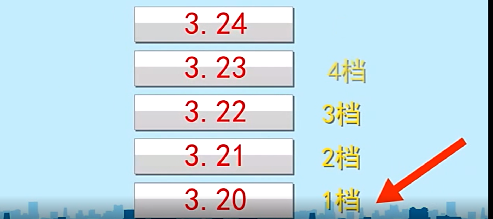
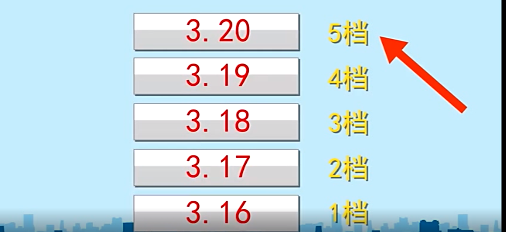
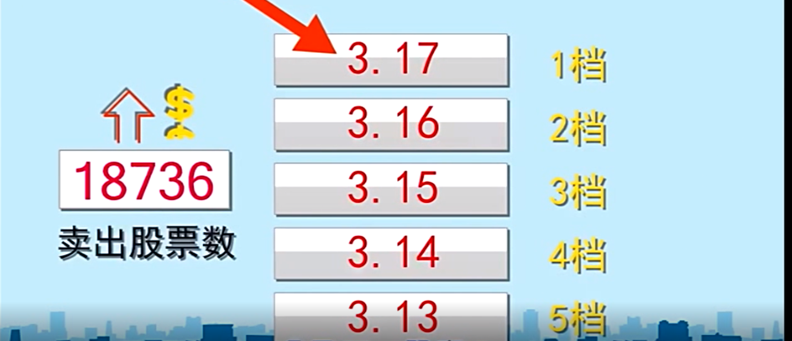
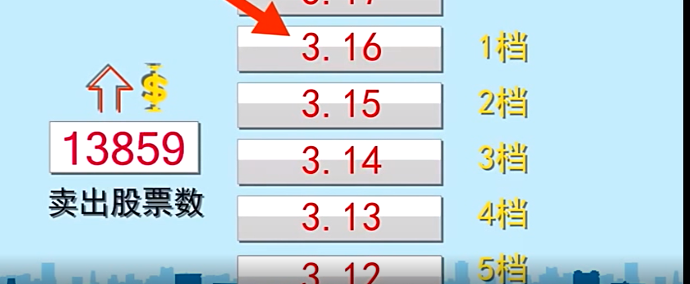
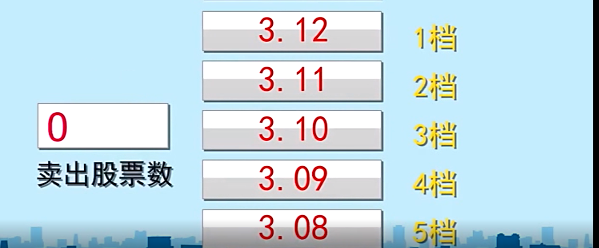

# 炒股学堂之新手入门篇

> 课程地址：http://t.10jqka.com.cn/397467712/package/index/702/

[TOC]

## 第1课：炒股第一步是什么？怎么开户？

> 买股票的必要准备：股票开户。

### 什么是开户？

开户就是股票账户，中国有两个证券交易所，一个是上海证券交易所，一个是深圳证券交易所，只有开了这两个交易所的账户才能炒股。

### 怎么开户？

在中国，投资者只能通过证券公司才能在交易所里进行交易，所以可以到证券公司开设股票账户。

可以在证券公司柜台开户，要带上身份证和银行储蓄卡。

也可以通过手机 APP 开户（比如「同花顺」），或者找一家证券公司的官网自助开户。

## 第2课：如何使用行情软件？

> 交易软件帮你查看股票行情，选你想买的股票。

### 什么样的股票好？

从初学者的角度来说，什么公司赚钱，什么公司效益好，那它的股票就赚钱。

> 中国人民银行是政府金融管理部门，不是上市公司，中国银行才是上市公司。

### 查询股票代码

在交易软件中的搜索输入框中输入你要查询的上市公司首字母就可以查看到其股票代码了。（同花顺在右下角）

## 第3课：买股流程教学

> 第一次买股票，怎么把钱转到证券账户呢？

### 怎么购买股票？

首先需要把钱转入股票账户，在交易软件中找到“银证转账”，然后点击转入。

### 什么是银证转账？

简单地说，就是把你银行卡里的钱转到证券账户去，转多少你自己决定。

### 购买股票的具体操作

在交易软件中，点击买入，在出现的窗口中，输入你要买入的股票代码，然后输入你想购买多少股。

> 买卖股票按照规定最少购买 100 股。

## 第4课：什么是股票的分时图？怎么看？

### 如何了解是否赚钱？

查看你所购买股票的分时图、k 线图等进行分析，按 enter 可以切换。

对于分时图：

- x 轴是时间。
- y 轴是价格。

每支股票在不同的时间点都会有不同的价格，把这些时间点当时的价格连接起来就形成了分时图。

对比单纯的看价格，分时图能够观察交易时间段内价格的波动。比如你所购买时的股票价格比现在股票交易价格低，说明你的股票上涨——赚钱。

### 具体赚了多少钱？

首先要知道股票当前的价格，一般在软件的右侧你就能找到股票的最新价格，或者叫现价。

## 第5课：股票买卖的 T+1 交易规则

> 即当日买进的股票，要到下一个交易日才能卖出。

### 什么是 T+1 规则？

T 加 1 规则是一种股票交易制度，即当天买入的股票不能当天被卖出，当天买入的股票要到下一个交易日才能卖出。

## 第6课：股票买卖的五档盘口

> 在股票交易软件中，显示在右上角的委托买入和卖出都按委托价高低按序排列来定的。

### 什么是大盘？

大盘是股市里的俗语，就是股市整体行情的意思。

大盘走的好不好，简单的就是看上证指数，上证指数是根据在上交所上市的股票中抽取几百只成分股的走势编制出来的，可以综合反应出股市的整体情况。

### 股票代码

- 6XXXXX —— 上交所上市
- 0XXXXX —— 深交所上市
- 3XXXXX —— 创业板上市

## 第7课：用"五档即成剩撤"快速卖出股票

> 电脑上怎么用“五档即成剩撤”？一种闪电卖出股票的方式。

股市行情风雨变幻，有时一眨眼的功夫股价就能变幻几十个价位。

### 如何最快的卖掉股票？

首先要思考，是想按照**自己设定的价位卖（自价）**，还是根据**市价**卖？

并且，想卖出去，得有人买才行。

比如，当你想以 3.2 元的价格卖出你的股票时，只有当 3.2 排在卖一档位的时候才最有可能成交，如下图：

如果一直排在后面，那么一整天基本上都不会卖出去的（成交），如下：

如果想要现在就快速卖掉，那可以使用**五档即成剩撤**。

简单的说，你手里的股票会从买一档以 3.17 开始成交，如下：

如果卖一档的买单不够买完你的股票，就会自动从第二档 3.16 开始成交，以此类推最多成交五档：

（注意，到第 5 档的 3.12 时，卖出股票数为 0）

### 如何操作？

首先要把你的卖单撤除，在个股界面下单击右键——选择闪电卖出——窗口中的报价方式换成**五档即成剩撤**——最后输入卖出的股票数。

## 第8课：如何撤单、查看委托

> 没有买进的股票需要撤单，钱才会回到账户。

涨停的股票通常卖的人会很少（也就是说，其实是可以买卖的），所以是很难买入的。

## 第9课：怎么寻找个股列表、涨幅榜

> 通过软件从股票池中分类选出个股。

A 股市场上有 3000 多只股票，但一般的股票账户还达不到开通创业板的条件，所以除了创业板的 600 多只股票外，你还有 2000 多只股票可以买卖。

### 如何操作？

单机行情软件里最上面一栏的「报价」——在出现的下拉菜单中选择「泸深分类」——然后选择「沪深 A 股」

这个时候软件就会切换到个股列表，系统默认是按照股票代码来排列的，可以通过单机列表最上方的标题来选择不同的排序方式查看股票。

## 第10课：跌停的两大因素

> 分清为什么跌停，避免成为接盘侠。

对于**低买高卖**要具体分析。（因为有可能很低的股票也会继续下跌）

### 什么是跌停板？

跌停板是股票下跌的极端现象，说明做空力量非常强大，当某一支股票在跌停板的价位上还有很多卖单时，说明很多人想跑。

> 做空是一种[股票期货](https://baike.baidu.com/item/%E8%82%A1%E7%A5%A8%E6%9C%9F%E8%B4%A7)等投资术语：就是比如说当你预期某一[股票](https://baike.baidu.com/item/%E8%82%A1%E7%A5%A8/22647)未来会跌，就在当期价位高时卖出你的股票，再在股价跌到一定程度时买进，这样差价就是你的利润。其特点为先卖后买的交易行为
>
> 做空，是一个投资术语，是金融资产的一种操作模式。与做多相对，做空是先借入标的资产，然后卖出获得现金，过一段时间之后，再支出现金买入标的资产归还。做空的常见作用有投机、融资和对冲。其中用做空投机是指预期未来行情下跌，则卖高买低，将手中借入的股票按目前价格卖出，待行情跌后买进再归还，获取[差价](https://baike.baidu.com/item/%E5%B7%AE%E4%BB%B7/1309028)利润。其[交易行为](https://baike.baidu.com/item/%E4%BA%A4%E6%98%93%E8%A1%8C%E4%B8%BA/4093956)特点为先卖后买。实际上有点像商业中的赊货交易模式。这种模式在价格下跌的波段中能够获利，就是先在高位借货进来卖出，等跌了之后再买进归还。
>
> 做空是[股票期货](https://baike.baidu.com/item/%E8%82%A1%E7%A5%A8%E6%9C%9F%E8%B4%A7)市场常见的一种操作方式，操作为预期股票[期货市场](https://baike.baidu.com/item/%E6%9C%9F%E8%B4%A7%E5%B8%82%E5%9C%BA)会有下跌趋势，操作者将手中筹码按市价卖出，等股票[期货](https://baike.baidu.com/item/%E6%9C%9F%E8%B4%A7)下跌之后再买入，赚取中间差价。做空是[做多](https://baike.baidu.com/item/%E5%81%9A%E5%A4%9A)的反向操作，理论上是先借货卖出，再买进归还。一般正规的做空市场是有一个第三方[券商](https://baike.baidu.com/item/%E5%88%B8%E5%95%86)提供借货的平台。通俗来说就是类似赊货交易。这种模式在价格下跌的波段中能够获利，就是先在高位借货进来卖出，等跌了之后再买进归还。这样买进的仍然是低位，卖出的仍然是高位，只不过操作程序反了。

通常来说，一个股票跌停可能是涨得太多，也有可能是利空消息的影响，总之后果就是造成大量资金出逃，股价持续下跌。

> 利多和利空
>
> 利多又叫利好，是指有利于股价上涨的信息，如公司经营业绩好转、银行利率降低、社会资金充足、银行信贷资金放宽、市场繁荣等。
>
> 利空是指能够促使股价下跌的信息，比如说公司经营业绩恶化、银行利率调高、经济衰退、通货膨胀、天灾人祸等。
>
> 利多与利空如何区别？
>
> 从以下四个方面去着手分析：
>
> - 第一是根据股市供求关系的影响，供求关系与股市资金共同决定股价的涨跌。一般来讲，股市资金相对充足，股票供不应求时股价就会上涨，那相反股市资金相对紧张，股票供过于求时股价就会下跌。
> - 第二是对股民炒作收益、交易难易程度的影响，如股票交易税费的变化，如果说费率增加，它会增加股票的炒作难度，减少股民收益因此它便是利空消息。
> - 第三点是对上市公司经济效益的影响，包括多个方面，比如说国家是否安定、政治经济局势是否平稳、公司自身管理水平的高低等。可以说一切影响上市公司经营效益的信息都是利空信息。而有利于增加公司经营效益的信息都是利多信息。
> - 第四点是对股票投资价值的影响，有利于**增加股票相对投资价值的消息就是利多消息，否则便是利空消息**。比如说储蓄利率上调，那么股票投资价值相对减少，所以它就是一个利空消息。（这一点是资金流动问题，利率上调则大家就会把钱存在银行而不是选择投资其他金融产品）（相应的就对应着大众的心理，有些人更喜欢低风险低回报的投资，比如存银行，而有的人则喜欢高风险高回报的投资，比如股票）
>
> [股市利空](https://baike.baidu.com/item/%E8%82%A1%E5%B8%82%E5%88%A9%E7%A9%BA/8383731)是股市用语。利空是指能够促使股价下跌的信息，利空往往会导致股市[大盘](https://baike.baidu.com/item/%E5%A4%A7%E7%9B%98)的整体下跌，不断的[利空消息](https://baike.baidu.com/item/%E5%88%A9%E7%A9%BA%E6%B6%88%E6%81%AF/3068551)会造成股市价格不断下跌，形成“[熊市](https://baike.baidu.com/item/%E7%86%8A%E5%B8%82/497367)”。

（对于那种跌入低谷的股票，根据判断，如果你觉得会上升就等上升一部分后再卖，如果你觉得会下降就现在卖以避免造成更大的损失。）

## 第 11 课：什么是 ST 股？

> ST股多为问题股，投资需谨慎。

对于股票新手来说，股票市场有很多雷区，如果你什么都不知道就往里冲，当然容易受伤。

所以，对于新手来说最好不要碰 ST 股票。

ST 是 special treatment 的缩写，就是特别处理的意思。

如果一个股票是 ST 股，那就说明这个公司是有很大问题的。可能是连续两年亏损，或者股东权益低于注册资本，也可能是财务状况异常等情况。总之，就是这些公司都有不小的问题，有的还很奇葩。

举个例子，有个叫 ST 博元的公司，因为连续亏损快要被退市了，这个时候它发了个公告，说咱们公司的董事长有个高中同学，自愿无偿捐赠福建旷宇公司 95% 的股权给 ST 博元，价值 8 个亿，公司突然实现扭亏为盈。网友们都戏称这是「中国好同学」，后来 ST 博元坑是在太多，填不过来还是被强制退市了。

以 ST 开头的股票就是 ST 股。