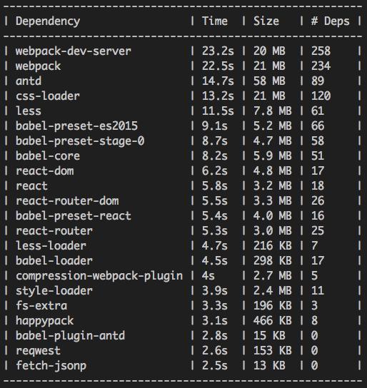

# 第04课：摆脱冗长的等待——构建流程优化

[TOC]


随着 JavaScript 应用规模和复杂度不断提升，构建速度逐渐成为了让开发者头疼的问题。不仅是本地工程启动慢，在进行发布时每次开发和 QA 都要等好几分钟才能进行验证，拖慢了开发效率。这篇文章会讲解如何从 npm 和 Webpack 的角度进行优化让构建更快。

下文会聊到很多种策略，首先需要强调的是，**一种优化策略通常只是针对一类场景，不是所有的优化点放在我们的项目中都有效。**因此我会先从原理上去分析构建的流程，以及在这些流程部分中哪些容易成为性能的瓶颈。希望大家**在遇到类似的问题时能对症下药，分析出问题的原因，然后找到对应的解决方案进行优化**。

## 从 npm install 开始

假设我们刚刚把工程代码从 git 仓库拉下来，准备进行构建和发布。那么对于一般 JavaScript 应用来说，第一步通常是使用 npm/Yarn 等包管理器安装项目依赖。对于我们来说很简单，只是执行一个命令（以下以 npm 为例）：

```shell
npm install
```

接下来 npm 在安装流程中会经历以下几个阶段：

1. 分析包依赖关系和确定版本。npm 首先会检查是否有版本描述文件（package-lock.json），通过它来获取包的下载地址和版本等信息。如果没有版本描述文件则要根据 package.json 和 semver 规则来进一步分析。比如一个包的版本是 `^1.1.0`，则 npm 会去仓库获取符合该语义规则的最新版本。然后通过依赖关系递归地去获取更多的包及其相应版本，最后得到项目所有需要的包信息。
2. 接下来 npm 会获取包的下载地址。在版本描述文件中一般会有 `resolve` 字段，这就是用来记录每个包下载地址的。如果没有的话 npm 会调用仓库的接口，比如它会告诉仓库需要 `split` 这个包的 `1.1.2` 版本，接着仓库会返回一个压缩包地址，如果没有找到则会返回 404，安装过程即报错终止。
3. 下载包（或使用缓存）。有了下载地址之后，npm 会首先检查缓存，如果已经下载过同样的包（包名、版本、仓库均相同），就直接使用缓存。相反如果没有找到缓存则会再从仓库下载。（这也是为什么描述文件中会有 integrity 项）
4. 将下载后的压缩包解压（或者直接使用缓存）拷贝到 node_modules。在这个过程中有些包还会调用其生命周期函数，如 `preinstall`、`postinstall` 等。

### 固化 npm 包信息

在上面的流程中，第一个耗时的事情就是递归地分析包的依赖关系和版本。一个项目中有几十个甚至上百个包是很正常的事情，并且大多数包都有其自身的依赖。npm 需要逐层去分析每个依赖的版本，最后再将这些树状关系拍平，在大型工程中这是个很耗时的过程。

优化的办法很简单，就是在项目中维护一份版本描述文件。可以使用包括 shrinkwrap.json（ npm 5 以下）、package-lock.json（ npm 5）和 yarn.lock（ Yarn ），任何其中一个都可以。版本描述文件中已经记录了依赖包的各种信息，也就不用再重新获取一遍了。在一般的实际工程中，使用了版本描述文件可以使整个 npm install 的过程缩短 10s 以上，这个收益是非常可观的。

### 仓库与镜像

在国内一般我们使用淘宝提供的 npm 仓库来提升下载包的速度。

```shell
npm config set registry https://registry.npm.taobao.orgj
```

但是有时仅仅设置了仓库还不够，有些包定义了生命周期函数（比如上面提到的 `postinstall` ）用来在安装过程中执行特定的脚本。这些脚本很多是用来下载第三方的辅助文件，比如 node-sass 需要下载二进制包来编译 SASS。而像这样的文件通常放在外网直接下载很慢，需要指到国内的镜像地址。在“去哪儿网”我们搭了一个[镜像平台](https://ued.qunar.com/mirrors/)用来放一些常用文件的镜像，有需要的同学可以自取。

### 查找臃肿的依赖

开发过程中难免会添加一些冗余的包，可能最初我们只是想测试它的功能，但是后来忘记去掉，亦或是我们在使用某一个非常庞大的工具类库，只为了其中的一个接口，而实际上却存在更加轻量简洁的解决方案。

这里推荐一个用来检测依赖大小的工具叫 [slow-deps](https://github.com/nolanlawson/slow-deps)，通过它我们可以找到哪些东西影响了 `npm install` 的速度。



从上图可以清晰地看出每个包的安装时间、包的大小、以及它自身依赖的情况。如果哪个包太大，我们可以尝试寻找一些轻量级的替代解决方案。

## 打包流程分析与优化

相信很多 Webpack 的使用者都经历过打包速度慢的问题。我之前也是被这个问题困扰过一段时间，后来发现影响 Webpack 打包速度一般来说也就那么几个因素，**只要找到项目中构建性能的瓶颈并将其优化掉就能大幅缩短整体构建时间**。

如果把整个 Webpack 打包的过程理想化，那么可以将其看作为一个函数。输入是所有工程模块，包括项目中模块和 node_modules 中的模块，输出自然就是最终的 JS、CSS、HTML 等静态资源。在这个函数的内部主要就做了这两件事情：

1. 依赖处理。从 Webpack 配置中的入口文件开始，逐层进行依赖分析，最终得到整个应用的依赖树。
2. 文件编译。**每个依赖树中的文件都要根据配置来决定要把它交给哪些 loader 来处理，打包过程中最耗时的地方也就在这**。假如说我们工程中有 TypeScript 模块，那就要用对应的 ts-loader 来将其编译为 JavaScript。如果是 SASS，那就用 sass-loader 来编译为 CSS。有时我们还会使用链式的 loader 来对文件进行多步处理。

下面我们分几个切入点来讲如何使 loader 来更快地完成工作。

### 减少不必要的编译过程

每个 loader 都有其作用的范围，我们应该使这个范围尽可能缩小来避免冗余的工作。

```jsx
module: {
  // 配置 Webpack 完全忽略的目录
  noParse: [/moment-with-locales/],
  loaders: [
    {
      test: /\.ts$/,
      // 配置 loader 忽略的目录
      exclude: [/node_modules/],
      loaders: ['typescript-loader']
    },
    {
      test: /\.js$/,
      // 忽略目录（除了某几个子目录）
      exclude: /node_modules\/(?!(MY-MODULE|ANOTHER-ONE)\/).*/,
      loaders: ['babel-loader']
    }
  ]
}
```

`noParse` 是整个 Webpack 完全忽略的目录，甚至连 `require`、`import` 都不会处理，所以它应该是完全独立的模块（比如某些打包好的框架类库）。`exclude` 只对 loader 生效，或是 loader 忽略该目录，最常见的用法是忽略 node*modules。但是当我们只想对 node*modules 中的某几个目录使用 loader 时，也可以通过上面例子中的正则匹配来实现。

### 公共代码与 CommonsChunkPlugin

如何有效地减小构建时间？首先应该优先关注最耗时的部分，而最耗时的部分往往是框架类库等比较大的模块。可以利用 [webpack-bundle-analyzer](https://github.com/webpack-contrib/webpack-bundle-analyzer) 这样的工具进行打包结果分析，找出体积占比最大的模块。

有一天一个同事找我说他们用 Webpack 的时候总是出现内存溢出的问题，导致打包到一半就终止了。我看了他们的项目，发现这个问题在于有太多重复打包的模块。首先，这是个后台管理系统，包含 20 多个页面，每个页面都对应一个入口 js。其次，它使用了 Ant Design，并且每个入口 js 都单独引用了所有组件的样式，这意味着相同的样式代码被 loader 重复处理了 20 多次。一份完整的 Ant Design 样式就已经很大了，而在这个工程中将同一份样式编译 20 多次，也难怪会内存溢出了。

这种情况一般可使用 `CommonsChunkPlugin` 来提取相同模块。如果说将打包过程理解成每个入口都各自生成一个依赖树的话，那么通过 `CommonsChunkPlugin` 可以将每个依赖树中相同的模块找出来，并提取出来单独进行处理，这样相当于减少了总体的打包模块数量。下面是一个简单的 `CommonsChunkPlugin`配置（[ Github 地址](https://github.com/roscoe054/webpack-examples/tree/master/09-commons-chunk)）：

```jsx
new webpack.optimize.CommonsChunkPlugin({
    // 指定该代码块的名字
    name: "commons",
    // 指定输出代码的文件名
    filename: "commons.js",
    // 指定最小共享模块数
    minChunks: 3,
    // 指定作用于哪些入口
    chunks: ["pageA", "pageB"，"pageC"]
})
```

其中 minChunks 需要单独解释一下。它代表一个最小值，当工程中至少有超过该值数量的入口引用了相同的一个模块时，这个模块才会被提取到 commonChunks 中。比如说工程中有 5 个入口文件，而 minChunks 是 3。那么当有 3 个或 3 个以上的入口文件引用了 react，react 就会出现在 commonChunks 中。相反如果只有 2 个入口引用了 react，那么 react 就会分别被打包到这两个入口生成的 JS 文件中。

使用 `CommonsChunkPlugin` 不仅可以有效提升打包速度，也能减小最终的资源体积。通常由于一些公共的代码改动频率较低，将其提取为单独的 JS 文件对于用户端缓存也是一种优化。

### 从动态链接库的思想谈打包

在早期的 Windows 系统当中，由于受限于当时计算机内存空间较小的问题，出现了动态链接库这样一种节省内存的方式。我们知道**当一段相同的子程序被多个程序调用的时候，相当于这段代码重复出现了多次，也会成倍地占用内存空间。为了节省内存，可以将这段共享的子程序存储为一个可执行文件，被多个程序调用时只在内存中生成和使用同一个实例即可**。

如果将类似的思路放在打包上面来看也可以起到优化的效果。相同的模块有可能会被多个入口引用，我们可以将这部分模块预先编译好，然后在项目打包的过程中直接去调用编译好的文件即可。这就是 Webpack 中 DllPlugin 的实现思路，当然它实际生成的还是 JS 文件而并不是真正的动态链接库，一般我们管它叫 vendor。

在具体的配置上主要分为以下几步：

- 配置动态链接库：首先需要为动态链接库单独创建一个 Webpack 配置文件，比如叫做 `webpack.vendor.config.js`。该配置对象需要引入 DllPlugin，其中的 entry 指定了把哪些模块打包为 vendor。
- 打包动态链接库并生成 vendor 清单：使用该配置文件进行打包（示例中运行 `npm run dll`）。会生成一个 vendor.js 以及一个资源的清单，这个清单我们一般叫做 manifest.json，在内部每一个模块都会分配一个 ID。
- 将 vendor 连接到项目中：在工程的 `webpack.config.js` 中我们需要配置 DllReferencePlugin 来获取刚刚打包出来的模块清单。这相当于工程代码和 vendor 连接的过程。

由于配置代码比较多，这里不进行详细列举，请查看 [Github 上的示例](https://github.com/roscoe054/webpack-examples/tree/master/10-dll-plugin)。

### 利用多进程

上面的方法都是从减小打包模块入手的，现在让我们换一个思路，在模块数不变的前提下，如何以更短的时间去完成打包和编译？

答案就是利用多进程。这并不需要我们去写过多的代码，已经有工具做好了这件事。

Happypack 是一个可以有效利用多进程来编译文件的工具。上面我们已经分析了打包主要分为**依赖处理**和**文件编译**两部分，其实这两部分是在交替进行的。比如工程的入口为 `a.js`，那么 Webpack 首先把 `a.js` 交给 loader 去编译。接着由于从 `a.js` 引用了 `b.js` 和 `c.js`，那么这两个 JS 文件也要进行编译。很容易想到 `b.js` 和 `c.js` 的编译过程其实是完全独立的两个任务，互相之间没有依赖关系也不在乎顺序。因此可以将它们分别交给不同的进程来处理，并最后将编译的结果传回主进程，这就是 Happypack 的核心思路。

下面看一个简单的例子（[ Github 地址](https://github.com/roscoe054/webpack-examples/tree/master/11-happypack)）：

```js
const HappyPack = require('happypack');

module.exports = {
  module: {
    loaders: [
      test: /\.js$/,
      // 替换原来的 loader 为 "happypack/loader":
      loaders: ['happypack/loader'],
    ]
  },
  plugins: [
    new HappyPack({
      // 配置实际的 loader
      loaders: ['babel-loader?presets[]=es2015']
    })
  ];
};
```

使用 HappyPack 也有一些限制，它只兼容部分主流的 loader，具体可以查看官方给出的[兼容性列表](https://github.com/amireh/happypack/wiki/Loader-Compatibility-List)。

除了打包过程中的多进程，在压缩时也可以利用多进程。通过 UglifyjsWebpackPlugin 我们可以将每个资源的压缩过程交给单独的进程，以此来提升整体的压缩效率。这个插件并不在 Webpack 内部，需要我们单独安装。

```shell
npm i -D uglifyjs-webpack-plugin
```

然后在 webpack.config.js 中进行配置。

```js
const UglifyJSPlugin = require('uglifyjs-webpack-plugin')

module.exports = {
  plugins: [
    new UglifyJSPlugin({
      // 默认是 false，所以需要手动开启
      parallel: true
    })
  ]
}
```

所有这些利用多进程的方法其实都是在充分地使用系统的计算能力和内存。对于**单个进程来说 V8 虚拟机的内存限制为 1.4GB（64 位系统）**，当构建流程变得复杂之后就有可能造成内存溢出。利用多进程的方法可以有效防止这类问题。

## 小结

在做了一些项目的构建优化之后，我发现它也是遵循“二八定律”的。假设一个项目有 10 个可优化点，当我们优化掉其中最关键的 2 个的时候就可以提升 80% 的性能。而另外 8 个优化点全部做完可能也只能提升 20% 的性能。所以最重要的是**认清当前应用的特点，找到构建性能的瓶颈，把关键点优化掉就够了**。