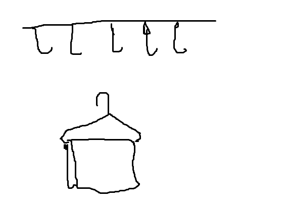

# 临时存放处

[toc]

> 用于临时存放一些不知道该放在哪里并且是最近一段时间所看到或学习的内容，用于复习或是等待归类。

## 编程想法

对函数来说，调用方只负责传参（值），而声明方则需要使用参数（值）做具体的操作，那么在 React 中，组件对方法的命名方式就可以根据这个来决定。

比如，只有拥有状态的组件可以调用 set 方法来更改状态，而状态值的获取需要在子组件中完成，并且获取状态值之后需要做一些处理。那么，我们就可以在父组件中创建一个函数接收状态值并处理，最后调用 set 方法进行存储状态。位于父组件中的处理函数可以使用比较具体的命名，比如如何处理的，处理的方式等，而子组件的接收的用于存储的方法则可以直接使用 setXXX 或 changeXXX 这样简单的命名方式，因为对于子组件而言这个方法确实只做了一件事，就是设置、更改这个状态值。

## 什么是程序中的「钩子(hook)」



> 在这里，这个衣架就相当于一个钩子，这个钩子的作用可以把毛巾挂到那上面的挂钩上。
>
> 这里大概是这样的一个意思，在程序里来说就是你定义了一个小功能，可以在任何想用的地方挂上去。这个小功能利用钩子挂上去，比如评论列表展示，可以是一个钩子，在需要的地方挂上去。
> 这个东西和插件其实差不多，但是我觉得的话，**插件的功能相对于钩子来说，更复杂，钩子的话，功能更单一更灵活**。
>
> 所以，我觉得符合钩子思想的东西就是钩子，程序如此，生活中的东西也如此
>
> 来自：https://segmentfault.com/q/1010000004335505

我的理解是，程序执行过程好比图中那一条线，执行的过程中会触碰到线上的钩子（一般是一些方法），而这些钩子是框架或是环境提供给我们的。这些钩子允许我们在上面挂载东西（方法所要执行的代码），当框架或者执行环境在调用钩子时就会执行我们所挂上去的代码。所以，我们可以利用这些钩子来使我们的部分代码在框架执行过程中的某些步骤中执行，从而实现一些特殊的功能。

当然，钩子一般所执行的功能是有所限制的，不同的钩子可能所能实现的功能也不同，其决定于框架在此钩子执行时所提供的变量等。

## zh-cn中的zh的全称是什么？

> zh全称为zhōngwén，即“中文”二字拼音。
>
> ISO 639语言编码标准中规定中文用zh表示。
>
> ISO 639-1语言列表（部分）：
>
> - ky 吉尔吉斯语
> - rw 基尼阿万达语
> - zh 中文、汉语
> - fi 芬兰语
> - la 拉丁语
>
> 拓展资料：
>
> ISO 639是国际标准化组织为各语言所订定的语言代码。
>
> 国家标准《语种名称代码 第1部分：2字母代码》制定项目由中国标准化研究院提出，于2003年列入国家质量监督检验检疫总局制、修订国家标准项目计划，项目编号：国家质量技术监督局99-9。该标准由中国标准化研究院负责起草，计划于2004年12月完成。
>
> 参考资料：百度百科 [ISO 639](https://baike.baidu.com/item/iso 639/10750664?fr=aladdin)

> zh就是中文的中字的拼音的前两位字母，呵呵
> -cn就表示中国大陆的，结合起来就是中国大陆中文，意思就是简体中文
> 像台湾的就是zh-tw，表示是台湾中文，意思就是繁体中文

## 边界检查

> 边界检查在[程序设计](https://baike.baidu.com/item/程序设计/223952)中是指在使用某一个变量前，**检查该变量是否处在一个特定范围之内**。最常见的是数组的下标检查，防止下标超出数组范围而覆盖其他数据。若是边界检查未能有效发现错误，最常见的结果是程序出现异常并终止运行，但也可能出现其他现象。由于每次都进行边界检查非常耗时，而且有些代码确定不会出现越界问题，所以这个操作并不总是需要被执行。一些现代编译器中有称为选择性边界检查的技术，可以略去一些常见的不需要的边界检查，从而提高程序的性能。
>
> 来自：[https://baike.baidu.com/item/%E8%BE%B9%E7%95%8C%E6%A3%80%E6%9F%A5/22702172](https://baike.baidu.com/item/边界检查/22702172)

首先，要知道一种语言为变量提供了哪些可以赋予的类型。比如 JS，就会有 `function` `object` `string` `number` `array` `map` `set` `symbol` `boolean` 等，那么一个变量在 JS 中的最大边界就是 `any` （相当于 JS 中的整个世界），可以被赋予任何类型，并且 js 也是允许不同的类型之间相互赋值的，但这样会在程序中造成隐患。所以，如今大家提倡使用 TS，帮助我们在编译之前检测类型问题。先不说这个，回到边界问题。那么除了最大边界范围 `any` 之外，其余的类型都会小于或者等于这个边界范围，**任何类型都在一个边界所围起来的一个固定取值范围之中**。所以边界检查就是针对这个取值范围的检查，检查这个变量是否在声明或是调用时所定义的类型边界之外，如果在之外则会做出提醒，以免程序在执行过程中发生错误而导致崩溃。

## 回调函数

> 调用回调时接收值，声明回调时定义如何使用	值。
>
> 对于函数，调用接收，定义使用。

回调函数可以使我们有能力在程序的某部分处理逻辑返回值之后添加新的处理逻辑并使用这个值，比如：

```js
function foo(a, callback){
	callback(a * a)
}

function bar(a){
	console.log(a)
}

foo(10,bar)
```

- bar 在这里为 callback，接收 a 并打印它。 foo 接收两个参数，第一个参数会用于平方运算，并将运算的结果传入到第二个参数所传入的回调之中然后调用。
- 这里就可以看出，函数是在调用时接收值，在定义时处理值。


## 函数本身不是用来复用

函数本身不是用来复用，这和很多“主流的”观点不同。

函数的存在的主要意义在于：

* **划分独立职责**
* **隐藏具体细节操作**
* **使得代码具有可读性**
* **应对扩展的变化**
* **方便进行单元测试**
* 顺带的，**偶尔可以用作复用**

函数应当遵循：

- 单一抽象层次原则：仅表达**一个抽象层次上的一件事**
- 短小原则：**函数不能过长，层次不能太深**
- 单一职责原则：**一个函数只做一件事，只做一个操作**

当发现一个函数具有以下特征时，需要考虑抽取函数

- 过长
- 嵌套层数过深。
- 自然分块，需要使用注释描述该程序块
- 判断条件过于复杂
- 函数的某些判断分支不断变化
- 参数过于复杂
- 逻辑重复

注：同时也需要注意的是，函数划分过多也是会导致更多的函数压栈、出栈操作，是否会导致消耗过大还有待研究。
————————————————
版权声明：本文为CSDN博主「专业代码搬运」的原创文章，遵循 CC 4.0 BY-SA 版权协议，转载请附上原文出处链接及本声明。
原文链接：https://blog.csdn.net/qq_25077833/article/details/53428600


## 递归、迭代、循环、遍历

作者：CyrusCao
链接：https://www.zhihu.com/question/20278387/answer/109266159
来源：知乎
著作权归作者所有。商业转载请联系作者获得授权，非商业转载请注明出处。


举个例子吧：你要给某个小孩子买玩具。

递归：你自己不太了解小孩子的需求，为了缩小范围，让你的儿子去给孙子挑选。儿子比你强点有限，但依然不太了解小孩子的需求。为了缩小范围，你又让你孙子去挑选。如此这般，直到找到合适的玩具。

迭代：你挑了一件觉得不行，又挑了一件又不行。如此这般，直到找到合适的玩具。

所以一句话：递归是自己调用自己，每次旨在缩小问题规模。迭代是自己执行很多次，每次旨在更接近目标。


------

评论区有同学问【循环】和【迭代】的区别：

循环和迭代的共同点在于，它们都是在描述一个**多次操作**。

不同点在于，【循环】侧重于描述每次操作和上一次操作**相同**之处，而【迭代】侧重于描述每次操作和上一次操作的**不同**之处。

比如一个 for 循环，其中的逻辑每次执行都相同，我们可以说它是一个循环。但 for 循环中定义的局部变量 i（每次循环自增的那个），每次执行都会有新的值代替旧的值，我们可以说它是在迭代。

如果硬要套用买玩具的例子：你要给某个小孩子买玩具。

【循环】

你去小卖铺买了一个玩具，拿回家后孩子不喜欢，你也没问他为什么不喜欢。然后你又去同一个小卖铺买了一个玩具，拿回家后孩子又不喜欢。。。如此往复 10 次，孩子才满意。

每次去买玩具的目标、行为都一样，这叫循环。

【迭代】

你去小卖铺买了个一个玩具，拿回家后孩子不喜欢。你耐心的询问后得知他喜欢乐高的玩具，于是你就去大超市给他买了乐高，回家后孩子还是不喜欢，耐心询问后得知他喜欢乐高玩具中最贵的那个玩具，于是你就去奢侈品商店给他买了乐高限量版玩具，拿回家后孩子很满意。

每次去买玩具都跟上一次不一样，或是有了新的目标，或是缩小了搜寻范围，这叫迭代。

------

补充

【遍历】

遍历：**依次**对集合中的每个元素**做且仅做**一次访问。

依次，代表具有某种顺序。比如二叉树有三种前序、中序、后序遍历。数组有顺序、逆序遍历等等。

虽然有点生硬，但还是套一下例子吧：

爷爷去玩具大厦给孙子挑选玩具 。玩具大厦共4层，分布着若干玩具店铺。爷爷必须把所有玩具店都逛一遍，才能挑选出最好的玩具。爷爷可以先从4楼开始往下逛，也可以从1楼往上逛，还可以按照3楼、1楼、4楼、2楼的顺序（爷爷有他自己的想法……）。不管怎么逛，只要保证 每家店都去过一次、不重复去，那么就可以说是遍历了玩具店集合。


## 详解URL的组成

大家都在使用URL，以及网络请求的时候各种拼接参数请求等，但是URL中每一组成部分的意义总是是不是清楚呢？

就以下面这个URL为例，介绍下普通URL的各部分组成

http://www.aspxfans.com:8080/news/index.asp?boardID=5&ID=24618&page=1#name

从上面的URL可以看出，一个完整的URL包括以下几部分：

**1.**协议部分：该URL的协议部分为“http：”，这代表网页使用的是HTTP协议。在Internet中可以使用多种协议，如HTTP，FTP等等本例中使用的是HTTP协议。在"HTTP"后面的“//”为分隔符

**2.**域名部分：该URL的域名部分为“www.aspxfans.com”。一个URL中，也可以使用IP地址作为域名使用

**3.**端口部分：跟在域名后面的是端口，域名和端口之间使用“:”作为分隔符。端口不是一个URL必须的部分，如果省略端口部分，将采用默认端口

**4.**虚拟目录部分：从域名后的第一个“/”开始到最后一个“/”为止，是虚拟目录部分。虚拟目录也不是一个URL必须的部分。本例中的虚拟目录是“/news/”

**5.**文件名部分：从域名后的最后一个“/”开始到“？”为止，是文件名部分，如果没有“?”,则是从域名后的最后一个“/”开始到“#”为止，是文件部分，如果没有“？”和“#”，那么从域名后的最后一个“/”开始到结束，都是文件名部分。本例中的文件名是“index.asp”。文件名部分也不是一个URL必须的部分，如果省略该部分，则使用默认的文件名

**6.**锚部分：从“#”开始到最后，都是锚部分。本例中的锚部分是“name”。锚部分也不是一个URL必须的部分

**7.**参数部分：从“？”开始到“#”为止之间的部分为参数部分，又称搜索部分、查询部分。本例中的参数部分为“boardID=5&ID=24618&page=1”。参数可以允许有多个参数，参数与参数之间用“&”作为分隔符。


作者：smile刺客
链接：https://www.jianshu.com/p/0466bf132448
来源：简书
著作权归作者所有。商业转载请联系作者获得授权，非商业转载请注明出处。


---

# 2019 前端技术发展回顾

## [#](http://10.1.100.78:8000/share/2020/01/08.html#标准进行时)标准进行时

**ECMAScript 2019 如期到来**

ECMAScript 2019 年包含这些更新：

- Array.prototype.flat、Array.prototype.flatMap；
- String.prototype.trimStart、String.prototype.trimEnd；
- Object.fromEntries；
- Symbol.prototype.description；
- try catch 语句允许不填入参数了；
- Array.prototype.sort 将用 Timsort 算法 保证排序结果的稳定性；
- Function.prototype.toString() 行为修改；
- 修复 JSON 中 Unicode 边界问题的 Well Formed JSON 和 Subsume JSON。

ECMAScript 2020 年可以[期待这些更新](https://2ality.com/2019/12/ecmascript-2020.html)。

## [#](http://10.1.100.78:8000/share/2020/01/08.html#webapi-趋于丰富)WebAPI 趋于丰富

- [WebAuthn](https://www.w3.org/TR/webauthn/) 进入 W3C 推荐规范，WebAuthn 允许用户通过生物识别、个人移动设备等多种方式来进行身份认证；
- 三个 WebAssembly 标准进入 W3C 推荐阶段： [WebAssembly 核心规范](https://www.w3.org/TR/2019/REC-wasm-core-1-20191205/)、[WebAssembly Web API](https://www.w3.org/TR/2019/REC-wasm-web-api-1-20191205/)、[WebAssembly JavaScript 接口](https://www.w3.org/TR/2019/REC-wasm-js-api-1-20191205/)；
- W3C 发布 [CSS Animation Worklet API](https://www.w3.org/TR/2019/WD-css-animation-worklet-1-20190625/) 工作草案，提供了在专用线程中运行动画的 API；
- [Web Monetization API](https://webmonetization.org/) （小额支付 API）在过去一年有了声音；
- 画中画提案 [Picture-in-Picture API](https://github.com/w3c/picture-in-picture) 已经在三个主流浏览器（Chrome 71、Firefox 69 和 Safari TP 95）中得到实验性支持；
- [WebXR Device API](https://www.w3.org/TR/webxr/) 在 Chrome 79 中进入试验性支持，为智能手机和头戴式显示器创建沉浸式体验；
- [ResizeObserver API](https://drafts.csswg.org/resize-observer/#resize-observer-interface) 在 Safari TP 97 和 Chrome 65+ 中被支持；
- TC39 提出了 [Binary AST](https://tc39.github.io/proposal-binary-ast/) 提案，旨在压缩 JavaScript 冷启动过程中的编译与字节码生成时间；
- 基于 ES modules 的 [HTML Imports](https://w3c.github.io/webcomponents/spec/imports/) 重回标准，Chrome 80 也已经正式支持；
- 网页数学公式标记语言 [MathML](https://mathml-refresh.github.io/mathml-core/) 与 Chrome 「重归于好」，Igalia 公司正在全力为 Chrome 实现新的 MathML，[MathML 与浏览器的爱恨情仇](https://mathml.igalia.com/news/2019/08/28/mathml-and-browsers/)在庚子之年能否了结，我们拭目以待。

## [#](http://10.1.100.78:8000/share/2020/01/08.html#css-飞速发展)CSS 飞速发展

- 过去一年里，很高兴几乎再也听不到 IE6，取而代之的是 Android。Flexbox 成为无线页面布局首选，[CSS Grid](https://www.ruanyifeng.com/blog/2019/03/grid-layout-tutorial.html) 也逐渐普及，Firefox 71 也率先支持了 [Subgrid](https://bugzilla.mozilla.org/show_bug.cgi?id=1580894)；
- 随着 macOS/iOS 带起的深色模式浪潮，主流浏览器也也实现了 CSS 媒体查询属性 `prefers-color-scheme`，Web 与操作系统的无缝体验更加顺滑；
- [backdrop-filter](https://www.chromestatus.com/feature/5679432723333120) 属性在 Chrome 76 中迎来无前缀版本，Web 页面可以更加方便的实现背景滤镜；
- [CSS Scroll Snap](https://caniuse.com/#feat=css-snappoints) 规范趋于稳定，主流浏览器也已经全部实现无前缀版本。CSS 也可以实现简单的轮播切换了；
- 文字与字体上，[Variable Fonts](https://drafts.csswg.org/css-fonts-4/#descdef-font-face-font-variation-settings)（可变字体）技术快速发展，为字体创作带来了无限遐想的空间。line-clamp 多行溢出控制属性正式进入规范，Edge 和 Firefox 也都支持了历史遗留的前缀属性：`- webkit-line-clamp`；
- 数学计算上，有了全新的 `min()`、`max()`、`clamp()`[比较函数](https://drafts.csswg.org/css-values-4/#comp-func)，传统的预处理器有的功能，CSS 也逐渐完善。自定义属性进入普及阶段，在实现动态换肤等场景时大放异彩；
- CSS Houdini 进展略慢，只有 CSS Properties and Values API 进入 Chrome 78，Animation Worklet 进入 Chrome 71。路漫漫其修远兮，Houdini 未来还有很长的路要走。
- CSS 框架方面，根据 [stateofcss.com](http://stateofcss.com/) 的统计，Bootstrap 持续走低，但各种基于它的主题和插件依然火热。基于原子类的 Tailwind CSS 满意度达到了 81%，不得不让我们重新思考 CSS 到底该如何编写？

## [#](http://10.1.100.78:8000/share/2020/01/08.html#端技术)端技术

### [#](http://10.1.100.78:8000/share/2020/01/08.html#跨端技术机遇与危机并存)跨端技术机遇与危机并存

2019 年发展得较快的跨端框架有：

- Flutter 于年初发布了正式版 1.0，并快速迭代到了 1.12；
- 基于 Web Component 的跨端框架 Ionic 年初发布了 4.0，并随后支持了 [Ionic React](https://ionicframework.com/blog/announcing-ionic-react/)；

而国内编译到各大小程序也成为跨端框架的一个刚需：

- W3C 发布了[小程序标准化白皮书](https://www.w3.org/TR/mini-app-white-paper/)；
- 百度搜索全面接入百度小程序，将致搜索权重提升；
- 年末，腾讯开源跨端框架 hippy；
- 过去两年崭露头角的 [wepy](https://github.com/Tencent/wepy) 和 [taro](https://github.com/NervJS/taro) 开发依然活跃，而 [mpVue](https://github.com/Meituan-Dianping/mpvue) 已有半年以上没有维护。

> 国内的这类框架尽量别用在核心产品上。

容器亦有新公司入局：

- [React Native on Windows](https://github.com/microsoft/react-native-windows) 于 2019 年 Microsoft Build 提出；
- [微软发布了 WebView 2 预览版](https://blogs.windows.com/msedgedev/2019/06/18/building-hybrid-applications-with-the-webview2-developer-preview/)，允许开发者在 Windows 原生应用中展示网页内容；

### [#](http://10.1.100.78:8000/share/2020/01/08.html#隐私与安全越来越受重视)隐私与安全越来越受重视

浏览器和 Node.js 端有如下安全更新：

- 不安全的 TLS 1.0 和 1.1 默认被禁用（Safari TP 91、Google Chrome 72+、Firefox Nightly）；
- Firefox 67 开始，``、`` 自动附加 rel="noopener"，以防止新页面恶意篡改当前页面；
- Chrome 69 开始支持 Content-Security-Policy 的 report-to 指令，此指令支持了合并多个违规上报请求；
- Chrome 76 起实现 [Fetch Metadata 请求头提案](https://w3c.github.io/webappsec-fetch-metadata/) ，允许请求时带上上下文，使服务器端可以进行安全相关的校验；
- Node.js 12.7.0+ 支持了 --policy-integrity=sri，可以让不符合 [Subresource Integrity](https://developer.mozilla.org/en-US/docs/Web/Security/Subresource_Integrity) 规范的请求在服务端执行任何代码前就被拦截。

对于前端指纹技术和跨站追踪，也有更多的浏览器限制：

- 在调用传感器接口时，Chrome 75+ 将弹出警告，Safari 12 默认禁止，防止利用传感器接口辅助生成指纹；
- Safari 12+ 中包含了更新的智能跟踪预防模块，限制了采用跨站追踪技术的网站写入第三方 Cookie。

### [#](http://10.1.100.78:8000/share/2020/01/08.html#性能优化被浏览器更多考量)性能优化被浏览器更多考量

Chrome 提出[展现锁定提案](https://github.com/WICG/display-locking)，使得开发者可以跳过部分渲染，子规范在后续更新陆续得到实验性支持：

- Chrome 76 原生支持了 [Lazy Loading](https://web.dev/native-lazy-loading)，可以直接在 img、iframe 标签上增加 loading 属性来实现懒加载；
- Chrome 79 新增 [HTML rendersubtree](https://developers.google.com/web/updates/2019/12/nic79#rendersubtree) 属性，用来控制部分 DOM 是否立即呈现；
- Chrome 80 实现了 [CSS intrinsic-size](https://www.chromestatus.com/feature/5737051062272000) 属性，在 img 或 video 元素未加载的时候可以用来设置占位的高度。

多个浏览器团队也在过去一年更新了相关的性能优化故事：

- V8 团队介绍了 [React 遭遇 V8 性能悬崖的故事](https://v8.dev/blog/react-cliff)，带我们了解了 V8 内部的存储数据的机制和优化；
- V8 团队发表了博文 [The cost of JavaScript in 2019](https://v8.dev/blog/cost-of-javascript-2019)，介绍在新时代下我们对 JavaScript 代码的优化策略；
- WebKit 团队的这篇文章讨论了[如何让网页更节能](https://webkit.org/blog/8970/how-web-content-can-affect-power-usage/)；
- FireFox 介绍了给 JavaScript 执行管道中添加了 [Baseline Interpreter](https://hacks.mozilla.org/2019/08/the-baseline-interpreter-a-faster-js-interpreter-in-firefox-70/) 如何使得页面加载速度提升。

## [#](http://10.1.100.78:8000/share/2020/01/08.html#javascript-与框架)JavaScript 与框架

### [#](http://10.1.100.78:8000/share/2020/01/08.html#hooks-元年与并发渲染)Hooks 元年与并发渲染

React Hooks 抛弃了传统的生命周期模型，保证了更细粒度和更简洁的逻辑抽象：

- React 16.8 于年初发布，正式支持了 React Hooks；
- 社区热门库均已推出 hooks 版本，如 react-redux 7.1+、react-router 5.1+、react-dnd 7.6+ 等等；
- 而 [styled-components](https://www.styled-components.com/) 等库也进入了 Hooks 测试支持阶段。

并发渲染特性在 React Roadmap 的前列，此模式还没有在稳定版本支持：

- 官方已发布了[并发模式的文档](https://reactjs.org/docs/concurrent-mode-intro.html)；
- 官方也介绍了[渲染和获取数据同时进行的最佳实践](https://reactjs.org/blog/2019/11/06/building-great-user-experiences-with-concurrent-mode-and-suspense.html)；
- React 16.10.1 起[实验性实现了调度器 Scheduler](https://github.com/facebook/react/blob/master/CHANGELOG.md#16100-september-27-2019)，支持了 useSubscription 以实现并发安全的事件系统。

**[Vue 3.0 alpha](https://github.com/vuejs/vue-next) 的源码公开，新增 Composition API，将于 2020 年 Q1 正式发布。**

### [#](http://10.1.100.78:8000/share/2020/01/08.html#node-js-稳步迭代，又有新人入场)Node.js 稳步迭代，又有新人入场

Node.js 一年一更新，一年一淘汰：

- 去年 4 月 30 日，Node.js 6 的维护正式终止；
- Node.js 12 [该版本带来了巨大的性能提升](https://medium.com/@nodejs/introducing-node-js-12-76c41a1b3f3f)，TLS 1.3 默认开启；
- Node.js 12.11 起，worker_thread 模块正式进入稳定版；
- Node.js 13 起，默认支持了 ESM，ESM 允许在源代码中使用 import 和 export 来引入相关包。

但仍有不满足于 Node.js 和 V8 的人，他们都在尝试提供更受控的脚本运行时环境：

- Node.js 作者更新了 deno 动向，但原定于去年夏发布的 1.0 版本依然没有到来；
- FFmpeg 作者发布了 JavaScript 引擎：[QuickJS](https://bellard.org/quickjs/)，专注于提供嵌入式环境的运行时；
- Facebook 开源了 JavaScript 引擎：[Hermes](https://code.fb.com/android/hermes/)，专注于提高 React Native 应用的性能；

此外，不能遗忘 Make JavaScript Great Again 的 TypeScript：

– TypeScript 迭代到了 3.7 版本，支持大量 TC39 stage 3+ 的特性如 Top-Level Await、Nullish Coalescing 等 – 2019 年是 TypeScript [渗透率突飞猛进的一年](https://2019.stateofjs.com/javascript-flavors/typescript/)

------

> 转载 阿里妈妈前端快爆


---


