# 2.3 网站优化 - 优化关键渲染路径

---

[TOC]

---

## 1. 优化 DOM

我们先研究下构建渲染树前的几个步骤，也就是 DOM 和 CSSOM，因为这些步骤的效果最差，使你的网站呈现速度非常慢。

我们讨论过**尽可能地将 HTML 流式传输给客户端，使浏览器能够开始构建 DOM**，还有其他注意事项吗？

HTML 的尺寸，尺寸要尽可能的小。

假设我们想要优化这个 HTML：

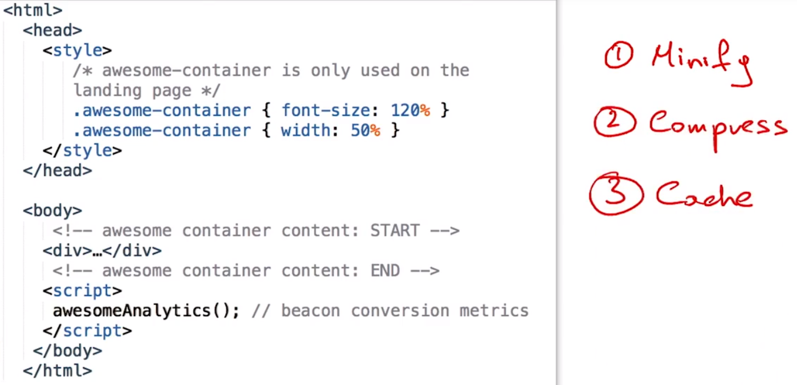

首先要注意的是，我们具有 CSS 注释（Comments）、HTML 注释和 JavaScript 注释。这些注释对开发者来说非常有用，但是对于浏览器而言，它会直接忽视这些注释，所以根本没有必要将这些注释展示给浏览器。我们可以缩写文件并降低文件大小，要详细了解如何缩写文件，请参阅讲师注释中的内容。完成后，还应该压缩文件并确保浏览器缓存了这些文件，同样的，请参考讲师注释。

---

- 详细了解[资源最小化](https://developers.google.com/web/fundamentals/performance/optimizing-content-efficiency/optimize-encoding-and-transfer#minification-preprocessing--context-specific-optimizations)
- 详细了解[通过 GZip 进行的文本压缩](https://developers.google.com/web/fundamentals/performance/optimizing-content-efficiency/optimize-encoding-and-transfer#text-compression-with-gzip)
- 详细了解 [HTTP 缓存](https://developers.google.com/web/fundamentals/performance/optimizing-content-efficiency/http-caching)

---

## 2. 练习：网页何时会渲染

要优化 CSSOM 构建过程，我们需要删除不必要的样式，**缩小和压缩文件并缓存**。

当我们运行 PegeSpeed Insights 的时候，它还推荐我们查看下**阻止呈现的 CSS**。我们来看一下这是什么。

假设有个简单的网页，包含一个 CSS 文件，浏览器下载了 HTML，然后发现并获取了 CSS，浏览器最早什么时候就会绘制网页？

- A：浏览器构建 DOM 后；
- B：浏览器下载了 CSS 并构建了 CSS 对象模型之后；

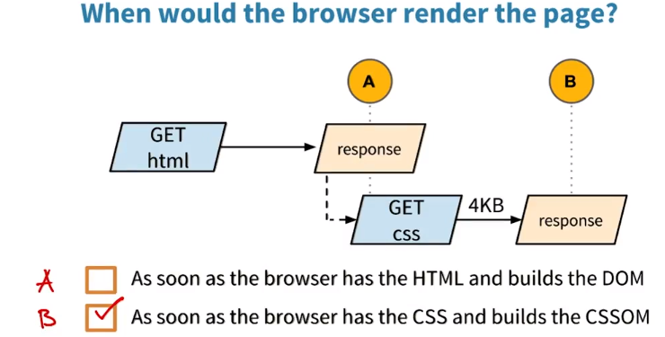

答案是 B，为了绘制网页，我们需要构建渲染树，构建渲染树，我们同时需要 DOM 和 CSSOM 树。因此，浏览器需要等到获取了 CSS 后再绘制网页。

我们不能绘制没有样式的网页，也就是**阻止呈现的 CSS。**

---

在 Web 基础手册中详细了解[避免阻止渲染的 CSS](https://developers.google.com/web/fundamentals/performance/critical-rendering-path/render-blocking-css.html)。

---

## 3. 通过媒体查询取消阻止 CSS

CSS 使我们能够按照特定条件范围应用样式。

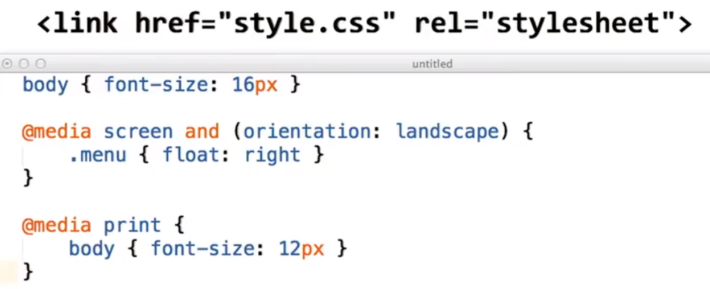

例如，对于上面文件，body 规则在所有条件下都适用。但是当设备处于横向（landscape）模式时，我们会应用特殊的规则使菜单悬浮在右侧。类似地，如果有用户想要打印网页，我们就会调整文本大小，适用更小的字号。

媒体查询对于自适应设计很重要，但是这会如何帮助我们优化关键呈现路径呢？

首先请参阅讲师注释中的链接了解下媒体查询，网络基础幻灯片详细解释了媒体查询的原理。

假设我要呈现使用这个 CSS 文件的网页，我们注意到**浏览器会阻止呈现直到解析了所有样式**，但直观地来说，你认为他应该对 print 规则阻止呈现吗？

如果我们不打印网页的话则没有必要阻止呈现，这就是我们为什么需要将 CSS 拆分成多个文件。我们来试试：

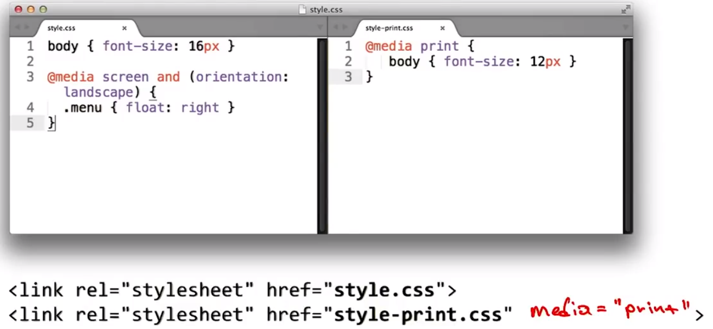

第一步是将 print 样式移到单独的文件里，我们称其为 style-print.css。接着向 HTML 标记中添加一个链接，接下来是重点内容了，默认情况下，浏览器会认为每个具体样式表都会阻止呈现，但是我们也可以通过在媒体查询中添加媒体属性告诉浏览器何时应该应用样式表。这里，因为 style-print.css 仅用于打印，所以我们添加 `media="print"`。

所以当浏览器看到这个样式表就知道仅需要应用到打印操作中，因此当我们在手机上加载时则不需要阻止呈现。

**浏览器依然会下载两个样式表**，但是不会对 style-print.css 阻止呈现。这里就意味着**浏览器会对 style.css 下载更少的数据**，从而加快了下载速度。

上面这个示例有点简单。假设有一组更加复杂的样式，包含多个断点，这一技巧还有用吗？

完全有用，你**可以在链接属性上指定任何媒体查询，浏览器将执行正确的操作**。查看讲师注释，了解如何使用媒体查询。

PageSpeed Insights **建议减少关键 CSS 元素数量**，现在看起来更加合理了。

---

查看 Web 基础手册中对[响应式 Web 设计的简介](https://developers.google.com/web/fundamentals/layouts/rwd-fundamentals/)，以及有关[呈现阻止 CSS](https://developers.google.com/web/fundamentals/performance/critical-rendering-path/render-blocking-css.html) 的讨论，以了解更多信息！

---

## 4. 练习：哪些样式表会阻止渲染？

如果我们在手机上纵向地呈现网页，以下哪个样式表会阻止呈现？

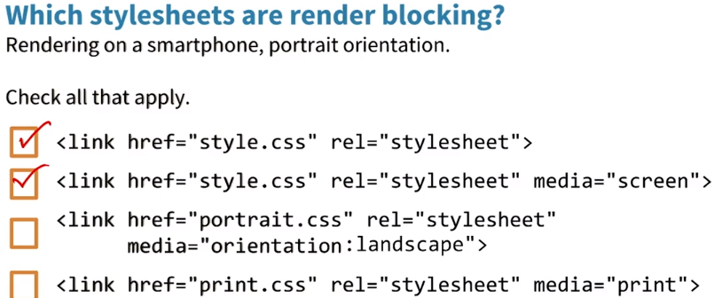

默认情况下：

- 浏览器会认为 CSS 在阻止呈现，因此第一个链接标记将阻止呈现。

- screen 查询将为 true，因为我们要在屏幕上呈现内容，所以它也会阻止呈现。
- 第三项声明取决于设备的屏幕方向。这里，因为设备方向是纵向，所以它不会阻止呈现资源。
- 最后这项声明仅在页面被打印时才会应用，因此当页面首次在浏览器中加载时，它不会阻止呈现。

---

## 5. JavaScript 和关键渲染路径

缩小文件、压缩文件然后缓存，这些都是不错的策略，但是对于 JavaScript，你可能还看到 PageSpeed Insights 指出**解析器屏蔽了脚本**，我们来看看这是什么意思？如何优化？

这里扩展了 HelloWorld 页面，在底部添加了简单的脚本，我们逐步讲解下：

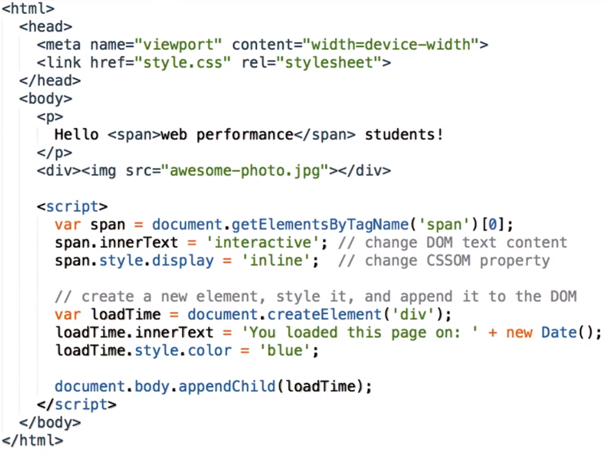

- 首先，我们进入 DOM 并寻找第一个 span 元素，可以看出，其中包含“Web performance”文本；
- 接着我们对该 DOM 元素做出修改，更改其 innerText，同时更改其 CSS 属性；表明 JavaScript 可以同时操作 DOM 和 CSS 对象模型，它是一个非常强大的工具。
- 接着我们创建了新的 div 元素，设置了文本内容、CSS 颜色属性并附加到网页上。

我们在手机上加载下该网页，现在文本内容变成了“Hello Interactive students!”而不是“Hello web performance students!”并且下方有个新的元素。

这里可以采取什么措施来优化性能吗？

有，优化 JavaScript 可以花费整个一门课程来，但在这个示例中，并不是代码，而是包含在网页上的方式。我们来思考下浏览器是如何构建该网页的。

---

查看我们在本视频中分析的[示例页面](http://udacity-crp.herokuapp.com/simple-inline.html)。

---

## 6. 文本会如何渲染？

假设浏览器要处理下面的文档片段，如果要在浏览器上呈现这段内容，屏幕上会出现什么文本？如果不熟悉 document.write 的的话，请参阅讲师注释中提供的文档链接。

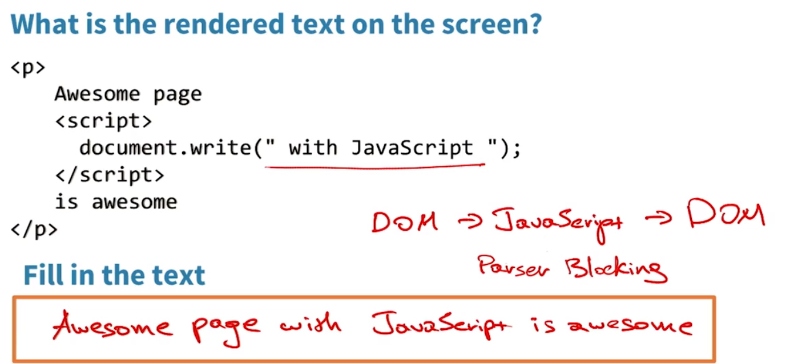

1. 首先，**文档解析器会创建段落节点并添加本文片段**。
2. 然后遇到了 script 标记，**此时它会暂停 DOM 构建过程并等待 JavaScript 引擎执行脚本**，脚本附加了“with JavaScript”并退出。
3. 此时恢复 DOM 构建过程并附加“is awesome”文本片段

因此屏幕上显示的是（红字）

---

请参阅 Mozilla 开发者社区上的 [document.write](https://developer.mozilla.org/zh-CN/docs/Web/API/document.write)。

如果你不确定，请尝试通过以上代码创建一个简单的页面，然后在你的浏览器中打开！有关文档，请参阅 Mozilla 开发者社区上的 [document.write](https://developer.mozilla.org/zh-CN/docs/Web/API/document.write)。

---

## 7. 外部 JavaScript 依赖

是很强大，但是这会如何影响到性能呢？

请注意我们经历的步骤，**当我们遇到 script 标记时，我们必须暂停 DOM 构建过程**，让 JavaScript 先运行，然后才能继续 。JavaScript 会阻止解析，因为当我们遇到 script 标记时，它会阻止 DOM 进行构建。

但是影响应该不大，JavaScript 的运行速度很快。

是的，但是我稍加修改下。假设我们不再像这里这样在底部使用内联脚本，而是将脚本内容放入外部文件里，就想这里，你觉得现在会发生什么情况？

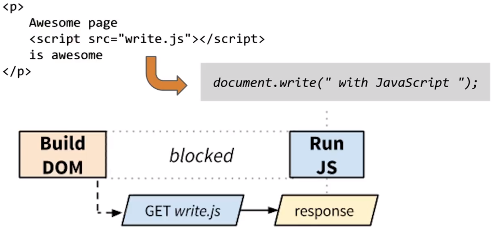

和之前一样，解析器找到 script 标记获取文件并执行，但是获取文件可能要花费一些时间。当浏览器在获取该文件时遭到阻止无法继续构建 DOM，进而降低了关键呈现路径的速度。

script 标记阻止解析器继续操作，我们一直等待获取该文件，效果不太好。

如果外部 JavaScript 始终会阻止解析，似乎我们应该内联所有的 JavaScript。

不完全对，内联 JavaScript 会减少请求次数，但是也有一些缺点，如果你在多个网页上使用相同的代码，那么这些网页就会出现多余的代码。所以这需要**权衡**。

> 还有是，如果这些相同的代码中有错误，你还得去把每个 HTML 文件中内联的脚本进行更正，就算有一些自动化的工具，也是很浪费时间的。当然这并不是关键，关键在于重复的多余的部分代码问题。

对于特定于一个网页的代码来说似乎是个不错的策略。

> 确实是这样的，但这样的情况我想是很少的。也可以换一个角度，如果一段脚本只会在一个网页中去使用那么就可以使用这个样的方式。

接下来我们来看看相关的利弊与陷阱。

---

查看 Web 基础手册中的[通过 JavaScript 添加互动性](https://developers.google.com/web/fundamentals/performance/critical-rendering-path/adding-interactivity-with-javascript)，详细了解阻止解析程序的 JavaScript 及其对 CSSOM 的依赖性。

---

## 8. 有关 JavaScript 依赖的详细信息

还是之前的文档片段，只是在顶部添加了 CSS 样式表，负责将所有段落文本呈现为黑色。现在思考下，当我们尝试执行内嵌的 JavaScript 时会发生什么情况，我们进入文档找到所有的段落标记并对第一个的 CSS 颜色样式设为红色。

样式表规定所有段落文本都应该呈现为黑色，如果在脚本已经执行并将颜色设为红色后才获得了 CSS 样式表会怎么样？浏览器会知道要使用哪个颜色吗？

会，下面这个简单图片描绘了实际上发生的情况：

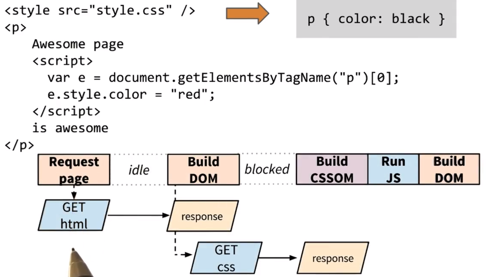

1. 浏览器请求 HTML，一旦获得响应就开始构建 DOM；
2. 然后发现 CSS 并发出请求；
3. 然后解析器继续操作并找到 script 标记，此时就需要阻止了，它不知道脚本将执行什么操作，因为脚本可能会尝试访问 CSS 属性，所以**它会阻止脚本执行，直到获得 CSS 并构建 CSS 对象模型**；
4. 然后我们才会运行 JavaScript 并完成 DOM 构建过程。

所以，**CSS 会阻止呈现并阻止执行 JavaScript。再次声明：优化 CSS 非常重要。**

---

## 9. 练习：你会尝试哪些优化措施？

知道我们可以如何优化这个网页的 CRP 吗？不要着急，里面涉及了多项步骤，实际上，你可能需要在论坛上与其他学员讨论下。

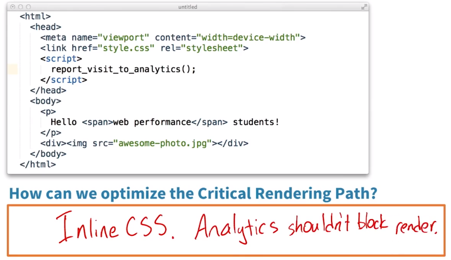

内联脚本会被 CSS 阻止，所以让 CSS 速度更快的策略都有帮助，实际上，可以内联 CSS。这样就可以减少一次请求步骤。

那么 JavaScript 本身呢？你认为它应该阻止呈现吗？

我觉得不应该，它向某个分析服务报告了访问数据，没必要阻止呈现。

> 因为访问数据并不是和页面呈现有关，所以让其不阻止浏览器的页面呈现。

---

可能有多种可行的优化方式... 如果你不确定，请查看 Web 基础手册中的[关键渲染路径](https://developers.google.com/web/fundamentals/performance/critical-rendering-path/)文档。

---

> 问题：浏览器是一定要将 HTML 文件解析完才能构建出 DOM 吗？目前来看，我觉得是这样的。

## 10. 异步 JavaScript

刚刚提到一个重要发现，某些脚本不修改 DOM 或 CSSOM，不应该阻止呈现，分析工具就是个很好的例子。

真希望能有某种方式告诉浏览器这一点。

实际上，是可以的。**一种策略是在网页加载后再加载脚本，当浏览器发出 onload 事件时再去执行脚本**。

该怎么实现呢？

**当网页加载完毕后，浏览器就会发出 onload 事件**。你可以等待该事件，然后执行脚本，请参阅讲师注释了解如何操作。

> 问题：网页加载完毕是指什么？是指构建完 DOM 吗？还是指完全渲染出来？
>
> 由于我认为完全渲染出来再去执行脚本会遇到一个问题，脚本如果更改了 DOM 和 CSSOM，那么又要重新布局、渲染，就浪费了很多时间。所以，我觉得是在完成对 DOM 和 CSSOM 的构建之后。

有 onload 技巧是个不错的备用方式，实际上还有更简单的策略，只需在 script 中添加一个属性，我来演示下。

我将分析工具代码放入了单独的文件里，并在 script 标记中添加了“async”属性。这个属性具有两个重要的特性：

- 首先，它告诉浏览器遇到 script 标记时不需要阻止 DOM 构建过程，因此，浏览器会忽略脚本请求，继续解析文档并构建 DOM。
- 其次，脚本不会因 CSS 对象模型而遭到阻止。所以，如果在 CSS 对象模型准备好前脚本就可用了，依然会立即被执行。

**所以 async 意味着脚本不会阻止关键呈现路径，浏览器下载并执行脚本，但是不会阻止解析也不会被 CSS 阻止。**

那内联脚本呢？能在内联脚本中添加 async 属性吗？

遗憾的是，不能，内联脚本始终会遭到 CSS 对象模型的阻止，只有一个例外情形。如果**你将 JavaScript 放在 CSS 上方，则会执行而不会遭到 CSS 的阻止**。

要详细了解这一模式和异步脚本，请参阅讲师注释中的链接。

---

- 在 Mozilla 开发者社区上详细了解[window.onload 事件](https://developer.mozilla.org/zh-CN/docs/Web/API/GlobalEventHandlers/onload)
- 此外，你还可以向脚本标记添加`defer`属性，告诉解析程序脚本应该等到文档加载后执行。[详细了解 `defer` 属性](https://hacks.mozilla.org/2009/06/defer/)
- 详细了解[解析程序阻止与异步 JavaScript](https://developers.google.com/web/fundamentals/performance/critical-rendering-path/adding-interactivity-with-javascript#parser-blocking-vs-asynchronous-javascript)

---

## 11. 练习：选取 JavaScript 方法

我为同一页面录制了三段不同的跟踪记录，唯一的区别是包含 JavaScript 的方式。在其中一个跟踪记录里，我使用了阻止脚本标记；在另一记录里，我内联了脚本；最后一个在 script 标记里添加了 async 属性。请看看时间顺序，判断各自对应的是哪个记录。

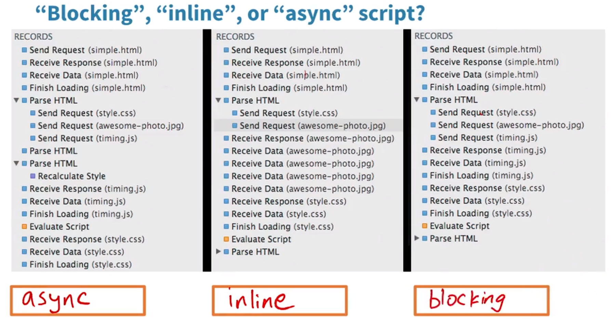

- 对于第一个记录。我们获得了 HTML，并对 style.css 和 timing.js 发出了请求，所以可以排除是内联脚本。接着获得了 timing.js 并执行了，然后获得了 CSS。从这可以判断出必须是异步脚本，否则的话，我们必须阻止并等待 CSS。

  - > 这里需要注意，Finish Loading 并不代表解析和执行了 js，而 Evaluate Script 才是解析 js。

- 第二个记录。我们获得了 HTML，向 style.css 发出来请求，但是没有向 JavaScript 发出任何请求。加载完 CSS 后我们运行了脚本，这肯定是内联脚本。

- 最后一个记录。我们对 CSS 和 JavaScript 发出了请求，先获得了 JavaScript，但是我们阻止并等待获得 CSS，所以肯定是阻止脚本标记。

---

这部分可能有些棘手，别着急！请查看下面关于阻止、内联和异步脚本的示例。

- **阻止（Blocking）**: ``
- **内联（Inline）**: ``
- **异步（Async）**: ``

---

## 12. 一般策略和 CRP 图表

我们介绍了很多基础知识，有十几个性能规则。可以通过一些方式来帮助你记忆这些规则。有很多不同的规则，但是基本上可以分为三大类。我们来看看：

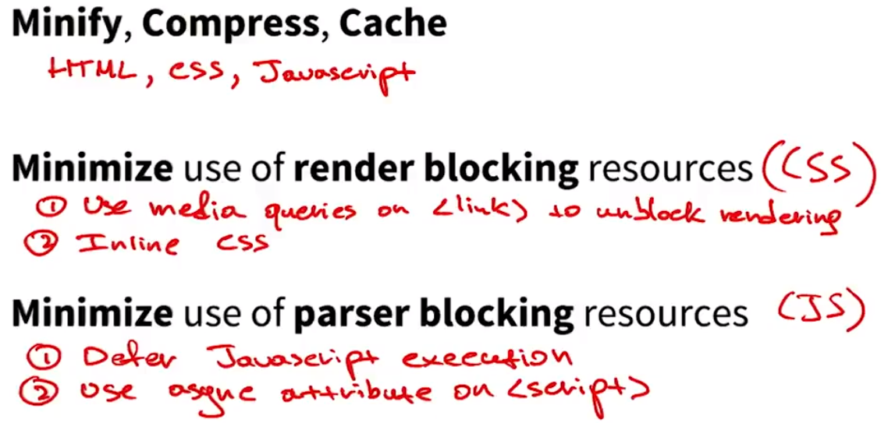

- 首先我们讨论了缩写、压缩和缓存。所有这三个技巧都适用于 HTML、CSS 和 JavaScript；
- 接着，我们知道某些资源，例如 CSS 会阻止呈现，要优化这一点我们讨论了两个策略：
  - 在 link 中使用媒体查询来取消阻止呈现
  - 内联 CSS
- 最后，我们发现 **JavaScript 会阻止文档解析器**，而这一点是可以避免的。为此，我们可以推迟 JavaScript 执行过程或在 script 标记中使用 async 属性。

你能从这三项中发现一些规律吗？

- 缩小、压缩和缓存涉及的都是减少通过网络发送的数据量。**这就是第一个类别：<u>减少数据量</u>。要下载的字节数越少，浏览器就能越快的获得数据并开始处理来呈现网页。**
- 第二点和第三点都是从关键呈现路径里移走文件，对于 CSS 可以使用媒体查询，对于 JavaScript 可以使用 async 标记。很多情况下都需要 CSS 和 JavaScript，但是没必要阻止网页呈现。例如打印样式表和分析工具 JavaScript 代码。**第二个类别就是<u>减少关键资源的数量</u>，并非所有资源都很关键，特别注意 CSS 和 JavaScript**。
- 最后一个类别是**缩短关键路径的长度。**

什么是关键路径的长度？接下来看个例子：

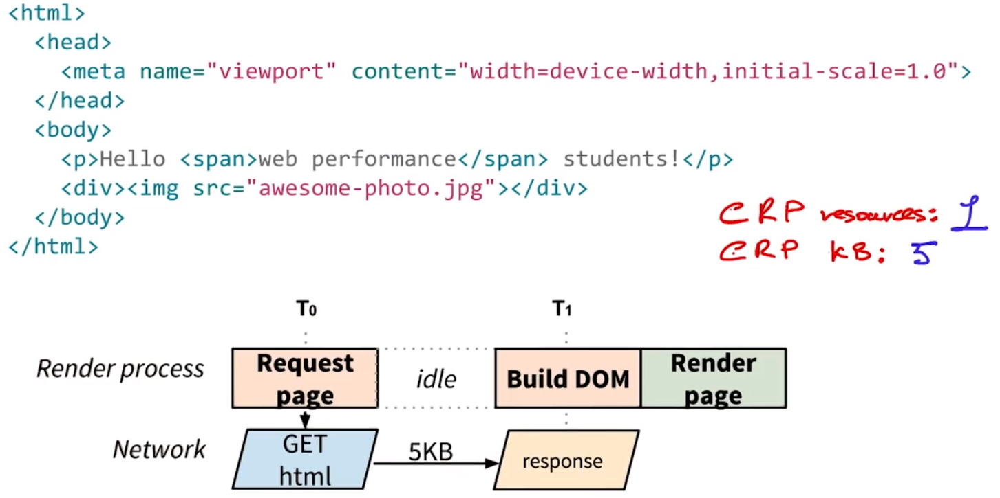

我们为这里的 Hello world 页面绘制出关键呈现路径：

- 在时间 0 时我们请求了 HTML
- 获得响应后，在时间 1 时我们解析了 HTML 并构建了 DOM。
- 然后向屏幕上呈现了网页

注意这里没有 CSS 或 JavaScript 所以一旦获得 DOM 我们就可以呈现页面了。这个页面上的确有个图片，但是它不会阻止关键呈现路径。

根据我们的三个类别分析一下页面，首先这里有多少个关键路径资源？

- 只有一个 HTML 文件，我们需要这个文件来呈现网页，所以只有一个。

那么有多少关键字节呢？

- HTML 大小为 5KB，所以是 5KB。

在最佳情况下，我们需要在浏览器和服务器之间来回多少次才能呈现该网页？

- 我们向服务器发出请求然后获得响应，只需要一次。如果 HTML 文件很小，那么我们只需一次就能获得所有数据。所以，最佳情况下关键呈现路径的长度也是 1。

**PageSpeed Insights 说我的网页应该最好小于 14KB**，是不是就是这个原因？

是的，如果网页很大也会呈现，但是**如果网页很大的话，就需要来回多次来获取数据**。这是非常基本的内容，但是可以明显的地影响到呈现网页的速度。

Ilya 在这一领域著有书籍，可以通过导师注释来查看。

---

- 详细了解[优化关键渲染路径](https://developers.google.com/web/fundamentals/performance/critical-rendering-path/optimizing-critical-rendering-path)
- 查看[关键渲染路径性能模式](https://developers.google.com/web/fundamentals/performance/critical-rendering-path/analyzing-crp#performance-patterns)

脚本标记也可以采用 `defer` 属性，方法与采用 `async` 属性相同。差别在于对于 `defer`，脚本需要等到文档解析后执行，而 `async` 允许脚本在文档解析时位于后台运行。[在此处了解脚本标记的详细信息](https://developer.mozilla.org/zh-CN/docs/Web/HTML/Element/script)。

请查看指导[如何交付可在一秒或一秒内呈现的页面](https://developers.google.com/speed/docs/insights/mobile)的 PageSpeed 移动分析文档。要详细了解有关 TCP 慢启动的信息，请查看 Ilya 的[著作 *高性能浏览器联网*](http://hpbn.co/)。

在本课程结束时，你将发现一道有关 TCP 慢启动的[高难度附加题](https://classroom.udacity.com/courses/ud884/lessons/1469569174/concepts/15244185740923)。如果你想了解如何在数学上计算出使用 TCP 慢启动下载文件所需的时间，不妨试一试。

---

## 13. 具有外部 CSS 的 CRP 图表

现在修改下文件，变得更加有趣些：

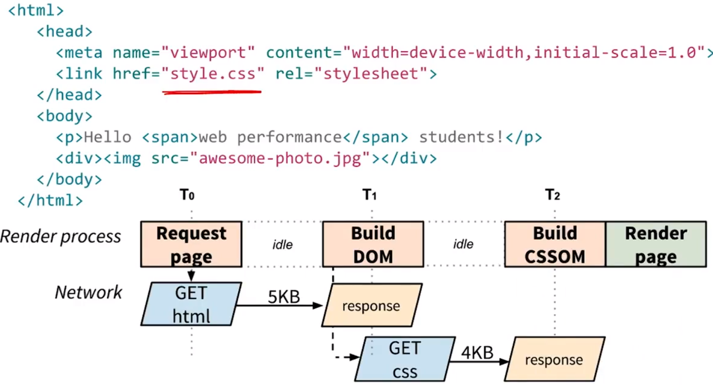

和之前一样的网页，但是现在使用的是外部 CSS 文件：

- 我们获得 HTML 响应并开始构建 DOM
- 然后发现 link 标记并请求 CSS，再此期间，我们继续解析 HTML 并构建 DOM，但是注意我们还不能呈现网页，因为依然受到阻止并等待 CSS。
- 获得 CSS 后，我们完成 CSS 对象模型的构建，就可以绘制网页了。

---

在 Web 基础手册中查看[关键渲染路径性能模式](https://developers.google.com/web/fundamentals/performance/critical-rendering-path/analyzing-crp#performance-patterns)。

---

## 14. 练习：计算 CRP 指标

（参照上面的 CRP 图标）（roundtrips —— 往返车次）

- HTML 和 CSS 都是关键资源，所以有 2 个关键资源；
- 我们需要同时获得这两个资源，5KB 的 HTML 和 4KB 的 CSS，总共 9KB；
- 关键路径长度，最佳情况下，应该有 2 个来回，一个是获取 HTML 并获得响应，另一个是获取 CSS 并获得响应。所以，关键路径长度是 2；

---

## 15. CRP 指标讨论

很有意思，我们有三个类别：关键资源的数量、关键字节数、路径数，表明没有绝对的黄金法则。

例如，如果我减少了关键资源的数量，我可能也就减少了字节数，类似地，如果我压缩、缓存并缩写文件，也会减少字节数。

我们再来看看几个示例，相同的网页但是现在具有 CSS 和 JavaScript：

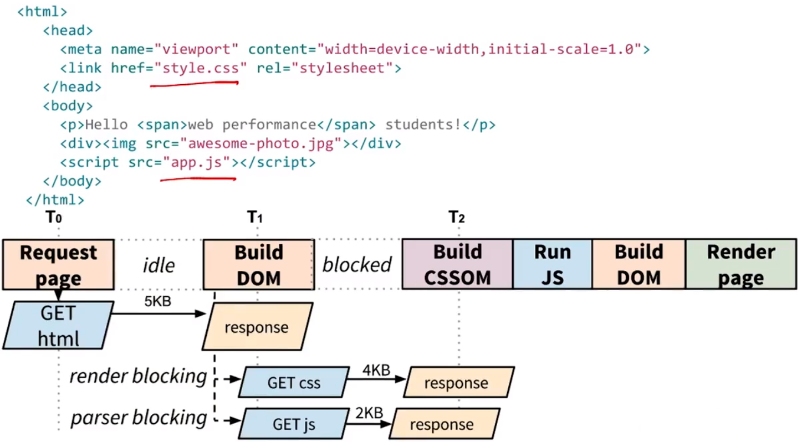

- 同样的，我们获得 HTML。发现 CSS 和 JavaScript 资源并发起这些请求。注意 JavaScript 比 CSS 要小，所以它可能更早就抵达了。但是当 CSS 正在创建时 JavaScript 就会被阻止，CSS 抵达后，浏览器就开始构建 CSS 对象模型并取消阻止 JavaScript 使其能够执行，执行完 JavaScript 后，DOM 解析器被取消阻止，意味着完成 DOM 的构建，最终我们获得了 DOM 和 CSS 对象模型，表明我们可以开始呈现网页了。

可以看出这么简单的网页也会存在很多依赖条件，降低了关键路径的速度。

---

- 详细了解[优化关键渲染路径](https://developers.google.com/web/fundamentals/performance/critical-rendering-path/optimizing-critical-rendering-path)
- 查看[关键渲染路径性能模式](https://developers.google.com/web/fundamentals/performance/critical-rendering-path/analyzing-crp#performance-patterns)

---

## 16. 练习：计算 CRP 指标

- 有 HTML、CSS 和 JavaScript，所以有 3 个关键资源。
- 5KB 的 HTML 加上 4KB 的 CSS 再加上 2KB 的 JavaScript，总计 11KB的关键字节数。
- 最低关键路径长度或来回次数，浏览器能同时下载 CSS 和 JavaScript 这两个文件，注意关键资源数和总字节数增加了，但是关键路径长度保持不变。

现在做道练习题：

假设每个来回花费 1 秒钟，因为网速很慢。你认为要在屏幕上呈现内容，需要多久？

- 两次来回，每次 1秒钟，所以大概 2 秒钟。

假设现在你使用的是最新的超快光纤网络，一次来回时间是 50ms，需要多久？

- 2 * 50ms = 100ms

这是个很好的练习，现在你可以很好地估算呈现网页需要多长的时间了，只需稍加分析就能知道。

> 我觉得不应该是这样计算呈现内容的时间。因为除了数据请求和数据下载来回所花费的时间以外，我们还需要计算解析 HTML、CSS、JavaScript 和布局、渲染的整个呈现时间。
>
> 但也许在最佳情况下，这些时间可以忽略不计吧。比如数据在来回的过程中，浏览器已经开始做一些准备工作等等。

---

**Ilya：**请注意，知道关键路径的长度使我们可以快速估计**最佳情况下**，首次呈现所需的时间！最好的是，我们可以通过快速检查 HTML 标记获得此估计值。

---

## 17. 练习：你会尝试哪些策略？

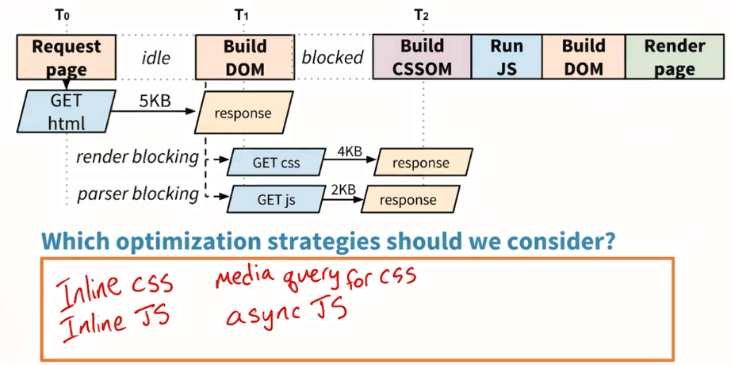

首先这里有个外部 CSS 文件，我们需要该文件来构建 CSSOM，如果内联该文件就会减少不少时间。JavaScript 也是同样，如果能内联它的话则可以跳过请求，实际上，如果二者都内联的话，那更好。因为我的关键路径长度就为 1，一旦获得了 HTML 文件，就获得了一切。

这些肯定是很不错的策略，但是在实施时要小心内联很多 JavaScript 和 CSS，尤其是当这些资源可以在多个网页之间共用时会占用大量资源。

如果我知道 CSS 和 JavaScript 文件里都有哪些内容的话，那么我还可以考虑向 CSS 中添加媒体标记或使脚本变成异步脚本。

你会在 CSS 和 JavaScript 文件中寻找什么内容？

对于 CSS，会确保这些样式是呈现网页所必须的。如果暂时没用到，可以在属性中**添加相应的媒体标记取消阻止呈现**。JavaScript 也是差不多的思路，如果脚本没有操纵或访问 DOM 或 CSSOM，那么我就可以**添加 async 属性，从而取消阻止 DOM 构建过程**。

---

如果你不确定，请查看 Web 基础手册中的[关键渲染路径](https://developers.google.com/web/fundamentals/performance/critical-rendering-path/)文档。

---

## 18. 你能否根据 HTML 计算 CRP 指标？

再来看个示例，和之前一样的网页，但是有个小小的优化，我们使用了异步脚本，看你能够直接通过查看 HTML 算出 CRP 指标。

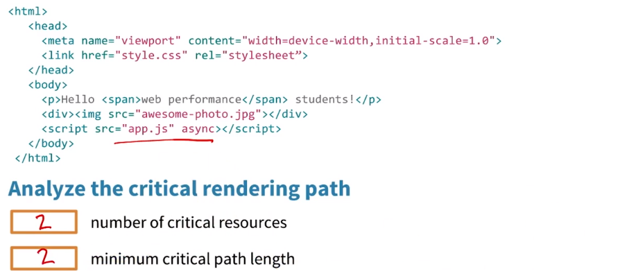

- HTML 是关键资源，里面的 CSS 样式表也会阻止呈现，图片不会阻止关键呈现路径，最后这个 JavaScript 文件是异步的也不会阻止呈现。所以总共有 2 个关键资源，即 HTML 和 CSS。
- HTML 文件是 1，还需要获取 CSS，因为这个 JavaScript 文件是异步的，不会阻止呈现，所以最佳情况下关键路径长度是 2；

---

## 19. 预加载扫描程序

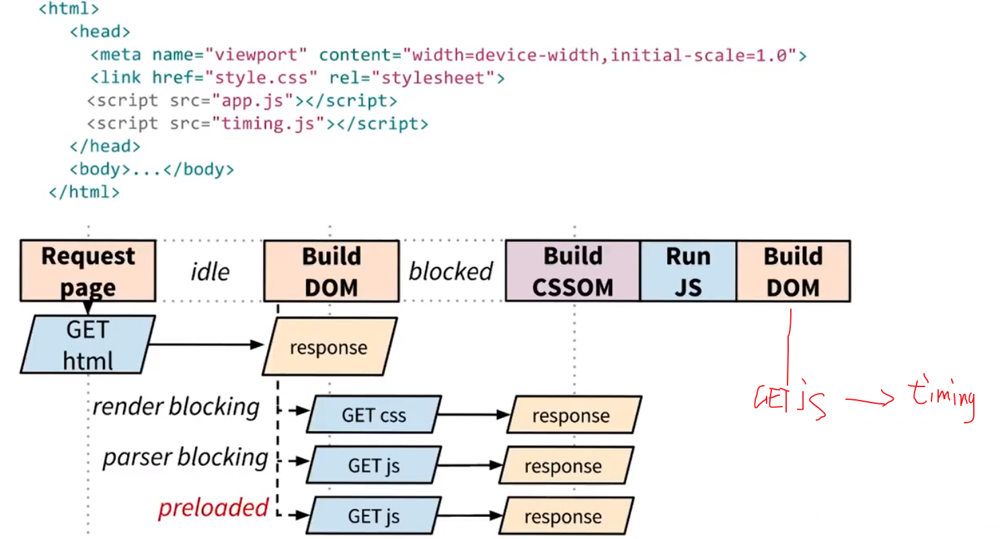

首先我们请求这个 HTML，然后开始构建 DOM 并遇到这个 CSS 文件，当然我们需要请求该文件，继续构建 DOM，然后遇到了 app.js，它会阻止解析器，我们暂停构建 DOM，DOM 请求并等待该文件，最终获得 CSS 并构建 CSSOM，然后就可以运行 app.js 并继续构建 DOM，然后遇到第二个脚本文件 timing.js，下载时会阻止解析。

> 上面这部分是本来的构想，在我自己标注的红色 GET 处请求 timing.js，但其实会因为预加载扫描器而提前请求。

但是这个可能会花费很长一段时间，首先遇到 app.js 的阻止并等待该文件，然后遭到 timing.js 的阻止并等待该文件，要优化这个网页，浏览器有个特殊流程，叫做**<u>预加载扫描器（preload scanner）</u>**，**它会提前偷瞄文档并尝试发现关键 CSS 和 JavaScript 文件**，例如 timing.js，所以即使解析器遭到阻止，我们也能发现 timing.js 并开始下载关键资源，我们不用再等待构建 CSS 对象模型并运行 app.js 然后请求 timing.js，在解析器被阻止时，预加载扫描器会发现 timing.js 并请求该文件。

参考讲师注释，可以了解更多关于预加载扫描器的内容，解释了为何存在预加载扫描器以及它的运行原理。

---

要详细了解预加载扫描程序，请查看“[浏览器预加载程序如何加快页面加载速度](http://andydavies.me/blog/2013/10/22/how-the-browser-pre-loader-makes-pages-load-faster/)”

---

## 20. 练习：绘制 CRP 图表 - 简单

进行关键呈现路径分析的好处之一是**可以很好地估算呈现网页所需的时间**。

绘制出关键呈现路径图表后，我们甚至都不需要查看网页的数据图表了，当然还是需要通过数据图标来分析其他瓶颈问题。我的意思是可以在关键呈现路径中看到所有的依赖项，大概估算下呈现网页需要多长时间。

再练习下只查看 HTML 就能知道关键呈现路径是什么，这实际上是个很好的练习，我将提供几个文件，你可以在讲师注释里找到这些文件。请你分析下这些文件，绘制图表并算出关键呈现路径指标（CRP Path），但不用考虑美观性，可以使用任何工具，用笔和纸也可以，同时还要算出三个关键呈现路径指标：路径长度、资源数、字节。

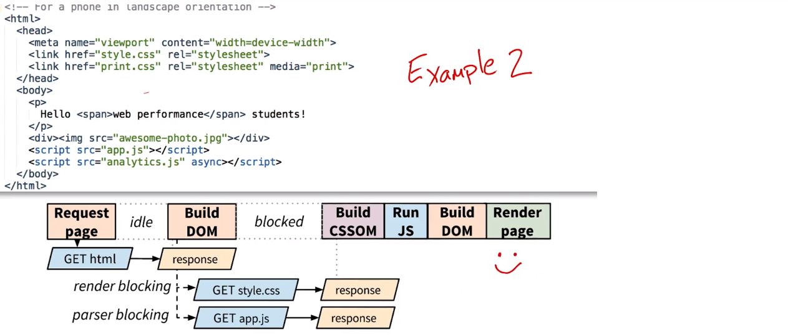

- 我们请求了网页并开始接收 HTML，立即开始解析并构建 HTML。
- 遇到了两个样式表 style.css 和 print.css 并出现打印媒体查询，我们没有打印，所以 print.css 不是关键呈现路径的一部分，我们只需发出 style.css 的请求，然后继续解析 DOM，在 body 结束时遇到了两个 script 标记，一个针对的是 app.js，另一个针对的是 analytics.js，analytics.js 是异步脚本，所以不是关键呈现路径中的一部分，我们发出 app.js 请求。
- 暂停构建 DOM 并等待获取 CSS 和构建 CSSOM，有了 CSSOM 后，JavaScript 引擎被取消阻止，所以可以运行 app.js 了，完成 DOM 的构建然后呈现页面。

---

绘制 CRP 图表并为以下文件提供 CRP 指标：

- [Page #1](https://github.com/igrigorik/udacity-webperf/blob/master/assets/ex1-diagram.html)
- [Page #2](https://github.com/igrigorik/udacity-webperf/blob/master/assets/ex2-diagram.html) Cameron 将在解决方案视频中介绍第 2 页的图表。

如果你无法在论坛上发布图表，请拉上一位朋友，并向他介绍你的 CRP 图表！

---

## 21. 练习：绘制 CRP 图表 - 困难

再绘制一个 CRP 图表，但是这次请为实际的网站创建图表，如果有自己的网站可以分析该网站。没有的话，可以分析任何网站。注意，很多网站，尤其是大型网站具有很长且复杂的关键呈现路径，建议你分析个简单或静态网站，我在讲师注释中提供了个几个链接告你尝试。

对于这个图表项目，我准备查看下移动版 reddit.com：

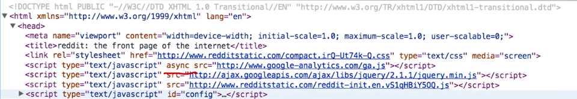

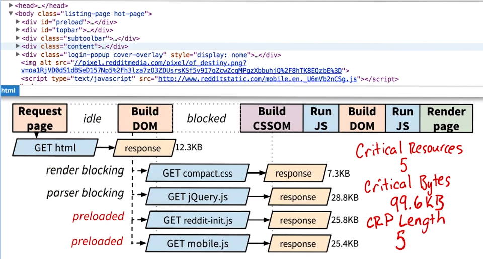

- 开始打开 HTML，一切都从请求 HTML 开始，收到后立即开始构建并分析 DOM；
- 在文件 head 中找到了这个 CSS 文件，对该文件发出请求；
- 继续解析 DOM，在下面的这行里，我们找到了这个 Google Analytics 脚本，但是标记为 async，所以不是关键呈现路径的一部分，这个练习可以忽略了，这里我们请求了 jQuery，并发出请求并阻止了解析器，**这时预加载扫描器开始工作**，在 HTML 中寻找其他可以开始下载的资源，在 head 中发现了 reddit-init.js 并在 body 中发现了另一个脚本 mobile.js 立即开始下载这些文件。
- 获得 CSS 后，我们开始构建 CSSOM 并取消阻止 jQuery.js 和 reddit-init.js 这些文件在这里开始运行，继续构建 DOM，然后发现最后一个 JavaScript 文件 mobile.js，我们可以在 body 中的下方脚本里找到该文件，最终我们就可以呈现网页了。

- 有 5 个关键资源。HTML、CSS 和三个 JavaScript
- 99.6KB 的关键字节数。
- 最小 CRP 长度为 2，因为关键 CSS 和 JS 资源可以并行下载，即 HTML 具有 1 RTT，其余资源具有 1 RTT，最小 CRP 长度为 2。

---

Cameron 将在回答视频中分析[reddit 的移动版本](http://reddit.com/.compact)。

本课程会教你如何快速呈现第一个框架，但后面的所有框架呢？请与 Cameron 一起执行[浏览器呈现优化](https://cn.udacity.com/course/browser-rendering-optimization--ud860)，并与 [Paul Lewis](https://twitter.com/aerotwist) 一起学习如何构建运行速度达 60 帧/秒的应用！

如果你无法在论坛上发布图表，请拉上一位朋友，并向他介绍你的 CRP 图表！

**Cameron**: 啊，我的介绍中有一个错误。最小 CRP 长度为 2，因为关键 CSS 和 JS 资源可以并行下载，即 HTML 具有 1 RTT，其余资源具有 1 RTT，最小 CRP 长度为 2。

此外，reddit 很有可能在本课程发布后发生更改。请查看其内容，但你看到的某些内容可能会与我在本视频中看到的不同。

---

## 22. 最终项目

**所以可以总结为优化关键呈现路径有三个主要目标：减小关键字节数、减少关键资源数以及缩短关键路径长度。**

网络性能是个重要领域，有很多需要学习的地方，在使用 PageSpeed Insights 时，确保打开链接了解下其他内容，这些最终都会帮助到你。

现在我们已经分析了整个关键呈现路径，你应该掌握了所有的工具，让网站尽可能快速地呈现，理想情况下是 1s 内。

Cameron  的作品集网站需要很多工作，如果在 PageSpeed Insights 中检测的话，我们会发现得分非常低。

最后一项挑战是运用在这门课里所学的知识帮助他优化他的网站，你的目标是将 PageSpeed Insights 得分提高到 90 以上。

为此你需要执行几项操作：

- 首先 fork 项目 Github 资源库
- 然后运用技巧分析，例如，绘制关键呈现路径图表和分析关键呈现路径并运用优化策略，然后发布到 GitHub 上。如果不熟悉 GitHub 的话，可以在讲师注释中找到相关链接，了解如何 fork 资源库并在 GitHub 上发布你的网站。
- 完成优化后，在 PageSpeed Insights 中运行下改善后的作品集，你将发现各种建议现在变得合理起来，例如优化 CSS 交付并删除阻止呈现的 JavaScript
- 在做这个项目时，不妨创建自己的作品集，可以用它来展示你感到自豪的项目。

---

你可以在[此处](https://github.com/udacity/frontend-nanodegree-mobile-portfolio)找到 GitHub 版本库，并在[此处](http://cameronwp.github.com/udportfolio)找到 Cameron 的版本。

### 使用 GitHub

如果你对 Git 和 GitHub 不熟悉，[GitHub 帮助页面](https://help.github.com/)是一个不错的起点。请查看以下指南：[设置 Git](https://help.github.com/articles/set-up-git)、[fork 版本库](https://help.github.com/articles/fork-a-repo)、[通过 GitHub Pages 托管](https://pages.github.com/)和[参考部分](https://help.github.com/articles/what-are-other-good-resources-for-learning-git-and-github)，以了解更多信息。

本课程会教你如何快速呈现第一个框架，但后面的所有框架呢？请与 Cameron 一起执行[浏览器呈现优化](https://cn.udacity.com/course/browser-rendering-optimization--ud860)，并与 [Paul Lewis](https://twitter.com/aerotwist) 一起学习如何构建运行速度达 60 帧/秒的应用！

---

## 23. 练习：最终项目提交

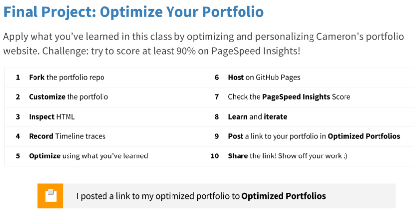

---

## 24.练习：TCP 额外问题

这道练习题绝对是加分项。假设我们想通过新的快速网络连接传输 64KB 的文件，来回时间是 100ms，包大小是 1460 字节（bytes），初始拥塞窗口是 10 个包，下载这个文件需要多长时间？

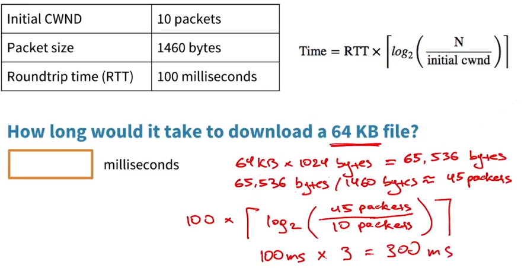

我们来看看解答：

1. 首先，我们将 64KB 乘以 1024 字节，算出字节数，结果是 65536 字节。
2. 接着通过除以数据包的大小，将此数字转换为数据包数，大约为 45 个数据包。
3. 然后将这一数字带入这个公式里，我们知道来回时间是 100ms，我们需要传输 45 个数据包，初始拥塞窗口是 10 个数据包。右边的整个括号内计算出为 3，所以等于 100 x 3，约为 300ms

但是有个问题，这个括号看起来很奇怪。

这实际上是个顶函数，表示在算出这个对数函数的结果后需要向上舍入最接近的整数。

所以，最终的答案是 300ms，时间很长了，但这只针对最新速度的网络连接。

---

要了解此问题的更多背景信息，请查看 Ilya 的著作 [*高性能浏览器联网*](http://hpbn.co/) 中[有关 TCP 慢启动的部分](http://chimera.labs.oreilly.com/books/1230000000545/ch02.html#SLOW_START)。

本课程会教你如何快速呈现第一个框架，但后面的所有框架呢？请与 Cameron 一起执行[浏览器呈现优化](https://cn.udacity.com/course/browser-rendering-optimization--ud860)，并与 [Paul Lewis](https://twitter.com/aerotwist) 一起学习如何构建运行速度达 60 帧/秒的应用！

---

