# 2.5 网站优化 - APP 生命周期

---

[TOC]

---

## 1. 第 2 课简介

在第一节课里，你学习了浏览器**如何通过 HTML CSS 和 JavaScript 来渲染像素，理解这一流程是优化应用性能的关键**。

在这一节课里，你将**从更高层面思考应用的整个生命周期，目标是帮助你明智地判断应用<u>何时可以并且应该完成繁复的工作</u>**，从而为用户打造极为顺畅的体验。在开始之前，先问一个问题，你的目标应该是始终让应用运行速度达到 60fps 吗？

答案是不应该，实际上是不完全这样，**一定要选好战场，侧重于对用户来说很重要的方面。**任何网络应用的生命周期实际上分为四个领域，每个领域性能影响都有很大的差别。

---

## 2. RAIL

我将网络应用的生命周期四大领域称为 RAIL，RAIL 表示的是响应（Response）、动画（Animations）、闲置（Idle）和加载（load）。

按时间顺序应该是 LIAR，加载、闲置、动画、响应。

但是缩写 LIAR 没有 RAIL 知名度高，只是帮助记忆。虽然一开始是加载，但是多数应用会多次加载，例如 XHR 网络套接字和 HTML 导入。总之，只是字母顺序差别而已，非常有助于你理解并掌握应用的工作负荷。

---

## 3. 加载和闲置

首先要研究的是加载，无论是什么内容，用户都希望快速加载，一定要针对关键呈现路径做出优化，Illy 和 Cam 的课程详细介绍了关键呈现路径。总之，**你的初始加载操作应该在 1s 内完成**。

我切换到了 chrome，我将加载 Google Play 的音乐，加载应用后通常处于闲置状态，等着用户采取操作，**这时候我们就抓住机会处理那些为了满足 1s 加载目标而推迟的工作**。**通常，这些闲置时段的时长约为 50ms，虽然可能一次出现多个闲置时段，这些闲置时段是完成繁杂任务的极佳机会，以便用户做出互动时一切都很顺畅快速。**

思考下处理应用闲置时间的最佳方式。

---

## 4.练习：闲置时间

在这道测试题里，你将研究这个虚拟的新闻应用，在此应用中，用户可以阅读各种文章。例如这篇文章——“加利福利亚正值干旱”；他们将看到图片例如这篇文章——“伦敦一直下雨”；并且可以观看视频，例如这篇文章其中介绍了金毛正在写 JavaScript 代码。

**应用内容分为两半，使上半部分能够快速呈现内容**，此外，你从分析资料里了解到大多数用户会用几秒钟的时间查看网页，然后开始互动，知道这些后，那么在这一加载之后的闲置状态下，你应该处理哪种任务？你应该为这篇或这篇新闻报道加载文字吗？应该为这篇或这篇加载图片吗？应该加载这个金毛视频吗？应该加载应用的基本关键功能吗？或者应该加载评论区？

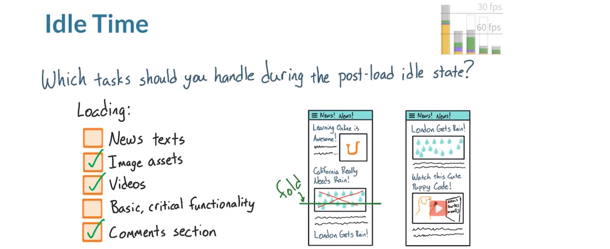

正确答案是除了新闻文字和基本关键功能之外的所有其他选项，**为了使应用能工作，你肯定需要提供基本关键功能，所以不应该在加载之后**。此外，用户访问此类网站，肯定是为了阅读新闻文字，所以在绘制第一批像素时文字就应该出现了。但是所有其他内容可以稍后出现，例如图片、视频和评论区。实际上，你可能之前在其他应用里就见过这一模式了，但是请注意，**在加载后的闲置状态下也依然可能出现用户操作**。稍后你将了解你只有 100ms 的时间来对这些操作做出响应，所以更需要让加载后任务的操作时间缩短在 50ms 内。

---

## 5. RAIL - 响应

很棒，你处理了加载任务并考虑了在闲置时间可以执行的操作，下一步呢？用户将与应用互动，你需要做出响应，这并不是指自适应对不同的屏幕尺寸做出响应，而是指没有延迟地对用户输入操作做出响应。那么响应程度需要达到什么级别呢？

研究表明存在 100ms 的上限，**在用户按下屏幕上的某项内容后，1/10 秒后用户不会发现任何延迟，如果你能在这一时间内对所有用户操作做出响应，那就可以了**。如果这些操作是选中复选框或点击按钮，那么是可行的，你只需显示一种更改，例如选中状态。但是另一种形式则更具挑战性，此时，**用户的操作需要实现动画效果。最具挑战性的性能问题通常都是需要达到 60fps，例如用户的手指互动操作或过渡和动画**。对于这些，上限是 16ms，即 1s 或者 1000ms 除以 60，实际上只有不到 16ms 的时间，因为浏览器也需要处理时间，所以只有 10 到 12ms 的时间，时间很短的。

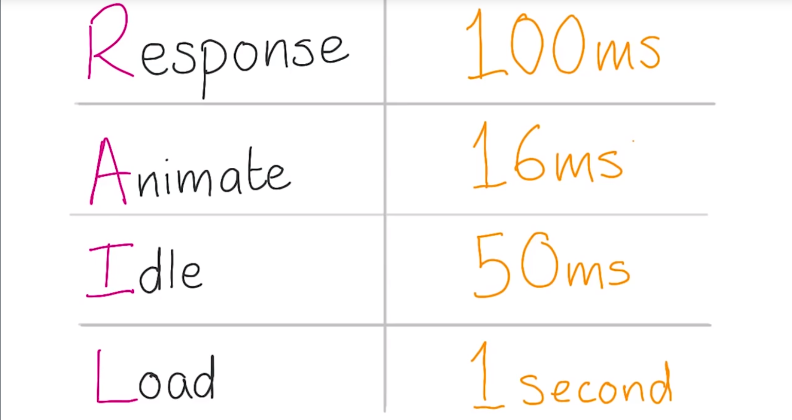

---

## 6. RAIL - 动画 1

**某些用户互动需要 60fps，过渡和动画（例如展开卡片或滑入菜单）也需要达到 60fps，但并非容易实现，很容易一不小心就触发了性能问题。除非对于哪个动画属性及何时显示动画非常谨慎**。处理动画有多种方式，完全取决于你的项目，我将介绍个我才用过的示例方法。感觉我好像在透露某种奇怪的技巧一样，但实际上是可行的。

对于 2014 年 Chrome 开发者峰会网站，我想要为这些卡片添加动画，我无法快速展开这些卡片，并达到 60fps，所以我需要采取不一样的方式，我尝试**向后运行**。

**我将我的策略称为 FLIP，初始（First）、结束（Last）、倒转（Invert）、播放（Play）。我利用的是浏览器在完成了初始的工作并运行动画后，我可以用较低的成本向后运行动画，相当于提前计算任务繁重的工作。**

我的代码找到卡片的起始点，然后找到卡片展开后的结束点。假设开始时卡片的大概位置于这里，图标是这样，标题在这里，我使用 getBoundingClientRect 衡量了所有元素展开前后的位置，这样我就知道所有元素在网页上需要移动多远。如果透明度更改了，我也会知道。

- 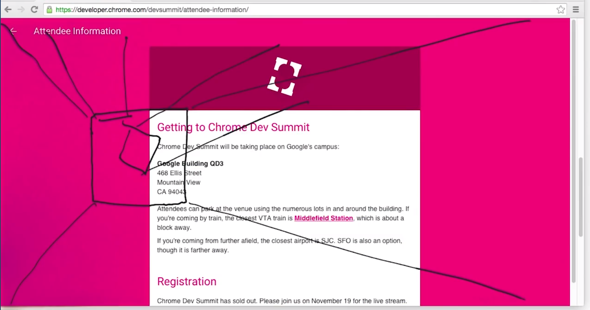

再回到这一策略（FLIP），初始表示卡片的起始位置，结束表示卡片的结束位置，现在我们需要讨论转换了。

我**利用初始和结束时的信息来应用转换和透明度更改并倒转动画，再执行额外的固定工作，就像卡片重来没有移动过一样**。现在我们就倒转了动画。所以可以直接播放了，效果就是这样的。

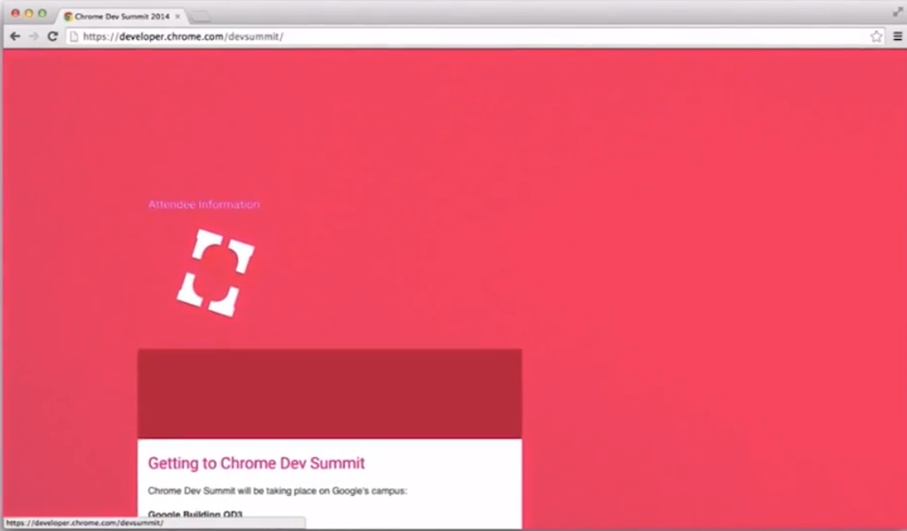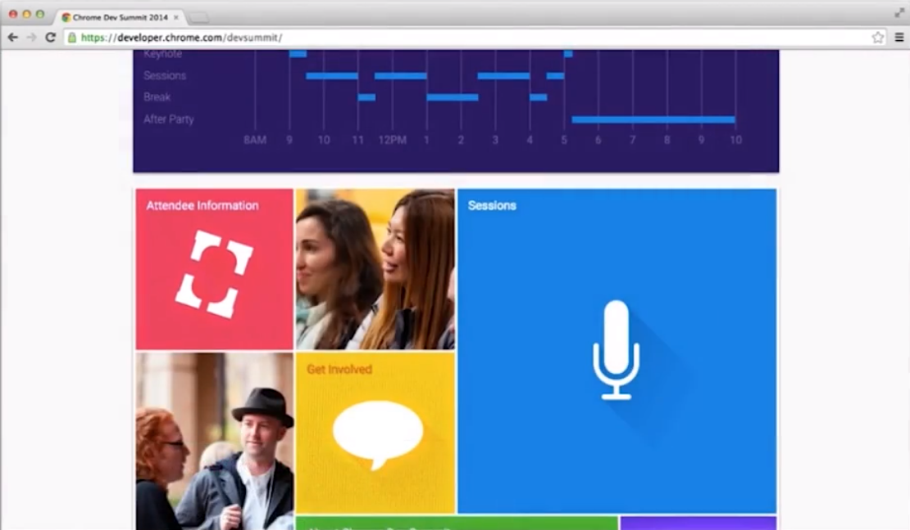

> 这一节可以去看看具体的动画效果。是利用了透明度（opacity）和转换（transition）属性。

---

想要检查 Paul 的 Chrome 开发峰会站点源代码？这里是[完整的版本库](https://github.com/udacity/devsummit)！[这里是 FLIP 代码所在的位置](https://github.com/udacity/devsummit/blob/master/src/static/scripts/components/card.js)。

---

## 7. RAIL - 动画 2

用代码表示是这样的：

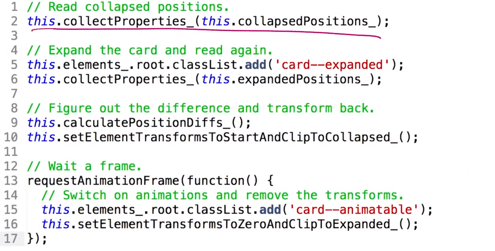

- 首先我们收集了合拢位置时的卡片属性。
- 展开卡片，再次收集属性。
- 接着，计算出差异，然后将卡片转换回去。
- 因为进行了这个样式更改，所以需要等待一帧，等着这些样式更改产生效果。否则，如何再次更改的话，浏览器将忽略这些更改就看不到动画了。
- 现在等待一帧了，可以开始动画并删除倒转、转换和透明度更改。

所有的属性收集操作听起来可能代价很高，你可能疑问怎么能够完成呢？听起来好多操作啊，实际上是这样的。

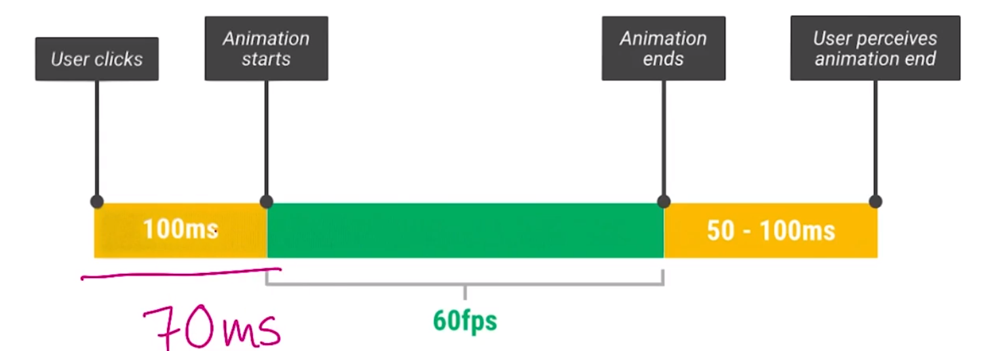

每次用户点击或点按卡片，你都需要作出所有这些计算。实际上，我利用的是 100ms 的响应间隔来提前完成所有这些时间代价高的计算。在 Nexus 5 上，完成所有计算大约需要 70ms，完全满足 100ms 的时间界限。

---

## 8. 练习：渲染动画

Paul 刚刚解释了如何运行 FLIP 策略来创建极为流畅的动画，他**提前完成了所有的复杂计算，所以<u>在实际的动画过程中尽量不会触发管道步骤</u>**，这样才能达到 60fps 的极为顺畅体验，当 Paul 应用透明度和转换更改来倒转动画时，他触发了管道的哪些步骤？

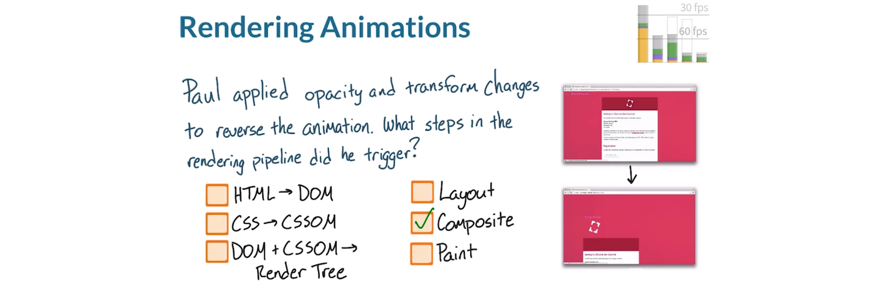

- HTML 需要转换为 DOM 吗？
- CSS 需要转换为 CSSOM 吗？
- DOM + CSSOM 需要结合形成渲染树吗？
- 浏览器需要重新运行布局、合成或者绘制过程吗？ 

正如你刚刚发现的，对透明度和转换的更改仅当元素位于自己的图层时才会触发合成步骤，但是注意 Paul 还需要使用 clip 来倒转动画，而这一操作需要绘制像素。

**一定要了解选择作为动画的属性产生的影响，因为某些属性的时间成本肯定比其他的要低。**

---

## 9. 练习：互动与动画

在 RAIL 的响应部分，你看到你有 100ms 的时间对用户操作做出响应，但是某些用户互动还需要动画效果，进而需要达到 60fps，认为哪种互动需要 60fps 的动画效果？

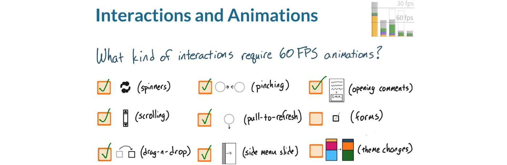

- spinner 下拉菜单应该始终达到 60fps 吗？
- 滚动
- 拖动和放置
- 双指捏合
- 下拉刷新
- 从左侧滑出的菜单
- 从下方打开的评论区
- 更改表格向的状态
- 更改应用主题

实际上，任何涉及动作或屏幕手指操作的互动都需要达到 60fps，唯一的两项例外情形是切换表格控件以及应用主题的更改。对于这两项，你依然有 100ms 的响应时间。但之后应用必须继续达到 60fps 才能实现很快的响应效果。

---

- 打开注释：[medium.com](http://medium.com/) 等站点会在打开注释时显示滑入/滑出动画。
- 主题更改：只需更改应用的颜色方案。

---

## 10. RAIL 阈值回顾

现在重申一下 RAIL 的每个阶段预留的时间窗口，更准确的说法是 LIAR。

LIAR 表示的是加载、闲置、动画和响应：

- 在加载阶段，你大概有 1s 即 1000ms 的时间来呈现网页，然后应用才会变得没有响应，用户的关注级别降低了，这时候就需要下载和渲染关键资源。
- 加载之后，应用进入闲置状态，这时候最适合执行不太重要的工作，确保在此之后出现的任何互动都能及时作出响应。应用的闲置时间应该变成 50ms，以便当用户开始互动时能够停止闲置状态。
- 在动画阶段，例如用户滚动屏幕或出现动画，你只有 16ms 的时间来渲染一帧。这时候 60fps 的帧率非常关键。
- 最后是响应阶段，人类大脑可以忍受 100ms 的停顿时间，再长时间的延迟就会让人觉得卡顿不流畅，意味着应用需要以某种方式在 100ms 内对用户输入操作做出响应。明智的使用这段时间非常关键， 这样才能设置动画，使其达到 60fps。

在后面的几个测试题中，你将需要运用所学的 RAIL 知识来处理一些实际案例。

---

## 11. RAIL 场景 1

对于这道测试题，假设你要开发一款应用，当视频资源正在缓冲时，这款应用会显示这个正在加载 GIF。你认为应该在动画阶段请求这个 GIF 吗？同时请注意，如果你在动画阶段请求这个 GIF，在动画阶段你还需要将其插入页面中。

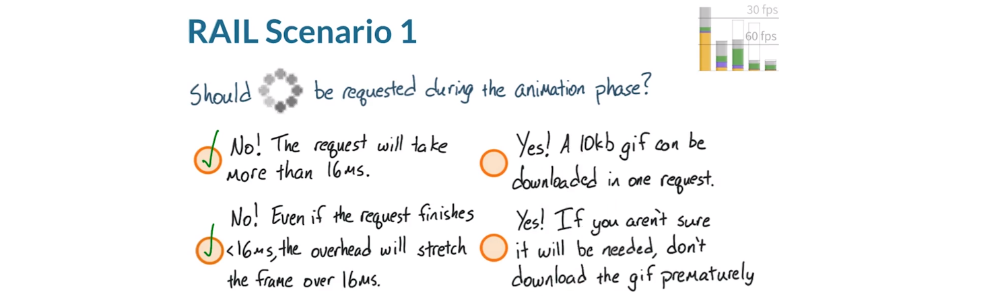

答案是这两个，实际上 GIF 是不可能在 16ms 之内显示的，并且请求增加了额外的管理工作。**动画阶段并不适合处理请求，在用户实际点击视频之前，就提前早早准备好该 GIF**。它很小，为何不添加到初始加载阶段呢？总之，不要在动画阶段请求。

---

Paul 说：到时，我们会要求以某种方式插入此图片，在这种情况下，隐含的讯息就是我们具有样式 -> 布局（如果是新元素）-> 绘制 -> 合成，所有这些都不合理。但它将依靠动画本身（比如，它可能会滚动，这会让它不那么糟糕，除非[你]设置了触摸处理程序。啊。）

---

## 12. 练习：RAIL 场景 2

现在你思考下闲置阶段，这位用户刚刚加载了会显示棒球得分的应用，现在处于 50ms 的闲置阶段，然后才会开始与应用互动。下面哪些任务能够在 50ms 内完成？

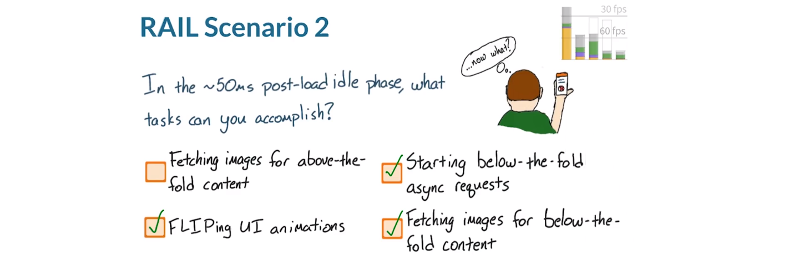

- 能够获取上半部分内容的图片吗？
- 能够开始倒转（flip）某些 UI 动画吗？
- 能够针对下半部分内容提出异步请求吗？
- 能够获取下半部分内容的图片吗？

正确答案是几乎可以执行任何操作，只要不是针对上半部分内容就行，在实际应用中，用户应该已经下载了上半部分内容。

---

Cameron 说：您是否问过自己“等等，再想想 FLIP 表示什么？”它表示起始、终止、翻转、播放。如果您想获得更深入的提示，请观看[本视频](https://classroom.udacity.com/courses/ud860/lessons/4127088573/concepts/41573785880923)。

Paul 说：FLIP 操作最多可能需要 100 毫秒。所以这有一点不确定。您需要尝试操作并测量时间！

---

## 13. 第 2 课回顾

现在你已经知道**你能够执行什么操作，以及何时可以执行**，了解这些知识非常有用。但要记住的是，**你能够绘制或进行布局，甚至能够运行 JavaScript，但并不表明就有无限的时间预算**。例如，**布局和样式时间都会取决于受到影响的元素数量，很快你会明白，缩短这些时间的一种方式是<u>减少受到影响的元素数量</u>。**

请参阅下方的讲师注释，你会看到一个表格，其中列出了不同任务的可用时间。该表格可以帮助你**为每个任务设置时间预算**，以便你和所有其他合作的开发者保持信息统一。

你已经能够整体地思考应用了，现在**应该具体详细地了解如何解决性能问题了**。在下一节课里，你将了解可以用来发现应用不稳定性的各种应用，**减少不稳定性的第一步是确定原因**，而这也是你在下一节课要学的。 

---

来源：[Paul 在 SmashingConf 2015 上的发言](https://speakerdeck.com/paullewis/making-a-silky-smooth-web)

---

