# 2.6 网站优化 - 卡顿杀伤性武器

---

[TOC]

---

## 1. 第三课简介

现在你已经明白性能很重要，并且知道渲染管道的各个部分，现在该学习如何使用手头的工具确定和消除不稳定性。你将主要使用 Chrome 开发者工具，尤其是时间线面板（现 performance）。这节课里，你将详细了解开发者工具的时间线视图确定**到底哪里出现了不稳定性**。

---

## 2. 开发者工具

打开开发者工具的方式是转到这个汉堡菜单图标，向下找到“更多工具”然后选择“开发者工具”，个人来说，我喜欢在 Mac 上按下 Cmd + Alt + J，虽然在其他平台上快捷键会有所不同，可以直接调出该工具，不需要一步步打开菜单。

现在我们打开开发者工具，需要转到时间线工具，在上方的这里。利用时间线可以为你的项目录制帧率，你可以录制一段时间线，它会告诉你每秒运行了多少帧。对于每个帧，都涉及了哪些工作，这一工作将于上节课学到的管道相关。

现在我将点击左上角的录制，然后到处浏览网站，现在停止录制，并获得了录制记录。一眼看去，用户界面有点复杂，我们一点一点的研究吧。顶部的帧柱表示每秒的帧数，一条线表示 60fps，另一条表示 30fps。如果我们要达到 60fps，所有这些帧柱都应该在这条线下方。这里非常接近这条线，但是整体来说表现还是很不错的。下方有大量的信息，说明了在每帧里我们是如何花费时间的，现在一切都是缩小状态，我们需要放大研究下。为此，只需点击拖动顶部的帧区域。现在可以看出稍微放大了，你也可以使用键盘上的 W A S D 键。

在“详细（Details）”部分可以看到我们之前讨论的管道部分，包括 JavaScript、样式计算、布局、布局管理、绘制和合成。如果你之前从未录制过时间线，现在你可以试试录制第一个时间线，可以转到任何网站，点击时间线中的录制，然后浏览下时间线，看看能找出哪些内容。

你可以录制时间线快速查看哪里出现了不稳定性，但现在需要你深入研究这些帧。弄明白为何帧的运行时间很长。

> 这个就不截图了，如果有什么问题，可以自己点击下面的链接进入网站录制一段来自己观察。

---

### [演示页面](http://www.html5rocks.com/static/demos/parallax/demo-1a/demo.html)

在演示中，框架视图和框架图表视图切换为开。[这里提供了更多有关开发者工具中的时间线的信息](https://developer.chrome.com/devtools/docs/timeline)。

---

## 3. 深入探索时间线

在这里打开了开发者工具的时间线并录制了加载此页面时发生的状况，我们来详细查看下这段录制内容。

首先要注意的是这些颜色标识：

- 蓝色表示 HTML 正在被解析，通常这一过程都很快。我个人还没有遇到过这一过程导致的性能问题，肯定没有在一开始的页面加载阶段遇到。
- 紫色记录，一个表示 Recalculate Style，另一个表示 Layout。
- 绿色记录，表示 Paint，还有 Composite。

实际上可以通过两种方式来查看时间线信息，至于哪种方式有用，完全取决于你自己。

首先，我将重新录制，滚动页面，这里有两个选项，我们可以开启或关闭“Frames”；另一个选项是否使用“Flame Chart”视图。现在出现了稍微不同的视图，看起来像个瀑布，可以上下滚动，还可以点按右侧的记录，帧柱越长表示任务耗时越长。第二种视图是“Flame Chart”视图，是默认视图。图表从上往下延伸，如果管道的某个部分触发了其他内容，则会在父记录下方显示子记录。比如 Parallax.js 中的这个函数调用是这个滚动事件的子项。

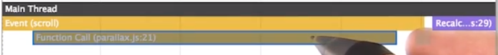

我们再来看看另一个示例，这次打开 Chrome 开发者峰会网站，录制时间线，展开这个卡片，我们来看看这一部分，放大这部分后，你会看到这里触发了动画帧，调用了其他 JavaScript，导致了 Recalculate Style，导致了 Layout，你可以明白哪些事件导致了哪些事件。

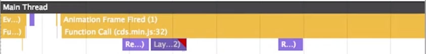

来同时看看这两个视图，先前的瀑布视图和新的“Flame Chart”视图，信息是一样的，只是显示方式不同而已。完全看你喜欢哪种方式。（不过现在似乎只有火焰图了）不过火焰图可以帮助我们明白管道不同部分的关系。

---

## 4. 练习：阅读时间线

Paul 刚刚演示了非常强大的功能。借助时间线，你可以观看一项工作如何导致了另一项工作。对于这道测试题，请加载一段时间线，只需点击时间线，转到“保存时间线数据（ Save Timeline Data...）”或者“加载时间线数据（Load Timeline Data...）。加载时间线是分享和对比时间线的简单方式。你可以下载内容部分找到这个时间线并加载刚刚下载的时间线，加载完毕后，看看能否找出哪个函数促使运行 initWebGLObjects()。最后，如果这个 JavaScript 是在动画阶段调用的，动画依然能达到 60fps 吗？

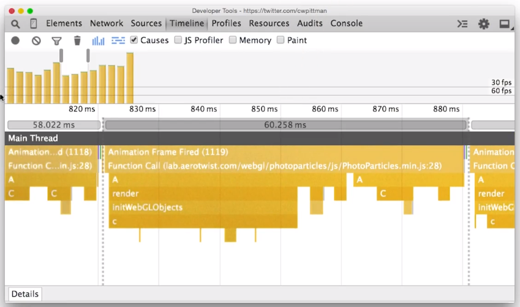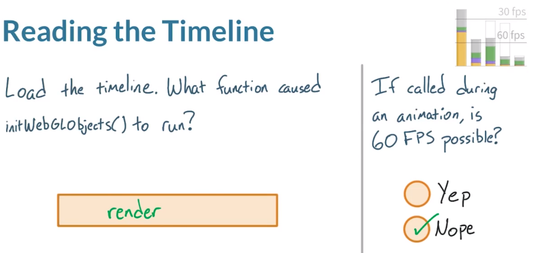

打开帧视图，很明显某项工作一直在重复。直接放大其中一个帧柱，放大后，很明显 render 正在调用 initWebGLObjects，在顶部可以看到代码运行速度为 60ms，完全超过了 16fps 的时间预算。这样的话，应用肯定没法达到 60fps。查看顶部的帧视图，可以看出这些帧几乎完全由 JavaScript 组成的，因此全是黄色帧柱，意味着应用要达到 60fps，则代码需要重新调整下。

> 需要注意的是，现在的帧视图是帧柱越高则其 FPS 越高。

---

#### 辅助材料

[ timeline-l3-reading-the-timeline](https://www.udacity.com/api/nodes/4156258563/supplemental_media/timeline-l3-reading-the-timeline/download)

[ timeline-l3-reading-timeline](https://www.udacity.com/api/nodes/4158208827/supplemental_media/timeline-l3-reading-timeline/download)

---

## 5. 识别卡顿样例

再来看个示例，这是我以前构建的一款体重跟踪应用，当我打开右上角的菜单时，出现卡顿。打开时间线，看看能否找出原因。

首先刷新页面，按下“录制”，转到左侧调出菜单，停止录制。马上看到了三个黄色的帧柱，选择一个帧柱，发现 JavaScript 占用了很多时间。放大后，还可以详细了解这些帧里发生的情况。我把这个区域往上拉拉，这样看得更清楚。**可以看到什么操作，时间多长，开始时间，然后再稍微细分了下时间本身和任何子记录。最后，看到任务是在代码的何处触发的，根据你所查看的记录类型，详细部分会有所不同。**

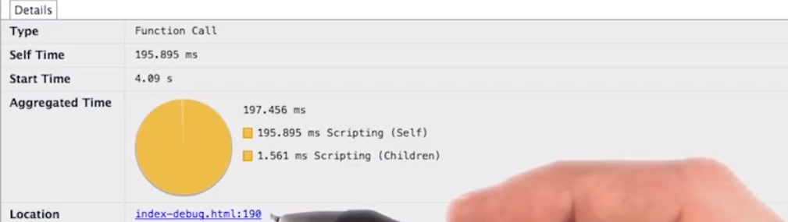

例如 Recalculate Style 会显示受到影响的元素数量，Layout 同样也会。Layout 会显示树大小、范围、开始位置，这里我们还看到了警告，稍后详细讲解下。最后，我们看到在代码中的何处触发了布局。

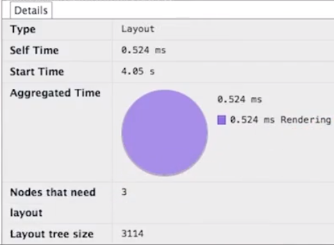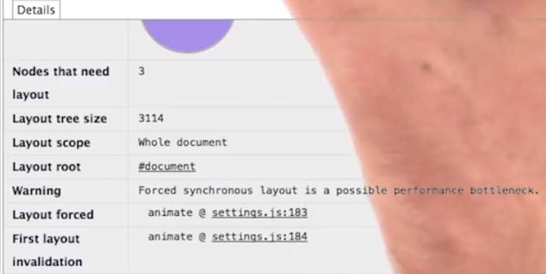

这里我将重点研究下这些黄色帧柱，似乎就是它们导致应用达不到 60fps。

---

这里是 [实时体重跟踪器应用](https://github.com/paullewis/weight-tracker) 的版本库。

（注意：上面链接的体重跟踪器版本库是高性能版本。）

---

## 6. 测试所有设备！！！

人们经常犯的一个错误是仅在桌面设备上测试网站的性能。**因为桌面设备比移动设备要强大的多，所以可能会漏掉仅在 CPU、内存和网络连接受限的设备上出现的性能问题**。你可以采取的措施是在实际设备上进行测试，如有你有 Android 设备，则可以使用在桌面设备上用过的相同 Chrome 开发者工具——开始录制，在应用中操作，停止录制，就录制好了一段时间线。

如果没有 Android 设备，请参阅下方的讲师注释，了解如何在 Chrome 开发者工具中使用模拟设备。但是注意，**模拟器的性能特性与设备本身之间会有很大的差别，虽然可以通过模拟器熟悉工作流程，但是还是需要在实际设备上进行测试，确保在实际设备上没有任何性能问题。**

在下一个视频中，Peter Lovis 将演示如何在 Android 设备上使用 Chrome 开发者工具

---

### [设备模式 & 移动模拟](https://developer.chrome.com/devtools/docs/device-mode)

---

## 10. 练习：更多时间线练习

在开始这道测试题之前，我来讲解下测试方面的策略。

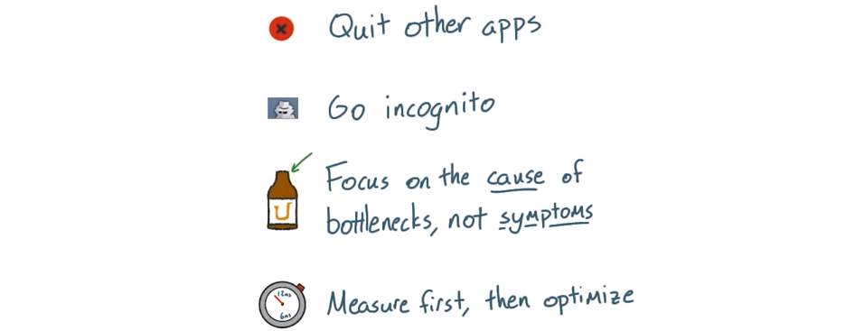

- 首先，确保收集的是纯净数据。所以，应该**退出 Chrome 浏览器之外的所有其他应用**。（怕其他应用占用 CPU 网络 内存等资源）
- 同样，扩展程序也会干扰结果，所以**确保在隐身模式下运行测试**。同时注意，有时候代码中可能存在的一个瓶颈问题，可能是由不同的管道的不同部分以不同方式触发的。所以**一定要侧重于导致瓶颈<u>问题的原因，而不是研究症状</u>**。（一个症状可能是由很多不同的原因所造成的，因此去发现问题的起因才能真正解决问题）
- 最后，对于任何性能问题，都要**始终先衡量然后开始采取修正措施**，没必要去解决根本不存在的问题。你也不知道你的修正措施是否起作用了，除非先去衡量，这样才能**对比不同之处**。

接下来实践下开发者工具技能，对讲师注释中给出的网站录制一段时间线。

仅选中“脚本事件（Scripting）”，然后开始录制，点击“切换布局（Switch Layout）”按钮，看看不稳定性是在代码的何处导致的。

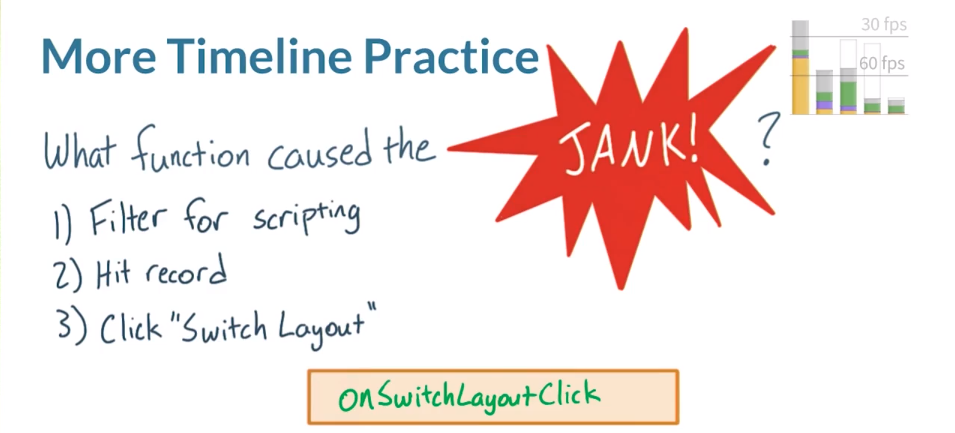

选中“Scripting”按下录制按钮，看看当我们点击这个按钮时会发生什么情况。注意，有时候你很清楚可以在管道的何处找到导致卡顿的原因，但其他时候则很难找到，这里需要展开来显示，所以可以将这个窗口分离出来。

现在可以在这里看到一系列的帧，我想知道点击钮后立即发生了什么，所以应该查看起始部分。看来这个是发生在后面的所有布局事件之前的最后一个脚本，放大看看，看来只是 mousemove 不是我要寻找的事件，再往前看看，这个脚本事件看起来更可疑，因为它来自点击操作，也是我最后执行的操作。放大了，发现这个事件导致应用运行了一个函数，点击该函数后发现位置位于 quiet 文件的第 172 行，点击链接看看是什么情况。实际上这个 onSwitchLayoutClick 函数肯定是我要找的罪魁祸首，对 body 切换成 wide 导致了布局中出现的所有卡顿问题。

> 这里可能是不想要实现这样的动画效果，而说有问题。

---

### [这是需要你来分析的网站地址](http://jsbin.com/saxalu/2/quiet)

记录单击“切换布局”按钮后发生的情况的踪迹。

你还可以在**辅助材料**部分选择下载、加载和分析时间线。

---

## 11. 练习：查找卡顿函数

你可以在讲师注释中找到这个网站的链接，和之前一样，按下录制，然后按下“Switch Layout”录制一段，看看能够找出导致卡顿的函数。

> 哈哈哈，原视频的那个 JANK 发音太逗了。对了，JANK 我觉得应该是指突然出现“闪避”的问题。

该网站的记录看起来非常接近 60fps，但是并非完全达到了，所有紫色帧柱表明可能出现了太多的布局事件，和之前一样要找到导致卡顿的原因，需要放大记录的其实部分，看看是什么导致这种混乱状态的。

放大后，很明显能看出这些部分存在问题，这些红色三角形看起来绝对像是警告。点击其中一个布局事件，我在“Details”面板中看到了警告：Forced synChronous layout is a possible performance bottleneck. 看来是个很有用的信息，发生在 totesLayingOutYo 的函数，所以问题的就是它了。

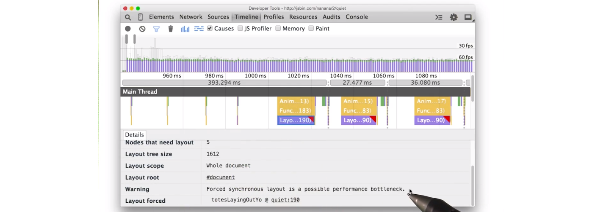

打开这个函数所在的脚本，在 190 行，设置了 offsetWidth，这就是在强制布局，它就是导致卡顿的源头函数。这次卡顿不是由起始函数导致的，而是每次需要运行新的帧时都会调用的函数，并且不是脚本开始处运行的函数导致的，而是每帧中由 requestAnimationFrame 调用的函数导致的。

> 我所运行的网站并执行的时间线中，没有 warning 的问题。可能是我电脑的运算速度太快了吧，`^_^`
>
> 但是能够从辅助材料中给的录制文件中看到。

---

### [这是需要你来分析的网站地址](http://jsbin.com/nanana/2/quiet)

(注意！该站点看起来可能与其他示例站点类似，但其具有唯一性。请确保您在新标签页中打开上面链接的站点。)

你还可以在**辅助材料**部分选择下载、加载和分析时间线。

辅助材料 [ timeline-l3-finding-janky-functions](https://www.udacity.com/api/nodes/4177628689/supplemental_media/timeline-l3-finding-janky-functions/download)

---

## 12. 练习：找到更多卡顿

请在讲师注释中找到这个可怕网站的注释，可能看起来没啥，但是点击这个 Animate 按钮，可以看到非常卡顿的动画。即使在我新买的 MacBook Pro 上，也基本没法运行。

请你录制个时间线，看看当你点击 Animate 按钮时发生的情况，同时查看瀑布视图和帧视图吗，两个都研究下。请在时间线中看看那个可怕的 Jank 位于何处，是由什么导致的？

- 是因为运行了太多 JavaScript 吗？
- 是因为发生了太多绘制事件吗，而绘制事件是由 CSS 动画造成的吗？
- 是因为合成流程吗？
- 是因为有太多的绘制事件，而绘制事件是由 JavaScript 导致的吗？
- 是因为重新计算样式花费了太多时间吗，并且是由 JavaScript 导致的吗？

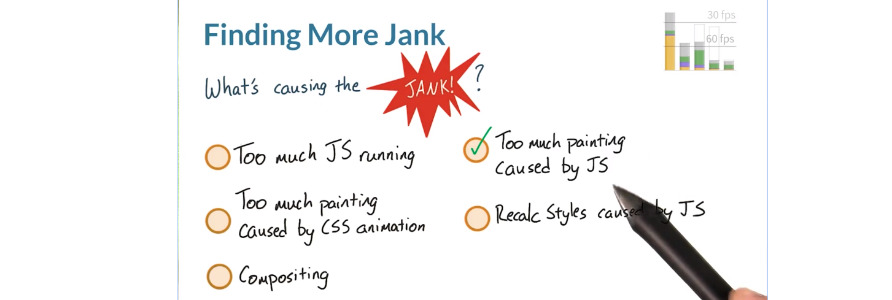

在时间线里看到了很多绿色帧柱，明显表明存在绘制问题，放大其中一个看看，看来每帧以脚本开始，有个“Animation Frame Fired”事件，紧接着是样式计算和绘制事件，似乎是 JavaScript 问题，因为如果问题来自 CSS，那么就不会看到“Animation Frame Fired”事件。

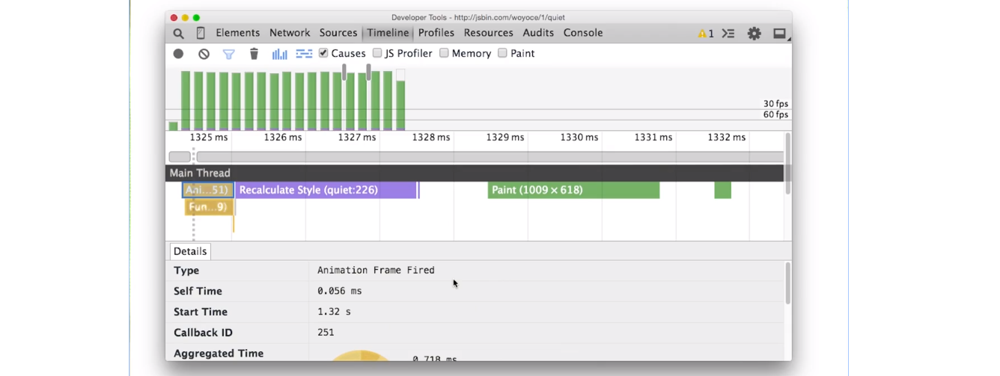

所以，最终结论是存在绘制问题，并且是由 JavaScript 导致的。

> 我在这里遇到的问题是，能够明显的看到是因为 Composite Layers 渲染事件所花时间最多。但是其事件的起因确实是因为“Animation Frame Fired”事件，所以也正如讲师所讲那样，问题来自于 JavaScript。
>
> Composite 也算是 Painting 的一部分。

---

### [这是需要你来分析的网站地址](https://d17h27t6h515a5.cloudfront.net/topher/2017/October/59defb6e_index/index.html)

---

## 13. 第 3 课回顾

现在你知道如何使用开发者工具发现卡顿问题，并且详细地了解了卡顿问题来自管道的哪个部分。

在下节课里，你将更深入地了解卡顿问题的常见原因以及如何解决这些问题。 

