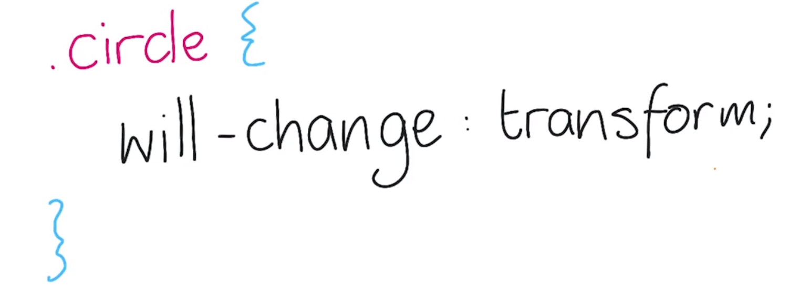
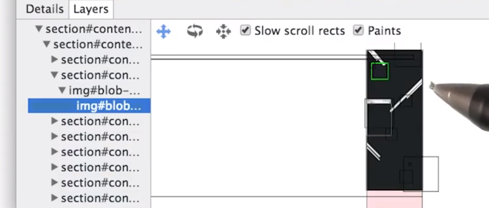

# 2.9 网站优化 - 合成和绘制

---

[TOC]

---

## 1. 第 6 课简介

我们在第一节课里已经学到，并且在最后一节课里再次发现，并非所有样式更改都是对等的。

- 某些会触发布局、绘制和渲染层合成流程；
- 某些会触发绘制和渲染层合成流程；
- 而某些仅触发渲染层合成流程。

在这节课里，你将学习如何优化渲染通道的最后两个阶段——即绘制和渲染层合成流程。如果你想详细了解样式是如何影响到渲染管道的，请参阅 Paul 的超棒网站 csstriggers.com，你可以在讲师注释中找到网站链接。如果你想知道你要创建动画效果的内容是否会触发布局、绘制或合成流程。可以打开 csstriggers.com 网站检测下，它会帮助到你的。

Cool，我们来看看我们的工具包中有没有解决绘制难题的工具。**绘制流程通常是最能干扰帧率的方面。而这正是我们要避免的。**

---

Paul 的网站： [csstriggers.com](http://csstriggers.com/)

---

## 2. 练习：绘制矩形

请看看这个网站，你可以在讲师注释中找到网站链接。当你上下滚动的时候，看起来正常，但是可以做的更好，该网站出现了大量绘制工作。

**绘制问题会比你可能会遇到的任何其他性能瓶颈都要糟糕。**

我将打开开发者工具，看看发生了什么情况。

进入开发者工具，按下 Esc 键就会调出这个菜单，其中包含 Rendering 标签页，Rendering 标签页中包含了一些非常实用的选项，你将在这道测试题和后面的几道测试题里用到这些选项。

对于这道测试题，请使用 Show paint rectangles。如果你担心绘制流程的话，就可以通过选中该选项看看发生了什么情况。它会告诉你绘制流程在页面上的什么地方发生了，何时发生了。


对于这道测试题，你将研究这个网站，所以我暂时先用我的推特主页作为示例。当我上下滚动时，你可以看到滚动栏显示为绿色，表示正在被重新绘制。


这个视频完全是绿色，因为每帧都需要绘制。注意观察绿色闪光，就知道哪里出现了绘制流程。

对于这道测试题，请回到 parallax 网站，然后选中 Show Paint Rectangles（现在叫 Paint flashing），上下滚动下，并看看哪里出现了绘制流程。是整个页面？左上角？右上角？左下角？右下角？还是下半部分？


上下滚动后，整个页面都显示为绿色。那么发生了什么情况呢？什么被绘制了？为何要绘制？我们接下来了解一下。

---

### [这是供你分析的网站地址](http://www.html5rocks.com/static/demos/parallax/demo-1a/demo.html) | [下载.zip](https://d17h27t6h515a5.cloudfront.net/topher/2017/September/59b78239_/.zip)

---

## 3. 绘制分析器

如果你遇到了刚刚看到的意外绘制情况，则可以使用另一个工具，叫做 Paint Profiler。你可以在时间轴标签页中找到，借助 Paint Profiler 可以非常轻松地确定页面的哪些区域被绘制了，何时绘制的。

对于这道测试题，请打开相同的 URL 并选中 Paint Profiler，按下录制按钮并上下滚动页面。应该可以看到大量长时间运行的绘制记录，点击其中一个绘制记录，然后在下面的 Paint Profiler 标签页的详细部分看看具体信息。浏览下 Paint Profiler，然后告诉我列出的第一个绘制指令是什么？


点击一个绘制记录，并转到 Paint Profiler 标签页。

在 PP 中要注意几个事项：

- 首先，这里有个全新的时间轴。
- 有个绘制指令列表。
- 然后是部分被绘制的页面

这个时间轴是整个绘制指令，整个页面都被绘制了。如果只查看时间轴的一部分，就可以看到绘制的是什么。这个工具非常棒，可以让你从多个角度查看浏览器到底绘制的是什么。

我随机选择了绘制区域的某个点，可以看到这个白色方框，表示某些文本被绘制了，在左侧可以看到 drawTextBlob 指令。


回到绘制的整个时间轴，可以看到第一个指令是 save()，这就是问题的答案。

最后再提一点，所有这些绘制指令，这些绿色长条都非常接近 60fps 线条，现在运行速度是 60fps，但非常接近时间预算。如果还有其他工作的话，就可能达不到 60fps 了。我们来看看如何解决这个问题。

---

### [这是供你分析的网站地址](http://www.html5rocks.com/static/demos/parallax/demo-1a/demo.html)

---

## 4. 合成

我们来讨论下渲染层合成流程，这里有个网页，我想做的是创建一个侧边导航菜单。


我通常的做法是只有一个图层重新绘制侧边导航菜单像素，并且每帧动画都这么操作。


最终是只有一个图层，上面有侧边导航菜单，并且网页内容位于后方。


**问题是每帧都要绘制，最佳做法是一个图层上有网页内容，另一个图层上有侧边导航菜单，需要做的就是将侧边导航菜单滑动到网页上方，效果是一样的，但是不需要绘制了。**


---

## 6. 合成分层

在 Chrome 开发者工具中，有两个记录与图层（即合成图层）有关。第一个是 Update Layer Tree，当 Chrome 的内部引擎“Blink”知道需要页面的哪个图层时就会出现该记录。它会查看元素的样式并尝试弄清楚所有元素应该按照什么顺序排列，需要多少个图层。


Composite Layers 是另一种记录。此时浏览器会将页面合成到一起发送给屏幕。图层越多，图层管理和合成花费的时间就越多。所以**我们需要在降低绘制时间和增加图层管理时间之间做出权衡**。

---

## 7. 管理分层

你可能认为图层是完全自动化的流程，大部分情况下是这样的。**一般来说，你应该让浏览器来管理图层，因为它知道它在干什么。**

是的，但是**如果你遇到了绘制问题，就需要考虑将某个元素单独放到一个图层里**。

你可能有疑问，**如何创建图层啊？在介绍具体方法之前，你应该看看元素是否已经具有自己的图层**。

---

## 8. 管理分层 2

我打开了开发者工具，你可以按下键盘上的 keyboard esc 键，调出这个菜单，其中包含 Console、Search、Emulation、 和 Rendering。我们要研究的是 Rendering 选项。


我将选中“Show composited layer borders”，选中后，页面上就会出现网格。这些浅蓝色线条表示每个图层拆分成的图块。作为开发者，我们是没法控制这些图块的，这只是浏览器拆分图层的方式。 而我们感兴趣的是这些橙色方框，可以在圆圈周围看到。这些橘色方框表示这些元素位于自己的合成图层上。那么我们该如何创建图层呢？

图层看起来很有用，某些方式适用于几乎所有浏览器，而某些却比其他的更具技巧性。我们从更新的不太技巧性的方式开始。

在 Chrome 和 Firefox 中，你可以使用 will-change CSS 属性告诉浏览器将出现外观更改。浏览器然后可以选择将元素放到新的合成图层上。这里，我们使用 will-change: transform; 告诉浏览器我们打算在某个时间点更改元素 transform。为此，浏览器会创建新的图层，除了 transform 之外，你也可以使用 left top width height 或任何其他外观属性。但即使浏览器预料到会有这些更改，依然会为这些属性运行布局和绘制流程。所以提前警告你打算更改它们也不会有多大改善。



will-change 的好处是创建新的图层代价很高，因为需要创建并绘制新的图层，匆忙地创建代码也很高。对于旧版浏览器和 safari，你需要使用某种 3D transform。实际上 transform:translateZ(0) 是最常见的形式。多数人称之为没有转换（no transform hack）。它会应用 3D 转换在 Z 空间内完全没有变动元素的位置，但是足以促使浏览器创建图层。


在生产环境下，你可能需要使用 transform:translataZ(0) 和 will-change: transform; 你不应该使用不必要的技巧，如今并非所有的浏览器都支持 will-change，所以你可能需要用到 null transform 技巧强制浏览器采取操作。而 will-change 只是个暗示，浏览器可以忽略，使浏览器具有更多选项。在可能时尽量让浏览器决定应该如何操作，通过 will-change 向浏览器发出暗示，但是让浏览器决定如何处理。

---

## 9. 练习：Will-Change

还记得这个可怕的网站吗？对于这道测试题，请进一步改善该网站的性能。

我按下了“Animate”按钮，之后出现的画面只能描述为就像从最可怕的噩梦中醒来的状态。“Aren't I lovely?”更是让人觉得惊悚。

在开发者工具中，选中“Show paint rectangles”复选框，可以看出每一帧整个页面都闪烁为绿色，看来效率非常低。对于这道测试，请在类“box”元素中使用 will-change transform，使其与现在的图层独立开来。你也可以点击网站上的“transform”按钮，该按钮使用了 3D 转换。使用 will-change:transform 告诉浏览器 box 元素将出现更改后，你将在屏幕上看到一个编码。请将该编码输入到此方框中，然后继续。


在类“box”中添加了 CSS 属性“will-change”，并将其设为“transform”。很快性能就会出现了显著的改善，非常接近 60fps，将元素放入独立图层中非常有助于避免绘制问题，尤其是与动作或透明度有关的更改。但是如果你更改的是文本颜色或阴影等属性，将元素放入独立图层中也没有帮助。因为你依然需要绘制它，所以仅在合理的情况下使用新的图层。

---

[这是供你分析的网站地址](https://udacity.github.io/60fps/lesson6/willChange/index.html)。

（特此说明，这是本演示的其他版本。）

---

## 10. 你的合成预算

所以应该提前警告所有元素，对吧？告诉浏览器我们将更改所有内容？

对啊，我觉得有帮助。

并非如此，噢，我之前提到了图层管理和渲染层合成并不是独立分开的，我们需要在二者之间找到平衡点。至于应该要达到多少个图层，并没有一个绝对数量。对于动画这样的关键性工作，要达到 60fps，更新图层不应该超过 2ms，合成流程也不能超过 2ms。

当然了，虽然超过了这些时间，但是依然能达到 60fps，那也没多么糟糕。关键在于找到权衡，为自己的项目确定正确的图层数量。

---

## 11. 练习：分层计数

你知道你可以查看某个网站有多少个图层吗？当然还是要打开 Chrome 开发者工具。

我查看的是 parallax 演示网站，我已经针对所有泡泡设置了 will-change 属性，并需要开始 Paint Profiler。所以选中此方框，点击录制，滚动页面。我在独立窗口中打开了开发者工具，以便有更多的查看空间。


每帧顶部都有灰色的柱形长条，你现在可以在屏幕上看到所有图层了，以及为何每个图层都合称为独立的图层。在顶部的四处查看和旋转工具。例如，选中这个后，就可以旋转页面，查看所有图层的 3D 视图。很酷吧


当我点击某个图层，可以看出为何成为一个图层，这里是因为它具有 will-change 属性。

现在请你来数数图层，请转到此网站。重新调整窗口大小或不断放大从而能够滚动，点击“Click me”按钮，然后录制一段滚动时间轴。当然，一定要选中 Paint Profiler。然后回答这两个问题：


- 第一个问题是网站有多少个图层？但是不用考虑文档图层。
- 第二个问题是为何将 totes-promoted 放入一个图层？
  - 是因为具有 will-change 属性？
  - 是因为 totes-promoted 与其他合成内容重叠了？
  - 是因为具有 3D 转换属性？
  - 是因为 totes-promoted 是硬件加速画布？
  - 或者是因为 totes-promoted 实现了转换动画效果？


我选中 Paint Profiler 后录制了时间轴，点击其中一个方框，立即可以看到除了 #document 之外，还有一部分。点击 totes promoted，Paul 你又起了个诡异的名字啊。可以看到合成这个图层是因为它与其他合成内容重叠了。这里的其他内容是指后方的 color-block 区域，在 Layers 面板中可以看到在根 document 下，页面上有两个图层。


打开网页的源代码，可以看出 color-block 元素上应用了 translateZ transform 属性，意味着提升到了自己的独立图层中。**为了保持图画顺序，在文本区域，即这个方框也必须具有自己的图层，并放在 color-block 上方**。当你将元素提升到图层上时，一定要谨慎。因为你**可能会不小心由于存在重叠而创建了大量其他的图层**。


就是这样，你可以通过 Paint Profiler 轻松地跟踪你将创建的所有图层。**关键在于尝试在图层管理中合成时间和管道的其他部分花费的时间之间找到平衡点**。**为你的所有元素应用 will-change: transform; 或 translateZ(0) 属性看上去非常诱人，但是会消耗大量内存并花费很多合成时间**。最终可能造成的问题比解决的还要多。这在移动设备上就是个显著问题。

---

[这是供你分析的网站地址](http://jsbin.com/ruhahu/1/quiet)

(你可能需要缩小窗口以便滚动。)

---

## 12. 合成和绘制

我打开了之前的 Parallax 演示网站并打开了开发者工具。选中“Show paint rectangle”上下滚动下，可以看到整个页面都闪烁成绿色，表明有很多绘制事件。这个演示网站肯定存在问题。为了弄明白为何有这么多的绘制事件，我打开了 Parallax 网站的源代码 CSS 文件：


可以看到有很多元素应用了 will-change: transform; 但肯定并非所有元素。存在矛盾的是某些元素没有使用 will-change 进行提升。对于这道测试题，请找到应该通过 will-change 进行提升的元素。使用开发者工具解决该问题，最后，只需将元素 ID 输入这个方框里即可。


``` javascript
// shim layer with setTimeout fallback
window.requestAnimFrame = (function(){
  return  window.requestAnimationFrame       ||
          window.webkitRequestAnimationFrame ||
          window.mozRequestAnimationFrame    ||
          window.oRequestAnimationFrame      ||
          window.msRequestAnimationFrame     ||
          function( callback ){
            window.setTimeout(callback, 1000 / 60);
          };
})();https://www.html5rocks.com/static/demos/parallax/demo-2/scripts/parallax.js
```

> requestAnimationFrame 兼容性处理，整个文件的 js 代码都可以学习。比如利用了匿名函数的方式来避免变量之前的相互影响，并且传入(window,document) 用 var win = window & d = document 的方式来简写。还有使用 var $ = document.querySelector.bind(document) 的方式创建一个类似 jQuery 一样的 DOM 选择器

作为养成良好习惯的开发者，我在时间轴面板选中了 Paint Profiler，按下录制按钮，然后上下滚动页面，录制好时间轴。点击其中一个帧了解更多信息，这个小图片基本上表明了所发生的情况。注意，我选中了这个 Paints，表明我可以看到页面上正在绘制的内容。选择滚动过程中的随机一帧后，可以看到背景正在被绘制。实际上我们之前看到的圆圈并没有被绘制。圆圈明显位于自己的图层中，因为在这个页面上它们没有被绘制，只有背景被绘制了。



回到 Elements 面板，看看能不能找到相关源代码。你瞧，样式应用了“-Webkit-transform: translate”，这是 2D translate，不会自动创建新的图层。所以我向 ID 为“background”的元素添加了 will-change:transform 属性，看看效果如何。


回到该页面，现在上下滚动的话只有滚动条闪烁为绿色了，这是没法消除的。但是整个页面的其他部分都看起来很棒，性能提高了。肯定不会到处出现绘制事件了。

---

[这是供你分析的网站地址](https://www.html5rocks.com/static/demos/parallax/demo-2/demo.html)

---

## 13. 做一些测试题

wahoo！恭喜你，你很快就要学完这门课程了。稍后，我将介绍下这门课程最终项目的要求。但此之前，我要说下测试题。

你可能注意到了，**我们喜欢在课程中安排多的测试题，因为这就是人们学习的方式**。你学习这门课程就是为了让你的应用运行速度更快。所以在这门课程中，我们为你提供了大量网站，让你去分析和消除 jank。当然，并非每到测试题都需要调试应用，我们也喜欢为测试题加点料，例如这些题目。


希望你能从概念层面更清楚要实现的目标，现在来说说我自己的经历。

当我与 Paul 一起开发这门课程时，我原以为我对 60fps 的性能有所了解。但是当我们一起合作，并思考要向大家提出的所有问题时，我意思到我对前端性能的理解并没有我想象的那么深入。正如任何老师都会有这一体验，只有你尝试向其他人解释某个概念时，才能正在理解这一概念。实**际上，比起直接回答问题，教授和确定要问哪些问题是更加有效的学习过程**。


因此，我要向你提出一个挑战，对于这门课程，你能比我们教授的更好吗？回想下我们向你提出的问题以及我们给你布置的示例问题：


- 你觉得有哪些问题可以有更好的提出方式吗？
- 或者有更好的应用供大家来调试吗？
- 甚至可以提出某种性能问题难倒我和 Paul？

如果有的话，请转到课程的相关部分并在论坛上发布你的问题。在发布的时候，请在帖子开头部分提出更好的问题。提出问题有两个好处：


- 你将通过更深入地思考来提高自己对性能的理解
- 改善这门课程，对所有人都受益。未来的学员将能够利用更多的问题来练习所学的知识，并对性能更加理解。这绝对是双赢局面（win win）

所以你能想出比我们更好的问题吗？

---

## 14. 练习：最终项目

你现在看到的是最终项目，恭喜你学到了现在。你需要将该项目复制到本地机器上，请参阅讲师注释了解下载信息。

在这个应用中 Paul 留下了糟糕的性能问题。这个新闻收集器使用了 Hacker News API 来拉取当前的热门报道。非常酷，但是看看当我滚动时这里显示的帧率，绝对看起来不妙。

现在看看当新闻滑入和滑出时发生的情况。看看下降结果，试着在移动设备上用用该应用，简直没法用。需要改进的地方很多。

我在讲师注释中列出了一些提示，指出哪些重大地方绝对需要修复。但是如果你想增加挑战难度，就不要看这些提示。做出衡量，看看能否自己找到这些性能问题。先自己试试看，实在找不出再去看提示。


在解决方案视频中，你将从更高层面了解这个应用存在的问题。并且会演示我是如何解决这些问题的。但是请注意，我的解决方案只有其中一种。很可能你的代码和我的截然不同。我还会贴出我的代码链接，供你查看和对比。对于完美主义者来说，我还会列出这个项目已知的所有 bug。


如果你一节课不落地学到了现在，则肯定可以使用工具让此应用达到 60fps。还等什么呢？下载应用，开始衡量和改善吧。祝你们好运。


【...】明天再研究这个吧。

---

### [这儿是 News Aggregator 的项目地址!](http://github.com/udacity/news-aggregator)

这里是 janky 版本的[实际展示](http://udacity.github.io/news-aggregator/) | [下载.zip](https://s3.cn-north-1.amazonaws.com.cn/static-documents/nd001/news-aggregator.zip)

需要帮助？这里有些[提示](https://github.com/udacity/news-aggregator/tree/gh-pages/hints)！

### [这是 Cameron 的应用！](https://github.com/udacity/news-aggregator/tree/solution)

这是 [bugs 的完整列表](https://github.com/udacity/news-aggregator/blob/gh-pages/hints/all-bugs.md)！

有问题

---

## 15.课程回顾

恭喜你，你已经学完这门课程了。希望你在学习这门课程时，能像我和 Pual 制作这门课程时一样开心。

当然了，你学习了大量关于如何让应用达到 60fps 的技巧。

请在我们的论坛上 Twitter Google+ 或任何其他设计媒体上分享你是如何提高应用性能的，以及你的修正方法和取得的成功。当你阅读他人的技巧时，确保同时运用到自己的项目中。

你应用中的资料网站，看看你的瓶颈在哪，并消灭掉这一 jank。基本上，性能始终很关键。


