# 2.使用 React 渲染 UI

> 你将了解 React 如何创建和渲染元素。你还会将手动元素转换为 JSX，使用 create-react-app 搭建项目，并且了解组件的简单介绍。

[TOC]

---

## 2.1 渲染 UI 简介

**React 没有使用字符串模板，而是使用 JavaScript 对象来构建用户界面**。这是 React 和其他常用 JavaScript 框架的根本区别。

**React 元素是轻量级 JavaScript 对象，而非实际的 DOM 节点。**我们要充分发挥 JavaScript 的功能，将他们整合起来，我们使用这些元素来描述页面是什么样的，然后交给 React 来实际操作 DOM。**我们甚至可以创建自定义元素，也就是“组件（Components）”，利用它们来整齐地封装元素和行为，这些组件是 React 的基本单位。**

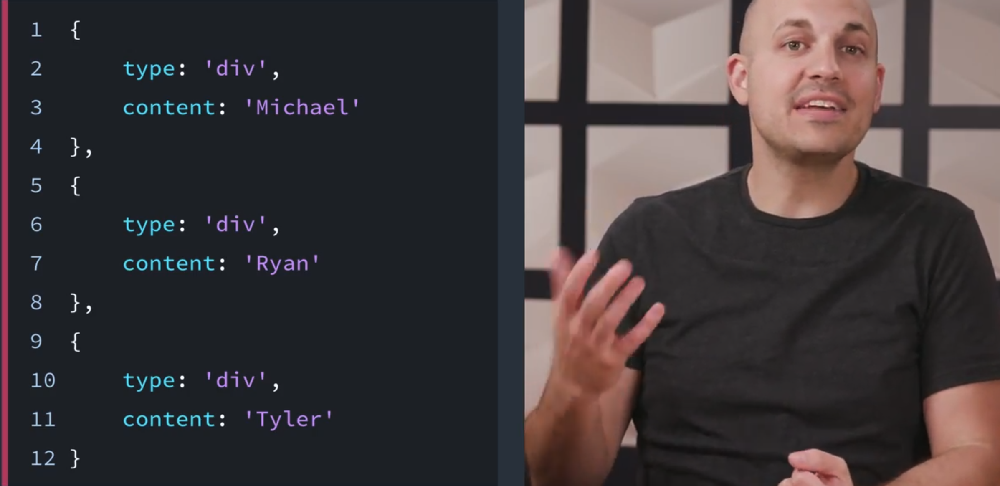

---

React 使用 JavaScript 对象来创建 React 元素。我们将使用这些 React 元素来描述我们希望页面看起来如何，React 将负责生成 DOM 节点来达到效果。

还记得在上节课提到的命令式与声明式代码之间的区别吗？**我们编写的 React 代码是声明式，因为我们没有告诉 React *执行什么操作*；我们编写 React 元素来描述页面应该看起来怎么样，React 会执行所有的实现工作。**

说了很多理论内容了，我们开始创建一些元素吧！

---

## 2.2 创建元素和 JSX

### 首先观看

在下面的几个视频中，我们将使用 React 的 `.createElement()` 方法。首先，下面是它的用法：

```
React.createElement( /* type */, /* props */, /* content */ );
```

稍后我们将详细分析！我们将用一个已经设置好的项目开始。暂时不用担心创建项目或跟上进度。很快就会有很多实践内容！我们将在下个部分构建我们的课程内项目 Contacts App。

虽然你将在下面的几个视频中看到，但是确保能了解 React 的 `.createElement()` 方法有多酷！

> ### 💡 Trying Out React Code 💡
>
> React 是 JavaScript 的扩展（即 JavaScript 库），但是没有内置在浏览器中。如果你像学习 JavaScript 一样在浏览器控制台中测试 React 代码示例，则无法测试。稍后，我们将了解如何安装和使用 React 环境。然后，你将能够尝试示例代码！

---

我们说过 react 不是使用模板来描述用户界面而是使用元素，我们这样说是什么意思呢？

这里有两个非常基本的文件，一个是 react，一个是 react-dom。

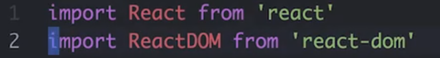

现在先不要担心这些文件来自哪里，也不要自己操作，在讲解实际操作之前，我们先来讨论一些核心概念。

重要的是要知道左边的浏览器会反映我在右边编辑器上输入的内容。

我们使用 React.createElement 创建一个新的 react 元素

```javascript
const element = React.createElement('div',null,'hellow world');
```

这是 react 用于创建这些元素的顶级 API 调用，它看起来有点像 Document.createElement 方法，但还是有点差别的。

- 第一个参数是我们要使用的元素的标签名称，我们直接创建一个 div。
- 第二参数我们稍后在谈。
- 第三个参数将是我们放在 div 中的一些文本。

那么我们怎么才能将这个元素放到页面中呢？

这就是 ReactDom 派上用场的地方了。ReactDom 只是使用 react 库的一种方式，在 react 中，决定要渲染什么的过程与实际渲染完全脱钩，这种脱钩使我们可以在本地设备的服务器甚至是在 VR 环境中渲染事物。

这节课我们使用 react-dom 因为我们在浏览器中工作。

```react
ReactDom.reader(
  element,
  document.getElementById('root')
)
```

那么我们说 ReactDom 将我的元素渲染到一个 DOM 节点，在这种情况下，我们将使用页面中已经存在的根元素，我们保存它，然后在浏览器中可以看到 div 中显示了 hello world 消息。

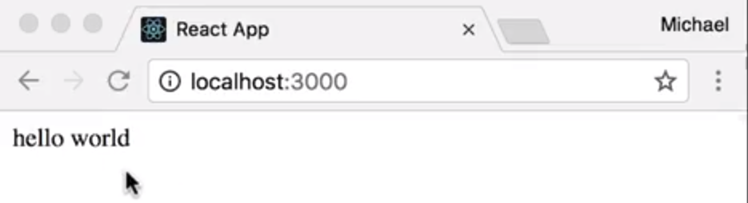

不过你看着这行可能在想这个元素是什么，我们来看看控制台。

```javascript
console.log(element)
```

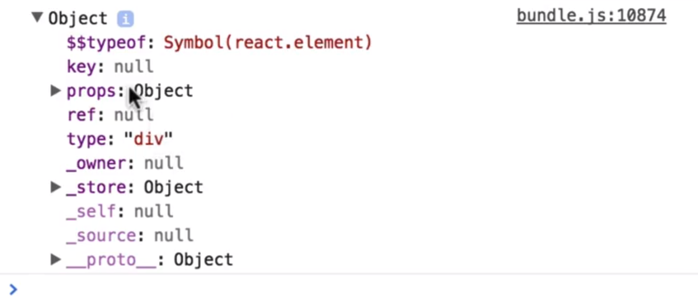

我们打开 Chorme 的检查器，可以看到这只是一个简单的 JavaScript 对象，它有一堆不同的属性。它具有键、props、类型（type——'div'）、下面还有一些私有属性。

---

## 在 DOM 上渲染元素

在上个视频中，我们使用 ReactDOM 的 `render()` 方法将我们的元素渲染到页面的特定区域。具体而言，我们在叫做 `root` 的 DOM 节点上渲染了 `element`。这个 `root` 来自哪里？

**使用 React 构建的应用通常有一个 `root` DOM 节点。例如，一个 HTML 文件可能包含以下 `<div>`：**

```
<div id='root'></div>
```

通过将该 DOM 节点传入 `getElementById()`，React 将最终能够控制它的所有内容。**另一种思考方法是这个 `<div>` 将充当我们 React 应用的“钩子”；React 将控制该区域并渲染我们的 UI！**

### 习题 1/3

运行以下代码时，`myBio` 将存储什么？

```
import React from 'react';

const myBio = React.createElement(
    'div',
    null,
    'My name is Michael, and I love porcupines.'
);
```

- DOM 节点的引用？
- DOM 节点本身？
- JavaScript 对象？√
  - React 的 `.createElement()` 方法获得元素的说明并返回简单的 JavaScript 对象。 
- JavaScript 类？

---

现在我们要给元素添加一个类名。

第二个参数是要为 DOM 节点添加的属性，那么为它添加一个类名 welcome-message。

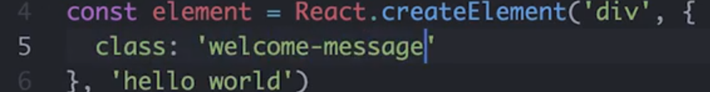

保存，我们收到了一条警告。

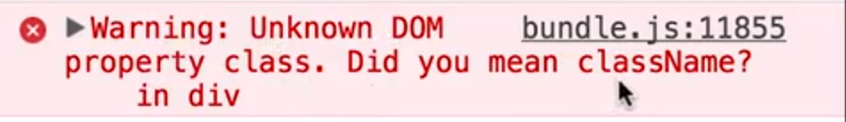

未知的 DOM 属性 class，你是说在 div 中的 className 吗？

这是 React 给我们的一条警告，它说 class 一词不是一个有效的 DOM 属性，并建议我们使用 className。我们来试试。

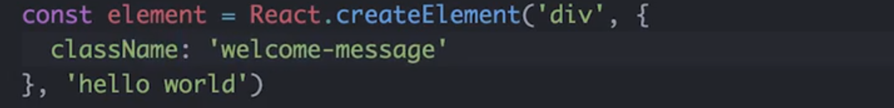

现在可以看到警告消失了，并且元素被赋予了我们想要的类名。不过这有点让人困惑，你还记得吗，这些元素实际上描述的是 DOM 节点，而不是 HTML。

Class 是 HTML 属性的名称，一旦浏览器解析完毕并将其转换为真正的 DOM，节点 DOM 属性名称就是 className。

让我们在控制台中审查这个 div。

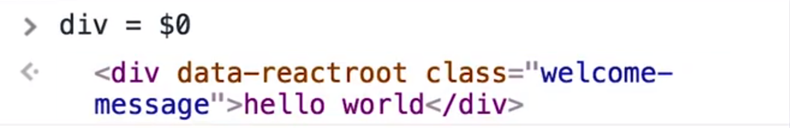

可以看到，虽然它的 HTML 声明中有 class 一词，如果我打 div.class，这里我们使用的是对象，即实际 DOM 节点，它说 div.class 未定义，而 div.className 返回的才是正确的字符串。

所以当我们创建这些 React 元素时，记住，我们在描述 DOM 节点，而非 HTML 字符串。

我们在学习 React 时，你可能会遇到 VirtualDOM 一词。这个术语本质上的意思是我们在这里创建的不是真正 DOM 元素，而只是描述真正 DOM 节点的对象。所以，**调用 React.createElement 时并没有在 DOM 中创建任何东西，只有执行 render 后，浏览器才会创建真正的 DOM 元素。**

---

### 习题 2/3

React 允许将各种 HTML 属性传递给 React 元素。请查看 [React文档中的 `All Supported HTML Attributes`](https://reactjs.org/docs/dom-elements.html#all-supported-html-attributes)|([翻译链接](https://doc.react-china.org/docs/dom-elements.html#%E6%89%80%E6%9C%89%E5%8F%97%E6%94%AF%E6%8C%81%E7%9A%84html%E5%B1%9E%E6%80%A7))，并指出下面的哪些属性是允许传递的：

- poset
- id
- marginWidth
- for
  - 值得注意的一点是，你无法使用默认的 `for` 属性。就像你需要使用 `className`而不是 `class`，你需要使用 `htmlFor` 而不是 `for`。这是因为 'for' 是 JavaScript 的保留词。 
- accessKey

我刚刚使用 React 的 `.createElement()` 方法构建了一个 “React 元素”。`.createElement()` 方法具有以下方法：

```
React.createElement( /* type */, /* props */, /* content */ );
```

我们详细分析每一项参数可以为：

- `type` – **字符串或 React 组件**

  可以是任何现有 HTML 元素字符串（例如 `‘p’`、`‘span’` 或 `‘header’`），或者你可以传递 React *组件*（稍后我们将使用 JSX 创建组件）。

- `props` – 为 `null` 或一个对象

  这是 HTML 属性的对象以及关于该元素的自定义数据。

- `content` – `null`、字符串、React 元素或 React 组件

  你在此处传递的任何内容都将为所渲染元素的内容。包括纯文本、JavaScript 代码、其他 React 元素等。

---

现在我们来聊聊嵌套。

**大多数用户界面都表示为其他视图中的视图。**由于 React 是用于创建用户界面的库，它实际上非常擅长这一点。

我们来看看这个 div 在这里我们不说 hello world。而是放入其他一些元素。或者我们可以在这里放一个 span 来保存我们的消息，或者一个 strong 元素以使它显示为粗体。

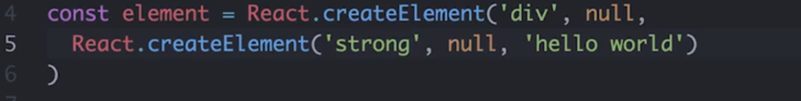

所以我们可以通过将元素作为第三个参数传递给 createElement 来将其嵌套在其他元素内。

我们来做一些更有趣的事情。

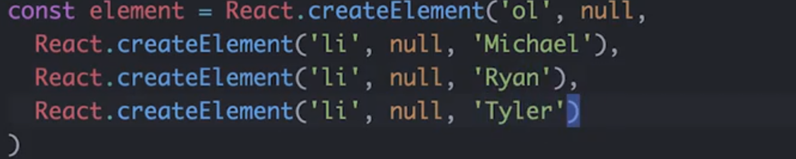

我们创建一个列表，这将是一个列表项，然后这将是一列人员，我们有 Michael、Ryan 和 Tyler

这没问题，但大多数时候你需要一个列表，你可能将项放在某处的数组中。相比于逐个写出子元素，React 可以让我们提供元素数组作为 children，这使我们可以方便地使用现有的数据数组。

假设我们这里有一个人员数组，并且我们想从该数组动态地生成这些列表项，我们可以映射（map）人员数组，然后对于每位人员生成一个列表项，而不是硬编码名称。我们直接使用 person.name 就会获得相同的结果。

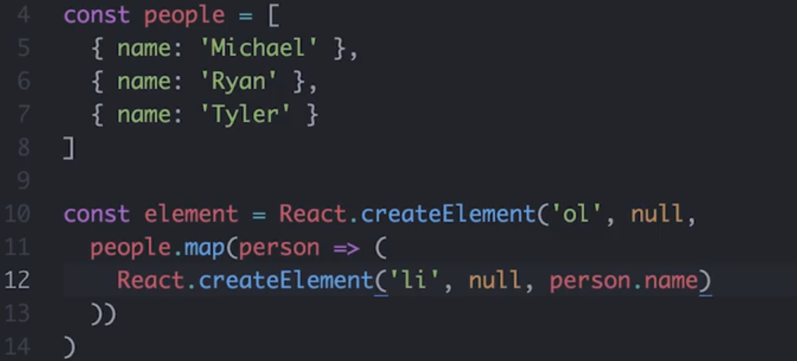

我之所以喜欢使用 JavaScript 来生成这些元素，是因为我不需要任何特殊语法来映射数组，只要用数组映射就可以了。所以我不需要用一模板语言来重复或映射（mapping）每个语法去遍历数组。我使用已经熟悉的 JavaScript 就可以。

这里有趣的另一点是这个 person 对象已处于作用域内，所以我不需要模板语言来给我这个作用域概念。相反，我只是在 JavaScript 函数作用域中使用了 person 对象，这里没什么新东西要学。

**使用数组作为 children 需要注意的一点是，如果你未给它设置键，则会收到 react 的警告。我们在这里弹出控制台就会看到一条警告。**

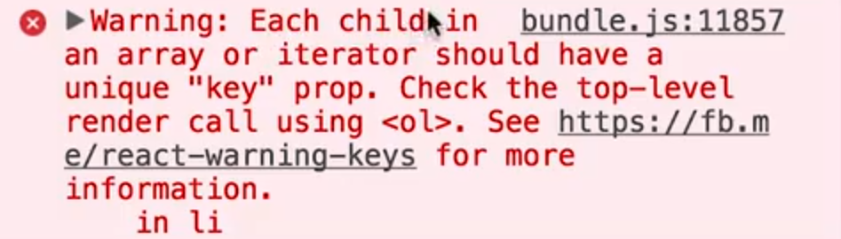

它说数组或迭代器中的每个子元素都应有一个唯一个键(key) prop，请检查顶层使用 ol 的调用。这是什么意思呢？

记得当我们将类名添加到 div 时，这里的第二个参数，这些组件的 prop，我们来给这个项一个唯一的键 prop 给每个对象一个唯一的键，在这里使用 name 就可以了，这对每个对象都是唯一的，保存它就会看到警告消失了。

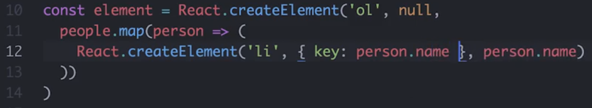

**使用数组时与项相关的另一个始终唯一的东西，是它们在数组中的索引。**所以如果我愿意，我也可以在此使用每位人员在原始数组中的索引作为键。那么，我如何获得索引呢？这又要用到 JavaScript 了，对吧？

这是我喜欢使用 JavaScript 的另一点。我没有在此使用任何人的模板语言，所以我不需要学习任何新的东西就知道映射回调的第二个参数是索引，这就是我获得它的方式。

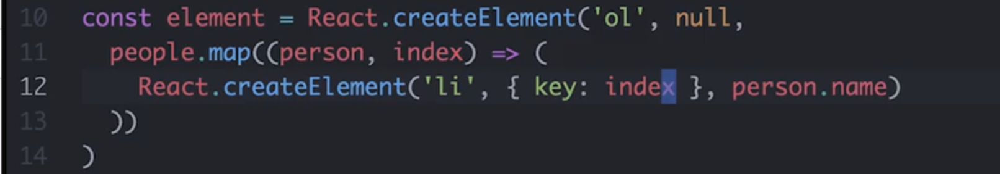

在这节课中，我们不会深入讲解键(key) prop ，但是要知道**当你的应用状态发生变化时，这将有助于 react 跟踪更改特定子元素。**

我们将在下节课中更多地讲解状态，现在你只需要知道你使用数组时，你需要给每个子元素一个唯一个键 prop。

---

### `.createElement()` 返回*一个* 根元素

`React.createElement( /* type */, /* props */, /* content */ );` 创建一个特定类型的 React 元素。我们通常会传入一个标签，例如 `<div>` 或 `<span>` 来表示该类型，但是内容参数可以是*另一个* React 元素！

看看下面的示例：

```
const element = React.createElement('div', null,
  React.createElement('strong', null, 'Hello world!')
);
```

这里，当此 React 元素渲染为 HTML 时，"Hello world!"将包裹在 `<div>` 内。虽然我们可以嵌套 React 元素，但是注意整个调用仅返回一个元素。

---

现在我们已经学习了如何创建和嵌套元素，但是如果只使用嵌套的方法来创建元素就会产生大量冗杂的嵌套结构。如果我们有一些不同的语法，可以用来更自然地描述元素间的嵌套关系就好了。

HTML 怎么样，这不就是它的作用吗？或许我们可以借用一些这样的尖括号放在我们的 JavaScript 中？换句话说，或许**我们可以将创建元素的调用变得更像我们熟悉的 HTML，这正是 JSX 所做的。**

JSX 是 JavaScript 的语法扩展，它可以让我们编写看起来有点像 HTML 的 JavaScript 代码，使其更加简洁易懂，我们来看看吧。

---

我们来使用 JSX 而非 createElement 重新创建人员列表。

像我之前提到的 JSX 看起来与 HTML 很像， 所以我们要将这些 createElement 调用替换为一些类似 HTML 的东西。

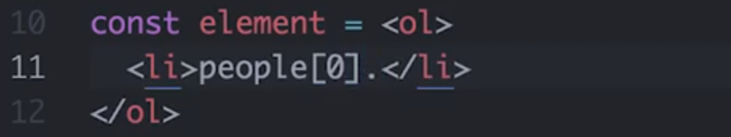

看看这些尖括号，它们怎么会在我的 JavaScript 中？

这是许多人第一次看到 JSX 时的反应，如果这是你现在的感觉，不用担心，这很正常。但是看看我们摆脱了多少语法。

我们在这里放上 li，我们想获取人员数组中第一个人的名字，那么我们说 `people[0].name`，看看会获得什么

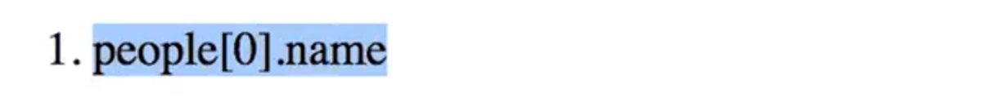

它只是给出了我们刚写的代码，我们想要的是评估这个表达式，但 JSX 只是传递了所有的字符，并将它们显示在页面上。所以每当我们想让 JSX 为我们解析一些 javascripts 时，我们需要将这条 JavaScript 包裹在花括号中，这可以是你想要的任何 js 表达式。

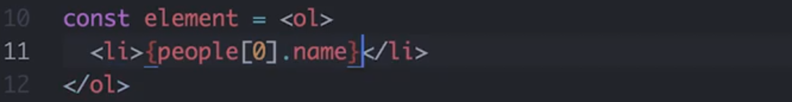

它可以是算术，也可以是三元运算符


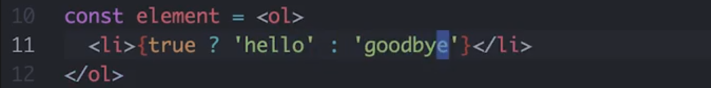

只要是放在这些花括号里的任何有效的 js 表达式都可以。

那之前的映射呢？我们也可以将它们放在花括号里吗？来试试看。

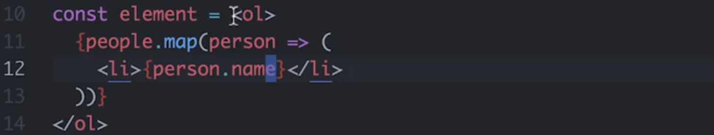

我们说 people.map 映射我们想要创建列表项的每个人员，然后在这里，我们用 person.name 获取人名。所以我们从 JSX 开始，而从这个花括号开始进入 js 评估 people.map 此映射函数的返回值将是一些 JSX，然后我们又从这里返回 js 说 person.name。所以我们从 JSX 开始进入 js 返回 JSX 又返回 js。但是整个过程非常流畅，也比我们之前用的嵌套的 createElement 调用要简洁得多。

我们之前说过，每当我们给 react 一个数组时，我们需要给所有子元素一个唯一键属性，这里也完全一样。我们查看浏览器控制台，毫不意外出现了关于键属性的警告，我们需要给每个列表项元素一个唯一键属性。

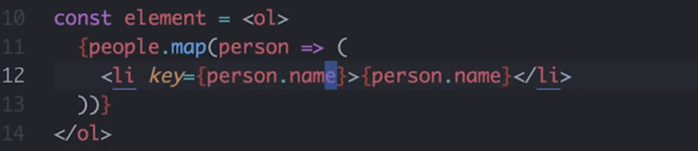

我们在 JSX 中这么做的方法与 HTML 属性非常像。我们可以说 key= 打开一个新的 js 表达式并使用 person.name 作为 key 的值。

为了更清楚，我们来看看这里的源代码，看看我们刚刚写的这个代码可以编译成什么。

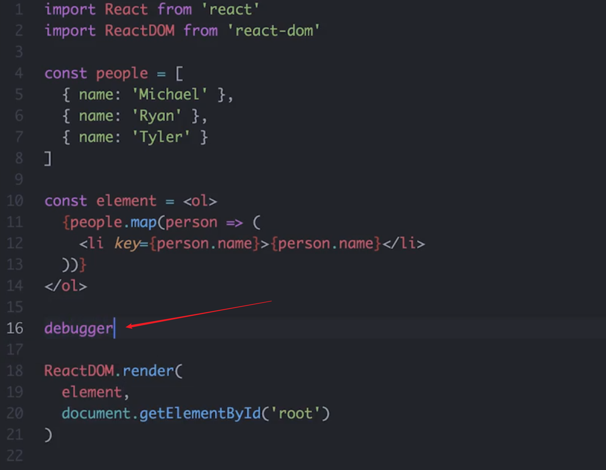

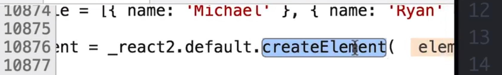

我们可以在源代码查看器中看到我们实际上仍在使用 createElement 调用来创建元素，所以即使我们在编辑器中使用 JSX，它非常简洁，但这些代码最终都会编译成真正的 JavaScript。

---

#### 习题 3/3

看看下面的 JSX 示例：

```react
const greeting = (
  <div className='greeting'>
    <h2>Hello world!</h2>
  </div>
);
```

如果你想输出相同的 HTML，在调用 `createElement()` 时，`1`、`2` 和 `3` 应该是什么？

```react
const greeting = React.createElement(
  __1__,
  { className: 'greeting' },
  React.createElement(
    __2__,
    {},
    __3__
  )
);
```

- `'div'`, `'h2' `, `'Hello World!'`

  - 注意是字符串

  - 无论是 JSX 还是普通的 JavaScript（使用 `createElement()`），两个示例都生成了相同的 HTML： 

  - ```html
    <div class='greeting'><h2>Hello world!</h2></div>
    ```

### JSX 也返回*一个*根元素

在编写 JSX 时，请记住，它只能返回一个元素。该元素可以有任何数量的子元素，但是只能有一个根元素封装整体 JSX （通常是一个 `<div>` 或 `<span>`）。请看看下面的示例：

```
const message = (
  <div>
    <h1>All About JSX:</h1>
    <ul>
      <li>JSX</li>
      <li>is</li>
      <li>awesome!</li>
    </ul>
  </div>
);
```

注意到上述代码中只有一个 `<div>` 元素，其他所有 JSX 都嵌套在其中了吗？如果你想要多个元素，就应该这么编写。为了完全弄明白这一点，下面的示例不正确，将导致错误：

```
const message = (
  <h1>All About JSX:</h1>
  <ul>
    <li>JSX</li>
    <li>is</li>
    <li>awesome!</li>
  </ul>
);
```

在此示例中，我们有两个兄弟元素，它们都在根级别（即 `<h1>` 和 `<ul>`）。这样是不可行的，会产生错误。

> Syntax error: Adjacent JSX elements must be wrapped in an enclosing tag

因为我们知道 JSX 只是 `.createElement()` 的语法扩展，因此是合理的；**`.createElement()` 只获得一个标签名称（字符串）作为其第一个参数。**

### 组件简介

到目前为止，我们已经看到 `.createElement()` 和 JSX 可以帮助我们生成一些 HTML。但是，通常我们将使用 React 的主要功能之一来构建 UI：组件。**组件是指可以*重复利用*的代码段，最终负责返回要渲染到网页上的 HTML。很多时候，你将看到用 JSX 编写的 React 组件。**

因为 React 的侧重点是简化应用的 UI 构建过程，因此在任何 React 组件类中，只有一个方法是必须的：`render()`。

我们开始构建我们的首个组件类吧！

---

React 提供了一个基础组件类，我们可以用它来组合许多元素，并将它们视为一个元素来使用。你可以将 React 组件视为我们用于创建 React 元素的工厂，通过构建自定义组件或类，我们可以轻松生成自己的自定义元素。

So this is really cool. 来看看我们如何做到这一点。

我们要创建一个新的类，将其称为 ContactList，然后扩展 React.Component

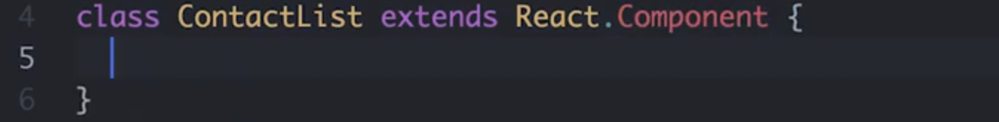

此类中，实际需要的唯一方法叫做 render，render 的工作是返回 JSX 或该组件渲染的元素。

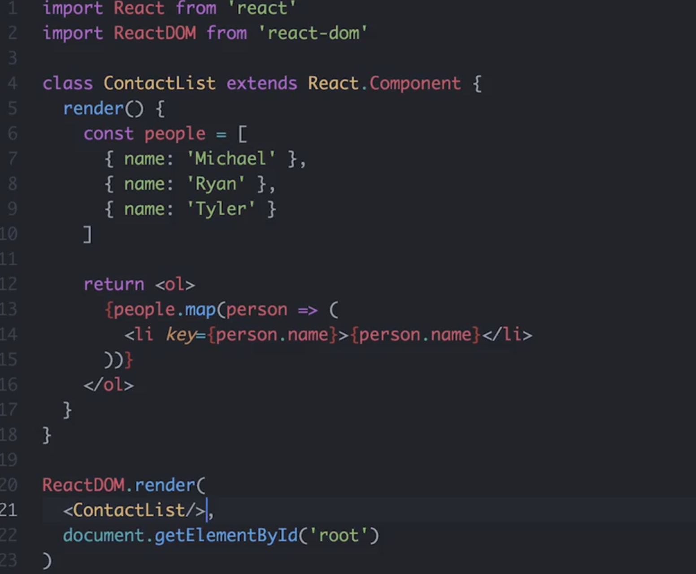

当我们渲染 ContactList 时，我们将渲染这整个 ol 以及其中的所有列表项，然后我们要渲染的不是这个元素，而是 ContactList 元素。而通过将所有这些元素组合到单个组件中，我们可以将它们视为单个元素来进行渲染

---

> ### 💡 在 React 中声明组件 💡
>
> 在上个视频中，我们按以下方式定义了 `ContactList` 组件：
>
> ```
> class ContactList extends React.Component {
> // ...
> }
> ```
>
> 换句话说，我们定义了一个其实是 JavaScript 类并且继承自 `React.Component`的组件。
>
> 在实际使用中（以及这门课程中），你可能还会看到下面的声明：
>
> ```
> class ContactList extends Component {
> // ...
> }
> ```
>
> 两种方法的功能是一样的，但是确保你的模块导入部分能匹配！即，如果你选择像第二个示例那样声明组件，则 `React` 导入应该如下所示：
>
> ```
> import React, { Component } from 'react';
> ```

## 创建元素总结

最后，记住 React 仅关心应用的 View 层级。这是用户能看见和互动的层级。因此，我们可以使用 `.createElement()` 向文档中渲染 HTML。但是更多时候，你将使用语法扩展来描述 UI 的外观应该如何。这种语法扩展称之为 JSX，看起来和编写在 JavaScript 文件中的普通 HTML 很像。JSX 编译为调用 React 的 `.createElement()` 方法，并输出要在浏览器中渲染的 HTML。

在构建 React 应用时一个便利的思维方式是[React理念](https://facebook.github.io/react/docs/thinking-in-react.html)|([翻译链接](https://doc.react-china.org/docs/thinking-in-react.html))。组件代表的是 React 的模块性和可重复利用性。可以将组件类看做生成组件实例的工厂。**这些组件类应该遵守[单一功能原则](https://zh.wikipedia.org/wiki/%E5%8D%95%E4%B8%80%E5%8A%9F%E8%83%BD%E5%8E%9F%E5%88%99)，只做一件事。如果管理太多不同的任务，建议将组件拆分为更小的子组件。**

课外资料：

- [元素渲染](https://facebook.github.io/react/docs/rendering-elements.html)|([翻译文档](https://doc.react-china.org/docs/rendering-elements.html)) React 文档