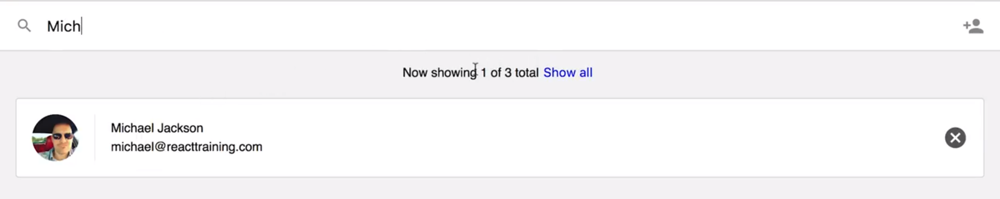
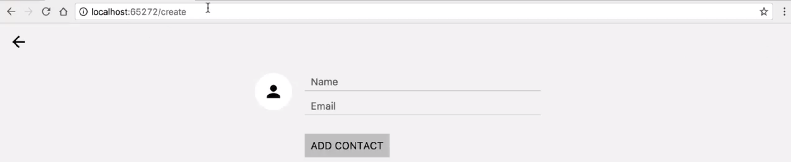
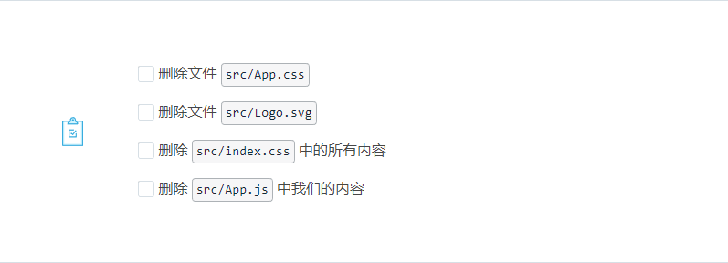
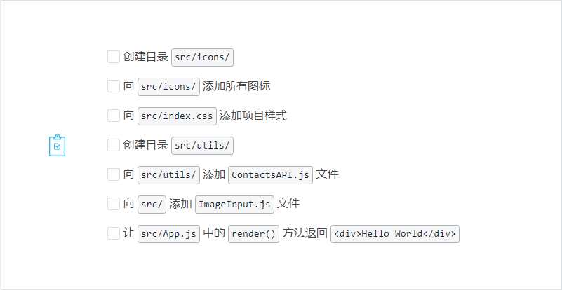
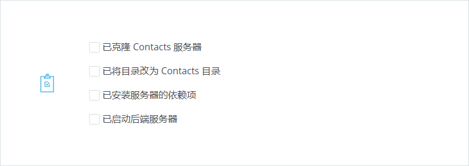

# 3.状态管理

> 你将学习如何向组件中传递数据、如何创建函数式组件、何时及如何使用 PropType、如何创建受控制的组件，以及它们提供的优势。

---

[TOC]

---

## 3.1 简介

我们来认识一下 React 的三个新概念。

- 它们是 Props，你可以通过它将数据传入组件中
- 函数式组件（Functional Components），它是可选的，并且是一种更加符合直觉的方式去创建 React 组件
- 受控组件（Controlled Components），它可以让你将应用中的表单连接到组件状态。

---

在开始构建应用之前，先介绍一下我们将要构建的应用。

**构建一个大型 React 应用的方法是先构建一堆较小的 React 组件，然后再将它们组合起来。**

所以向你展示这个应用，是想让你思考你会如何从组件层面来构建它。

这个应用的目的是让我们能够管理我们的联系人，你会注意到我们有三个不同的联系人，上面这里有搜索框，如何我们在这里输入内容，它会筛选联系人。

这里，我们还有这个部分，它能够重置搜索框，并使我们再次看到所有联系人。

你还会注意到这个图标，如你所料，它用于删除联系人，接着，如果我们点击这里这个图表，你会发现我们跳转到了 /create 路由下，所以我们也有路由（routing）。

在这里可以输入一个新的联系人，我们可以选择一个头像，一旦我们添加联系人后，我们会被带回至主页路由（home route），新添加的联系人就会显示在我们的联系人列表中。

---

### 删除默认文件

Create React App 将生成大量默认文件和起始代码，我们需要删掉它们。你需要作出两组更改，删除起始内容并且增加我们提供给你的文件。你可以自己手动删除。或者克隆 [此资源库](https://github.com/udacity/reactnd-contacts-complete) 并检出 `starter-files-added` 分支，它已经帮你删掉所有要删的文件。

如果你想删掉起始代码并手动添加我们的代码，直接操作即可。如果你决定克隆已经做出这些更改的资源库，请跳到此页面下面并设置后端服务器。

如果你想手动执行更改，那么第一步是删除 Create React App 添加的这些样板文件。请参阅 [此 commit](https://github.com/udacity/reactnd-contacts-complete/commit/b1959521da8d914374bd2a61b17e55088ffab9f5) 以了解具体说明。

删除一下一下内容：

### 我们的起始文件

在这门课程中，我们的重点是学习 React 和使用它来构建应用。我们不用太关心样式。但是，我们不希望看起来太糟糕，因此为你提供了一些样式和各种图标。 必要文件可以在 [此 commit](https://github.com/udacity/reactnd-contacts-complete/commit/6f38f078634d104a62e3024cab4cc2d592dd82f6) 中找到。请查看该 commit 中包含的文件路径，并作出相应的修改。如果你要克隆资源库，别忘了运行 `npm install` 以确保安装所有依赖项！

添加提供的内容： 

### 后端服务器

我们要构建的 Contacts 应用项目是一个前端项目。但是，我们最终会将通讯录存储在后端服务器上。因为在这门课程中，我们仅侧重于前端内容，因此我们将为你构建该服务器，使你能够只关注此课程的 React 部分。

服务器只是简单的 Node/Express 应用。该项目的资源库位于 <https://github.com/udacity/reactnd-contacts-server> 。你只需：

- 使用 `git clone https://github.com/udacity/reactnd-contacts-server.git` 克隆该项目
- 使用 `npm install` 安装项目依赖项
- 使用 `node server.js` 启动该服务器

启动服务器后，就不用管它了。我们将处理的 Contacts 项目将与此服务器互动，但是我们不会修改任何服务器代码。

> ## 💡 运行两个服务器💡
>
> 现在，你应该在你的本地机器上运行两个不同的服务器了：
>
> - 前端开发服务器：可以在 **端口 3000** 上访问（使用 `npm start` 或 `yarn start`）
> - 后端服务器：可以在 **端口 5001** 上访问（使用 `node server.js`）
>
> 在继续学习这节课之前，请确保这两个服务器都在运行。

为了确保我们处理的是相同的代码，请检查以下各项： 

