# 课程5：标签、分支和合并

> 能够在不受其他更改的影响下处理项目，将大大提高工作效率。你将学习如何利用 git 的分支实现这种隔离开发过程。

---

[TOC]


---


## 1. 简介

在本课中，我们将学习 git tag、git branch、git checkout、git merge。

- 使用 git tag 你可以为特定提交添加标签，标签是提交的额外标记，**可以<u>指示有用信息</u>**，比如这是 beta 版本。
- 使用 git branch 你可以创建分支，**用于并行开发项目的不同功能而不会对哪些提交属于哪个功能感到困惑。**
- 使用 git checkout 你可以在不同的分支和标签之间进行切换
- git merge 非常有用，你可以使用它将不同分支上的更改自动合并在一起

我们在本课中介绍的命令**可以帮助你保持项目的<u>有序性</u>并<u>加快开发速度</u>**


---


## 2. 标签

到目前为止，我们在这门课程中学习的都是具体的 git 命令。我们详细了解了这些命令的工作方式，以及在终端上运行这些命令后的输出结果。

**现在我们从宏观层面了解下 git 标签在仓库中的作用**。

---


让我们从头开始，因为学习最好**循序渐进**。

我们的项目包含几个文件，我们将这些文件一起添加并提交，就获得了 SHA。


现在，让我们给自己更多一点空间将其缩小并仅显示第一个字母，让我们再对项目进行一些更改并将其提交。


我们假设以 f 开头的最近一个提交是我们项目的 1.0 版本。如何在 git 中指出这一点呢？我们不想在提交说明说这样写，也许可以在提交说明的正文中列出这个，但这不是最理想的。

所以，我们可以使用标签（Tag）来表示。标签可以让你找到特定的提交，将它们与其他提交区分出来。我们可以使用像 v1.0 这样的标签。使用命令 `git tag -a v1.0`


让我们再添加一个提交，看到标签如何锁定于某个提交了吗？即使更多的提交被添加到仓库，标签仍然锁定于某个提交。


---


### 目前所处的位置

你可以在任一项目中执行这些步骤，我将在 `new-git-project` 项目中执行。

我们来看看该项目到目前为止的 git log 输出结果：

[*终端显示运行 git log --oneline 后的输出结果。*](https://classroom.udacity.com/courses/ud123/lessons/61776182-df3f-4767-9558-5d1591c1a709/concepts/f22ea0e4-4a68-4d3a-91c8-0c19915af71f#)

### git tag 命令

注意所显示的结果（只需注意 SHA 和 commit 消息）

我们将使用 `git tag` 命令与仓库的标签进行交互：

```
$ git tag -a v1.0
```

上述命令将打开代码编辑器，并等待你为标签输入信息。输入"Ready for content"怎么样？

[*代码编辑器正在等待提供标签信息。*](https://classroom.udacity.com/courses/ud123/lessons/61776182-df3f-4767-9558-5d1591c1a709/concepts/f22ea0e4-4a68-4d3a-91c8-0c19915af71f#)

> 注意：在上述命令 (`git tag -a v1.0`) 中，使用了 `-a` 选项。该选项告诉 git 创建一个带注释的标签。如果你没有提供该选项（即 `git tag v1.0`），那么它将创建一个轻量级标签。
>
> 建议使用带注释的标签，因为它们包含了大量的额外信息，例如：
>
> - 标签创建者
> - 标签创建日期
> - 标签消息
>
> 因此，你应该始终使用带注释的标签。

### 验证标签

保存并退出编辑器后，命令行上什么也不会显示。那么如何知道已经向项目中添加了标签呢？**只需输入 `git tag`，命令行会显示仓库中的所有标签。**

[*终端显示了 git tag 命令的输出结果，并列出了 v1.0 标签。*](https://classroom.udacity.com/courses/ud123/lessons/61776182-df3f-4767-9558-5d1591c1a709/concepts/f22ea0e4-4a68-4d3a-91c8-0c19915af71f#)

我们已经验证了该标签位于仓库中，但是我们想知道它位于仓库的哪个位置。为此，我们需要调用一直在使用的 `git log`！

### 习题 1/4

根据你对 `git log` 命令的了解，能在日志输出中看到标签吗？

- 是

- 否

  - 答对了，利用已有的知识暂时不会看到该标签。我们需要使用新的 `git log` 选项！ 

    

### git log 的 --decorate 选项

正如你所了解的，`git log` 是一个非常强大的工具，可以让我们查看仓库的 commit。我们已经学习了几个选项，现在该学习一个新的选项了。`--decorate` 选项将显示默认视图隐藏起来的一些详情。

马上去试试运行 `git log --decorate` 吧！

> #### 💡 Git 2.13 中 `--decorate` 选项的变化 💡
>
> 在 2.13 版 git 中，`log` 命令已改为自动启用 `--decorate` 选项。这意味着，你不需要在命令中包含 `--decorate` 选项，因为它已经自动包含了！因此下面的命令输出结果完全一样：
>
> ```
> $ git log --decorate
> $ git log
> ```
>
> 请参阅 [2.13 版本说明 - 英](https://github.com/git/git/blob/v2.13.0/Documentation/RelNotes/2.13.0.txt#L176-L177)。

[*终端显示了 git log --decorate 命令的输出结果。现在的日志输出显示了新建的标签。*](https://classroom.udacity.com/courses/ud123/lessons/61776182-df3f-4767-9558-5d1591c1a709/concepts/f22ea0e4-4a68-4d3a-91c8-0c19915af71f#)

标签信息位于第一行的末尾：

```
commit 6fa5f34790808d9f4dccd0fa8fdbc40760102d6e (HEAD -> master, tag: v1.0)
```

看见输出结果显示的 `tag: v1.0` 了吗？这就是标签！**标签与 commit 相绑定。因此，该标签与 commit 的 SHA 位于同一行。**

> #### HEAD -> master?
>
> 你是否注意到，日志中除了显示标签信息之外，`--decorate` 还显示了 `HEAD -> master`？**这是关于分支的信息！**接下来我们将了解 git 中的分支。

### 删除标签

如果将标签消息中的某个字打错了，或标签名称打错了（输入 `v0.1`，而不是 `v1.0`），如何修正这个错误？最简单的方法是删除这个标签并重新创建。

**可以通过输入 `-d` 选项 （表示 delete 删除！）加上标签名称来删除 git 标签**：

```
$ git tag -d v1.0
```

[*终端显示了使用 -d 选项删除某个标签。所运行的命令为 git tag -d v1.0。*](https://classroom.udacity.com/courses/ud123/lessons/61776182-df3f-4767-9558-5d1591c1a709/concepts/f22ea0e4-4a68-4d3a-91c8-0c19915af71f#)

### 习题 2/4

默认情况下，git 标签不会出现在日志中。哪一选项用于在 `git log` 的输出中显示标签信息？

- --show-tags
- --tags
- --display-all
- --decorate


### 习题 3/4

下面的哪个命令将删除标签 `v-1`？

- git tag --delete v-1
- git remove v-1
- git tag -d v-1
- git delete v-1


## 向以前的 commit 添加标签

运行 `git tag -a v1.0` 将为最近的 commit 添加标签。但是如果你想向仓库中很久之前的 Commit 添加标签呢？

只需提供要添加标签的 commit 的 SHA 即可！

```
$ git tag -a v1.0 a87984
```

（在弹出代码编辑器以便让你提供标签消息之后）此命令将向 SHA 为 `a87084` 的 commit 添加标签 `v1.0`。借助这一技巧，你可以为整个 git 仓库中的任何 commit 添加标签！很强大吧？并且只需在你已经知道的 git 标签命令中加上 commit 的 SHA 即可。

### 对以前的 commit 添加标签？

根据以下 `git log --oneline` 信息，要向提交说明为 "style page header" 的 commit 添加标签 `beta`，你会运行哪个命令？

```
2a9e9f3 add breakpoint for large-sized screens
137a0bd add breakpoint for medium-sized screens
c5ee895 add space around page edge
b552fa5 style page header
f8c87c7 convert social links from text to images
```

`git tag -a beta b552fa5`

### git tag 小结

总结下，**`git tag` 命令用来标记特定的 commit 。当添加新的 commit 时，标签不会移动**。

```
$ git tag -a beta
```

此命令将：

- 向最近的 commit 添加标签
- 如果提供了 SHA，则向具体的 commit 添加标签

### 深入研究

- git 基础知识 - 添加标签：[英](https://git-scm.com/book/en/v2/Git-Basics-Tagging)|[中](https://git-scm.com/book/zh/v2/Git-%E5%9F%BA%E7%A1%80-%E6%89%93%E6%A0%87%E7%AD%BE) git 图书
- [git tag - 英](https://git-scm.com/docs/git-tag) git 文档


---


## 3. 分支

现在该学习强大的分支功能了！git 中的分支非常灵活，使你能够实现一些很强大的功能。在详细了解一些具体的命令之前，我们先从宏观层面了解下什么是分支以及它们的工作方式。

---

这是我们在上节课中建立的示例 git 仓库，这个仓库中只有一些提交，其中一个提交上有一个标签。除了标签，还有一个分支，它一直是隐藏的，现在让我们来看看它。


默认的第一个分支名称是 master，这并不是什么特殊名称，它只是 git 提供的默认名称而已。


现在最酷的地方来了，当在仓库中进行提交时，该提交会被添加到分支上，分支指针也会移动并指向它。


很巧妙吧？相信你还记得，**标签是关联于某次提交的<u>永久指针</u>，它不会移动，**但**在添加新的提交时，分支却会移动。**

让我们在仓库中再添加一个分支，并将其成为  sidebar，使用命令 `git branch sidebar`。


为什么要这样做呢？

这是因为，分支非常强大，我们可以借助它在不同的隔离环境中对同一个项目进行操作，让我们集中精神，来看看它是如何工作的。

你可能会问的一个问题是，如果我们现在进行提交，哪个分支会移动呢？是 master 还是 sidebar？现在，我们需要揭示另一个隐藏的东西，那就是命名很奇怪的 **HEAD 指针**。

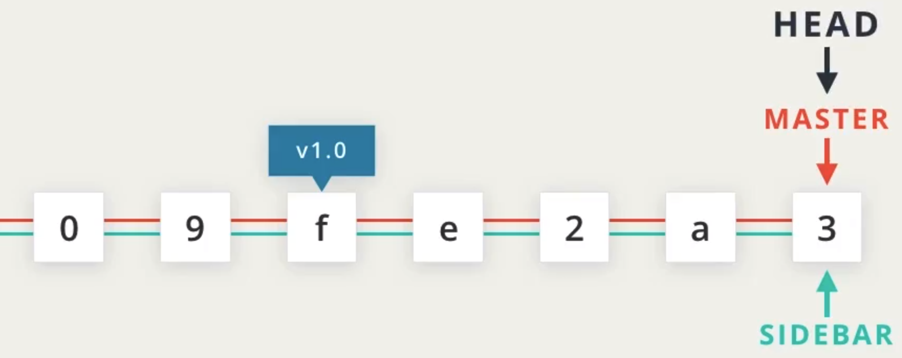

**它指向当前活跃的分支**，现在它指向 master 分支，因此 master 是活跃的分支。我们可以使用 checkout 命令来切换它所指向的分支。要切换到 sidebar 分支，需要使用命令 `git checkout sidebar`。让我们用 git checkout master 再切换回去。

如果我们现在进行提交，该提交就会被添加到 HEAD 所指向的分支，因为 HEAD 表示当前分支（即活跃分支）

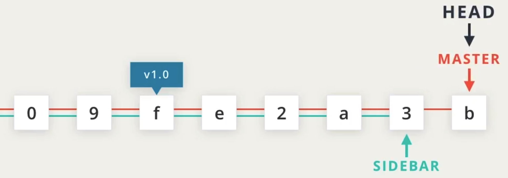

让我们切换到 sidebar 分支，并在那里添加一个提交。现在 HEAD 指向 sidebar，因此现在作出的提交将添加到 sidebar 分支。

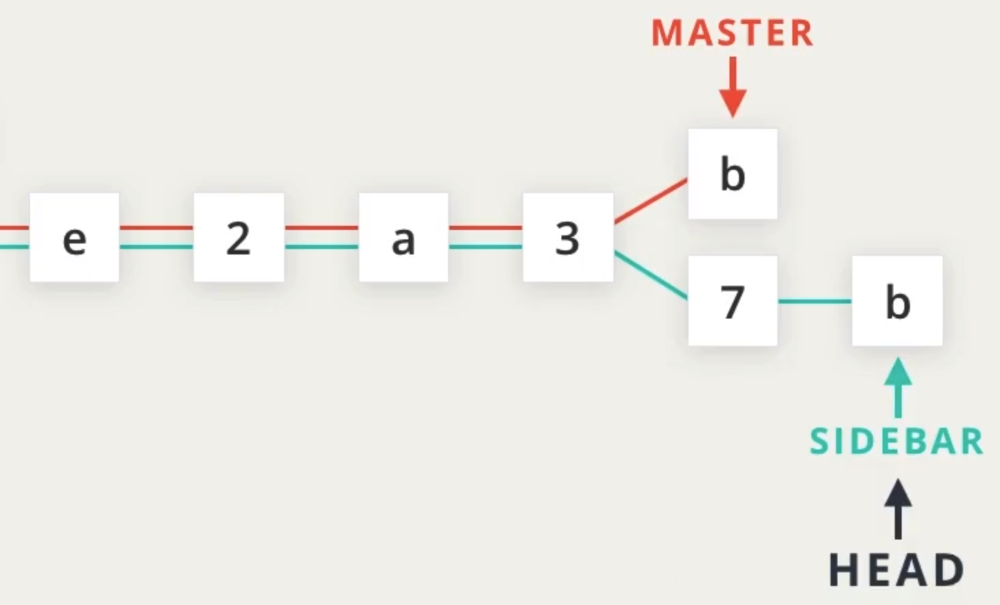

我们不仅可以拥有尽可能多的分支，还可以选择分支从哪里开始。

假设我们的标题存在问题，是在提交 a 中引入的，我们可以在那里使用 branch 命令创建一个新的分支，命令 `git branch header-fix a`使用 checkout 命令切换到它，命令 `git branch header-fix`。然后进行必要的修改来解决问题。


这里需要指出一个不容忽视的基本要点，让我们暂且切换回 master 分支并进行提交。这里的 master 一词表示分支的末端，但这个最近的提交与过去的提交相连，红线表示 master 分支中的所有提交。所以提交 7 和 b 不包括在 master 分支中。而且提交 f 和 4 也不在 master 分支中。所以，如果我们现在打开代码编辑器，我们对提交 f、4、7 和 b 所作的更改将不会出现在任何文件中。因为 git 仅显示了 master 分支中的更改。

但不用担心，这些提交都被安全地保存在仓库中。要将这些提交从仓库中调出，只需切换到我们想要查找的提交所在的分支即可。

例如，如果我们切换到 header-fix 分支，该分支所包含的提交就会出现在计算机的文件系统和代码编辑器中。

---


这就是分支的工作原理以及如何在分支之间切换的概述。其实你已经在命令行上见过 master 分支了。因为你在第一节课进行了文件设置，因此命令行中显示了当前分支。

[*终端在提示符中显示了当前分支。当前分支是"master"分支。*](https://classroom.udacity.com/courses/ud123/lessons/61776182-df3f-4767-9558-5d1591c1a709/concepts/89a3a3ca-c47d-4e5f-87c7-cbc838f62232#)

### `git branch` 命令

`git branch` 命令用来与 git 的分支进行交互：

```
$ git branch
```

它可以用来：

- 列出仓库中的所有分支名称
- 创建新的分支
- 删除分支

如果我们只输入 `git branch`，则 git 将列出仓库中的分支：

[*终端显示了 git branch 命令的输出结果，并显示了 master 分支。*](https://classroom.udacity.com/courses/ud123/lessons/61776182-df3f-4767-9558-5d1591c1a709/concepts/89a3a3ca-c47d-4e5f-87c7-cbc838f62232#)

### 创建分支

要创建分支，只需使用 `git branch` 并提供要创建的分支对应的名称。因此，如果你想创建一个叫做"sidebar"的分支，只需运行以下命令：

```
$ git branch sidebar
```

#### 习题 1/3

注意，仓库中有多个分支，但是提示符显示的是当前分支。

现在我们新建了"sidebar"分支，提示符会显示 `sidebar` 还是 `master`？

- sidebar
- master
  - 答对了！虽然你创建了 `sidebar` 分支，但是它还不是**当前分支**。你需要切换到该分支。 

### `git checkout` 命令

注意，在进行 commit 时，该 commit 将添加到当前分支上。虽然我们创建了新的 `sidebar` 分支，但是没有向其添加新的 commit，因为我们尚未切换到该分支。如果我们现在进行 commit 的话，该 commit 将添加到 `master`分支，而不是 `sidebar` 分支。我们已经在演示中看到这一情况，要在分支之间进行切换，我们需要使用 git 的 `checkout` 命令。

```
$ git checkout sidebar
```

请务必了解该命令的工作方式。运行该命令将：

- 从工作目录中删除 git 跟踪的所有文件和目录
  - (git 跟踪的文件存储在仓库中，因此什么也不会丢失)
- 转到仓库，并提取分支指向的 commit 所对应的所有文件和目录

因此此命令将删除 master 分支中的 commit 引用的所有文件。它会将这些文件替换为 sidebar 分支中的 commit 引用的文件。理解这一部分十分重要，所以请务必多读几遍工作方式。

有趣的是，`sidebar` 和 `master` 都指向同一 commit，因此当你在这两个分支之间切换时，看起来什么也没变。但是提示符现在会显示"sidebar"：

[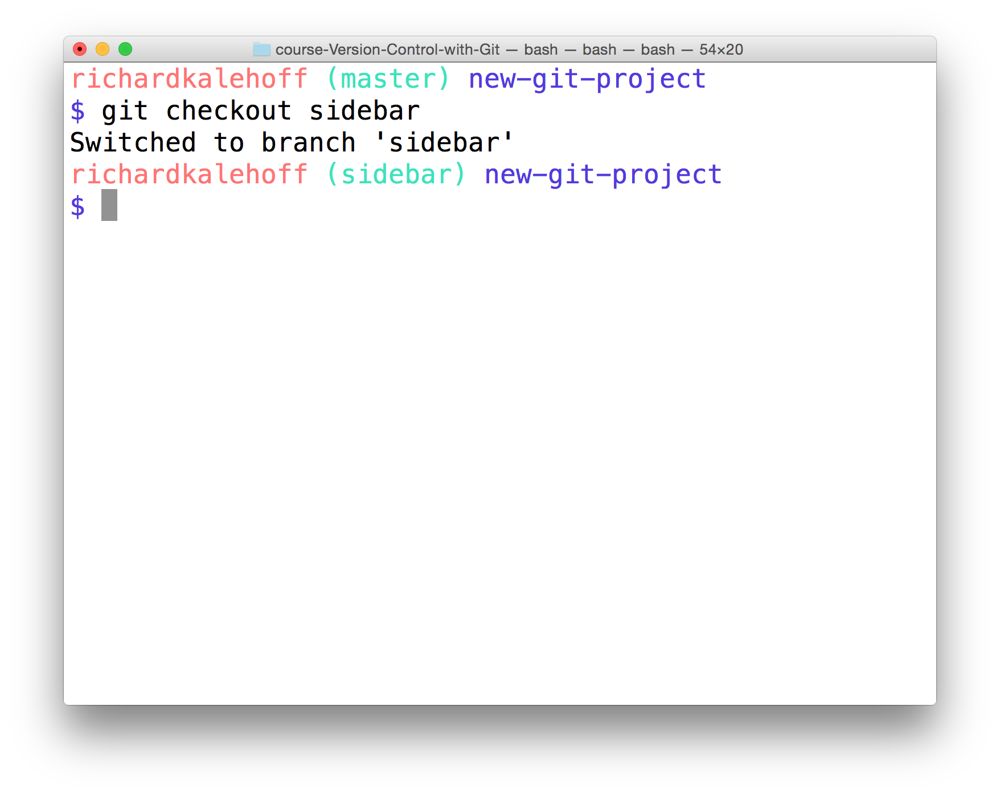*终端在提示符中显示了"sidebar"分支。*](https://classroom.udacity.com/courses/ud123/lessons/61776182-df3f-4767-9558-5d1591c1a709/concepts/89a3a3ca-c47d-4e5f-87c7-cbc838f62232#)

### 日志中的分支

提示符中的分支信息很有用，但是最清晰的查看方式是查看 `git log` 的输出结果。就像我们需要使用 `--decorate` 选项来显示 git 标签一样，我们也需要该选项来显示分支。

```
$ git log --oneline --decorate
```

我的日志输出结果如下所示（你的可能不太一样，取决于你提交的 commit）：

[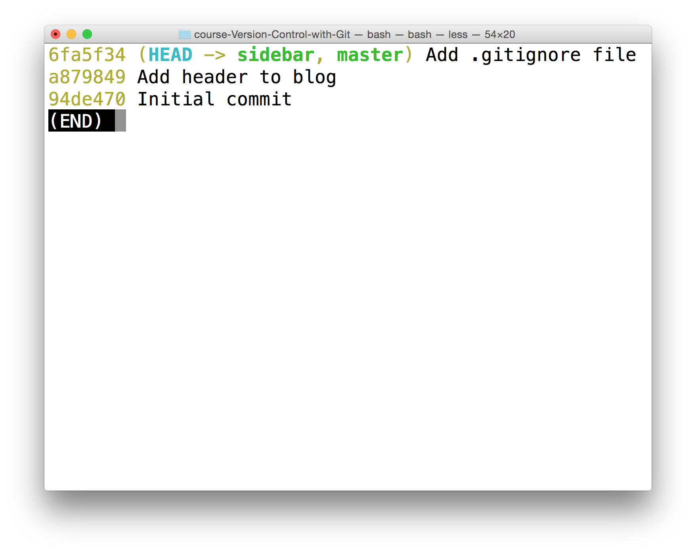*终端显示了 git log --oneline --decorate 命令的输出结果。单词"HEAD"具有一个指向"sidebar"的箭头，后者是当前分支。*](https://classroom.udacity.com/courses/ud123/lessons/61776182-df3f-4767-9558-5d1591c1a709/concepts/89a3a3ca-c47d-4e5f-87c7-cbc838f62232#)

在上述输出中，注意我们之前见到的特殊指示符"HEAD"具有一个指向 sidebar 分支的箭头。它指向 sidebar 是因为 sidebar 分支是当前分支，现在提交的任何 commit 将添加到 sidebar 分支。

### 活跃分支

提示符将显示活跃分支。但这是我们对提示符进行的特殊自定义，如果你使用的是不同的计算机，判断活跃分支的最快速方式是查看 `git branch` 命令的输出结果。**活跃分支名称旁边会显示一个星号**。

[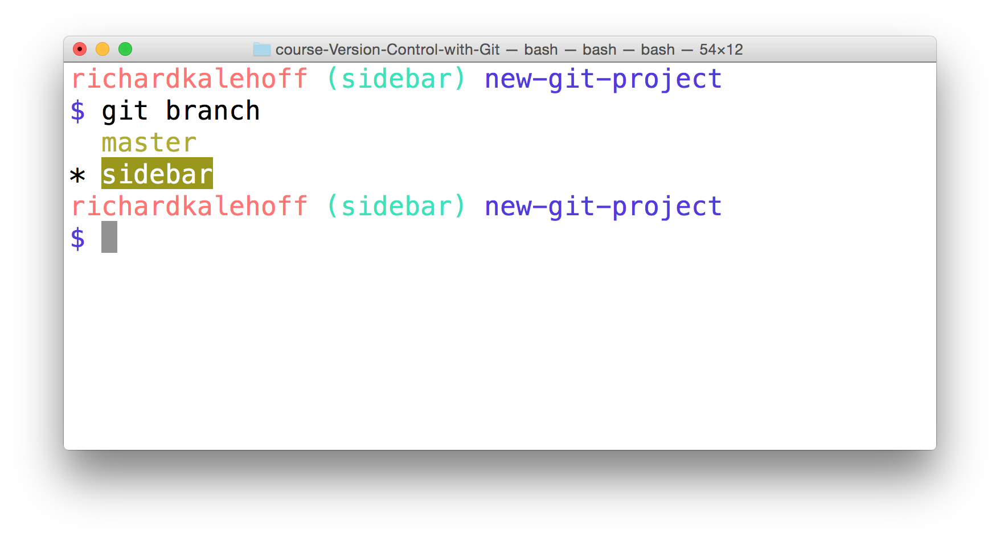*终端显示了 git branch 命令的输出结果。活跃分支（这里是 "sidebar"分支）旁边有一个星号。*](https://classroom.udacity.com/courses/ud123/lessons/61776182-df3f-4767-9558-5d1591c1a709/concepts/89a3a3ca-c47d-4e5f-87c7-cbc838f62232#)

#### 习题 2/3

根据你所掌握的 `git branch` 和 `git tag` 命令方面的知识，你认为下面的命令将有何作用？

```
$ git branch alt-sidebar-loc 42a69f
```

- 将创建一个 `alt` 分支，并且指向与 `master` 分支相同的 commit
- 将创建以下 3 个分支：`alt`、`sidebar`、`loc`
- 将使 master 分支移到 SHA 为 `42a69f` 的 commit 上
- 将创建 `alt-sidebar-loc` 分支并使其指向 SHA 为 `42a69f` 的 commit
  - 答对了！它创建了一个叫做 `alt-sidebar-loc` 的新分支，并使其指向 SHA 为 `42a69f` 的 commit。 


#### 哪个分支是活跃分支？

假设 `git branch` 的输出如下所示：

```
$ git branch
  barbara
* footer-fix
  master
  richard
  sidebar
  social-icons
```

哪个分支是活跃分支？


答对了。因为星号在 `footer-fix` 旁边，表明它是活跃分支。 


### 删除分支

**分支用来进行开发或对项目进行修正，不会影响到项目（因为更改是在分支上进行的）。**在分支上做出更改后，你可以将该分支组合到 `master` 分支上（这种“分支组合过程”叫做“合并”（merge），稍后将详细讲解）

**合并了分支的更改后，你可能不再需要该分支了。如果你想删除分支，可以使用 `-d` 选项。**下面的命令包含 `-d`选项，告诉 git 删掉给出的分支（这里是"sidebar"分支）。

```
$ git branch -d sidebar
```

**注意，无法删除当前所在的分支。因此要删除 `sidebar` 分支，你需要切换到 `master` 分支，或者创建并切换到新的分支。**

删除内容让人比较紧张。但是不用担心。如果某个分支上有任何其他分支上都没有包含的 commit（也就是这个 commit 是要被删除的分支独有的），git 不会删除该分支。如果你创建了 `sidebar` 分支，向其添加了 commit，然后尝试使用 `git branch -d sidebar` 删除该分支，git 不会让你删除该分支，因为你无法删除当前所在的分支。如果你切换到 `master` 分支并尝试删除 `sidebar` 分支，git 也不会让你删除，因为 `sidebar` 分支上的新 commit 会丢失！要强制删除，你需要使用大写的 D 选项 - `git branch -D sidebar`。

### git branch 小结

总结下，`git branch` 命令用来管理 git 中的分支：

```shell
# 列出所有分支

$ git branch


# 创建新的"footer-fix"分支

$ git branch footer-fix


# 删除"footer-fix"分支

$ git branch -d footer-fix
```

此命令用来：

- 列出本地分支
- 创建新的分支
- 删除分支

### 深入研究

- git 分支 - 分支的新建与合并：[英](https://git-scm.com/book/en/v2/Git-Branching-Basic-Branching-and-Merging)|[中](https://git-scm.com/book/zh/v2/Git-%E5%88%86%E6%94%AF-%E5%88%86%E6%94%AF%E7%9A%84%E6%96%B0%E5%BB%BA%E4%B8%8E%E5%90%88%E5%B9%B6) git 文档
- [了解 git 分支](http://learngitbranching.js.org/)
- [git 分支教程](https://www.atlassian.com/git/tutorials/using-branches) Atlassian 博客(**英**)


---


## 4. 高效分支

你已经学会了如何创建、列出和删除分支，我们来运用下所学的知识吧！

首先，确保我们保持相同的进度，并拥有相同的起始代码。我们将在 `new-git-project` 项目中进行操作。该项目具有以下文件：

- `index.html`
- `css/app.css`（空文件）
- `js/app.js`（空文件）

CSS 和 JavaScript 文件是空的。确保 index 文件具有以下内容：

```html
<!doctype html>
<html lang="en">
<head>
    <meta charset="utf-8">
    <title>Blog Project</title>
    <meta name="viewport" content="width=device-width, initial-scale=1">
    <meta name="description" content="">
    <link rel="stylesheet" href="css/app.css">
</head>
<body>

    <header>
        <h1>Expedition</h1>
    </header>

    <div class="container">
        <main>

        </main>
    </div>

    <footer>
        Made with ♥ @ Udacity
    </footer>
    <script src="js/app.js"></script>
</body>
</html>
```

### 项目设置完毕

##### 在继续之前，确保我们的设置保持一致。请检查以下各项：

Task List

- 我有一个包含上述起始代码的 `index.html` 文件
- 我在 `css` 目录中有一个 `app.css` 文件
- 我在 `js` 目录中有一个 `app.js` 文件
- 所有文件已被保存
- 所有文件已暂存并提交至仓库
- 当前分支是 `master` 分支
- 我已删除所有其他分支
- 在命令行上运行 `git status` 后的输出结果包括 `working directory clean`

### 策略

现在，所有代码都位于 `master` 分支（默认分支）上。我们通过以下操作利用分支进行工作：

- 向分支中添加内容
- 创建新的分支
- 在分支之间切换

让我们使用分支完成以下更改：

1. 在 master 分支上 - 向页面添加默认颜色
2. 创建一个 sidebar 分支 - 为页面创建侧栏
3. 在 master 分支上 - 更改页面的标题
4. 在 sidebar 分支上 - 向侧栏中添加更多内容
5. 创建一个 footer 分支 - 向脚注中添加社交链接

### 更改 1 - 添加页面颜色

确保位于 `master` 分支上，并向 `css/app.css` 添加以下内容：

```
body {
    background-color: #00cae4;
}
```

保存文件，然后将该文件添加到暂存区，并将其 commit 到仓库。

[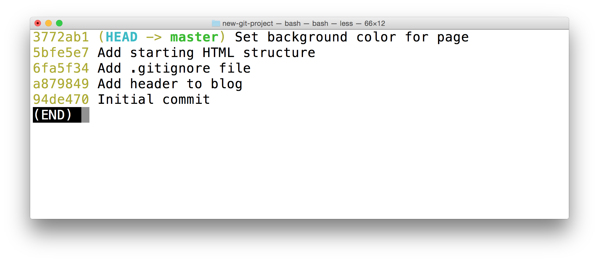*终端显示了 git log --oneline --decorate 命令的输出结果。最近的 commit 向页面上添加了默认背景色。*](https://classroom.udacity.com/courses/ud123/lessons/61776182-df3f-4767-9558-5d1591c1a709/concepts/b86879e8-45d6-4600-94f2-a11564e7d1f8#)

## 更改 2 - 添加侧栏

我们向页面上添加一个侧栏。但是假定我们不确定是否喜欢新的背景色。因此我们要将 sidebar 分支放在设置页面颜色的 commit 之前。你的 SHA 可能会不一样，但对我来说，在添加颜色的 commit 之前的 commit 具有 SHA `5bfe5e7`。因此向该 commit 添加分支的命令是：

```
$ git branch sidebar 5bfe5e7
```

现在使用 `git checkout` 命令切换到新的 `sidebar` 分支。运行 `git log --oneline --decorate` 显示以下结果：

[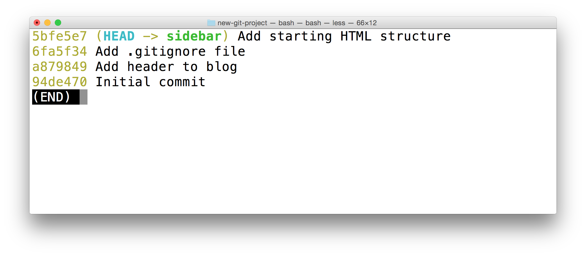*终端显示了 git log --oneline --decorate 的输出结果。输出结果\**不**包含 master 分支 - 它消失了。*](https://classroom.udacity.com/courses/ud123/lessons/61776182-df3f-4767-9558-5d1591c1a709/concepts/b86879e8-45d6-4600-94f2-a11564e7d1f8#)

你是否注意到 `master` 分支没有显示在输出结果中？它去哪了？丢失了？别担心，它还在那儿，稍后我们将了解如何显示该分支。

但首先，在代码编辑器中切换到 `app.css` 文件。注意它没有我们之前输入的 CSS！因此，如果你在浏览器中加载该项目，页面将没有背景色。这很正常，因为 CSS 文件是空的，但是你知道为什么吗？

#### 习题 1/2

回忆下上节课的分支仓库视频，为何 CSS 文件是空的？

- 内容已被清除。
- 内容存储在另一个分支上。
  - 对
- 内容在需要保存的临时文件上。
- 被熊吃了。


---


在开始使用分支时，这是急需要重点理解的内容。

如果内容存储在一个分支上，而它们的提交在另一个分支上。这些另外的提交是不可见的，除非我们切换到另一个分支上。

当我们切换后，就会看到这些提交，但原来的提交将不再显示在代码编辑器中。它们并没有丢失，只是因为我们切换到了一个不同的分支，它们就不再显示了而已。

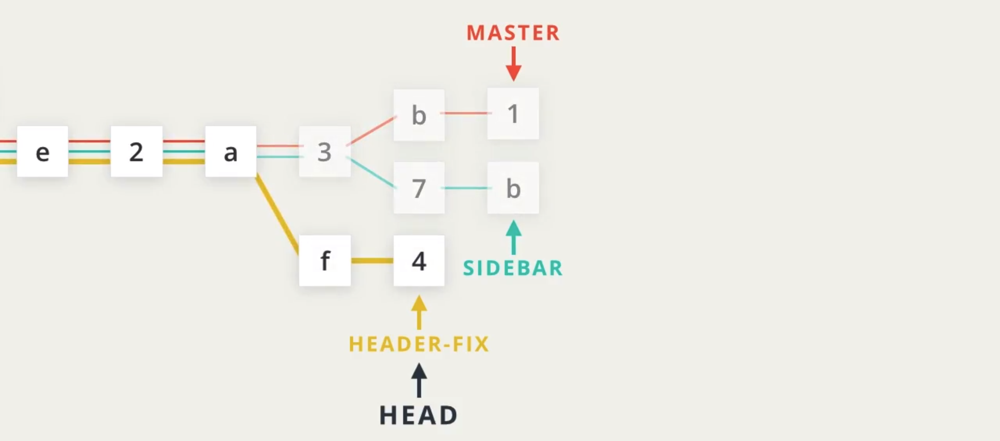


---


通过向 HTML 文件添加以下 `<aside>` 代码添加一个侧栏：

```html
<div class="container">
    <main>

    </main>
</div>

<!-- start of new content -->
<aside>
    <h2>About Me</h2>

    <p>Lorem ipsum dolor sit amet, consectetur adipisicing elit. Eos, debitis earum molestias veniam suscipit aliquam totam exercitationem tempore neque vitae. Minima, corporis pariatur facere at quo porro beatae similique! Odit.</p>
</aside>
<!-- end of new content -->

<footer>
    Made with ♥ @ Udacity
</footer>
```

我将 `<aside>` 内容添加到 `<main>` 元素旁边，作为 `<div class="container">` 元素的子级。

你可以在 `<aside>` 元素中添加任何内容！

> ### ⚠️ 请勿更改 CSS
>
> 警告：千万不要更改 CSS 文件。
>
> 稍后我们将更改该文件，但是暂时请勿更改，否则会出现“合并冲突”（merge conflict）。稍后我们将手动操作出合并冲突，但是现在我们还不想有冲突，因此暂时不要更改 CSS 文件。

##### 这一步已经操作完毕，可以 commit 任何更改了。

Task List

- 我已经保存 `index.html`
- 我已经暂存 `index.html`
- 我已经将 `index.html` commit 到仓库

## 更改 3 - 更改 master 上的标题

切换到 master 分支并更新页面标题。

使用 `git checkout` 命令切换到 `master` 分支。（注意，新的侧栏的 HTML 不在了！因为所有代码都妥善地保存在 `sidebar` 分支上。）

现在将页面的 `<h1>` 标题从"Expedition"改为其他内容。要不改为吸引人的"Adventure"？！

#### 习题 2/2

小练习时间！如何让 git 显示你已经保存但是尚未 commit 的更改？

- git show --diff
- git log -p
- git diff
  - 答对了。`git diff` 命令将显示尚未 commit 的更改。 
- git log --stat


标题更改已被保存并 commit

现在该保存 `index.html` 文件并进行 commit 以将此更改添加到仓库中。（我使用了 commit 消息"Improve site heading for SEO"，但是你也可以想一个更好的消息）

Task List

- 我已经保存 `index.html`
- 我已经暂存 `index.html`
- 我已经将 `index.html` commit 到仓库

### 更改 4 - 向侧栏中添加更多内容

切换到 `sidebar` 分支（注意，我们添加到 `master` 分支的内容在 `sidebar` 分支上不可见）。

现在，在 `<aside>` 元素中添加一些内容。添加一些个人信息，例如你喜欢的电影或书籍（我最喜欢的是《指环王》！）。任何内容都可以，只需添加一些内容。

同样确保不要更改 CSS 文件。

保存 `index.html` 文件并提交 commit。

### 更改 5 - 向脚注中添加社交链接

我们已经做出了好几个更改，下面要进行最后一项更改了。我们向页面脚注中添加一些社交图标。为了加以区分，我们在基于 `master` 分支的新 footer 分支上做出这一更改，因此需要先创建一个新的 `footer` 分支。

> #### 💡 用一个命令切换并创建分支💡
>
> 目前，我们处理分支的方式是使用 `git branch` 命令创建一个分支，然后使用 `git checkout` 命令切换到这个新建的分支。
>
> 但是你知道吗？`git checkout` 命令也可以创建一个新的分支。如果你添加 `-b` 选项，则能够用一个命令创建分支并切换到该分支。
>
> ```
> $ git checkout -b richards-branch-for-awesome-changes
> ```
>
> 这是一个很实用的命令，我经常会用到它。

我们使用新的 `git checkout` 命令来创建新的 `footer` 分支并让此 footer 分支的起点位置与 master 分支的一样：

```
$ git checkout -b footer master
```

现在如果运行 `git log --oneline --decorate`，应该能看到以下结果（你的 commit 消息可能不一样）：

[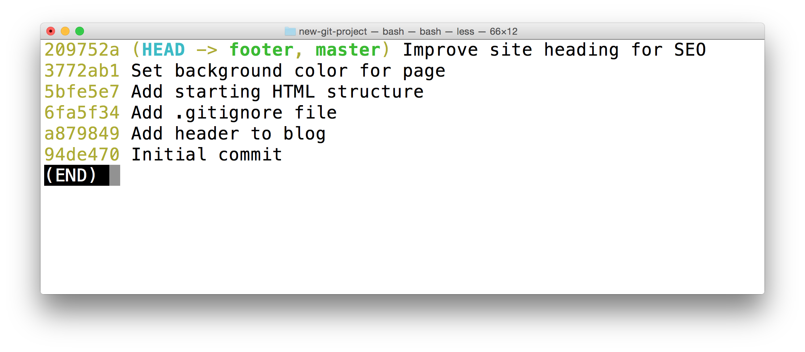*终端显示了 git log --oneline --decorate 的输出结果。特殊的 HEAD 指针指向 footer 分支。footer 分支与master 分支位于同一 commit 上。*](https://classroom.udacity.com/courses/ud123/lessons/61776182-df3f-4767-9558-5d1591c1a709/concepts/b86879e8-45d6-4600-94f2-a11564e7d1f8#)

### 添加社交链接

现在我们已经位于新分支上，我们向页面脚注中添加一些社交链接。我添加了以下内容：

```html
<footer>
    <!-- start of new content -->
    <section>
        <h3 class="visuallyhidden">Social Links</h3>
        <a class="social-link" href="https://twitter.com/udacity">
            
        </a>
        <a class="social-link" href="https://www.instagram.com/udacity/">
            
        </a>
        <a class="social-link" href="https://plus.google.com/+Udacity">
            
        </a>
    </section>
    <!-- end of new content -->
</footer>
```

你也可以添加你自己的社交帐户链接。

##### 现在保存文件并提交 commit。（我使用了 commit 消息"Add links to social media"，当然你也可以想出更好的消息）

Task List

- 我已经保存 `index.html`
- 我已经暂存`index.html`
- 我已经 `index.html` commit 到仓库

### 同时查看所有分支

我们已经做出了所有需要做出的更改！很棒！

我们已经在三个不同的分支上进行了多项更改。我们在 `git log` 输出结果中看不到其他分支，触发切换到某个分支。如果能在 `git log` 输出结果中看到所有分支，是不是很棒？

你到现在为止已经知道，`git log` 命令非常强大，可以显示此信息。我们将使用新的 `--graph` 和 `--all` 选项：git 

```
$ git log --oneline --decorate --graph --all
```

`--graph` 选项将条目和行添加到输出的最左侧。显示了实际的分支。`--all` 选项会显示仓库中的所有分支。

运行此命令将显示仓库中的所有分支和 commit：

[*终端显示了 git log --oneline --graph --decorate --all 的输出结果。它会显示仓库中的所有分支，以及所有 commit。*](https://classroom.udacity.com/courses/ud123/lessons/61776182-df3f-4767-9558-5d1591c1a709/concepts/b86879e8-45d6-4600-94f2-a11564e7d1f8#)

## 更改小结

我们做出了以下更改：

1. 我们在 master 分支上向页面添加了默认颜色
2. 我们创建了 sidebar 分支并为侧栏添加了代码
3. 我们在 master 分支上更改了页面的标题
4. 我们在 sidebar 分支上向侧栏添加了更多内容
5. 我们创建了 footer 分支并向脚注中添加了社交链接

这些更改都发生在不同的分支上。让我们用 git 合并所有这些更改吧。将分支组合到一起称为**合并**（merge）。

---

## 5. 合并

注意，**主题分支（例如 `sidebar`）的作用是让你做出不影响 `master` 分支的更改。**当你在主题分支上做出更改后，如果觉得不想要该分支上的更改，则可以删掉该分支，或者你决定要保留更改，则可以将该分支上的更改与其他分支上的更改合并。

将分支组合到一起称为**合并**。

git 可以自动将不同分支上的更改合并到一起。这种分支和合并功能正是 git 的强大之处！你可以在分支上做出小的或大的更改，然后使用 git 合并这些更改。

我们来看看理论原理。注意 git 中的两种合并：**普通合并**和**快进合并**。

---

这是我们的假象项目，拥有不同的分支。

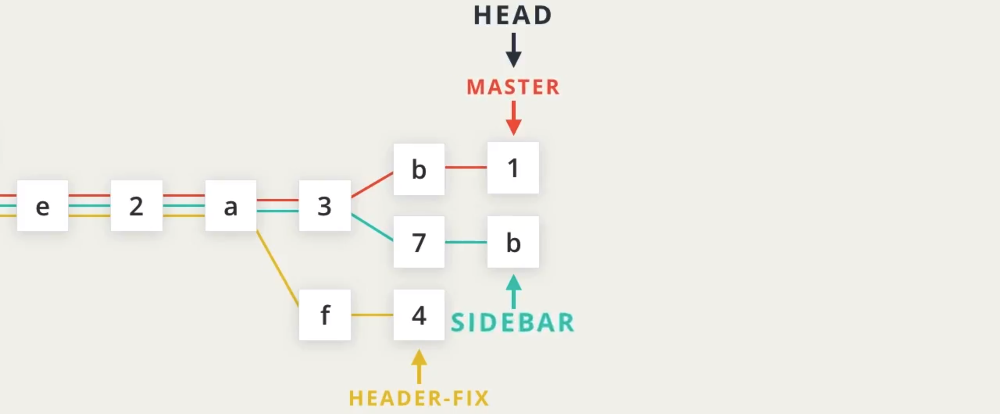

假设我们要将 master 和 sidebar 分支合并（merge）起来，当合并发生时，它会进行提交。由于 HEAD 指向 master 分支，合并提交将被放置在 master 分支上，它将向前移动。

使用命令 `git merge sidebar` 将 sidebar 合并到 master。

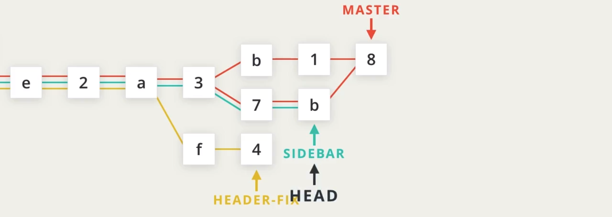

请注意，合并提交连接两个不同的较早提交，这不会影响 sidebar 分支。我们可以使用 `git checkout sidebar` 切换到它，仍然对其进行提交。

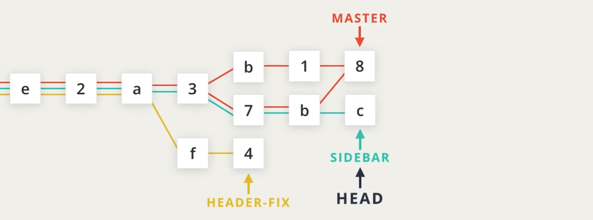

让我们使用 `git checkout master` 再切换到 master 分支 。

假设我们有一个 social-links 分支比 master 分支靠前一点，master 分支中尚不包含 social-links 提交。如果我们想将这些提交纳入 master 分支，就需要将 social-links 分支并入 master 分支。

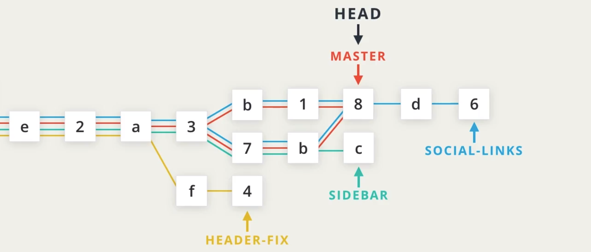

由于 HEAD 指向 master 分支，进行合并后 master 分支将会移动。而且，由于 social-links 分支比 master 靠前，Git 会做出一个所谓的“快速合并”。此外，彩色线条的顺序在这里并不重要，我们可以将红线移动到顶端，且不会造成任何影响。这些线条只是为了连接提交而已。

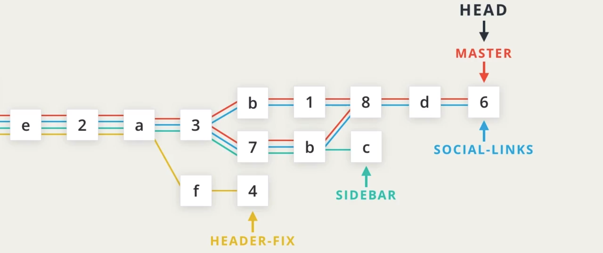

---

### 快速检查

##### 我们快速检查下我们的起点是否一样。请检查以下各项：

Task List

- 我位于 `new-git-project` 项目中
- 我已检出 `master` 分支
- `git status` 的输出结果包括文本 `working directory clean`

> #### ⚠️ 了解分支 ⚠️
>
> 当你要合并分支时，务必知道当前位于哪个分支上。注意，**合并分支会提交 commit**。
>
> 现在我们不知道如何撤消更改。下节课将介绍这一技巧，但是如果你在错误的分支上进行了合并，可以使用以下命令撤消合并：
>
> `git reset --hard HEAD^`
>
> （确保包含 `^` 字符！它属于“相对 commit 引用”并表示“父 级 commit”。我们将在下节课学习相对 commit 引用。）

### 合并指令

`git merge` 指令用来合并 git 分支：

```
$ git merge <name-of-branch-to-merge-in>
```

发生合并时，git 将：

- 查看将合并的分支
- 查看分支的历史记录并寻找两个分支的 commit 历史记录中都有的单个 commit
- 将单个分支上更改的代码行合并到一起
- 提交一个 commit 来记录合并操作

### 快进合并

在我们的项目中，我们检出了 `master` 分支，我希望它拥有 `footer` 分支上的更改。用语言描述的话就是“我想要合并 `footer` 分支。”。注意表述“合并…”；在进行合并时，另一个分支上的更改将出现在当前检出的分支上。

我再强调下，当我们合并时，我们将其他分支合并到当前（检出的）分支上。我们不是将两个分支合并到一个新的分支上。也不是将当前分支合并到其他分支上。

因为 `footer` 直接在 `master` 前面，因此这种合并最简单。将 `footer` 合并到 `master` 中将导致**快进合并**（Fast-forward merge）。快进合并将使当前检出的分支向前移动，直到它指向与另一个分支（这里是 `footer`）指向的 commit 一样为止。

要合并 `footer` 分支，运行：

```
$ git merge footer
```

在运行该命令后，我的终端显示结果如下所示：

[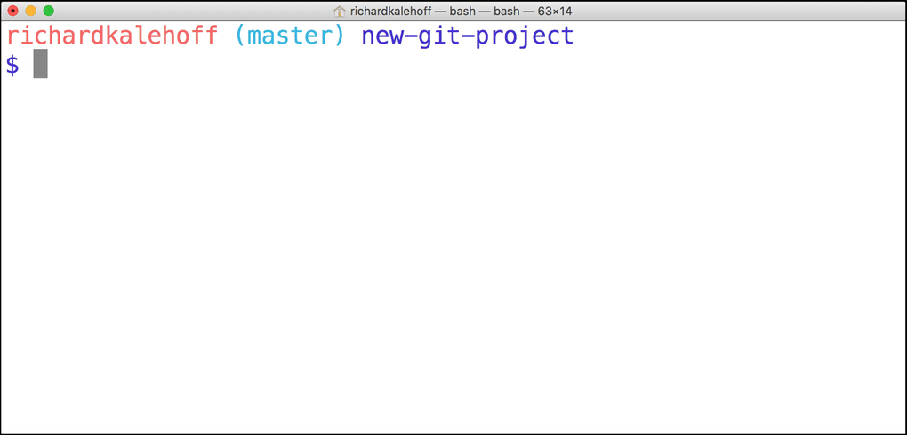*终端显示了将 footer 分支合并到 master 分支后的结果。*](https://classroom.udacity.com/courses/ud123/lessons/61776182-df3f-4767-9558-5d1591c1a709/concepts/3a831268-c6c7-4d10-a755-37e1232a2b4c#)

### 习题 1/2

再看看仓库，现在你已经将两个分支合并到一起了。`master` 分支和 `footer` 分支指向同一 commit 吗？

- 是
- 否


### 进行普通合并

终于完成快进合并流程了！也没那么难，对吧？

但是你可能会说“当然简单了，所有 commit 都已经在那，**分支指针只是向前移动了**！”…说的对，这是最简单的合并。

现在我们将进行更常见的合并，其中两个分支完全不一样。你会惊讶地发现，实际合并 `sidebar` 这样的独特分支，操作是完全一样的！

要合并 `sidebar` 分支，确保你位于 `master` 分支上，并运行：

```
$ git merge sidebar
```

**因为合并的是两个完全不一样的分支，因此将提交 commit**。在进行 commit 时，需要提供 commit 消息。因为这是合并 commit，因此已经提供了默认消息。你也可以更改消息，但通常都会直接使用默认的合并 commit 消息。因此当你的代码编辑器打开并包含该消息时，直接关闭编辑器以确认使用该 commit 消息。

在使用默认 commit 消息后，我的终端如下所示：

[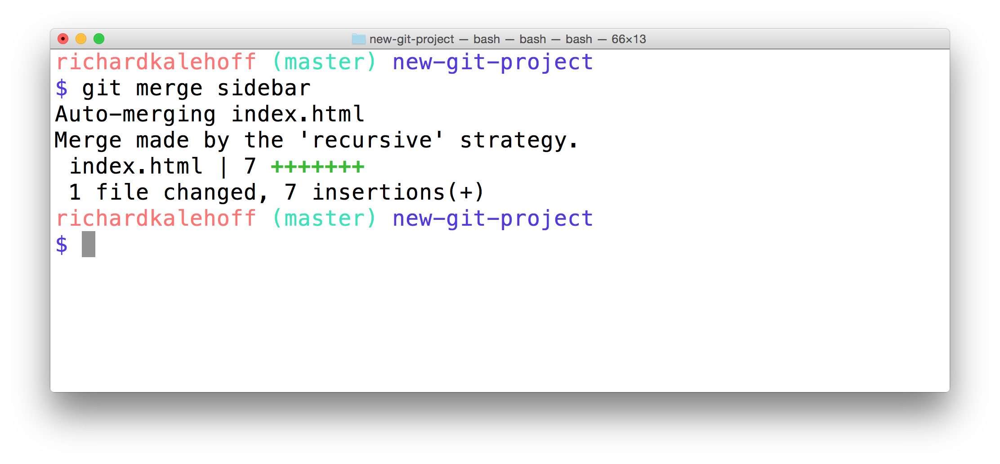*终端显示了合并 sidebar 分支后的结果。*](https://classroom.udacity.com/courses/ud123/lessons/61776182-df3f-4767-9558-5d1591c1a709/concepts/3a831268-c6c7-4d10-a755-37e1232a2b4c#)

就这么多合并操作！很简单吧？你可能读过很多让分支和合并显得非常复杂的文档，但实际上并没有那么难。

### 习题 2/2

现在做个简短的小练习，看看你是否理解了合并的操作原理。

假设某个仓库有以下 4 个分支：

- master
- allisons-mobile-footer-fix
- nav-updates
- jonathans-seo-changes

`master` 和 `allisons-mobile-footer-fix` 上的更改需要合并到一起。如果 HEAD 指向 `allisons-mobile-footer-fix`，在进行合并时，哪个分支将移动？

- master
- allisons-mobile-footer-fix
  - 特殊的 `HEAD` 指针所指向的分支将具有合并 commit。 
- nav-updates
- jonathans-seo-changes


### 如果合并失败了呢？

我们刚刚执行的合并能够成功合并。git 能够灵活地合并不同分支上的大量工作。但是，有时候也无法合并分支。如果在进行合并时失败了，则称为**合并冲突（merge conflict）**。我们将在下节课了解合并冲突及其背后的原因，并学习如何解决冲突。

### 合并小结

总结下，`git merge` 命令用来在 git 中合并分支：

```
$ git merge <other-branch>
```

合并有以下两种类型：

- 快进合并 – 要合并的分支必须位于检出分支前面。检出分支的指针将向前移动，指向另一分支所指向的同一 commit。
- 普通类型的合并
  - 两个完全不同的分支被合并
  - 创建一个合并 commit

### 深入研究

- 分支合并：[英](https://git-scm.com/book/en/v2/Git-Branching-Basic-Branching-and-Merging#Basic-Merging)|[中](https://git-scm.com/book/zh/v2/Git-%E5%88%86%E6%94%AF-%E5%88%86%E6%94%AF%E7%9A%84%E6%96%B0%E5%BB%BA%E4%B8%8E%E5%90%88%E5%B9%B6) git 图书
- [git-merge](https://git-scm.com/docs/git-merge) git 文档 (**英**)
- [git 合并](https://www.atlassian.com/git/tutorials/git-merge) Atlassian 博客 (**英**)

---

## 6. 合并冲突

### 有时候合并会失败

大部分情况下，git 将能够成功地合并分支。但是，有时候 git 无法完全自动地进行合并。合并失败时，就称为**合并冲突**。

如果出现合并冲突，git 将尝试尽可能合并多的内容，然后将留下特殊选项（例如 `>>>` 和 `<<<`），告诉你（没错，告诉作为程序员的你！）需要从何处手动修复。

#### 什么导致了合并冲突

正如你所知道的，git 会跟踪文件中的代码行。**如果完全相同的行在不同的文件中更改了，将产生合并冲突。**例如，如果你在 `alternate-sidebar-style` 分支上并将侧栏的标题改为"Information About Me"，git 应该选择哪个标题？你在两个分支上都更改了标题，因此 git 根本不知道你要保留哪个标题。它肯定不会随机选择一个标题！

我们来人为制造一个合并冲突，学习如何解决这种冲突。当你学会了后，就非常简单!**当 git 不确定你要使用即将合并的分支中的哪些行时，就会出现合并冲突。因此我们需要在两个不同的分支上修改同一行，然后重设合并它们。**

### 人为制造合并冲突！

当同一行在两个分支中都更改了时，就会出现合并冲突。我们在两个不同的分支上更改同一页面的标题：

- 更改 `master` 分支上的标题
- 在最近修改 `master` 分支的 commit 前面创建一个 `heading-update` 分支
- 更改同一标题
- 切换到 `master` 分支
- 合并 `heading-update` 分支

#### 在分支上更改标题 1

因为 `master` 分支就像所有其他分支一样，也是个普通分支，我们在 `master` 分支上更改标题。将 `<h1>` 标题改为其他内容。对我来说，标题当前在第 13 行是"Adventure"，我将其改为"Quest"。

做出更改后，保存文件并 commit 到仓库。

#### 在分支上更改标题 2

现在我们需要创建不同的分支并在该分支上更新标题。

现在要注意的是，我们需要创建一个不是从 master 分支上分叉的分支。**如果我们在从 master 分支上分叉的分支上做出更改，那么该更改将在此更改前面，git 将直接使用该更改，而不是使用我们刚刚在 `master` 上做出的更改。**因此我们需要将该分支“放在过去”。

我们创建一个位于最近 commit 之前的 commit 上的分支。使用 git log 获取上一个 commit 的 SHA，并在该 commit 上创建一个分支。在创建 `heading-update` 分支后，我的 git log 输出结果如下所示：

[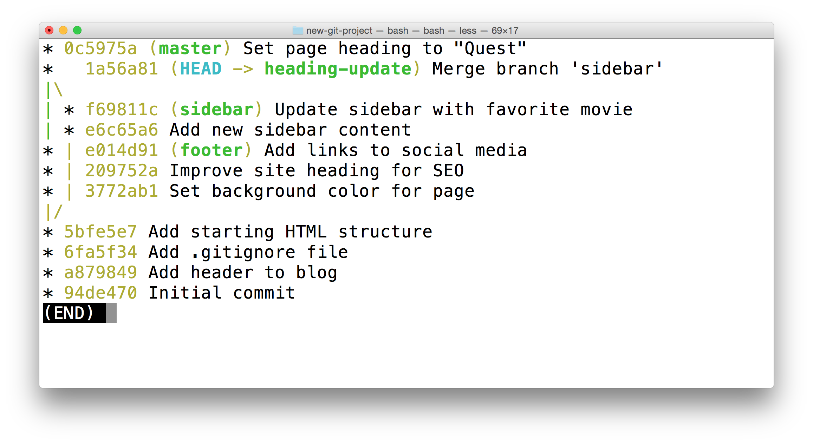*终端显示了 git log --oneline --decorate --graph --all 的输出结果。当前被检出的分支为 heading-update。*](https://classroom.udacity.com/courses/ud123/lessons/61776182-df3f-4767-9558-5d1591c1a709/concepts/84037f3a-2ba6-4317-a705-4dc5f342295e#)

现在已经创建好分支，我们只需再次更新标题。确保更改在 `master` 分支上做出更改的同一行。我将第 13 行的"Adventure"改为"Crusade"。

然后保存文件，并将文件 commit 到仓库。

[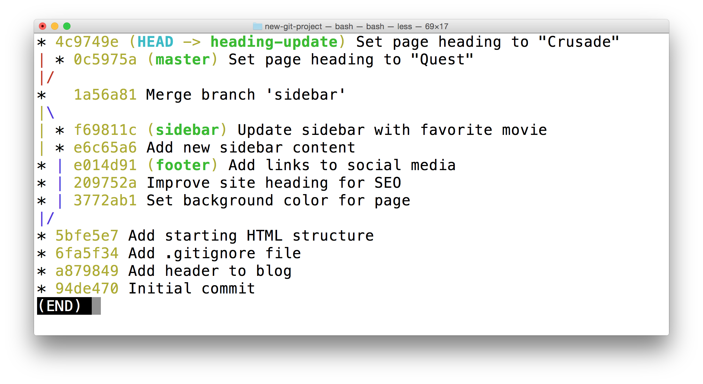*终端显示了 git log --oneline --decorate --graph --all 的输出结果。master 分支和 heading-update 分支都更改了同一文件的同一行。*](https://classroom.udacity.com/courses/ud123/lessons/61776182-df3f-4767-9558-5d1591c1a709/concepts/84037f3a-2ba6-4317-a705-4dc5f342295e#)

### 准备合并冲突

##### 我们即将导致合并冲突，确保你的进度和我的一样：

Task List

- 我在 `master` 分支上做出了更改标题的 commit
- 我在 `heading-update` 分支上做出了同样更改标题的 commit
- 我目前位于 `master` 分支上che

确保你位于 master 分支（我们也可以在另一分支上操作，但是我习惯将 `master` 分支作为主分支，让另一个分支合并到该分支上）上，并合并 `heading-update` 分支：

```
$ git merge heading-update
```

你应该看到以下结果：

[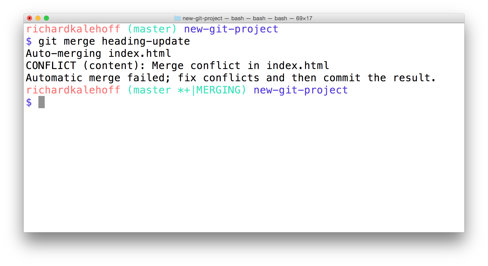*终端显示了导致合并冲突的合并输出结果。出现单词"CONFLICT"，并且指出 index.html 文件中出现合并冲突。*](https://classroom.udacity.com/courses/ud123/lessons/61776182-df3f-4767-9558-5d1591c1a709/concepts/84037f3a-2ba6-4317-a705-4dc5f342295e#)

### 合并冲突输出结果解释

终端中显示的输出结果为：

```
$ git merge heading-update 
Auto-merging index.html
CONFLICT (content): Merge conflict in index.html
Automatic merge failed; fix conflicts and then commit the result.
```

注意在 `git merge heading-update` 命令之后，git 尝试合并在两个分支上都更改了的文件 (`index.html`)，但是出现冲突。此外，它告诉你发生了什么："Automatic merge failed; fix conflicts and then commit the result"。

还记得 `git status` 命令吗？在处理合并冲突时，该命令将非常有用。

### 习题 1/2

尝试立即运行 `git status`。终端显示了以下哪些信息？

- You have unmerged paths
- Unmerged paths
- fix conflicts and run "git commit"
- use "git add ..." to mark resolution

都有

`git status` 的输出结果告诉我们 `index.html` 中存在合并冲突。因此在代码编辑器中查看该文件！

[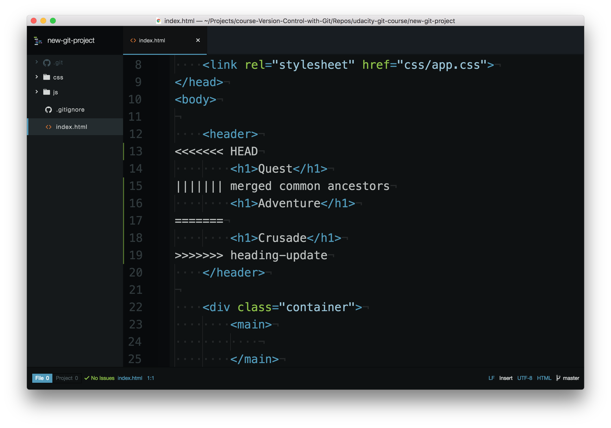*代码编辑器显示了合并冲突指示符。*](https://classroom.udacity.com/courses/ud123/lessons/61776182-df3f-4767-9558-5d1591c1a709/concepts/84037f3a-2ba6-4317-a705-4dc5f342295e#)

## 合并冲突指示符解释

编辑器具有以下合并冲突指示符：

- `<<<<<<< HEAD` 此行下方的所有内容（直到下个指示符）显示了当前分支上的行
- `||||||| merged common ancestors` 此行下方的所有内容（直到下个指示符）显示了原始行的内容
- `=======` 表示原始行内容的结束位置，之后的所有行（直到下个指示符）是被合并的当前分支上的行的内容
- `>>>>>>> heading-update` 是要被合并的分支（此例中是 `heading-update` 分支）上的行结束指示符

## 解决合并冲突

git 使用合并冲突指示符来告诉你两个不同分支上的哪些行导致了合并冲突，以及原始行是什么。要解决合并冲突，你需要：

1. 选择保留哪些行
2. 删掉所有带指示符的行

因为某种原因，我不太喜欢现在的"Crusade"一词，但是"Quest"也不太合适。要不将标题设为"Adventurous Quest"？

[*代码编辑器显示合并冲突指示符已被删除，并且标题已更新。*](https://classroom.udacity.com/courses/ud123/lessons/61776182-df3f-4767-9558-5d1591c1a709/concepts/84037f3a-2ba6-4317-a705-4dc5f342295e#)

### commit 合并冲突

删掉所有包含合并冲突指示符的行并选择保留哪个标题后，直接保存文件，并将其添加到暂存区，然后 commit！就像普通合并一样，代码编辑器会弹出，并让你提供 commit 消息。和之前一样，我们经常会使用自动生成的合并 commit 消息，因此在编辑器打开后，直接关闭编辑器并使用自动生成的 commit 消息。

就这些内容！当你明白合并指示符所显示的内容后，合并冲突就没那么复杂了。

### 习题 2/2

你到目前为止已经提交了大量的 commit。如果文件中出现合并冲突，你修改并保存了文件，然后添加到暂存区并 commit 了，但是忘了删掉合并冲突指示符，git 会 commit 文件吗？

- 是
  - 没错！git 将 commit 包含合并冲突指示符的行！它们只是普通的字符，因此 git 不会因为它们而停止 commit。你需要自己决定是否删掉它们。别忘了使用 `git diff` 检查哪些内容将暂存并 commit！ 
- 否


## 合并冲突小结

当相同的行在要合并的不同分支上做出了更改时，就会出现合并冲突。git 将在合并途中暂停，并告诉你存在冲突，以及哪些文件存在冲突。要解决文件中的冲突：

- 找到并删掉存在合并冲突指示符的所有行
- 决定保留哪些行
- 保存文件
- 暂存文件
- 提交 commit

注意一个文件可能在多个部分存在合并冲突，因此检查整个文件中的合并冲突指示符，搜索 `<<<` 能够帮助你找到所有这些指示符。

### 深入研究

- 遇到冲突时的分支合并：[英](https://git-scm.com/book/en/v2/Git-Branching-Basic-Branching-and-Merging#Basic-Merge-Conflicts)|[中](https://git-scm.com/book/zh/v2/Git-%E5%88%86%E6%94%AF-%E5%88%86%E6%94%AF%E7%9A%84%E6%96%B0%E5%BB%BA%E4%B8%8E%E5%90%88%E5%B9%B6) git 图书
- [冲突如何被显示](https://git-scm.com/docs/git-merge#_how_conflicts_are_presented) git 文档 (**英**)

---

## 7. 总结

分支、合并和合并冲突，这些是你这节课所学习的知识。

- 分支让我们可以独立于项目的其他部分进行操作。
- 完成操作之后，没你可以使用 Git 将这些分支合并在一起。
- 尽管这种情况并不常见，但如果发生合并冲突，只需打开编辑器，搜索合并冲突标记，移除带有标记的行，找出你要保留的行。
- 保存文件，暂存文件，然后提交。