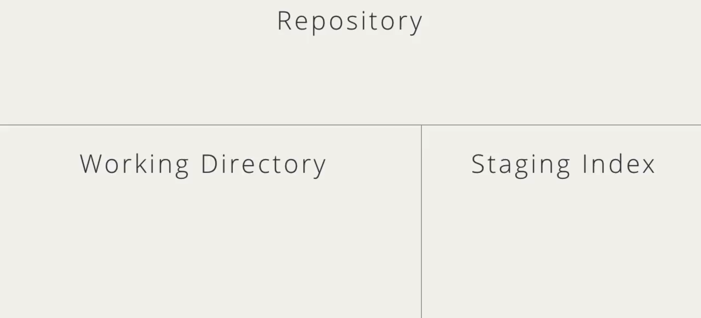
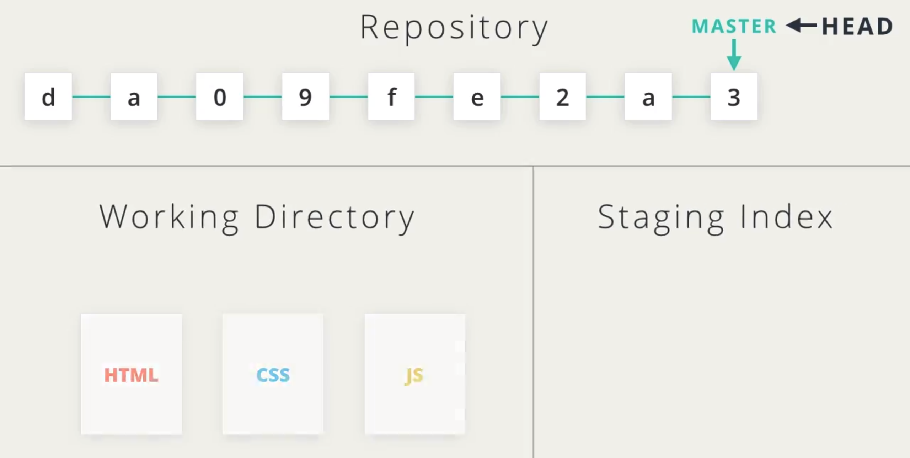
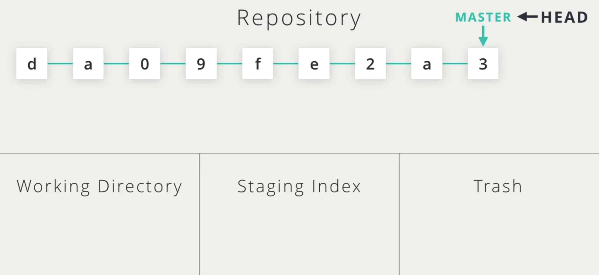
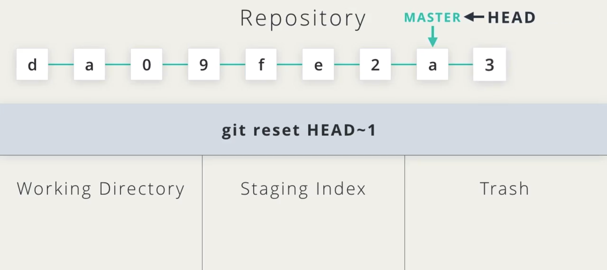
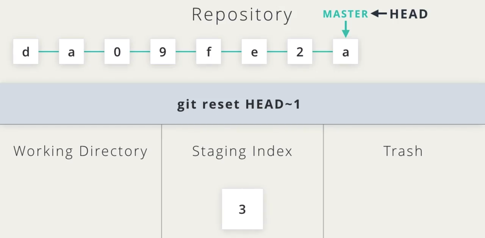
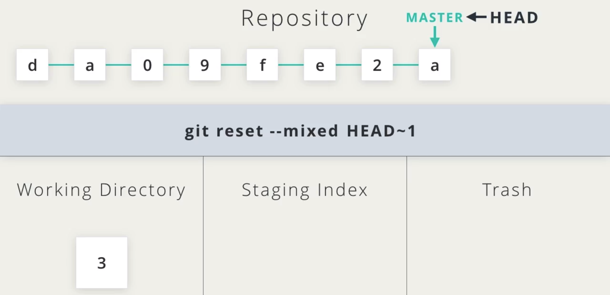
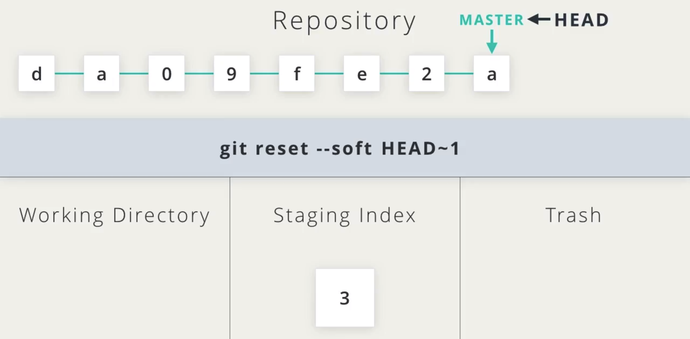
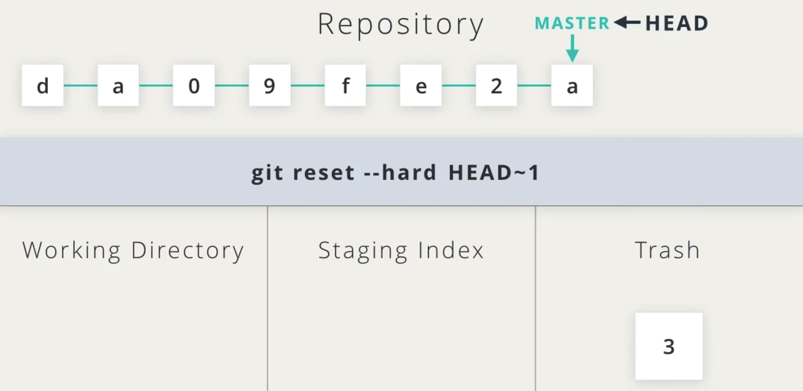
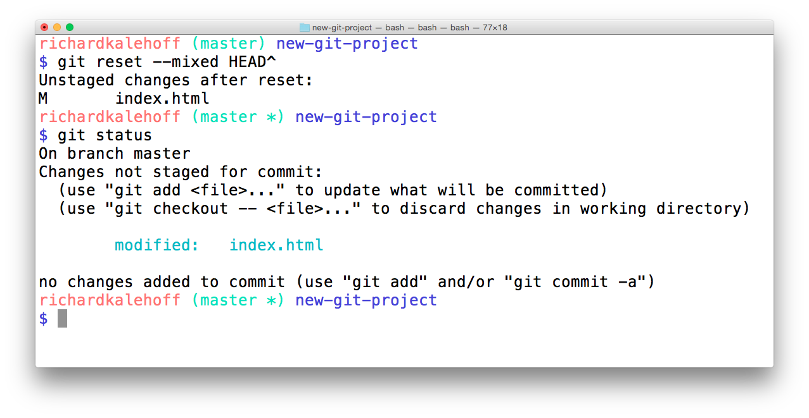
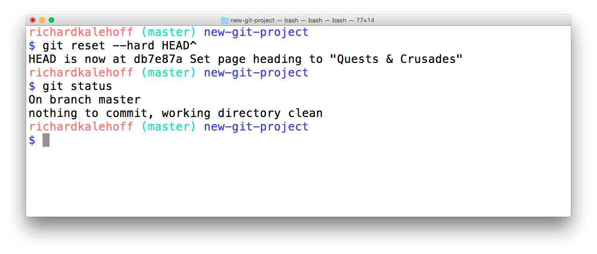

# 课程 6：撤销更改

> 救命啊！出现故障了！但是不用担心，因为项目已经处于版本控制下！你将学习如何撤销和修改保存到仓库中的更改。

---

[TOC]

---


## 1. 简介

提交内容到仓库中可能会让人很伤脑筋。

- 如果我犯了错怎么办？
- 如果我想撤销先前的操作怎么办？
- 如果我想彻底删除最后几个提交，因为我很确定永远都不会用到它们，该怎么办？

这正是我们将要学习的。

在本课中，我们将学习 `git commit --amend`、`git revert` 和 `git reset`

- 使用 `igt comiit --amend` 可以更改最近的提交，如果你在提交中忘记包含某个问文件，或在提交说明中打错了字，就需要调用该命令。
- 使用 `git revert` 并向 Git 提供需要还原提交的 SHA，比如 `git revert ac3f78`，就能撤销在该提交中作出的更改。同时，在该提交中添加的行将被删除。
- 使用 `git reset` 你刻意删除提交，不过你不能随意删除任意提交，而是必须按顺序删除提交。但这个命令存在潜在的危险，因为她会从仓库中删除项目。

使用这些新命令，你将可以借助 git 的强大能力来处理任何棘手的工作要求。

---


## 2. 更改最后一个 commit

### 更改最后一个 commit

你已经使用 `git commit` 命令提交了大量的 commit。现在，借助 `--amend` 选项，你可以更改最近的 commit。

```
$ git commit --amend
```

如果你的工作目录没有内容（也就是仓库中没有任何未 commit 的更改），那么运行 `git commit --amend` 将使你能够重新提供 commit 消息。代码编辑器将打开，并显示原始 commit 消息。只需纠正拼错的单词或重新表述即可！然后保存文件并关闭编辑器，以便采用新的 commit 消息。

### 向 commit 中添加忘记的文件

此外，`git commit --amend` 使你能够包含忘记包含的文件（或文件更改）。假设你更新了整个网站的导航链接颜色。commit 了该更改，并以为完事了。但是后来发现深藏在页面上的一个特殊导航链接没有新的颜色。你可以执行新的 commit 并更新该链接的颜色，但是这样就会出现两个 commit 执行完全相同的任务（更改链接颜色）。

相反，你可以修改最后一个 commit（更新所有其他链接颜色的 commit）以包含这个忘记的链接。要包含忘记的链接，只需：

- 编辑文件
- 保存文件
- 暂存文件
- 运行 `git commit --amend`

你对必要的 CSS 和/或 HTML 文件作出了更改，以便修正被遗忘的链接样式，然后保存所有被修改的文件，并使用 `git add` 暂存所有被修改的文件（就像要提交新的 commit 那样！），但是你可以运行 `git commit --amend` 来更新最近的 commit，而不是创建新的 commit。


## 3. 还原 commit

### 什么是还原？

当你告诉 git **还原（revert）** 具体的 commit 时，git 会执行和 commit 中的更改完全相反的更改。我们详细讲解下。假设 commit A 添加了一个字符，如果 git **还原** commit A，那么 git 将创建一个新的 commit，并删掉该字符。如果删掉了一个字符，那么还原该 commit 将把该内容添加回来！

上节课最后讲解了合并冲突，并通过将标题设为 `Adventurous Quest` 解决了该冲突。假设现在仓库中有个 commit 将标题改为 `Quests & Crusades`。

[*终端显示了仓库日志。最近的 commit 将标题从"Adventurous Quest"改成了"Quests & Crusades"。*](https://classroom.udacity.com/courses/ud123/lessons/f02167ad-3ba7-40e0-a157-e5320a5b0dc8/concepts/2e4b1c76-466d-494d-959c-a1f2aef5c7f7#)

### `git revert` 命令

现在我创建了一个包含一些更改的 commit，我可以使用 `git revert` 命令还原它

```
$ git revert <SHA-of-commit-to-revert>
```

因为最近的 commit 的 SHA 是 `db7e87a`，要还原该 commit： 我需要运行 `git revert db7e87a`（随即弹出代码编辑器，以便编辑/确认提供的 commit 消息）

我将获得以下输出结果：

[*终端显示了还原 commit 操作的输出结果。输出结果显示了被还原的 commit 中的提交说明。它还新建了一个 commit 来记录这一更改。*](https://classroom.udacity.com/courses/ud123/lessons/f02167ad-3ba7-40e0-a157-e5320a5b0dc8/concepts/2e4b1c76-466d-494d-959c-a1f2aef5c7f7#)

你看到 `git revert` 命令的输出结果是如何告诉我们它还原了什么吗？它输出了我要求它还原的 commit 的提交说明。同时值得注意的是，它创建了新的 commit。

### revert 小结

总结下，`git revert` 命令用于还原之前创建的 commit：

```
$ git revert <SHA-of-commit-to-revert>
```

此命令：

- 将撤消目标 commit 所做出的更改
- 创建一个新的 commit 来记录这一更改

### 深入研究

- [git-revert](https://git-scm.com/docs/git-revert) git 文档 (**英**)
- [git revert](https://www.atlassian.com/git/tutorials/undoing-changes) Atlassian 教程 (**英**)

---

## 4. 重置 commit

### 重置与还原

初看，**重置（reset）** 似乎和 **还原（revert）** 相似，但它们实际上差别很大。还原会创建一个新的 commit，并还原或撤消之前的 commit。但是重置会清除 commit！

> #### ⚠️ 重置很危险 ⚠️
>
> 一定要谨慎使用 git 的重置功能。这是少数几个可以从仓库中清除 commit 的命令。如果某个 commit 不再存在于仓库中，它所包含的内容也会消失。
>
> 为了减轻你的压力，澄清下，git 会在完全清除任何内容之前，持续跟踪大约 30 天。要调用这些内容，你需要使用 `git reflog` 命令。请参阅以下链接以了解详情：
>
> - [git-reflog (英)](https://git-scm.com/docs/git-reflog)
> - [重写历史记录 (英)](https://www.atlassian.com/git/tutorials/rewriting-history)
> - [reflog，你的安全屏障 (英)](http://gitready.com/intermediate/2009/02/09/reflog-your-safety-net.html)

### 相关 commit 引用

你已经知道可以使用 SHA、标签、分支和特殊的 `HEAD` 指针引用 commit。有时候这些并不足够，你可能需要引用相对于另一个 commit 的 commit。例如，有时候你需要告诉 git 调用当前 commit 的前一个 commit，或者是前两个 commit。我们可以使用特殊的“祖先引用”字符来告诉 git 这些相对引用。这些字符为：

- `^` – 表示父 commit
- `~` – 表示第一个父 commit

我们可以通过以下方式引用之前的 commit：

- 父 commit – 以下内容表示当前 commit 的父 commit
- HEAD^
- HEAD~
- HEAD~1
- 祖父 commit – 以下内容表示当前 commit 的祖父 commit
- HEAD^^
- HEAD~2
- 曾祖父 commit – 以下内容表示当前 commit 的曾祖父 commit
- HEAD^^^
- HEAD~3

`^` 和 `~` 的区别主要体现在通过合并而创建的 commit 中。合并 commit 具有两个父级。对于合并 commit，`^` 引用用来表示第一个父 commit，而 `^2` 表示第二个父 commit。第一个父 commit 是当你运行 `git merge` 时所处的分支，而第二个父 commit 是被合并的分支。

我们来看一个示例，这样更好理解。这是我的 `git log` 当前的显示结果：

```
* 9ec05ca (HEAD -> master) Revert "Set page heading to "Quests & Crusades""
* db7e87a Set page heading to "Quests & Crusades"
*   796ddb0 Merge branch 'heading-update'
|\  
| * 4c9749e (heading-update) Set page heading to "Crusade"
* | 0c5975a Set page heading to "Quest"
|/  
*   1a56a81 Merge branch 'sidebar'
|\  
| * f69811c (sidebar) Update sidebar with favorite movie
| * e6c65a6 Add new sidebar content
* | e014d91 (footer) Add links to social media
* | 209752a Improve site heading for SEO
* | 3772ab1 Set background color for page
|/  
* 5bfe5e7 Add starting HTML structure
* 6fa5f34 Add .gitignore file
* a879849 Add header to blog
* 94de470 Initial commit
```

我们来看看如何引用一些之前的 commit。因为 `HEAD` 指向 `9ec05ca` commit：

- `HEAD^` 是 `db7e87a` commit
- `HEAD~1` 同样是 `db7e87a` commit
- `HEAD^^` 是 `796ddb0` commit
- `HEAD~2` 同样是 `796ddb0` commit
- `HEAD^^^` 是 `0c5975a` commit
- `HEAD~3` 同样是 `0c5975a` commit
- `HEAD^^^2` 是 `4c9749e` commit（这是曾祖父的 (`HEAD^^`) 第二个父 commit (`^2`))

## 哪一个 commit？

请使用此仓库回答以下练习问题：

```shell
* 9ec05ca (HEAD -> master) Revert "Set page heading to "Quests & Crusades""
* db7e87a Set page heading to "Quests & Crusades"
*   796ddb0 Merge branch 'heading-update'
|\  
| * 4c9749e (heading-update) Set page heading to "Crusade"
* | 0c5975a Set page heading to "Quest"
|/  
*   1a56a81 Merge branch 'sidebar'
|\  
| * f69811c (sidebar) Update sidebar with favorite movie
| * e6c65a6 Add new sidebar content
* | e014d91 (footer) Add links to social media
* | 209752a Improve site heading for SEO
* | 3772ab1 Set background color for page
|/  
* 5bfe5e7 Add starting HTML structure
* 6fa5f34 Add .gitignore file
* a879849 Add header to blog
* 94de470 Initial commit
```

### 习题 1/4

`HEAD~6` 引用的是哪一个 commit？

- 4c9749e
- 0c5975a
- 1a56a81
- f69811c
- e014d91
- 209752a
  - 对了！也就是从当前 commit 开始向后数 6 个 commit。 

## 

上道题答的不错，再试试这道题吧！对于相同的仓库，`HEAD~4^2` 引用的是哪个 commit？

f69811c

- 答对了！`HEAD~4` 引用的是当前分支的第四个父 commit，然后 `^2` 告诉我们它是合并 commit 的第二个父 commit（被合并的那个 commit ！）。 

### `git reset` 命令

`git reset` 命令用来重置（清除）commit：

```
$ git reset <reference-to-commit>
```

可以用来：

- 将 HEAD 和当前分支指针移到目标 commit
- 清除 commit
- 将 commit 的更改移到暂存区
- 取消暂存 commit 的更改

### git reset 的选项

git 根据所使用选项来判断是清除、暂存之前 commit 的更改，还是取消暂存之前 commit 的更改。这些选项包括：

- `--mixed`
- `--soft`
- `--hard`

通过动画的形式更容易理解这些选项的工作方式。

---

这是我们仓库的三个部分：工作区、暂存区和顶部的版本库。



假设仓库中出现有这些提交，master 当前指向最近的提交，HEAD 当前指向 master，而我们的文件则位于工作区中



让我们转换一下布局，运行 reset 后，提交内容可能回去三个地方：工作区、暂存区或回收站，去回收站表示它将被删除。



运行 `git reset HEAD~1` 会将 HEAD 和 master 移动到前一个提交，但是这个带有 3 的提交会怎么样？



提交所作的更改可能会移动到工作区或暂存区，也可能直接被移到回收站，这完全取决于与 reset 命令一使用的选项。



让我们将这个提交移回到仓库。

如果我们不指定任何选项的来运行 git reset，则在 SHA 为 3 的提交中所作的更改将存留于工作区的文件中，这是因为 --mixed 是默认值。所以，不指定任何选项的来运行 git reset 相当于带有 --mixed。如果我们暂存文件并再次提交，将会获得相同的提交内容，但我们会得到一个不同的提交 SHA，这只是因为提交的时间戳与原来的时间戳不同，但提交内容将完全一样。



如果我们使用 `--soft` 选项，会将 SHA 为 3 的提交中所作的更改移动到暂存区。这些更改仍然相同，而且以及暂存好了。你需要做的只是运行 git commit 来重新提交。同样，由于时间戳不同，新提交的 SHA 也会不同。



最后是 `--hard` 后缀，它会删除 SHA 为 3 的提交中所作的所有更改。



---


> ### 💡 备份分支 💡
>
> 注意，使用 `git reset` 命令将清除当前分支上的 commit。因此，如果你想跟着操作接下来出现的所有重置操作，需要在当前 commit 上创建一个分支，以便用作备份。
>
> 在进行任何重置操作之前，我通常会在最近的 commit 上创建一个 `backup` 分支，因此如果出现错误，我可以返回这些 commit：
>
> ```
> $ git branch backup
> ```

### reset 的 `--mixed` 选项

我们来看看每个选项。

```
* 9ec05ca (HEAD -> master) Revert "Set page heading to "Quests & Crusades""
* db7e87a Set page heading to "Quests & Crusades"
* 796ddb0 Merge branch 'heading-update'
```

使用上述示例仓库，其中 `HEAD` 指向 `9ec05ca` 上的 `master`，运行 `git reset --mixed HEAD^` 会把 commit `9ec05ca` 中做出的更改移至工作目录中。

[*终端显示了使用 --mixed 选项进行重置后的结果。更改未暂存。*](https://classroom.udacity.com/courses/ud123/lessons/f02167ad-3ba7-40e0-a157-e5320a5b0dc8/concepts/fed81eb7-49b4-4129-9f6b-8201e0796fd8#)

> ### 💡 回到正常状况💡
>
> 如果你在重置任何内容前创建了 `backup` 分支，那么你可以轻松地让 `master` 分支指向 `backup` 分支所指向的同一 commit。你只需：
>
> 1. 从工作目录中删除未 commit 的更改
> 2. 将 `backup` 合并到 `master`（这将导致快进合并并使 `master` 向上移到和 `backup` 一样的点）
>
> ```
> $ git checkout -- index.html
> $ git merge backup
> ```

## reset 的 `--soft` 选项

我们使用相同的几个 commit 并看看 `--soft` 选项的工作方式：

```
* 9ec05ca (HEAD -> master) Revert "Set page heading to "Quests & Crusades""
* db7e87a Set page heading to "Quests & Crusades"
* 796ddb0 Merge branch 'heading-update'
```

运行 `git reset --soft HEAD^` 会把 commit `9ec05ca` 中做出的更改直接移至暂存区。

[*终端显示了使用 --soft 选项进行重置后的结果。更改被移到暂存区。*](https://classroom.udacity.com/courses/ud123/lessons/f02167ad-3ba7-40e0-a157-e5320a5b0dc8/concepts/fed81eb7-49b4-4129-9f6b-8201e0796fd8#)

## reset 的 `--hard` 选项

最后再看看 `--hard` 选项（当然并非最不重要选项）：

```
* 9ec05ca (HEAD -> master) Revert "Set page heading to "Quests & Crusades""
* db7e87a Set page heading to "Quests & Crusades"
* 796ddb0 Merge branch 'heading-update'
```

运行 `git reset --hard HEAD^` 将清除 commit `9ec05ca` 中做出的更改。

[*终端显示了使用 --hard 选项进行重置后的结果。更改被清除。*](https://classroom.udacity.com/courses/ud123/lessons/f02167ad-3ba7-40e0-a157-e5320a5b0dc8/concepts/fed81eb7-49b4-4129-9f6b-8201e0796fd8#)

现在该你了！

对于以下仓库：

```
* e014d91 (HEAD -> master, footer) Add links to social media
* 209752a Improve site heading for SEO
* 3772ab1 Set background color for page
* 5bfe5e7 Add starting HTML structure
* 6fa5f34 Add .gitignore file
* a879849 Add header to blog
* 94de470 Initial commit
```

### 习题 3/4

如果运行 `git reset --hard HEAD~3`，`3772ab1` commit 中的更改会怎样？更改会被移入暂存区？工作目录？还是完全被清除呢？

- 暂存区
- 工作目录
- 被清除
  - 提交


### 习题 4/4

如果运行 `git reset --soft HEAD^^`，`209752a` commit 中的更改将怎样？更改会进入暂存区、工作目录或完全被清除吗？

- 暂存区
  - 提交
- 工作目录
- 被清除


## reset 小结

总结下，`git reset` 命令被用来清除 commit：

```
$ git reset <reference-to-commit>
```

它可以用来：

- 将 HEAD 和当前分支指针移到引用的 commit
- 使用 `--hard` 选项清除 commit
- 使用 `--soft` 选项将 commit 的更改移至暂存区
- 使用 `--mixed` 选项取消暂存已被 commit 的更改

我们通常会用到祖先引用来指代之前的 commit。祖先引用包含：

- `^` – 表示父 commit
- `~` – 表示第一个父 commit

### 进一步研究

- 来自 Git 文档的 [git-reset (英)](https://git-scm.com/docs/git-reset)
- 来自 Git Blog 的 [Reset Demystified (英)](https://git-scm.com/blog)
- 来自 Git Book 的 *祖先引用* [英](https://git-scm.com/book/en/v2/Git-Tools-Revision-Selection#Ancestry-References)|[中](https://git-scm.com/book/zh/v2/Git-%E5%B7%A5%E5%85%B7-%E9%80%89%E6%8B%A9%E4%BF%AE%E8%AE%A2%E7%89%88%E6%9C%AC)


---

## 5. 总结

我们学习了：

- 使用 `git commit --amend` 选项来改写或更新最近的提交。
- 使用` git revert` 命令来撤销特定的提交。
- 以及使用 `git reset` 命令来重置或删除更改，不过要记得谨慎使用最后一个命令。

知道如何解决错误，无疑让我们更有信心进行探索。既然你已经知道如何撤销更改，希望你能更加自信地作出更改。


# 课程小结

你可以从头创建一个 GIT 仓库、进行提交、查看仓库的历史记录、在分支上开发内容、合并分支并处理冲突、以及撤销或重置提交。

Git 和版本控制是一项学起来有些颇有难度的技能，但你以及做到了。

请查看下面的内容了解如何开始使用你的新技能。

## 拓展你的 Git 技能

- 学习相应的 GitHub 课程
- 创建一个仓库来记录你的计算机设置 <https://dotfiles.github.io/>
- 为你的项目开发新的 Git 功能