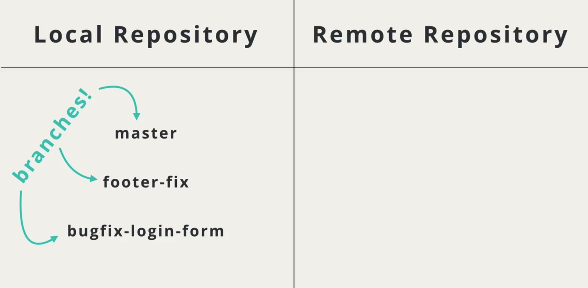
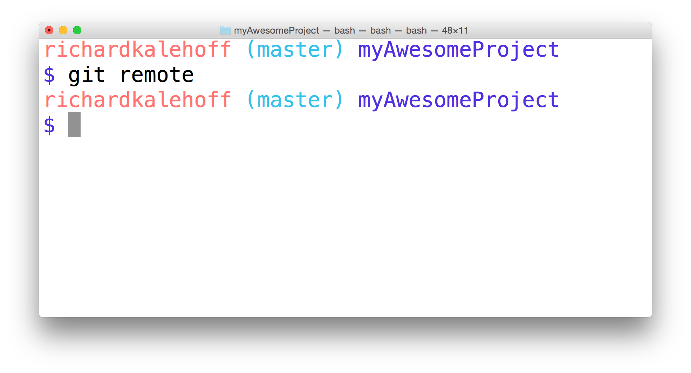
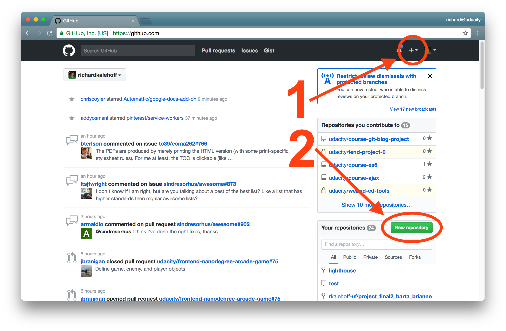
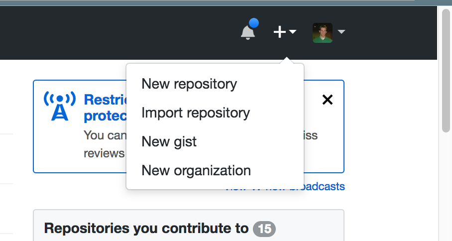
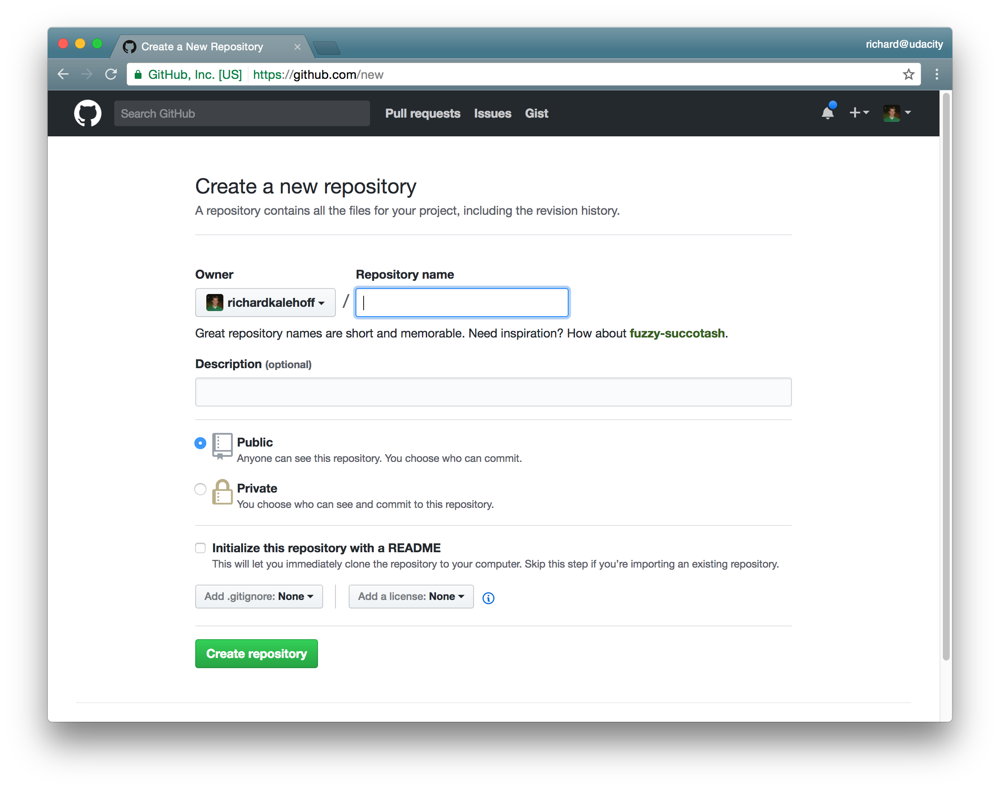
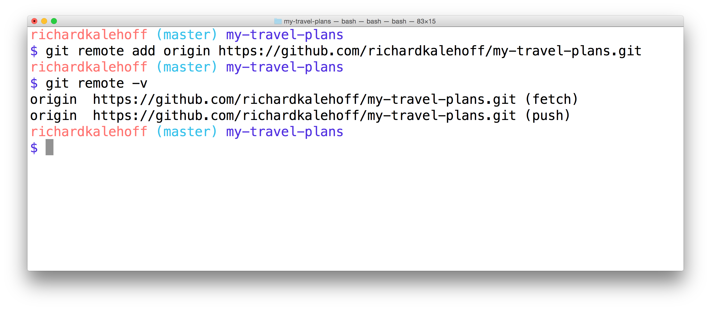
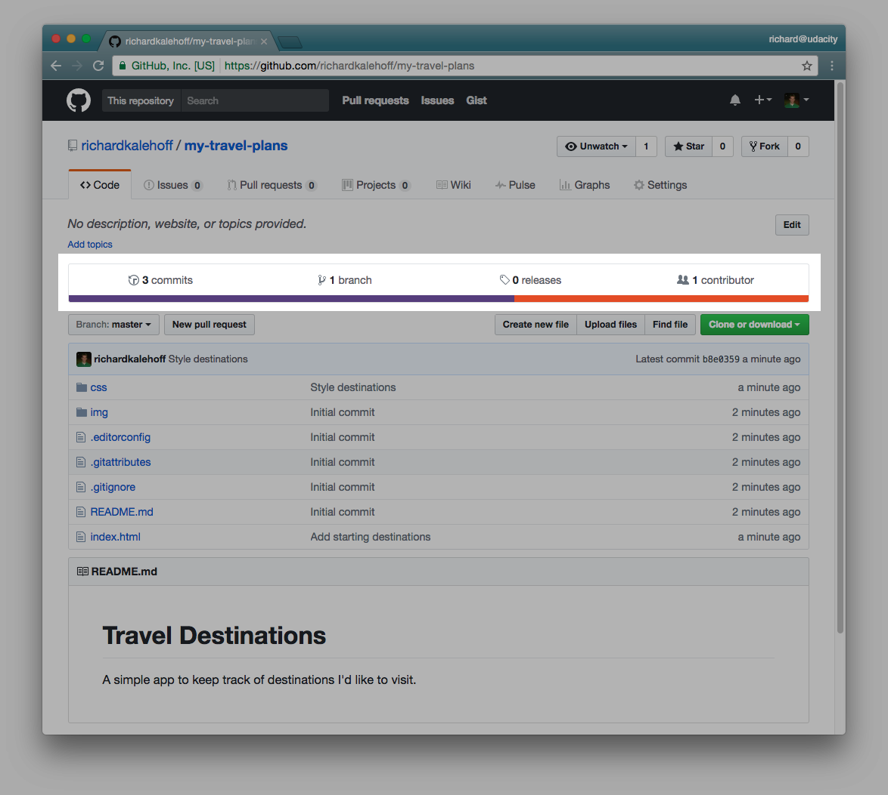

# 课程1：使用远程仓库

> 你将学习如何在 GitHub 上创建远程仓库，以及如何获取和推送对远程仓库的更改。

---

[TOC]


---

欢迎学习这门关于 GitHub 以及如何在版本控制项目中与他人协作的课程。

我们来简要概述一下何为项目合作以及为何它如此重要。

项目合作具有很多优势，因为大部分情况下你不会一个人开发一个项目。你会与团队一起合作，可能是与你不认识的人一起合作，或者为开源项目贡献代码。因此能够与他人合作是必不可少的技能。特别是当你在进行一个编程项目时。

合作的关键要素是**能够清晰地传达你正在执行的操作**，并能够与他人一起协作，例如让项目的维护者看看你能贡献什么样的代码。但是这种沟通难以在远程工作和异步工作时进行。

学完这门课程后，你将：

- 能够与他人一起合作完成版本控制项目。
- 使用 GitHub 及其功能来规划并实施这些更改。
- 向现有仓库贡献代码。
- 并学习如何向正在开发中的项目添加功能。

在了解 GitHub、协作或任何其他内容之前，我们需要先了解什么是远程仓库，以及如何使用远程仓库。

### 需要的知识

- 使用 `git init` 和 `git clone` 创建仓库
- 使用 `git status` 查看仓库
- 使用 `git log` 和 `git show` 查看以往的 commit
- 能够使用 `git add` 加入要提交的对象
- 使用 `git commit` 提交至仓库
- 你需要了解分支，合并分支，以及解决合并冲突
- 能够在 Git 中撤销操作:
  - `git commit --amend` 用于撤消最近的 commit ，或更改 commit 消息的措辞
  - 以及 `git reset` 如果你了解所有这些内容，那么你将很适合加入这门课程。

如果你不熟悉版本控制或 Git，可查看[使用 Git 进行版本控制课程](https://udacity.com/courses/ud123)。 


---

## 2. 远程仓库

### 建立协作

作为一名独立的开发者，你可能喜欢使用**本地**仓库。在此第一节课中，我们将了解**远程仓库**并与这些远程仓库进行交互。

假设你有一个朋友，我们称她为 Farrin，有一天你们聚到了一起，你向她展示了你近期的工作成果。她提出她可以向此项目添加一些功能。但你不想把**自己**的电脑给她，让她来进行这些更改，你希望她使用她自己的电脑。另外，你不想在她添加这些功能的时候只是**等待**，而是继续开发项目，然后在她完成时将她的更改合并进来。我们如何做到这一点呢？

以我的经验，通过来来回回的邮件传达项目的更改，会把后期的维护很快变成一场噩梦。你已经在使用 Git 跟踪项目，那么我们就用它来管理一切事务吧。

所以，Farrin 会在一个特定的分支开发此项目，她会把所做的一些更改添加到该分支上。当她在她的分支上工作的同时，你也会在你自己的特定分支上继续开发此项目。最后，当你获得 Farrin 的分支时，便可以将这两个分支合并在一起。

> #### 💡 始终使用特性分支
>
> 记住，在具有描述性命名的**特性分支**上进行所有 commit 非常有用。**分支有助于隔离不相关的更改。**
>
> 所以，当你与其他开发者协作时，请确保创建一个新的分支，并**使用描述性的名称说明它所包含的更改。**

---

我们使用 git 来跟踪项目，这对本地项目来说很方便。但是要与其他人共享这些本地仓库，我们需要另一个工具，也就是 GitHub。

GitHub 是一个用于托管版本控制仓库的服务，虽然它们的名称很相似，但是 Git 和 GitHub 之间的差别很大。

- Git 是用来管理仓库的工具（Tool to manage the repository）。主要在命令行上使用。
- Git Hub 是托管服务（Hosting version control repositories），你通常会在浏览器中与其进行交互。

我们将向 GitHub 发送一个本地仓库的副本，该副本不在本地机器上，因此叫做远程仓库。

在本节课我们主要学习以下命令：

- `git remote` - 管理远程仓库
- `git push` - 将修改推送到远程仓库上
- `git pull` - 将从远程仓库上获取更新

这些命令（push 和 pull）一开始可能不太好懂，但是你可以从本地机器的角度思考。

在本地仓库中有一些修改需要上传到远程仓库，因此需要将修改推送（push）到远程仓库。


但是如果远程仓库中有需要下载到本地仓库的更新，则需要拉取（pull）这些修改。


---

### 什么是远程仓库？

Git 是一个**分布式**版本控制系统，这意味着不存在**一个**主信息仓库。每位开发者使用的都是仓库的一个**副本**。因此，你可以拥有仓库的一个副本（它包含发布的 commit 和版本历史记录），并且你的朋友也可以拥有相同仓库的一个副本。每个仓库包含的信息与其他副本完全相同，没有哪一个是主要的。

在此之前，你可能一直使用的都只是**本地**仓库。而**远程**仓库与你的本地 Git 仓库一样，只是它位于其他地方。

[*本地仓库是位于你本地计算机上的仓库，而远程仓库位于其他地方（例如朋友的电脑、GitHub 等。）*](https://classroom.udacity.com/courses/ud456/lessons/edde9226-f71c-4a81-a858-4c83e4c7b664/concepts/1a7c8b4d-804b-465b-90cb-94c2fdef8f65#)

### 访问远程仓库的方式

访问远程仓库的方式有多个:

- 使用 URL
- 使用系统文件的路径

虽然你也可以在自己的文件系统上创建远程仓库，但这种做法极少见。到目前为止，访问远程仓库的最常见方式是通过位于 Web 上的仓库的 URL。

我们与远程仓库交互和控制远程仓库的方式，是使用 Git 远程命令:

```
$ git remote
```

---

假设我们的本地仓库中有这些分支：

- master
- footer-fix
- bugfix-login-form

这些分支是本地的，意味着这些分支只存在于我们的机器上，不与使用此仓库的其他开发人员共享。



当我们创建一个远程仓库时，一开始它通常是空的。为了将在这些分支上面的提交覆盖到远程仓库，我们需要把它们发送出去，我们可以使用两种方法。

- 可以将 footer-fix 分支和 bugfix-login-form 分支合并到 master 分支，并将 master 分支发送到远程仓库。


- 或者是将三个分支都发送到远程仓库。


---

**你并不限于使用一个远程仓库。你可以按需要添加尽可能多的远程仓库。**

[*本地仓库可以连接到多个远程仓库。*](https://classroom.udacity.com/courses/ud456/lessons/edde9226-f71c-4a81-a858-4c83e4c7b664/concepts/1a7c8b4d-804b-465b-90cb-94c2fdef8f65#)

### 为何需要多个远程仓库？

你为何要用多个远程仓库？我们稍后再谈这个，但简单来说，如果你跟多个开发者合作，那么你就需要在他们合并到 master 分支之前，在项目中获取**他们**在各自的分支上所做的更改。如果你想在决定实施自己的更改前，测试一下他们的更改，则需要这么做。

另一个例子是，如果你有一个项目，其代码托管在 Github 上，但是又通过 Git 部署到 Heroku 平台上。你需要一个远端 `master` 用于管理 Github 上的代码，另一个远端 `depolyment` 用于代码部署。

### 添加远程仓库

现在我们已经了解了远程仓库的用途，我们来将一个远程仓库添加到我们自己的本地仓库。

---

## 3. 添加远程仓库

### git remote 命令

`git remote` 命令可以让你管理远程仓库和与之交互。

```
$ git remote
```

试着对你尚未与任何人分享过的本地仓库运行此命令。你会得到什么结果？

[*终端在运行 git remote 命令。未显示任何输出，因为该仓库尚未连接到远程仓库。*](https://classroom.udacity.com/courses/ud456/lessons/edde9226-f71c-4a81-a858-4c83e4c7b664/concepts/27f11e0c-50d8-47d5-bf18-ac2eed717386#)

如果你尚未配置远程仓库，那么此名称将不会显示任何内容。需要注意的是在你**克隆**仓库后的情况。如果你克隆了，那么你将自动获得一个远程仓库，因为它是从你所提供的 URL 上的仓库克隆来的。我们来看一个被克隆的仓库。

[*终端正在运行 git remote 命令。它输出了单词 origin。*](https://classroom.udacity.com/courses/ud456/lessons/edde9226-f71c-4a81-a858-4c83e4c7b664/concepts/27f11e0c-50d8-47d5-bf18-ac2eed717386#)

我所克隆的项目是 Google 的一个名为 [Lighthouse](https://github.com/GoogleChrome/lighthouse) 的项目。项目克隆自 GitHub，用于提供审查、性能度量和渐进式网页应用最佳实践。

### 远程仓库的简写名（Shortname）

`git remote` 的输出只是一个单词 `origin`。这挺奇怪的。这里的 "origin" 一词称为"简写名"。简写名只是远程仓库所在位置的简略表示。简写名仅局部用于**当前**仓库（如在你的**本地**仓库中）。**"origin" 一词是指代主远程仓库的专用名称**。你也可以将它重命名为别的东西，但通常会被命名为 "origin"。

我们为何关心引用远程仓库路径的简便性？这是因为，你很快会发现我们将在很多命令中，用到远程仓库的路径。而这时，只使用一个名称就比使用远程仓库的完整路径简单多了。

举个例子，下列哪段描述更好理解：

- 向北行驶大约四分之一英里，然后左转，沿那条路直行约 5 英里，然后右转，直行约 300 英尺，走过蓝色邮箱后，左转至杰克街，前进 50 英尺后再次左转至欧文路，这条路弯弯曲曲，但你最终会到达芬兰巷，然后左手边第三个建筑就是
- 外婆家

可以看出，直接用简写名“外婆家”比写出从当前位置到那里的整个路线要简单得多。😉

如果你想查看远程仓库的完整路径，只需使用 `-v` 选项即可：

[*终端在运行 git remote 命令。输出包含简写名及其所指的完整 URL。*](https://classroom.udacity.com/courses/ud456/lessons/edde9226-f71c-4a81-a858-4c83e4c7b664/concepts/27f11e0c-50d8-47d5-bf18-ac2eed717386#)

在这里你可以看到，当使用 `origin` 一词时，实际上使用的是路径 `https://github.com/GoogleChrome/lighthouse.git`。这看起来可能有点奇怪：现在有**两个**远程仓库，都是 "origin" 且链接到相同的 URL。唯一的区别在结尾处： `(fetch)` 部分和 `(push)` 部分

我们将在后面的部分详细说明 `fetch` 和 `push`。

我们现在讲得差不多了。下面我们就来进行一些实际操作，创建一个简单的项目并将其推送到远程仓库！

### 创建一个简单的项目

在此课程中，我们需要一个使用示例项目以测试远程仓库的使用，向远程仓库推送更新，以及从远程仓库获取更改等操作。

### 习题 1/5

如果你没有想要使用的项目，则可以跟着我操作！

- 为你的项目创建一个名为 `my-travel-plans` 的新目录
- 使用 `git init` 将 `my-travel-plans` 目录转换成一个 Git 仓库
- 创建一个 `README.md` 文件
- 创建 `index.html`
- 创建 `app.css`


### README 文件内容

```
# Travel Destinations

这是一个简单的应用，用来跟踪我想去旅行的目的地。
```

### HTML 文件内容

将以下内容添加到 index.html 文件:

```html
<!doctype html>
<html lang="en">
<head>
    <meta charset="utf-8">
    <title>Travels</title>
    <meta name="description" content="">
    <link rel="stylesheet" href="css/app.css">
</head>
<body>

    <div class="container">
        <div class="destination-container">
            <div class="destination" id="florida">
                <h2>Florida</h2>
            </div>

            <div class="destination" id="paris">
                <h2>Paris</h2>
            </div>
        </div>
    </div>

</body>
</html>
```

### CSS 文件内容

将以下信息添加到 CSS 文件：

```css
html {
    box-sizing: border-box;
    height: 100%;
}

*,
*::before,
*::after {
    box-sizing: inherit;
}

body {
    display: flex;
    margin: 0;
    height: 100%;
}

.container {
    margin: auto;
    padding: 1em;
    width: 80%;
}

.destination-container {
    display: flex;
    flex-flow: wrap;
    justify-content: center;
}

.destination {
    background: #03a9f4;
    box-shadow: 0 1px 9px 0 rgba(0, 0, 0, 0.4);
    color: white;
    margin: 0.5em;
    min-height: 200px;
    flex: 0 1 200px;
    display: flex;
    justify-content: center;
    align-items: center;
    text-align: center;
}

h2 {
    margin: 0;
    transform: rotate(-45deg);
    text-shadow: 0 0 5px #01579b;
}

#florida {
    background-color: #03a9f4;
}

#paris {
    background-color: #d32f2f;
}
```

目前，我的项目看起来是这样的，但记住你可以按照自己的意愿创建项目，只需要确保项目中有一些 commit 即可。

[*Chrome 浏览器中打开了显示我想去旅行的目的地（弗罗里达和巴黎）的简单网页应用。*](https://classroom.udacity.com/courses/ud456/lessons/edde9226-f71c-4a81-a858-4c83e4c7b664/concepts/27f11e0c-50d8-47d5-bf18-ac2eed717386#)

#### 习题 2/5

让我们先确保你已经完成设置并准备继续。请勾掉下面这些中已完成的项：

- 我为我的项目创建了一个名为 `my-travel-plans` 的新目录
- 我将项目转变成了 Git 仓库
- 我至少将一个文件添加到了项目
- 我使用 git commit 提交了文件（例如 `Initial commit`)


### 在 GitHub 上托管

托管 Git 项目的方式有多种。但最受欢迎的托管网站被称为 [GitHub](https://github.com/)，你可能以前听说过。现在 GitHub 的问题是，这个名字与 Git 非常相似，有时候人们会将 Git 和 GitHub 混淆，认为它们是完全一样的，而事实上它们大相径庭。

- Git 是一个版本控制工具
- GitHub 是一个托管 Git 项目的服务

如果你已熟悉 GitHub，知道如何在**不**初始化 README 的情况下创建一个仓库，你可以跳过此视频，并使用与示例项目相同的名称创建仓库，记住不要初始化 readme 文件。

如果你还没有帐户，请在 [GitHub 的加入页面](https://github.com/) 注册一个帐户。可以注册的 GitHub 帐户类型有很多，但我们在此课程中需要的是免费的类型。反正大多数人使用的都是免费帐户。创建好帐户后，登录 GitHub，你将位于主页：

[*这是我登录后在我的帐户显示的页面。根据你拥有的仓库的数量以及你关注的其他用户和仓库，你的信息将会有所不同。*](https://classroom.udacity.com/courses/ud456/lessons/edde9226-f71c-4a81-a858-4c83e4c7b664/concepts/27f11e0c-50d8-47d5-bf18-ac2eed717386#)

与其他网站一样，GitHub 经常更新其界面，所以如果你看到的内容与上面显示的不同，不用担心，其中的重要功能还是一样的。

现在我们要学习的重点是如何创建新的仓库。实际上，从主页创建仓库的方式有两种：

1. 从导航栏创建
2. 页面右侧最下面的绿色"New repository"（新建仓库）按钮

[*GitHub 有两个可以创建新仓库的位置。位于页面标题中的加号图标和页面中间的"New repository"按钮。*](https://classroom.udacity.com/courses/ud456/lessons/edde9226-f71c-4a81-a858-4c83e4c7b664/concepts/27f11e0c-50d8-47d5-bf18-ac2eed717386#)

我使用的是导航栏中的按钮，因为导航栏在每个页面上都可用，它使我们可以轻松创建新仓库链接。

[*点击 GitHub 标题中的加号图标会显示一个选项下拉列表，其中一个选项是"New repository"链接。*](https://classroom.udacity.com/courses/ud456/lessons/edde9226-f71c-4a81-a858-4c83e4c7b664/concepts/27f11e0c-50d8-47d5-bf18-ac2eed717386#)

下拉列表中的 `New repository` 链接会将你转至仓库创建页面。我们只需填写此表中的一个字段 - Repository name（仓库名称）字段。

[*GitHub 的创建新仓库页面。唯一必填的字段为 Repository name 字段。*](https://classroom.udacity.com/courses/ud456/lessons/edde9226-f71c-4a81-a858-4c83e4c7b664/concepts/27f11e0c-50d8-47d5-bf18-ac2eed717386#)

通常情况下，你可以使用项目名称作为仓库的名称。创建、修改或删除仓库都非常容易，所以不必执着于在此页上赋予它一个完美的名称。我将创建一个名为 "my-travel-plans" 的仓库，与我创建的示例项目名称一样。

你可以暂时将描述留白（如果你想，也可以添加描述）。由于我现在使用的是免费计划，我的仓库必须是 public（公开的，这意味着任何人都可以免费查看我的仓库和所有代码）。如果我想让它成为一个私有仓库，则要选择"Private"（私有），这时 GitHub 会向我索要信用卡信息，并将我升级至付费计划。

我还要**取消勾选**"Initialize this repository with the README"（使用 README 初始化此仓库）选项，因为我不希望 GitHub 为我添加一个 README 文件。

### ⚠️ 不使用 README 初始化 ⚠️

确保你**未勾选**"Initialize this repository with the README"选项。我们将提供自己的 README，所以不需要 GitHub 自动提供。

另外，如果我们让 GitHub 自动为我们生成新的 README 文件，它将不会给我们提供要在终端运行的相关配置命令。我们仍然有办法获得该信息，但它会被默认隐藏。

所以只需确保未勾选该字段，就没问题了！

现在，点击那个显眼的"Create repository"（创建仓库）按钮，以创建你的远程仓库！

---

在创建一个新仓库后，我们会看到这样一个快速设置页面。

首先，我们可以看到用于切换 HTTPS 版或 SSH 版 URL 的选项。

单机 SSH 按钮会更改这里的 URL 地址以及下面对应的这些 URL。

我们切换回 HTTPS 版，如果你想要了解关于 SSH URL 的相关知识以及使用方法，请在视频的下方查看。


下一个部分是如何处理新仓库，我们有一个已经存在的仓库，稍后就可以看到。但是，如果你想在 GitHub 上创建远程仓库，可以先执行这个流程，然后按照下面这些命令依次执行。


```
echo "# my-travel-plans" >> README.md
git init
git add README.md
git commit -m "first commit"
git remote add origin https://github.com/...
git push -u origin master
```

- 第一行命令将创建一个带简单标题的 README 文件。
- 然后初始化 git
- 添加 README 文件
- 提交它
- 然后创建一个到此远程仓库的链接

我们不需要创建一个新仓库，因为我们已经有一个现有仓库，现在我们来查看一下。


你会发现这里的这两行命令与这两行完全一样。所以当你创建一个新仓库时，你需要运行这些初始化命令，然后运行在这里的这些命令。

如果你已经拥有现有仓库，那么你只需在这里运行这里的这些命令。

- 这里的第一行命令，创建了一个到 GitHub 上的远程仓库的链接。
- 我们将在下一节中介绍如何推送到远程仓库。但是现在只需要复制这两行并在终端中执行即可。

---

**记住 `git remote` 命令用于创建和管理远程仓库**。所以我将使用一个命令，在我的本地仓库与 GitHub 帐户上刚创建的远程仓库之间创建连接。

```
$ git remote add origin https://github.com/richardkalehoff/RichardsFantasticProject.git
```

### ⚠️ 远程仓库与权限 ⚠️

警告：你需要使用**你**刚在**自己的** GitHub 帐户中创建的新仓库的 URL。请**不要**使用上面的那个，因此它是我在**自己的**账户上创建的项目。并且由于此项目在**我的**帐户上，会导致**你**无法访问并推送更改。

所以确保使用你的项目中的 URL。

Kagure、Jack、Owen 和 Finn 这些朋友们都有自己的 `my-travel-plans` 项目，它们位于：

- <https://github.com/kagure/my-travel-plans.git>

- <https://github.com/jack/my-travel-plans.git>

- <https://github.com/owen/my-travel-plans.git>

- <https://github.com/finn/my-travel-plans.git>

  (注：上述列表中的链接都是虚拟链接，实际不存在)

### 习题 3/5

下面的命令中克隆了谁的仓库？

```
$ git clone https://github.com/owen/my-travel-plans.git
```

- Kagure 的
- Jack 的
- Owen 的
- Finn 的


### 习题 4/5

Jonathan 和 Allison 在一起开展项目。Jonathan 在 GitHub 上创建了一个项目，URL 为 `https://github.com/docsrus/brain-mapping.git`。

如果 Allison 运行 `git clone https://github.com/docsrus/brain-mapping.git`，她有权限对 Jonathan 在 GitHub 上的项目做出更改吗？

- 是
- 否
  - Allison 无法更改 Jonathan 在 GitHub 上的项目，因为她不是该远程仓库的所有者。 


对于你刚在命令行中运行的命令，有几点需要注意：

1. 首先，这条命令包含一个子命令 `add`

2. 这里使用了 `origin` 一词，设置了我们之前所说的简写名

   - 记住， `origin` 一词并没什么特殊性。

   - 如果你想将它改为 `repo-on-GitHub`，那么只需（在运行命令之前）将 "origin" 改为 "repo-on-GitHub"：

     `$ git remote add repo-on-GitHub https://github.com/richardkalehoff/RichardsFantasticProject.git`

3. 第三，添加了仓库的完整路径（即 Web 上的远程仓库 URL）

现在，我要使用 `git remote -v` 来验证我已经正确添加了远程仓库：

[*git remote add 用于创建一个 origin 简写名，指向 GitHub 上的项目。运行 git remote -v 会显示简写名和 URL。*](https://classroom.udacity.com/courses/ud456/lessons/edde9226-f71c-4a81-a858-4c83e4c7b664/concepts/27f11e0c-50d8-47d5-bf18-ac2eed717386#)

棒极了！一切都很不错。我**使用 `git remote add` 命令添加了一个远程仓库的链接**，然后我**用 `git remote -v` 检验是否一切正常**。

#### 习题 5/5

### 为了确保我们的步调一致，请确认你完成了以下所有操作：

- 我在 GitHub 上创建了我的远程仓库
- 我使用 `git remote add` 在我的本地仓库与远程仓库之间建立了连接
- 我使用 `git remote -v` 验证了简写名是否对应正确的 URL


## 小结

远程仓库与你使用的本地仓库一样，只是存储在不同的位置。要管理远程仓库，可使用 `git remote` 命令：

```
$ git remote
```

- 你可以连接到多个不同的远程仓库。
- 简写名是用于指代远程仓库位置的名称。通常该位置为 URL，但也可能是同一台计算机上的文件路径。
- `git remote add` 用于添加到新的远程仓库的连接。
- `git remote -v` 用于查看远程仓库与连接之间的详细信息。

### 进一步研究

- [使用远程仓库](https://git-scm.com/book/en/v2/Git-Basics-Working-with-Remotes#_showing_your_remotes)：来自 Gitbook (**英**)
- [`git remote` 命令](https://git-scm.com/docs/git-remote)：来自 Git 文档 (**英**).


---


## 4. 将更改推送到远程仓库

下方是我们的本地仓库，而上方是远程仓库。


我们的本地仓库的 master 分支拥有这些提交，而远程仓库则是完全空白。那么，我们如何将这些本地提交从本地仓库上传到远程仓库呢？


我们可以通过 `git push` 这个指令完成。它将记下本地仓库的所有提交记录，然后将它们推送到远程仓库。


---

### 查看 commit

让我们来看看我的仓库中的 commit 。

[*终端正在显示项目 commit 的日志。*](https://classroom.udacity.com/courses/ud456/lessons/edde9226-f71c-4a81-a858-4c83e4c7b664/concepts/b7334b54-ec80-4754-95cd-345b78f526ae#)

我使用了以下 log 命令来显示这些 commit

```
$ git log --oneline --graph --decorate --all
```

不过这些 commit 仅位于本地仓库，还未推送到远程仓库。当 commit 推送到远程仓库后，日志中将出现远程分支指示符。由于日志中当前没有远程分支指示符，我们便可以说远程仓库中没有 commit 。但是为了百分百确定，我们来看看 GitHub 上的远程仓库，看看是否存在一些 commit 。

[*远程仓库不包含任何 commit ，所以 GitHub 显示出仓库的设置页面。*](https://classroom.udacity.com/courses/ud456/lessons/edde9226-f71c-4a81-a858-4c83e4c7b664/concepts/b7334b54-ec80-4754-95cd-345b78f526ae#)

**由于我们还未向 GitHub 推送任何 commit 更新，它仍然在向我们显示设置屏幕，告诉我们如何将本地仓库连接到远程仓库并推送一些 commit 。**由于我们看到的仍然是设置屏幕，因此可以知道远程仓库中没有 commit 。

### 推送 commits

要将本地 commits 推送到远程仓库，你需要使用 `git push` 命令。你要提供远程仓库简写名以及用于容纳你的 commit 的分支名：

```
$ git push <remote-shortname> <branch>
```

我的远程仓库的简写名为 `origin`，并且我想推送的 commit 位于`master`分支上。那么，我要使用以下命令将我的 commit 推送到 GitHub 上的远程仓库：

```
$ git push origin master
```

[*终端现在正在显示 git push 命令。它向我索取用户名、密码（不显示出来），然后显示关于它如何推送 commit 的信息。*](https://classroom.udacity.com/courses/ud456/lessons/edde9226-f71c-4a81-a858-4c83e4c7b664/concepts/b7334b54-ec80-4754-95cd-345b78f526ae#)

有几点需要注意：

- 你可能需要输入用户名和密码，这取决于你如何配置 GitHub 以及使用的远程 URL 
  - 如果你使用的是 HTTP 版本（而不是 `ssh` 版本）的远程仓库，就需要提供用户名和密码。
  - 如果你配置 GitHub 使用 SSH 协议，并提供过 SSH 密匙，就不需要执行上一步。如果你对使用 SSH 连接 GitHub 感兴趣，请参阅[使用 SSH 连接 GitHub 文档](https://help.github.com/articles/connecting-to-github-with-ssh/)。
- 如果你要输入用户名和密码，用户名会在输入后显示出来，但密码不会显示。只需继续输入密码，完成后按 Enter 键即可。 
  - 如果你的密码出错，不用担心，它会让你重新输入
- **Git 会压缩文件使之变小，然后将其推送至远程仓库**
- 这里创建了一个新分支，在页面底部可看到`[new branch]`，后面是 `master -> master`

现在我们来看 GitHub:

[*我的整个项目都位于 GitHub 上！*](https://classroom.udacity.com/courses/ud456/lessons/edde9226-f71c-4a81-a858-4c83e4c7b664/concepts/b7334b54-ec80-4754-95cd-345b78f526ae#)

我们的项目位于 GitHub 上 - 这太酷了，也让我们的工作变得很轻松！GitHub 有一个很棒的功能，即它会自动显示 README 文件的内容，这非常有用。

GitHub 还会显示很多关于我们仓库的详细信息。现在它显示仓库中有：

- 三个 commit
- 一个分支
- 一名贡献者

[*GitHub 上的项目主页显示关于仓库的信息。*](https://classroom.udacity.com/courses/ud456/lessons/edde9226-f71c-4a81-a858-4c83e4c7b664/concepts/b7334b54-ec80-4754-95cd-345b78f526ae#)

在继续之前，我们来检查一下本地仓库，看看在推送更改后它有何变化。

运行以下命令：

```
$ git log --oneline --graph --decorate --all
```

*注意：确认已包含 --decorate 和 --all 选项。*

[*终端显示运行 git log --oneline --graph --decorate --all 后的结果。现在出现了 origin/master 跟踪分支。*](https://classroom.udacity.com/courses/ud456/lessons/edde9226-f71c-4a81-a858-4c83e4c7b664/concepts/b7334b54-ec80-4754-95cd-345b78f526ae#)

现在我们输出中有一个标记 (marker)！该标记为 `origin/master`，并被称为**跟踪分支**。**跟踪分支的名称包含远程仓库的简写名及分支名称。**所以跟踪分支 `origin/master` 告诉我们远程仓库 `origin` 有一个 `master` 分支，指向 commit `9b7d28f`（并包含 `9b7d28f` 前的所有 commit ）。这非常有用，因为**这意味着我们可以在本地仓库跟踪远程仓库的信息**！

需要**注意的一点**是，这个 `origin/master` 跟踪分支并不能实时表现被跟踪分支在远程仓库上的位置。如果我们之外的其他人对远程仓库做了更改，我们本地仓库中的 `origin/master` 跟踪分支不会移动。我们必须告诉它检查更新，**它才会**移动。我们将在下一部分介绍如何操作。

### 小结

`git push` 命令用于从本地仓库向远程仓库推送 commit 。

```
$ git push origin master
```

`git push` 命令需要：

- 你想向其推送 commit 的远程仓库的简写名
- 包含你想推送的 commit 的分支

---

## 5. 从远程仓库拉取修改

### 从远程仓库拉取修改

假如说我们处于这样一种情况：**远程**仓库上存在一些 commit ，但我们的**本地**仓库上没有这些 commit 。这种情况的原因有多个：你参与了团队协作，有一名同事将新更改推送到了远程仓库。或者，你在不同的电脑上开展同一个项目 -- 例如，你有一个办公电脑和一个私人电脑，你在两个电脑上都向仓库做了贡献。如果你从办公电脑上向远程仓库推送更改，则个人电脑上的本地仓库就不会反映这些更改。我们如何将远程仓库上的更改同步到本地仓库呢？这正是我们接下来要看的。我们先来看看拉取远程仓库修改的方式，然后我们将实际操作！

---

我们的本地仓库有五个提交，但是远程仓库有六个提交。本地仓库的 master 分支指向提交 e，而远程仓库的 master 分支指向 e 之后的一次提交。


由于远程仓库的 master 分支指向提交 7，所以这两个仓库处于不同步的状态。我们需要将远程仓库发生的更改同步到本地。

我们可以执行 `git pull` 命令，加上远程仓库的名字。本示例中是 origin 以及需要拉取的分支 master。


这将把远程 origin 仓库 master 分支上的提交拉取到本地仓库，并且与本地仓库的 master 分支合并。这样分支就被更新了。


---

虽然我已经说过了，但我要再强调一次。**本地**仓库中出现的分支实际上在跟踪**远程**仓库中的一个分支（例如，本地仓库中的 `origin/master` 称为**跟踪分支**，因为它在跟踪远程仓库上简写名为 "origin" 的 `master` 分支）。

### 添加远程更改

由于我们的远程仓库中没有任何 commit ，且我们未与任何人协作，我们模拟协作环境。并通过 GitHub 的 Web 界面手动添加一些 commit 。

下面是一个演练视频。使用下面的代码片段跟着视频一起操作。

#### 新的 CSS 内容

添加以下新规则集：

```
.destination:hover h2 {
    transform: rotate(0deg);
}
```

将 `transition: transform 0.5s;` 添加到 `h2` 规则集，现在它应该是：

```
h2 {
    margin: 0;
    transform: rotate(-45deg);
    transition: transform 0.5s;
    text-shadow: 0 0 5px #01579b;
}
```

---

我们先转到该页面。


现在打开的是个人的 GitHub 账号。查看的是 my-travel-plans 仓库。这是远程仓库，是 my-travel-plans 仓库，但是位于 GitHub 上，因此是远程仓库。

这个远程仓库有 三个 commit。因此我们需要使用 GitHub 界面手动创建一些 commit，可以使用这个 Create a New File（创建新文件）按钮创建一个新的文件。


这样我们就转到了这个可以为文件设定名称的页面。然后设置一些配置并在这里添加内容。


在这里输入 app.js（也就是文件路径那里的输入框中），缩进设为 4，然后在这里添加一些内容。但暂时先不创建文件。因为我们实际上要编辑一个现有文件。

转到 css 文件夹并编辑 app.css 文件。

现在我们需要点击这个铅笔图标，然后才能编辑文件。

我们向下滚动并找到要编辑的地方，当我们将光标悬停在目的地上方时，我们更改下标题使其旋转到正常位置。

```css
43 .destination:hover h2{
    transform: rotate(0deg);
}
```

我们希望这种旋转能平滑地发生，因此添加一个过渡。

```css
47 h2{
    margin: 0;
    transform: rotate(-45deg);
    transition: transform 0.5s; /* 添加的代码 */
    text-shadow: 0 0 5px #01579b;
}
```

添加了这些更改后滚动到顶部，点击 Preview Changes（预览更改）然后就看到了我们将要提交的更改。


对于我来说这些更改没有问题，因此滚动到下面并提交该 commit。

我觉得 Add animation to destination headings 是个不同的提交说明。设定好了直接 commit 这些更改就行。

我们回到主页面，现在有 4 个 commit 了，之前是 3 个。css 文件在 11 秒前更改了。


---

> #### ⚠️ 首选在本地工作 ⚠️
>
> 由于 GitHub 有一个 Web 界面，它允许你通过其界面手动添加 commit 。虽然你**可以**这么做，并不代表你**应该**这么做。我演示了用这种方式进行更改，是为了模拟远程仓库上的 commit ，而不是本地仓库上的 commit 。但是我建议你应该始终在本地开展项目工作，然后将更改推送到远程仓库。

### 取回远程 commit

现在我们比较本地仓库与远程仓库。我们的本地仓库中只有**三个** commit :

[*我们的本地仓库中只有三个 commit。*](https://classroom.udacity.com/courses/ud456/lessons/edde9226-f71c-4a81-a858-4c83e4c7b664/concepts/22364196-91e4-4da4-837b-0e71a8143350#)

但远程仓库中实际有**四个** commit：

[*GitHub 上的远程仓库中有四个 commit 。其中三个来自我们的本地仓库，一个是我们在 GitHub 上手动添加的。*](https://classroom.udacity.com/courses/ud456/lessons/edde9226-f71c-4a81-a858-4c83e4c7b664/concepts/22364196-91e4-4da4-837b-0e71a8143350#)

### 使用 `git pull` 拉取更改

本地 commit 在 `5a010d1` 处结束，而远程仓库有额外两个 commit - commit `4b81b2a` 和 `b847434`。

另外，注意在我们的**本地**仓库中，当我们使用 `git log` 命令时，`origin/master` 分支仍然指向 commit `5a010d1`。

记住，`origin/master` 分支不实时映射远程仓库 master 分支所在的位置。如果远程仓库的 `master` 分支移动，本地 `origin/master` 分支仍会待在原地。要更新此分支，我们需要同步两个仓库。

`git push` 会同步**远程**仓库与**本地**仓库。要执行相反操作（将**本地仓库**与**远程仓库**同步），我们需要使用 `git pull`。`git pull` 的格式与 `git push` 的非常相似 - 提供远程仓库的简写名，以及你要拉取 commit 的分支名称。

```
$ git pull origin master
```

[*运行 git pull origin master 会检索 origin 远程仓库 master 分支中的 commit 。*](https://classroom.udacity.com/courses/ud456/lessons/edde9226-f71c-4a81-a858-4c83e4c7b664/concepts/22364196-91e4-4da4-837b-0e71a8143350#)

运行此代码时需要注意几点：

- 格式与 `git push` 非常相似 - 要对项目计数、压缩和打包
- 它有一个短语 "fast-forward"，这意味着 Git 进行了快进合并（我们一会儿深入研究）
  - 它显示类似于 `git log --stat` 的信息，其中显示更改的文件以及添加或删除了多少行

如果你不想自动将本地分支与跟踪分支合并，则不应使用 `git pull`，而是使用另一个命令 `git fetch`。**当远程仓库包含你没有的 commit ，但本地仓库也包含远程仓库所没有的 commit 时，你可能想这么做。**

我们来看看 `git fetch`。

### 小结

如果你想在本地仓库中包含远程仓库中的更改，那么你要*拉取*这些更改。要使用 Git 这样做，你需要使用 `git pull` 命令。你告诉 Git 你想获取修改的远程仓库的简写名以及包含你需要的更改的分支：

```
$ git pull origin master
```

在运行 `git pull` 时，会发生以下活动：

- 远程分支上的 commit 会被复制到本地仓库
- 本地跟踪分支（`origin/master`）移到指向最新的 commit
- 本地跟踪分支（`origin/master`）合并到本地分支（`master`）

另外，可以在 GitHub 上手动添加更改（但不建议这样做，所以别这样做）。


---


## 6. Pull 与 Fetch

现在的状况是远程仓库上具有本地仓库没有的 commit，我们可以使用 git 来获取这些 commit。

现在如果运行 `git fetch origin master`，系统获取 origin 的 master 分支上的所有 commit 并移动至 origin/master 跟踪分支，使其指向这些 commit。


就是这样，并没有让本地 master 分支移动，如果我们希望本地 master 分支上具有 origin/master 中的 commit，则需要进行合并（merge）。

如果我们位于 master 分支上，则需运行 git merge origin/master 以更新本地 master 分支。


---

git fetch 用于从远程仓库分支检索 commit ，但**不会**在收到这些 commit 之后，自动将本地分支与远程跟踪分支合并。

上面的段落有点密集，你可以多读几遍。

你需要向 `git fetch` 提供和 `git pull` 完全相同的信息，也就是说要提供你想获取的远程仓库的简写名及其分支：

```
$ git fetch origin master
```

运行 `git fetch` 后，会发生以下活动：

- 远程分支上的 commit 会复制到本地仓库
- 本地跟踪分支（例如，`origin/master`）移到指向最新的 commit

需要注意的一点是，本地分支完全不会被改变。

**你可以将 `git fetch` 想象成 `git pull` 它的一半操作，而 `git pull` 的另一半是合并。**

使用 `git fetch` 而不是 `git pull` 的一个主要情形是当你的远程分支和本地分支都拥有对方所没有的更改时。在这种情况下，你要获取远程更改，将它们存储到本地分支中，然后手动执行合并。最后，你可以将新的合并 commit 推送会远程仓库。

我们来看看。

---

这是我们熟悉的起点。本地仓库落后于远程仓库。


现在，假装我们并没有意识到这一点，然后在本地仓库做一次提交。


现在我们有两个仓库，前几个提交相同，但是现在它们的 master 分支指向不同提交。如果我们试着运行 `git pull` 命令，并不会起作用。但是我们可以使用 git fetch 命令，在不合并分支的情况下获取远程仓库的提交。re

所以，如果我们执行 `git fetch origin master` 命令就会获取远程仓库的提交，并且将 origin.master 指向它们。


由于我们在 master 分支上，我们可以运行 `git merge origin/master` 命令把远程做的修改更新到我们的 master 分支上，现在本地仓库拥有一些远程仓库没有的提交，所以我们需要推送这些提交。

在 origin/master 分支执行 `git push origin master` 命令将会推送更新后的本地提交至远程仓库。


---

## 小结

你可以将 `git pull` 命令想象成执行两步操作：

1. 获取远程更改（这会将 commit 添加到远程仓库，并移动跟踪分支指向它们）
2. 将本地分支与跟踪分支合并

`git fetch` 命令只执行上面的第一步。它只检索 commit 和移动跟踪分支。它*不会*将本地分支与跟踪分支合并。提供给 `git pull` 的同样信息也要传递给 `git fetch`：

- 远程仓库的简写名
- 包含要取回的 commit 的分支

```
$ git fetch origin master
```

---

## 7. 总结

了解什么是远程仓库以及如何获取和推送修改是协作的核心所在。

我们学习了：

- 用于管理远程仓库的 git remote
- 用于推送修改的 git push
- 用于获取更新的 git fetch
- 以及用于更新并自动将这些更改合并到本地分支的 git pull

现在我们掌握了远程仓库的扎实基础知识，我们来学习如何在其他开发者的仓库中进行开发吧。