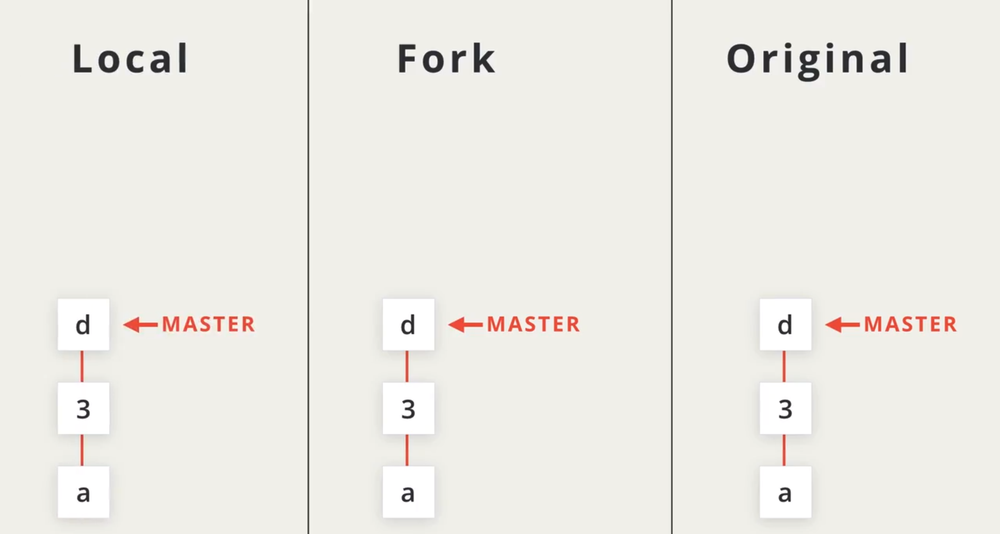
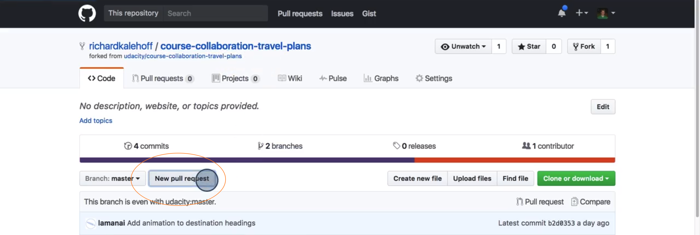
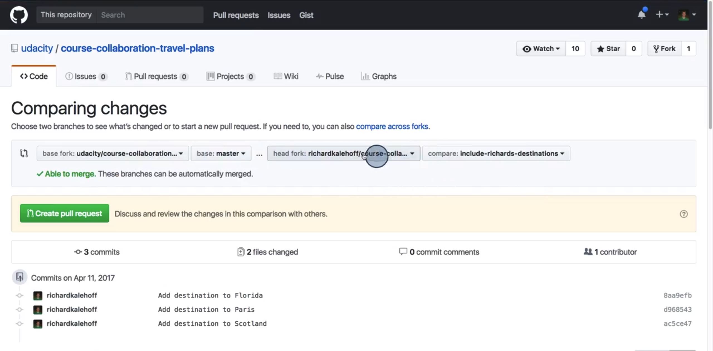
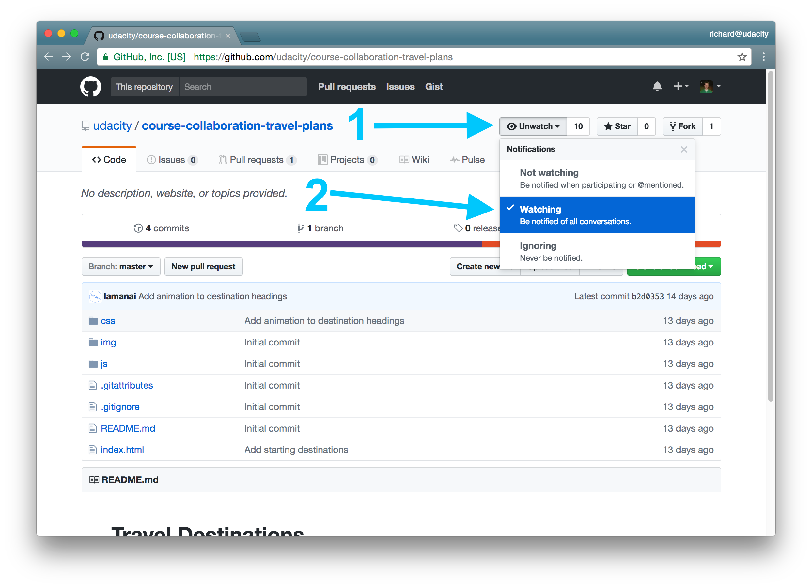
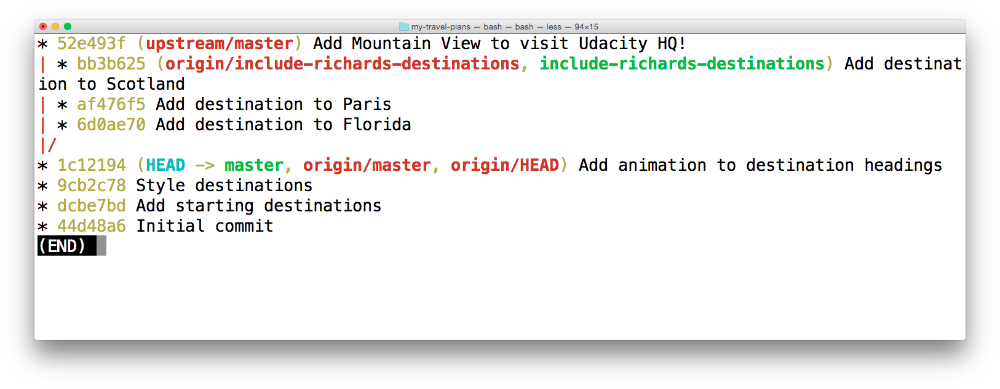
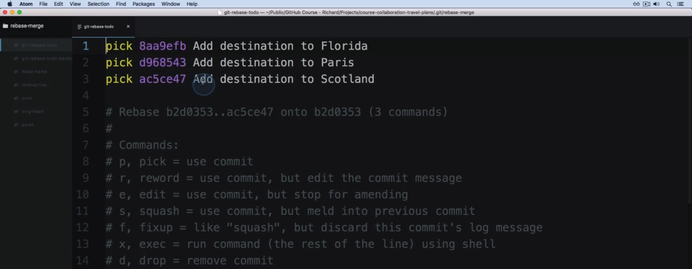
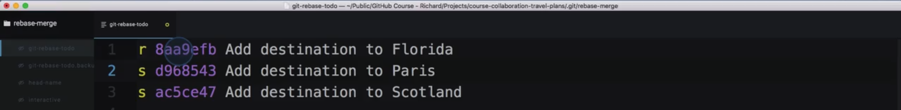

# 课程3：与远程仓库保持同步

> 你将学习如何使用 Pull Request（拉取请求）向其他开发者发送建议的更改，以及如何使用强大的 `git rebase` 命令将 commit 压制（squash）在一起

---

[TOC]

---

在第一节课，我们学习了如何处理远程仓库。

在第二节课，我们学习了如何在共享仓库上进行开发。

现在我们将学习如何将新的更改同步到被 fork 的远程仓库副本上，以及如何从原始源仓库获取更新。

我们将在这节课学习的内容包括：

- 什么是 Pull Request 以及如何发出 Pull Request
- 获取在源仓库中作出的更新，并将它们加入 fork 仓库副本中
- 处理活跃的 Pull Request
- 使用 git rebase 压制 commit

我们先看看什么是 Pull Request 以及如何创建.

---

### 2. 创建 Pull Request

**Pull Request（拉取请求）**是向**初始**或**源仓库的**维护者发出的请求，以让其将你在他们项目的 fork 上所做的更改应用在他们的项目中。你请求他们**拉取**你做的更改。

我们先对后面的内容进行简要概述，然后再深入学习。

---

假设这个仓库有 3 个 commit，master 分支指向了最后提交的 commit。注意，这些 commit 的方向并不重要。通常我都水平显示这些 commit，但是现在需要转换为垂直方向，这样才能显示所有必要信息。 

这个仓库不属于我们，它是属于其他开发者的，因此我们决定 fork 它。


记住，我们在 fork 仓库时，创建的是完全相同的副本，因此这两个仓库将具有完全相同的 commit。它们的分支也会指向相同的 commit。

要创建 Pull Request 我们需要在我们的 fork 副本中添加新的 commit，因此将我们的 fork 副本克隆到本地机器上。



我们创建一个 BUGIFX 分支并提交几个 commit 来修复错误。然后将 BUGFIX 分支推送到我们的 fork 副本上，以让这些新的 commit 出现在远程仓库上。我们通过将更改推送至我们的 fork 副本上做好了 Pull Request 的所有准备工作。


现在我们将真正创建 Pull Request。稍后我们将了解如何在 GitHub 上执行这一操作。

如果 Pull Request 被原始仓库的维护者接受了，commit 将被添加到他们的仓库中，创建一个合并 commit 以将我们的心 commit 与他们的现有 commit 合并。


他们的 master 分支将使指针移到这个新的合并 commit 上。


---

接下来我们演练发出 Pull Request 的步骤！如果你一直在跟着我操作，那么现在应该已经将 Lam 的[旅行计划仓库](https://github.com/udacity/course-collaboration-travel-plans)fork 到了自己的帐户，并对 fork 的版本做了一两个额外 commit。

在上一课中，我创建了一个名为 `include-richards-destinations` 的特性分支，向其中添加了一些 commit，并将该分支推送到了 GitHub。记住，当你创建一个 Pull Request 时，你要将所有更改放在一个专用于这些更改的分支上，还记得我们如何称呼这种类型的分支吗？...特性分支！

##### 我们要创建 Pull Request 了（多么令人激动呀！），先确保我们具有相同的设置。请回答以下问题：

Task List

- 我 **fork** 了 Lam 的[项目](https://github.com/udacity/course-collaboration-travel-plans)
- 我创建了一个特性分支，并赋予了它一个描述性名称
- 我在我的分支上至少做了一个 commit
- 我将我的更改推送至**我的** fork

---

这是我账户下的 course-collaboration-travel-plans 项目页面，是从 Lahm 那 form 的。


我想把这个项目的更改添加到她的项目中，这是就需要使用 pull request（拉取请求）功能。

这里有一个 New pull request 按钮。



我们可以从这个页面发送一个新的 pull request，这里显示的是，比较我的项目库中的 master 分支和 Lahm 项目中的 master 分支。现在没有什么可比较，因为两个分支现在都指向一样的提交。


现在转到我刚刚推送的新分支。



让我们花点时间看下这里，这块稍微有点绕。（上图）

这是我的项目和我的分支，现在要用我的分支和 Lahm 项目的 master 分支比较。下列列出了的就是她的 master 分支和分支之间的差异。

我的分支比她的项目的 master 分支多了 3 个 commit，并且改动了 2 个分件。


这显示的是 commit 和下面是发生改动的文件（上图）。css 文件中添加了一些代码，index 文件里添加了一些代码。

 点击 Create pull request 按钮，页面发生了点变化。 现在看到的表单就是我们实际发送 pull request 的地方。


pull request 的标题位置自动填充为你的分支名称。这就是为什么我们建议尽量用通俗易懂的名字来命令分支的另一个原因。

在添加更多描述信息的地方是支持 Markdown 语法的。✈️🚋🚢

然后我们下拉页面，单机 Create pull request 按钮。

注意，现在我们已经不在我的项目页面了。而是转到了 Udacity 的账户下 Lahm 的项目页面，我们也从 Code（代码）页面自动转到 Pull request 页面的 Conversation（对话）标签下。


Conversation 中包含了一些信息，包括我发送的描述信息和 commit 信息。我们可以在 Commits（提交）标签看到详细提交信息。


也可以在 Files changed（文件变动）标签看到文件的具体变化。


让我们回到 Conversation 标签。向下拉，我们看到这个分支和 Lahm 项目的 master 分支没有冲突，但我们现在不能处理这个 pull request，需要 Lahm 来判断是否需要将 pull request 中的更改加到她的 master 分支里。因为她是这个仓库的拥有者。


---

你刚创建了一个Pull Request！恭喜！ 🙌🏼

如你所见，创建 Pull Request 实际上并不难。当我第一次学习 Git、GitHub 以及如何进行协作时，我对提交 commit 和使用远程仓库感到非常紧张，但*尤其*担心向其他开发者的项目提交 Pull Request！只要你遵循上一节课中介绍的步骤：

- 阅读项目的 CONTRIBUTING.md 文件
- 查看项目现有的 Issues
- 与项目维护者交流

...你的 Pull Request 一定会被采用！

### 小结

Pull Request 是让源仓库拉取你的 commit，并融合在其项目中的**请求**。要创建 Pull Request，你需要完成一些操作：

- 你必须 **fork** 源仓库
- 将你的 fork 克隆到你的计算机
- 进行一些 commit（最好是在特性分支上！）
- 将 commit 推送回**你的 fork**
- 创建一个新的 Pull Request，并选择包含你的新 commit 的分支。

---

## 3. 与源项目保持同步

当你在对仓库进行更改的特性分支上工作时，该仓库可能会从原作者处接收更新。

### Star（收藏）和 Watch（关注）

如果你想跟进仓库的动态，GitHub 提供了一个非常方便的方式 - 它能让你 star 仓库：

[*Star 按钮和仓库的级别*](https://classroom.udacity.com/courses/ud456/lessons/e295524f-87b6-4981-af74-6b20231dc7c1/concepts/48825e17-72c6-4c3e-9c98-1add66bf1c86#)

你可以前往 <https://github.com/stars> 列出和过滤你 star 过的所有仓库。

如果你想跟踪特定仓库，star 非常有用。但是，如果你想实时跟进仓库的发展就不行了，你得手动前往收藏页面查看仓库，以检查它们是否发生变化。

> #### 💡 Star 和受欢迎度 💡
>
> Star 是能帮助你跟踪感兴趣仓库的一个有用功能，同时也成为了衡量仓库受欢迎程度的手段。
>
> 如果你对提升仓库的星级不感兴趣，不如了解一下 "watch" 仓库。现在就在看看吧！

### Watch 仓库

如果你要跟进一个项目的变化，并希望接收变更通知，GitHub 为你提供了 "Watch" 功能：

[*通知设置页。"Watching" 一个仓库会通知你仓库的所有活动。*](https://classroom.udacity.com/courses/ud456/lessons/e295524f-87b6-4981-af74-6b20231dc7c1/concepts/48825e17-72c6-4c3e-9c98-1add66bf1c86#)

如果你频繁地在一个仓库上工作，那么我建议你将 watch 设置改为"Watching"（持续关注）。这样，当该仓库发生任何活动时，GitHub 都会通知你，例如当有人向仓库推送变更，创建了新的 Issues，或者在现有 Issues 中添加了评论。

### 加入上传更改

现在你了解了 watch 仓库的好处，假设你在 watch 一个仓库，这时收到一个通知说有一些 commit 被推送到了初始源仓库。你如何让这些更改进入你 fork 的仓库副本中？如果你想继续在你的 fork 上进行开发，那么就需要让你 fork 的副本尽可能与源仓库保持同步。

来看看如何让这些变更从远程仓库进入我们自己的仓库。 instructor_notes: ''

---

这是我们的原始仓库，这是原始仓库的 fork 副本，这是 fork 副本的克隆。


假设我们想 fork 原始仓库来解决一些错误。因此我们在本地对 bugfix 分支进行了更改，然后推送至我们的 fork 副本上。但是当我们进行这些更改时，原始项目的维护者向仓库中添加了一些自己的 commit。


现在我们的 fork 副本和本地资源的 master 分支与原始仓库不同步了。为了将这些新的更改添加到本地机器上，我们需要从原始仓库中 fetch 这些更改。

我们已经有我们的远程仓库的链接了，因为在克隆时，Git 自动为我们创建了一个链接，并为此链接设定了一个缩略词 origin。但是哦我们可以手动设置一个与原始远程仓库之间的连接。通常我们将其简称为 upstream。


我们加上简称 origin 和 upstream 这样可以轻松地指代它们。

我们已经建立了与原始远程仓库之间的新 upstream 连接。我们来显示位于本地仓库中的远程分支。如果我们从 upstream 仓库中获取 commit，结果将是这两个 commit 和 upstream/master 分支。


这些颜色可能有点误导人。我们来显示下每个分支与远程仓库的关系。将本地仓库设为红色，fork 仓库设为黄色，原始仓库设为蓝色。bugfix 分支和 master 分支都位于本地仓库中。并且将它们 Push 到 fork 上了。


Git 知道远程分支在哪，因此 origin/bugfix 和 origin/master 分支显示在本地仓库中。原始仓库中只有 master 分支，因为我们获取了 upstream 更改，因此 upstream/master 分支显示在了本地仓库中。

我们回到按照分支标注颜色的原始显示模式，如果我们在 master 分支上合并 upstream/master 分支，我们的 master 分支将执行快进合并以合并 commit c 。如果我们想合并 bugfix 分支，这将会创建一个新的合并 commit 并使 master 分支指向它。


---

假使 Lam 开始对她的项目进行更改了，我的 fork 中不会获得这些更改，我要将她的项目添加为额外远程仓库，以便与她保持同步。

在我的本地仓库中，我已经有一个远程仓库了，那就是 `origin`。

[*终端显示了与远程仓库的现有连接。这是我的简写名为 origin 的远程仓库。*](https://classroom.udacity.com/courses/ud456/lessons/e295524f-87b6-4981-af74-6b20231dc7c1/concepts/48825e17-72c6-4c3e-9c98-1add66bf1c86#)

注意 `origin` 一词只是第一次 `git clone` 远程仓库时使用的**默认**名称。我们将使用 `git remote` 命令来向此列表**添加一个新的**简写名和 URL。这会提供给我们一个与源仓库之间的连接。

```shell
$ git remote add upstream https://github.com/udacity/course-collaboration-travel-plans.git
```

注意我使用名称 `upstream` 作为引用源仓库的简写名。与 `origin` 简写名一样，这里的 `upstream` 一词也并不特别；这只是一个常规的词。它可以是任何词... 比如 "banana"。但 "upstream" 一词通常用于引用源仓库。

我们来看看在添加了新的远程仓库后，远程仓库的列表现在是什么样的：

[*终端显示了关于这两个远程仓库的信息 - origin 和 upstream。*](https://classroom.udacity.com/courses/ud456/lessons/e295524f-87b6-4981-af74-6b20231dc7c1/concepts/48825e17-72c6-4c3e-9c98-1add66bf1c86#)

### Origin 与 Upstream 差别

现在令人困惑的一点可能是 `origin` 与 `upstream` 之间的差别。其中，`origin` 指的**不是**我们 fork 自的源仓库（也称为**"初始"**仓库），而是指我们 fork 后的仓库。虽然它叫 `origin`，但实际并不是初始仓库。

记住，`origin` 和 `upstream` 只是默认或实际名称。如果你觉得将 `origin` 远程仓库命名为 `mine`，`upstream` 远程仓库命名为 `source-repo` 对你来说更清楚，那么你尽可如此命名。你在本地仓库如何命名远程仓库完全不影响源仓库。

[*使用 git remote rename 命令将 origin 重命名为 mine，以及将 upstream 重命名为 source-repo。*](https://classroom.udacity.com/courses/ud456/lessons/e295524f-87b6-4981-af74-6b20231dc7c1/concepts/48825e17-72c6-4c3e-9c98-1add66bf1c86#)

> #### ⚠️ 重置远程仓库名称 ⚠️
>
> 上面的图显示了远程仓库的重命名，但我已经使用以下命令将它们变回了默认/实际名称 `origin` 和 `upstream`：
>
> ```
> $ git remote rename mine origin
> $ git remote rename source-repo upstream
> ```

### 拉取上游变更

现在，要获得上游远程仓库的更改，我们只需运行 `git pull` 并使用 `upstream` 简写名，而不是 `origin` 简写名：

```
$ git pull upstream master
```

[*终端显示了运行 git fetch upstream master 的结果。一个新的分支添加到了本地仓库。*](https://classroom.udacity.com/courses/ud456/lessons/e295524f-87b6-4981-af74-6b20231dc7c1/concepts/48825e17-72c6-4c3e-9c98-1add66bf1c86#)

#### 习题 1/2

现在你已向新的 `upstream` 远程仓库添加了一个连接，如果你运行 `git fetch upstream master`，它会更新你在 GitHub 上 **fork 的仓库**吗？

- 是
- 否
  - `git fetch` 只更新本地仓库。要更新 GitHub 上的项目，我们需要将这些新获取的 commit 推送到我们的 fork。 


现在，我们已从**上游远程仓库**获取了所有更改，接下来查看日志，看看我们的本地仓库中有哪些新信息。我使用 `git log` 命令来确保显示所有分支的**所有** commit（包括远程和跟踪分支！）：

```
$ git log --oneline --graph --decorate --all
```

[*终端在获取 upstream 远程仓库的变更后，显示了我的本地仓库的日志。*](https://classroom.udacity.com/courses/ud456/lessons/e295524f-87b6-4981-af74-6b20231dc7c1/concepts/48825e17-72c6-4c3e-9c98-1add66bf1c86#)

在提交说明的包裹下阅读可能有点困难，但你应该能看到，现在本地 `master` 分支前有一个 `upstream/master` 远程分支。`upstream/master` 位于 commit `52e493f` 上，而 `master` 分支位于 commit `1c12194` 上。

我们可以**使用 `upstream/master` 分支来跟踪源仓库 master 分支的位置**。现在，我们可以运行 `git fetch upstream master`，获取对源仓库的`master`分支所做的更改。


使用 `git fetch upstream master` 命令拉取了 `upstream` 远程仓库的 `master` 分支上的更改。

如果我们想获取 `upstream/master` 更改**并**将它们合并到`master`分支，我们应使用什么命令？

>在关于远程仓库的课程上提到过，`git pull` 就等于 `git fetch` + `git merge`！ 


要向 Lam 的仓库推送这些新更改，我们不想运行 `git push origin upstream/master`，因为 `upstream/master`不是本地分支。要将这些更改融入我 fork 的她的项目版本，我可以将 `upstream/master` 合并到一个现有分支中（例如本地 `master` 分支）然后推送它。

```
# 确保我位于正确的合并分支上
$ git checkout master

# 合并 Lam 的更改
$ git merge upstream/master

# 将 Lam 的更改发送到*我的*远程仓库
$ git push origin master
```

### 小结

当在你 fork 的项目副本上工作时，初始项目的维护者会继续向他们的项目添加更改。你需要将你的 fork 副本与他们的项目保持同步，以包含他们所做的任何更改。

要将源仓库的更改提取到你在 GitHub 上 fork 的仓库副本，你需要：

- 获得源仓库的可克隆 URL
- 使用 `git remote add` 命令创建一个新的远程仓库
  - 使用简写名 `upstream` 指向源仓库
  - 提供源仓库的 URL
- 获取新的 `upstream` 远程仓库
- 将 `upstream` 的分支合并到本地分支
- 将新更新的本地分支推送到你的 `origin` 仓库

---


## 4. 管理活跃 PR


项目维护者可能不会立即决定接受你的更改。他们可能会要求你对代码做一些额外更改，才会接受你的请求并合并你的更改。他们很可能会通过 Pull Request 页面的 Conversation（对话）传达他们想要的更改。

[*项目维护者要求对 Pull Request 进行一些更改。*](https://classroom.udacity.com/courses/ud456/lessons/e295524f-87b6-4981-af74-6b20231dc7c1/concepts/adbf1b90-e1c6-4502-8856-d5207bff78b5#)

可以看到源仓库的所有者进行了评论，并要求我们将 commit 结合在一起。

我越来越喜欢 Git 命令行工具和 GitHub 界面的一个原因在于，它们会提供下一步操作的建议，这非常有帮助。在评论区底部附近，GitHub 有一个建议，告诉我们如何添加更多的 commit；我们需要将它们添加到同一个分支并推送到我的分支：

> Add more commits by pushing to the **include-richards-destinations** branch on **richardkalehoff/course-collaboration-travel-plan**.

在提交 Pull Request 时，记住你是要其他开发者将**你的**代码更改添加到他们的项目。如果他们要求你对你的 Pull Request 做一些小的（甚至是大的！）更改，这并不代表他们拒绝你的工作！只是他们希望以特定方式将你的代码添加到他们的项目中。

你应按照 CONTRIBUTING.md 文件列出项目维护者所需的所有信息，所以请遵照其中的信息。但有时项目维护者可能会要求你做一些其他事情。

那你该怎么做呢？如果你希望你的 Pull Request 被接受，那就执行要求的更改！记住，GitHub 中的选项卡称为"Conversation（对话）"选项卡。所以随时与项目维护者进行沟通，以明确他们希望你做什么。

你也应感谢他们花时间查看你的 Pull Request。大多数开源项目的开发者都是在免费做这些事情，所以记住：

- 善待他人 - 项目维护者只是像你一样的普通人
- 耐心 - 他们会尽快回复

Lam 要求我将我的更改结合在一起，之后她才会合并我的 Pull Request。将 commit 结合在一起是一个称为压制的过程。我们来看看怎么做！

### 小结

就像看起来那么简单，主动发起 commit 请求主要在于沟通！

如果项目维护者要求更改 Pull Request，则：

- 在你的 Pull Request 所基于的本地仓库的同一分支上添加一些必要 commit
- 将该分支推送到**你的**源仓库 fork 副本

这些 commit 最终将显示在 Pull Request 页面上。


---


## 5. 压制 commit

git rebase 命令比较难以理解，如果你在网络上搜索该命令就会搜到很多警告，提醒这个命令很危险，会销毁仓库。如果这都不能阻止你尝试该命令的话，我想不出还有什么可以了。

实际上这个工具很强大，只需几步就能删掉大量仓库内容，但是并没有你想象的那么危险。在使用 git 命令时销毁 git 仓库几乎是不可能的。

我们将使用 git rebase 来进行压制（squash）**，压制就是将多个 commit 合并成一个 commit。**

假设你正在创建一个新功能，最新的三个 commit 只是修改拼写错误，借助 git rebase，你可以将这三个 commit 合并成一个更大的 commit。

我们来了解下详细内容。

---

要将 commit 压制在一起，我们要使用非常强大的 `git rebase` 命令。这是我**最爱的**命令之一，但我的确用了**很久**才掌握它。起初，我很难搞清楚它的工作原理，然后（在网上读了无数警告之后），我开始害怕实际使用它，因为担心它会不可逆转地破坏我的项目的 Git 历史。

但是现在我想告诉你，`git rebase` 实际并没有那么难，你可以勇敢地对你的仓库进行更改，而无需担心造成任何损害！（<-- 听起来相当鼓舞人心，对不对？！）我们首先概述一下压制的工作原理，然后将实际使用 `git rebase` 命令进行一些压制。

---

假设有这么一个 git 仓库，我们发现最后几个 commit 只是一些小的更改，例如拼写错误更改。如果将这些 commit 合并成一个 commit，git log 中会显示的更清晰。


我们可以运行 `git rebase -i HEAD~3` 将最后三个 commit 合并或压制成一个 commit。注意 HEAD 指向当前位置。对我们来说，我们位于 master 分支上，因此 HEAD 指向 master 分支。HEAD~1 是 HEAD 前的一个 commit，是当前所在 commit 的上一个或父 commit。HEAD~2 是 HEAD 前两个 commit，是祖父 commit。那么，很简单，HEAD~3 是 HEAD 前 3 个的 commit，是当前所在 commit 的曾祖父。我们不希望删掉 HEAD~3 所指向的 commit 8，这是 git rebase 命令，因此，我们使用 HEAD~3 作为基底，其他 commit 将被放在这个 commit 上。

听起来有点难，最简单的记法就是，如果你想压制（Squash）17 个 commit，只需要使用数字 17 即可，因此将变成 HEAD~17。

运行 `git rebase -i HEAD~3` 将使我们所在的 commit 和前两个 commit 压制为一个 commit，这样会创建一个新的 commit SHA 并移动 master 分支使其指向这个新的 commit。


但是注意没有分支指向原来的 commit，因此它们不会出现在 git log 输出结果中。git 最终将完全清除它们。


如果你担心损坏仓库并想要备份下，那么就需要进行备份，我们马上重新开始。

当我使用 git rebase 时，我创建了一个直接叫做 backup 的分支，将其放在和要 rebase 的分支所在的位置相同的位置。我依然在 master 上，因此没有检出 backup 分支。我将运行相同的命令，这样使多个 commit 压制为一个，并使 master 指向这个新的 commit，但是原始 commit 没有被删除，且依然会显示在 git log 输出结果中，因为有一个分支指向了它们。


---


我使用的命令是：

```
$ git rebase -i HEAD~3
```

### rebase 命令

`git rebase` 命令会将 commit 移动到一个**新基底（base）**上。在命令 `git rebase -i HEAD~3` 中，我们告诉 Git 使用 `HEAD~3` 作为其他所有 commit （`HEAD~2`、`HEAD~1` 和 `HEAD`）将连接到的基底。

命令中的 `-i` 代表"交互式"。你*可以*在非交互模式下执行 rebase。在你学习如何 rebase 时，我明确建议你进行*交互式* rebase。

#### 祖先引用

简短回顾一下，`HEAD` 表示你当前的位置（它可以指向多个东西，但通常会指向分支名称或直接指向一个 commit 的 SHA）。这里的 `~3` 指"三个之前"，所以 `HEAD~3` 将是你当前所在的 commit 向前三个的 commit。我们将在 `git rebase` 命令中使用对 commit的这种相对引用。

我来演示一下如何使用此命令将三个目标 commit 组合成一个。

---

让我们使用 `git rebase -i HEAD~3` 压制（squash）最后三个 commit，这样就会显示我们在项目中提交的最后三个 commit。



要注意的一点是，这些 commit 按逆向时间顺序显示。底部的这个（ac5ce47）实际上是最近的 commit。

现在看看每列

- 最后一列是提交说明。
- 中间一列是 commit SHA。
- 第一列是你输入的，希望 git rebase 实际执行的命令。

git rebase 是个很强大的工具，具有多个命令。下面列出了这些命令。（注释中，Commands 以下的部分）

可以看到目前这些都是 pick，pick 表示使用这个 commit。因此，如果保存文件并立刻退出，这三个 commit 都会被保存。虽然我们使用 rebase 并准备压制这些 commit，但是如果将这些命令设为 pick，所有这三个 commit 都会存在，并且将具有不同的 SHA。

Lam 想要将最后三个 commit 压制成一个，实际上是其中一种命令，也就是这里的 s 或输入整个单词 squash（压制）。

squash 表示使用这些 commit，但是合并到前一个 commit 中。我们对这个 commit（第三个 commit） 输入 s 表示 squash，并将第二个 commit 的命令改为 s，但是第一个 commit 不能改为 s，因为这个 commit 前面没有 commit，所以会导致错误，因此这个需要保持为 pick。


如果使用这些命令，pick、squash 和 squash，它将会把这两个 commit 压制到这个 commit 中（第一个 commit），但是将使用这个提交说明（原始的），这样便会有误导性。因为我们添加的是目的地 Florida、Paris 和 Scotland，因此我们希望重写新的提交说明替代它。

实际上有一个命令可以使用，也就是 reword 或者简写 r。我们将 pick 改为 r。



这里再重新说一下我们这几个命令

- r 命令将会使我们重新编写这个提交说明，因此我们将保留这个 commit，但是会更改提交说明。
- s 表示将这个 commit 压制到上一个 commit 上。
- 第三个也类似，commit 将压制到上一个 commit，然后同时合并到第一个 commit 中。

我们保存这个文件并退出编辑器进行 rebase（变基）。

我们要执行的 rebase 是多步骤流程。第一步是重写这个提交说明，我将其改为 Add Richard's destinations。


保存文件然后退出编辑器并继续 rebase 流程。

这是 rebase 的最后一步，可以看出这是前三个 commit 的合并 commit（因为注释里有写），这是我们将压制的 commit，第一个 commit 即三个 commit 中最早的 commit 是我们刚刚重写过提交说明的 commit，"Add Richard's destinations" ，剩下的是第二个和第三个 commit 的提交说明。


接下俩我们删除掉不需要的说明，并将 Add Richard's destinations 作为提交说明。注意开头有 # 的行都是注释，不会出现在提交说明中，所以我们可以删除掉它们。


保存文件，然后退出编辑器并完成 rebase。成功了，我们 rebase 了最后三个 commit。


快速查看下 git log。

可以在这里看到 include-richards-destinations 分支在 master 分支前只有一个 commit，但是在远程仓库上有三个 commit。这三个 commit 被压制到这个 commit（也就是现在 HEAD 所指向的） 上。


我们接下来尝试将此分支推送到远程仓库上，可以看到这个推送被拒绝（rejected）了，因为远程仓库具有这个仓库没有的 commit。


因此我们需要强制推送这些更改，OK 了。


这是 Pull Request（拉取请求）页面，还尚未刷新。可以看到原始的三个 commit 列在了这里以及这里。


如果稍微向下滚动，一看到我在这个 Pull Request 上创建了新的 commit。这是我们强制推送的 commit。


现在滚动到顶部并刷新页面，可以看到所有这些数字变了，这里列出的三个 commit 消失了，这个 Pull Request 显示 Pull Request 中只有 1 个commit。


转到 Files changed 标签页会发现更改完全一样，只是现在都合并成了一个 commit。

---

在该命令中：

```
$ git rebase -i HEAD~3
```

`HEAD~3` 是即将被变基的 commit 的新基底的祖先引用。

以下哪项可以作为基底引用？

- SHA
- 分支名称
- 标签名称

你可以使用其中的任意一项为对新基底 commit 分支位置的引用。 

#### 强制推送

在此视频中，我必要要强行推送分支。我不得不这样做，因为 GitHub 试图阻止我意外删除 commit。因为我使用了 `git rebase` 命令，实际上**清除**三个分别记录我添加了佛罗里达、巴黎和苏格兰的 commit。我使用 `git rebase` 将这些 commit 合并或**压制**为单个 commit。

使用 `git rebase` 会创建一个具有新 SHA 的新 commit。当我尝试使用 `git push` 将此 commit 推送至 GitHub 时，GitHub 知道接受此推送会删除那三个单独 commit，所以它拒绝了。因此，我不得不使用 `git push -f` **强制推送**这些 commit。

> #### ⚠️ 强行推送 ⚠️
>
> 在这个例子中，强行推送我的 commit 非常必要。如果你尝试推送 commit 而 GitHub 拒绝了它们，这实际上是对你的一种帮助，确保你已经审查过正在推送的 commit **和** GitHub 上的 commit，以验证你不会意外覆盖你在远程仓库上存储的内容！

### rebase 命令

来看看你可以使用 `git rebase` 执行哪些不同的命令：

- 使用 `p` 或 `pick` – 使 commit 保持原样
- 使用 `r` 或 `reword` – 保留 commit 的内容，但修改 commit 说明
- 使用 `e` 或 `edit` – 保留 commit 的内容，但先不要执行 commit，以便：
  - 添加新内容或文件
  - 删除内容或文件
  - 修改即将 commit 的内容
- 使用 `s` 或 `squash` – 将此 commit 的更改结合到之前的 commit 中（列表中位于其上面的 commit ）
- 使用 `f` 或 `fixup` – 将此 commit 的更改结合到前一个 commit 中，但删除提交说明
- 使用 `x` 或 `exec` – 运行 shell 命令
- 使用 `d` 或 `drop` – 删除 commit

### 何时变基

可以看到，`git rebase` 命令非常强大。它可以帮助你编辑提交说明、重新排序 commit、合并 commit 等，真的是一款非常强大的工具。现在的问题是"应该**何时**进行变基？"。

每当你对 commit 进行变基，Git 将**为每个 commit** 创建一个新的 SHA！这有很大的影响。对于 Git，SHA 为 commit 的标识符，因此不同的标识符代表着不同的 commit，**无论内容是否发生了变化。**

如果你已推送了你想进行变基的 commit，则不应变基。如果你在与其他开发者协作，那么他们可能已经在使用你推送的 commit。如果你随后使用 `git rebase` 来进行更改，并强行推送 commit，则其他开发者现在将无法与远程仓库同步。他们需要对自己的 Git 仓库进行一些复杂的手术，使它们的仓库回到工作状态……甚至可能连这一点都做不了；他们可能得抛弃之前的所有工作，使用你新变基过且强制推送的 commit 重新开始。

### 小结

`git rebase` 命令可以用来做很多事情。

```
# 交互式 rebase
$ git rebase -i <base>

# 交互式地将 commit 变基到我们当前所在的 commit 向前三个的 commit
$ git rebase -i HEAD~3
```

在 commit 的交互式列表中，所有 commit 都以 `pick` 开头，但你可以使用其他命令（`reword`、`edit`、`squash`、`fixup`、`exec` 和 `drop`）进行变换。

我建议你在变基**之前**创建一个备份（backup）分支，这样便能很容易返回到之前的状态。如果你对变基的结果满意，则可以删除 `backup` 分支！

### 进一步研究

- Git 分支 - 变基：[英](https://git-scm.com/book/en/v2/Git-Branching-Rebasing)|[中](https://git-scm.com/book/zh/v2/Git-%E5%88%86%E6%94%AF-%E5%8F%98%E5%9F%BA)：来自 GitBook
- [git-rebase](https://git-scm.com/docs/git-rebase)：来自 Git 文档 (**英**)
- <https://www.atlassian.com/git/tutorials/rewriting-history#git-rebase>：来自 Atlassian 博客 (**英**)


## 6. 总结

我简要地整理一下你在此课程中学到的所有非常棒的新技能。现在，你已经知道：

- 如何设置远程仓库
- 如何将更改推送到远程仓库并从中获取更改
- 如何 fork 仓库
- 开始处理新功能或项目更改前，要采取的初步步骤
- 如何创建 Pull Request
- 了解与项目其他利益相关者清楚、频繁沟通的重要性

---

记住，孰能生巧。不妨通过接触开源项目磨炼新掌握的技能。

你可以向文档中添加内容，或提供一两个示例代码。甚至可以将材料翻译成你的母语。

请参阅下方的链接，了解如何开始与他人合作。

你可能觉得这门课程很简单，也可能觉得很有挑战。但重要的是，了解这些技能和技巧是学会如何有效合作的第一个重要步骤。

**网络系统是由世界各地的人们合作构建的**，现在你也掌握了加入这个生态系统的技能。加油，你可能迫不及待地想要看看你的成果了。


---

- [http://up-for-grabs.net/ (英)](http://up-for-grabs.net/#/)
- [http://www.firsttimersonly.com/ (英)](http://www.firsttimersonly.com/)
- [GitHub 上的（仅）初学者标签 (英)](https://github.com/search?utf8=%E2%9C%93&q=label%3Afirst-timers-only+is%3Aopen&type=Issues&ref=searchresults)
- ["仅初学者"博文 (英)](https://medium.com/@kentcdodds/first-timers-only-78281ea47455)
- [Git Community Book 中文版](http://gitbook.liuhui998.com/index.html)
- git-tips: [英文版](https://github.com/git-tips/tips) | [中文版](https://github.com/521xueweihan/git-tips)

想看看开发者的第一个 Pull Request 是什么？查看 <http://firstpr.me/>