# Shell 讲习班

[TOC]

---

## 1. 欢迎！

我们来聊聊 shell 。它是在**计算机上运行程序的<u>命令行界面</u>**。

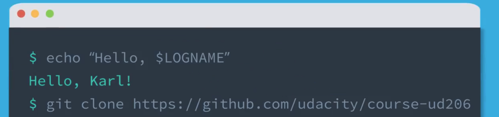

你在命令提示符下键入命令，shell 会为你运行程序，并显示输出。开发人员经常使用它，因为它快速灵活。

此外，绝大多数 Web 服务器都在 Linux 上运行，而 **shell 是在 Linux 服务器上<u>进行部署</u>和<u>远程管理</u>的重要工具**。但是，相比于使用图形环境或 GUI（读音：故意），在使用 shell 时，你确实需要记住一堆**神奇的词和咒语**。作为回报，一旦你有了实战经验，就能非常快速地执行命令而无需进行各种指点和点击。这跟编程很像。

如果你在浏览器中用过 JavaScript 控制台（Console）或任何其他编程语言解释器，会发现 shell 命令行的原理与它们几乎是一样的。

你使用专门语言输入指令，系统运行它们，然后在下面显示输出，之后你会得到另一个**新的提示符，**你能选择重复相同的操作。

**JavaScript 控制台是作用于浏览器的命令行，而 shell 是广泛作用于计算机的命令行**。它**能够调用文件和目录**，**运行程序并与其他计算机进行交互**。**如今，我们把用于与 shell 交互的程序称为<u>终端程序(Terminal Program)</u>。**（意思是我们看到的命令行界面并不是真正的 shell？）

如果你使用的是 Mac 或 Linux 那么你已经有一个很好的终端程序了。如果你用的是 Windows 那就让我们来看看如何安装与 Mac 和 Linux 上具有相同作用的 shell 和终端程序。

Windows 有一个内置的命令行 shell，它是基于旧的 MS-DOS 命令行，而非基于 UNIX。对于 Web 开发者来说，UNIX 风格的 shell 更接近于行业标准，因为有大量的网站及应用运行在 Linux 服务器上。

具体来说，是使用 **Bash shell**，这种迄今为止使用最多的 UNIX 风格的 shell。

在这节课中，我们要做的第一件事是让你快速上手并在终端里运行你的第一条命令，然后我们将快速演练用于导航文件与目录的 shell 命令。你将学习：

- 从 Web 下载文件
- 查看文本文件的命令并自定义 shell，来让它变得更加易于使用。

## 2. Windows：安装 Git Bash

首先我们要安装一个 Unix 风格的 shell，那么，我说的“Unix 风格”是什么意思呢？

那就是它兼容 Linux 和其他类 UNIX 操作系统，因为**大多数 Web 服务器都是在这些系统上运行的**。

Windows 继承的体系结构与 Linux 操作系统不同，因此要多花一点功夫才能使其与其他的系统兼容。

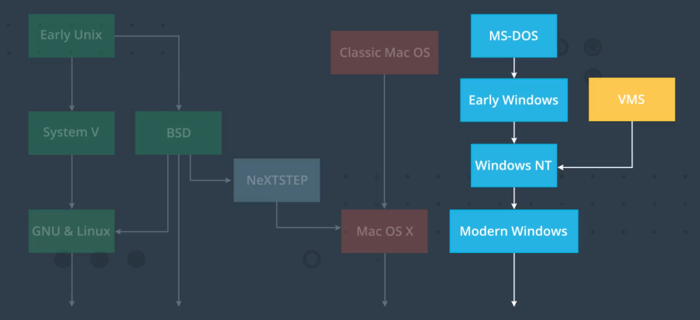

但是没关系，Windows 平台上的 Git 版本控制软件自带最受欢迎的 UNIX 风格 shell，它叫做 Git Bash，要安装它，我们要先安装 Git。

**提醒：本页面仅针对 Windows 设备！Mac 和 Linux 用户请跳到下个页面！**

从以下网页上下载 Git：<https://git-scm.com/download/win>

## 3. 打开终端

最终使用哪个终端程序并不重要（无论是 mac 上的 terminal 还是使用 git Bash），终端只是连接 Shell 和其中运行的其他命令行程序的一个接口，就像你的网络浏览器是连接网站和服务器的接口一样。

**你可以一次打开多个终端，每个终端都有自己的 Shell 实例，即你电脑上的一个单独进程**。如果你碰巧在一个终端执行操作时它无响应或是崩溃了，你可以随时使用另一个。

在学习此课的过程中，另一个会对你有帮助的技能是在网上查阅资料，网上有大量关于 Unix Shell 的相关资料。如果你想知道如何操作某个功能，或者寻找你从未见过的一个命令，尽管使用你最喜欢的搜索引擎吧。

## 4. 你的第一个命令（echo）

现在我们成功进入了终端，在终端窗口内，我们看到这里有两条消息和一个光标。

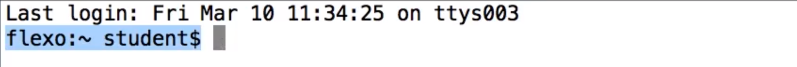

这条消息是 Shell 提示符（蓝色部分），**它通常用于显示关于<u>你登录的计算机的一些信息</u>**，你在这里具体会看到的消息取决于你的系统。稍后我们会学习如何更改它。

如果你在 Shell 提示符下输入内容并点击回车，Shell 会尝试将你输入的信息作为命令运行。

在此课程中，你将会学习一系列的 Shell 命令，这是第一个：

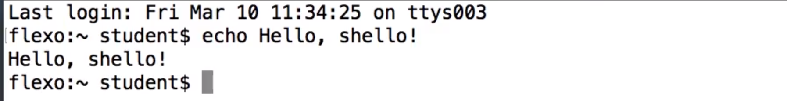

**echo 命令用于让 Shell 向我们打印信息，它就像 JS 中的 console.log  或 Python 中的 print**。

那么，如果我想让这句问候语显得更热情一点，该怎么做？

那就在 Hello，shello 后加两个感叹号，看着有点奇怪：

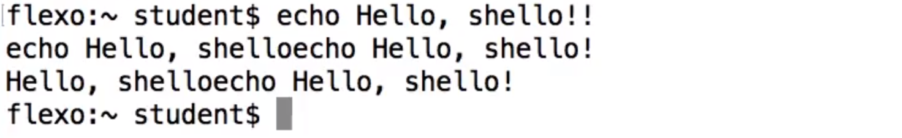

关键在于，有些字符对 Shell 具有特别的意义，感叹号就是其中之一。如果你在 Shell 中输入的内容被以奇怪的方式进行了处理，通常你需要做的是给它加上单引号。

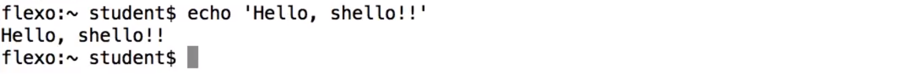

## 5. 浏览目录（ls，cd，..）

当你在图形界面中查看文件时，例如 macOS 的 Finder 或 Windows 的文件资源管理器，会有一个文件夹窗口用于显示特定文件夹或目录下子目录中的文件。

目录（directory）和文件夹（folder）基本上是同一回事，但是在 shell 中，我们要用“目录”相关命令。

**在 shell 中列出一个目录的内容，我们可以使用 ls 命令，ls 是单词 list（列表）的缩写**。

当启动 shell 时，它通常会从主目录开始，如果你只是运行 ls，它会打印出当前目录的内容。**要列出另一个目录，你可以输入 ls 后跟该目录的名称。**

**你也可以更改 shell 正在查看的目录，这么做的命令是 cd，代表 Change Directory（更改目录）**。在更改到特定目录后，仅适用 ls 便可显示该目录的内容。这项命令你会经常用到，**很多 shell 命令默认与当前目录交互**。

**如果你想返回一个目录，可以使用特殊目录名称 ..（两个点符号），这也称为父目录。**

**而分号 `;` 可以让你在同一行写两个命令，shell 将按顺序来运行它们。**

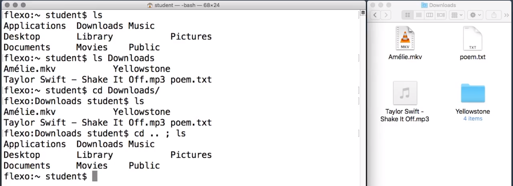

#### 练习题

哪些命令会列出 `Pictures` 目录下的内容？? 选择所有正确的选项 

- `ls Pictures`
  - `ls Pictures` 是最直接的方式。
- `cd Pictures; ls`
  - `cd Pictures; ls` 将目录改为 `Pictures` 子目录，然后在该目录中运行 `ls`。
- `ls Pictures/../Pictures`
  - `ls Pictures/../Pictures` 有点啰嗦，但是可行。

## 6. 当前工作目录（pwd）

在大量使用 cd 命令后，你可能会觉得晕头转向。根据你的系统 shell 提示符，它可能会，也可能不会告诉你当前所在的目录是哪个。

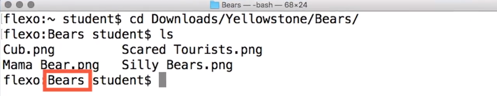

但是**有一个命令可以让你随时获取当前目录，那就是 pwd 命令，代表 Print Working Directory（打印当前工作目录）**

**当前工作目录**是 shell 当前**正在查看的目录**的另一种说法。它是 ls 等命令查看的默认目录，也是 shell 命令查找数据文件的默认位置。

你会注意到目录名称以斜杠分隔，Unix 系统使用正斜杠（forward slash）而非反斜杠（backslash）来**分隔目录名称**。

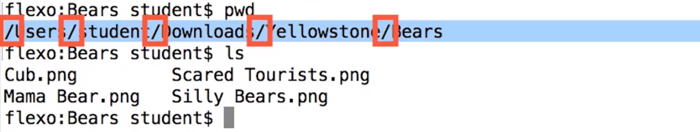

正斜杠与你在网络的 URL 中看到的一样，整个字符串（由斜杠分隔的多个目录名称组成）被称为**路径**。

有一些特殊的目录名，之前你看过 `..` 它指父目录，即当前目录的上一级。

 `.`是用于指代当前目录，`ls .` 等同于 `ls`。

shell 用 `~` 表示简写的我的主目录，比如，无论你变更到了哪个目录，`ls ~`将列出你的主目录。

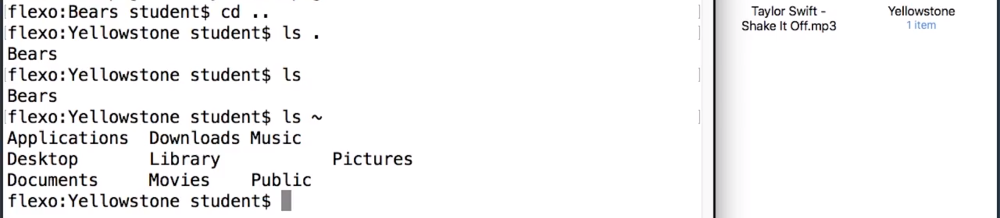

> 主目录就是直接打开终端时所在的目录。比如我在 windows 下使用 git Bash，默认所在的目录为我的账户目录。

为何 shell 命令都非常简短？ 

- 要输入的内容更少 :basketball:

  - **一开始设计 Unix 系统时，计算机与终端之间的连接速度很慢，因此采用非常简短的命令使用起来速度更快。**不仅 shell 是这样，Unix 系统的其他部分（例如 C 编程语言）也是这样。 

- 更容易记忆。

  - 但是，简短的命令有时候很难记住。`ls` 并不比 `list` 更好记。 

- 让 Unix 专家看起来很神奇。

  - 或许是这样，但在设计 Unix 时，其他操作系统也很神秘。 

  

## 7. 参数和选项（ls -l）

你可以发现有很多 Shell 命令后面跟文件或目录的名称，像 ls 和 cd。但文件和目录并非是唯一可以告诉 Shell 命令的东西，相当一部分命令也支持会开启**额外行为或特殊功能的选项、标记或参数**，例如：`ls -l`

`-l` 是 `ls` 的一个选项，你也可以将它与目录名称一起使用，比如 `ls -l Documents/`

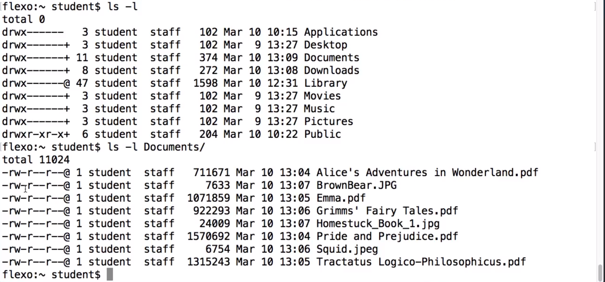

**它的作用是会打印出一个更长更详细的文件列表，l 代表 long（长列表）**

你还可以一起尝试一下另一个操作。Shell 可以让你将文件名与文件类型相匹配，假如你想要列出 Documents 目录中的所有 PDF 文档，方法是添加一个星号，像这样：`ls -ls Documents/*.pdf`

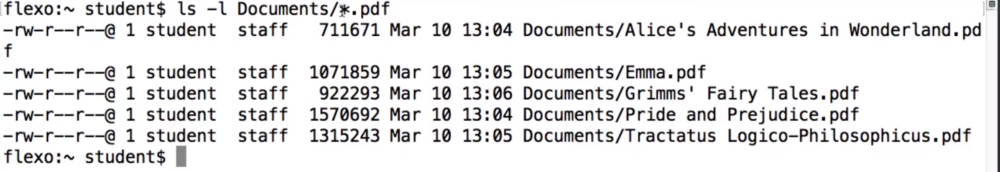

Shell 会将星号转变为名称匹配该文件类型的所有文件列表。在这个例子中，即所有文件名以 .pdf 结尾的文件。

### 习题 1

你可以从 `ls -l` 中找到哪些信息？要回答该问题，你可以需要调查下；使用你最喜欢的搜索引擎。

- 列出的每个文件或目录的名称。:artificial_satellite:
- 文件上次修改日期和时间。:athletic_shoe:
- 文件的大小（字节）。:atom_symbol:
- 是否检测文件有没有病毒。

### 习题 2

如果你想列出所有名称以单词 `bear` 开头的文件，该如何操作？

- `ls bear`
  - 命令 `ls bear` 将仅列出名称正好是 `bear` 的文件（如果有的话） 
- `ls *.bear`
  - 命令 `ls *.bear` 将列出名称以 `.bear` 结尾的文件。我们要查找的是名称以 `bear` 开头的文件。
- `ls bear*` :black_large_square:
  - `bear*` 可以匹配任何名称以单词 `bear` 开头的文件。 
- `ls *bear*`
  - 命令 `ls *bear*` 将列出名称包含 `bear` 的任何文件，即使位于中间或末尾，而不是开头。 

## 8. 整理文件（mkdir，mv）

我们来看看移动文件。

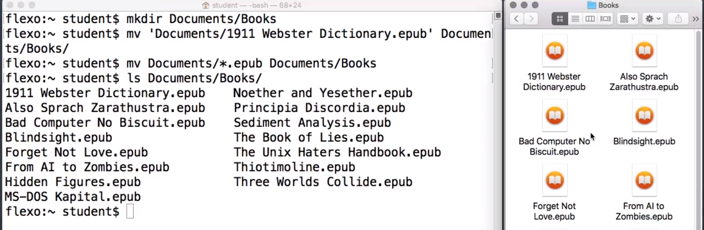

现在我们在一个文件夹里，里面的文件很乱，我想创建一些子目录并组织一下这些文件。在 GUI 中，我需要进行很多拖放和创建新文件夹的操作，但是在 Shell 中，几个命令便可搞定。

**我要用的第一个命令是 mkdir，表示“创建目录”（make directory）。**

我下载了一堆书籍，文件类型为 epub 文件。因此我要创建一个目录叫 Documents/Books，并将它们移进去，我可以使用 cd 命令先进入 Documents 目录，但我不一定非要这样，我可以直接在这里创建那个目录。你会看到当我在 shell 中创建它时，它也会在图形界面中显示出来。

接下里， 我要将 epub 文件移动到那个目录中，**移动事物的命令为 mv 是 move（移动）的缩写，我得告诉它两件事，我想从哪里移走什么，以及移到哪里去。**

我们可以逐个移动文件，但是我们刚刚看了星号的作用。所以我使用 mv 进行移动后跟 Documents/*.epub Documents/Books，分别代表我想移动的东西和我要移到的位置。

现在我输入命令 ls Documents/Books 或直接打开它（在 Finder 中），就可以看到它们了。

### 练习题

假设我改变了主意，想要将 `epub` 文件从 `Documents/Books` 移回到 `Documents`。如何操作？我当前的工作目录是我的主目录，`Documents` 位于该目录中。 请标记每个可行的答案：

- `mv 'Documents/Books' Documents`
- `mv 'Documents/Books'/* Documents`
- `cd Documents; mv 'Books'/*.epub .`
- `cd 'Documents/Books'; mv * ..`
- `mv 'Documents/Books/*' Documents`

### 练习题答案

在这个测试题中我们有五个选项。

- 第一个，是将 Documents/Books 目录移动到 Documents 目录，但是它已经在那个位置了，所以这个没什么用。
- 第二个可以，它是将 Documents/Books 目录中的每个文件移到 Documents 目录
- 第三个使用 cd 命令进入 Documents 然后将所有 epub 文件从 Books 子目录移到当前目录，也就是说 Documents 目录，这个也可行。
- 第四个是使用 cd 命令进入 Documents/Books 目录，然后将其中的所有文件移到父目录，即 Documents 目录，同样可行
- 对于最后一个，看到单引号里的星号了吗？它在要求 shell 寻找名称为 Documents/Books/* 的文件，我们没有这样的文件。所以这个不可以行。
  - 记住，单引号表示将特殊字符视为非特殊字符，但在这个例子中，我们应该视星号为特殊字符。

所以，第2 3 4 个都可行，但注意，它们会使你的 shell 处于不同的工作目录中。

顺便提下，在 shell 中引用内容时，请始终使用直引号。如果你输入到终端窗口中，将会获得相关内容。但是，如果从网页或文档中进行复制，一定要小心不是`“弯引号”`。弯引号在 shell 中*不可行*。

**在 shell 中，单引号和双引号的作用不太一样。如果不确定使用哪种引号，请选择单引号。**

## 9. 下载

目前为止，你已对文件和目录执行了一系列的操作，但是文件最初从何而来的呢？ 它们来自网络。

**有一个 shell 命令用来从网络下载文件，该命令为 curl，代表 C URL，即 see URL（查看网络）**，无论是谁命名的，哈哈，的确很有趣。

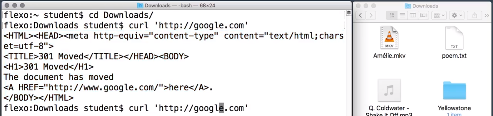

你可以使用 curl 来获取任何网页，但它的作用是向你显示页面的源代码，这挺酷的，但并非我们想要的。

比如我们想要转至 http://google.com，它会向我们显示一些 HTML，但**实际上会将我们导航到别处**。你需要给 curl 添加一个选项。**curl -L 表示遵循重定向**（redirect），然后我们将看到转至实际 google.com 主页的源代码。

使用 `curl -L http://google.com` 命令后将返回 google.com 主页的压缩 JavaScript 源代码，这跟你在浏览器开发工具中打开 View Source（查看源代码）时会看到的差不多。

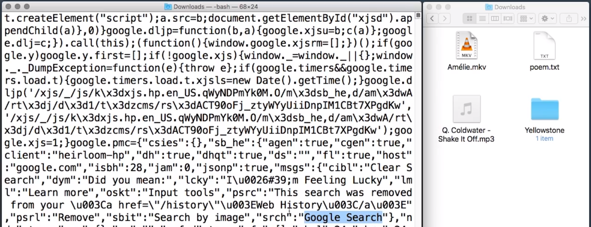

所以，这很方便于查看网站，但是 **curl 非常适合通过 URL 下载文件或页面，要使其写入文件而不是显示给终端，我们使用 -o 选项，我们用 curl -o 后跟我们想要保存在其之下的文件名称**，如 google.html。

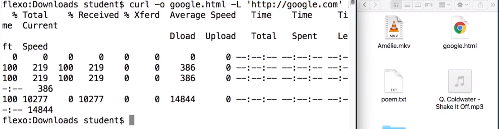

**这实际上是 shell 命令的一个很常见的模式，以命令名称开头（这里是 curl ），后跟一些选项，如 -o google.html 及 -L 然后后跟我们实际想要操作的对象，如 URL。**

我们运行 curl 时，下载的进程消息将会被显示，完成时，我们会回到 shell 提示符。

一个很常见的情况是，如果 Unix 程序运行成功，则不会显示任何日志或完成消息，但它确实运行成功了，这是它创建的文件 google.html.

大家练习的时候可以将视频中的 `http://google.com` 替换成国内的一些网址哦，例如 `http://cn.udacity.com`。

#### 下载 `dictionary.txt`

输入一个shell命令去下载 <http://t.cn/RYkeaZi> ，并将它保存为文件 `dictionary.txt`。记住要遵循Web重定向。

你需要在自己的计算机上运行这个命令下载文件，为后续练习做准备。

> curl -o dictionary.txt -L 'http://t.cn/RYkeaZi'

### 解决方案：

我们要用的命令以 curl 开头，并以我们现在所用的 tinyurl.com 结尾，但是在此之前，我们要遵循重定向并将其保存为 dictionary.txt，然后就会看到进度表。

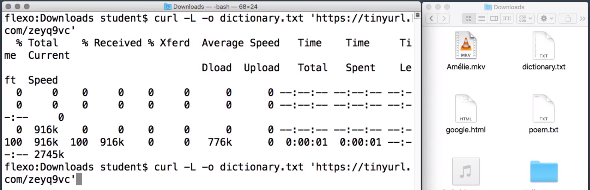

顺便说一句，你可能注意到我在这些 URL 两边加了单引号，这样做的原因是很多 URL 中都有特殊字符，如 & 号，所以最好养成习惯，给它们加上单引号，即使在本次特定情况下不加也能成功运行。

#### 提醒：

细心的同学可能已经发现，上方解决方案视频中所使用的链接和练习题提供的并不一致，这是由于视频中提供的链接国内无法正常访问，所以替换成了另一个文件完全相同但地址不同的链接。

顺便提下，很多 URL 中都有特殊字符，例如 `&` 符号，它在 shell 中有特殊的含义。因此我始终将这些 URL 放在引号内，虽然这些示例没有引号也可行，但是有必要养成良好的习惯。

## 10. 查看文件（cat，less）

现在我们知道了如何从网络获取文件，但拿到文件后我们可以做什么？

**有一个 shell 命令叫 cat，它能读取文件并输出内容，实际上它可以读取任意数量的文件，cat 是 Catenate 或 Concatenate，指连接多个事物。**

我们来试试看 cat dictionary.txt，直接显示了文件中的内容。

如果我们想看到文件开头，这用处不大，它快速地扫荡了我们终端的文件，直接到达了末尾。

**好在我们还有另一个命令，less 命令，它一次向我们展示文件的更少部分。**具体来说，它一次只会显示占满一屏的文件内容，你可以按空格键或使用箭头键向下滚动。它还有其他一些命名，**如 B 用来返回或 / 用来搜索**。

完成 less 部分后，你可以按下 q 退出。

许多其他程序都在调用它，**以方便显示大量输出并使用户能够操控进度。**

使用 `dictionary.txt` 文件和 `less` 命令找出该字典中单词 `goobers` 之后的下个单词。

> good

## 11. 删除内容（rm，rmdir）

好的，现在我们创建好了一堆文件和目录等等，接下来我们想删除一些东西来清理一下。

删除文件的 Shell 命令为 rm，是 remove（删除）的缩写。

rm 的使用方式与其他 Shell 命令的用法是一样的，你只需给它文件的名称，也就是你想删除的文件的名称。

现在，得给你一个安全警告，在你的 GUI 中，你可能有一个垃圾桶或回收站用来清理文件，如果你后来改变主意了，也可以还远它们。**但 rm 命令不同，它会直接删掉文件。**

如果妮还需要更多提示，那就是当你担心自己不小心删掉重要文件，你可以使用选项 -i，i 表示 interactive（交互），它会在删除文件前询问你是否要进行删除。

对于目录，还有一个不同的命令，**是 rmdir 指删除目录（remove directory）**

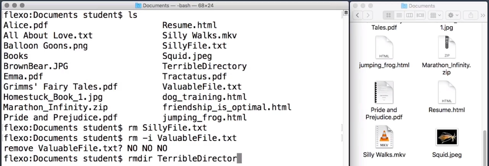

#### 练习题

你有四个文件，名称分别为：

1. `Good File`
2. `Bad Name Good File` 
3. `Bad File`
4. `Good Name Bad Face`

你想删掉第 3 个和第 4 个文件，并保留第 1 个和第 2 个文件。下面的两个命令可以实现这一操作，请选择：

- `rm 'Bad File' 'Good Name Bad Face'` :clinking_glasses:
  - 这样可以一次性删除多个文件
- `rm *Bad*`
- `rm Bad!Good`
- `rm *'Bad F'*` :crossed_fingers:

## 12. 搜索和管道（grep，wc）

除了查看、移动和删除文件外，我们还可以对文件做更多事。例如，我们拿之前下载的那个字典文件（dictionary.txt）然后用某个命令来检查看某个单词是否在此字典中。

**有一个叫做 grep 的 Shell 命令，它知道如何在文本文件中搜索具体特定内容的行。**如果你给它一个单词，如 shell 和一个文件名，如 dictionary.txt。

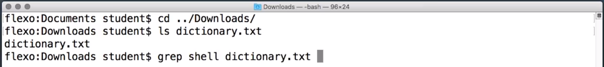

它会读取文件并输出包含该词的所有行。

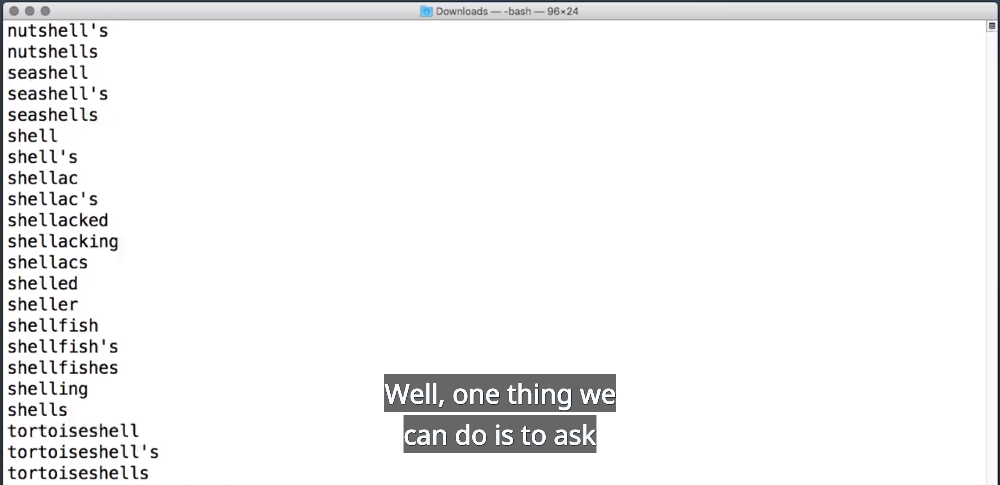

但是，如果像这种情况，输出的行太多，我们没法一次看完，该怎么办呢？ 

**一种办法是我们可以要求 Shell 将 grep 的输出发送给 less 命令，你可以使用管道命令，即符号 `|` 。**

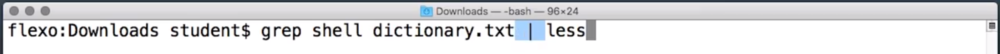

那么 grep 程序读取输入文件并打印出于该模式匹配的任何行，**但 Shell 做了重定向，使输出不会直接到达终端，而是将其发送给 less 程序**。它会一次一页的将这些行显示给终端。

要读这个命令，你可以说，对 dictionary.txt 文件执行 grep shell 命令，然后传递给 less 程序。

**grep 命令也可以处理来自另一个程序的输入**。

例如，你可以使用 curl 从网络从提取文件并立即对它使用 grep 命令来获取符合特定模式的内容，而无需先将它保存到一个文件。

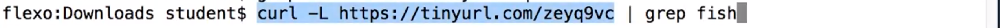

此 curl 命令的输出，会作为输入传递给这个 grep 命令，而非从文件中进行 grep 读取。

> 这里，我们这样理解：通过 curl -L https://tinyurl.com 命令，我们将从这个 url 地址获取一段文本，然后并不会直接通过终端显示出来，而是 shell 会将这段文本传递给 grep 程序，执行 grep fish 命令后再返回。

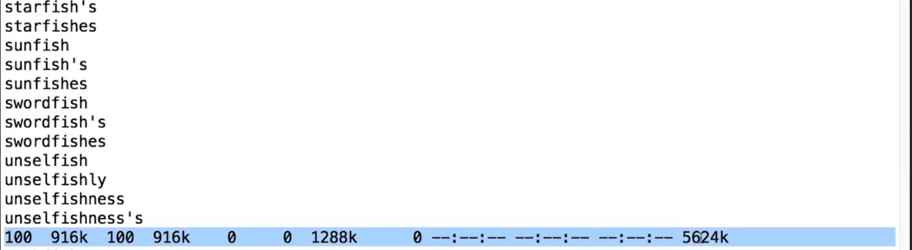

可以看到，有时 curl 的一些输出像这个**进度表（蓝色部分）**会和 grep 的一些混合在一起，会让人有点困惑。**实际上它们并没有在 Shell 中混合，而是在终端混合了**。如果我们将它发送到一个文件，并不会有问题，不会出现混合的现象。

如**果你只想知道有多少匹配项，比如有多少单词包含字符串 fish**，这样做的方法有好几个。

- 一种方法是将 grep 的输出输送给 wc（word count 字数）程序，并加上 -l 选项让它计算行数。
  - 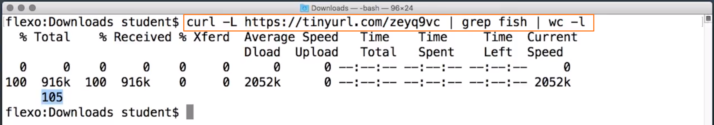
  - 这里我们得到的数字是 105
- 另一个方法是给 grep 加上 -c 用于计数。
  - 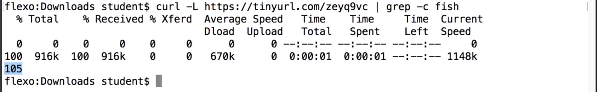

### 练习：

dictionary.txt` 中有多少个单词符合规律 `ibo`？

------

22

## grep 模式叫做什么？

请调查下！使用 `grep` 不仅可以匹配单词。`grep` 的功能具有一个特定的术语。

请使用你喜爱的搜索引擎调查研究下，了解这些规律叫做什么。

------

Regular Expression

- 正则表达式也叫做 regexps 或 regexes。

  实际上可以使用 `grep` 进行一整套的复杂语言搜索操作，这门课程根本讲不完。

  很多其他程序也用到正则表达式，包括文本编辑器以及这道测验。这道测验的正确答案是正则表达式 `^[Rr]eg.*[Ee]x.*`，表示任何以 `reg` 开头并具有 `ex`，且大写和小写的 R 和 E 都可以的字符串。

## 13. Shell 和环境变量

shell 类似编程语言，就像 JS 或 Python 一样，它具有变量，不过看起来有点不一样。

在 Shell 中，每当你创建或修改一个变量，你只需给它一个名称和一个等号，后跟你想给它的值。

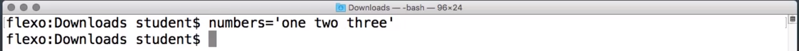

记住，等号两边不要加空格。

然后当你想引用这个变量时，只需用美元符号后跟其名称即可。

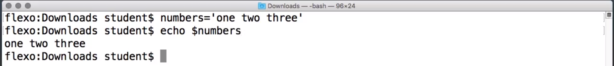

Shell 中实际上有两种不同类型的变量。

- 一种叫 Shell 变量。你之前看到的 LINES 和 COLUMNS 变量属于这种类型。**它们是 Shell 程序本身的内部变量。**
  - 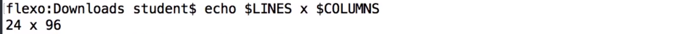
- 另一种叫做环境变量，**环境变量是与在 Shell 中运行的程序<u>共享</u>的变量**，一个非常重要的环境变量是 Path 变量。
  - **Path 变量它会告诉系统你的程序文件的位置**，那么，当你输入一个命令，如 ls 时，它会找到运行 ls 的程序。
  - 例如，在我的系统上 ls 程序位于 /bin.ls 中，所以，它位于 /bin 目录中。而 /bin 目录可以在我的 PATH 变量中看到。
  - 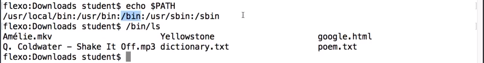
  - PATH 变量中的目录使用**冒号**分隔，Shell 会从第一个开始搜索，不断向右，直到找到你输入的命令。这就是当我想运行 ls 命令时，Shell 找到它的方式。

**有时你会看到说明告诉你将一个目录添加到 PATH，以便能够找到其中的程序**。要将新目录添加到路径末尾，你可以这样写 `PATH=$PATH:后跟新目录`：

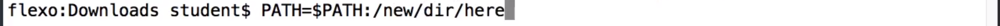

**但是如果你直接在 Shell 提示符下这么做，这个更改只会持续到关闭 Shell 前**，我们来看看如果你想保留更改应该在哪里执行命令。 

### 练习：

你认为 `PWD` 变量是 shell 变量还是环境变量？

（不知道它是什么？试试 `echo $PWD`。）

- Shell 变量
- 环境变量
  - `$PWD` 的值是当前工作目录，和运行 pwd 命令看到的一样。你在类 Unix 系统上运行的每个程序都具有某种工作目录。通常以你启动程序时所在的目录开始。因此 `PWD` 变量是**环境**变量。而不仅仅是 shell 内部变量。 

### 显示两个变量

写一个 shell 命令，使用 `echo` 显示变量 `LOGNAME` 和 `PWD` 的内容，并在二者之间留个空格。

`echo $LOGNAME $PWD` 

## 14. 起始文件（.bash_profile）

Shell 不只是一个用户界面，它还是一种编程语言。包含 Shell 命令的文件叫做 Shell 脚本。

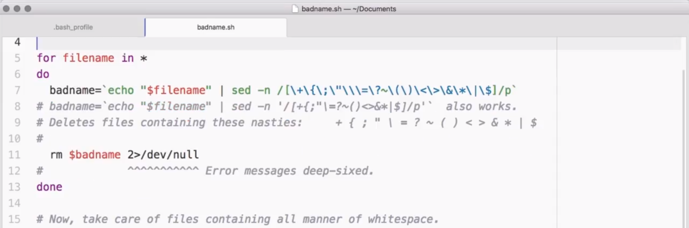

它们可以简单到只是一两行命令，就想你之前在 Shell 提示符下所写的。也可以是由很多功能组成的，长而复杂的程序。

但是在这节课中，我们不会深入探究 Shell 编程，而是看一个基本上对使用 Shell 的每个人都非常有用的技巧。那就是自定义 Shell。

来看一个例子，Shell 用户通常会将程序安装到一个叫做 bin（代表二进制文件）的主目录下的子目录。但是 Shell 并未进行预配置，以知道其中是否有任何命令。之前，如果你有一个程序安装在 bin/magic 下，且你想从 Shell 运行它，你得打出目录和命令名。

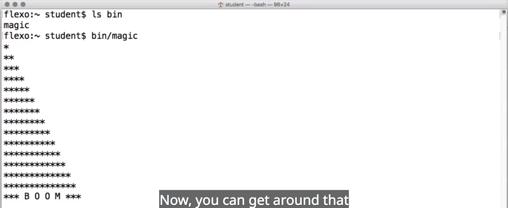

现在，通过将该目录添加到你的 PATH 路径便可直接执行。

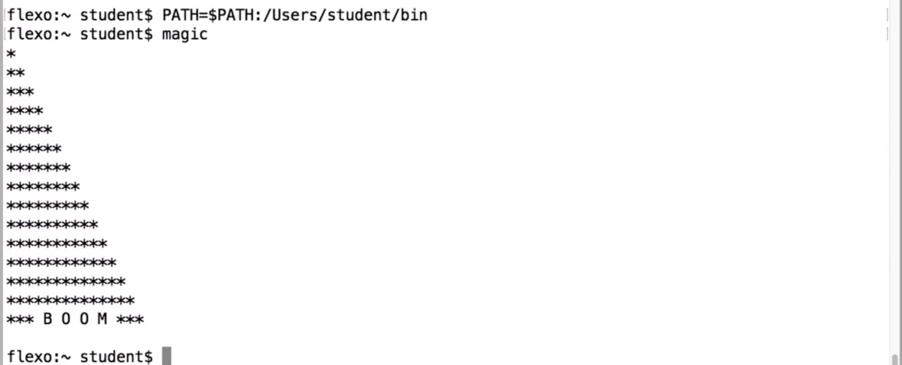

但是每次你启动一个新 Shell 时，它都会重置。为了让此便成为永久性的，你需要将其放到 Shell 的配置文件中。

由于历史原因，Bash Shell 能在启动时运行几个不同的文件来获取其配置。在 Mac 系统或者是带有 Git Bash 的 windows 系统上，你打开的每个终端中的 Shell 都将加载名为 .bash_profile 的文件中的指令。

但是在 Linux 系统上，.bash_profile 仅对某些 Shell 会话加载，特别是登录 Shell 会话。非登录 Shell 会话则会加载一个名为 .bashrc 的文件。

如果你想在不同的操作系统上使用相同的 Shell 配置，这种不一致性可能会有个问题。一种常见的解决方法是在你的 .bash_profile 中加入一个语句，说如果有一个名为 .bashrc 的文件，则运行它。

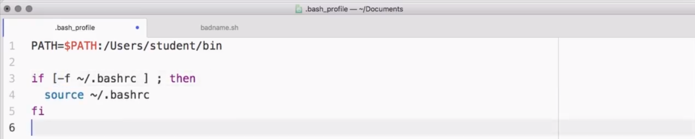

但是如果你使用的是 Mac 或 Windows，直接用 .bash_profile 即可，而不用担心此问题。

你放入此配置文件的任何命令都会在你每次启动 Shell 时运行，这包括：

- 变量赋值，比如更改 $PATH
- 它也可以包含你希望在启动 Shell 会话时看到的任何内容，比如你可能想看到日期和友好信息。没问题，直接在此加上日期命令即可，或者加上 `echo "Hey there!"`
  - 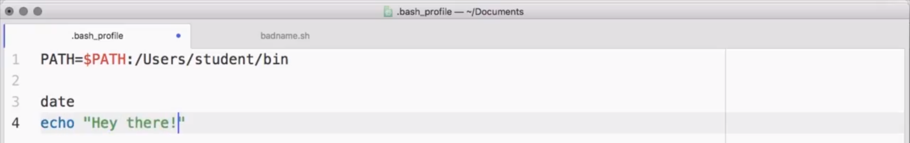
  - 然后，当你启动一个新 Shell 时，你放在其中的命令就会运行。

## 15. 控制 Shell 提示符（$PS1）

当启动一个终端时，你会看到什么？

通常你会看到一个 Shell 提示符，但不同的系统，它的内容会有所不同。

例如，用于 Windows 的 Git Bash，就是这个样子：

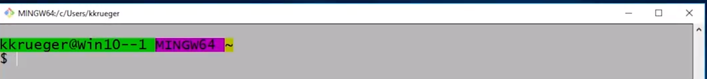

但 Mac 上的是这个样子：

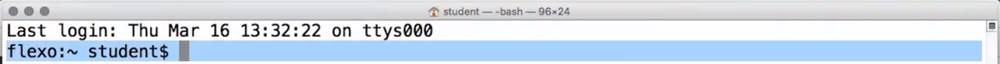

在这里，这个显示的是我正在使用的计算机的名称，flexo 当前工作目录，主目录 ~，以及我用于登录的用户名 student。

但是你可以在 Shell 提示符中放入一大堆信息，现在我们看到的是 Bash 手册：

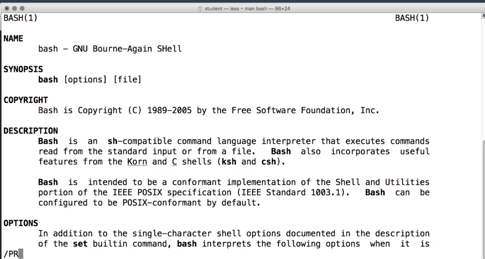

但是不幸的是，它并未安装到用于 Windows 的 Git Bash 中，但是你可以上网查找。

为了使用你可以把任何其他代码放在其中，你需要将它们放在 Shell 变量 PS1 中，但是你在哪里能这样做呢？通常是在 .bash_profile 中。

如果你运行的是 Linux 系统，则会在 .bashrc 中，或者你通过一些技巧来让它在其他地方运行。

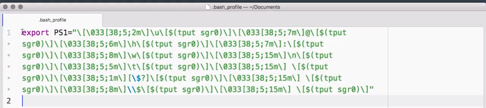

这是一个包含复杂 PS1 提示符的 .bash_profile，来看看它能做什么。

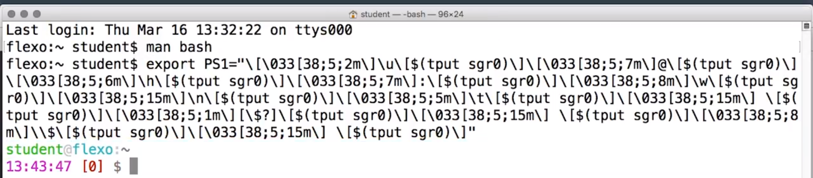

这个提示符和 Windows 上的一样色彩丰富，而且还带时间，非常方便。

那么，人们都往 PS1 中放什么信息呢？

- 大多数开发人员会让它显示他们正在从事的项目的当前状态。
- 不过，我通常会使它保持简洁。

对于这个复杂的部分，我实际上是使用一个叫做 bashrcgenerator.com  的网站自定义的。

特别是我在构建课程时，我不想分散你的注意力寻找我在哪个目录中，有时候我直接将 PS1 设为一个美元符号后跟空格，总之简单就好：

## 16. 别名

另外一个很酷的自定义 Shell 的小技巧，叫做“别名”（alias）。

这是一种缩短 shell 命令的方法，因为在 shell 中，我们总是希望命令越短越好，对吧？

别名的使用方式是，你在 alias 命令中用一个简称替换长命令，如用 ll 替换 ls -la：

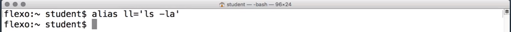

就像这样，`alias ll='ls -la'`，跟变量赋值一样，alias 命令不希望你在等号两边加上一堆空格，这会产生一堆奇怪的错误。

在创建别名后，当你输入短命令，像 ll，Shell 会直接运行长命令，像 ls -la：

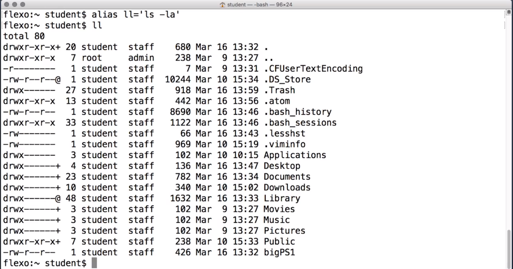

如果你要列出你拥有的所有别名，直接运行 alias 命令即可，无需任何参数。

别名好的一点在于，你可以像常规命令一样使用它们。你可以对目录执行 ls 也可以，你也可以对目录执行 ll。你在使用 alias 时放在其后的任何选项都将加载命令末尾，所以：

- `ll /user/bin` 在运行时会转变为 `ls -la/user/bin`

但此 ll 命令只在此终端窗口保持打开期间可用，如果你想让你的别名在每次启动 Shell 时都可用，则需将它们放在 .bash_profile 中：

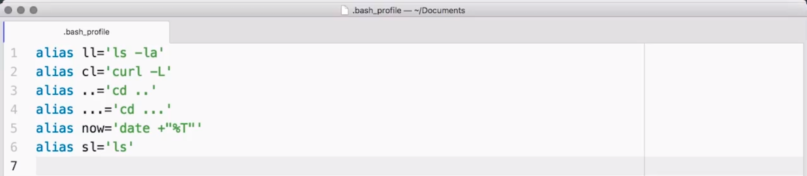

这些是我找到的其他人常用的一些别名示例，最后一个我认为非常聪明，因为有时人们会把 ls 错写为 sl，而这个直接自动纠正了这个问题。

## 17. 继续学习

Shell 比较酷的一点在于关于它的知识永远学不完，我已经用了它 20 多年了，但仍然有一些我从未用到过的功能，而且人们还在不断编写新的功能。

随着你开发水平的不断提高，你可能会构建适合你自己的 Shell 配置文件，就像自定义其他开发工具一样，比如文本编辑器。

网上有大量关于 Shell 的各种要诀和技巧的资源，比如配置和加速你的 Shell 环境的咒语和常见魔法。我在此页上罗列了几个，希望你用得开心，不断学习。

## Shell 资源

- [Shell脚本编程30分钟入门](https://github.com/qinjx/30min_guides/blob/master/shell.md#%E6%8F%92%E5%85%A5)
- [Bash 学院](http://www.bash.academy/)(英)
- [Bash 初学者指南](http://www.tldp.org/LDP/Bash-Beginners-Guide/html/)(英)
- [Bash 编程指南](http://tldp.org/HOWTO/Bash-Prog-Intro-HOWTO.html)(英)
- [Regexr — 学习正则表达式](http://regexr.com/)(英) 

