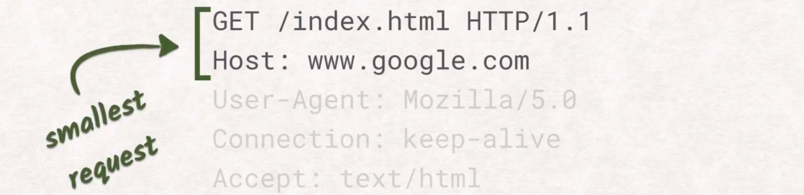
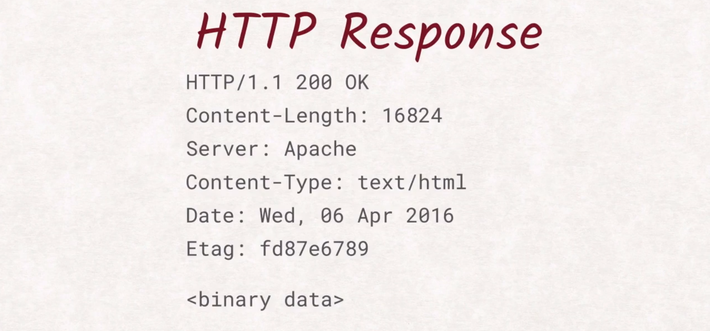
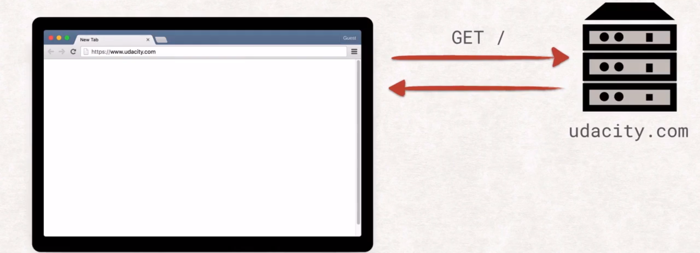
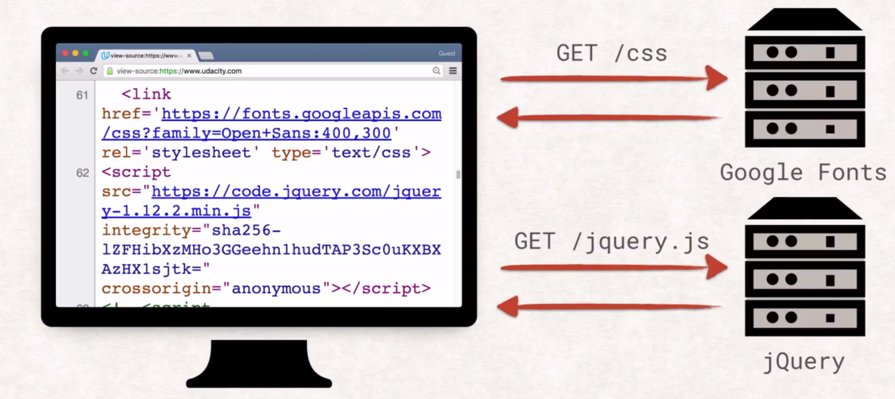
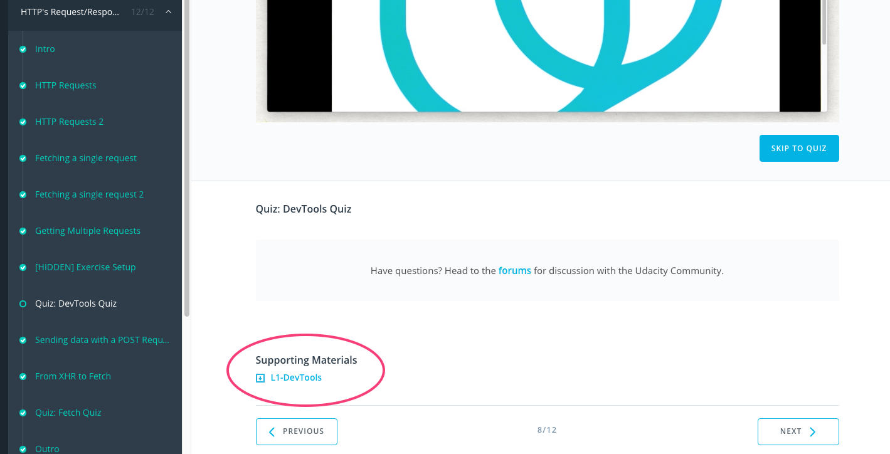
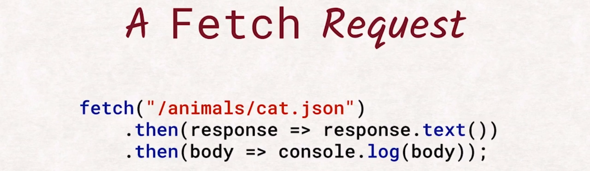

# 1. HTTP 的请求和响应周期

> 你会学到请求的来龙去脉，具体了解如何请求页面，收到标题，HTTP 代码以及如何传输数据。

[TOC]

---

## 1.1 简介

欢迎学习**客户端服务器通信**课程，这是一门关于 web 的课程。

从技术上来说 web **只是互联网的一小部分**，但是，这也是唯一一种人们在使用甚至意识不到它的存在的互联网（web）。

web 是一种可以被网络开发者**用于向世界传达观点的<u>平台</u>**，它是**服务器和客户端之间的<u>通用语言</u>**。

每次打开浏览器，每次下载应用，每次在 WhatsApp（微信） 或 Facebook（微博）上接受消息，你都用到了 web。或者更常见的情况，**此时此刻，客户端正与服务器通信，反之亦然**。

但这到底是什么意思呢？当你转到网站上时，发生了什么？手机如何知道有人向我发送了一条消息？web **有什么功能**？更重要的是它**有什么局限性**？

在这门课程中，我们将了解**到底什么是 web**，**如何利用 web 来发挥你的优势**，以及**如何避免那些会影响到<u>用户体验</u>和<u>安全性</u>的错误**。

某些内容听起来可能比较简单，的确是这样，但是我们还将介绍大家不太熟知的 HTTP 部分。为了像工程师一样思考问题，你需要**了解 HTTP 使用的语言**以及**浏览器内的实现**。我们将运用这些知识，调用浏览器 API 以充分发挥它的潜力，**提高 HTTP 的安全性**，避免受到窃听者的攻击，并部署最新的 web 协议 —— HTTP2。

所有这些只是将帮助你为自己的应用做出明智的决策，同时鼓励其他人**优化应用，提高应用的安全性**。

Surma 将介绍 **HTTP 的请求**和**响应周期**、**安全性**及 **HTTP2 最佳做法**。我将通过示例和练习加强你对这些知识的掌握。

了解我们每天都会用到的媒介的功能和局限性将有助于你进一步掌握这一媒介。**学完这门课程后，你将会理解在浏览器和服务器之间发送的每个字节**。


> ### [万维网](https://baike.baidu.com/item/www/109924?fromtitle=%E4%B8%87%E7%BB%B4%E7%BD%91&fromid=215515&fr=aladdin)
>
> WWW是[环球信息网](https://baike.baidu.com/item/%E7%8E%AF%E7%90%83%E4%BF%A1%E6%81%AF%E7%BD%91/9377238)的缩写，（亦作“Web”、“WWW”、“'W3'”，[英文](https://baike.baidu.com/item/%E8%8B%B1%E6%96%87)全称为“World Wide Web”），中文名字为“[万维网](https://baike.baidu.com/item/%E4%B8%87%E7%BB%B4%E7%BD%91/215515)”，"环球网"等，常简称为Web。 分为Web[客户端](https://baike.baidu.com/item/%E5%AE%A2%E6%88%B7%E7%AB%AF/101081)和Web服务器程序。 WWW可以让Web[客户端](https://baike.baidu.com/item/%E5%AE%A2%E6%88%B7%E7%AB%AF/101081)（常用[浏览器](https://baike.baidu.com/item/%E6%B5%8F%E8%A7%88%E5%99%A8/213911)）访问浏览Web[服务器](https://baike.baidu.com/item/%E6%9C%8D%E5%8A%A1%E5%99%A8)上的页面。 是一个由许多互相链接的[超文本](https://baike.baidu.com/item/%E8%B6%85%E6%96%87%E6%9C%AC/2832422)组成的系统，通过[互联网](https://baike.baidu.com/item/%E4%BA%92%E8%81%94%E7%BD%91)访问。在这个系统中，每个有用的事物，称为一样“资源”；并且由一个全局“[统一资源标识符](https://baike.baidu.com/item/%E7%BB%9F%E4%B8%80%E8%B5%84%E6%BA%90%E6%A0%87%E8%AF%86%E7%AC%A6/2890807)”（[URI](https://baike.baidu.com/item/URI)）标识；这些资源通过[超文本传输协议](https://baike.baidu.com/item/%E8%B6%85%E6%96%87%E6%9C%AC%E4%BC%A0%E8%BE%93%E5%8D%8F%E8%AE%AE/8535513)（Hypertext Transfer Protocol）传送给用户，而后者通过点击链接来获得资源。
>
> [万维网联盟](https://baike.baidu.com/item/%E4%B8%87%E7%BB%B4%E7%BD%91%E8%81%94%E7%9B%9F/1458269)（[英语](https://baike.baidu.com/item/%E8%8B%B1%E8%AF%AD/109997)：World Wide Web Consortium，简称W3C），又称W3C理事会。1994年10月在[麻省理工学院](https://baike.baidu.com/item/%E9%BA%BB%E7%9C%81%E7%90%86%E5%B7%A5%E5%AD%A6%E9%99%A2)（MIT）计算机科学实验室成立。万维网联盟的创建者是万维网的发明者蒂姆·伯纳斯-李。
>
> **万维网并不等同[互联网](https://baike.baidu.com/item/%E4%BA%92%E8%81%94%E7%BD%91/199186)，万维网只是互联网所能提供的服务其中之一，是靠着互联网运行的一项服务。**


关注我们!

- [@DasSurma](https://twitter.com/dasSurma)
- [@richardkalehoff](https://twitter.com/richardkalehoff)

---

## 1.2 HTTP 请求 

**互联网比 web 存在的时间更久。**虽然计算机已经可以借助**电子邮件或 FTP** 等方式**在互联网上互相通信**，但是**没有公开可用的通用方法来发布和访问文档**。

这个时候就要提到 Tim Berners-Lee 了，他希望有一种**开放机制能够让研究者通过互联网发布、阅读和评论论文**。他希望有一种**关联文档网络，即超文本文档**，Berners-Lee 选择了 SGML 的一个子集，并称之为 HTML 即**超文本标记语言（Hypertext Markup Language）**。然后，他设计了 HTTP 即**超文本传输协议（Hypertext Transfer Protocol）用于传输这些 HTML 文档**。

超文本听起来很未来主义、复杂，但其实就是文档中的文本，可以引用其他文档，这些引用称之为链接。获取文档后，用户**不仅能够阅读该文档**，而且可以**通过这些链接访问其他相关文档**。尤其是在 Berners-Lee 所涉及的细致严谨的环境下，这种功能非常实用。但是超文本不仅可以**引用文本，还可以链接到图片、代码、样式等文件或其他内容**。


Tim Berners-Lee

- [关于他在维基百科上的介绍](https://en.wikipedia.org/wiki/Tim_Berners-Lee)
- [关于他在 W3C 上的介绍](https://www.w3.org/People/Berners-Lee/)
- [关于他在 TED 上的介绍](https://www.ted.com/speakers/tim_berners_lee)

通用缩写

- [SGML - 标准通用标记语言](https://en.wikipedia.org/wiki/Standard_Generalized_Markup_Language)
- [HTML - 超文本标记语言](https://en.wikipedia.org/wiki/HTML)
- [HTTP - 超文本传输协议](https://en.wikipedia.org/wiki/Hypertext_Transfer_Protocol)


---

## 1.3 HTTP 请求 2

HTTP 的工作原理是什么？

在一开始，Berners-Lee 设计了一种**模板**，你可以通过填写该模板向服务器上的文档发出请求，原始的协议（后来被称为 HTTP 0.9）非常有局限性。你需要在模板中填入你希望获取或存储的文档的位置，包括名称和所有你认为必要的额外信息：


随后，该请求被发送至服务器。

因为**服务器懂 HTTP，所以知道这是 HTTP 请求，从而知道客户端想要什么，该协议还有响应模板**。这些模板比较**多样化**，因为一个请求可以有**多种结果**，包括出现**错误**、**无法读取请求表单**或**将客户端重定向到完全不同的服务器**等等。

幸运的是 Rich 完成的很棒，我知道他想要什么，我唯一要做的就是填写这个表单以便 Richard 知道我对哪个请求做出了响应。

带宽问题（Bandwidth problems）：


> ### :spider_web:带宽：
>
> [百度百科](https://baike.baidu.com/item/%E5%B8%A6%E5%AE%BD/266879?fr=aladdin)：
>
> - 带宽应用的领域非常多，可以用来**标识信号传输的数据传输能力**、**标识单位时间内通过链路的数据量**、**标识显示器的显示能力**。
>   1. 在[模拟](https://baike.baidu.com/item/%E6%A8%A1%E6%8B%9F)信号系统又叫[频宽](https://baike.baidu.com/item/%E9%A2%91%E5%AE%BD)，是指在固定的时间可[传输](https://baike.baidu.com/item/%E4%BC%A0%E8%BE%93/7078195)的资料数量，亦即**在传输管道中可以传递数据的能力**。通常以每秒传送周期或[**赫兹**](https://baike.baidu.com/item/%E8%B5%AB%E5%85%B9/7245576)(**Hz**)来表示。
>   2. 在数字设备中，**带宽指单位时间能通过链路的数据量**。通常以[**bps**](https://baike.baidu.com/item/bps)来表示，即**每秒可传输之位数**。
>
> 我的理解：
>
> - 图片中给的例子似乎是说管道的宽度无法将响应的“画框”返回，所以产生了带宽问题。但这种管道的宽度应该是指网络传输过程中的什么呢？我觉得应该是同时发送能力，不过这只是带宽问题中的其中之一，因为整个带宽所代表的是单位时间的数据量，数据量的发送应该是向不同客户端发送量的总和，而不只是单一客户端的数据量。

---

## 1.4 获取单一请求

管子和表单代表的是 HTTP 的**基本概念**：请求和响应。（我觉得是提交管子和表单的动作）（虽然请求和响应从词语本意来讲可能是指动作，但这里应该是指关于请求和响应的一切，那就不只是动作，也包含模板、传输通道、速度等）

当然，我们并非真的通过管子传递纸张，而是**通过<u>网络线缆</u>传输数据**。

实际请求看起来是这样的：


这是浏览器为了请求图片 kitty.jpg 而向服务器发送的详细文本。我们来了解下第一行：


在此示例中，我们尝试从服务器获取文档，协议还能够**添加（add）**、**删除（delete）**和**更新（update）**文档。**为了区分这些功能**，协议的**第一行以一个 HTTP 方法（即一个动词）开头**。**此请求使用了 GET 方法，表示我们想要服务器向我们发送数据**。另一个方法示例是 **POST，指示服务器保存我们发送的数据**。还有其他各种方法，稍后我们将在 REST API 部分详细讲解这些方法：


**方法后面是我们要获取的文档的路径和名称**，这里，我们希望服务器向我们发送一个位于 pictures 目录下叫做 kitty.jpg 的文件。第一行最后一部分是我们使用的 HTTP 协议版本，到目前为止 HTTP/1.1 是最常用并获得最广泛支持的版本，但是 **HTTP/2 正在逐渐火热起来并成为行业标准，稍后会详细介绍**。

Surma 将介绍 HTTP 请求可以具有的不同种类的报头。


---

## 1.5 获取单一请求 2

请求的这一部分称为**报头部分**，因为其中包含报头（headers）：


**报头是关于请求本身的其他数据**，很多报头都是标准化形式，包含以下信息：

- 发出请求的浏览器类型： `User-Agent: Mozilla/5.0`
- 浏览器支持什么格式： `Accept: text/html`
- 浏览器的本地缓存中已经具有该文档的哪个版本： `If-None-Match: fd87e6789`

除 Host 报头之外的所有报头都是可选内容，**可以发出的最小请求仅包含第一行和 Host 报头**：



乍一看，响应看起来很像请求，最大的区别可能就是第一行：



从第一行可以找到响应的**状态码**，表示请求是否成功完成、文档是否未找到或者服务器是否想要将你重定向到其他位置。

和请求一样，下一部分是报头部分，不仅包含关于文档的数据，而且包含关于服务器和连接的数据。同样，大部分报头都是可选的，**唯一需要包含的标题是 Content-Length**，告诉客户端将获得多少字节的数据。

在报头部分和一个空白行之后，系统就会发送实际文档。可以是 JPEG 图片、HTML 文档，或你想传输给用户的任何文档。


---

## 1.6 获得多个请求

我们刚刚看了如何使用 HTTP 请求来获取一个文档。这些文档可以是任何类型的数据，但是在 Web 上，一切通常都以**索引文档**（index.html）开始。如果**在请求中找不到任何具体的文件，服务器就会向你发回索引文档**。

**通过在浏览器地址栏中输入 URL，用户指示浏览器通过 URL 辨识出服务器的主机名**，并与它建立新链接，随后获得 URL 的路径中指定的文档。这里，服务器将发回 index.html，浏览器可以开始解析该文档：



这是一个非常有趣的步骤，**为了处理接收的数据，浏览器会执行各种操作**。请访问讲师注释中的链接了解这一步骤的工作原理。

浏览器解析响应后，情况就变得复杂了。当浏览器读取 index.html 时，它很可能会发现要正常显示网站需要其他文档的引用。例如图片、样式表、JS 文件、视频等等，对所有这些资源发出另一个请求。浏览器收到响应后，就会重复整个解析和可能存在的发送新请求的过程：



这也意味着，**每个资源都可以反过来获取其他资源**。每个网页都有自己的一组依赖项，例如图片、CSS 和 JS 文件。也就是，**所发送的请求可能比你想象中要多得多**:


- [将 HTML 转换为 DOM](https://classroom.udacity.com/courses/ud884/lessons/1464158642/concepts/15290985490923)
- 在视频最后，Surma 开启了网络节流功能来减缓优达学城网站的载入速度，这样你就可以在 assets 被抓取时看到它们。 我们的网站比10+秒*快得多*！


---


## 1.7 练习：配置

### 服务器二进制文件

为了解客户端和服务器通信的方式，我们创建了一系列服务器，你将使用这些来完成实践练习。 为了防止出现任何问题，我们创建了二进制文件，你可以下载文件并启动本地运行服务器。

### 启动服务器

1.在练习页面上，下载资源位于页面底部的练习二进制文件，在**辅助材料**板块中。

[](https://classroom.udacity.com/nanodegrees/nd019-cn/parts/8f508d0f-3ede-4438-a76a-1388a0fc3082/modules/2ade007c-9ac6-4dad-995d-6dec0deb7c8f/lessons/8162118632/concepts/af121247-7060-4993-a0ce-8bfc11400ddc#)

2.解压 zip 文件。

3.找到你平台上的二进制文件。

4.通过双击启动二进制文件。


#### 辅助材料

[ L1-DevTools](http://video.udacity-data.com.s3.amazonaws.com/topher/2016/June/57509461_l1-devtools/l1-devtools.zip)


---


## 8. 练习：开发者工具

在这道练习中，你需要**算出请求数量和通过网络传输的数据量**。为了完成这道练习，你将使用对网络开发者来说最实用的工具之一，即开发者工具。

所有的大型浏览器都有自己的开发者工具并具有相似的功能，为了简单起见，我们将使用 chrome 的开发者工具，然后转到 Network 标签页，该服务器的二进制文件位于下面的资源下载部分。因此启动它，转到提供的 URL，然后就可以看到此网页：


在网页加载过程中，你可以看到触发的所有请求，点击这些请求并看看不同的报头和响应。

算出请求数量和通过网络发送的数据量，单位是千字节，并填到这两个方框中。顺便提醒下，为了避免因为插件、扩展程序和浏览器缓存结果而导致错误的结果，确保在隐身窗口中运行该网页并选中 Disable cache 复选框。

解答：

从标签页上可以看到整个网页被加载时的概况，这个表格列出了所有的请求以及所包含的信息。开发者工具在底部显示了加载网页的摘要信息：


此网页有 6 个请求并传输了 43.5 KB 的数据，因此这些数字就是练习题的答案。


---

## 1.9 通过 POST 请求发送数据

到目前为止，我们都是使用 GET 方法请求服务器向我们发送数据。但是，有时候你可能希望用户输入一些数据或上传照片并发送至服务器，这时候我们之前提到的 POST 方法就派上用场了，**对于 POST 请求，请求本身也可以具有有效载荷（payload 有效负荷）或主体**，即那些我们之前**在响应中已经见过，但是没在请求中见过的东西**。

数据被发送至服务器后的具体处理流程由后端开发者决定，已经超出这门课程的范畴。但是，需要知道的是**代理和浏览器处理 POST 请求的方式可能与 GET 请求不同**。

见过这种情况吗？


就是你当前查看的网页是 POST 请求结果时发生的情况。如果你尝试重新加载此类网站，浏览器将提示你确认是否执行重新加载操作，因为 **POST 请求可以是破坏性操作**，重复执行的破坏性可能比你想象的要严重。

因此**通常建议后端开发者不要用网站对 POST 请求做出响应，而是用重定向做出响应**，以避免这种有冲突的行为。对于用户来说，这种重定向实际上不可见，但是避免了重新加载问题：


---


## 1.10 从 XHR 到 Fetch

**浏览器为我们执行了大量任务**，但是**就像生活中一样，我们不会总是一开始就知道想要什么**。

假设有个网站想要显示当前天气图片，我们不知道用户在未来访问该网站时的天气如何，当然，我们可以从一开始就加载所有可能需要的图片，但是这种做法很快就变得不现实。我们来了解下 Ajax。

**Ajax 是一系列的 web 技术**，使你**能够通过 JavaScript 以程序的方式发出请求，而不是浏览并重新加载整个网站**。

XMLHttpRequest（简称 XHR），是目前最常见的**执行方式**。

与 JavaScript 现今的功能相比，XHR 的 API 很复杂并且已经过了。因此我们将跳过 XHR 内容，并直接使用它的更新版本 Fetch。Fetch 能执行完全相同的任务，但是利用了 promise 的 API 更加整洁，因此，它与其他现代 JavaScript API 的互动性更强：



如果你想详细了解 Promise，请参阅我们的 JavaScript Promise 课程，讲师注释中有链接。

借助 Fetch 你可以调用协议指定的所有 HTTP 方法并完全控制发送哪个报头，当然包括几乎所有的报头。

Richard 将用一个小小的工具来演示 Fetch API，在开发者工具中打开 Networking 标签页，看看当你指定请求时，浏览器是否真的发送该请求了。


JavaScript Promises

- [JavaScript Promises](https://www.udacity.com/course/javascript-promises--ud898) 优达学城课程
- [Promises | Web 基础](https://developers.google.com/web/fundamentals/primers/promises/?hl=en) on Google Developers


---

## 1.11 练习：获取

Fetch 设置和使用起来简单很多，不用再研究 XHR 与它不必要的复杂功能。因此我们将来练习下 fetch 的用法。

要完成这道练习，你需要从服务器获取文件，这是你需要设置并与之交互的服务器：


但是别担心，设置和运行它并不复杂。

该服务器的二进制文件位于下面的下载部分，请下载该项目，启动它并转到提供的 URL。你应该能看到这一页面。

你需要获取文件 password.txt，在发送请求时，需要将其发送为 PUT 请求并包含 X-Udacity-Exercise 报头和一些文本。如果 fetch 请求设置正确，它将返回密码。在这里输入该密码（提交页面）。

如果你想进一步挑战自己，请尝试从头编写 fetch 请求，而不是使用 fetch 构建器表单。（在控制台运行）

这项任务绝对更有挑战，因此我在讲师注释中给出了一些实用链接。


相关资源：

- 谷歌开发者网页的[fetch入门](https://developers.google.com/web/updates/2015/03/introduction-to-fetch?hl=en)
- [[译\] 这个API很“迷人”—— (新的 Fetch API)](https://juejin.im/entry/5989167b5188256da31d3757)
- 博客 [这就是fetch！](https://jakearchibald.com/2015/thats-so-fetch/) 作者 Jake Archibald
- 谷歌开发者网页的 [JavaScript Promises](https://developers.google.com/web/fundamentals/primers/promises/?hl=zh)
- 在MDN上的 [使用fetch](https://developer.mozilla.org/zh-CN/docs/Web/API/Fetch_API/Using_Fetch)


我们需要获取文件 password.txt，然后我们需要使用 PUT 方法并且需要同时发送报头 X-Udacity-Exercise，然后后面的值可以是任意内容，这里是 fetch rocks！发送请求后获得了密码：


你尝试自己编写 fetch 请求了吗？

```javascript
fetch('password.txt',{
	'method':'PUT',
	'headers':{
		'X-Udacity-Exercise':'fetch rocks!'
	}
}).then(function( response ) {
  // 这里需要返回的是 .text() 而不是 .json()，可能是因为返回的是字符串而非 json
	return response.text();
}).then(function( data ) {
    console.log( data );
})
```

基本上应该和这里的差不多（指网页中的内容），但是我们需要处理响应，fetch 请求返回一个 Promise，因此我将关联一个 then，我将在这里获得响应并返回它的文本，然后会返回另一个 Promise，因此我将关联另一个 then，最终，data 是输出的密码。


---

## 1.12 小结

我们学习了 HTTP 的请求和响应周期，现在你已经充分了解 HTTP 的工作原理以及当你访问网站时，浏览器实际执行的操作。你知道如何将元数据关联到请求和响应上，并且知道如何使用 JavaScript 请求其他文档。

接下来，我们将深入**讲解 HTTP 协议以及在服务器和浏览器之间来回发送的实际字节**。

