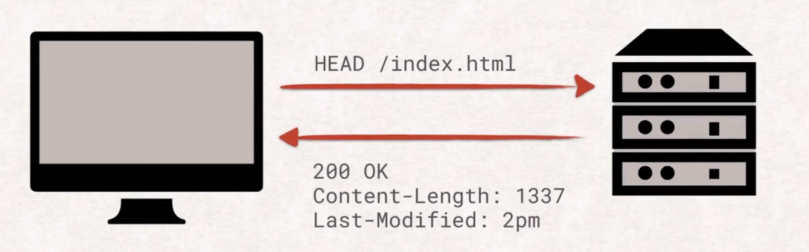
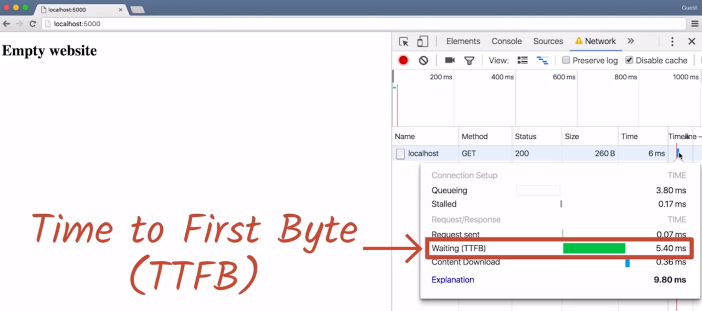
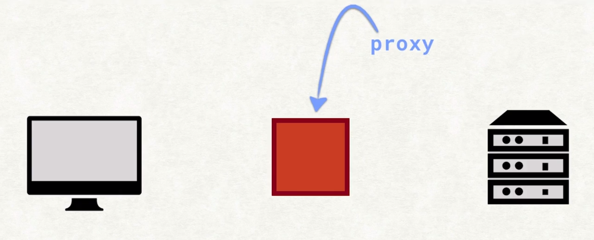

# Z.总结与提炼

> 需要知道的一些概念：
>
> HTTP（Hypertext Transfer Protocol）：超文本传输协议。
>
> RESTful API（Representational State Transfer）：表现层状态转化。
>
> 队头阻塞（Head-of-line blocking）：如果网站在获取第一个资源以后需要获取其他资源，我们必须等到第一个请求被响应，然后才能发送第二个请求，意味着又要等待一段时间，这段时间没有获得有效利用，这种问题称为队头阻塞。
>
> 传送首字节的时间 TTFB（Time To First Byte）：浏览器与服务器之间等待连接的时间。
>
> **中间人攻击（简称 MITM man-in-the-middle），攻击者在你和要连接的服务器之间扮演着中间人的角色，发生这种情况时，浏览器将以加密的方式连接到他们的服务器，而不是你以为你尝试连接的服务器**。
>
> **TLS** 是传输层安全协议（Transport Layer Security）的简称。TLS 并非只针对 HTTP，它可以用于任何协议，**例如 FTPS，它由 FTP 和 TLS 构成**，用于安全地传输文件。TLS 对通信进行特殊加密，使得目标接收者之外的任何人都无法读取数据。
>
> 哈希是**将数据转换为原始数据简短表示的流程**。原始数据的小小改动，将在哈希中有巨大的变化，如果两个文档的**哈希值**一样，那么它们非常非常非常有可能是同一文档。
>
> 当我们提到 **HTTPS** 时，实际上说的是两个不同的概念：
>
> - HTTP
> - TLS（之前称为 SSL）。
>
> 队头阻塞（HOL，Head of Line）是指某个请求阻止系统完成其他请求。
>
> **多路复用（Multplexing）**是个比较华丽的词，**表示将多个信号整合成一个新的信号**，对于 HTTP/2，我们现在有一个连接，而不是六个连接。
>
> 这种限制/规则称为**同源策略（same-origin policy）**，也就是不同源之间无法发送 ajax 请求来获取数据。
>
> 如今，你可以利用**跨域资源共享（简称 CORS - Cross Origin Resource Sharing）**并通过 AGB 报头，轻松地实现资源共享，这是解决单一起源问题最强大的工程解决方案，但是直到几年前很少有浏览器支持 CORS，在此期间，人们需要自己想出技巧来应对单一来源策略。

[TOC]

## 1. HTTP 的请求和响应周期

> 你会学到请求的来龙去脉，具体了解如何请求页面，收到标题，HTTP 代码以及如何传输数据。

### 1.1 web 简介

- 从技术上来说 web **只是互联网的一小部分**，但是，这也是唯一一种人们在使用甚至意识不到它的存在的互联网（web）。
- web 是一种可以被网络开发者**用于向世界传达观点的<u>平台</u>**，它是**服务器和客户端之间的<u>通用语言</u>**。
- 在这门课程中，我们将了解**到底什么是 web**，**如何利用 web 来发挥你的优势**，以及**如何避免那些会影响到<u>用户体验</u>和<u>安全性</u>的错误**。
  - 我们需要了解到对于网络应用而言最重要的两点：用户体验（性能、交互性、UI）和安全性。
- 为了像工程师一样思考问题，你需要**了解 HTTP 使用的语言**以及**浏览器内的实现**。我们将运用这些知识，调用浏览器 API 以充分发挥它的潜力，**提高 HTTP 的安全性**，避免受到窃听者的攻击，并部署最新的 web 协议 —— HTTP2。
  - 新的协议必定会想要解决一些问题和提高性能。
- 了解我们每天都会用到的**媒介的功能和局限性**将有助于你进一步掌握这一媒介。**学完这门课程后，你将会理解在浏览器和服务器之间发送的每个字节**。
  - 媒介的功能：比如可以帮你计算，定位置，导航，聊天，发布消息，获取信息...等等
  - 局限性：比如无法做到像物理空间上人与人之间，人与物之间的信息传递（比如皮肤与其他物体或者其他人的接触）


### 1.2 HTTP 请求

> 为什么我们需要 HTTP 请求？

**互联网比 web 存在的时间更久。**虽然计算机已经可以借助**电子邮件或 FTP** 等方式**在互联网上互相通信**，但是**没有公开可用的通用方法来发布和访问文档**。

- 电子邮件或 FTP 是单点对单点的方式，而后者是多点对单点。

这个时候就要提到 Tim Berners-Lee 了，他希望有一种**开放机制能够让研究者通过互联网发布、阅读和评论论文**。他希望有一种**关联文档网络，即超文本文档**，Berners-Lee 选择了 SGML 的一个子集，并称之为 HTML 即**超文本标记语言（Hypertext Markup Language）**。然后，他设计了 HTTP 即**超文本传输协议（Hypertext Transfer Protocol）用于传输这些 HTML 文档**。

- HTML 可以让文档的显示和功能更加的丰富。
- HTTP 让文档的传输安全并且有效（比如新旧文档的传输信息对比判断是否更新）。

超文本听起来很未来主义、复杂，但其实就是文档中的文本，可以引用其他文档，这些引用称之为链接。获取文档后，用户**不仅能够阅读该文档**，而且可以**通过这些链接访问其他相关文档**。尤其是在 Berners-Lee 所涉及的**细致严谨的环境下**，这种功能非常实用。但是超文本不仅可以**引用文本，还可以链接到图片、代码、样式等文件或其他内容**。

Tim Berners-Lee

- [关于他在维基百科上的介绍](https://en.wikipedia.org/wiki/Tim_Berners-Lee)
- [关于他在 W3C 上的介绍](https://www.w3.org/People/Berners-Lee/)
- [关于他在 TED 上的介绍](https://www.ted.com/speakers/tim_berners_lee)

通用缩写

- [SGML - 标准通用标记语言](https://en.wikipedia.org/wiki/Standard_Generalized_Markup_Language)
- [HTML - 超文本标记语言](https://en.wikipedia.org/wiki/HTML)
- [HTTP - 超文本传输协议](https://en.wikipedia.org/wiki/Hypertext_Transfer_Protocol)

#### HTTP 的工作原理是什么？

在一开始，Berners-Lee 设计了一种**模板**，你可以通过填写该模板向服务器上的文档**发出请求**，原始的协议（后来被称为 HTTP 0.9）非常有局限性。你需要在模板中填入你**希望获取或存储的文档的位置**，包括**名称**和所有你认为必要的**额外信息**：

- HTTP 方法（请求的动词）
- Host
- Date
- ...

随后，该请求被发送至服务器。

因为**服务器懂 HTTP，所以知道这是 HTTP 请求，从而知道客户端想要什么，该协议还有响应模板**。这些模板比较**多样化**，因为一个请求可以有**多种结果**包括：

- 出现**错误**
- **无法读取请求表单**
- **将客户端重定向到完全不同的服务器**
- ...

> 简单的说就是：客户端发送请求模板，服务器端收到后，处理模板中收到的信息，然后返回相应的响应模板。


### 1.3 获取单一请求

HTTP 的**基本概念**：请求和响应。传输数据是通过**网络线缆**。

实际请求看起来是这样的：


在此示例中，我们尝试从服务器**获取**文档，协议还能够**添加（add）**、**删除（delete）**和**更新（update）**文档。**为了区分这些<u>功能</u>**，协议的**第一行以一个 HTTP 方法（即一个动词）开头**。**此请求使用了 GET 方法，表示我们想要服务器向我们发送数据**。另一个方法示例是 **POST，指示服务器保存我们发送的数据**。还有其他各种方法，稍后我们将在 REST API 部分详细讲解这些方法。


方法后面是我们**要获取的文档的路径和名称**，这里，我们希望服务器向我们发送一个位于 pictures 目录下叫做 kitty.jpg 的文件。第一行最后一部分是我们使用的 HTTP 协议版本。

#### 请求的报头部分


**报头是关于请求本身的其他数据**，很多报头都是标准化形式，包含以下信息：

- 发出请求的浏览器类型： `User-Agent: Mozilla/5.0`
- 浏览器支持什么格式： `Accept: text/html`
- 浏览器的本地缓存中已经具有该文档的哪个版本： `If-None-Match: fd87e6789`

除 Host 报头之外的所有报头都是可选内容，**可以发出的最小请求仅包含第一行和 Host 报头**：


#### 响应的报头部分


响应看起来很像请求，最大的区别可能就是第一行。从第一行可以找到响应的**状态码**，比如表示：

- 请求是否成功完成
- 文档是否未找到
- 服务器是否想要将你重定向到其他位置
- ...

和请求一样，下一部分是报头部分，不仅包含关于**文档的数据**，而且包含**关于服务器和连接的数据**。同样，大部分报头都是可选的，**唯一需要包含的标题是 Content-Length**，告诉客户端将获得多少字节的数据。

在报头部分和一个空白行之后，系统就会发送实际文档。可以是 JPEG 图片、HTML 文档，或你想传输给用户的任何文档。


### 1.4 获得多个请求

我们刚刚看了如何使用 HTTP 请求来获取一个文档。这些文档可以是任何类型的数据，但是在 Web 上，一切通常都以**索引文档**（index.html）开始。如果**在请求中找不到任何具体的文件，服务器就会向你发回索引文档**。

**通过在浏览器地址栏中输入 URL，用户指示浏览器通过 URL 辨识出服务器的主机名**，并与它建立新链接，随后获得 URL 的路径中指定的文档。这里，服务器将发回 index.html，浏览器可以开始解析该文档：


这是一个非常有趣的步骤，**为了处理接收的数据，浏览器会执行各种操作**。

> 相关内容可以去查看性能优化课程。

浏览器解析响应后，情况就变得复杂了。当浏览器读取 index.html 时，它很可能会发现要正常显示网站需要其他文档的引用。例如图片、样式表、JS 文件、视频等等，对所有这些资源发出另一个请求。浏览器收到响应后，就会重复整个解析和可能存在的发送新请求的过程：


这也意味着，**每个资源都可以反过来获取其他资源**。每个网页都有自己的一组依赖项，例如图片、CSS 和 JS 文件。也就是，**所发送的请求可能比你想象中要多得多**:


> 在练习题中：
>
> 为了避免因为插件、扩展程序和浏览器缓存结果而导致错误的结果，确保在隐身窗口中运行该网页并选中 Disable cache 复选框。

### 1.5 通过 POST 请求发送数据

有时候你可能希望用户输入一些数据或上传照片并发送至服务器，这时候我们之前提到的 POST 方法就派上用场了，**对于 POST 请求，请求本身也可以具有有效载荷（payload 有效负荷）或主体**，即那些我们之前**在响应中已经见过，但是没在请求中见过的东西**。

数据被发送至服务器后的具体处理流程由后端开发者决定，已经超出这门课程的范畴。但是，需要知道的是**代理和浏览器处理 POST 请求的方式可能与 GET 请求不同**。

见过这种情况吗？


就是你当前查看的网页是 POST 请求结果时发生的情况。如果你尝试重新加载此类网站，浏览器将提示你确认是否执行重新加载操作，因为 **POST 请求可以是破坏性操作**，重复执行的破坏性可能比你想象的要严重。

因此**通常建议后端开发者不要用网站对 POST 请求做出响应，而是用重定向做出响应**，以避免这种有冲突的行为。对于用户来说，这种重定向实际上不可见，但是**避免了重新加载问题**：


> 对于这一小节的后部分关于 POST 请求破坏性的问题我不是很理解，百度也没有搜索到，可能和后端有很大的关系吧。

### 1.6 从 XHR 到 Fetch

假设有个网站想要显示当前天气图片，我们不知道用户在未来访问该网站时的天气如何，当然，我们可以从一开始就加载所有可能需要的图片，但是这种做法很快就变得不现实。我们来了解下 Ajax。

**Ajax 是<u>一系列</u>的 web 技术**，使你**能够通过 JavaScript 以程序的方式发出请求，而不是浏览并重新加载整个网站**。

XMLHttpRequest（简称 XHR），是目前最常见的**执行方式**。

与 JavaScript 现今的功能相比，XHR 的 API 很复杂并且已经过时了。因此我们将跳过 XHR 内容，并直接使用它的更新版本 Fetch。Fetch 能执行完全相同的任务，但是利用了 promise 的 API 更加整洁，因此，它与其他现代 JavaScript API 的互动性更强：


借助 Fetch 你可以调用协议指定的所有 HTTP 方法并完全控制发送哪个报头，当然包括几乎所有的报头。

### 1.7 小结

我们学习了 HTTP 的请求和响应，现在你已经充分了解 HTTP 的工作原理以及当你访问网站时，浏览器实际执行的操作。你知道如何将元数据关联到请求和响应上，并且知道如何使用 JavaScript 请求其他文档。

接下来，我们将深入**讲解 HTTP 协议以及在服务器和浏览器之间来回发送的实际字节**。

---

## 2. HTTP/1

> 你将深入研究 HTTP 动词，还将深入挖掘 HTTP 中使用的重要标头，并了解如何使用 REST 高效地构建应用程序。


### 2.1 HTTP 简介

作为开发者，我们每天都会使用 HTTP，我们在使用 Firebase 的 JavaScript SDK 时，或在平板电脑或手机上使用浏览器查看网站时，都会发出 GET 和 POST 请求。

要成为优秀的前端工程师并创建网络应用仅仅使用 HTTP 并不足够，你需要深入了解**为何使用某些技巧，为何其他技巧不可行或不推荐使用**。


### 2.2 NetCat 命令

### Netcat

在本课中，我们将使用[Netcat](https://en.wikipedia.org/wiki/Netcat)命令。 Netcat 是用于通过网络连接发送和接收消息的实用程序。 Netcat 被称为网络工具的瑞士军刀，我们将使用它来与服务器直接通信。

### Netcat 命令

Netcat 有许多变体，我将使用的是使用`nc`命令访问的变体。 在这里，我使用 Netcat 在端口 80（HTTP 连接的默认端口）上连接到 Google。

[Netcat 示例](https://classroom.udacity.com/nanodegrees/nd019-cn/parts/8f508d0f-3ede-4438-a76a-1388a0fc3082/modules/2ade007c-9ac6-4dad-995d-6dec0deb7c8f/lessons/8080328065/concepts/81948027770923#)

提示等待我们输入 HTTP 请求的详细信息。 要发送 GET 请求，请输入：

```
GET / HTTP/1.1
```

... 然后确保你按下输入按钮两次（一次到达一个新行，还有一次表明你已经完成输入请求的标题）。 你会得到类似如下图所示的界面：

[netcat GET 示例](https://classroom.udacity.com/nanodegrees/nd019-cn/parts/8f508d0f-3ede-4438-a76a-1388a0fc3082/modules/2ade007c-9ac6-4dad-995d-6dec0deb7c8f/lessons/8080328065/concepts/81948027770923#)

### 延伸阅读

- <https://en.wikipedia.org/wiki/Netcat>
- <http://nc110.sourceforge.net/>
- [百度百科 - Netcat](https://baike.baidu.com/item/Netcat/9952751?fr=aladdin)


### 2.3 HTTP Verbs

HTTP 已经存在很长时间了，以至于该协议依然会执行一些你很少在现代协议中会发现的操作。

在网络上来回发送的字节是普通的旧文本，任何人都能够读懂。HTTP 的这种简单性意味着我们可以直接与协议交互，不需要调用第三方库执行任何额外的操作。

每个 HTTP 请求都以一个独特的动词开头，我们称之为方法，并起到特殊的作用。

我们已经知道 GET 和 POST 请求，虽然二者是最常见的方法，但是你也会经常遇到一些其他方法。常见的方法包括：

- GET
- POST
- PUT
- DELETE
- HEAD
  - HEAD 方法是一个有趣的方法，因为**通过它可以获取文件的所有报头，而不需要接受整个文件本身**。
  - 这样可以检查**存储响应的空间是否充足**，或者**该网页的缓存版本是否依然是最新版本**，这样的话，如果浏览器在缓存中依然有该文件的最新版本，就不需要重新下载该文件：
    
  - 但是使用 HEAD 请求以后如果需要更新本地文档版本，那么需要再发送一次请求。
  - 每个**请求响应对**都被称为一次往返，需要很长时间才能完成。现在的网站有大量资源在潜在的 GET 请求之前发送 HEAD 请求**将大幅降低网站的加载速度**，因此，我们可以采取一些方法来降低这些往返操作的成本（所以尽量少使用 HEAD，除非文档很大）。这些我们稍后将详细讲解。暂时只需记住**我们要尽量减少网站的往返操作，也就是尽量减少请求数量**。
- OPTIONS
  - OPTIONS 应该能够**列出当前 URL 可以使用的方法**，但是**只有部分服务器支持该方法**。

### 2.4 常见的响应标头

请求和响应都有一个报头部分。注意，报头包含了关于请求或响应的其他数据，我们已经了解了一些常见的请求报头。请看看下面列出的响应可能具有的重要报头。

> Google Translate:
>
> 响应报头
>
> 标头包含有关请求或响应的其他数据。这里是一些重要的：
>
> `Content-Length`是**必须包含在每个响应中的标头**，并告诉浏览器响应中文档的大小。这样浏览器就知道在标题部分之后可以接收多少字节，并且**在下载文件时可以显示有意义的进度条**。
>
> `Content-Type`也是一个非可选标题，**它告诉您文档的类型。这样浏览器就知道要启动哪个解析引擎。如果是 image/ jpeg，则显示图像。这是 text / html？让我们解析它并发出必要的额外 HTTP 请求。**等等。
>
> `Last-Modified` 是一个标题，其中包含上次更改文档的日期。事实证明，在尝试确定文档是否已更改时，`Last-Modified`日期**不是很可靠**。有时开发人员会在修复某些内容后将所有文件上传到服务器，**即使内容仅在子集上更改，也会重置所有文件的 Last-Modified 日期**。为了适应这种情况，大多数服务器也会发送一个 ETag。 ETag代表实体标记，并且是唯一的标识符，其仅根据文件的内容而改变。**大多数服务器实际上使用像 SHA256 这样的散列函数来计算 ETag。**
>
> - 这一条的意思是，我们应使用 ETag 来判断文件是否更改，而不是日期。
>
> `Cache-Control `正是它听起来的样子。**它允许服务器控制客户端缓存收到的响应的方式和时长**。 `Cache-Control`是一个复杂的野兽，具有许多内置功能。 99％的情况下，您只需要“cacheability（可缓存性）”和“max-age（最大年限）”。
>
> `If-Modified-Since ` 允许服务器跳过发送文档的实际内容（如果自该报头中提供的日期以来尚未更改）。 ETags 有类似的东西吗？就在这里！报头称为 If-None-Match 并且完全相同。**如果文档的 ETag 仍然与 If-None-Match 标头中发送的 ETag 匹配，则服务器将不发送实际文档**。 If-None-Match 和 If-Modified-Since 都可以出现在同一个请求中，但 ETag 优先于 If-Modified-Since，因为它被认为更准确。
>
> >  If-None-Match 和 If-Modified-Since 都可以出现在同一个请求中，都是服务器用于判断是否发送文档的依据。
> >
> >  If-None-Match 对应的是文档的 ETag 信息。
> >
> > If-Modify-Since 对应的是文档的修改日期信息。
> >
> > 但 ETag 优先于 If-Modified-Since，因为它被认为更准确。

还有更多的标题和很多东西要探索。如果您想了解更多信息，请查看有关HTTP标头的以下信息：

- [list of HTTP headers](https://www.google.com/url?q=https://en.wikipedia.org/wiki/List_of_HTTP_header_fields&sa=D&ust=1460140076629000&usg=AFQjCNHMTe05Wkomeyd8bB9GvVrUyuC1Dg)

 **作为网络开发者，我们通常并不直接发送 HTTP 请求，但是有必要知道它们的工作原理以及对应有何影响**。


### 2.5 REST

在编写网络应用时，你将遇到很多需要与其通信的 API。某些可能是 JavaScript API，这些 API 只需调用 JavaScript 中的函数。其他 API 是第三方提供的，需要你自己发出 HTTP 请求。

RESTful API 遵循一种叫做 REST 的设计模式，专门用于 HTTP。REST 是表现层状态转化的简称（**Re**presentational **S**tate **T**ransfer），但说实话，光听名称并不明白是什么意思：

并非所有的 API 都遵循 REST 模式，但是有很多都遵守。我们来看看这一概念。

**<u>基本实体</u>是集合以及位于这些集合中的对象**，从集合中获取项目的一般模式是使用 GET 请求加上集合名称和集合中的单个条目的名称：


例如，如果我想查询 Richard，我将发送此请求：


服务器将发送包含 Richard 的数据的记录。

如果我想更新该记录中的数据，我将使用 PUT 请求并将更新的信息添加到该请求中，每个后续的 GET 请求现在应该生成更新后的记录：


POST 请求与 PUT 请求非常相似，但是你使用它创建新的记录而不是更新现有的记录：


注意，你通常不会提供新记录的名称，而是由服务器来设定，该 POST 请求的响应通常会重定向到新创建的记录。（所以这里的 POST 后并没有一个具体的项的名称）

> 这里**新记录的名称**指的是**项目集合中的对象名**。

最后，DELETE 和你想象的一样，它会从集合中删除条目：


### 2.6 性能基础

我们手动编写了直接与互联网互动的请求，并在服务器发出响应时就收到了它。感觉很酷，对不对。

就好像我们和发送的字节之间几乎没有软件，但**其中依然发生了很多我们无法直接看到的操作，实际上这对整个请求响应流程的速度有很大的影响**。

如果你对网络基础架构有点熟悉，就可能知道 HTTP 并不是整个组成部分，它只是协议。为了了解整个架构，我们将 HTTP 放在 TCP 上方，放在 IP 上方，放在以太网上方：


大部分情况就是这样。

我们不需要理解每个层级，但 **TCP 对如何构建性能高效的请求有着尤为重要的影响**，这值得仔细研究。

**互联网协议使我们能够与互联网上的其他机器通信**，而 **TCP 使我们能够在这两台机器之间建立多个独立的数据流**，**这些数据流通过<u>端口号</u>加以区分**。TCP 协议**还确保所有文件包都不会丢失，并且按照正确的顺序抵达，所有这些都需要耗费时间和资源成本的防范措施**：


**开启新连接的代价尤其高昂，因为 TCP 握手要确保两台机器都发现新创建的通信渠道，这需要两次往返通信**：


**如果使用的是 HTTPS，还需要执行额外的 TLS 握手**。

完成所有这些操作后，真正的 HTTP 协议才最终接受任务。

**队头阻塞（Head-of-line blocking）是一个严重的网站性能瓶颈问题**，**浏览器建立六个并行连接**会有所帮助，但是并不理想。


### 2.7  性能详情

在此示例中，从在地址栏中按下 Enter 键到显示之间超过 50% 的时间都花在等待回答上。这段等待时间称为传送首字节的时间，简称 TTFB（Time To First Byte）：



**如果此网站需要获取其他资源，我们必须等到第一个请求被响应，然后才能发送第二个请求，意味着又要等待一段时间，这段时间没有获得有效利用，这种问题称为队头阻塞**。

**队首阻塞了剩余的资源的请求，为了稍微避免这种限制，浏览器开了六个并行连接。在浏览器中，打开所有这些连接代价很高，因为需要进行 TCP 握手，浏览器建立六个并行连接只是暂时解决了队头阻塞问题**。如果你的网页上有大量资源，你将花费大量时间去等待。

**队头阻塞是一个严重的网站性能瓶颈，浏览器打开六个并行连接有所帮助，但是效果不明显**。稍后我们将了解 HTTP/2 如果解决队头阻塞问题。

### 2.8  性能详情 2

**每次浏览器连接到服务器以发送请求时都需要完成 TCP 握手流程。这种三次握手非常消耗时间，为了抵消这些握手带来的代价，HTTP/1.1 推出了持续作用（keep-alive）这一概念**：


**如果<u>客户端将 connection 报头设为 keep-alive</u>，服务器在成功发出响应后将不会关闭连接。而是允许客户端重复利用已经建立的连接来进行其他请求**：


> 如果不使用 Connection: keep-alive，那么当响应结束后，客户端与服务器之间的连接会断开，如果需要再次发送请求，又需要重新连接，那么又需要经历三次握手的时间。

注意，在上个请求的响应完全传输之前，你依然可以发送请求。总之，这么做使得网络开发者**尽量减少其他资源的数量，充分利用他们的六个连接**。

**因此 JavaScript 和 CSS 文件，通常都捆绑到一起，图片也会被加工为精灵图（sprites），仅用一个请求就能获得捆绑包**（bundle.js）：


## 3. HTTPS

> 你会发现安全对网络的重要性。你将了解 TLS，发现加载混合内容的问题，快速入门了解加密并验证证书颁发机构。


### 3.1 HTTPS 简介

当我们在一些公共场合使用免费的公共 Wi-Fi 时，其实会遇到安全问题，因为你不知道这个 Wi-Fi  是否被别人动过手脚。因此，你可能会遇到被盗取数据、银行账户、窃听你的行为等风险。而 HTTPS 可以保护你和你的用户免遭中间人攻击和盗取数据等风险。

要充分利用网络的强大功能，你需要开始使用 HTTPS，并且不仅仅是用于登录网页，而是所有网页。


### 3.2 加密 HTTP

人们能够以某种方式偷听开放的 HTTP 连接，偷听者能够阅读所有的请求和响应并提取所需的所有数据。

加密 Wi-Fi 有所帮助，但是你无法控制咖啡厅的 Wi-Fi 设置并且以前的加密方法很容易破解。**因此 HTTPS 推出了加密功能，它将使浏览器<u>加密请求</u>只有你要连接的服务器能够解密这些请求**，咖啡厅的店主或恶意偷听者都无法阅读你的数据流。

但是**如果你以为你连接到了正确的服务器，而实际上没有呢**？


在**中间人攻击（简称 MITM man-in-the-middle）中，攻击者在你和要连接的服务器之间扮演着中间人的角色，发生这种情况时，浏览器将以加密的方式连接到他们的服务器，而不是你以为你尝试连接的服务器**。例如 Facebook，攻击者将解密你的数据，阅读你的所有私密信息，重新加密这些信息，然后将信息传达给 Facebook 的服务器，反之亦然，你和 Facebook 都不知道中间有个攻击者。

**为了解决这个问题，除了加密功能之外，HTTPS 还推出了验证功能，服务器需要标识自己的身份，只有真正的服务器才能标识自己。因此你能够确定你与之通信的服务器是正确的服务器。**

- [Firesheep](https://codebutler.github.io/firesheep/)
- [Firesheep 维基百科](https://en.wikipedia.org/wiki/Firesheep)

其实我们自己也可以成为中间人，如代理（proxy）服务器：



**代理是合理的中间人**，并且具有很多优势，例如

- 通过额外的压缩功能节省带宽
- 对图片下载采样
- 以及主动进行缓存。

> 代理服务器可以是远程的，也可以是你本机。因为服务器本身不过是一个程序，只是这个程序相对比较复杂。（一定要记住，在计算机上的所有东西都是程序，都是 0 1 所组成的存储与计算的结合体）


当我们在练习中使用代理访问非 HTTPS 网站时，会出现这样的结果：


浏览器和优达学城服务器之间存在代理，**因为代理在配置时使用的证书无效，所以 chrome 阻止我访问该网站**。

＃无效的证书澄清 **无效证书是指证书的 URL 与浏览器的地址栏中的 URL 不匹配**。 

> 我想证书与地址之间有一个绑定关系，浏览器在确定是否提示之前会先查看本地的证书与你所访问地址是否匹配。
>
> 这个地址应该是 IP 地址，但中间人是否可以伪造 IP 地址？
>
> 从这个示例来看视乎是很难的。


### 3.5 TLS 与证书颁发机构

**当我们提到 HTTPS 时，实际上说的是两个不同的概念：**

- **HTTP **
- **TLS（之前称为 SSL）。**

TLS 是传输层安全（Transport Layer Security）的简称。TLS 并非只针对 HTTP，它可以用于任何协议，**例如 FTPS，它由 FTP 和 TLS 构成**，用于安全地传输文件。TLS 对通信进行特殊加密，使得目标接收者之外的任何人都无法读取数据。

> 我想 TLS  应该是对文件传输过程中的一种协议，他可以用哈希与加密让文件的传输更安全。
>
> 但根据我对课程后面内容的理解，应该是利用 TLS 来确认是否为我想要连接的服务器。

在现实中，我们根本无法破解 TLS 加密，**为了确保通信的服务器是你要通信的服务器，TLS 会用到信任链这一功能。服务器通过证书来表示自己的身份，该证书中包含关于服务器本身，以及加密密钥指纹的元数据**：


这些证书由证书授权机构颁发，证书授权机构有很多。当证书由此类授权机构签名了，那么如果你使用的密钥与该指纹匹配，你将知道你与之通信的服务器是正确的服务器。

实际上，你可以在浏览器中查看证书授权机构列表，甚至可以添加你自己的授权机构。

大多数颁发证书的公司，它们需要支付费用，因为它们不仅会验证你的服务器，而且会验证你作为该服务器的所有者的身份。因为并非所有开发者都能够或想要支付证书费用以便向用户提供基本的安全性，因此 **Let’s Encrypt** 应运而生。

TLS = 传输层安全 (Transport Layer Security)

- [文件传输协议 (FTP)](https://en.wikipedia.org/wiki/File_Transfer_Protocol)
- [FTPS](https://en.wikipedia.org/wiki/FTPS)


### 3.6 TLS：密码学入门

TLS 有两个重要的密码构建组件，加密和哈希。当人们听到加密一词时，可能会想到**对称加密，加密一些数据并将加密的数据提供给其他人**：


> 锁表示加密后的数据，解密就需要相应的钥匙。

接收者需要使用**相同的密钥**来解密收到的数据，否者无法查看数据。


借助一些数学技巧，浏览器能够利用加密算法来使用一个密钥进行加密（encryption）并得使用另一个密钥进行解密（decryption）：


通常，加密消息的密钥已经公开，任何想要发送消息的人都可以使用该密钥加密，他们或任何其他人都无法使用同一密钥解密消息，只有拥有解密密钥的你能够解密消息，通过后台的数学算法，**两个密钥都可以用来加密和解密**。用**一个密钥加密后，只能用另一个密钥解密。**因此，可以说**有一个任何人都可以访问的公钥**，以及**一个只有所有者可以访问的私钥，私钥需要安全地存储**。

**非对称加密**，也称**公钥加密**。


### 3.7 TLS：哈希

我们了解了加密功能，注意 TLS 由两部分组成

- 加密
- 哈希

哈希是**将数据转换为原始数据简短表示的流程**。原始数据的小小改动，将在哈希中有巨大的变化，如果两个文档的哈希值一样，那么它们非常非常非常有可能是同一文档：


> 可以看到，就一个字母不同其产生的哈希值就完全不一样。

对于哈希函数，我们需要注意几点。

- 首先，应该**无法颠倒转换流程**。表示数据一旦转换为哈希，则无法再恢复成原始数据。
- 其次，应该**无法找到生成完全一样的哈希值的另一个文档**。

最常见的哈希函数是 SHA，它有多个版本，例如 SHA-256 或 SHA-512，后面的数字表示哈希的输出有多大（单位是位）。无论文档有多大，当你使用 SHA-256 时，输出将始终为 256 位。


### 3.9 证书颁发机构签名

我之前提到了证书授权机构，**它们的任务是对证书签名**，是什么意思呢？为何有人需要签名的证书？

当我们提到有人签名了文档，我们**指的是证书授权机构已经审查并验证该文档中的内容**，目的是**证明该实体已查看甚至创建该文档**。就像在文件上签名，证明你已经看过该文件的法律证据，**服务器也可以通过电子签名来证明**。

**服务器对文档签名并使用它们的私钥加密文档，然后返回签名的文档**。因为只有私钥的持有者能够解密文档，因此你知道你接受的文档与服务器发送的文档完全一样：


但是，文档可能会很庞大，例如 DVD 影像。使用非对称密码加密和解密需要很长时间，因此我们可以**只加密文档的哈希**，而不是整个文档本身。如果你想检测签名是否有效，可以**解密签名和哈希**并自己对文档进行哈希转换，看看这两个值是否匹配，这样我们就知道所接受的文档与服务器发送的文档是否完全一样，如果文档在传输中被更改了，则哈希与服务器作为签名提供的值不匹配，这叫做**无效签名**。


### 3.10 TLS 连接成功

现在我们已经拥有非对称的加密数据和分配数据的工具，我提到这些工具是 TLS 的构建基石，现在我将证明给你看，我们来逐步了解浏览器。为了简单起见，我依然会忽略一些复杂的细节，但不会对概念有影响。

第一步是**让服务器向你发送证书**，证书中包含**服务器的公钥**以及其他一些信息，例如证书的**目标网域**，以及**证书授权机构的签名**：


接着，客户端检查网域是否正确并检查授权机构的签名是否有效。正如之前讨论的，所有浏览器都在本地具有证书授权机构列表包括它们的公钥，因此不用检查签名是否有效：


现在客户端生成一个对称加密随机密钥，并一直使用下去，浏览器使用服务器的公钥对随机密钥进行加密并发送出去：


> 红框处是生成的加密文件


> 然后通过加密文件与公钥解密生成一个私钥：


与非对称加密相比，**对称加密**速度快了很多并且更加高效，能够更好地扩展到大型数据。但是更重要的是，服务器只有真的拥有私钥并且能够解密新的随机密钥才能继续通信。这样就可以验证服务器的身份。（这样服务器就能有一个和我们在本地计算机相同的私钥）

如果所有这些步骤都成功了，**最后的连接将建立成功，HTTP 协议能够接管任务，此时，你将在浏览器的网址栏中获得绿色挂锁符号。**

> 总结：
>
> 服务器发送证书，证书内带有一些信息，最为重要的是公钥。然后客户端随机生成密钥，将其通过公钥加密后发送给服务器，服务器通过私钥解密出对称密钥，之后的通信就利用这个密钥来加密和解密文件。


### 3.11 练习：SSL 错误

在上个场景中，只有两个地方可以出错：

- 要么是证书授权机构在证书上的签名无效。
- 要么是服务器在切换到对称加密后无法通信。

在现实中，出错的地方有很多：

- 证书有一个截止期限，因此可能会过期。
- 证书规定了哈希集合和支持的对称加密函数，这几年事实证明，某些加密函数比较薄弱。
- 有时候证书有效，但是服务器的其他设置无效。

在 badssl.com 上可以查看 TLS 连接有问题时浏览器的行为：


badssl.com 具有自己的有效证书，但是也具有故意无效的证书和无效的设置，因此我们能够了解在不同情形下浏览器的行为。我们来看看 sha1-2016，可以看到绿色锁不见了：


对于这道练习，请使用 badssl.com 网站判断哪些设置导致 chrome 拒绝访问网站：


- 过期证书会发生这种情况吗？
- 另一个主机的证书呢？
- 混合内容会导致 chrome 拒绝访问网站吗？
- 信任链不完整
- 使用 SHA256


- <https://badssl.com/>


网站中每个链接的背景色差不多就表明了会发生的情况，红色表示不可行，绿色表示可能，橘色等其他颜色表示结果可疑：


**过期证书**或**主机错误**的证书都拒绝访问。

混合内容，信任链不完整和 SHA256，都允许用户访问。但是并非都会出现绿色锁。


### 3.12 混合内容

如果索引文档通过 HTTPS 呈现，不错。那网站的资源呢？它们也通过 HTTPS 呈现吗？

失去绿色锁的快速方式是通过普通的 HTTP 呈现资源，发生这种情况时，网站就会进入混合内容状态。当你打开一个本应通过 HTTPS 呈现，但是其中包含来自非 TLS 加密来源的资源（例如图片 iframe 样式表或脚本）的网站时，就会出现混合内容：


**一个常见错误是从非 TLS CDN 获取 jQuery。**

通过非安全渠道传输的资源类型不同，导致的后果可能有所不同，可能会失去绿色挂锁，但是依然可以运行。资源可能被屏蔽或使网页崩溃，甚至可能会出现红色挂锁。不同的情况，浏览器的行为不尽相同，因此你肯定需要避免这种情况，检查网站是否有混合内容。

实际上， Google 建议通过 HTTPS 呈现所有资源。这样才能够避免混合内容警告，你的网站和其中的资源将安全地传输。


- [在 MDN 上的混合内容](https://developer.mozilla.org/en-US/docs/Security/Mixed_content)


## 3.13 练习：混合内容

在本地开发时，开发者通常会使用**自签名证书**，**这些证书将自己称为自己的证书授权机构。因为它们是自签名，因此不提供任何类型的身份验证，浏览器将抱怨并显示红色挂锁**。但是可以让你测试你的网站是否包含混合内容。

请启动该项目的二进制文件，并在浏览器中加载提供的 URL，你可能会注意到，当你启动该服务器时，它会自动为你生成一个自签名证书，因为这是一个自签名证书，因此你可能会看到错误网页：


你可以继续安全使用，点击高级（advanced）然后点击底部的“继续前往”链接。

你将看到优达学城徽标被拆分成多个图块，有任何混合内容违规行吗？如果有，是哪个图块导致了问题？


#### 辅助材料

[ L3-Mixed-Content-Binary](http://video.udacity-data.com.s3.amazonaws.com/topher/2016/June/57571768_l3-mixed-content-binary/l3-mixed-content-binary.zip)


虽然网页本身是通过 HTTPS 加载的，但是有一个图片是通过 HTTP 加载的，导致出现混合内容警告，实际上有多重方式来解决此问题。

最简单的方式是查看控制台，存在问题的会打印出现在控制台中。

另一种方式是查看 Security 窗格，下面会有混合内容警告：


点击上面的链接会使我们转到 Network 窗格，并添加了混合内容过滤器。

我们可以使用开发者工具fico轻松地诊断混合内容问题，**如果你要开发任何网络内容，应该始终打开开发者工具，相信我，它会为你节省大量时间。**


## 3.14 小结

安全性非常重要，有时候是网络开发比较头疼的部分。如果在这节课之前，你不知道什么是 HTTPS，那么现在应该非常熟悉了。

大部分托管服务和 CND 现在都支持 TLS，随着越来越多的浏览器 API 仅支持 HTTPS 的网站，你应该为了你的用户和你的网站始终使用 HTTPS。


---

## 4. HTTP/2

如今的网站请求资源的数量及大小都在稳步提升，而 HTTP 1.x 的设计已经无法满足现在对于开发和性能的要求，我们需要一种新的协议来帮助我们构建更加强大的网站。

###  4.2 HTTP/1 问题1: 队头阻塞

队头阻塞（HOL，Head of Line）是指某个请求阻止系统完成其他请求。

浏览器最多会向同一服务器开启六个连接，意味着最多同时有六个请求。

下一个请求的开始需要等到上一个响应的完成，如果请求过多，则会有很多时间都在等待。

### 4.3 HTTP/1 问题2：未压缩标头

为了缩短数据发送时间，**很多网站都是用 gzip 或其他适用于网络的压缩算法压缩资源**，HTML 模板项目是用 gzip 压缩算法。

### 4.4 HTTP/1 问题3：安全性

HTTP/2 处理的另一个完全不同的领域是安全性。

电子商务越来越热门，处理信用卡和合同的敏感数据也变得热门起来，如果网站不用 TLS 来处理此类数据，那么绝对是很大的疏忽，因此 TLS 成为了 HTTP/2 规范的必要部分。

### 4.5 HTTP/2 神奇之处

HTTP/2 解决的另一个重大问题是队头阻塞，它通过一种叫做多路复用的技巧来解决这一问题。**多路复用（Multplexing）**是个比较华丽的词，**表示将多个信号整合成一个新的信号**，对于 HTTP/2，我们现在有一个连接，而不是六个连接。

单个连接上多路复用，当一个信息流被阻塞时，另一个信息流可以获取该连接并充分利用本来会成为闲置时间的时段，队头阻塞问题解决了。

HTTP/2 可以压缩报头数据，对于 HTTP/2，报头不仅通过 gzip 被压缩，并且工程师设计出专门针对报头的特殊结构和 HTTP/2 多路复用功能的压缩算法。

### 4.7 使用 HTTP/2

随着 HTTP/2 中的队头阻塞消失了，并且现在报头压缩请求代价很低，因此没有必要**合并 JavaScript 或 CSS 了，实际上它会让情况变得更糟糕**。

假设要更新一个缓存的文件，如果你修正了 JavaScript 文件中的一个拼写错误，例如缺少一个花括号，则用户必须重新下载合并的整个 JavaScript，而不是仅仅发生更改的片段。如果每个 JavaScript 文件都分开来了，则只需更改这个文件的缓存。

另一个优势是**发送的请求越多，新的报头压缩法越高效**。发送的请求越多，重复利用的报头越多，也意味着**有很多指向不同服务器的连接实际上对性能有负面影响**。

但是，缩小和压缩 JavaScript CSS 及图片依然是很好的做法，哪怕是一个字节都值得节省，尤其是在发展中国家/地区，节省字节就是节省费用。

此外，关于渲染性能的所有建议依然有效，例如推迟 JavaScript 或内嵌样式，花时间构建完善的客服支持服务也不例外。

最重要的是 HTTP/2 可以向后兼容，所有支持 HTTP/2 的服务器都支持 HTTP/1。不支持 HTTP/2 的客户端将直接后退成支持 HTTP/1，并且和之前一样运转。而且这个客户端越来越少，因此不用担心使用 HTTP/2 有何问题。

### 4.8 练习： HTTP/2 开发技术

**对于 HTTP/2，任何关于合并文件或将子图片合并为精灵图的步骤都需要重新考虑**。大部分情况下，这么做都不合适，因为让缓存变得很低效。

压缩依然是很好的做法，因为它降低了需要传输的字节数，因此压缩JavaScript CSS 和标记是正确的选项。

共享资源不合适，因为使得 HTTP/2 报头压缩器效率更低并导致浏览器打开新的连接，这样就会代价很高。

**使用单个 CDN 就可以胜过共享的不足之处，因为它使得资源在地理上更接近用户并缩短了往返时间。**

---

## 5. 安全性

安全对每个 Web 应用程序都至关重要！你将**了解常见的安全缺陷**以及**如何避免这些缺陷**。

### 5.1 安全性简介

欢迎回来，你可能会疑问，为何又要讨论安全性？我们已经讨论过 TLS 以及它在 HTTPS 中的用途，HTTPS 涵盖了各种攻击行为，例如偷听你的流量或者冒充整个网站。但是，如果有一个梯子通到第一层的窗户，那么全世界最安全的大门也无济于事，这个梯子就是你的网络应用。

我们将了解某些设计方式可以**如何让攻击者窃取敏感数据**，以及作为开发者，你可以**如何让你的网络应用免遭此类攻击的破坏**。

### 5.2 来源

**一般来说，JavaScript 无法访问除本身之外的任何其他来源的数据。**

来源由三部分组成：

- 数据模式（Date Scheme）
- 主机名（host name）
- 端口（port）


对于你目前正在查看的网页，模式是 HTTPS，主机名是 www.udacity.com 端口是 443：


如果你更改任一部分，就会处在不同的来源并且适用不同的规则。

除了之前讨论的混合内容问题之外，这也是不要混合 HTTP 和 HTTPS URL 的另一个原因。

但是当你使用多个来源时，需要遵守哪些规则呢？

首先，不能向其他来源发出 fetch 请求，实际上在某些情况下，可以这么做，但是你无法阅读获取的内容，其次，如果包含 JavaScript 的 iframe 或窗口来自其他来源，则无法检测它们。

如果你仔细思考下，就会发现这些规则很合理，假设我可以向其他来源发出 fetch 请求，我可以构建一个网站，向 facebook.com 发出 fetch 请求并窃取你的所有 Facebook 消息，甚至更糟糕，我可以向 udacity.com 发出 fetch 请求并让你缺席所有的优达学城课程。我们肯定不希望发生这种情况。

这种限制/规则称为**同源策略（same-origin policy）**。


### 5.3 来源 2

刚刚介绍了一些规则，但是如果有规则，这些**规则就有例外情况**。

你非常清楚我们可以包含其他来源的样式表、图片、视频、iframe、甚至脚本，以及向其他来源发送表单数据，最终用户无法判断一个图片是从服务器加载的，还是从 Instagram 加载的。

但是，对于网络开发者来说，存在区别，你无法像与同源图片互动那样与显示交叉来源（跨源）的图片标签互动。例如，你无法从 Canvas 元素内检查图片的像素，包含交叉来源脚本资源的脚本标签也一样，内容将自动显示为空，或者对于更现代的 API 来说，直接显示错误。（也就是无法像同源资源那样对数据进行操作）

务必注意，**用户的浏览器负责执行同源策略，客户端（而不是服务器）将不允许你发送请求**。


### 5.4 JSONP

你可以利用跨域资源共享（简称 CORS - Cross Origin Resource Sharing）并通过 AGB 报头，轻松地实现资源共享，这是解决单一起源问题最强大的工程解决方案，但是直到几年前**很少有浏览器支持 CORS**，在此期间，人们需要自己想出技巧来应对单一来源策略。

时间最久的一个技巧是 JSONP（JSON with Padding）JSONP 返回一个包含数据的脚本，而不是直接返回数据，原理是其他来源的脚本将执行并与你的脚本共享执行环境。

基于 JSONP 的 API 会包含函数名称，并作为查询参数，服务器将返回一个调用你所指定的函数的新脚本。

```html
<!DOCTYPE html>
<html>
<head>
  <meta charset="utf-8">
  <meta name="viewport" content="width=device-width">
  <title>JS Bin</title>
</head>
<body>
  <div></div>
  <script>
      function myfunction(data) {
        document.querySelector('div').textContent = 'The most popular reddit article is called: '+ data.data.children[0].data.title;
      }
  </script>
  <script src="https://api.reddit.com/r/all.json?jsonp=myfunction"></script>
</body>
</html>
```

向该 URL 中添加一个函数名称，并包含在 script 标签中，服务器将需要返回的所有数据都封装在名称和通过查询参数提供的相同名称的函数调用中，你需要定义此函数，因为当响应返回时，函数调用被执行，现在你可以访问该函数的参数对应的数据了.

#### 消息传递

另一种被明确设计为允许跨源通信的技术称为**消息传递**。`postMessage()`是一个函数，可以调用它来传递消息到其他窗口和 iframe，即使它们来自不同的来源。 这会创建一个**消息**事件，你可以像其他任何事件一样订阅该事件。 为了安全起见，接收者可以检查消息的来源和内容。

虽然 postMessage 比其他跨源选项更干净，并且允许更细微的控制，但遗憾的是还没有被 API 提供商广泛采用。


## 5.5 CORS

很多 API 提供商将 CORS 当做共享资源的主要方式。

CORS 报头允许跨域请求并且不依赖 JavaScript，但是需要在服务器端添加一些代码。CORS 报头允许服务器指定可以访问其资源的一组来源，如果请求的 Referer 报头位于该列表中，它将能够检查结果并使用数据：


问题得到了解决。

但是，如果你仔细看看，就会发现到服务器发回报头时，请求已经被执行。这样会使结构操作出现问题，因为已经无法忽略请求（这里的意思应该是，你发送的是跨源请求，浏览器会发现这个问题，因此会阻止请求的发出，但有些时候是请求发出后，浏览器会阻止你打开收到的内容）：


这时候预检请求就派上用场了。

预检请求使用 OPTIONS 方法，并允许浏览器表示它只想检查允许执行什么操作和不允许执行什么操作。服务器不应执行任何类型的业务逻辑，而是仅返回报头，类似于 Head 请求：


但是，并非所有请求都被预检，因为**图片标签或表单发出的请求不会被预检**。因此任何类型的 Get 请求都将立即发送，如果 CORS 不允许这种请求，你将无法读取结果。

关于有 CORS 时的预检请求何时会真的被发送比较复杂，知识点很多，因此我在讲师注视中给出了详情链接。

现在，我们可以通过几种方式来应对单一来源限制，如果你以后要发布 API，建议你从一开始就考虑 CORS，并在你的服务器上启用 CORS。

- [预检请求与 CORS](https://developer.mozilla.org/en-US/docs/Web/HTTP/Access_control_CORS#Preflighted_requests)


### 5.9 安全漏洞 - CSRF

正如刚刚了解的，看起来像来自表单的请求将不会被预检。**如果 CORS 不允许读取响应，你将无法读取响应**，但有时候可能不需要查看响应就能造成严重破坏。

假设银行有一个转账表单，如果你是个坏人，你只想将钱汇到你自己的账户中，你不关心服务器的结果是什么，因此你设置了一个网站，用来伪造 URL 和表单所用的 URL 一样的请求并设置相关参数，将钱汇到你的账户中，用户根本不会发现。因此这种攻击称为跨站请求伪造，简称 CSRF（Cross-site request forgery）。

当然，银行拥有复杂的保护机制，但是对于大多数情况，CSFR 令牌就足够作为保护措施了。CSFR 令牌是由服务器添加到表单上的额外字段并存储在服务器上，如果有人提交了请求，CSFR 就会对照存储的令牌检查该令牌，只有这两个令牌匹配时，才执行请求。


### 5.11 安全漏洞 - XSS

每当网站显示用户输入时，你都需要保护谨慎，用户输入可以是任何内容，你需要确保这些内容不会使你的网站崩溃。无心的用户可能会不小心破坏网站，恶意攻击者可能会利用这一漏洞并使网站执行原本意图之外的操作。

不验证用户输入是历史最久的网络漏洞，称为跨站脚本，简称 XSS（Cross-site scripting），得名原因是 JavaScript 可以被注入另一个网站，并在该网站上执行和访问网站的所有数据。

典型例子是当用户想要发表评论时，网站要求提供用户名，如果不验证该输入，攻击者在创建用户名时可能就会包含 JavaScript 代码，意味着所有用户在阅读该评论时都将只看到用户名，但是代码会在用户不知情的情况下执行：


从整体上来说，这个示例没什么危害，但是脚本可以访问网站的所有数据，包括 DOM 和 Cookie，甚至可以从网站的来源发出 fetch 请求，精心编辑的 XSS 代码会带来有害影响，避免出现此类攻击的唯一方式是遵守软件工程中的一项黄金法则，即在服务器端验证用户的输入。

- [XSS (跨站脚本) 在维基百科上的解读](https://en.wikipedia.org/wiki/Cross-site_scripting)


### 5.13 安全性：小结

安全性是个比较复杂的概念，我们在这节课讨论的问题仅仅在前端解决是不够的，你的后端无论是什么，都需要实现验证功能，以便抵御 CSRF 和跨站脚本攻击。

在这节课中你所学习到的知识是如何发现潜在的漏洞，以及如何验证是否容易被攻击，每当你打算向你的网络应用中添加任何类型的输入字段时都要立即思考跨站脚本和 CSRF，以及是否有任何需要避免的潜在风险。这样的话，即保护了你的网站，又保护了用户。


