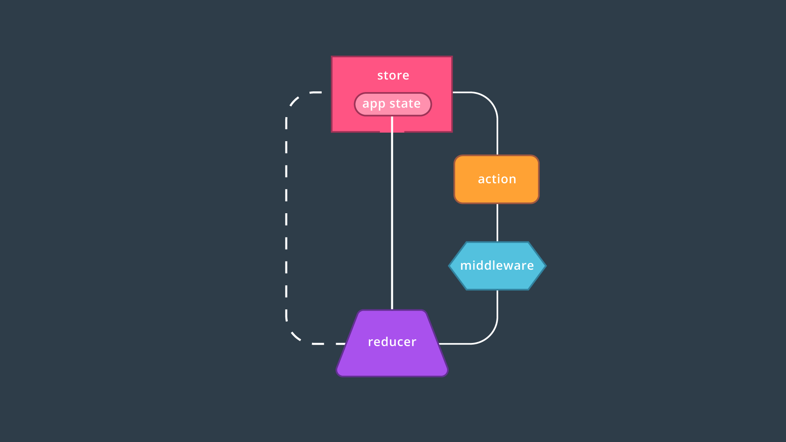
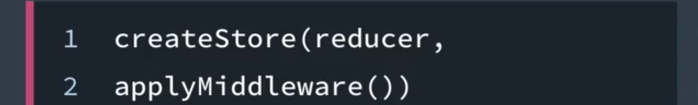
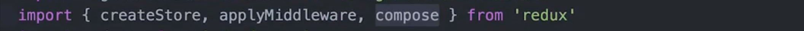
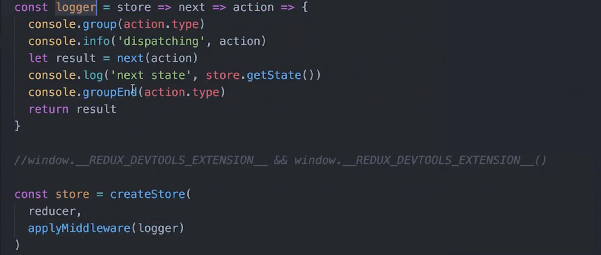
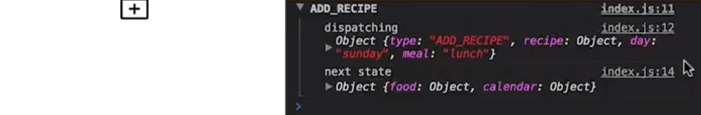
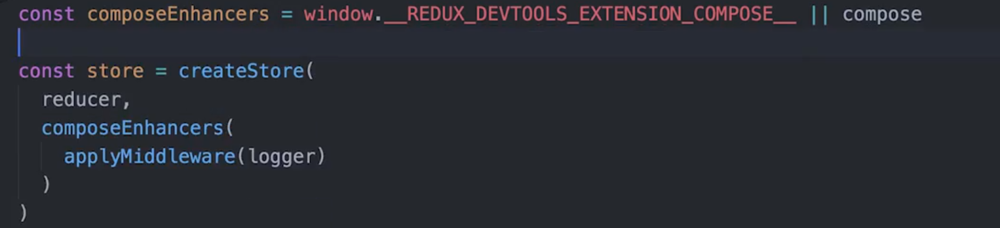
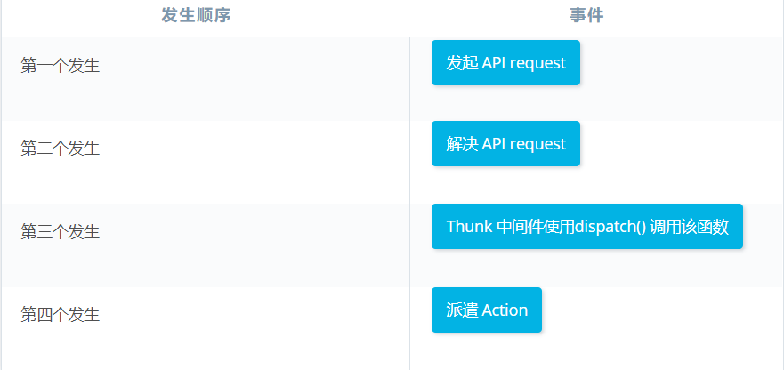

# 5. Redux 中间件

> 你将使用中间件截获发给 reducer 的被派遣 action，来进一步增强应用。你还将学习如何有效地管理应用的目录。

[TOC]

---

## 5.1 简介

在这节课中，我们将看看如何进一步增强 Redux 应用程序，我们将实现中间件，来为 store 添加一些新功能并探索一些能够更容易扩展的构建应用的方式，来看看吧。

我们可以通过使用中间件和更加可预测的应用结构，进一步优化我们的 Redux 应用。我们来详细了解下吧！ 

---

## 5.2 什么是中间件？

**中间件是拦截请求或进程的代码，通常会重定向或产生某种副产品。**

在 Redux 中，中间件是存在于分派动作和 reducer 之间的软件。有了中间件，我们可以在分派的动作到达 reducer 之前拦截和修改它，或者甚至在分派发生时运行某种代码，中间件是一款强大的工具，可以**让我们扩展应用程序的功能。**

---

[*正如 Redux 文档所描述的，中间件是在派遣 action 和它抵达 reducer 的时间点之间的第三方扩展点。*](https://classroom.udacity.com/nanodegrees/nd019-cn/parts/cb5f29f8-f80b-4524-b29b-5f3dcfe7527e/modules/c278315d-f6bd-4108-a4a6-139991a50314/lessons/84a3ef1e-8dc3-4608-8547-36c14c79e1f6/concepts/cd0bb0c8-1fcb-446b-a92b-8b591ae0fdad#)

### 中间件 和 Redux 

你已经知道，单向数据流使 reducer 应用具有可预测性：为了改变 store 的状态，action 描述更改必须被派发到 reducer。然后 reducer 依次返回新的状态。

在派发 action 和 reducer 之间，我们可以引入一种叫做`中间件`的软件**在 action 抵达 reducer 之前来拦截它**。正如 [Redux 文档](https://cn.redux.js.org/docs/advanced/Middleware.html)/[英](http://redux.js.org/docs/advanced/Middleware.html) 所描述的，你可以将中间件看做：

> …是在派发 action 和它抵达 reducer 的时间点之间的第三方扩展。

中间件收到该 action 后，它可以执行大量的操作，包括：

- 产生副作用（例如[记录状态](https://github.com/evgenyrodionov/redux-logger))
- 自己处理 action（例如发出异步 HTTP 请求）
- 重定向该 action（例如重定向到另一个中间件）
- 在派发期间运行一些代码
- 派发追加的 action

...它在将 action 传递给 reducer 之前执行所有这些操作！

#### 练习题

关于中间件的描述，哪些正确？请选中所有适用项。

- Redux 中的中间件在 action 抵达 reducer 之前会拦截该 action。 :star:
- 中间件仅适用于 Redux 应用
- 中间件可以帮助发送异步 HTTP 请求 :star:
- 使用 enhancer 等中间件使你能够不用 reducer 就能创建 Redux store


### 中间件总结

中间件可以采用与 Redux 相同的单向状态管理模式，特别是中间件可以在派遣的 action 抵达 reducer 之前拦截它，然后重定向该 action 或产生副作用。

我们将在下个部分详细讲解一个副作用，使用 `logger` 中间件向控制台输出有价值的信息。

#### 更多资料

- [Redux 文档中的中间件](https://cn.redux.js.org/docs/advanced/Middleware.html) / [英](http://redux.js.org/docs/advanced/Middleware.html)
- [在 React/Redux 中创建自定义中间件](https://medium.com/@jihdeh/creating-custom-middleware-in-react-redux-961570459ecb)

---

## 5.3 使用中间件

现在我们知道了中间件可以做什么，那么我们如何将中间件应用于 Redux 应用程序呢？好消息是，它可以在应用程序中的一个集中位置：创建 store 时：



在课程早些时候，当我们创建 store 时，我们只传入了一个 `reducer` ，`createStore` 实际上可以接受可选参数 `enhancer`。如果我们想将中间件用于应用程序，使用来自 Redux 的 `applyMiddleware` 函数就可以了，此函数可以接受多个参数，那么如果需要，我们实际上可以将多个中间件应用到我们的应用程序。

下面来看几个例子，首先是 `logger` 中间件。

---

### 中间件位于 Redux 应用的哪个位置？

还记得`createStore()` 方法用来创建 Redux store。除了传入 reducer（经常是组合的“根 reducer”），`createStore()` 还可以接受可选 `enhancer` 参数！以下是 `createStore()` 的**方法签名**：

```react
store.createStore(reducer, [preloadedState], [enhancer])
```

Redux 为我们提供了 `applyMiddleware()` 函数，我可以将其用作 `enhancer` 函数的参数。`applyMiddleware()` 可以根据需要接受多个参数，我们可以在一个应用中使用多个中间件。我们看看具体代码，从 `logger` 中间件开始！

### 示例：`logger` 中间件

**Redux 是 Web 应用的“可预测状态容器”**。当 action 被派遣时，我们希望看到新的状态被处理和保存（例如，状态不能自己更新，外部资源也不能直接写入状态）。如果能记录发生在应用中的每个 action，以及其变化前后的状态，岂不是很棒？

我们可以应用“logger”中间件来实现这一点！logger 会产生以下**副作用**：输出 reducer 处理 action 前后的 store 的状态

我们来了解下吧！

---

假设我们有一个 logger 中间件要添加到我们的应用，这样每当分派一个 action，我们都会看到所有这些信息。

首先我们要做的是从 redux 包导入 applyMiddleware（在 index.js 文件中），并在这里进行一些组合：



接着我先直接删掉这里的 `window.__REDUX_DEVTOOLS_EXTENSION__`，因为它会让事情变得有点复杂。但是我们会在视频结束前将它加回来。

那么假设我们有一个 store，我们想向它添加 logger 作为 createStore 的第二个参数，我们调用 applyMiddleware 并将它传递给 logger，现在会发生的是当我们分派一个 action：



现在会发生的是当我们分派一个 action，你会看到在我们的控制台内收到了此信息，因为我们设置了 logger：



那么现在的问题是，我们如何将 REDUX_DEVTOOLS_EXTENSION 添加给中间件？因为如果你还记得，为了连接开发工具扩展，我们将它作为第二个参数传递给了 createStore，这在 Redux 很常见，我们将它们组合在一起，我们要做的是在上面这里创建一个新变量，我们称之为 composeEnhancers，它将等于 `window.__REDUX_DEVTOOLS_EXTENSION__` 或者只是上面这里来自 redux 的 compose，接下来我们不是传入 applyMiddleware，而是传入 composeEnhancers 调用它，然后作为该函数的第一个参数传入 applyMiddleware，然后是 logger 就像之前一样：



现在如果点击刷新，添加一个 pizza，我们仍然会在控制台获得信息。但是如果我们点击 Redux 开发者工具选项卡，一切依然照常工作。


[这是本视频中所做更改的 commit。](https://github.com/udacity/reactnd-udacimeals-complete/commit/2b60fe731b2e4f8ebcfaaafc0ac36ecd11e5215d)

---

> #### 💡 `redux-logger` npm 软件包💡
>
> 在上个视频中，我们使用了自定义 logger 将 store 的状态输出到控制台中。你也可以参阅 [redux-logger](https://www.npmjs.com/package/redux-logger)，了解这个预构建的日志工具。安装指令：
>
> ```
> npm install --save redux-logger
> ```
>
> `redux-logger` 自带默认选项，但是你也可以根据需要添加[其他自定义内容](https://github.com/evgenyrodionov/redux-logger#options)！

#### 练习题

关于向 Redux store 应用中间件的描述，哪些正确？请选中所有适用项。

- Redux 应用只能向 store 应用一种中间件
- applyMiddleware() 可以通过科里化模式接受多个参数
- 在实例化 Redux store 时，中间件是可选的 :star:
- `logger` 等中间件可以看做在派遣 action 和它抵达 reducer 之间的第三方扩展点 :star:


### 总结

我们要在 Redux 应用的一个中心位置（创建 store 时）应用中间件。`createStore()` 方法必须获取 reducer 参数，但是我们也可以传入可选 `enhancer` 参数。该参数是 Redux 的 `applyMiddleware()` 函数，它可以接受中间件本身的多个实例。

#### 更多资料

- [redux-logger](https://github.com/evgenyrodionov/redux-logger)

---

## 5.4 Thunk 简介

在构建 Redux 应用时，**中间件最常见的用途之一是异步信息传递**，**如果没有中间件 Redux store 将只能支持同步数据流**。但是如果我们需要应用与服务器交互呢？理想情况下，我们会发出请求，并仅在解析请求后分派动作，而 thunk 中间件就在此派上用场了。 

thunk 来自 react-thunk 包，并**允许我们编写返回函数而非对象的动作创建器**，**借助 thunk 我们可以让中间件在触发分派之前拦截这些函数动作**，我们开始吧。

---

### 背景

Redux store 仅支持同步数据流。使用 `thunk` 等中间件可以帮助**在 Redux 应用中实现异步性**。可以将 `thunk` 看做 store 的 `dispatch()` 方法的**封装器**；**我们可以使用 `thunk` action creator 派遣函数或 Promise，而不是返回 action 对象。**

注意，没有 `thunk` 的话，默认地是同步派遣。也就是说，我们依然可以从 React 组件发出 API 调用（例如使用 `componentDidMount()` 生命周期方法发出这些请求），但是我们在 Redux 应用中难以实现以下两点：

- 可重用性（思考下*合成*）
- 可预测性，只有 action creator 可以是状态更新的单一数据源

要在应用中使用 `thunk` 中间件，请务必安装 [redux-thunk 软件包](https://github.com/gaearon/redux-thunk)：

```
npm install --save redux-thunk
```

### Thunk Action Creator 示例

假设我们要构建一个存储用户代办事项的 Web 应用。用户登录后，应用需要从数据库中获取用户的所有代办事项。因为 Redux 仅支持同步数据流，我们可以使用 `thunk` 中间件来异步地生成 Ajax 请求以获取 action。

在能够编写 `thunk` action creator 之前，确保我们的 store 已准备好接收中间件：

```react
// store.js

import { createStore, applyMiddleware } from 'redux';
import thunk from 'redux-thunk';
import rootReducer from '../reducers/root_reducer';

const store = () => createStore(rootReducer, applyMiddleware(thunk));

export default store;
```

现在一切设置完毕， `thunk` 中间件已经能被应用到该 store：`thunk` 中间件导入自 `redux-thunk`，并且 `thunk`的实例被传递给 Redux 的 `applyMiddleware()` enhancer 函数。

此外，Ajax 请求可以如下所示：

```react
// util/todos_api_util.js

export const fetchTodos = () => fetch('/api/todos');
```

`thunk` 中间件使我们能够编写异步 action creator，它返回的是函数，而不是对象。我们的新 action creator 现在可以如下所示：

```react
import * as TodoAPIUtil from '../util/todo_api_util';

export const RECEIVE_TODOS = "RECEIVE_TODOS";

export const receiveTodos = todos => ({
  type: RECEIVE_TODOS,
  todos
});

export const fetchTodos = () => dispatch => (
  TodoAPIUtil
      .fetchTodos()
      .then(todos => dispatch(receiveTodos(todos)))
);
```

`receiveTodos()` 是一个 action creator，返回键类型为 `RECEIVE_TODOS` 的对象以及 `todos` 载荷。

另一方面，`fetchTodos()` 使我们能够返回函数。这里，我们首先通过 `TodoAPIUtil` 发出 Ajax 请求。通过定义一个 Promise 对象，只有当原始请求被解决时 接收所有 to-do 项目的 action 才会被派遣。

现在该你来运用所学的 thunk 知识，对派遣 action 的流程进行修改了！

#### 练习题

用户点击组件中的按钮，以渲染索引页面。当该组件调用 `thunk` action creator，它会返回一个函数。之后会发生什么？请对以下事件按照发生的顺序排序：




> 再看看之前的示例：
>
> ```react
> export const fetchTodos = () => dispatch => (
>   TodoAPIUtil
>       .fetchTodos()
>       .then(todos => dispatch(receiveTodos(todos)))
> );
> ```
>
> 首先我们要发出 API 请求。调用 `thunk` 中间件使我们能够编写 action creator，使其返回函数。然后 `thunk` 中间件使用 `dispatch()` 方法调用该函数。只有当 API 请求被解决后，该 action 才会被派遣。

### 总结及更多资料

如果应用需要与服务器交互，则应用 `thunk` 等中间件可以解决异步数据流问题。Thunk 使我们能够编写返回函数（而不是对象）的 action creator。然后 thunk 可以用来延迟 action 派遣，或仅在满足特定条件（例如请求被解决）后再派遣。

#### 更多资料

- [GitHub 上的 Redux Thunk](https://github.com/gaearon/redux-thunk)
- Redux 文档中的 [异步数据流](https://cn.redux.js.org/docs/advanced/AsyncFlow.html)/ [英](http://redux.js.org/docs/advanced/AsyncFlow.html)
- Dan Abramov 在 Stack Overflow 上 [关于 Redux 中的异步性](http://stackoverflow.com/questions/35411423/how-to-dispatch-a-redux-action-with-a-timeout/35415559#35415559) 的回答


## 5.5 应用结构和组织结构

### 整理 Redux 应用的目录结构

除了使用中间件之外，我们还可以通过选择文件路径的结构，使用更加辅助的方式来增强应用。毕竟对于 Redux 应用来说，有很多移动的部分和依赖项：action、reducer、 store、组件、API 实用工具，等等。通过思考如何组织应用的资源，不仅可以更轻松地查找所需的文件，而且可以更轻松地移动文件（即模块化）。在构建 Redux 应用时，可以采取以下两种方式来组织目录结构：

#### 按照能力(类型)组织

```
Frontend
   - Components
      - component1.js
      - component2.js
      - component3.js
   - Actions
      - action1.js
      - action2.js
   - Reducers
      - reducer1.js
   - Util
   - Store
```

通过**按照能力**组织，我们确切地知道在何处查找特定的资源：任何 action 都将位于 *Actions* 文件夹，任何 reducer 都将位于 *Reducers* 文件夹，等等。实际上，来自 [Redux on GitHub](https://github.com/reactjs/redux/tree/master/examples/real-world) 的“real world”示例就是按照这种方式安排应用结构。在此目录结构下，如果我们想将所有 action 导入组件中，我们可以一次性导入所有这些 action！

#### 按照特征组织

但是，如果我们想进行任何更改，就会有点困难。如果特定组件的要求更改了呢？我们需要在独立的位置手动查找该组件的相关资源（action、reducer 等），以便做出必要的更改。一种替代方式是**按照特征**组织同一应用的结构：

```
- nav
   - actions.js
   - index.js
   - reducer.js

- dashboard
   - actions.js
   - index.js
   - reducer.js
```

这种结构形式按照共同的“特征”或“概念”组合资源。即，与某个导航组件相关的所有资源都位于一个模块化文件夹中。这样可以从外观上很好地描述应用，虽然如果应用包含几百个组件的话，可能会更难以浏览这样的目录。

当然由你自己做出选择。无论选择何种目录结构，只需确保对你的应用来说是合理的，你能熟练使用这种方式！

### 应用结构和组织结构总结

两种最热门的 Redux 应用结构是：

- 按照类型 - 所有 action 都位于"Actions"文件夹、所有 reducer 都位于"Reducers"文件夹，等等。
- 按照特征 - 一个 "Sidebar" 文件夹包含所有侧栏 action 的文件、侧栏 reducer 的文件等。

总之，没有一种绝对的正确方法，虽然我们可以遵守一些惯例，帮助降低 Redux 的复杂性。思考下应用的特征、规模和依赖项，选择你认为最合理的结构。

#### 更多资料

- [GitHub 问题 2378：处理 action 和 reducer 的其他方式](https://github.com/reactjs/redux/issues/2378)

## 5.6 课程总结

哎这节课中，我们讲了可以用来增强 Redux 应用程序的一些方法，我们还研究了组织应用程序目录结构不同方法。早些时候，我们引入了 logger 和 thunk 中间件来为我们的 stroe 添加更多功能，以及很多其他中间件包，你可以用来进一步扩展应用。除此之外，还有一个庞大的在线社区可以对这些额外的自定义进行协作。欢迎查看下面的链接了解：

- GitHub 上的官方 [React/Redux 社区](https://github.com/reactjs)
- [“Redux 示例和中间件实用列表”](https://github.com/xgrommx/awesome-redux) on GitHub
- Redux 文档中的 [Redux 示例](https://cn.redux.js.org/docs/introduction/Examples.html) / [英](http://redux.js.org/docs/introduction/Examples.html)


## 5.7 课程尾声

我们到达课程末尾了，我们先在一个应用中看了 Redux 如何提高状态可预测性，然后我们深入了解了 action、reducer、store 并看到 Redux 如何与 React 很好地联系在一起。最后，我们看到了构建 store 的更多方式，以及最后添加中间件来进一步扩展我们的应用。

