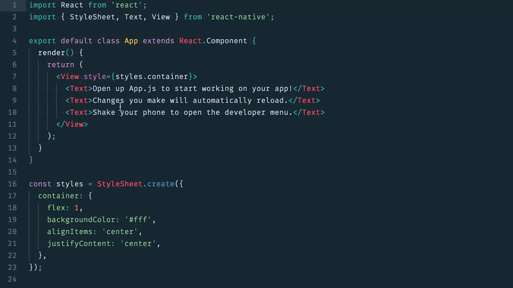
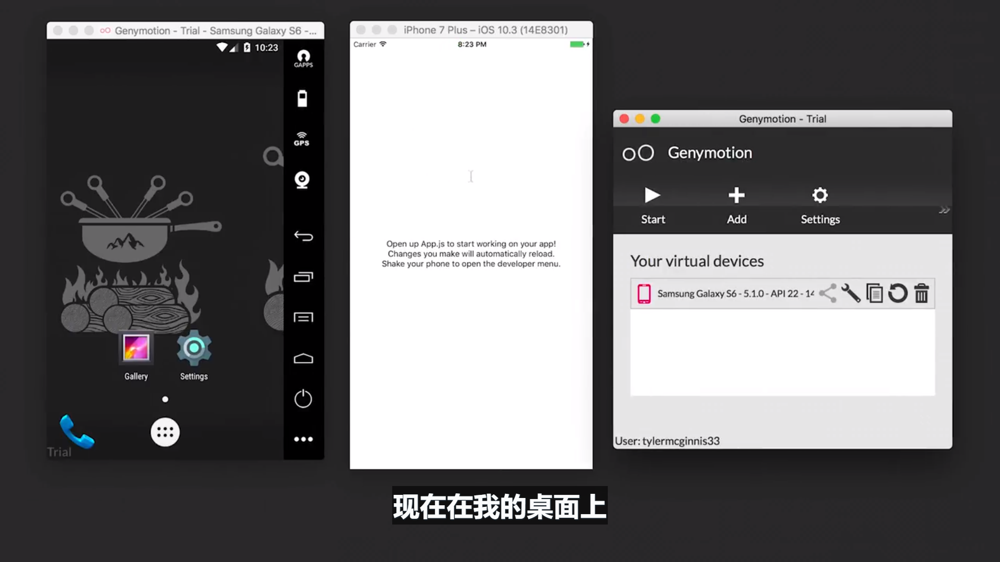
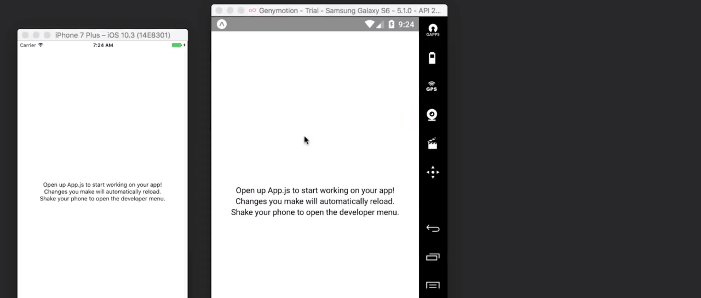
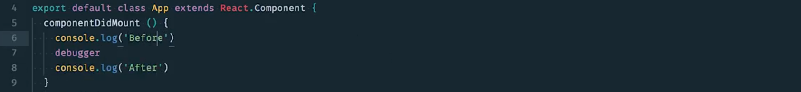
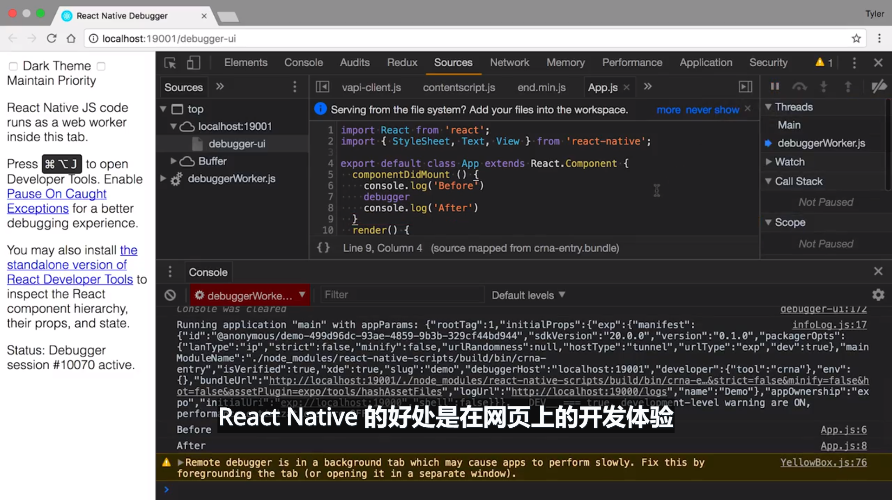

# 1.使用 React Native 构建应用

> 你将学习 React Native 背后的思维及其运作方式，以及如何开始使用它构建 iOS 和 Android

[TOC]

## 1.1 简介

欢迎学习优达学城的 React Native 课程，这门课程的目标是让你能够使用 React Native 从 React 开发工程师变成原生 iOS 和 Android 开发工程师。

好消息是，你已经掌握的 React 知识，在学习 React Native 时将派上用场。

- 首先，我们将简要介绍 React Native 的工作原理，也就是手机上的整个 JavaScript 构建视图，非常酷。

- 然后，**配置开发环境**并了解**如何调试代码**。

- 接着，我们将实际地**学习和构建 React Native 组件**。
- 然后，我们将在导航课程中学习样式和布局。
- 最后，我们将从处理 React Native 代码转变为在 iOS 和 Android 上控制特定于操作系统的功能，例如地理位置和通知。

### 课程地图

欢迎！本课程主要讲解 React Native 框架。下面是课程内容的简要概述：

- **第 1 课** 说明使用 React Native 构建原生应用程序的好处，以及如何设置有效的开发环境。
- **第 2 课** 比较 React 和 React Native 之间的主要思维和 API 差异。
- **第 3 课** React Native 应用的详细信息样式和布局模式。
- **第 4 课** 讲解路由模式与策略。
- **第 5 课** 介绍原生功能（例如，地理定位、通知等）以及为向应用商店发布应用做准备。

### 课堂项目

在此课中，你将跟着我们创建一个每日健身跟踪应用 [UdaciFitness](https://github.com/udacity/reactnd-UdaciFitness-complete)。你将结合学到的 React 基础知识和 React & Redux，利用 React Native 创建一个功能齐全的移动应用！


## 1.2 什么是 React Native/它存在的意义是什么？

React Native 使你能够使用 React 构建原生 iOS 和 Android 应用，听起来很完美，不太真实，但这是真的。

沃尔玛、Airbnb 和特斯拉等公司都一定程度地在他们的移动应用中使用了 React Native，但我觉得 React Native 对小型初创企业作用更大。有了 React Native，不用再另外组建网页开发团队、iOS 团队和 Android 团队，只需一个 UI 团队就可以了。不仅为企业节省了很多资金，而且缩短了开发时间。

你可能听说过一句话，**“一次编写，到处运行”（Write once，run anywhere）**。这句话的理念就是可以将一个仓库应用到网页、iOS 平台和 Android 平台上，但实际操作起来很难实现，因为每种平台都具有独特的体验，与“一次编写，到处运行”不同，React Native 的座右铭是**“一次学习，随处开发”（Learn once，write anywhere）**。学习 React 开发之后，你将能够用这些相同的规则构建不仅适用于网页版，还适用于 iOS 和 Android 等原生平台的 UI，我们是在不同的平台之间分享相同的规则，而不是分享相同的仓库，这些规则包括组件合成和声明式 UI。


### React Native 解密

当 React 首次推出时，一个很大的卖点就是**虚拟 DOM**。这已是现在大多数 UI 库的标配，但当它刚推出时，确实是极具突破性的！我们可以通过分解调用 `setState()` 会发生的过程，来看看虚拟 DOM 究竟是什么。

调用 `setState()` 后 React 所做的第一件事是将传递给 `setState()` 的对象合并到组件的当前状态。这会启动一个叫做[调节](https://facebook.github.io/react/docs/reconciliation.html) 的过程。调节的最终目的是**以最有效的方式更新**基于这种新状态的用户界面。为此，React 将构建一个新的 React 元素树（你可以将其视为 UI 的对象表现形式）。一旦有了这个新树，React 就会使用 "diff" 命令将它与之前的元素树进行比较，以便弄清 UI 如何响应新的状态而改变。通过这样做，React 将会知道发生的具体变化，并且通过了解发生的具体变化，它将能够**仅在绝对必要的情况下进行更新，以最大限度地减少 UI 的占用空间**。

创建 DOM 的对象表现形式的这个过程是 "Virtual DOM" 背后的整体思想。但是，如果我们不想以 DOM 为目标进行渲染，而是将另一个平台作为渲染目标 -- 比如说 iOS 或 Android。理论上来说，DOM 只是一个实现细节。除了这个名字本身（在我看来，它更像是一种营销手段）外，没有什么可以将虚拟 DOM 概念与实际 DOM 相结合。这正是 React Native 背后的思想。React Native 不是渲染到 web 的 DOM，而是渲染原生 iOS 或 Android 视图。这是我们可以只使用 React Native 来构建原生 iOS 和 Android 应用。


#### 练习题

**仅需学习一次，编写任何平台**方法如何影响开发？

- 学习 React 使我们能够使用相同的原理面向 web _和_原生平台进行开发 :star:
- React 开发遵循"仅需学习一次，编写任何平台"的方法，所以我们不必针对每个平台开发不同的应用
- React Native 开发与其他 React 平台共享完全相同的代码库
- 同一批工程师不用学习从根本上不同的技术，便可在他们选择的任何平台开发 :star:

React Native 为我们提供了一种方法，让我们使用熟知的 React（即*JavaScript*）原理构建移动应用！我们看到的不是嵌入在移动应用中的 web 应用；**我们的输出就是实实在在的原生 iOS 或 Android 应用程序**！

### 总结

React Native 的"仅需学习一次，编写任何平台"方法让我们能够使用熟知的相同原理，面向 web _和_原生平台进行开发。毕竟，根本上来说，无论是用 React 构建的 web 应用，还是用 React Native 构建的移动应用，很多虚拟 DOM、调节和 diff 算法都适用。

#### 进一步研究

- [React Native 中的桥接](https://tadeuzagallo.com/blog/react-native-bridge/)


## 1.3 开发环境设置

### 创建 React Native 应用

当我们在此课程中构建应用时，我们要面向 Android 和 iOS 两个平台构建。那么我们面临的一个难题是，我们需要支持两个独立的开发环境：iOS 使用 [Xcode](https://developer.apple.com/xcode/)，Android 使用 [Android Studio](https://developer.android.com/studio/index.html)。这为学习本课程中带来了很多复杂性；毕竟，Xcode 和 Android Studio 都可以*成为单独的一套课程*！

幸运的是，现在我们有一种新工具可以使用，使我们可以面向 Android 和 iOS 进行开发，而无需打开 Android Studio 或 Xcode。这个工具的名字非常直白，叫做 **Create React Native App**。它类似于 **Create React App**，因为你需要做的是通过 NPM 安装 CLI。然后，通过 CLI，你可以轻松地构建起一个全新的 React Native 项目。

跟 Create React App 一样，使用 Create React Native App (CRNA) 有优点也有缺点。首先来说优点。

#### Create React Native App 优点

比较明显的一个是 Create React Native App 最大限度地减少了创建 "hello world" 应用程序所需的时间。事实上，你可以在终端上运行一个命令，15 秒钟后，一个使用 JavaScript 在 Android 和 iOS 上都可以运行的项目就诞生了，这简直不可思议。接下来，Create React Native App 还允许你轻松地*在自己的设备上*进行开发，这一点我们稍后深入了解。这样，你在文本编辑器中所做的任何更改将立即显示在本地手机上运行的应用中。然后，（这一点我之前提到过），使用 Create React Native App，你只需要这一个构建工具就够了。你不必担心 Xcode 或 Android Studio。最后一点，此工具没有锁定。就像 Create React App 一样，你可以随时"弹出配置（eject）"。

#### Create React Native 缺点

此工具还存在一些缺点，虽然都比较小，但也值得注意。首先，如果你在构建一个要添加到现有原生 iOS 或 Android 应用的应用，Create React Native App 就无法用了。第二，如果你需要在 React Native 和一些 Create React Native App 不认识的原生 API 之间建立桥接（这非常罕见），Create React Native App 就无法正常工作了。

我们来看看吧！


### 安装 Create React Native App

为了使用 Create React Native App，请先在全局安装它:

```bash
npm install -g create-react-native-app
```

或者也可以使用 **yarn**（访问[此处](https://yarnpkg.com/lang/en/docs/install) 了解安装说明）：

```bash
yarn global add create-react-native-app
```

> ### ⚠️ 使用 Yarn ⚠️
>
> Create React Native App 目前无法与 NPM v5 一起使用，因为[NPM 中存在错误](https://github.com/react-community/create-react-native-app/issues/233#issuecomment-305638103)。虽然 NPM v3 或 v4 应该没有问题，但是保险起见，后面我们都使用 Yarn。

---

在这整门课程中，我们将经常用到一个服务，叫做 Expo


Expo 让 React Native 的使用过程简单了很多，Expo 的宗旨是当你构建 React Native 应用时，你不需要处理原生代码，无论是 Swift Objective-C 还是 java。作为 JavaScript 开发者，我觉得这很棒。

每当我们需要处理原生 API 时，例如相机或地理位置，我们不用使用 Xcode 或 Android studio，这两个工具实在令人头疼，相反，我们可以使用 Expo 的 JavaScript API 实现相同的结果。

我简直无法形容 Expo 对 React Native 社区带来的影响和价值，React Native 团队和 Expo 团队有何关系？

他们关系很紧密，React Native 的大部分主要贡献者都是 Expo 全职开发者，某些甚至是前 Facebook 员工，实际上 Create React Native 应用就是由 Expo 团队开发的，已成为使用 React Native 构建应用的官方方式。

---

Expo 是一项服务，它能使涉及 React Native 的一切都变得非常容易。**Expo 背后的思路是省去 Android Studio 或 Xcode 的使用**。更重要的是：它甚至允许我们使用 Windows（或甚至 Linux）面向 iOS 进行开发！

使用 Expo，你可以使用已经熟悉的 JavaScript 加载和运行由 Create React Native App 构建的项目。你无需编译任何原生代码。而且像 Create React App 一样，将 Expo 与 Create React Native App 一起使用，几乎不用什么配置就可以使我们开始运行应用。

在此课程中，我们将大量依赖 Expo。首先: 你需要_安装_ Expo。请前往应用商店，安装适合你的设备的 Expo 移动应用：

- [Google Play 上的 Expo](https://play.google.com/store/apps/details?id=host.exp.exponent) (Android)
- [App Store 上的 Expo](https://itunes.apple.com/us/app/expo-client/id982107779) (iOS)

#### 练习题

关于 **Create React Native App** 和 **Expo** 的说法哪个是正确的？选择所有适用项：

- Expo 包含一套工具和服务，使我们能够使用 JavaScript 构建原生（iOS 和 Android）应用程序 :star:
- 将 Create React Native App 和 Expo 一起使用需要编译原生代码
- 与 Create React App 很像，Create React Native App 使我们可以快速构建起始应用程序 :star:
- Expo 让构建移动应用变得简单，而无需编写原生代码（例如 Swift、Objective C、Java）:star:

一起使用 Create React Native App 和 Expo 能使我们快速构建和运行应用！

### Simulators

结合 Expo 与 Create React Native App 是构建应用的最快速方式，但也有其他构建项目的方式。如果你想将 React Native 集成到现有应用中，或者如果你已从 Create React Native App 弹出应用，可自行参考 React Native 文档中的[使用原生代码构建项目](https://facebook.github.io/react-native/docs/getting-started.html) 选项卡。本指南还设置了 iOS 和 Android 模拟器，以便你可以直接在自己的电脑上欣赏自己的移动应用！我们将在此课程中使用 iOS 和 Android 模拟器进行演示，但在入门阶段不强制要求。

> 💡 Bundling Error（Unexpected Token）💡

> 如果你在尝试运行模拟器时遇到打包错误，请尝试将 React Native 的 Babel 预设更改为版本 `2.1.0`。然后，删除你的 `node-modules` 目录，用 `npm install` 重新安装，然后再次运行模拟器。更多信息，请查看有关 Stack Overflow 的[此文章](https://stackoverflow.com/questions/45725376/react-native-starter-project-bundling-fails-with-unexpected-token-error)。

---

设置了模拟器并安装了 create-react-native-app 后，下一步是构建我们的应用。

转到我们的终端并运行 create-create-native-app，然后输入你的应用名称，我们将其称为 UdaciFitness，这和 create-react-app 很相似，这里是 create-react-native-app，然后是要构建的应用的名称。

输完后，你可以看到一些可以运行的指令，我要做的是就像这里说的，cd 到我们的应用目录中，然后打开该应用。为了展示代码看起来怎样，输入 yarn，运行 yarn start 启动我们的应用，在此期间，我们看看代码看起来怎样，这是主 App.js 文件：



如果你熟悉 React 的话，这部分看起来应该熟悉，这是视图组件，里面是一些文本组件，其中包含一些文本。剩下的这些是配置文件（指整个项目的其他文件）

现在你会发现，当我们的应用启动时，我们有几个选项：

- 如果按下 a 将在 Android 设备模拟器上运行应用
- 按下 q 将显示二维码，也就是这个二维码（指屏幕上的一个二维码），如果你的手机上安装了 Expo 应用，你可以扫描该二维码，只要手机和计算机连接的是同一个网络，就会看到应用在手机运行。
- 按下 r 可以重启 packager
- 按下 d 可以切换开发模式
- 按下 i 可以打开 iOS 模拟器

我们按下 i，将启动 iOS 模拟器，现在在我的桌面上，你将看到这个 iOS 模拟器和这段文本：



比较酷的是如果我更改这段文本，例如改成 opening up，你会发现这里在实时重新加载。

现在我想在 Genymotion Android 模拟器上运行此应用，在终端里，按下 a，现在代码也在 Android 模拟器上运行了。

[这是包含此视频中所做更改的提交。](https://github.com/udacity/reactnd-UdaciFitness-complete/commit/5fcff9e5f24616402a8503cf16c4df0328bd4397)

---

### 环境

在使用 Create React Native App 创建应用时，你期望获得什么类型的支持？

- ES5 和 ES6 支持
- 对象展开运算符
- 异步函数
- JSX（毕竟这是*React*！）
- [Flow](https://flow.org/)
- [Fetch](https://developer.mozilla.org/en-US/docs/Web/API/Fetch_API)

由于我们纯粹使用 JavaScript 来构建移动应用，这个列表没有什么好惊奇的！由于 Create React Native App 随 Babel 一起提供，请自行查看[支持的转换](https://github.com/facebook/react-native/blob/master/babel-preset/configs/main.js#L16) 的完整列表。


在开始实际构建应用之前，有一些文件是项目所必需的，但你不必完全理解。因此，我们只给你提供代码，感兴趣的话可以看看。

所有这三个文件都将位于 `utils` 文件夹中。首先，在项目的根目录下创建一个名为 `utils`的文件夹。

接下来，你要在 `utils` 文件夹内创建三个文件。

- `colors.js`
- `helpers.js`
- `_calendar.js`（确保包含下划线！）

将以下代码粘贴到`utils/colors.js`文件中

```js
// utils/colors.js

export const purple = '#292477'
export const gray = '#757575'
export const white = '#fff'
export const red = '#b71845'
export const orange = '#f26f28'
export const blue = '#4e4cb8'
export const lightPurp = '#7c53c3'
export const pink = '#b93fb3'
```

接下来，将以下代码粘贴到 `utils/helpers.js` 中

```js
// utils/helpers.js

// 判断 num 是否在 x y 之间
export function isBetween (num, x, y) {
  if (num >= x && num <= y) {
    return true
  }

  return false
}

// 根据 heading 值返回所面向的方法
export function calculateDirection (heading) {
  let direction = ''

  if (isBetween(heading, 0, 22.5)) {
    direction = 'North'
  } else if (isBetween(heading, 22.5, 67.5)) {
    direction = 'North East'
  } else if (isBetween(heading, 67.5, 112.5)) {
    direction = 'East'
  } else if (isBetween(heading, 112.5, 157.5)) {
    direction = 'South East'
  } else if (isBetween(heading, 157.5, 202.5)) {
    direction = 'South'
  } else if (isBetween(heading, 202.5, 247.5)) {
    direction = 'South West'
  } else if (isBetween(heading, 247.5, 292.5)) {
    direction = 'West'
  } else if (isBetween(heading, 292.5, 337.5)) {
    direction = 'North West'
  } else if (isBetween(heading, 337.5, 360)) {
    direction = 'North'
  } else {
    direction = 'Calculating'
  }

  return direction
}

// 默认返回当天以 IOS 格式返回年、月、日，或者传入相应时间的毫秒数返回
export function timeToString (time = Date.now()) {
  const date = new Date(time)
  const toDayUTC = new Date(Date.UTC(date.getFullYear(), date.getMonth(), date.getDate()))
  return todayUTC.toISOString().split('T')[0]
}
```

最后，将以下代码粘贴到 `utils/_calendar.js` 文件中。

```js
// utils/_calendar.js

import { AsyncStorage } from 'react-native'
import { getMetricMetaInfo, timeToString } from './helpers'

export const CALENDAR_STORAGE_KEY = 'UdaciFitness:calendar'

function getRandomNumber (max) {
  return Math.floor(Math.random() * max) + 0
}

function setDummyData () {
  const { run, bike, swim, sleep, eat } = getMetricMetaInfo()

  let dummyData = {}
  const timestamp = Date.now()

  for (let i = -183; i < 0; i++) {
    const time = timestamp + i * 24 * 60 * 60 * 1000
    const strTime = timeToString(time)
    dummyData[strTime] = getRandomNumber(3) % 2 === 0
      ? {
          run: getRandomNumber(run.max),
          bike: getRandomNumber(bike.max),
          swim: getRandomNumber(swim.max),
          sleep: getRandomNumber(sleep.max),
          eat: getRandomNumber(eat.max),
        }
      : null
  }

  AsyncStorage.setItem(CALENDAR_STORAGE_KEY, JSON.stringify(dummyData))

  return dummyData
}

function setMissingDates (dates) {
  const length = Object.keys(dates).length
  const timestamp = Date.now()

  for (let i = -183; i < 0; i++) {
    const time = timestamp + i * 24 * 60 * 60 * 1000
    const strTime = timeToString(time)

    if (typeof dates[strTime] === 'undefined') {
      dates[strTime] = null
    }
  }

  return dates
}

export function formatCalendarResults (results) {
  return results === null
    ? setDummyData()
    : setMissingDates(JSON.parse(results))
}
```

[这是包含在 `utils` 文件夹中所做更改的提交。](https://github.com/udacity/reactnd-UdaciFitness-complete/commit/6ecbdd5a5685c819fb511e2fb5dc4de0d4dd0ab0)

##### 确保你的项目准备就绪了！

Task List

- 我全局安装了 Create React Native 应用
- 我通过命令行创建了 UdaciFitness 项目
- 我将以下文件添加到了我的 `utils` 文件夹：`_calendar.js`、`colors.js`、`helpers.js`
- 我使用 `npm start` 启动了我的开发服务器
- 我在我的设备上安装了 **Expo** 移动应用
- 我使用 Expo 移动应用扫描了终端中的 QR 码


### 总结

**Create React Native App** 类似于 **Create React App**，在于它只需最少的配置便能构建起始应用程序:

- 花最少的"时间构建起 'Hello World'"
- 在你自己的设备上通过 **Expo 进行开发**
- 只需单个构建工具
- 不锁定（即随时弹出）

你也可以设置**模拟器**来帮助开发。但无论我们选择哪种开发平台（iOS、Android）以及哪种环境（Mac、Windows、Linux）-- 我们完全在使用熟悉的旧 JavaScript 进行构建！


## 1.4 使用调试器

### 如何调试

正如我们之前所提到的，React Native 或许最好的一点在于它将你熟悉的 web 开发体验带到了原生开发。像现场重新加载和调试等功能都是开箱即用。我们来深入了解一下这些功能 - 首先是调试！

---

现在展示的是在 iOS 和 Android 上的 Creact React Native 应用上运行的基本应用：



我在本视频中要演示的是，如何在这两个应用中打开开发者菜单以及如何调试应用，在必要时使你能够轻松地调试代码。

如果你在使用 iOS 模拟器选择它，按下 Command+ D 后会打开此菜单，你会注意到几个选项，我们可以刷新、复制链接、停用实时视图、等等。但是我要介绍的是这个 Debug Remote JS（其中一个选项）。

选择该选项后，React Native 将打开另一个窗口（网页中的窗口），在此窗口中，如果和之前一样打开控制台，将看到一些代码，有一些警告。如果我想在应用中添加调试器，假设每当该组件加载时，我们希望能调试下，我们只需和之前一样，添加调试器，在这里输出控制台日志“before”，然后输出日志“after”：



这样就会刷新应用，因为我们开启了实时重新加载功能，然后你会发现，如果回到控制台，我们位于控制台中，就像位于网页上，我们可以看到这个 before，然后就像在网页上一页，转到下面获得 after，一切都一样（也就是和你开发 web 程序是一样的）：



React Native 的好处是在网页上的开发体验和在 React Native 中完全一样，因为我们可以向控制台输出日志，可以插入调试器，一切都很熟悉。

在 Android 上要打开开发者菜单，按下 Command + M，而不是 Command + D，然后获得这些选项：


我再次回到 iOS 应用，我想再选择一个选项，这里有个 Toggle Element Inspector，这就像在网页上选择元素一样，我可以点击任何一个元素并获得应用到其上的样式和任何内外间距，对于网页上的 Box Model Inspector，我们在 React Native 中也有相应的选项。假设我想点击其中一个元素，并且不检测它，我只需选择这个方框，我们可以打开或关闭此选项。要取消它，只需按下 Command + D 然后点击 Toggle Element Inspector。

开发者选项中有很多可以选择的内容，最重要的功能是刷新，Toggle Element Inspector 以及启动和停止远程调试器。

---

### 刷新 App

当我们为网站开发应用时，如果有什么奇怪的地方，刷新下就可以了，通常，对于原生开发过程则不能这么刷新，因为需要重新编译代码。

对于 React Native，因为可以获得像在网络平台上的相同开发体验，因此可以根据需要刷新应用。对于 iOS 和 Android 模拟器，只需点按两次 R。如果是手机，只需摇动手机，然后按下刷新。

在上个视频中，我演示了如何在 iOS 和 Android 平台上打开开发者工具。在 iOS 上按下 Command+D，在 Android 上按下 Command + M 打开开发者工具后，可以重新加载或刷新应用。实际上有个快捷键，在 iOS 上下载 Command + R 会刷新应用。在 Android 应用上点按两次 R 即可刷新应用。

---


### 练习题

如何访问应用内的开发者菜单？选择所有适用项：

- 更改 Expo 移动应用中的设置
- 从通知抽屉中选择**调试**
- 晃动手机 :star:
- 在模拟器中选择**晃动手势** :star:
- 在 iOS 模拟器中按下 ⌘D，或在 Android 模拟器中按下 ⌘M :star:

只需轻晃手机或使用快捷键在模拟器中模拟晃动手机，便可访问开发者菜单。 

## 总结

React Native 开发好的一点在于它将你熟悉的 web 开发体验带到了原生开发。访问应用内开发者菜单使你能够重新加载 JavaScript 代码，通过开发者工具进行远程调试，甚至显示应用内检查器。

### 调试

你只需晃动手机或:

- 在 iOS 模拟器中按下⌘D
- 在 Android 模拟器中按下 ⌘M

### 刷新

要刷新应用，只需:

- 双击键盘上的 “R”（如果你用的是模拟器）
- 晃动手机，然后选择“刷新”

---

## 1.5 课程总结

第一节课到此就结束了，很棒，我们来总结下所学的内容。

- React Native 使你能够运用在 React 中所需的知识构建原生 iOS 与 Android 应用。
- Expo 使 React Native 使用起来简单多了。
- Creact React Native App 是新建 React Native 项目的官方方式。

现在你应该已经在计算机上设置了开发环境，在下节课，我们将了解 React 和 React Native 有何相似之处。


