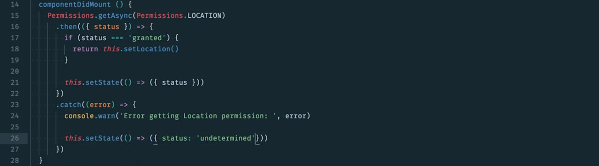
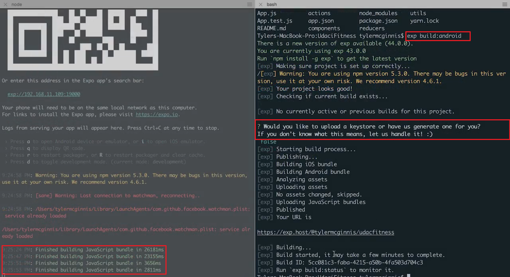

# 5.导航

> 你将学习如何实现 React Navigation 的导航器，以能够在应用中的选项卡和屏幕之间进行切换。

[TOC]

---

## 5.1 简介

**视频内容 1：**

在此之前，我们学习的都是 React Native 知识，但是还没有利用原生 API，在这节课，我们将讲到原生 API，我们将了解 React Native 中的动画原理，然后深入了解地理位置信息、通知、摄像头，并为将应用发布到 iOS 和 Android 应用商店做好准备。

---

**视频内容 2：**

现在，到目前为止还都没介绍什么有趣的内容，我们将构建这个视图：


相当于一个实时详情视图，我们将从手机中获取信息并渲染该视图，它会显示我们正朝着哪个方向前进，海报是什么，当前移动速度是多少，所有这些信息都来自于手机。因此，我们需要使用手机的 API 来获得这些信息。

顺便提醒下，如果你尝试在 Android 模拟器上跟着操作，可能会因为某些原因而出现故障。Android 模拟器不能实现我们要执行的操作，如果你在实际设备上使用 Expo 应用则一切正常。因此请别使用 Android 模拟器，而是使用 Expo 应用或 iOS 模拟器。我们开始吧。

在 component 文件夹中新建一个视图文件，叫做 Live.js，导入需要的组件和包：


设定此组件的状态包括坐标（coords）暂时设为 null，还包括 status 也设为 null，以及 direction 设为空字符串：


然后我们可以从 this.state 上获取这些信息，我们将获取几个不同的视图，具体取决于你所获得的权限。如果 status === null，表示用户尚未授予任何权限，依然保持默认状态，则渲染 ActivityIndictor，并将 marginTop 设为 30，**ActivityIndicator 中的内容只是表示正在加载的旋转图标**，仿佛在提示系统正在等待中。如果 status === denied，表示你请求了权利，但是遭到用户拒绝，我们暂时渲染一个视图，在其中显示文本“Denied”；然后我们将执行完全一样的操作，但是 denied 改为 undetermined，当你在模拟器中操作时，某些权限会比较卡顿，因为我们没有在实际设备上操作，但是可以实现最终目标；最后，如果不是 denied 或 undetermined 则表明授予了权利，我们将渲染一个视图，暂时我们渲染几个文本组件：


我们将这个当做新的标签页添加进 App.js 中，导入该组件，接着，转到 Tabs 中添加一个新的属性称之为 Live，就像之前一样，screen 设为 Live 组件，添加一些导航选项：


[这是包含此视频中所做更改的提交。](https://github.com/udacity/reactnd-UdaciFitness-complete/commit/8f38bb640f0441383ca906597049190989be853f)

---

**在讲解`Location`API 之前，确保你已完成以下操作：**

Task List

- 我创建了 `Live` 组件
- 我向 `TabNavigator` 添加了 `Live` 屏幕

---

## 5.2 地理位置

**视频内容 1：**

如果能向我们一直构建的应用再添加一项功能，使用户能够跟踪当前的速度、海拔和方向，那就更棒了。为此，我们需要订阅设备地理位置信息，幸运的是 Expo 向我们提供了位置信息 API，该 API 具有当前位置同步方法，我们可以用该方法获得所需的信息：


---

原生应用的一个常见功能是能够访问和接收有关**用户当前位置的更新**。跟**简化了大多数事物**一样，Expo 通过给我们一个在 iOS 和 Android 上都可以使用的 JavaScript API，让这些功能变得非常简单。

```js
import { Location } from 'expo';
```

通常在处理位置服务时，你需要两个功能中的一个：获取用户的当前位置，或者获取和_监视_用户的当前位置以进行更新。Expo 的 `Location` 属性通过 `getCurrentPositionAsync` 和 `watchPositionAsync` 使我们可以同时使用这两个选项。

`getCurrentPositionAsync` 会获取设备的当前位置，而不获取未来更新。`watchPositionAsync` 也会获得设备的当前位置，但也获得位置更新。这样，当设备位置发生变化时你会获得通知。

如需如何使用 Expo 的 `Location` 属性的完整文档，请访问[Location](https://docs.expo.io/versions/latest/sdk/location.html)


> ### 💡 定位技巧 💡
>
> 每当你处理需要用户授权才能正常使用的功能时，你应考虑到有可能显示的所有不同 UI 选项。例如，在处理用户的位置时，有三种情况需要管理：
>
> 1. 用户给予你查看其位置的权限（最佳情况）。
> 2. 用户决定不拒绝也不授予你查看其位置的权限。
> 3. 用户拒绝你访问他们的位置。
>
> 在理想情况下，用户始终授予你需要的所有权限，但现实中并不总是如此。**因此作为 UI 开发人员，你需要针对这些情况做出相应的计划**。

---

**视频内容 2：**

在本视频中，我将设置样式，并在 Live.js 的 undetermined 部分添加一些 UI，先将 state.status 设为 undetermined 以便看到此状态，然后导入一些内容：


添加下面样式：


转到判断 state.status 是否为 ‘undetermined’ 的部分，这里不再设为 undetermined，而是添加 styles.center，使其水平和垂直居中，然后添加 Foundation 图标，然后再输出这一消息：You need to enable location services for this app，然后再添加一个按钮，输入 onPress，创建一个方法，叫做 askPermission，它将请求权限：


暂时为 askPermission 创建一个占位符：


现在的 UI 是这样的：


我们将提醒用户，你需要为此应用启用位置服务。


[这是包含此视频中所做更改的提交。](https://github.com/udacity/reactnd-UdaciFitness-complete/commit/62780584135dbfcee999b10ec3f01ec646aeb27b)

---

**视频内容 3：**

现在，如果状态不是 undetermined，而是 denied 呢？也就是用户直接拒绝了通知，没有授予应用位置信息访问权，在这种情况下，我们要做的是，依然需要居中，我们将使用同一图标，我很喜欢这个图表，然后再下方，不再提示你需要为此应用位置信息服务，而是提示：You denied your location. You can fix this by visiting your settings and enabling location services for this app. 这条通知很直白：


这是 UI 效果：


[这是包含此视频中所做更改的提交。](https://github.com/udacity/reactnd-UdaciFitness-complete/commit/70aa708e381b86471da886e01efc6568df076c54)

---

**视频内容 4：**

现在是最后一种情形了，也是最佳情形——用户授予了权限 status 变成 granted。

添加一些样式：


然后我们转到 status 为 granted 会渲染的部分，我们需要构建的 UI，如下：


代码如下：


红框部分是硬编码，等下会使用变量来替代，因为这个位置的文本会根据具体的参数改变。


[这是包含此视频中所做更改的提交。](https://github.com/udacity/reactnd-UdaciFitness-complete/commit/654fab8ad1502c104a0501adea1819a4f9ab54c1)

---

**视频内容 5：**

现在到了比较有趣的部分了，在本视频中，我们将向用户请求权限，设置位置信息，然后显示实时数据，而不是这些硬编码的虚假数据。

首先，我们需要导入一些内容，导入 Location 和 Permission 都来自于 expo，然后导入 calculateDirection 来自于 utils/helpers：


然后再创建一个方法，叫做 `setLocation`，当我们确认获得了位置信息访问权后就会调用该方法。我们将调用 `Location.watchPositionAsync`，传入一个对象带有几个不同的选项，输入 enableHighAccuracy 设为 true，因为我们很关心手机位置的细微变化，timeInterval 设为 1，distanceInterval 设为 1，这么设置的原因是这是更新频率，我们不知道最高频率是多少，所以直接输入 1，因为希望能尽快更新用户的位置信息。然后向第二个参数传入一个函数，因为每当手机位置变化时，就会调用该函数，我们将传入手机的坐标，然后使用坐标来更新状态：


我们设置好了 setLocation，但在此之前，我们需要转到 componentDidMount 中，确保获得正确的权限或需要请求用户授予这些权限，我们可以调用 permissions.getAsync()，需要获得的权限是 permissions.LOCATION，然后再 then() 中获取 status 的值，如果 status === ‘granted’，则执行 this.setLocation，设置位置信息。如果不是这种情况，则调用 setStates 并更新 status，如果出现任何问题，则 caatch 这一错误，然后输入 `console.warn(‘Error getting Location permission:’, error)` 显示该错误，然后更新 status: ‘undetermined’：



下个视频中我们将向用户请求权限。


[这是包含此视频中所做更改的提交。](https://github.com/udacity/reactnd-UdaciFitness-complete/commit/654fab8ad1502c104a0501adea1819a4f9ab54c1)

---

这将是我们一直期待的视频内容，我们将学习如何向用户请求查看位置信息和跟踪权限。

我们在 Live.js 中转到 askPermission 中，补充完整所需的代码，输入 Permissions.askAsync，这里是 askAsyc 而不是 getAsync，我们要请求和第 15 行的一样，即 permissions.LOCATION，然后在 then() 的回调中执行像在 componentDidMount 中一样，我们将获得一个 status，如果 status 为 granted，则 retrun this.setLocation()，如果未授予权限，则像之前一样设置 status 使状态知道所发生的情况。如果出现错误，则记录，以便知道这个错误：


我们转到应用界面，看看实际运行效果：


当我们点击 Enable 时，弹出了一条消息：


提示 expo 想要访问你的位置信息，允许还是拒绝？点击允许后就会出现显示坐标和方向的屏幕，但屏幕中的这些信息是静态的，并非从手机中获取的信息：


我们接下来将快速更新下 render 方法，这里依然包含 direction 和 coords，将 North 改变 {direction}，将 200 改为 {Math.round(coords.altitude * 3.2808)}，* 3.2808 是转换为英尺。然后 300 的每小时英里数也一样改为 {(coords.speed * 2.2369).toFixed(1)}，将会转换为英里/小时：


然后你去模拟器或者你手机上查看，会发现不断更改 MPH 值。选择下面的选项会模拟手机在不同场景中的状态：


[这是包含此视频中所做更改的提交。](https://github.com/udacity/reactnd-UdaciFitness-complete/commit/0b092b57b530fd6b2d9e9577dd299351e74df75f)


**需要注意的问题：**

在初始化状态时，`coords` 为 null，但在 render 中使用 `coords.speed` 这样的形式来获取值，可如果 `coords` 为 `null`，就会报错，因此有两种方式可以解决：

- `coords` 初始化为一个对象 {}
- 在调用 `coords.speed` 前先判断 `coords` 是否为空：`coords && coords.speed`

---

**向应用添加地理位置服务就讲到这里了，你目前的学习进展如何？**

Task List

- 我设置了 `Live`，包括 **undetermined**、**denied** 和 **granted** 条件
- 我在 `Live` 中创建了 `setLocation()`、`componentDidMount` 和 `askPermission` 方法
- 我更新了 `Live` 中的 `render()` 方法


### 总结

在这部分，我们了解了如何使用 Expo 的 `Location` 属性，和使用 `watchPositionAsync` 监视用户的当前位置。如需更多资料，请自行查看[官方文档](https://docs.expo.io/versions/latest/sdk/location.html)。

---

## 5.3 动画

**视频内容 1：**

流畅的动画效果是构建原生应用的基本组成部分，因此 React Native 内置了动画库，名字叫做 Animated。

Animated 的目标是在用户界面上展现逼真的物理动作，Animated 侧重于在输入和输出之间建立声明式关系，并且二者之间的转换可以配置，我们来看看一个示例。

这个视频内容将很有趣，因为我们将使用 React Native 的 Animated 库（library）。顾名思义 Animated 就是在 React Native 应用中实现动画效果。

这是我们的组件：


里面有有容器并且渲染一个图片，这是 iOS 和 Android 上的效果：


我们可以利用 Animated 实现三种主要的动画效果：

- Decay 以一个初始速度开始，并逐渐减慢停止
- Spring 就像你之前见过的物理弹簧效果
- 然后是 Timing 在一定的时间范围内表示值的渐变动画效果

我们要做的是，转到组件加载时，我们将使图片组件出现动画效果。

对于动画，首先要了解的是，就像任何属性一样，我们将在状态上设置一个属性，然后 **Animated 将更改状态上的这一属性使组件具有动画效果**。内容有点深奥，我们看看具体流程。

我们在 state 中添加一个 opacity 属性，因为我要做的是，当组件加载时，将缓慢地显示该图片，也就是让透明度缓慢地从 0 变成 1。在这里输入：`opacity: new Animated.Value(0)` 默认值为 0，使 opacity 从 0 开始。现在我们需要确保将此 opacity 当做样式添加到图片上，但是不能使用普通图片，需要输入 `Animated.Image`。现在不仅只有 width 和 height（指使用 StyleSheet 创建的样式），我们还将在组件内 style 属性输入 this.state.opacity：


你可能已经猜到，如果现在运行应用的话没有任何图片，这是因为我们在这里将图片值设为了 0，然后我们将该 opacity 值添加到图片上，所以图片的 opacity 为 0，但是我们希望当组件加载时，实现动画效果。因此我们在 componentDidMount 中使用 Animated 的 timing 方法来改变状态中的 opcaity，使其从 0 过渡到 1，持续 1s。

实现的方法是，输入 Animated.timing 调用该方法，首先要传入的是我们希望修改的实际值，我们想修改 opacity，然后传入一个具有一些选项的对象，我们想将 opacity 修改为值 1，持续时间为 1000ms，始终记得要运行 .start() 方法，以便启动动画：


现在如果一切正常的话，会发生什么？


出现了不错的淡入效果，看起来很棒，但是现在我不再希望是淡入效果，而是从宽和高都为 0 开始，然后变成当前的宽度。

为此，我们将使用 Animated 的 Spring 属性，我们向状态添加几个属性。width 也从 0 开始，height 也为 Animated.Value 并从 0 开始，然后像对待 opacity 一样，在 Image 组件中的 style 中添加 width 和 height。


现在看具体的效果也是什么都没有，因为现在的高度和宽度是 0。

我们还希望将这些从 0 变为特定的值 300，输入 Animated.spring()，首先我们设置 width，我们想要修改 width 的值从 0 变成 300，这里不再是 duration，因为我们使用的是 spring 而不是 timing，将 speed 设为 5，默认为 12，然后低啊用 .start()，复制这段代码，但是改为 height：


现在不仅图片的透明度从 0 变成 1，而且宽和高也从 0 变成了 300。

---

动画是任何原生应用的基本部分。因此，React Native 内置了一个名叫 `Animated` 的动画库。Animated 的整体思想是，它"侧重于输入与输出之间的声明性关系，在它们之间进行可配置的转换，并使用简单的开始/停止方法来控制基于时间的动画执行。换句话说，Animated 能让你针对特定值建立不同类型的转换。例如，你可以轻松地将图像的 `opacity` 属性从 0 变为 1，从而产生图像缓慢显示的效果。

Animated 库中共有三种类型的动画配置。它们是 `decay`、`spring` 和 `timing`。再次说明，这三个都允许你转换特定的值，但区别在于值转换的方式: "decay" 会以初始速度开始，逐渐减慢停止，"spring" 提供正常的弹簧类型的动画，以及 "timing" 在指定时间内从一个值过渡到另一个值，从而形成动画。

我们来看看它们的实际操作效果！

---

**视频内容 2：**

我们在项目中再进行一些有趣的设置。在本视频中，我将对这些文本添加一些动画效果，每当这个文本，也就是方向改变时，我希望这种改变能有个动画效果，使文本能跳转下：


我们将使用 react-native 的 Animated 库。首先，向状态中添加一个 bounceValue，将为调用 Animated.Value 的新实例 V 大写，并传入 1：


然后转到 setLocation，我们将在这里判断我们的朝向是否改变，所以这里有 direction（旧的方向值）和 newDirection（新的方向值）两个变量，如果 newDirection 不等于旧的 direction，则我们希望对 bounceValue，设置一个动画效果，输入 Animated.sequence 表示我们将实现一系列的动画效果，传入一个数组，第一个动画将计时，因此使用 Animated.timing，我们想更改的是 bounceValue，持续时间为 200ms，我们想从初始值 1 变成 1.04，听起来很小，但是很快就会看到实际效果的。上述动画完成后，我们希望对 bounceValue 再次使用 spring 设置跳转动画效果，现在我们希望回到值 1 friction 为 4，最后务必记住，对于动画，始终需要调用 .start()：


现在暂时不会看到任何动画效果，因为我们尚未将此 bounceValue 关联到我们的 UI。转到 render 中，我们将在渲染 this.state.direction 的地方，将原来的 Text 组件改为 Animated.Text 组件，然后给他添加 transform 样式属性，传入一个数组，对 bounceValue 进行缩放：


现在，当 bounceValue 改变时，将缩放和转换这一文本。


[这是包含此视频中所做更改的提交。](https://github.com/udacity/reactnd-UdaciFitness-complete/commit/7a701a6fbe7d0331e3ae8cce7899d55ce9653bd3)

---

> ### ⚠️ 注意：动画 ⚠️
>
> 完全掌握 Animated API 会为你打开新世界的大门。听起来不错，但它可能是双刃剑。这是一件好事，因为你现在有能力通过动画来增强应用的体验。但是，能力越大责任越大。
>
> **动画的目的是增强用户的体验，而不是分散注意力**。在你的应用中添加动画时记住这一点，**减少使用不必要的动画，这样不仅会提高应用的性能，还能最大限度地降低破坏用户体验的风险**。


##### 学习任务进展

Task List

- 我在 `Live` 中方向改变中添加了动画（例如，从“西北”到“西”）


### 总结

在本小节，我们学习了如何使用 React Native 的 `Animated` 库添加适当的动画来提高应用的用户体验。有关 Animated 的更多资料，请参阅[官方文档](https://facebook.github.io/react-native/docs/animated.html)。

---

## 5.4 本地通知

**视频内容 1：**

在此部分，我们将向 UdaciFitness 应用中添加通知提醒。

如果你不知道通知是什么，解释下，通知就是在手机上弹出的消息，无论应用是否正在运行。每天 8 点，如狗用户尚未记录当天的信息，应用就会显示提醒通知，Expo 提供了一个通知 API，其中具有一个 scheduleLocalNotificationAsync 方法：


我们正好需要改方法来针对应用显示本地通知，在此部分，我们将向 UdaciFitness 应用中添加通知头像。

---

在处理通知时，务必记住通知有两种不同的类型：**推送通知**和**本地通知**。

**本地通知不使用也不需要任何外部基础设施; 它们完全发生在设备自身上**。这意味着设备显示通知的唯一要求是打开设备。然而，**推送通知要求需要有一个服务器，在发生某个事件时，该服务器会将通知推送到用户的设备。**

但是由于我们没有并入外部服务器，且关于何时应该显示通知的所有逻辑可以在手机本身上完成 - 本地通知将是我们应用的最佳选择。我们来看看它是如何完成的！

---

**视频内容 2：**

最后，我们将向应用中添加本地通知，这样的话，如果用户忘记记录某天的信息，在晚上 8 点或你指定的任何时间，手机上将弹出一条本地通知，提醒：“嘿，别忘了记录信息”。

在 helper.js 中导入 AsyncStorage，然后从 expo 导入几项不同的属性，首先是 Notification 其次是 Permission，然后创建一个 NOTIFICATION_KEY 就像之前一样，将这个称为 UdaciFitness:notifications：


现在，转到底部，我们将创建三个不同的方法，第一个称为 clearLocalNotification，第二个称为 createNotification，第三个称为 setLocalNotification：


首先创建 createNotification，它将返回一个对象，表示通知。title 将设为 ‘Log your stats’，body 将为  ...，在 ios 上 sound: 为 true，在 Android 上，sound: true ，priority: ‘high’，sticky 设为 false，我们不希望保持这一消息，vibrate 为 true，这些将表示通知：


现在，在 setLocalNotification 中，我们希望检查下是否已经设置本地通知，我们不希望再出现一个通知，否则用户会收到两条、三条甚至更多的通知，我们将使用 AsyncStorage，并使用 getItem 检查 NOTIFICATION_KEY 是否已经设置，我们将获取 data，实际上，在这里调用 JSON.parse，然后，检查是否成立，获取 data，如果 data === null，表示我们尚未设置本地通知，然后就像在上个视频中看到的一样，我们将使用 Permissions，输入 askAsync，我们要请求的权限是 Permissions.NOTIFICATIONS，当我们获得相关内容后，这个将是 status，现在我们将输入的是，如果 status 为 granted，则输入 Notifications.cancelAllSchelduledNotificationsAsync() ，也就是当我们设置了通知则取消该通知，然后我们将设置此日期，输入 tomorrow 对其调用 setDate，这么做的原因是我们希望明天的时间，例如晚上 8 点，因此输入 tomorrow.setHours 以及 tomorrow.setMinutes，在晚上 8 点整点时，将显示这个 tomorrow 对象，然后输入 Notification.scheduleLocalNotificationsAsync，首先传入 createNotification，调用该函数以便获得该对象，然后传入一些选项，time 将为 tomorrow，repeat 我们将希望每天都重复。之后，我们希望确保在 AsyncStorage 中已经设置这个本地通知，输入 setItem，NOTIFICATION_KEY，JSON.stringify 为 true：


这段代码的作用是，当我们调用 setLocalNotification 时，我们将在下个视频中创建 setLocalNotification，它将确保我们尚未设置本地通知，如果尚未设置并且授予了权限，我们将清空所有本地通知，以防设置两个通知，创建一个表示明天晚上八点的 date 对象，然后调用 scheduleLocalNotificationAsync 传入 createNotification，何时显示通知，然后在本地存储上进行设置。 

最后，我们需要构建 clearLocalNotification 函数，这个函数很直白，我们将调用 AsyncStorage.removeItem，要移除的是 NOTIFICATION_KEY，完毕后，我们将调用 Notification.cancelAllScheduleLocalNotificationAsync，以便删除所有通知：


[这是包含此视频中所做更改的提交。](https://github.com/udacity/reactnd-UdaciFitness-complete/commit/36d2aef256220a7afb0d537ee37aa09719a394c6)

---

**视频内容 3：**

我们已经创建好了将为我们设置本质通知的函数，现在，我们希望能够调用该函数，以便设置通知。

转动 App.js，从 utils/helpers 中导入函数 setLocalNotification，当我们的主组件加载时，不需要返回任何内容，只需调用 setLocalNotification：


当应用第一次加载时，将提示：嘿，Expo 想要向您发送通知：


当点击 Allow 以后，每天晚上八点，我们都会收到本地通知，弹出一条通知：嘿，确保记录统计数据。只有在用户尚未记录统计数据时才会出现此通知，我们现在将处理未记录数据的情形，因为我们尚未设置该功能。

转到 AddEntry 组件，也就是一开始处理的第一个组件，在这里导入一些内容，要从 helpers 里导入 clearLocalNotification，第二个是 setLocalNotification。每当用户输入当天的信息或统计数据时，我们就需要清空本地通知并为明天设置一个新的通知。

转到 submit 这个函数中，我们可以调用 clearLocalNotification，完成后，设置另一个通知，即为明天晚上 8 点设置一个通知：


[这是包含此视频中所做更改的提交。](https://github.com/udacity/reactnd-UdaciFitness-complete/commit/63778456f674355e40044c673f4b966ebd446866)

---

## 5.5 处理照片

**视频内容 1：**

讲解原生应用的课程怎么能少得了相机和相册内容呢？虽然在 UdaciFitness 项目中我们不会用到该 API，但是依然有必要了解下，为此，我们将使用 Expo 的 **ImagePicker** 方法。

---

毫不意外的是，Expo 对原生 iOS 和 Android 从设备的照片库中访问照片的方法提供了很好的 JavaScript 抽象化。此属性的名称为 `ImagePicker`，它的作用和你期望的一样：“提供对系统 UI 的访问权限，用于从手机的照片库中选择图像或使用相机拍摄照片”。

我们不会将任何这些功能添加到我们正在构建的 UdaciFitness 应用，但在下一个视频中，我们将讲解如何使用 `ImagePicker`，以防你在将来的项目中用到它。

---

**视频内容 2：**

虽然我们不会在手机上使用任何相机或图片功能，但是了解下图片使用功能会比较有趣，尤其是对于 React Native 和 Expo 可以知道使用图片功能多么的简单。

在本视频中，我们将从手机上的相册中选择一张图片，然后编辑该图片并显示在视图中。

我们需要导入一些内容，首先从 react-native 中导入 ImageEditor，此外导入 TouchableOpacity，明显还需要导入 Image，然后从 Expo 中导入 ImagePicker：


然后向组件添加一个 image 状态属性， 然后添加 pickImage 方法，每当该函数运行时则调用 ImagePicker.launchImageLibraryAsync，传入几个不同的设置，将 allowEditing 设为 true，从而能够编辑图片，然后将 aspect 设为 2:1，完毕后，这里将出现一个 result，然后在 then() 中，如果 result.cancelled 成立，则 return，如果不成立，则调用 ImageEditor.cropImage，传入调用 launchImageLibraryAsync 时获得的 result 对象的 URI 属性，向 cropImage 传入的第二个参数是一些设置，输入 offset: {x: 0, y: 0}，添加 size，width 将为 result.width，height 将为 result.height，接着，对于 displaySize 将 width 设为 200，height 设为 100，resizeMode 设为 contain，第三个参数是一个函数，它将接收修改后的 URI，获得该 URI 后，调用 setState，然后在此处，我们希望此 image 为这个新的 URI，ImageEditor.cropImage 这个方法调用的最后一个参数是另一个函数，如果出现错误，则暂时记录错误：


然后向下转到 render，在 render 中，添加可触摸组件，当它被点击后，我们将运行 this.pickImage，在 Text 组件中显示文本“Open Camera Roll”，最后，我们将在可触摸组件的后面输入：如果 image 存在则渲染该图片组件，将 style 设为 styles.img，然后在下面已经创建了 img 样式， 然后再提供一个 source URI 将为 image：


现在会发生的情况是，点击此按钮后打开相册，然后运行 pickImage 因此打开相册并选中图片，获得图片之后，按照这些设置对图片进行剪裁，width 将为 200，height 将为 100，如果剪裁成功，我们将该图片添加到本地状态上。


下面是 styles：


---

启动设备图像库的 UI 的方法是什么？

`Imagepicker.launchImageLibraryAsync`

### 总结

在此小节，你学习了用 Expo 的 `ImagePicker` 组件来从手机的照片库中抓取图像。更多信息，可参阅[官方文档](https://docs.expo.io/versions/latest/sdk/imagepicker.html)。

---

## 5.6 App Store 准备

**视频内容 1：**

到目前为止，我们的应用已经创建完毕了，但是在发布到应用商店中之前，还需要完成一些步骤。例如，当用户下载该应用时，应该显示什么样的图标，或者在应用商店上显示什么名称和说明。接下来将介绍这些知识。

---

在将应用提交到任何一个应用商店时，你还需要提交除应用本身外的更多信息。例如，应用描述、图标等。幸运的是，Expo 让这一切变得简单，只需编辑应用文件夹的根目录下的 `app.json` 文件并可轻松指定这些信息。以下是我们将在 UdaciFitness 应用中添加的配置示例：

```js
{
  "expo": {
    "sdkVersion": "19.0.0",
    "orientation": "portrait",
    "name": "Udacifitness",
    "description": "The best triathlon training app in the world.",
    "slug": "udacifitness",
    "version": "1.0",
    "icon": "https://maxcdn.icons8.com/Color/PNG/512/Sports/triathlon-512.png",
    "notification": {
      "icon": "http://www.student-scholarships.com/images/made/img/featured/nav_basketball_45_45.png"
    },
    "ios": {
     "bundleIdentifier": "org.udacifitness.exp",
    },
    "android": {
     "package": "org.udacifitness.exp",
    }
  },
}
```

我们来将它添加到应用中！

---

**视频内容 2：**

应用功能差不多已经创建完毕了，但是还需要进行一项小小的更改。如果要将应用发布到应用商店，则需要专门针对应用商店配置一些设置，我们将在 app.json 文件中进行配置。

- 我们可以设置 orientation，例如只希望设为 portrait 模式，表示手机翻转什么也不会改变。
- 还可以设置应用的 name，我们称之为 UdaciFitness
- 可以在这里添加 description，“The best triathlon tracker ever”
- slug 专门针对 Expo 的设置，就像自定义 URL，输入 UdaciFitness
- 将 version 设为 1.0
- 可以设定一个 icon，我将使用托管在我的网站上的本地图标，这样的话，当用户下载该应用时就会看到该图标
- 我们还可以设置或编辑通知图标，我们使用相同的图标，但是尺寸稍微小些，这么设置，你不会在模拟器上看到变化，你需要实际地构建该应用，以便查看此通知变化。如果不可行的话，则是因为你没有实际地构建应用。不过别担心，当你发布到应用商店时，应该可行。
- 然后还需要为应用商店做准备的是这些设置，包括 bundleIdentifier，它将是你的应用在应用商店上的标识符，设为 udacifitness.exp，Android 也需要设置一个，但是在 Android 中，称之为 package 名称完全一样。


在看完这么多视频后，就差不多都搞定了，我们学习了如何构建 React Native 应用、导航功能，以及原生功能，例如通知，甚至学习了如何为应用商店做准备。希望你能学的开心。


[这是包含此视频中所做更改的提交。](https://github.com/udacity/reactnd-UdaciFitness-complete/commit/ca00e023b9c01139efdfb54d7dfa9e18c75b4297)

---

你需要更改哪个文件，来为 App Store 配置应用？

当你使用 `create-react-native-app` 创建应用时，它会自动为你创建一个 app.json 文件，这将包含你的应用的所有配置设置。

---

### 什么是 .apk 和 .ipa 文件？

在将应用提交到任何一个应用商店之前，你需要适当地"打包"它。iOS App Store 会要求你提供一个 *.ipa*（"iOS App Store 包"）文件，而 Android Google Play store 会要求你提供 *.apk*（"Android 应用程序包"）文件。当你创建一个 ipa 或 apk 文件时，你实际上在创建一个文件包，它包含了应用商店处理和运行你的应用所需的所有信息。

生成 .apk 和 .ipa 文件最简单的方法是使用 Expo 的 `exp` CLI。首先，运行 `npm install -g exp`。安装好后（以及在配置了你的 `app.json` 文件后），你可以运行 `exp build:ios` 来构建你的 .ipa 文件，以及运行 `exp build:android` 来构建 .apk 文件。

注意这些构建可能需要花费 10 到 20 分钟，所以请耐心一点。要检查构建状态，可以运行 `exp build:status`。最终该命令会给你一个 URL，你可以从那里下载 .ipa 或 .apk 文件。

---

**视频内容 3：**

如果你以前向 Google Play Store 或 iOS App Store 上传过应用，则知道需要构建并封装应用。

如果是 Android 应用，则要创建 apk 文件；如果是 iOS 应用，则要创建 ipa 文件。

我们将在本视频中介绍如何创建，我们不会实际地逐步介绍如何将应用上传到应用商店，因为流程很长，但是我们会介绍最复杂的步骤，也就是构建或封装上传到应用商店所需的具体文件。

首先，转到终端。如果尚无 Expo expo 应用，则在计算机上将其安装为全局模块：

```:-1:
npm install -g exp
```

安装之后，假设你的应用目前正在运行，并且假设你更新了 app.json 文件，我们在上个视频中介绍过如何更新。现在如果你位于该项目中，则可以运行：

```:-1:
exp build:android 
```

或者

```:-1:
exp build:ios
```

运行该指令后，最终，希望会问你这个问题：

Would you like to upload a key store or have us generate one for you? If you don’t know what this means, let us handle it! :)

我们很乐意让他们为我们处理这一流程。

几分钟过后，你将看到这样的界面：



表示我们开始构建了，因为将花费无限长的时间或一段时间，你可以通过运行 `exp build:status` 进行监控，如果运行该指令，会出现一些警告，没关系。

在运行 build:status 指令大概 15 分钟后，你将获得这个 URL，你可以在浏览器中转到此 URL，下载你的 apk 文件：


系统会提示你提供 apk 文件，你可以直接提供从此 URL 上下载的文件，现在，对于 iOS 流程来说，基本差不多，只需运行 `exp build:iOS`，这样就会获得一个 ipa 文件并在上传到 iOS APP Store 时提供该文件。

---

> ### ⚠️ 剩余工作 ⚠️
>
> 上传应用到任何一个应用商店时，最困难的部分是生成 .ipa 或 .apk 文件。我们在上一小节中说过，我们不会讲解实际上传应用的整个过程。以下文档可以帮助你: 对于 iOS，[上传应用的构建](https://developer.apple.com/library/content/documentation/LanguagesUtilities/Conceptual/iTunesConnect_Guide/Chapters/UploadingBinariesforanApp.html#//apple_ref/doc/uid/TP40011225-CH38-SW1) 及对于 Android，[上传应用](https://support.google.com/googleplay/android-developer/answer/113469?hl=en)。


### 总结

在此小节中，我们了解了如何为向应用商店提交应用做准备和生成 .apk 和 .ipa 文件。如需更多资料，请参考[使用 Expo 构建独立应用](https://docs.expo.io/versions/latest/guides/building-standalone-apps.html)

---

## 5.7 课程总计

在这节课，我们学习了 React Native 中的动画工作原理，如果使用 Expo 的位置模块跟踪用户的位置信息。如何设置每日本地通知，如何利用手机的相机寻找乐趣，最后，如何为发布到 iOS 和 Android 应用商店做好准备。

---

## 5.8 课程结尾

恭喜你，学完这门课程并不是一件轻松的事，你应该对自己感到骄傲，希望你能自信地从构建网站应用转换为构建原生应用，如果你有一天向大众推出了你的应用，一定要告诉我，我非常乐意瞧一瞧。

