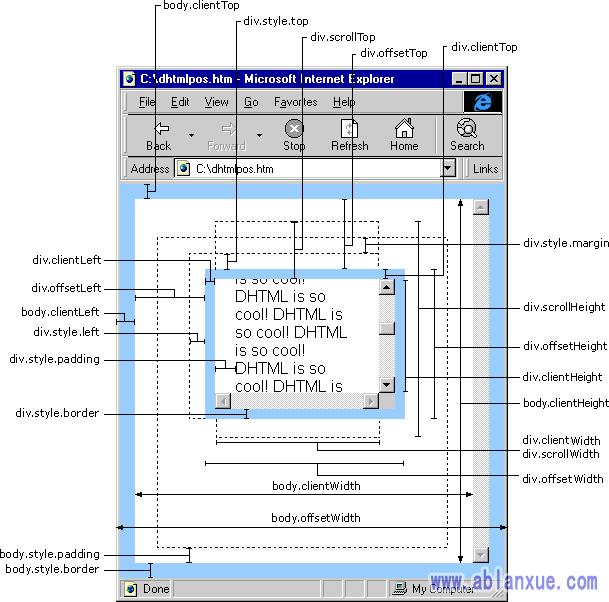

目前我所做的效果还不是很完善，只是实现了滑动滑动条到一定位置时以动画的效果显示出不同的元素。但懒加载的原理与实现此效果是相同的，只是滑动到最底部或者接近底部时添加新的内容或者添加图标，或者也可以是点击某个按钮来实现添加元素的效果。

这里由于我们是以滑动滑动条的方式来实现，所以将一些从网上找的 API 摘录到这里：

首先是这张图：



[来源](https://segmentfault.com/a/1190000014293962)

然后是一些关于获取滚动条位置的 API 和获取整个页面大小的 API：

- **获取scrollTop值**：

  ```js
  var scrollTop = document.documentElement.scrollTop || window.pageYOffset || document.body.scrollTop;
  ```

- 获取页面高度：window.innerHeight

- 获取整个 scroll 的高度（可能需要实现兼容问题）：document.documentElement.scrollHeight