## 经验没学到，厚黑一大堆，话说，年轻人职场的真实困扰到底是什么？ | 好奇心研究所

)

潘姜汐熹

2017 年 3 月 10 日

> [原文地址](http://www.qdaily.com/articles/38349.html#)

市面上看起来似乎有那么点根据而且还很唬人的职场残酷物语，不太容易被识破，还相当有市场，为什么它们是错的？

在互联网上流传的说法里，职场的面目可以说是狰狞了。

你不妨数数看，残酷、厮杀、剑拔弩张、暗流涌动，还有那句著名的“没有永远的朋友，也没有永远的敌人，只有永远的利益”，总之那些描述战场的紧张词句，几乎都会被人们套用在职场上。国外的影视剧里，还有人专门给自己的职场劲敌列了个名单，起了个很吓人的名字叫 office hit list—— “办公室谋杀名单”。

关于职场的水到底有多深，你当然是不会信上班就是谈恋爱的国产影视剧——“无理取闹凶老板两句老板就爱上你，老板像你一样没脑子吗？再说了，整天搞暧昧不用做事的啊？”

但像上面那些看起来似乎有那么点根据，而且还很唬人的职场残酷物语，就不那么容易被识破，还相当有市场：各种阅读量超高的“老板最爱听的10句话”类厚黑指南、“国企勾心斗角注意事项”类职场宫心计，即使如此煎熬，也要“心若在梦就在”的鸡汤，还有“职场不相信眼泪，实习的真相就是拿外卖”类毒鸡汤，灌完鸡汤灌毒鸡汤，走火入魔没在怕的。

他们热衷于教你一些话术和马屁术，而话术本身不是陈词滥调就是胡扯：

比如，谁都好面子，说话的时候你必须去体察周围的气氛和对方的情绪，要对老板和客户察言观色，尽量少说“但是”，代之以“同时”什么的。

还有一套自成体系的胡说八道，10 招独门绝技“搞定”你老板：Step 1 尊重老板，Step 2 把老板当客户，Step 3 利用老板……一点用也没有，还很猥琐。

把职场形容成战场、宫斗，无限放大正常的资源竞争，营造一种人人自危步步为营的癫狂氛围，让你为“职场无朋友，信一次栽一次”、“上司人前夸你越多，你拿的好处就越少”、“理想很重要，但比理想更重要的是生存”这种语焉不详的庸俗毒鸡汤买账。

说起来，难道不是那帮以为有经验有话语权的人吓唬大学生的吗？

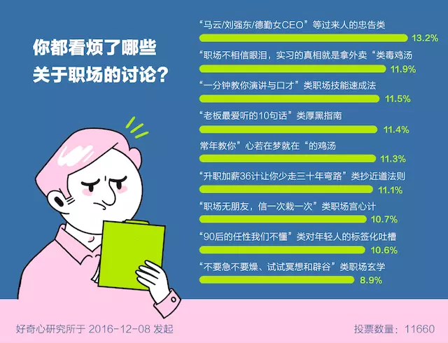

所以职场其实长啥样？根据好奇心研究所此前关于职场的一系列调查和好奇心日报的相关报道，我们梳理了 11 条似是而非的职场传言：

### 1. 简历里一定要会包装自己，同样经历换个高级表述就能脱颖而出哦

面经泛滥的求职季，“如何用高大上的词汇炮制一份（你自己也不信）的高级简历”是很受欢迎的。

然而，一个真相是，你能想到的高级表述，HR 们很可能早就看吐了。

[LinkedIn 上个月发布的 2016 年全球简历滥用词榜单说](http://blog.linkedin.com/2017/january/25/better-than-buzzwords-2017-is-the-year-to-start-showing-it-linkedin)，“精通（specialized）”“领导力（leadership）”和“富有激情（passionate）”是用户简历里出现最多的三个词，此外“有创新精神（creative）”、“有战略思维（strategic）”、“经验丰富（experienced）”这些大话也都是年年上榜，看起来，每年的职场新人或者在原单位干不下去的朋友都在沾沾自喜地做着一样的傻事。

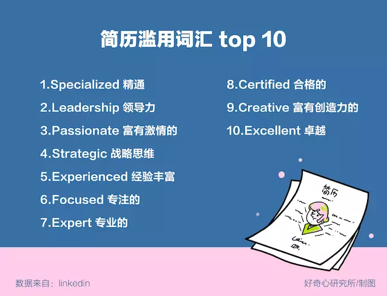

### 2. 职场穿衣事关体面，必须先下血本置装才能安心入职

每到求职季，那些已经被职场公众号抢占了先机的公众号只能教你求职穿搭。而他们没有告诉你的真相是，如果带有出奇制胜的邪念，购买了自己完全驾驭不了或者脱离职位实际需要的服饰，很有可能造成审美上的惨剧，给同事留下“好像偷穿爸爸的西装上班”之类的第一印象。

从我们的调查来看，如果不是 dress code 非常严格的公司，其实基本的东西先搞搞好最要紧，比如保持洁净，在好奇心研究所一项名为[“在工作场合，你觉得什么样子的打扮无法接受”](http://www.qdaily.com/mobs/1190.html)的调查里，超过五分之一的人最不能接受的不是穿错衣服，而是“身上有异味”。

### 3. 职场处处潜规则，想要立足必须拉帮结伙，要么献策要么献身，总之不可描述

办公室遍布眼珠骨碌碌转的小报告爱好者、年轻美貌受到老板亲自提携的傻白甜……

这种对职场的猥琐误会多半来自职场小说/电视剧。

我们发现，年轻人们真正普遍遇到的职场潜规则更可能是一些[没人会教你，但真的很难拿得准的约定俗成](http://www.qdaily.com/mobs/1427.html)，比如：

“怎样称呼比自己资深的同事？直呼其名还是叫哥/姐/老师？”

“用微信聊工作和有事就打电话，到底哪个是不礼貌？”

“接洽对方的名字实在分辨不出性别，到底应该怎么称呼？”

”所有相关邮件都抄送整个项目组的人，是打扰还是必要的团队合作？”

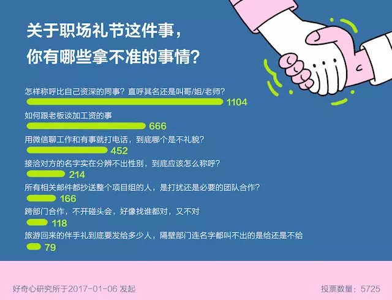

### 4. 领导骂你是对你好，承受不了这点压力就是不成熟

这种说法比较古早，来自于爸妈那个用严厉叱骂来表示信任和喜爱的年代。现如今，成熟也不是心甘情愿挨臭骂：

在好奇心研究所的[“测测你的热爱工作指数”](http://www.qdaily.com/tots/1318.html)中，12487 人次参与调查，其中 78% 的朋友对直属领导的夸奖很在意。另一项人力资源公司万宝盛华报告也说，除了钱之外，被认可和肯定对年轻人来说也是必要的，全球 50% 年轻人因不被赏识和认可而最终离职，在中国这个数据是 36%。自食其力的大人也需要被表扬。

### 5. 办公室政治就是勾心斗角，不参与就会被孤立

人们身处不同职位，各有立场和需求，办公室政治其实是从中协调的工具，它本身是中性的，虽然会有人选择无事生非或溜须拍马，但那不是办公室政治的全部。

我们发现，[人们更常遇到的办公室政治可能是这样的](http://www.qdaily.com/mobs/1183.html)：加薪升职不止靠业绩，也要向上司主动争取；部门和部门间有微妙的歧视链，找别的部门办事可能会被踢皮球；总是需要通过白纸黑字的契约达成协定而不能靠口头承诺；和同事、上司维持在适当的距离等等。

你不应该被办公室变成一个老油条，理想状况是从职场学会硬技能， professional 指数加成，学会保护自己合法合理的利益，同时情商值 levels up。

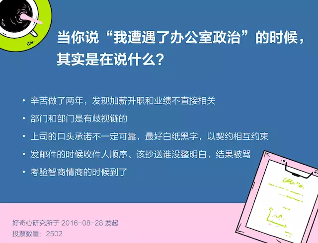

### 6. 会讨好老板会邀功会耍手腕就掌握了职场情商的精髓

讨好老板的话术与其说是情商，不如说是“滑商”——职场油滑指数。

事实上[人们认可的职场“高情商”](http://www.qdaily.com/mobs/1109.html)是什么？

分内事情做好，分外事情不问；

认真对待工作，有担当有责任感，不吐槽不带来负能量，能和同事平等友好相处。

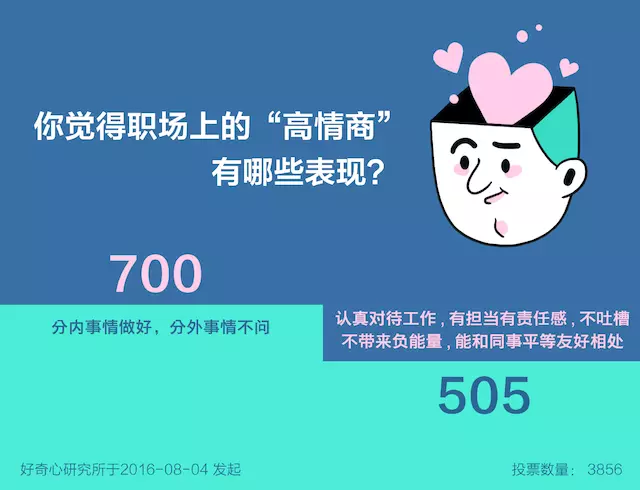

### 7. Soho 超酷，足不出户就能赚钱，Awesome！

有关职场的美好想象，介绍一些“人人都想要的工作”可能是一种固定门类，从这些故事里，我们能看到不用通勤的 soho 一族，主要工作就是住酒店的试睡一族之类。

但事实上我们难以从中了解这些梦幻工作的真相。我们通常只看到不用通勤不用早起的惬意，却没有料到在家上班同时意味着全天都是上班时间；没人说话，寂寞到和落在窗口的小鸟聊天；没运动量，懒得动弹，soho 最后往往会变成 sobo（small office，bed office）“在床办公”，腰酸背痛，一点都不 awesome，甚至还有点 awful。

[一项研究刊登在美国心理学协会期刊上的研究](http://psi.sagepub.com/content/16/2/40.full.pdf+html)说，每周在家工作两天是最能提高工作满意度的，超过两天，就没有那么显著的效果了。

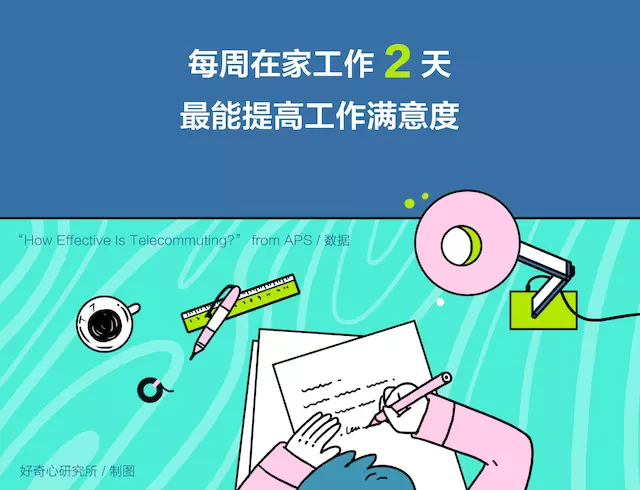

### 8. 跨行业、多技能的斜杠青年在职场上很吃香

斜杠青年概念来源于英文“Slash”，出自 2007 年《纽约时报》专栏作家 Marci Albohe 的书《One Person / multiple careers》，指拥有多重职业身份并用斜杠将它们区分开的人。

但很多国内年轻人却热衷把它变成堆砌爱好标签的自嗨，比方说，“二狗，事业单位摸鱼能手/未遂设计师/白日梦想家/小龙虾剥壳大赛冠军/饭醉分子……”

然而职场主要看重的仍然是专业技能，要是相互关联的技能还有意义，但如果是无关技能的兴趣爱好，写得再花哨也不要天真地以为用人单位会买账。

一项技能达到真正熟练的一万小时定律仍然是必要的，万宝盛华的调查结果显示，[80% 的中国年轻人都认可持续提升工作技能才是自身未来职业发展的关键。](http://www.qdaily.com/articles/27363.html)

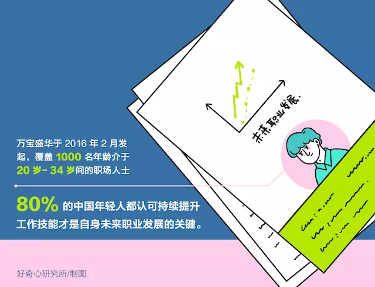

### 9. 单位人性化，你看都有人放偷懒假、男士产假、女士大姨妈假了

以上可能是职场类媒体或者公众号的一种黔驴技穷，搬运一些境外公司职场福利惹人眼馋。说真的，与其讨论别人家的福利，不如告诉我到底怎么请年假。

在好奇心研究所名为[“你去年的年假为啥没休完的”](http://www.qdaily.com/papers/done/33034/113455.html)调查中，1648 名受访者中有 20.4% 表示是因为没人能够接手休假期间的工作，6.5% 感到时间紧迫，担心休了年假就完不成 KPI，做不完的的工作一直都在，休不完的年假却会作废，令人沮丧。还有 13.0% 的朋友无法心安理得地请假，怕被老板质疑“你最近没事做吗？”

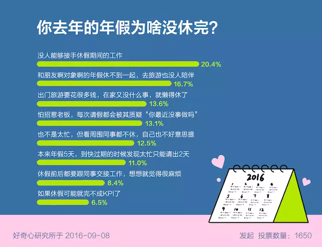

### 10. 有些行业是青春饭，天天熬夜加班过劳死概率超大

年轻人是真的很拼，相比数前代， 现在 20-34 岁年轻人的工作时长是史无前例的。[万宝盛华的全球调查结果显示 84% 受访者每周工作超过 40 小时，30% 甚至每周工作 50 小时以上，相当于工作日每天 10 个小时不间断地工作](http://www.qdaily.com/papers/done/33034/113455.html)。而且自从大家习惯用微信工作后，常常就要24小时 standby，很苦。

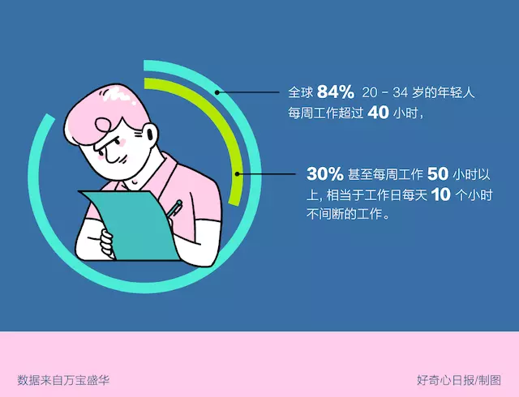

但除了真忙，其实还有以下两种情形：分别是把分分钟的工作总结成几个小时才能完成的，和把分分钟的工作拖成几个小时才能完成的。

越是不想干活儿越追求仪式感，把干活儿之前的拖延视为一种必要的情绪酝酿，装模作样等待“整点”，结果陷入“一定要等到整点才能停止摸鱼开始工作，而总是控制不住超出一两分钟于是只好等下一个整点”的怠工死循环。

一位设计师用图表的方式吐槽过自己的工作状态，从早上八点到晚上八点都在无所事事，半夜三点秒变梵高，也并不是故意要熬夜，只是因为， 70% 的时间都用来刷剧了。

### 11. 你的工作马上就要被机器人取代了，夕阳产业不走就死

不同科研或者学术机构每隔一段时间就会发几篇“机器人替代人工”的预警报告，再由媒体取一个耸动的标题，引发年复一年的争议。

[好奇心日报记者查阅近 60 年来有关“机器/机器人/自动化/人工智能取代人工”的论文、报告和媒体报道之后发现，有 30 多种职业已经被宣判过至少一次死刑，包括行政文员、财务、手艺人、客服、中介……但现在它们多数还是好好的](http://www.qdaily.com/articles/30302.html)。

科技摧毁了一些原有的职位，但却催生了新的，不要怕！

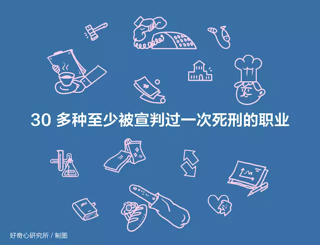

作为大多数成年人生活场景的三分之一，职场日常并没有厚黑学残酷物语告诉你的那么水深火热，再说，根据日本经济新闻的报告，现如今大多数中国年轻人工作更多是为了“富裕起来”，而不是为了基本生存所需，即使身处一个难以适应的环境也没必要硬撑，跳个槽能有多大的事。

人们也确实是这么操作的，[Linkedin 2014 年发布的《中国职场人士跳槽报告》](http://www.qdaily.com/articles/3192.html)显示，中国职场人士越来越放荡不羁爱自由，即使不跟疯狂工作的日本人相比，只跟看起来轻松愉快的美国人相比，都心思活络许多。调查的两国职场人士平均在职时间来看，中国职场人士坚守同一个岗位的时间仅为 34 个月。但相比之下，美国人则会在同一岗位待上 56 个月。

虽然没那么苦兮兮，但上班嘛，毕竟也没有那么轻松，我们发现年轻人在职场上会遇到的真实困扰可能来自于以下 5 个方面：

### 1. 求职时的福利陷阱

对于职场新人，五险一金的缴纳金额可能是比双十一优惠规则更难搞懂的算数黑洞。在我所名为“工作之后，你觉得这份工作和你之前对它的预想有啥区别”的调查中，位列第一的选项就是“ Offer 上的工资扣完五险一金之后原来只剩这么点”，招聘启事上说明是“具有行业竞争力的待遇”最后拿到手往往是一份让你怀疑行业就这么江河日下了的待遇。

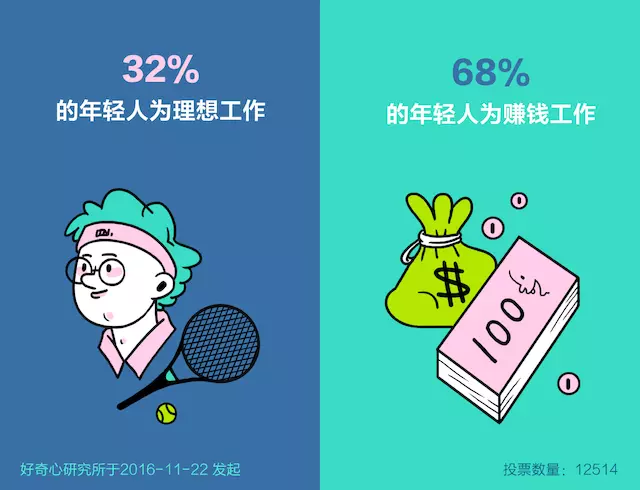但年轻人真的还挺在意待遇的

除此之外的福利政策也常常让人费解，尤其是擅长蛊惑人心的创业公司，其招聘帖上的用词都必须经过二次翻译，比如“全弹性工作制 ，干活凭良心”，说的是“弹性大到不保证半夜不需要干活，但如果半夜不干活就是没良心”，“提供股票期权”是“钱少发一点也不许闹，因为我们要上市的呢，短视者请走不送”，声称提供“年度旅游”则要从公司规模推断，天使轮也就是去趟铁岭，别太当真。如果看到对方喜滋滋地把“办公室有猫”写进招聘启事，基本可以判定：该公司不仅很小，而且真的真的真的没有其他像样的福利了。

### 2. 永远不能对症下药的入职培训

进入一个新单位，你迫切需要了解的可能是财务报销流程、哪里有性价比高的午市套餐、甲方和乙方到底谁是谁、部门和部门之间的鄙视链详情，以及到底几点才是大家公认的下班时间等等，但以上这些，统统不会出现在老板热情洋溢的催眠演说里。结果由于羞于询问如何打印复印最后把草稿发到了老板办公室的打印机；跟客户签合同，在甲方一栏痛快签下自己名字……被同事笑话一年。

### 3. 越心虚越是花式装忙

[一项有 6193 人参与的好奇心研究所调查显示，很多人都会对自己的职场能力感到心虚](http://www.qdaily.com/papers/done/1627/50268.html)，15% 的朋友觉得自己能力配不上学历，14.3% 的年轻人很怂，从不敢大声说出自己的意见。而人们应对职场心虚的办法则主要是，总感觉需要装忙。

另一项名为[“你发现职场上最实用的技能其实是什么”](http://www.qdaily.com/mobs/1118.html)的调查中，除了纲领性的“不说硬话，不做软事”，大家还选出了各种具体的花式装忙手法，比如把分分钟的工作总结成几个小时才能完成的；报告里把平淡无奇说成百花齐放；掌握各种不露声色晒加班的方法等等。而那些真正事关业务的技能点，比如公开演讲不哆嗦，制作可视化信息图表，和陌生人打交道之类的，却始终停留在“好想学”的阶段。

### 4. 后生可畏式焦虑

在[“你觉得职场上比你更年轻的人有啥特点”](http://www.qdaily.com/mobs/1233.html)的问卷中，人们对职场上的新生代的判断大多是正向的，比如见多识广、心思活络、能力强等等。读者@廖洁云Joanna 在调查里充分表达了她的忧虑，“他们聪明又勤奋，主动学习的意识很强，互联网时代资讯的获取又极为容易，稍用点心就可以见多识广，视野开阔，并且比那时的我们更知道自己要的是什么，有时候真觉得现在毕业两三年的年轻人跟工作十年的我没有太大差距，自己的职场价值岌岌可危”。

### 5. 变相加班，休息不好最闹心

好奇心研究所此前做过一项名为[“测测你的热爱工作指数？](http://www.qdaily.com/tots/1318.html)”的调查，共收获了 10498 次表态。在这组总分为 8 分的题目中，男性们普遍预估自己的得分为 4.55 ，而平均实际得分为 3.75；女性普遍预估自己的得分为 4.51，而平均实际得分为 3.51。分数越高代表越热爱工作，平均来看，人们的工作态度更偏向“上班如上坟”。

最戳心的莫过于得不到应有的休息： 82% 的人对“休年假的时候还要继续工作”这件事情表现出了强烈愤怒；遇到“ 8 点了还要加班两个小时”这种紧急情况，只有不到三分之一的人是心甘情愿的。

[年轻人最讨厌的职场客套是变相催加班](http://www.qdaily.com/papers/1392.html)，下午五点半突然得知“不用着急，报告今天给我就行”几乎要原地爆炸；

[年轻人最希望单位附近具有的配套设施](http://www.qdaily.com/mobs/832.html)是“有 Wi-Fi，能小睡，办张包月卡每天能睡两小时的午休店”；

[年轻人对当下工作的最大不满则是“六点到了为什么没人敢先走”，](http://www.qdaily.com/mobs/479.html)单位实际下班时间相当于规定下班时间的买家秀。

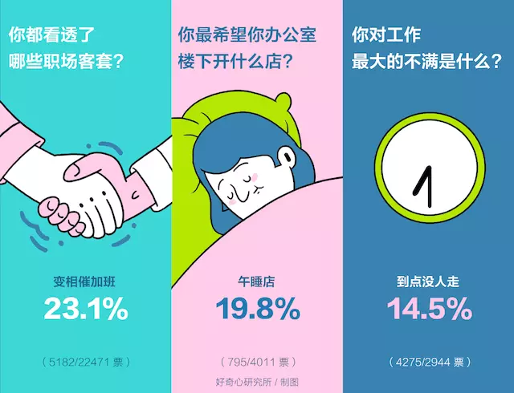

职场固然有可能险恶，但是和现实脱离太远的职场电视剧往往放大和扭曲了职场的矛盾，而听从各种鸡贼的职场厚黑学，结果也无非是囿于“职场小白秒变精英”的庸俗想象。

事实上大多数时候，职场上的人们操心的都是真实的小烦恼，以上我们观察到的职场真面目，其实跟生活本人差不多——有苦头，但也没有传说中那么糟。

总的来说，职场不是什么极端凶险之地，辨清以上的职场真相，希望有助于缓解职场新人们的焦虑。

是的，别太焦虑了。

不过，你手上工作 deadline 是不是又快到了？

> 题图、插图均来自：林小妖

*好奇心研究所**是好奇心日报的一个调查栏目，这是一个探讨各种生活方式问题的互动平台，它针对的可能是生活方式的变化和潮流，也可能是某个品牌的服务。你可以在这里投票、吐槽、表明态度。*

- [职场](http://www.qdaily.com/tags/135.html)
- [好奇心研究所](http://www.qdaily.com/tags/11405.html)
- [长文章](http://www.qdaily.com/tags/1068.html)