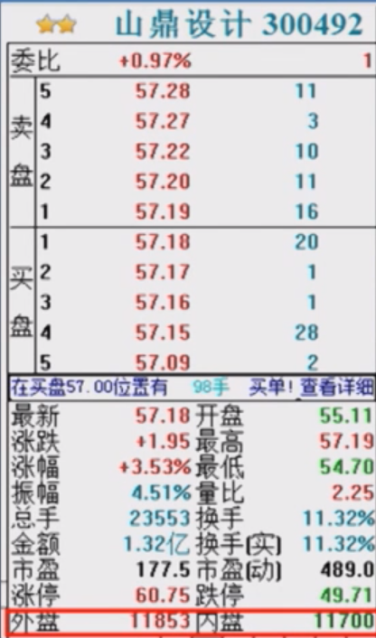

# 金融概念

[TOC]

## 内盘外盘

> [百度百科](https://baike.baidu.com/item/%E5%86%85%E7%9B%98%E5%A4%96%E7%9B%98)

[内盘外盘](https://baike.baidu.com/item/%E5%86%85%E7%9B%98%E5%A4%96%E7%9B%98/9207063)，股市术语。内盘常用S（取英文 sell [sel] 卖出 的首字母S）表示，外盘用B（取英文buy [baɪ] 买入 的首字母B）表示。

内盘：以买入价格成交的数量，即卖方主动以低于或等于当前买一、买二、买三等价格下单卖出股票时成交的数量，用绿色显示。内盘的多少显示了空方急于卖出的能量大小。

外盘：以卖出价格成交的数量，即买方主动以高于或等于当前卖一、卖二、卖三等价格下单买入股票时成交的数量，用红色显示。外盘的多少显示了多方急于买入的能量大小。

### 财学堂

有些个股在买卖时会有个原则：价格优先、时间优先。

非常好理解：

- 价格优先
  - 你挂买单，你价格越高档位越高则优先成交。相反，你挂卖单，则价格越低档位越高则优先成交。
- 时间优先
  - 在相同的价格情况下，越早挂单越先成交。

内盘与外盘是建立在这两个基础之上的。

#### 外盘

**以卖出价格成交的数量**，即**买方** *主动*以高于或等于当前卖一、卖二、卖三等价格下单买入股票时成交的数量，用红色显示。

比如，当你挂一个 10 元的买单，但卖一档是 10.1 元，没有人愿意以更低的价格卖，此时你又非常想要购买股票，所以你将你的买单提高到 10.1 元来匹配卖一档从而成交。说明你更想买票。

- 这种博弈之间，你作为买方是输的一方，但这样的结果越多则股价越来越高。

- 外盘的多少显示了多方（买方）急于买入的能量大小

#### 内盘

**以买入价格成交的数量**，即**卖方**主动以低于或等于当前买一、买二、买三等价格下单卖出股票时成交的数量，常用绿色显示。

比如，当你挂一个 10 元的卖单，但买一档是 9.9 元，没有人愿意以更高的价格买，此时你又非常想要购买股票，所以你将你的卖单降到 9.9 元来匹配买一档从而成交。说明你更想卖票。

- 这种博弈之间，你作为卖方是输的一方，这样的结果越多则股价会压越低。

- 内盘的多少显示了空方（卖方）急于卖出的能量大小

> - 股票交易可以看做是空方与多方之间的博弈。
> - 注意是「主动」，但并不等于一定的主动，因为存在挂单匹配成交的情况。

#### 外盘内盘统计方法

如果说外盘过多相当于买的人更急切，而内盘过多则相当于卖的人更急切。

外盘过多，股价水涨船高。内盘过多，股价越来越低。

- 委托以卖出价格成交的纳入“外盘”
- 委托以买入价格成交的纳入“内盘”
- 外盘——又称主动性买盘，即以卖出价成交的累计成交量。
- 内盘——又称主动性卖盘，即以买入价成交的累积成交量。
- 外盘反映主动买的意愿，内盘反映主动卖的意愿。

用法：

- 内盘，外盘这两个数据，大体可以用来判断买卖力量的强弱。
- 若外盘数量大于内盘，则表现买方力量较强。
- 若内盘数量大于外盘，则说明卖方力量较强。

